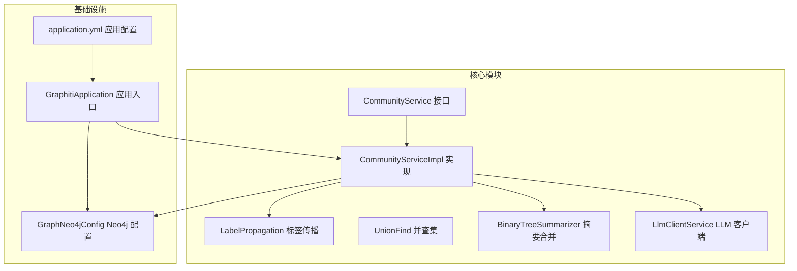
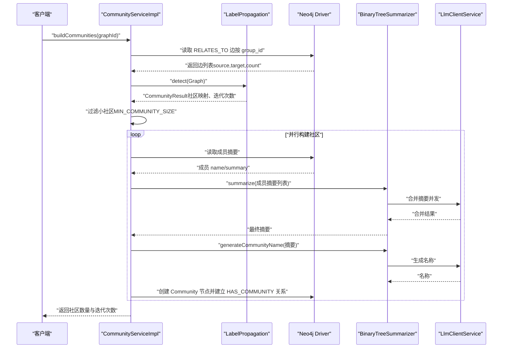
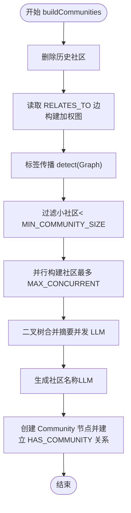
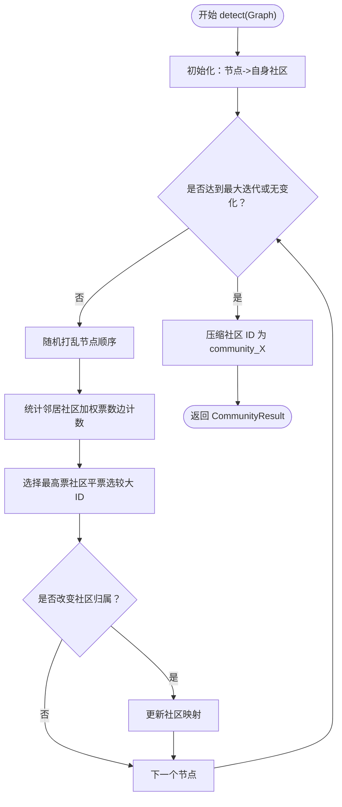
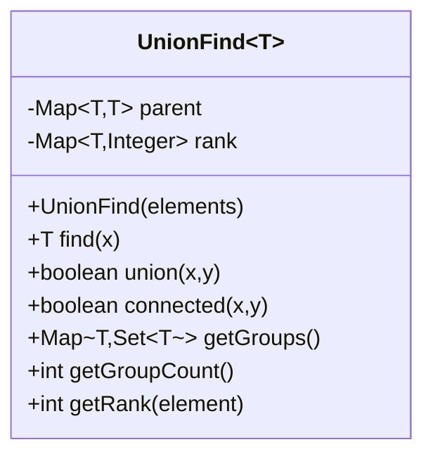
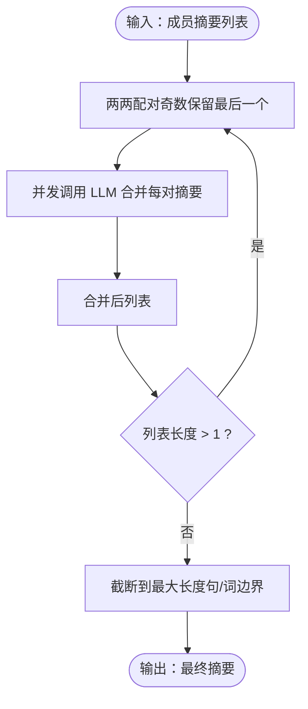
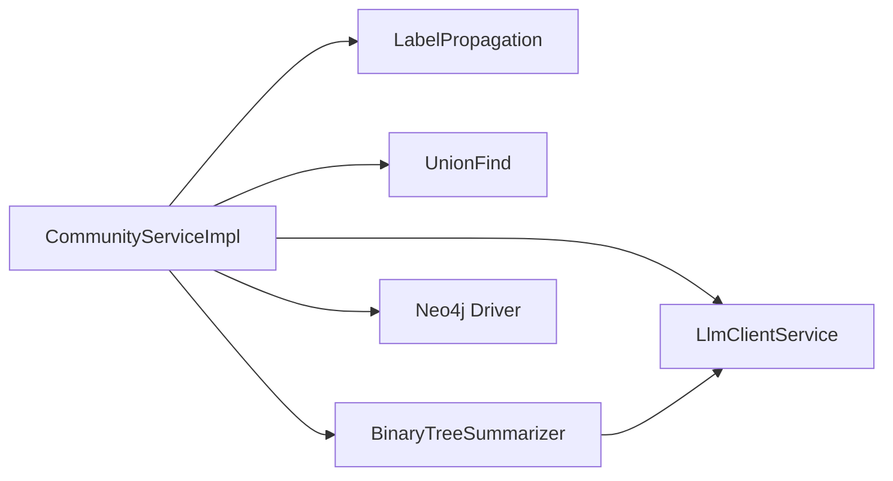

# 社区发现算法

<!--<cite>
**本文引用的文件**   
- [CommunityServiceImpl.java](file://graphiti-module-core/src/main/java/com/graphiti/module/graphiti/service/impl/CommunityServiceImpl.java)
- [LabelPropagation.java](file://graphiti-module-core/src/main/java/com/graphiti/module/graphiti/util/LabelPropagation.java)
- [UnionFind.java](file://graphiti-module-core/src/main/java/com/graphiti/module/graphiti/util/UnionFind.java)
- [BinaryTreeSummarizer.java](file://graphiti-module-core/src/main/java/com/graphiti/module/graphiti/util/BinaryTreeSummarizer.java)
- [CommunityService.java](file://graphiti-module-core/src/main/java/com/graphiti/module/graphiti/service/CommunityService.java)
- [LlmClientService.java](file://graphiti-module-core/src/main/java/com/graphiti/module/graphiti/service/LlmClientService.java)
- [GraphNeo4jConfig.java](file://graphiti-module-core/src/main/java/com/graphiti/module/graphiti/config/GraphNeo4jConfig.java)
- [GraphitiApplication.java](file://graphiti-server/src/main/java/com/graphiti/GraphitiApplication.java)
- [application.yml](file://graphiti-server/src/main/resources/application.yml)
</cite>-->

## 目录
1. [简介](#简介)
2. [项目结构](#项目结构)
3. [核心组件](#核心组件)
4. [架构总览](#架构总览)
5. [详细组件分析](#详细组件分析)
6. [依赖分析](#依赖分析)
7. [性能考量](#性能考量)
8. [故障排查指南](#故障排查指南)
9. [结论](#结论)
10. [附录](#附录)

## 简介
本文件围绕社区发现算法系统进行深入技术文档化，重点覆盖以下方面：
- 基于标签传播算法（Weighted Label Propagation）与图结构的社区检测流程
- 使用并查集（Union-Find）进行动态连通性检测与批量实体规范映射
- 结合二叉树合并摘要策略与 LLM 的社区摘要生成与命名
- 社区质量评估指标、参数调优建议、性能优化策略
- 图网络分析、社区边界识别、层次化社区结构等高级功能
- 算法流程图、性能基准测试建议、使用示例与参数配置指南
- 故障排查方法与最佳实践

## 项目结构
社区发现相关代码位于模块 core 的 service 与 util 包中，并通过 Spring Boot 配置连接 Neo4j 与 LLM 客户端服务。

图表来源
- [CommunityService.java](file://graphiti-module-core/src/main/java/com/graphiti/module/graphiti/service/CommunityService.java)
- [CommunityServiceImpl.java](file://graphiti-module-core/src/main/java/com/graphiti/module/graphiti/service/impl/CommunityServiceImpl.java)
- [LabelPropagation.java](file://graphiti-module-core/src/main/java/com/graphiti/module/graphiti/util/LabelPropagation.java)
- [UnionFind.java](file://graphiti-module-core/src/main/java/com/graphiti/module/graphiti/util/UnionFind.java)
- [BinaryTreeSummarizer.java](file://graphiti-module-core/src/main/java/com/graphiti/module/graphiti/util/BinaryTreeSummarizer.java)
- [LlmClientService.java](file://graphiti-module-core/src/main/java/com/graphiti/module/graphiti/service/LlmClientService.java)
- [GraphNeo4jConfig.java](file://graphiti-module-core/src/main/java/com/graphiti/module/graphiti/config/GraphNeo4jConfig.java)
- [GraphitiApplication.java](file://graphiti-server/src/main/java/com/graphiti/GraphitiApplication.java)
- [application.yml](file://graphiti-server/src/main/resources/application.yml)

章节来源
- [CommunityService.java](file://graphiti-module-core/src/main/java/com/graphiti/module/graphiti/service/CommunityService.java)
- [CommunityServiceImpl.java](file://graphiti-module-core/src/main/java/com/graphiti/module/graphiti/service/impl/CommunityServiceImpl.java)
- [LabelPropagation.java](file://graphiti-module-core/src/main/java/com/graphiti/module/graphiti/util/LabelPropagation.java)
- [UnionFind.java](file://graphiti-module-core/src/main/java/com/graphiti/module/graphiti/util/UnionFind.java)
- [BinaryTreeSummarizer.java](file://graphiti-module-core/src/main/java/com/graphiti/module/graphiti/util/BinaryTreeSummarizer.java)
- [LlmClientService.java](file://graphiti-module-core/src/main/java/com/graphiti/module/graphiti/service/LlmClientService.java)
- [GraphNeo4jConfig.java](file://graphiti-module-core/src/main/java/com/graphiti/module/graphiti/config/GraphNeo4jConfig.java)
- [GraphitiApplication.java](file://graphiti-server/src/main/java/com/graphiti/GraphitiApplication.java)
- [application.yml](file://graphiti-server/src/main/resources/application.yml)

## 核心组件
- 社区服务接口与实现：定义社区构建、查询、搜索与清理的统一入口，封装标签传播与摘要生成的业务流程。
- 标签传播算法：基于加权邻居投票的社区检测，支持随机遍历与平票策略，输出社区成员映射与迭代次数。
- 并查集：提供路径压缩与按秩合并的动态连通性检测，适用于批量实体去重与规范映射。
- 二叉树摘要合并：以二叉树方式两两合并摘要，结合 LLM 生成最终社区摘要与名称，支持并发控制与降级策略。
- LLM 客户端：抽象不同 LLM Provider 的统一调用接口，支持聊天、批量聊天与结构化解析。
- Neo4j 配置与应用入口：提供驱动创建、配置加载与运行入口，支撑图数据读取与写入。

章节来源
- [CommunityService.java](file://graphiti-module-core/src/main/java/com/graphiti/module/graphiti/service/CommunityService.java)
- [CommunityServiceImpl.java](file://graphiti-module-core/src/main/java/com/graphiti/module/graphiti/service/impl/CommunityServiceImpl.java)
- [LabelPropagation.java](file://graphiti-module-core/src/main/java/com/graphiti/module/graphiti/util/LabelPropagation.java)
- [UnionFind.java](file://graphiti-module-core/src/main/java/com/graphiti/module/graphiti/util/UnionFind.java)
- [BinaryTreeSummarizer.java](file://graphiti-module-core/src/main/java/com/graphiti/module/graphiti/util/BinaryTreeSummarizer.java)
- [LlmClientService.java](file://graphiti-module-core/src/main/java/com/graphiti/module/graphiti/service/LlmClientService.java)
- [GraphNeo4jConfig.java](file://graphiti-module-core/src/main/java/com/graphiti/module/graphiti/config/GraphNeo4jConfig.java)
- [GraphitiApplication.java](file://graphiti-server/src/main/java/com/graphiti/GraphitiApplication.java)

## 架构总览
社区发现系统采用“算法层 + 数据层 + 语言模型层”的分层设计：
- 算法层：标签传播与并查集负责社区检测与动态连通性
- 数据层：Neo4j 驱动负责图数据的读取与写入
- 语言模型层：LLM 客户端负责摘要合并与社区命名

图表来源
- [CommunityServiceImpl.java](file://graphiti-module-core/src/main/java/com/graphiti/module/graphiti/service/impl/CommunityServiceImpl.java)
- [LabelPropagation.java](file://graphiti-module-core/src/main/java/com/graphiti/module/graphiti/util/LabelPropagation.java)
- [BinaryTreeSummarizer.java](file://graphiti-module-core/src/main/java/com/graphiti/module/graphiti/util/BinaryTreeSummarizer.java)
- [LlmClientService.java](file://graphiti-module-core/src/main/java/com/graphiti/module/graphiti/service/LlmClientService.java)
- [GraphNeo4jConfig.java](file://graphiti-module-core/src/main/java/com/graphiti/module/graphiti/config/GraphNeo4jConfig.java)

## 详细组件分析

### 社区服务实现（CommunityServiceImpl）
职责与流程：
- 清理历史社区
- 从 Neo4j 读取指定 group_id 的实体与关系，构建加权图
- 调用标签传播算法得到社区映射
- 使用二叉树摘要合并策略生成社区摘要与名称
- 并发创建社区节点并建立成员关系
- 提供社区列表、搜索与删除能力

关键参数与行为：
- 最大并发构建社区数
- 社区节点最小成员数
- 迭代次数与社区数量记录

图表来源
- [CommunityServiceImpl.java](file://graphiti-module-core/src/main/java/com/graphiti/module/graphiti/service/impl/CommunityServiceImpl.java)
- [BinaryTreeSummarizer.java](file://graphiti-module-core/src/main/java/com/graphiti/module/graphiti/util/BinaryTreeSummarizer.java)

章节来源
- [CommunityServiceImpl.java](file://graphiti-module-core/src/main/java/com/graphiti/module/graphiti/service/impl/CommunityServiceImpl.java)
- [CommunityService.java](file://graphiti-module-core/src/main/java/com/graphiti/module/graphiti/service/CommunityService.java)

### 标签传播算法（LabelPropagation）
算法要点：
- 初始化：每个节点自成一社区
- 迭代：对节点邻居进行加权投票（边计数作为权重）
- 平票策略：若最高票数相同，选择社区 ID 更大的
- 收敛：达到最大迭代次数或无变化停止
- 输出：压缩社区 ID 为连续整数，便于存储与展示

图表来源
- [LabelPropagation.java](file://graphiti-module-core/src/main/java/com/graphiti/module/graphiti/util/LabelPropagation.java)

章节来源
- [LabelPropagation.java](file://graphiti-module-core/src/main/java/com/graphiti/module/graphiti/util/LabelPropagation.java)

### 并查集（UnionFind）
用途：
- 动态连通性检测与集合合并
- 批量实体去重与规范映射（如将多个 UUID 映射到统一规范 ID）

特性：
- 路径压缩：find 时将路径上节点直接指向根
- 按秩合并：union 时将较小秩合并到较大秩，保持树平衡

图表来源
- [UnionFind.java](file://graphiti-module-core/src/main/java/com/graphiti/module/graphiti/util/UnionFind.java)

章节来源
- [UnionFind.java](file://graphiti-module-core/src/main/java/com/graphiti/module/graphiti/util/UnionFind.java)

### 二叉树摘要合并（BinaryTreeSummarizer）
策略：
- 将摘要列表两两配对，使用 LLM 合并
- 并发执行，指数级减少摘要数量
- 支持带上下文的合并
- 截断策略：在句/词边界截断，避免超长摘要
- 降级策略：LLM 失败时回退为简单拼接

图表来源
- [BinaryTreeSummarizer.java](file://graphiti-module-core/src/main/java/com/graphiti/module/graphiti/util/BinaryTreeSummarizer.java)
- [LlmClientService.java](file://graphiti-module-core/src/main/java/com/graphiti/module/graphiti/service/LlmClientService.java)

章节来源
- [BinaryTreeSummarizer.java](file://graphiti-module-core/src/main/java/com/graphiti/module/graphiti/util/BinaryTreeSummarizer.java)
- [LlmClientService.java](file://graphiti-module-core/src/main/java/com/graphiti/module/graphiti/service/LlmClientService.java)

### LLM 客户端（LlmClientService）
能力：
- 统一聊天接口（支持系统提示词与结构化解析）
- 批量聊天
- 内容摘要、社区摘要生成
- 实体与关系抽取

章节来源
- [LlmClientService.java](file://graphiti-module-core/src/main/java/com/graphiti/module/graphiti/service/LlmClientService.java)

### Neo4j 配置与应用入口
- GraphNeo4jConfig：从配置文件读取连接信息，创建 Driver Bean
- GraphitiApplication：Spring Boot 启动类，排除部分自动配置
- application.yml：应用配置，包含日志、Actuator、Swagger 等

章节来源
- [GraphNeo4jConfig.java](file://graphiti-module-core/src/main/java/com/graphiti/module/graphiti/config/GraphNeo4jConfig.java)
- [GraphitiApplication.java](file://graphiti-server/src/main/java/com/graphiti/GraphitiApplication.java)
- [application.yml](file://graphiti-server/src/main/resources/application.yml)

## 依赖分析
- CommunityServiceImpl 依赖：
  - Neo4j Driver：读取图数据与写入社区节点
  - LabelPropagation：执行社区检测
  - BinaryTreeSummarizer：生成摘要与命名
  - LlmClientService：调用 LLM
- LabelPropagation 为纯算法类，无外部依赖
- UnionFind 为通用数据结构，无外部依赖
- BinaryTreeSummarizer 依赖 LlmClientService 与固定线程池
- LlmClientService 为接口，具体实现由 Spring AI 配置决定

图表来源
- [CommunityServiceImpl.java](file://graphiti-module-core/src/main/java/com/graphiti/module/graphiti/service/impl/CommunityServiceImpl.java)
- [LabelPropagation.java](file://graphiti-module-core/src/main/java/com/graphiti/module/graphiti/util/LabelPropagation.java)
- [UnionFind.java](file://graphiti-module-core/src/main/java/com/graphiti/module/graphiti/util/UnionFind.java)
- [BinaryTreeSummarizer.java](file://graphiti-module-core/src/main/java/com/graphiti/module/graphiti/util/BinaryTreeSummarizer.java)
- [LlmClientService.java](file://graphiti-module-core/src/main/java/com/graphiti/module/graphiti/service/LlmClientService.java)

章节来源
- [CommunityServiceImpl.java](file://graphiti-module-core/src/main/java/com/graphiti/module/graphiti/service/impl/CommunityServiceImpl.java)
- [LabelPropagation.java](file://graphiti-module-core/src/main/java/com/graphiti/module/graphiti/util/LabelPropagation.java)
- [UnionFind.java](file://graphiti-module-core/src/main/java/com/graphiti/module/graphiti/util/UnionFind.java)
- [BinaryTreeSummarizer.java](file://graphiti-module-core/src/main/java/com/graphiti/module/graphiti/util/BinaryTreeSummarizer.java)
- [LlmClientService.java](file://graphiti-module-core/src/main/java/com/graphiti/module/graphiti/service/LlmClientService.java)

## 性能考量
- 标签传播
  - 时间复杂度近似 O(iterations × (V + E))，其中 V 为节点数，E 为边数
  - 随机遍历可提升收敛稳定性；最大迭代次数与平票策略避免震荡
  - 建议：对大规模图先做稀疏化或采样，或分批处理 group_id
- 并查集
  - 单次 find/union 接近 O(α(N))，N 为元素数；路径压缩与按秩合并效果显著
  - 建议：在实体去重前预构建初始集合，减少重复 union
- 二叉树摘要合并
  - LLM 调用次数为 O(n log n)，远小于串行合并的 O(n^2)
  - 并发度受 LLM 限流与线程池大小限制；建议合理设置 MAX_CONCURRENCY
  - 截断策略避免超长输入导致成本过高
- Neo4j 读写
  - Cypher 查询应使用参数绑定与索引；建议对 group_id 与 RELATES_TO 建立索引
  - 批量写入使用 UNWIND 与事务，减少往返开销
- LLM 调用
  - 合并摘要与命名属于高成本操作，建议缓存中间结果与摘要模板
  - 对异常进行降级（简单拼接），保证系统可用性

## 故障排查指南
常见问题与定位建议：
- 社区数量为 0 或过少
  - 检查 group_id 是否正确、RELATES_TO 边是否存在
  - 查看标签传播迭代次数与收敛状态
- 社区构建失败
  - 关注 LLM 合并摘要异常，确认 Provider 配置与网络连通
  - 检查 Neo4j 写入权限与事务提交
- 性能瓶颈
  - 标签传播耗时过长：检查图规模、最大迭代次数、是否启用随机遍历
  - LLM 调用超时：降低并发、增加重试与超时时间、启用降级
- 参数配置
  - Neo4j 连接信息：确认 URI、用户名、密码
  - LLM Provider：确认 spring.ai.* 配置与 API Key

章节来源
- [CommunityServiceImpl.java](file://graphiti-module-core/src/main/java/com/graphiti/module/graphiti/service/impl/CommunityServiceImpl.java)
- [application.yml](file://graphiti-server/src/main/resources/application.yml)
- [GraphNeo4jConfig.java](file://graphiti-module-core/src/main/java/com/graphiti/module/graphiti/config/GraphNeo4jConfig.java)

## 结论
本系统通过标签传播算法实现高效的社区检测，并结合二叉树摘要合并与 LLM 生成社区摘要与名称，形成从图数据到语义摘要的完整链路。并查集提供动态连通性能力，适合实体去重与规范映射。整体设计具备良好的扩展性与可维护性，适合在大规模知识图谱中进行社区发现与管理。

## 附录

### 算法参数与调优建议
- 标签传播
  - 最大迭代次数：根据图规模与稀疏程度调整
  - 平票策略：保持稳定收敛，避免震荡
- 社区构建
  - 最小社区规模：过滤噪声社区
  - 并发度：根据硬件与 LLM 限流设置
- 摘要合并
  - 最大摘要长度：控制 LLM 输入成本
  - 并发线程池：平衡吞吐与资源占用
- Neo4j
  - 索引与查询优化：针对 group_id 与 RELATES_TO
  - 批量写入：UNWIND + 事务

### 使用示例（流程指引）
- 构建社区
  - 调用 buildCommunities(graphId) 获取社区数量与迭代次数
- 列举与搜索社区
  - listCommunities(graphId) 与 searchCommunities(graphId, query)
- 清理社区
  - removeCommunities(graphId) 用于重新构建

### 社区质量评估指标（建议）
- Q 值（模块度）：衡量社区内部密度与外部稀疏度
- 调整兰德指数（ARI）与标准化互信息（NMI）：对比标准划分
- 聚类内紧致性与类别分离度：基于嵌入或属性
- 社区稳定性：多次运行结果一致性（如随机种子扰动）

### 高级功能
- 社区边界识别：通过跨社区边权重与节点跨社区投票差异识别边界
- 层次化社区结构：对检测到的社区再次进行标签传播，形成多层级结构
- 图网络分析：结合度分布、聚类系数、最短路径等统计特征