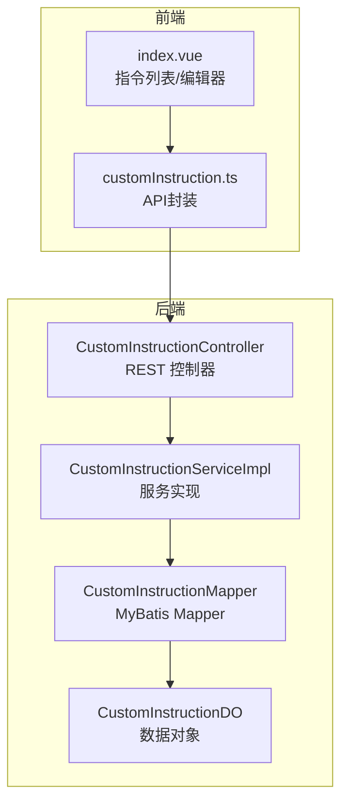
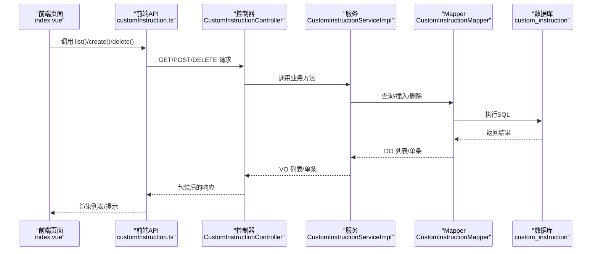
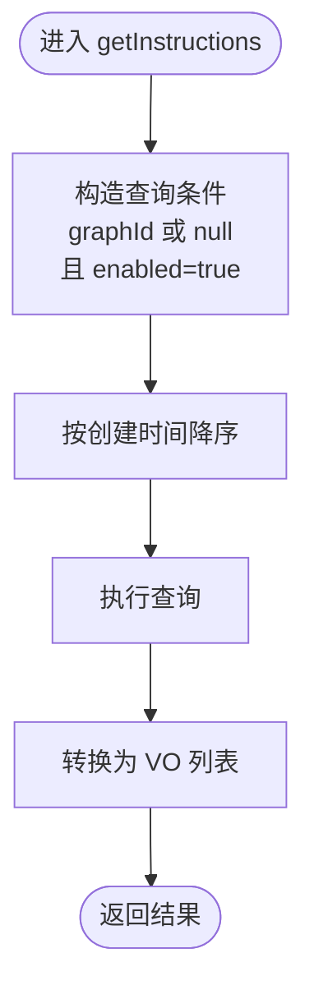
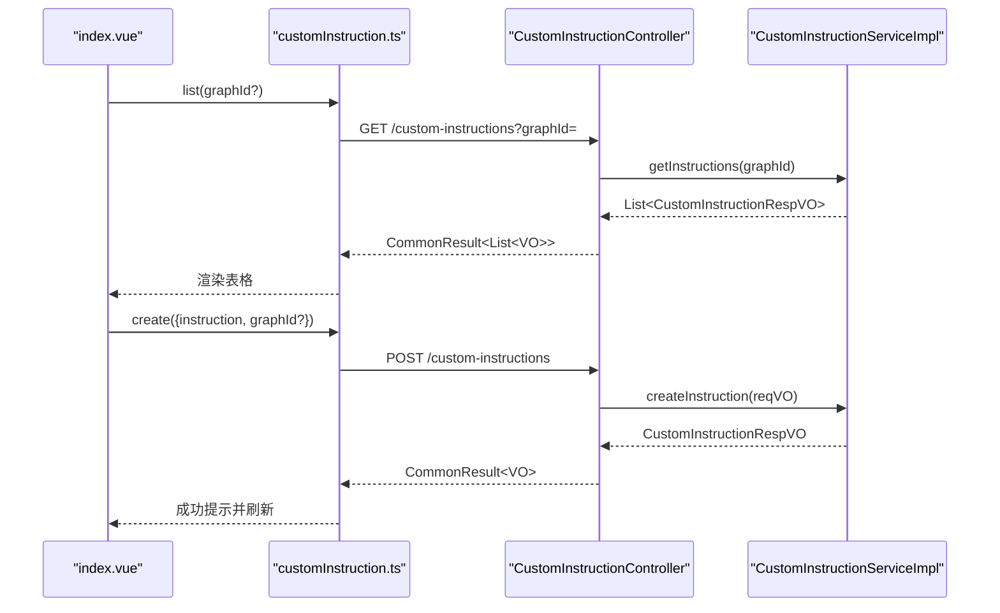
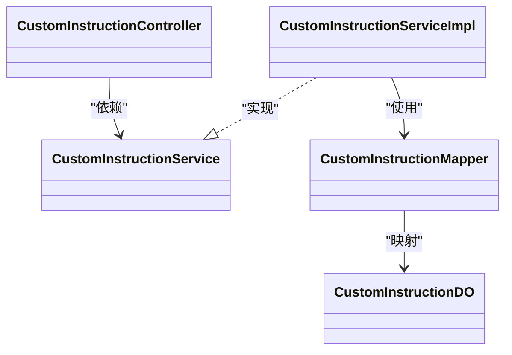
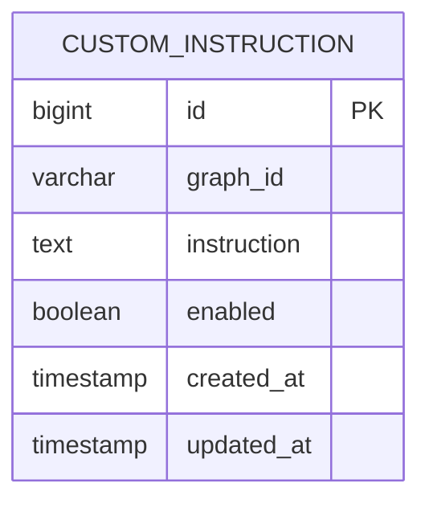

# 自定义指令

<!--<cite>
**本文引用的文件**
- [CustomInstructionController.java](file://graphiti-module-core/src/main/java/com/graphiti/module/graphiti/controller/admin/CustomInstructionController.java)
- [CustomInstructionServiceImpl.java](file://graphiti-module-core/src/main/java/com/graphiti/module/graphiti/service/impl/CustomInstructionServiceImpl.java)
- [CustomInstructionMapper.java](file://graphiti-module-core/src/main/java/com/graphiti/module/graphiti/dal/mysql/CustomInstructionMapper.java)
- [CustomInstructionDO.java](file://graphiti-module-core/src/main/java/com/graphiti/module/graphiti/dal/dataobject/CustomInstructionDO.java)
- [CreateCustomInstructionReqVO.java](file://graphiti-module-core/src/main/java/com/graphiti/module/graphiti/vo/custom_instruction/CreateCustomInstructionReqVO.java)
- [CustomInstructionRespVO.java](file://graphiti-module-core/src/main/java/com/graphiti/module/graphiti/vo/custom_instruction/CustomInstructionRespVO.java)
- [customInstruction.ts](file://graphiti-web/src/api/customInstruction.ts)
- [index.vue（自定义指令页面）](file://graphiti-web/src/views/custom-instructions/index.vue)
- [V2__create_notification_tables.sql](file://sql/postgresql/V2__create_notification_tables.sql)
</cite>-->

## 目录
1. [简介](#简介)
2. [项目结构](#项目结构)
3. [核心组件](#核心组件)
4. [架构总览](#架构总览)
5. [组件详解](#组件详解)
6. [依赖关系分析](#依赖关系分析)
7. [性能与优化](#性能与优化)
8. [故障排查](#故障排查)
9. [结论](#结论)
10. [附录](#附录)

## 简介
本文件围绕“自定义指令”能力，系统性梳理从接口设计、服务实现、数据访问到前端工具与监控的完整链路。重点覆盖：
- 自定义指令的创建、查询、删除流程与API设计
- 服务层的业务逻辑与数据转换
- 数据访问层的查询策略与索引优化
- 命名空间对上层调用的封装
- 前端指令编辑器、执行监控与结果展示
- 权限控制、执行日志与错误处理策略
- 使用案例、最佳实践与性能优化建议

## 项目结构
自定义指令相关代码分布在后端模块与前端Web工程中，采用典型的分层架构：
- 控制层：对外暴露REST API，负责鉴权与入参校验
- 服务层：封装业务逻辑，进行数据转换与日志记录
- 数据访问层：MyBatis Mapper负责SQL查询与基础增删改
- 数据对象：DO映射数据库表字段
- 前端：提供指令编辑器与列表展示，对接后端API

**图表来源**
- [CustomInstructionController.java:1-54](file://graphiti-module-core/src/main/java/com/graphiti/module/graphiti/controller/admin/CustomInstructionController.java#L1-54)
- [CustomInstructionServiceImpl.java:1-65](file://graphiti-module-core/src/main/java/com/graphiti/module/graphiti/service/impl/CustomInstructionServiceImpl.java#L1-65)
- [CustomInstructionMapper.java:1-19](file://graphiti-module-core/src/main/java/com/graphiti/module/graphiti/dal/mysql/CustomInstructionMapper.java#L1-19)
- [CustomInstructionDO.java:1-40](file://graphiti-module-core/src/main/java/com/graphiti/module/graphiti/dal/dataobject/CustomInstructionDO.java#L1-40)
- [CustomInstructionNamespace.java:1-47](file://graphiti-module-core/src/main/java/com/graphiti/module/graphiti/namespace/CustomInstructionNamespace.java#L1-47)
- [customInstruction.ts:1-50](file://graphiti-web/src/api/customInstruction.ts#L1-50)
- [index.vue（自定义指令页面）:1-254](file://graphiti-web/src/views/custom-instructions/index.vue#L1-254)

**章节来源**
- [CustomInstructionController.java:1-54](file://graphiti-module-core/src/main/java/com/graphiti/module/graphiti/controller/admin/CustomInstructionController.java#L1-54)
- [CustomInstructionServiceImpl.java:1-65](file://graphiti-module-core/src/main/java/com/graphiti/module/graphiti/service/impl/CustomInstructionServiceImpl.java#L1-65)
- [CustomInstructionMapper.java:1-19](file://graphiti-module-core/src/main/java/com/graphiti/module/graphiti/dal/mysql/CustomInstructionMapper.java#L1-19)
- [CustomInstructionDO.java:1-40](file://graphiti-module-core/src/main/java/com/graphiti/module/graphiti/dal/dataobject/CustomInstructionDO.java#L1-40)
- [customInstruction.ts:1-50](file://graphiti-web/src/api/customInstruction.ts#L1-50)
- [index.vue（自定义指令页面）:1-254](file://graphiti-web/src/views/custom-instructions/index.vue#L1-254)

## 核心组件
- 控制器：提供获取、创建、删除三个核心接口，统一鉴权与返回包装
- 服务实现：封装查询条件（图谱级+全局）、插入默认启用状态、日志记录
- Mapper：提供按图谱过滤与全局查询的SQL
- 数据对象：映射表字段，含主键、图谱ID、指令文本、启用状态与时间戳
- 前端API与页面：提供指令列表、筛选、新增、删除与展示

**章节来源**
- [CustomInstructionController.java:27-52](file://graphiti-module-core/src/main/java/com/graphiti/module/graphiti/controller/admin/CustomInstructionController.java#L27-L52)
- [CustomInstructionServiceImpl.java:26-53](file://graphiti-module-core/src/main/java/com/graphiti/module/graphiti/service/impl/CustomInstructionServiceImpl.java#L26-L53)
- [CustomInstructionMapper.java:13-17](file://graphiti-module-core/src/main/java/com/graphiti/module/graphiti/dal/mysql/CustomInstructionMapper.java#L13-L17)
- [CustomInstructionDO.java:16-38](file://graphiti-module-core/src/main/java/com/graphiti/module/graphiti/dal/dataobject/CustomInstructionDO.java#L16-L38)
- [customInstruction.ts:24-46](file://graphiti-web/src/api/customInstruction.ts#L24-L46)
- [index.vue（自定义指令页面）:141-192](file://graphiti-web/src/views/custom-instructions/index.vue#L141-L192)

## 架构总览
自定义指令的调用链路如下：

**图表来源**
- [CustomInstructionController.java:27-52](file://graphiti-module-core/src/main/java/com/graphiti/module/graphiti/controller/admin/CustomInstructionController.java#L27-L52)
- [CustomInstructionServiceImpl.java:26-53](file://graphiti-module-core/src/main/java/com/graphiti/module/graphiti/service/impl/CustomInstructionServiceImpl.java#L26-L53)
- [CustomInstructionMapper.java:13-17](file://graphiti-module-core/src/main/java/com/graphiti/module/graphiti/dal/mysql/CustomInstructionMapper.java#L13-L17)
- [customInstruction.ts:24-46](file://graphiti-web/src/api/customInstruction.ts#L24-L46)
- [index.vue（自定义指令页面）:141-192](file://graphiti-web/src/views/custom-instructions/index.vue#L141-L192)

## 组件详解

### 控制器：CustomInstructionController
- 接口职责
  - GET /api/v1/custom-instructions：支持按图谱ID查询，空字符串自动转为无过滤（即查询全局）
  - POST /api/v1/custom-instructions：创建新指令
  - DELETE /api/v1/custom-instructions/{id}：删除指定指令
- 安全与返回
  - 全部接口均声明基于Bearer Token的鉴权
  - 统一返回包装结构，便于前端处理

**章节来源**
- [CustomInstructionController.java:27-52](file://graphiti-module-core/src/main/java/com/graphiti/module/graphiti/controller/admin/CustomInstructionController.java#L27-L52)

### 服务实现：CustomInstructionServiceImpl
- 查询策略
  - 查询条件：图谱ID相等或为空（全局），且启用状态为true，按创建时间倒序
  - 将DO集合转换为VO返回
- 创建流程
  - 构造DO实体，设置指令内容、图谱ID、默认启用状态
  - 插入数据库并记录日志
- 删除流程
  - 根据ID删除

**图表来源**
- [CustomInstructionServiceImpl.java:26-36](file://graphiti-module-core/src/main/java/com/graphiti/module/graphiti/service/impl/CustomInstructionServiceImpl.java#L26-L36)

**章节来源**
- [CustomInstructionServiceImpl.java:26-53](file://graphiti-module-core/src/main/java/com/graphiti/module/graphiti/service/impl/CustomInstructionServiceImpl.java#L26-L53)

### 数据访问：CustomInstructionMapper
- 查询方法
  - 按图谱ID查询：graph_id = ? OR graph_id IS NULL，按创建时间倒序
  - 查询全局：graph_id IS NULL，按创建时间倒序
- 基于MyBatis接口继承BaseMapper，具备通用CRUD能力

**章节来源**
- [CustomInstructionMapper.java:13-17](file://graphiti-module-core/src/main/java/com/graphiti/module/graphiti/dal/mysql/CustomInstructionMapper.java#L13-L17)

### 数据模型：CustomInstructionDO
- 关键字段
  - 主键：自增ID
  - 图谱ID：可空，为空表示全局指令
  - 指令内容：LLM抽取时的提示词
  - 启用状态：布尔，默认启用
  - 时间戳：创建/更新时间由MyBatis自动填充

**章节来源**
- [CustomInstructionDO.java:16-38](file://graphiti-module-core/src/main/java/com/graphiti/module/graphiti/dal/dataobject/CustomInstructionDO.java#L16-L38)

### 前端：指令编辑器与API
- 页面功能
  - 支持按图谱筛选或查看全局指令
  - 新建/查看指令弹窗，支持图谱作用域选择
  - 列表展示指令内容、作用域、创建时间与操作按钮
- API封装
  - list：GET /custom-instructions?graphId=
  - create：POST /custom-instructions
  - delete：DELETE /custom-instructions/{id}

**图表来源**
- [index.vue（自定义指令页面）:141-192](file://graphiti-web/src/views/custom-instructions/index.vue#L141-L192)
- [customInstruction.ts:24-46](file://graphiti-web/src/api/customInstruction.ts#L24-L46)
- [CustomInstructionController.java:27-52](file://graphiti-module-core/src/main/java/com/graphiti/module/graphiti/controller/admin/CustomInstructionController.java#L27-L52)
- [CustomInstructionServiceImpl.java:38-46](file://graphiti-module-core/src/main/java/com/graphiti/module/graphiti/service/impl/CustomInstructionServiceImpl.java#L38-L46)

**章节来源**
- [index.vue（自定义指令页面）:141-192](file://graphiti-web/src/views/custom-instructions/index.vue#L141-L192)
- [customInstruction.ts:24-46](file://graphiti-web/src/api/customInstruction.ts#L24-L46)

## 依赖关系分析
- 控制器依赖服务接口
- 服务实现依赖Mapper与DO
- Mapper继承MyBatis基础接口，天然具备通用CRUD
- 控制器依赖服务接口
- 服务实现依赖Mapper与DO
- Mapper继承MyBatis基础接口，天然具备通用CRUD
- 前端通过API封装调用控制器

**图表来源**
- [CustomInstructionController.java:25-25](file://graphiti-module-core/src/main/java/com/graphiti/module/graphiti/controller/admin/CustomInstructionController.java#L25-L25)
- [CustomInstructionServiceImpl.java:24-24](file://graphiti-module-core/src/main/java/com/graphiti/module/graphiti/service/impl/CustomInstructionServiceImpl.java#L24-L24)
- [CustomInstructionMapper.java:11-11](file://graphiti-module-core/src/main/java/com/graphiti/module/graphiti/dal/mysql/CustomInstructionMapper.java#L11-L11)
- [CustomInstructionDO.java:12-12](file://graphiti-module-core/src/main/java/com/graphiti/module/graphiti/dal/dataobject/CustomInstructionDO.java#L12-L12)

**章节来源**
- [CustomInstructionController.java:25-25](file://graphiti-module-core/src/main/java/com/graphiti/module/graphiti/controller/admin/CustomInstructionController.java#L25-L25)
- [CustomInstructionServiceImpl.java:24-24](file://graphiti-module-core/src/main/java/com/graphiti/module/graphiti/service/impl/CustomInstructionServiceImpl.java#L24-L24)
- [CustomInstructionMapper.java:11-11](file://graphiti-module-core/src/main/java/com/graphiti/module/graphiti/dal/mysql/CustomInstructionMapper.java#L11-L11)
- [CustomInstructionDO.java:12-12](file://graphiti-module-core/src/main/java/com/graphiti/module/graphiti/dal/dataobject/CustomInstructionDO.java#L12-L12)

## 性能与优化
- 查询性能
  - 已在数据库层面为 enabled 字段建立索引，有助于加速过滤
  - 查询按创建时间倒序，建议结合分页或游标分页以降低大列表渲染压力
- 写入性能
  - 插入默认启用状态，减少后续变更成本
  - 日志记录为异步友好方式，避免阻塞主流程
- 建议
  - 在高并发场景下，考虑对查询结果做缓存（如Redis）以减轻数据库压力
  - 对指令内容较长的场景，前端展示建议采用折叠/展开与懒加载
  - 对频繁切换图谱的场景，前端可增加本地筛选与排序缓存

**章节来源**
- [V2__create_notification_tables.sql:99-113](file://sql/postgresql/V2__create_notification_tables.sql#L99-L113)

## 故障排查
- 常见问题
  - 无法获取指令：确认Bearer Token有效；检查graphId参数是否为空字符串（会被转为null）
  - 创建失败：确认instruction非空；检查graphId是否合法
  - 删除失败：确认id存在且未被其他业务引用
- 日志与审计
  - 服务层对创建与删除操作有明确日志输出，便于定位问题
  - 前端在操作成功/失败时给出提示，建议结合浏览器网络面板与后端日志定位

**章节来源**
- [CustomInstructionController.java:30-34](file://graphiti-module-core/src/main/java/com/graphiti/module/graphiti/controller/admin/CustomInstructionController.java#L30-L34)
- [CustomInstructionServiceImpl.java:45-52](file://graphiti-module-core/src/main/java/com/graphiti/module/graphiti/service/impl/CustomInstructionServiceImpl.java#L45-L52)
- [index.vue（自定义指令页面）:166-192](file://graphiti-web/src/views/custom-instructions/index.vue#L166-L192)

## 结论
自定义指令系统以清晰的分层设计实现了“图谱级隔离+全局共享”的灵活模式，配合前后端一体化的编辑器与API，满足了不同场景下的提示词管理需求。通过索引优化、日志审计与前端交互增强，系统在可用性与可维护性方面具备良好基础。后续可在缓存、分页与权限细化等方面进一步完善。

## 附录

### API定义
- 获取指令列表
  - 方法：GET
  - 路径：/api/v1/custom-instructions
  - 参数：graphId（可选，空字符串视为无过滤）
  - 鉴权：Bearer Token
- 创建指令
  - 方法：POST
  - 路径：/api/v1/custom-instructions
  - 请求体：instruction（必填）、graphId（可选）
  - 鉴权：Bearer Token
- 删除指令
  - 方法：DELETE
  - 路径：/api/v1/custom-instructions/{id}
  - 鉴权：Bearer Token

**章节来源**
- [CustomInstructionController.java:27-52](file://graphiti-module-core/src/main/java/com/graphiti/module/graphiti/controller/admin/CustomInstructionController.java#L27-L52)
- [CreateCustomInstructionReqVO.java:16-21](file://graphiti-module-core/src/main/java/com/graphiti/module/graphiti/vo/custom_instruction/CreateCustomInstructionReqVO.java#L16-L21)

### 数据模型

**图表来源**
- [CustomInstructionDO.java:16-38](file://graphiti-module-core/src/main/java/com/graphiti/module/graphiti/dal/dataobject/CustomInstructionDO.java#L16-L38)

### 使用案例与最佳实践
- 案例
  - 全局指令：为所有图谱提供通用抽取约束
  - 图谱专属指令：针对特定业务领域定制抽取规则
- 最佳实践
  - 指令内容尽量简洁明确，聚焦实体/关系类型
  - 优先使用图谱专属指令隔离业务差异
  - 定期清理历史指令，保持列表可读性
  - 结合前端筛选与分页，提升管理效率

### 执行监控与结果展示
- 前端监控页面可参考系统状态与性能指标，用于评估指令执行对整体系统的影响
- 建议在指令执行链路中埋点，记录耗时与成功率，以便持续优化

**章节来源**
- [index.vue（自定义指令页面）:141-192](file://graphiti-web/src/views/custom-instructions/index.vue#L141-L192)