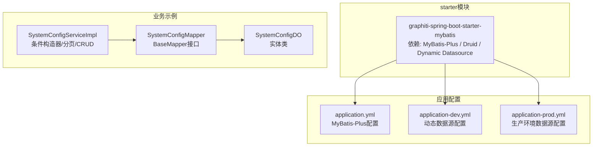
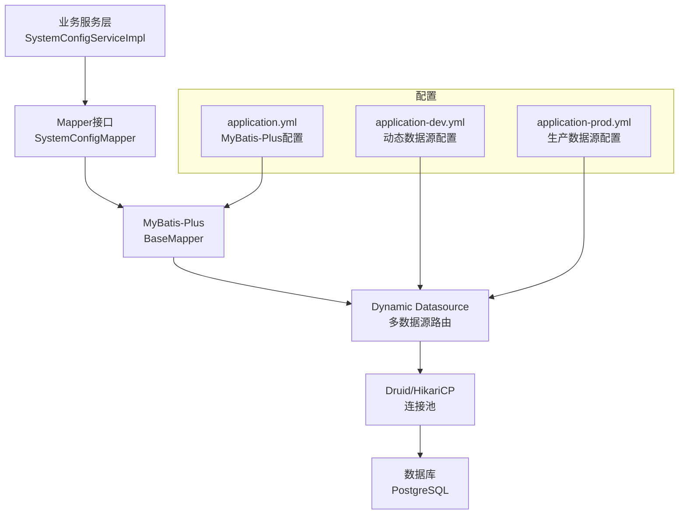
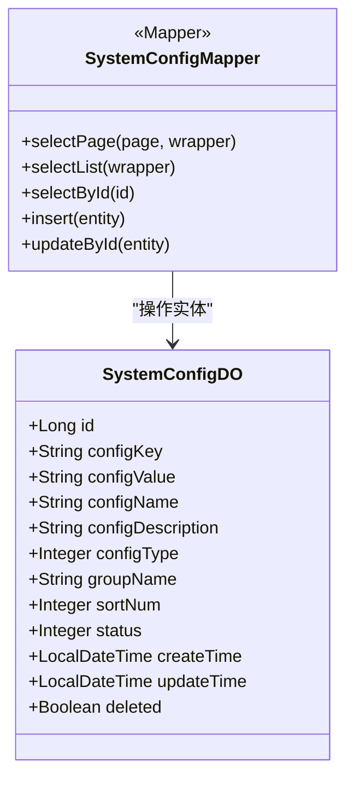
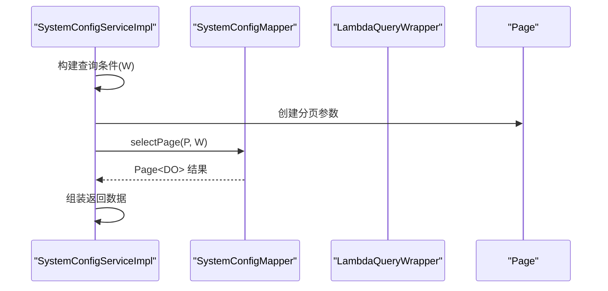
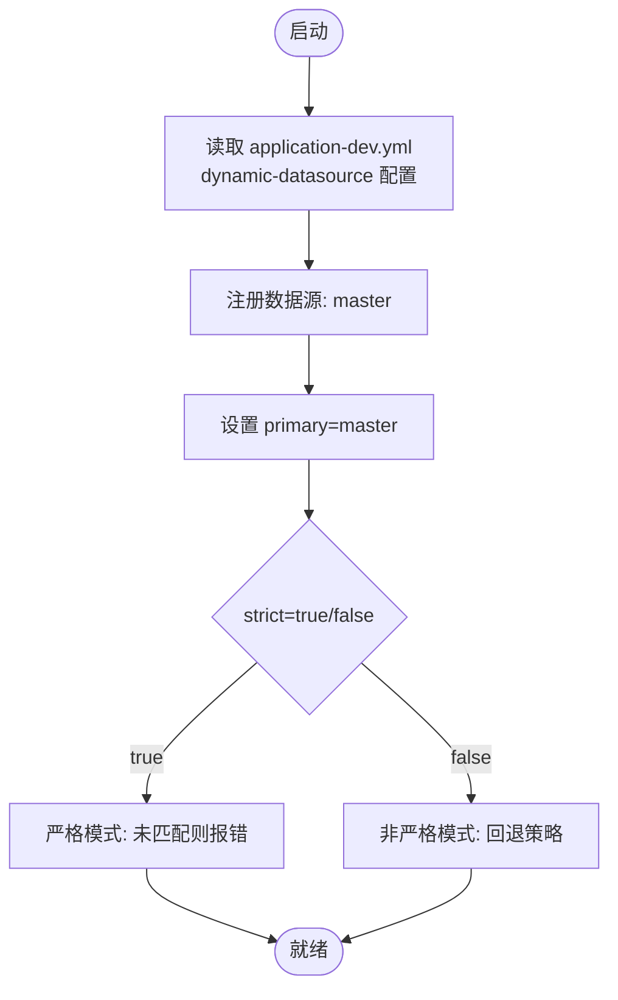
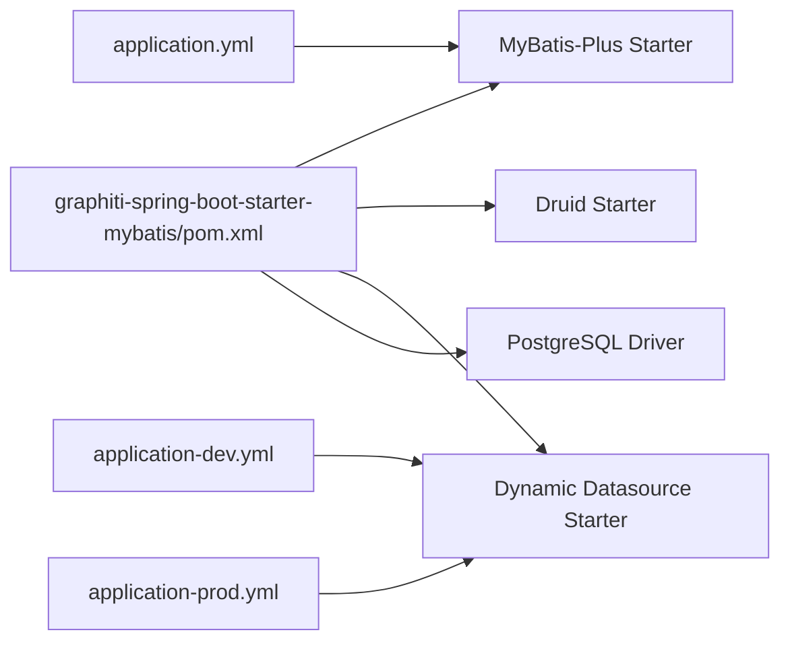

# MyBatis集成 (graphiti-spring-boot-starter-mybatis)

<cite>
**本文引用的文件**
- [graphiti-spring-boot-starter-mybatis/pom.xml](file://graphiti-framework/graphiti-spring-boot-starter-mybatis/pom.xml)
- [application.yml](file://graphiti-server/src/main/resources/application.yml)
- [application-dev.yml](file://graphiti-server/src/main/resources/application-dev.yml)
- [application-prod.yml](file://config/application-prod.yml)
- [SystemConfigMapper.java](file://graphiti-module-system/src/main/java/com/raphiti/system/dal/mysql/SystemConfigMapper.java)
- [SystemConfigDO.java](file://graphiti-module-system/src/main/java/com/raphiti/system/dal/dataobject/SystemConfigDO.java)
- [SystemConfigServiceImpl.java](file://graphiti-module-system/src/main/java/com/raphiti/system/service/impl/SystemConfigServiceImpl.java)
</cite>

## 目录
1. [简介](#简介)
2. [项目结构](#项目结构)
3. [核心组件](#核心组件)
4. [架构总览](#架构总览)
5. [详细组件分析](#详细组件分析)
6. [依赖分析](#依赖分析)
7. [性能考虑](#性能考虑)
8. [故障排查指南](#故障排查指南)
9. [结论](#结论)
10. [附录](#附录)

## 简介
本文件面向Graphiti-Java的MyBatis集成模块，聚焦于graphiti-spring-boot-starter-mybatis子模块的依赖与配置、通用Mapper设计与使用规范、动态数据源配置与事务管理、以及MyBatis-Plus核心特性与最佳实践。文档以仓库中现有的配置与代码为依据，提供可落地的集成步骤、使用范式与排障建议。

## 项目结构
MyBatis集成相关的关键位置如下：
- starter模块：graphiti-spring-boot-starter-mybatis，负责引入MyBatis-Plus、Druid连接池与dynamic-datasource等依赖
- 应用配置：graphiti-server的application.yml与application-dev.yml，包含MyBatis-Plus与动态数据源配置
- 示例Mapper与DO：graphiti-module-system中的SystemConfigMapper与SystemConfigDO，演示通用Mapper与实体映射
- 服务层示例：SystemConfigServiceImpl，展示条件构造器、分页查询与CRUD调用

**图表来源**
- [graphiti-spring-boot-starter-mybatis/pom.xml:19-41](file://graphiti-framework/graphiti-spring-boot-starter-mybatis/pom.xml#L19-L41)
- [application.yml:11-19](file://graphiti-server/src/main/resources/application.yml#L11-L19)
- [application-dev.yml:487-502](file://graphiti-server/src/main/resources/application-dev.yml#L487-L502)
- [application-prod.yml:14-32](file://config/application-prod.yml#L14-L32)
- [SystemConfigMapper.java:10-11](file://graphiti-module-system/src/main/java/com/raphiti/system/dal/mysql/SystemConfigMapper.java#L10-L11)
- [SystemConfigDO.java:12-41](file://graphiti-module-system/src/main/java/com/raphiti/system/dal/dataobject/SystemConfigDO.java#L12-L41)
- [SystemConfigServiceImpl.java:27-42](file://graphiti-module-system/src/main/java/com/raphiti/system/service/impl/SystemConfigServiceImpl.java#L27-L42)

**章节来源**
- [graphiti-spring-boot-starter-mybatis/pom.xml:1-51](file://graphiti-framework/graphiti-spring-boot-starter-mybatis/pom.xml#L1-L51)
- [application.yml:1-67](file://graphiti-server/src/main/resources/application.yml#L1-L67)
- [application-dev.yml:487-502](file://graphiti-server/src/main/resources/application-dev.yml#L487-L502)
- [application-prod.yml:14-32](file://config/application-prod.yml#L14-L32)

## 核心组件
- 依赖与自动装配
  - starter模块引入MyBatis-Plus、Druid连接池与dynamic-datasource，满足“数据库连接池、多数据源、事务、MyBatis-Plus拓展”的目标
- 配置文件
  - application.yml：MyBatis-Plus全局配置（驼峰映射、日志实现、ID策略）
  - application-dev.yml与application-prod.yml：动态数据源primary、strict、各数据源URL、用户名、密码、驱动、HikariCP连接池参数
- 通用Mapper与实体
  - BaseMapper接口：继承自MyBatis-Plus的BaseMapper，天然具备基础CRUD能力
  - 实体类：通过注解标注表名与主键，遵循驼峰命名映射
- 服务层示例
  - 条件构造器：LambdaQueryWrapper构建查询条件
  - 分页查询：Page对象传入selectPage
  - CRUD：insert/updateById/selectById/delete逻辑删除

**章节来源**
- [graphiti-spring-boot-starter-mybatis/pom.xml:19-41](file://graphiti-framework/graphiti-spring-boot-starter-mybatis/pom.xml#L19-L41)
- [application.yml:11-19](file://graphiti-server/src/main/resources/application.yml#L11-L19)
- [application-dev.yml:487-502](file://graphiti-server/src/main/resources/application-dev.yml#L487-L502)
- [application-prod.yml:14-32](file://config/application-prod.yml#L14-L32)
- [SystemConfigMapper.java:10-11](file://graphiti-module-system/src/main/java/com/raphiti/system/dal/mysql/SystemConfigMapper.java#L10-L11)
- [SystemConfigDO.java:12-41](file://graphiti-module-system/src/main/java/com/raphiti/system/dal/dataobject/SystemConfigDO.java#L12-L41)
- [SystemConfigServiceImpl.java:27-42](file://graphiti-module-system/src/main/java/com/raphiti/system/service/impl/SystemConfigServiceImpl.java#L27-L42)

## 架构总览
MyBatis-Plus在本项目中的角色是ORM框架，dynamic-datasource提供多数据源能力，Druid作为连接池。应用通过配置文件声明数据源与MyBatis-Plus行为，业务层通过Mapper接口与服务层组合实现条件查询、分页与CRUD。

**图表来源**
- [application.yml:11-19](file://graphiti-server/src/main/resources/application.yml#L11-L19)
- [application-dev.yml:487-502](file://graphiti-server/src/main/resources/application-dev.yml#L487-L502)
- [application-prod.yml:14-32](file://config/application-prod.yml#L14-L32)
- [SystemConfigMapper.java:10-11](file://graphiti-module-system/src/main/java/com/raphiti/system/dal/mysql/SystemConfigMapper.java#L10-L11)
- [SystemConfigServiceImpl.java:27-42](file://graphiti-module-system/src/main/java/com/raphiti/system/service/impl/SystemConfigServiceImpl.java#L27-L42)

## 详细组件分析

### 通用Mapper与实体设计
- Mapper接口
  - 继承BaseMapper，即可获得基础CRUD、条件查询、分页查询等能力
  - 通过@Mapper注解被Spring扫描
- 实体类
  - 使用@TableName标注表名
  - 使用@TableId标注主键
  - 字段遵循驼峰命名，MyBatis-Plus配置开启下划线转驼峰映射

**图表来源**
- [SystemConfigMapper.java:10-11](file://graphiti-module-system/src/main/java/com/raphiti/system/dal/mysql/SystemConfigMapper.java#L10-L11)
- [SystemConfigDO.java:12-41](file://graphiti-module-system/src/main/java/com/raphiti/system/dal/dataobject/SystemConfigDO.java#L12-L41)

**章节来源**
- [SystemConfigMapper.java:10-11](file://graphiti-module-system/src/main/java/com/raphiti/system/dal/mysql/SystemConfigMapper.java#L10-L11)
- [SystemConfigDO.java:12-41](file://graphiti-module-system/src/main/java/com/raphiti/system/dal/dataobject/SystemConfigDO.java#L12-L41)

### 条件构造器与分页查询流程
- 条件构造器
  - 使用LambdaQueryWrapper按字段构建条件，支持eq、like、orderByAsc等
- 分页查询
  - 构造Page对象，传入selectPage获取分页结果
- CRUD
  - insert、updateById、selectById、逻辑删除（更新deleted字段）

**图表来源**
- [SystemConfigServiceImpl.java:27-42](file://graphiti-module-system/src/main/java/com/raphiti/system/service/impl/SystemConfigServiceImpl.java#L27-L42)

**章节来源**
- [SystemConfigServiceImpl.java:27-42](file://graphiti-module-system/src/main/java/com/raphiti/system/service/impl/SystemConfigServiceImpl.java#L27-L42)

### 动态数据源配置与切换
- 配置要点
  - primary：默认数据源名称
  - strict：严格模式（true时未匹配数据源将报错）
  - datasource.master：主数据源配置（URL、用户名、密码、驱动、HikariCP参数）
- 运行机制
  - 通过dynamic-datasource自动装配与路由，结合@DS注解可在方法上切换数据源（如需）
  - 本项目示例未显式使用@DS，采用默认主数据源

**图表来源**
- [application-dev.yml:487-502](file://graphiti-server/src/main/resources/application-dev.yml#L487-L502)

**章节来源**
- [application-dev.yml:487-502](file://graphiti-server/src/main/resources/application-dev.yml#L487-L502)
- [application-prod.yml:14-32](file://config/application-prod.yml#L14-L32)

### MyBatis-Plus核心特性与最佳实践
- 配置项
  - map-underscore-to-camel-case：开启下划线到驼峰映射
  - log-impl：控制台输出SQL日志
  - id-type：ID生成策略（配合PostgreSQL可调整）
- 最佳实践
  - 使用BaseMapper提供的CRUD方法，避免重复SQL
  - 使用LambdaQueryWrapper进行类型安全的条件构造
  - 分页查询统一使用Page对象，避免手写LIMIT/OFFSET
  - 逻辑删除：通过更新deleted字段实现软删除，保持数据完整性
  - 连接池：合理设置maximum-pool-size、minimum-idle、connection-timeout等参数

**章节来源**
- [application.yml:11-19](file://graphiti-server/src/main/resources/application.yml#L11-L19)
- [SystemConfigServiceImpl.java:62-102](file://graphiti-module-system/src/main/java/com/raphiti/system/service/impl/SystemConfigServiceImpl.java#L62-L102)

## 依赖分析
- starter模块依赖
  - MyBatis-Plus Spring Boot 3 Starter：提供MyBatis-Plus自动配置与增强
  - Druid Spring Boot 3 Starter：提供连接池监控与配置
  - dynamic-datasource Spring Boot 3 Starter：提供多数据源自动装配
  - PostgreSQL驱动：数据库驱动
- 应用配置依赖
  - application.yml：MyBatis-Plus全局配置
  - application-dev.yml / application-prod.yml：动态数据源与连接池配置

**图表来源**
- [graphiti-spring-boot-starter-mybatis/pom.xml:19-41](file://graphiti-framework/graphiti-spring-boot-starter-mybatis/pom.xml#L19-L41)
- [application.yml:11-19](file://graphiti-server/src/main/resources/application.yml#L11-L19)
- [application-dev.yml:487-502](file://graphiti-server/src/main/resources/application-dev.yml#L487-L502)
- [application-prod.yml:14-32](file://config/application-prod.yml#L14-L32)

**章节来源**
- [graphiti-spring-boot-starter-mybatis/pom.xml:19-41](file://graphiti-framework/graphiti-spring-boot-starter-mybatis/pom.xml#L19-L41)

## 性能考虑
- 连接池参数
  - maximum-pool-size：最大连接数，结合业务并发量评估
  - minimum-idle：最小空闲连接，降低连接获取延迟
  - connection-timeout：连接超时时间，避免长时间等待
  - idle-timeout / max-lifetime：空闲与生命周期，防止连接泄漏
- 查询优化
  - 使用条件构造器与索引字段进行过滤
  - 分页查询避免一次性加载大量数据
  - 合理使用selectList/selectPage，避免N+1查询
- 日志与监控
  - 开启SQL日志便于定位慢查询
  - Druid监控页面可观察连接池状态与SQL执行情况

[本节为通用指导，无需列出具体文件来源]

## 故障排查指南
- 连接失败
  - 检查JDBC URL、用户名、密码与驱动是否正确
  - 确认数据库服务可用与网络连通性
- 时区问题
  - 在JDBC URL中指定serverTimezone参数
- 分页异常
  - 确认Page对象参数合法且查询条件正确
- 逻辑删除无效
  - 确认实体类deleted字段与查询条件一致
- 多数据源切换
  - 若使用@DS注解，请确认数据源名称与配置一致

**章节来源**
- [application-dev.yml:487-502](file://graphiti-server/src/main/resources/application-dev.yml#L487-L502)
- [SystemConfigServiceImpl.java:62-102](file://graphiti-module-system/src/main/java/com/raphiti/system/service/impl/SystemConfigServiceImpl.java#L62-L102)

## 结论
graphiti-spring-boot-starter-mybatis通过引入MyBatis-Plus、Druid与dynamic-datasource，为Graphiti-Java提供了开箱即用的数据库访问能力。结合application.yml与application-dev.yml/production配置，可快速完成连接池、多数据源与ORM的集成。业务层通过通用Mapper与条件构造器，能够高效实现CRUD与分页查询；同时遵循逻辑删除、分页与连接池优化等最佳实践，有助于提升系统稳定性与性能。

[本节为总结性内容，无需列出具体文件来源]

## 附录
- 快速开始清单
  - 引入graphiti-spring-boot-starter-mybatis依赖
  - 在application.yml中配置MyBatis-Plus全局参数
  - 在application-dev.yml或application-prod.yml中配置dynamic-datasource与HikariCP参数
  - 定义Mapper接口继承BaseMapper并标注@Mapper
  - 定义实体类使用@TableName与@TableId
  - 在服务层使用LambdaQueryWrapper与Page实现条件查询与分页

**章节来源**
- [graphiti-spring-boot-starter-mybatis/pom.xml:19-41](file://graphiti-framework/graphiti-spring-boot-starter-mybatis/pom.xml#L19-L41)
- [application.yml:11-19](file://graphiti-server/src/main/resources/application.yml#L11-L19)
- [application-dev.yml:487-502](file://graphiti-server/src/main/resources/application-dev.yml#L487-L502)
- [application-prod.yml:14-32](file://config/application-prod.yml#L14-L32)
- [SystemConfigMapper.java:10-11](file://graphiti-module-system/src/main/java/com/raphiti/system/dal/mysql/SystemConfigMapper.java#L10-L11)
- [SystemConfigDO.java:12-41](file://graphiti-module-system/src/main/java/com/raphiti/system/dal/dataobject/SystemConfigDO.java#L12-L41)