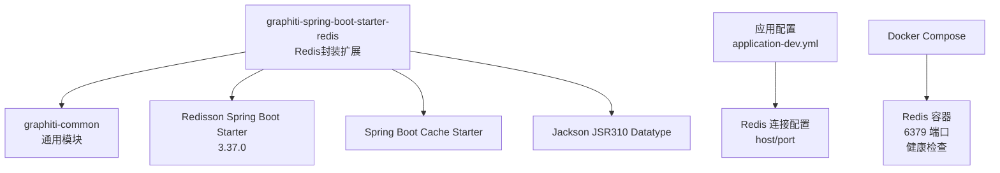
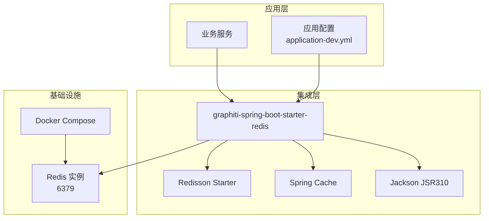
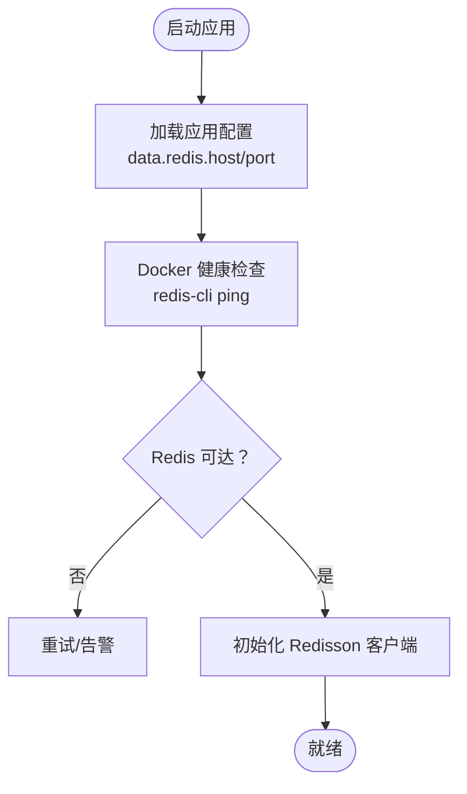
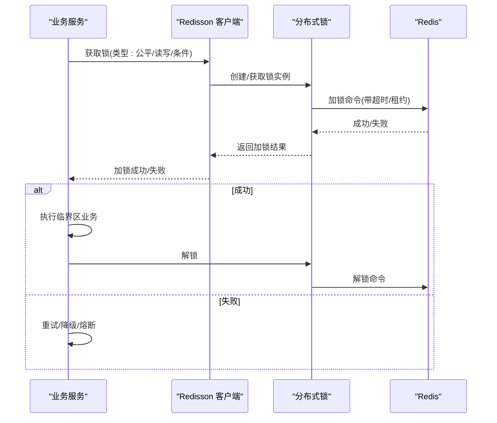
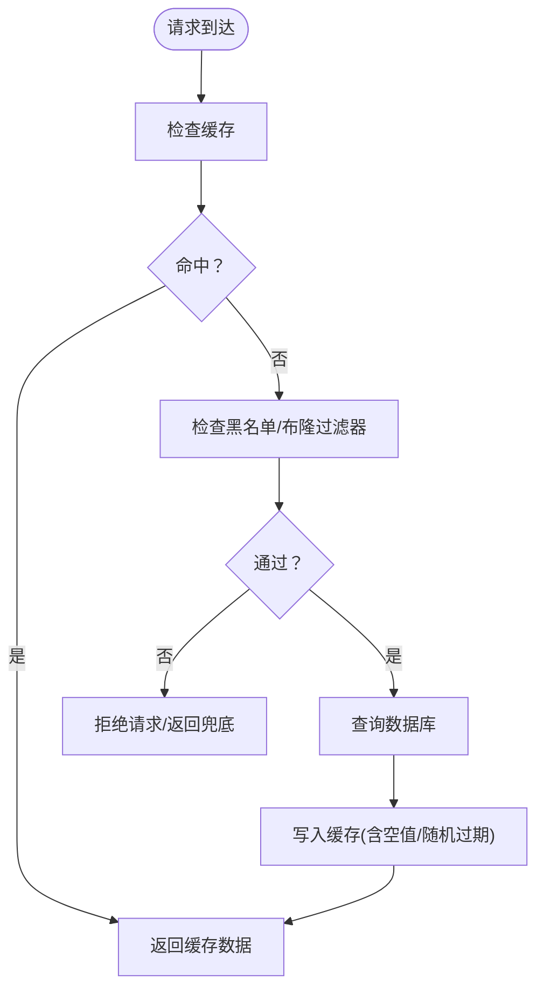
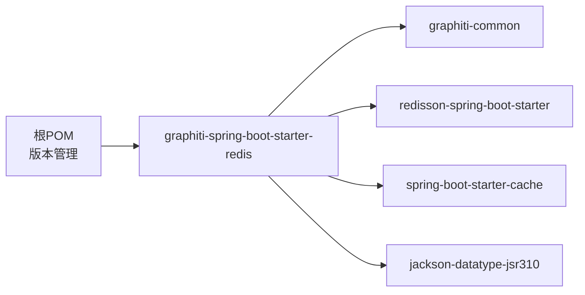

# Redis集成 (graphiti-spring-boot-starter-redis)

<!--<cite>
**本文引用的文件**
- [graphiti-spring-boot-starter-redis/pom.xml](file://graphiti-framework/graphiti-spring-boot-starter-redis/pom.xml)
- [pom.xml](file://pom.xml)
- [application-dev.yml](file://graphiti-server/src/main/resources/application-dev.yml)
- [application.yml](file://graphiti-server/src/main/resources/application.yml)
- [docker-compose.yml](file://docker-compose.yml)
</cite>-->

## 目录
1. [简介](#简介)
2. [项目结构](#项目结构)
3. [核心组件](#核心组件)
4. [架构总览](#架构总览)
5. [详细组件分析](#详细组件分析)
6. [依赖分析](#依赖分析)
7. [性能考虑](#性能考虑)
8. [故障排查指南](#故障排查指南)
9. [结论](#结论)
10. [附录](#附录)

## 简介
本文件面向Graphiti-Java的Redis集成模块，系统性阐述基于Redisson的集成配置与使用方法，覆盖连接配置、集群与哨兵模式、分布式锁（公平锁、读写锁、条件锁）实现原理与应用场景、缓存策略（穿透、击穿、雪崩防护）、RedisTemplate最佳实践（序列化、连接池、事务），以及在会话管理、限流控制、消息队列等场景下的使用路径与性能优化建议。文档同时提供可追溯的“章节来源”与“图表来源”，便于读者定位到具体实现文件。

## 项目结构
该模块位于框架层graphiti-framework中，作为Spring Boot Starter封装Redisson能力，并引入Spring Cache以支持声明式缓存。Redis连接配置在应用配置文件中集中管理，容器编排文件提供本地Redis实例健康检查与持久化卷挂载。

**图表来源**
- [graphiti-spring-boot-starter-redis/pom.xml:19-37](file://graphiti-framework/graphiti-spring-boot-starter-redis/pom.xml#L19-L37)
- [pom.xml:149-154](file://pom.xml#L149-L154)
- [application-dev.yml:503-507](file://graphiti-server/src/main/resources/application-dev.yml#L503-L507)
- [application-dev.yml:672-676](file://graphiti-server/src/main/resources/application-dev.yml#L672-L676)
- [docker-compose.yml:93-104](file://docker-compose.yml#L93-L104)

**章节来源**
- [graphiti-spring-boot-starter-redis/pom.xml:1-39](file://graphiti-framework/graphiti-spring-boot-starter-redis/pom.xml#L1-L39)
- [pom.xml:149-154](file://pom.xml#L149-L154)
- [application-dev.yml:503-507](file://graphiti-server/src/main/resources/application-dev.yml#L503-L507)
- [application-dev.yml:672-676](file://graphiti-server/src/main/resources/application-dev.yml#L672-L676)
- [docker-compose.yml:93-104](file://docker-compose.yml#L93-L104)

## 核心组件
- Redisson Starter：提供Redisson客户端自动装配与配置入口，支持多种部署形态（单机、集群、哨兵）。
- Spring Cache Starter：启用基于注解的缓存抽象，结合Redisson实现分布式缓存。
- Jackson JSR310：增强对Java时间类型的序列化支持，确保复杂对象缓存一致性。
- 应用配置：集中管理Redis连接参数（host/port），并开启Actuator对Redis健康检查的支持。

上述组件共同构成Redis集成的基础能力，支撑后续分布式锁、缓存策略与业务功能落地。

**章节来源**
- [graphiti-spring-boot-starter-redis/pom.xml:19-37](file://graphiti-framework/graphiti-spring-boot-starter-redis/pom.xml#L19-L37)
- [application-dev.yml:633-634](file://graphiti-server/src/main/resources/application-dev.yml#L633-L634)

## 架构总览
下图展示了Redisson在Graphiti中的角色与配置关系，以及与应用配置、容器编排的衔接。

**图表来源**
- [graphiti-spring-boot-starter-redis/pom.xml:19-37](file://graphiti-framework/graphiti-spring-boot-starter-redis/pom.xml#L19-L37)
- [application-dev.yml:503-507](file://graphiti-server/src/main/resources/application-dev.yml#L503-L507)
- [application-dev.yml:672-676](file://graphiti-server/src/main/resources/application-dev.yml#L672-L676)
- [docker-compose.yml:93-104](file://docker-compose.yml#L93-L104)

## 详细组件分析

### Redis连接配置与部署形态
- 单机模式：在应用配置中指定host与port即可完成连接；容器编排提供本地Redis实例与健康检查。
- 集群/哨兵模式：可通过Redisson Starter提供的配置项进行切换（如集群地址列表、主从发现、密码认证等）。具体配置键位与示例可参考Redisson官方文档与本仓库的配置文件结构。
- 认证与安全：可在配置中设置密码、SSL/TLS等参数，确保生产环境安全访问。

**图表来源**
- [application-dev.yml:503-507](file://graphiti-server/src/main/resources/application-dev.yml#L503-L507)
- [application-dev.yml:672-676](file://graphiti-server/src/main/resources/application-dev.yml#L672-L676)
- [docker-compose.yml:93-104](file://docker-compose.yml#L93-L104)

**章节来源**
- [application-dev.yml:503-507](file://graphiti-server/src/main/resources/application-dev.yml#L503-L507)
- [application-dev.yml:672-676](file://graphiti-server/src/main/resources/application-dev.yml#L672-L676)
- [docker-compose.yml:93-104](file://docker-compose.yml#L93-L104)

### 分布式锁：原理与应用
- 公平锁：保证等待时间最长的线程优先获得锁，适用于严格顺序的并发控制。
- 读写锁：区分读写操作，允许多个读操作并发，但写操作独占，提升读多写少场景的吞吐。
- 条件锁：结合Condition实现更细粒度的等待/通知机制，适合复杂业务状态流转。

**图表来源**
- [graphiti-spring-boot-starter-redis/pom.xml:26-28](file://graphiti-framework/graphiti-spring-boot-starter-redis/pom.xml#L26-L28)

**章节来源**
- [graphiti-spring-boot-starter-redis/pom.xml:26-28](file://graphiti-framework/graphiti-spring-boot-starter-redis/pom.xml#L26-L28)

### 缓存策略设计与实现
- 缓存穿透：对空值进行短时缓存，同时结合布隆过滤器或白名单校验，避免恶意/无效查询打穿存储层。
- 缓存击穿：热点key设置互斥锁或延迟双删策略，保障单点失效时的稳定性。
- 缓存雪崩：为key注入随机过期时间，分批失效，降低集中过期风险。

**图表来源**
- [application-dev.yml:633-634](file://graphiti-server/src/main/resources/application-dev.yml#L633-L634)

**章节来源**
- [application-dev.yml:633-634](file://graphiti-server/src/main/resources/application-dev.yml#L633-L634)

### RedisTemplate使用与最佳实践
- 序列化配置：推荐使用JSON或Kryo等高效序列化方案，确保时间类型（JSR310）正确序列化。
- 连接池管理：合理设置最大连接数、空闲连接、超时时间，避免连接泄露与抖动。
- 事务支持：使用RedisTemplate的事务特性，保证多命令原子性；注意异常回滚与幂等设计。
- 命令选择：优先使用批量命令（如mget/mset）减少RTT；对热点数据采用pipeline提升吞吐。

**章节来源**
- [graphiti-spring-boot-starter-redis/pom.xml:34-36](file://graphiti-framework/graphiti-spring-boot-starter-redis/pom.xml#L34-L36)

### 业务场景示例（使用路径）
- 会话管理：利用Redis存储用户会话与令牌，结合Spring Session或自定义拦截器实现跨节点会话共享。
- 限流控制：基于Redis计数器或漏桶/令牌桶算法，实现接口级或用户级限流。
- 消息队列：使用Redis List或Stream实现异步消息传递，结合消费者组与ACK机制保证可靠性。

**章节来源**
- [application-dev.yml:633-634](file://graphiti-server/src/main/resources/application-dev.yml#L633-L634)

## 依赖分析
- 版本统一：Redisson版本在根pom中集中管理，确保与Spring Boot版本兼容。
- 模块依赖：graphiti-spring-boot-starter-redis依赖graphiti-common与Redisson Starter，同时引入Spring Cache与Jackson JSR310。

**图表来源**
- [pom.xml:149-154](file://pom.xml#L149-L154)
- [graphiti-spring-boot-starter-redis/pom.xml:20-36](file://graphiti-framework/graphiti-spring-boot-starter-redis/pom.xml#L20-L36)

**章节来源**
- [pom.xml:149-154](file://pom.xml#L149-L154)
- [graphiti-spring-boot-starter-redis/pom.xml:20-36](file://graphiti-framework/graphiti-spring-boot-starter-redis/pom.xml#L20-L36)

## 性能考虑
- 连接与序列化：复用连接、启用压缩、选择合适序列化器，降低CPU与网络开销。
- 命令优化：批量操作、Pipeline、Lua脚本替代多步操作。
- 缓存策略：合理TTL、预热热点、异步更新，避免阻塞主线程。
- 监控与调优：结合Actuator指标与Redis自带INFO命令，持续观测慢查询、内存与连接数。

[本节为通用指导，无需特定文件引用]

## 故障排查指南
- 连接失败：检查host/port配置、防火墙与容器网络；确认Docker健康检查是否通过。
- 缓存异常：核对序列化配置与TTL设置；排查空值缓存与热点key互斥。
- 锁竞争：观察锁等待队列长度与超时时间；评估业务是否可拆分或降级。
- 性能瓶颈：使用慢查询日志与监控指标定位热点命令与慢接口。

**章节来源**
- [application-dev.yml:633-634](file://graphiti-server/src/main/resources/application-dev.yml#L633-L634)
- [docker-compose.yml:93-104](file://docker-compose.yml#L93-L104)

## 结论
Graphiti的Redis集成以Redisson为核心，结合Spring Cache与Jackson JSR310，提供了从连接配置到分布式锁与缓存策略的完整能力集。通过合理的部署形态、缓存防护与性能优化，可有效支撑会话管理、限流控制与消息队列等关键业务场景。建议在生产环境中进一步细化配置项与监控体系，确保高可用与高性能。

[本节为总结性内容，无需特定文件引用]

## 附录
- Redisson版本：3.37.0
- Actuator对Redis健康检查默认开启，便于运维观测

**章节来源**
- [pom.xml:40](file://pom.xml#L40)
- [application-dev.yml:633-634](file://graphiti-server/src/main/resources/application-dev.yml#L633-L634)