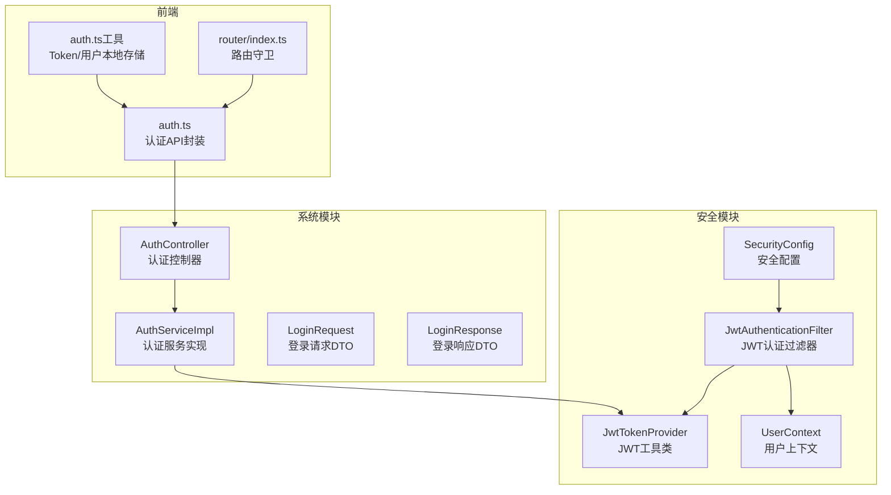
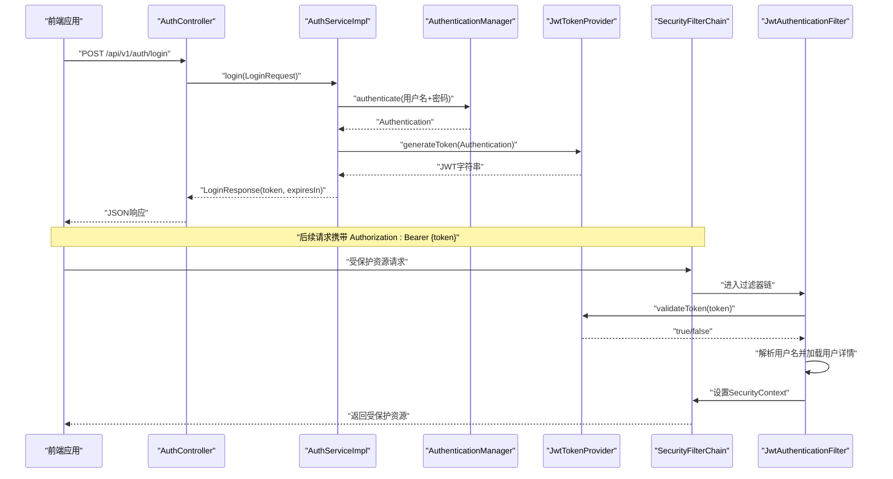
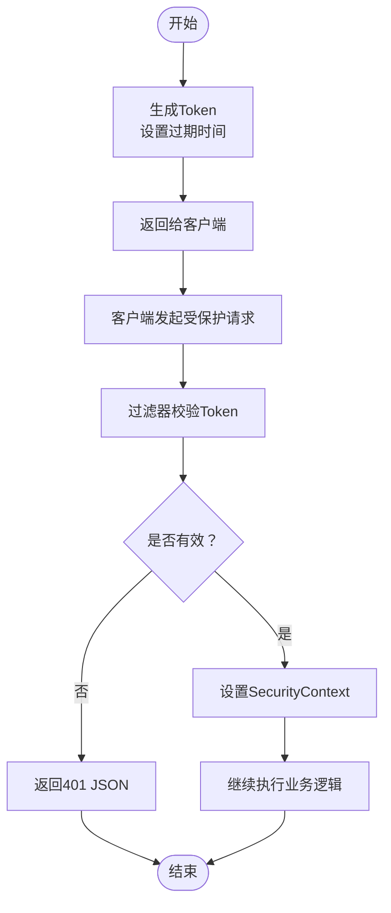
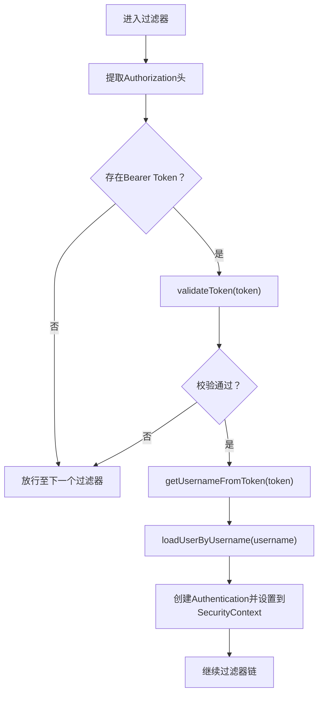
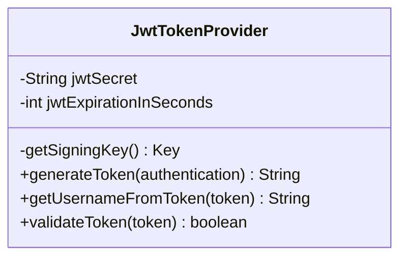
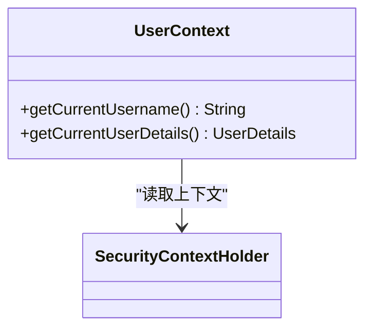
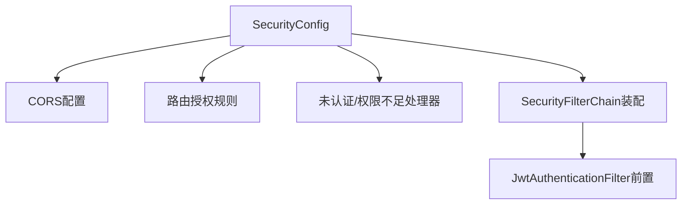
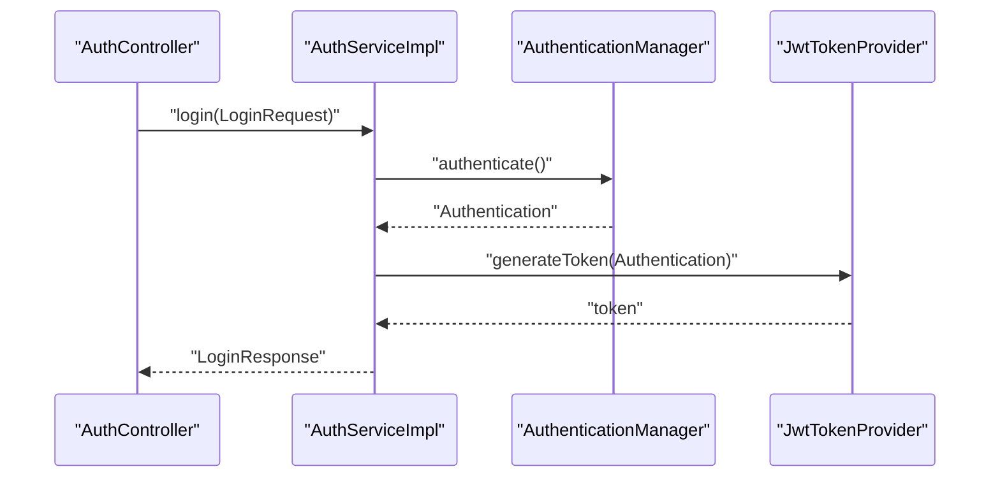
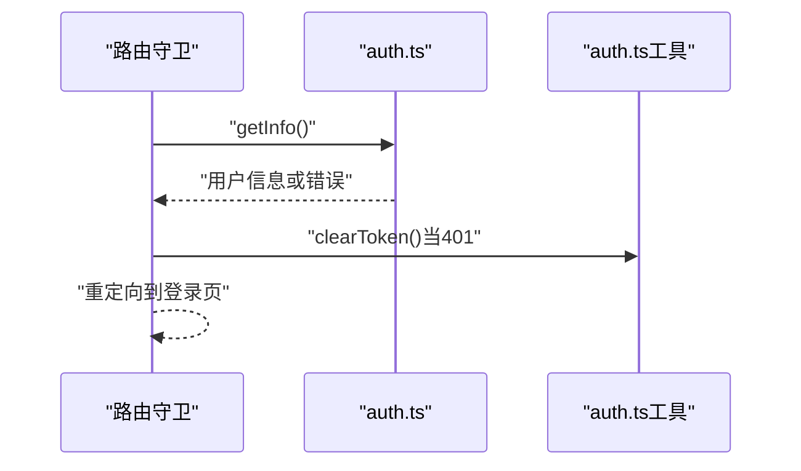
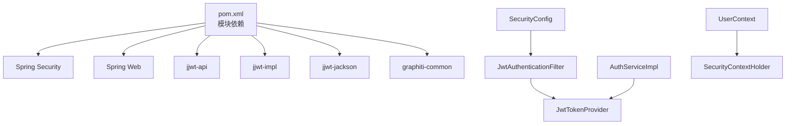

# 安全框架（graphiti-spring-boot-starter-security）

<!--<cite>
**本文引用的文件**
- [SecurityConfig.java](file://ontograph-framework/graphiti-spring-boot-starter-security/src/main/java/com/graphiti/framework/security/config/SecurityConfig.java)
- [JwtAuthenticationFilter.java](file://ontograph-framework/graphiti-spring-boot-starter-security/src/main/java/com/graphiti/framework/security/jwt/JwtAuthenticationFilter.java)
- [JwtTokenProvider.java](file://ontograph-framework/graphiti-spring-boot-starter-security/src/main/java/com/graphiti/framework/security/jwt/JwtTokenProvider.java)
- [UserContext.java](file://ontograph-framework/graphiti-spring-boot-starter-security/src/main/java/com/graphiti/framework/security/util/UserContext.java)
- [pom.xml](file://ontograph-framework/graphiti-spring-boot-starter-security/pom.xml)
- [AuthServiceImpl.java](file://ontograph-module-system/src/main/java/com/graphiti/system/service/impl/AuthServiceImpl.java)
- [AuthController.java](file://ontograph-module-system/src/main/java/com/graphiti/system/controller/AuthController.java)
- [LoginRequest.java](file://ontograph-module-system/src/main/java/com/graphiti/system/dto/LoginRequest.java)
- [LoginResponse.java](file://ontograph-module-system/src/main/java/com/graphiti/system/dto/LoginResponse.java)
- [application.yml](file://ontograph-server/src/main/resources/application.yml)
- [BusinessException.java](file://ontograph-framework/graphiti-common/src/main/java/com/graphiti/common/exception/BusinessException.java)
- [CommonResult.java](file://ontograph-framework/graphiti-common/src/main/java/com/graphiti/common/response/CommonResult.java)
- [SwaggerConfig.java](file://ontograph-server/src/main/java/com/graphiti/config/SwaggerConfig.java)
- [auth.ts](file://ontograph-web/src/api/auth.ts)
- [auth.ts（前端工具）](file://ontograph-web/src/utils/auth.ts)
- [router/index.ts](file://ontograph-web/src/router/index.ts)
</cite>-->

## 目录
1. [简介](#简介)
2. [项目结构](#项目结构)
3. [核心组件](#核心组件)
4. [架构总览](#架构总览)
5. [详细组件分析](#详细组件分析)
6. [依赖分析](#依赖分析)
7. [性能考虑](#性能考虑)
8. [故障排查指南](#故障排查指南)
9. [结论](#结论)
10. [附录](#附录)

## 简介
本文件面向OntoGraph安全框架模块（graphiti-spring-boot-starter-security），系统性阐述基于Spring Security与JWT的认证与授权实现，覆盖以下主题：
- JWT认证机制：Token生成、验证、过期管理
- JwtAuthenticationFilter过滤器：请求头Token提取、用户身份注入、权限上下文建立
- JwtTokenProvider工具类：密钥管理、签发与解析、有效期控制
- UserContext用户上下文：当前用户信息获取、线程安全与跨层传递
- 安全配置：HTTP安全策略、CORS、密码加密、异常处理
- 使用示例与安全最佳实践

## 项目结构
安全模块位于ontograph-framework/graphiti-spring-boot-starter-security目录，主要由以下层次构成：
- config：安全配置类，定义过滤链、CORS、异常处理器、密码编码器、会话策略
- jwt：JWT相关组件（过滤器与Token提供器）
- util：用户上下文工具类

图表来源
- [SecurityConfig.java:115-136](file://ontograph-framework/graphiti-spring-boot-starter-security/src/main/java/com/graphiti/framework/security/config/SecurityConfig.java#L115-L136)
- [JwtAuthenticationFilter.java:26-59](file://ontograph-framework/graphiti-spring-boot-starter-security/src/main/java/com/graphiti/framework/security/jwt/JwtAuthenticationFilter.java#L26-L59)
- [JwtTokenProvider.java:19-86](file://ontograph-framework/graphiti-spring-boot-starter-security/src/main/java/com/graphiti/framework/security/jwt/JwtTokenProvider.java#L19-L86)
- [UserContext.java:13-49](file://ontograph-framework/graphiti-spring-boot-starter-security/src/main/java/com/graphiti/framework/security/util/UserContext.java#L13-L49)
- [AuthController.java:20-36](file://ontograph-module-system/src/main/java/com/graphiti/system/controller/AuthController.java#L20-L36)
- [AuthServiceImpl.java:21-66](file://ontograph-module-system/src/main/java/com/graphiti/system/service/impl/AuthServiceImpl.java#L21-L66)
- [auth.ts:26-50](file://ontograph-web/src/api/auth.ts#L26-L50)
- [auth.ts（前端工具）:1-40](file://ontograph-web/src/utils/auth.ts#L1-L40)
- [router/index.ts:198-232](file://ontograph-web/src/router/index.ts#L198-L232)

章节来源
- [SecurityConfig.java:32-137](file://ontograph-framework/graphiti-spring-boot-starter-security/src/main/java/com/graphiti/framework/security/config/SecurityConfig.java#L32-L137)
- [JwtAuthenticationFilter.java:23-60](file://ontograph-framework/graphiti-spring-boot-starter-security/src/main/java/com/graphiti/framework/security/jwt/JwtAuthenticationFilter.java#L23-L60)
- [JwtTokenProvider.java:13-86](file://ontograph-framework/graphiti-spring-boot-starter-security/src/main/java/com/graphiti/framework/security/jwt/JwtTokenProvider.java#L13-L86)
- [UserContext.java:9-49](file://ontograph-framework/graphiti-spring-boot-starter-security/src/main/java/com/graphiti/framework/security/util/UserContext.java#L9-L49)

## 核心组件
- SecurityConfig：定义无状态会话、CORS、未认证/权限不足统一响应、安全过滤链装配
- JwtAuthenticationFilter：从请求头提取Bearer Token，校验后将认证信息写入SecurityContext
- JwtTokenProvider：基于对称密钥生成与解析JWT，支持过期时间配置
- UserContext：从SecurityContext读取当前用户信息，提供线程安全的跨层访问
- 认证服务与控制器：登录流程中使用AuthenticationManager进行凭证认证，随后签发JWT

章节来源
- [SecurityConfig.java:115-136](file://ontograph-framework/graphiti-spring-boot-starter-security/src/main/java/com/graphiti/framework/security/config/SecurityConfig.java#L115-L136)
- [JwtAuthenticationFilter.java:36-59](file://ontograph-framework/graphiti-spring-boot-starter-security/src/main/java/com/graphiti/framework/security/jwt/JwtAuthenticationFilter.java#L36-L59)
- [JwtTokenProvider.java:40-85](file://ontograph-framework/graphiti-spring-boot-starter-security/src/main/java/com/graphiti/framework/security/jwt/JwtTokenProvider.java#L40-L85)
- [UserContext.java:19-48](file://ontograph-framework/graphiti-spring-boot-starter-security/src/main/java/com/graphiti/framework/security/util/UserContext.java#L19-L48)
- [AuthServiceImpl.java:27-44](file://ontograph-module-system/src/main/java/com/graphiti/system/service/impl/AuthServiceImpl.java#L27-L44)

## 架构总览
下图展示从客户端到后端的完整认证与授权流程，以及关键组件之间的交互。

图表来源
- [AuthController.java:27-32](file://ontograph-module-system/src/main/java/com/graphiti/system/controller/AuthController.java#L27-L32)
- [AuthServiceImpl.java:30-43](file://ontograph-module-system/src/main/java/com/graphiti/system/service/impl/AuthServiceImpl.java#L30-L43)
- [JwtTokenProvider.java:40-53](file://ontograph-framework/graphiti-spring-boot-starter-security/src/main/java/com/graphiti/framework/security/jwt/JwtTokenProvider.java#L40-L53)
- [SecurityConfig.java:115-136](file://ontograph-framework/graphiti-spring-boot-starter-security/src/main/java/com/graphiti/framework/security/config/SecurityConfig.java#L115-L136)
- [JwtAuthenticationFilter.java:44-59](file://ontograph-framework/graphiti-spring-boot-starter-security/src/main/java/com/graphiti/framework/security/jwt/JwtAuthenticationFilter.java#L44-L59)

## 详细组件分析

### JWT认证机制与流程
- Token生成
  - 使用对称密钥（HMAC-SHA）在JwtTokenProvider中构建JWT，包含sub（用户名）、iat（签发时间）、exp（过期时间）
  - 过期时间来自配置项graphiti.security.jwt.expiration，默认24小时
- Token验证
  - JwtAuthenticationFilter在每次请求前调用validateToken进行签名校验与过期检查
  - 验证失败将导致未认证处理（401 JSON）
- 刷新流程
  - 当前实现为无状态JWT，不包含内置的“刷新令牌”机制；建议客户端在token即将过期时主动重新登录以获取新token

图表来源
- [JwtTokenProvider.java:40-85](file://ontograph-framework/graphiti-spring-boot-starter-security/src/main/java/com/graphiti/framework/security/jwt/JwtTokenProvider.java#L40-L85)
- [JwtAuthenticationFilter.java:44-59](file://ontograph-framework/graphiti-spring-boot-starter-security/src/main/java/com/graphiti/framework/security/jwt/JwtAuthenticationFilter.java#L44-L59)
- [SecurityConfig.java:84-113](file://ontograph-framework/graphiti-spring-boot-starter-security/src/main/java/com/graphiti/framework/security/config/SecurityConfig.java#L84-L113)

章节来源
- [JwtTokenProvider.java:21-85](file://ontograph-framework/graphiti-spring-boot-starter-security/src/main/java/com/graphiti/framework/security/jwt/JwtTokenProvider.java#L21-L85)
- [application.yml:25-30](file://ontograph-server/src/main/resources/application.yml#L25-L30)

### JwtAuthenticationFilter过滤器工作机制
- 请求头提取：从Authorization头中提取Bearer Token
- 校验与解析：调用JwtTokenProvider.validateToken与getUsernameFromToken
- 身份注入：通过UserDetailsService加载用户详情，构造UsernamePasswordAuthenticationToken并写入SecurityContextHolder
- 权限检查：后续拦截器与方法级注解可基于SecurityContext中的权限进行校验

图表来源
- [JwtAuthenticationFilter.java:36-59](file://ontograph-framework/graphiti-spring-boot-starter-security/src/main/java/com/graphiti/framework/security/jwt/JwtAuthenticationFilter.java#L36-L59)

章节来源
- [JwtAuthenticationFilter.java:26-59](file://ontograph-framework/graphiti-spring-boot-starter-security/src/main/java/com/graphiti/framework/security/jwt/JwtAuthenticationFilter.java#L26-L59)

### JwtTokenProvider工具类功能
- 密钥管理：基于配置的对称密钥生成签名Key
- Token签发：依据Authentication主体（用户名）与过期时间生成JWT
- 解析与验证：解析签名并校验有效性，异常时记录日志并返回false
- 有效期管理：通过配置项控制默认过期秒数

图表来源
- [JwtTokenProvider.java:19-86](file://ontograph-framework/graphiti-spring-boot-starter-security/src/main/java/com/graphiti/framework/security/jwt/JwtTokenProvider.java#L19-L86)

章节来源
- [JwtTokenProvider.java:19-86](file://ontograph-framework/graphiti-spring-boot-starter-security/src/main/java/com/graphiti/framework/security/jwt/JwtTokenProvider.java#L19-L86)
- [application.yml:25-30](file://ontograph-server/src/main/resources/application.yml#L25-L30)

### UserContext用户上下文管理
- 设计目标：在任意业务层安全地获取当前登录用户信息
- 实现方式：从SecurityContextHolder读取Authentication，校验其存在与认证状态，再从principal中提取用户名或UserDetails
- 异常处理：当未认证或无法识别principal时，抛出业务异常（401）

图表来源
- [UserContext.java:13-49](file://ontograph-framework/graphiti-spring-boot-starter-security/src/main/java/com/graphiti/framework/security/util/UserContext.java#L13-L49)

章节来源
- [UserContext.java:13-49](file://ontograph-framework/graphiti-spring-boot-starter-security/src/main/java/com/graphiti/framework/security/util/UserContext.java#L13-L49)
- [BusinessException.java:10-32](file://ontograph-framework/graphiti-common/src/main/java/com/graphiti/common/exception/BusinessException.java#L10-L32)

### 安全配置详解
- 会话策略：STATELESS，避免服务器端会话开销
- CSRF禁用：无状态JWT场景下无需CSRF防护
- 路由放行：开放认证、Swagger、Actuator等路径
- CORS：允许所有来源、方法、头部，并允许凭据
- 异常处理：未认证返回401 JSON，权限不足返回403 JSON
- 密码加密：BCryptPasswordEncoder

图表来源
- [SecurityConfig.java:68-136](file://ontograph-framework/graphiti-spring-boot-starter-security/src/main/java/com/graphiti/framework/security/config/SecurityConfig.java#L68-L136)

章节来源
- [SecurityConfig.java:68-136](file://ontograph-framework/graphiti-spring-boot-starter-security/src/main/java/com/graphiti/framework/security/config/SecurityConfig.java#L68-L136)

### 认证服务与登录流程
- 控制器接收登录请求，DTO包含用户名与密码
- 服务层使用AuthenticationManager进行凭证认证
- 认证成功后，使用JwtTokenProvider生成JWT并返回给客户端
- 响应DTO包含token与过期时间

图表来源
- [AuthController.java:27-32](file://ontograph-module-system/src/main/java/com/graphiti/system/controller/AuthController.java#L27-L32)
- [AuthServiceImpl.java:27-44](file://ontograph-module-system/src/main/java/com/graphiti/system/service/impl/AuthServiceImpl.java#L27-L44)
- [LoginRequest.java:11-25](file://ontograph-module-system/src/main/java/com/graphiti/system/dto/LoginRequest.java#L11-L25)
- [LoginResponse.java:10-38](file://ontograph-module-system/src/main/java/com/graphiti/system/dto/LoginResponse.java#L10-L38)

章节来源
- [AuthController.java:20-36](file://ontograph-module-system/src/main/java/com/graphiti/system/controller/AuthController.java#L20-L36)
- [AuthServiceImpl.java:21-66](file://ontograph-module-system/src/main/java/com/graphiti/system/service/impl/AuthServiceImpl.java#L21-L66)
- [LoginRequest.java:11-25](file://ontograph-module-system/src/main/java/com/graphiti/system/dto/LoginRequest.java#L11-L25)
- [LoginResponse.java:10-38](file://ontograph-module-system/src/main/java/com/graphiti/system/dto/LoginResponse.java#L10-L38)

### 前端集成与路由守卫
- 前端通过auth.ts封装登录、登出、获取用户信息等API
- 使用auth.ts（工具）在localStorage中持久化token与用户信息
- 路由守卫在访问受保护页面时调用获取用户信息接口，若401则清空token并跳转登录页

图表来源
- [router/index.ts:198-232](file://ontograph-web/src/router/index.ts#L198-L232)
- [auth.ts:26-50](file://ontograph-web/src/api/auth.ts#L26-L50)
- [auth.ts（前端工具）:14-30](file://ontograph-web/src/utils/auth.ts#L14-L30)

章节来源
- [router/index.ts:198-232](file://ontograph-web/src/router/index.ts#L198-L232)
- [auth.ts:26-50](file://ontograph-web/src/api/auth.ts#L26-L50)
- [auth.ts（前端工具）:1-40](file://ontograph-web/src/utils/auth.ts#L1-L40)

## 依赖分析
- 模块依赖
  - graphiti-spring-boot-starter-security依赖Spring Security、Spring Web、jjwt（API/impl/jackson）与graphiti-common
- 组件耦合
  - SecurityConfig装配JwtAuthenticationFilter并注入ObjectMapper用于JSON异常响应
  - JwtAuthenticationFilter依赖JwtTokenProvider与UserDetailsService
  - AuthServiceImpl依赖AuthenticationManager与JwtTokenProvider
  - UserContext依赖SecurityContextHolder

图表来源
- [pom.xml:16-47](file://ontograph-framework/graphiti-spring-boot-starter-security/pom.xml#L16-L47)
- [SecurityConfig.java:37-38](file://ontograph-framework/graphiti-spring-boot-starter-security/src/main/java/com/graphiti/framework/security/config/SecurityConfig.java#L37-L38)
- [JwtAuthenticationFilter.java:28-29](file://ontograph-framework/graphiti-spring-boot-starter-security/src/main/java/com/graphiti/framework/security/jwt/JwtAuthenticationFilter.java#L28-L29)
- [JwtTokenProvider.java:19-33](file://ontograph-framework/graphiti-spring-boot-starter-security/src/main/java/com/graphiti/framework/security/jwt/JwtTokenProvider.java#L19-L33)
- [AuthServiceImpl.java:23-24](file://ontograph-module-system/src/main/java/com/graphiti/system/service/impl/AuthServiceImpl.java#L23-L24)
- [UserContext.java:20-21](file://ontograph-framework/graphiti-spring-boot-starter-security/src/main/java/com/graphiti/framework/security/util/UserContext.java#L20-L21)

章节来源
- [pom.xml:16-47](file://ontograph-framework/graphiti-spring-boot-starter-security/pom.xml#L16-L47)

## 性能考虑
- 无状态设计：JWT无状态，适合水平扩展，避免服务器端会话同步开销
- 过滤器链轻量：OncePerRequestFilter确保每个请求仅处理一次
- 密钥计算：对称密钥签名/验签开销较小，建议使用足够长度的密钥
- CORS与CSRF：禁用CSRF、开启CORS在开发环境友好，生产环境建议限制来源与方法
- 密码加密：BCrypt成本因子适中，兼顾安全性与性能

## 故障排查指南
- 401 未认证
  - 可能原因：缺少Authorization头、Token缺失或格式错误、签名无效、过期
  - 处理建议：确认前端正确携带Bearer Token；检查服务端密钥与过期时间配置
- 403 权限不足
  - 可能原因：认证通过但缺少所需角色/权限
  - 处理建议：检查方法级或URL级权限配置
- 无法获取当前用户信息
  - 可能原因：SecurityContext中未设置Authentication或未认证
  - 处理建议：确认JwtAuthenticationFilter已正确注入；检查UserContext调用时机

章节来源
- [SecurityConfig.java:84-113](file://ontograph-framework/graphiti-spring-boot-starter-security/src/main/java/com/graphiti/framework/security/config/SecurityConfig.java#L84-L113)
- [JwtAuthenticationFilter.java:44-59](file://ontograph-framework/graphiti-spring-boot-starter-security/src/main/java/com/graphiti/framework/security/jwt/JwtAuthenticationFilter.java#L44-L59)
- [UserContext.java:19-32](file://ontograph-framework/graphiti-spring-boot-starter-security/src/main/java/com/graphiti/framework/security/util/UserContext.java#L19-L32)

## 结论
OntoGraph安全模块采用Spring Security + JWT的无状态认证方案，具备清晰的过滤器链、统一的异常处理与CORS配置。JwtTokenProvider负责Token生命周期管理，JwtAuthenticationFilter完成请求级的身份注入，UserContext提供便捷的当前用户访问。结合系统模块的认证服务与前端路由守卫，形成完整的登录、鉴权与会话管理闭环。

## 附录

### 配置项参考
- graphiti.security.jwt.secret：JWT对称密钥（建议至少512位）
- graphiti.security.jwt.expiration：Token过期时间（秒，默认86400）

章节来源
- [application.yml:25-30](file://ontograph-server/src/main/resources/application.yml#L25-L30)

### 使用示例（步骤说明）
- 后端
  - 在SecurityConfig中启用WebSecurity并装配JwtAuthenticationFilter
  - 在认证服务中使用AuthenticationManager进行凭证认证，随后调用JwtTokenProvider生成Token
  - 在受保护接口中通过SecurityContext或UserContext获取当前用户
- 前端
  - 登录成功后保存token与用户信息
  - 请求受保护资源时在Authorization头中携带Bearer Token
  - 路由守卫在访问受保护页面时调用获取用户信息接口，处理401并跳转登录页

章节来源
- [SecurityConfig.java:115-136](file://ontograph-framework/graphiti-spring-boot-starter-security/src/main/java/com/graphiti/framework/security/config/SecurityConfig.java#L115-L136)
- [AuthServiceImpl.java:27-44](file://ontograph-module-system/src/main/java/com/graphiti/system/service/impl/AuthServiceImpl.java#L27-L44)
- [auth.ts:26-50](file://ontograph-web/src/api/auth.ts#L26-L50)
- [auth.ts（前端工具）:14-30](file://ontograph-web/src/utils/auth.ts#L14-L30)
- [router/index.ts:198-232](file://ontograph-web/src/router/index.ts#L198-L232)

### 安全最佳实践
- 密钥管理：使用强随机密钥并妥善保管；定期轮换；避免硬编码
- Token过期：合理设置过期时间；对敏感操作可缩短过期或引入二次验证
- CORS限制：生产环境限制allowedOrigins与allowedMethods
- 传输安全：HTTPS强制；避免在Cookie中存储敏感信息
- 异常处理：统一返回JSON错误；不泄露敏感细节
- 前端安全：本地存储token时注意XSS防护；路由守卫与拦截器双重保障