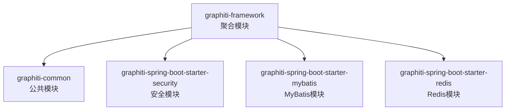
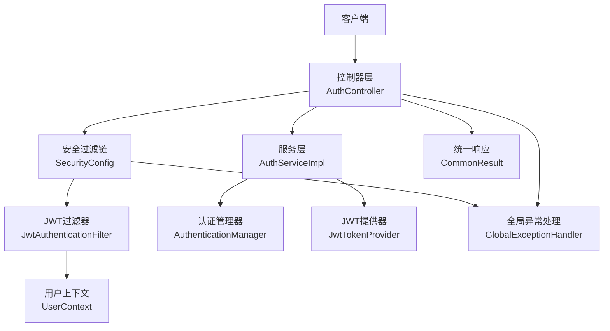
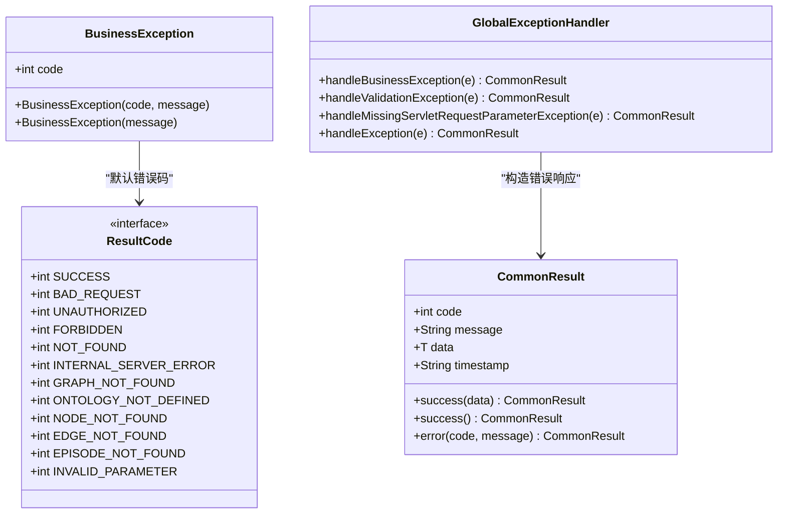
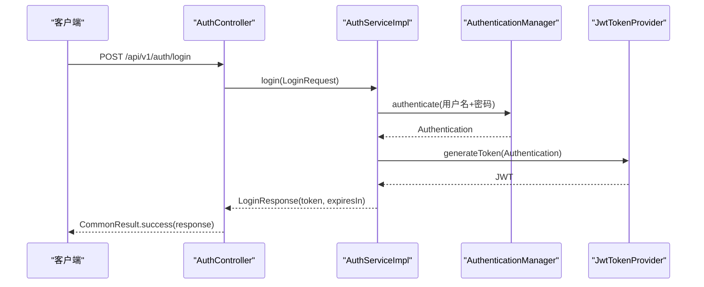
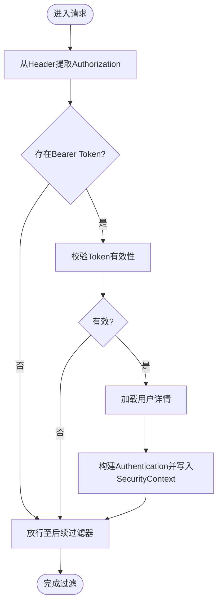
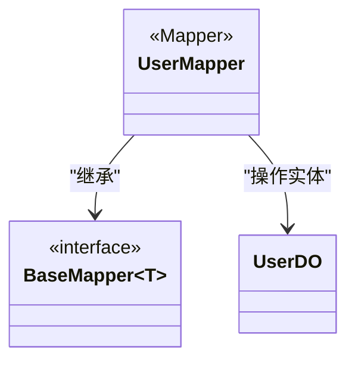
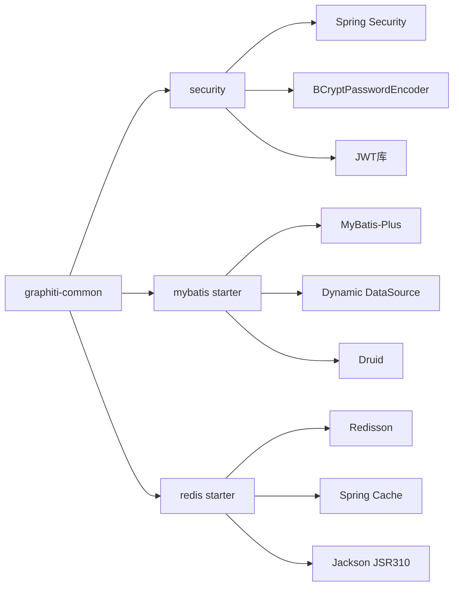

# 框架模块 (graphiti-framework)

<cite>
**本文引用的文件**
- [graphiti-framework/pom.xml](file://graphiti-framework/pom.xml)
- [graphiti-common/pom.xml](file://graphiti-common/pom.xml)
- [CommonResult.java](file://graphiti-framework/graphiti-common/src/main/java/com/raphiti/common/response/CommonResult.java)
- [GlobalExceptionHandler.java](file://graphiti-framework/graphiti-common/src/main/java/com/raphiti/common/exception/GlobalExceptionHandler.java)
- [BusinessException.java](file://graphiti-framework/graphiti-common/src/main/java/com/raphiti/common/exception/BusinessException.java)
- [ResultCode.java](file://graphiti-framework/graphiti-common/src/main/java/com/raphiti/common/constants/ResultCode.java)
- [SecurityConfig.java](file://graphiti-framework/graphiti-spring-boot-starter-security/src/main/java/com/raphiti/framework/security/config/SecurityConfig.java)
- [JwtAuthenticationFilter.java](file://graphiti-framework/graphiti-spring-boot-starter-security/src/main/java/com/raphiti/framework/security/jwt/JwtAuthenticationFilter.java)
- [JwtTokenProvider.java](file://graphiti-framework/graphiti-spring-boot-starter-security/src/main/java/com/raphiti/framework/security/jwt/JwtTokenProvider.java)
- [UserContext.java](file://graphiti-framework/graphiti-spring-boot-starter-security/src/main/java/com/raphiti/framework/security/util/UserContext.java)
- [graphiti-spring-boot-starter-mybatis/pom.xml](file://graphiti-framework/graphiti-spring-boot-starter-mybatis/pom.xml)
- [graphiti-spring-boot-starter-redis/pom.xml](file://graphiti-framework/graphiti-spring-boot-starter-redis/pom.xml)
- [application.yml](file://graphiti-server/src/main/resources/application.yml)
- [application-dev.yml](file://graphiti-server/src/main/resources/application-dev.yml)
- [AuthController.java](file://graphiti-module-system/src/main/java/com/raphiti/system/controller/AuthController.java)
- [AuthServiceImpl.java](file://graphiti-module-system/src/main/java/com/raphiti/system/service/impl/AuthServiceImpl.java)
- [UserMapper.java](file://graphiti-module-system/src/main/java/com/raphiti/system/dal/mysql/UserMapper.java)
</cite>

## 目录
1. [引言](#引言)
2. [项目结构](#项目结构)
3. [核心组件](#核心组件)
4. [架构总览](#架构总览)
5. [详细组件分析](#详细组件分析)
6. [依赖分析](#依赖分析)
7. [性能考虑](#性能考虑)
8. [故障排查指南](#故障排查指南)
9. [结论](#结论)
10. [附录](#附录)

## 引言
本文件面向Graphiti-Java框架模块，聚焦以下子系统的深入解析与使用指南：
- graphiti-common通用组件：统一响应封装、全局异常处理、业务异常定义与返回码体系
- graphiti-spring-boot-starter-security安全框架：JWT认证机制、用户上下文管理、安全配置
- graphiti-spring-boot-starter-mybatis数据访问层：MyBatis-Plus集成、动态数据源配置、通用Mapper设计
- graphiti-spring-boot-starter-redis缓存框架：Redisson集成、分布式锁、缓存策略
同时提供接口设计、配置选项、扩展点与最佳实践，并以图示与路径指引帮助快速上手。

## 项目结构
graphiti-framework作为聚合模块，按“技术组件”拆分为多个starter子模块，采用“命名规范：graphiti-spring-boot-starter-*”的组织方式，便于按需引入与扩展。

图表来源
- [graphiti-framework/pom.xml:22-27](file://graphiti-framework/pom.xml#L22-L27)

章节来源
- [graphiti-framework/pom.xml:1-29](file://graphiti-framework/pom.xml#L1-L29)

## 核心组件
本节概述graphiti-common公共模块的核心能力，包括统一响应、全局异常处理与业务异常体系，为上层模块提供一致的输出与错误语义。

- 统一响应封装
  - 通过统一响应体承载code、message、data与timestamp，确保前后端交互一致性
  - 提供success与error两类静态工厂方法，简化控制器返回
- 全局异常处理
  - 使用@RestControllerAdvice集中捕获业务异常、参数校验异常与通用异常
  - 对不同异常类型返回标准化错误响应，便于前端统一处理
- 业务异常定义
  - BusinessException携带业务错误码与消息，配合全局处理器进行统一处理
- 返回码体系
  - ResultCode定义标准HTTP语义码与Graphiti业务码区间，便于扩展与维护

章节来源
- [CommonResult.java:13-67](file://graphiti-framework/graphiti-common/src/main/java/com/raphiti/common/response/CommonResult.java#L13-L67)
- [GlobalExceptionHandler.java:17-73](file://graphiti-framework/graphiti-common/src/main/java/com/raphiti/common/exception/GlobalExceptionHandler.java#L17-L73)
- [BusinessException.java:10-32](file://graphiti-framework/graphiti-common/src/main/java/com/raphiti/common/exception/BusinessException.java#L10-L32)
- [ResultCode.java:7-22](file://graphiti-framework/graphiti-common/src/main/java/com/raphiti/common/constants/ResultCode.java#L7-L22)

## 架构总览
下图展示从客户端到控制器、再到安全过滤链与数据访问的整体调用路径，突出JWT认证、统一响应与异常处理的关键节点。

图表来源
- [AuthController.java:16-54](file://graphiti-module-system/src/main/java/com/raphiti/system/controller/AuthController.java#L16-L54)
- [SecurityConfig.java:32-137](file://graphiti-framework/graphiti-spring-boot-starter-security/src/main/java/com/raphiti/framework/security/config/SecurityConfig.java#L32-L137)
- [JwtAuthenticationFilter.java:23-60](file://graphiti-framework/graphiti-spring-boot-starter-security/src/main/java/com/raphiti/framework/security/jwt/JwtAuthenticationFilter.java#L23-L60)
- [UserContext.java:12-49](file://graphiti-framework/graphiti-spring-boot-starter-security/src/main/java/com/raphiti/framework/security/util/UserContext.java#L12-L49)
- [AuthServiceImpl.java:18-66](file://graphiti-module-system/src/main/java/com/raphiti/system/service/impl/AuthServiceImpl.java#L18-L66)
- [JwtTokenProvider.java:17-86](file://graphiti-framework/graphiti-spring-boot-starter-security/src/main/java/com/raphiti/framework/security/jwt/JwtTokenProvider.java#L17-L86)
- [CommonResult.java:13-67](file://graphiti-framework/graphiti-common/src/main/java/com/raphiti/common/response/CommonResult.java#L13-L67)
- [GlobalExceptionHandler.java:17-73](file://graphiti-framework/graphiti-common/src/main/java/com/raphiti/common/exception/GlobalExceptionHandler.java#L17-L73)

## 详细组件分析

### graphiti-common通用组件
- 设计理念
  - 以“约定优于配置”的方式，提供统一的响应与异常处理，降低控制器样板代码
  - 通过ResultCode与BusinessException形成清晰的错误语义边界
- 关键实现
  - 统一响应：CommonResult封装标准字段与静态工厂方法
  - 全局异常：GlobalExceptionHandler按异常类型分派处理
  - 业务异常：BusinessException支持自定义错误码与默认值
  - 返回码：ResultCode定义HTTP语义码与业务码区间
- 使用建议
  - 控制器一律返回CommonResult.success或CommonResult.error
  - 业务分支抛出BusinessException，避免直接返回错误码
  - 扩展业务码时遵循1xxx区间并保持语义清晰

图表来源
- [CommonResult.java:13-67](file://graphiti-framework/graphiti-common/src/main/java/com/raphiti/common/response/CommonResult.java#L13-L67)
- [BusinessException.java:10-32](file://graphiti-framework/graphiti-common/src/main/java/com/raphiti/common/exception/BusinessException.java#L10-L32)
- [GlobalExceptionHandler.java:17-73](file://graphiti-framework/graphiti-common/src/main/java/com/raphiti/common/exception/GlobalExceptionHandler.java#L17-L73)
- [ResultCode.java:7-22](file://graphiti-framework/graphiti-common/src/main/java/com/raphiti/common/constants/ResultCode.java#L7-L22)

章节来源
- [CommonResult.java:13-67](file://graphiti-framework/graphiti-common/src/main/java/com/raphiti/common/response/CommonResult.java#L13-L67)
- [GlobalExceptionHandler.java:17-73](file://graphiti-framework/graphiti-common/src/main/java/com/raphiti/common/exception/GlobalExceptionHandler.java#L17-L73)
- [BusinessException.java:10-32](file://graphiti-framework/graphiti-common/src/main/java/com/raphiti/common/exception/BusinessException.java#L10-L32)
- [ResultCode.java:7-22](file://graphiti-framework/graphiti-common/src/main/java/com/raphiti/common/constants/ResultCode.java#L7-L22)

### graphiti-spring-boot-starter-security安全框架
- JWT认证机制
  - JwtTokenProvider负责生成、解析与校验JWT，支持密钥派生与过期时间配置
  - JwtAuthenticationFilter从请求头提取Bearer Token，验证后写入SecurityContext
  - SecurityConfig配置无状态会话、CORS、放行路径与认证入口点/拒绝处理器
- 用户上下文管理
  - UserContext提供getCurrentUsername与getCurrentUserDetails，统一获取当前用户信息
- 安全配置要点
  - 放行登录、Swagger与Actuator等路径
  - 未认证与权限不足分别返回JSON错误体
  - 使用BCryptPasswordEncoder进行密码编码

图表来源
- [AuthController.java:26-32](file://graphiti-module-system/src/main/java/com/raphiti/system/controller/AuthController.java#L26-L32)
- [AuthServiceImpl.java:26-44](file://graphiti-module-system/src/main/java/com/raphiti/system/service/impl/AuthServiceImpl.java#L26-L44)
- [JwtTokenProvider.java:40-53](file://graphiti-framework/graphiti-spring-boot-starter-security/src/main/java/com/raphiti/framework/security/jwt/JwtTokenProvider.java#L40-L53)

图表来源
- [JwtAuthenticationFilter.java:36-59](file://graphiti-framework/graphiti-spring-boot-starter-security/src/main/java/com/raphiti/framework/security/jwt/JwtAuthenticationFilter.java#L36-L59)

章节来源
- [SecurityConfig.java:32-137](file://graphiti-framework/graphiti-spring-boot-starter-security/src/main/java/com/raphiti/framework/security/config/SecurityConfig.java#L32-L137)
- [JwtAuthenticationFilter.java:23-60](file://graphiti-framework/graphiti-spring-boot-starter-security/src/main/java/com/raphiti/framework/security/jwt/JwtAuthenticationFilter.java#L23-L60)
- [JwtTokenProvider.java:17-86](file://graphiti-framework/graphiti-spring-boot-starter-security/src/main/java/com/raphiti/framework/security/jwt/JwtTokenProvider.java#L17-L86)
- [UserContext.java:12-49](file://graphiti-framework/graphiti-spring-boot-starter-security/src/main/java/com/raphiti/framework/security/util/UserContext.java#L12-L49)

### graphiti-spring-boot-starter-mybatis数据访问层
- MyBatis-Plus集成
  - 通过starter引入MyBatis-Plus与Spring Boot 3适配，提供增强的CRUD能力
  - 配合BaseMapper接口，DAO层零SQL起步
- 动态数据源配置
  - 使用dynamic-datasource-spring-boot3-starter实现多数据源切换
  - 在application-dev.yml中演示master主库配置与HikariCP参数
- 通用Mapper设计
  - Mapper接口继承BaseMapper即可获得通用增删改查能力
  - 示例：UserMapper继承BaseMapper<UserDO>

图表来源
- [UserMapper.java:10-12](file://graphiti-module-system/src/main/java/com/raphiti/system/dal/mysql/UserMapper.java#L10-L12)

章节来源
- [graphiti-spring-boot-starter-mybatis/pom.xml:19-41](file://graphiti-framework/graphiti-spring-boot-starter-mybatis/pom.xml#L19-L41)
- [application-dev.yml:487-502](file://graphiti-server/src/main/resources/application-dev.yml#L487-L502)
- [UserMapper.java:10-12](file://graphiti-module-system/src/main/java/com/raphiti/system/dal/mysql/UserMapper.java#L10-L12)

### graphiti-spring-boot-starter-redis缓存框架
- Redisson集成
  - 通过redisson-spring-boot-starter引入Redisson，提供分布式对象、集合与锁等能力
- 缓存策略
  - 配合spring-boot-starter-cache启用注解驱动的缓存抽象
  - Jackson JSR310模块支持Java时间序列化
- 分布式锁
  - 使用Redisson提供的RLock实现可重入分布式锁，保障并发安全

章节来源
- [graphiti-spring-boot-starter-redis/pom.xml:19-37](file://graphiti-framework/graphiti-spring-boot-starter-redis/pom.xml#L19-L37)
- [application-dev.yml:672-676](file://graphiti-server/src/main/resources/application-dev.yml#L672-L676)

## 依赖分析
- 模块内聚与耦合
  - graphiti-common为上层模块提供统一响应与异常处理，低耦合、高复用
  - security模块依赖common的异常与响应，形成清晰的依赖方向
  - mybatis与redis模块各自独立，通过starter引入，避免不必要的耦合
- 外部依赖
  - security：Spring Security、BCryptPasswordEncoder、JWT库
  - mybatis：MyBatis-Plus、Dynamic DataSource、Druid
  - redis：Redisson、Spring Cache、Jackson JSR310

图表来源
- [graphiti-common/pom.xml:16-38](file://graphiti-common/pom.xml#L16-L38)
- [graphiti-spring-boot-starter-mybatis/pom.xml:19-41](file://graphiti-framework/graphiti-spring-boot-starter-mybatis/pom.xml#L19-L41)
- [graphiti-spring-boot-starter-redis/pom.xml:19-37](file://graphiti-framework/graphiti-spring-boot-starter-redis/pom.xml#L19-L37)

章节来源
- [graphiti-common/pom.xml:16-38](file://graphiti-common/pom.xml#L16-L38)
- [graphiti-spring-boot-starter-mybatis/pom.xml:19-41](file://graphiti-framework/graphiti-spring-boot-starter-mybatis/pom.xml#L19-L41)
- [graphiti-spring-boot-starter-redis/pom.xml:19-37](file://graphiti-framework/graphiti-spring-boot-starter-redis/pom.xml#L19-L37)

## 性能考虑
- 安全过滤链
  - 采用无状态会话与OncePerRequestFilter保证每请求只处理一次
  - Token校验与用户加载应尽量轻量，避免阻塞请求线程
- 数据访问层
  - 合理配置连接池参数（最大连接数、最小空闲、连接超时）
  - 使用MyBatis-Plus的分页插件与条件构造器，减少SQL拼接与内存占用
- 缓存策略
  - 对热点读取使用Redis缓存，结合合理TTL与缓存穿透防护
  - 分布式锁粒度要适中，避免长时间持有导致阻塞

## 故障排查指南
- 未认证/权限不足
  - 检查SecurityConfig中的放行路径与授权规则
  - 确认请求头是否包含正确的Bearer Token
- 参数校验失败
  - 查看GlobalExceptionHandler对MethodArgumentNotValidException的处理
  - 校验DTO字段注解与前端传参是否一致
- 业务异常
  - 使用BusinessException抛出明确错误码与消息
  - 在服务层捕获并转换为统一响应
- JWT问题
  - 检查graphiti.security.jwt.secret与expiration配置
  - 校验Token签名算法与密钥长度

章节来源
- [SecurityConfig.java:84-113](file://graphiti-framework/graphiti-spring-boot-starter-security/src/main/java/com/raphiti/framework/security/config/SecurityConfig.java#L84-L113)
- [GlobalExceptionHandler.java:37-72](file://graphiti-framework/graphiti-common/src/main/java/com/raphiti/common/exception/GlobalExceptionHandler.java#L37-L72)
- [application.yml:25-34](file://graphiti-server/src/main/resources/application.yml#L25-L34)

## 结论
graphiti-framework通过模块化设计实现了“约定优先”的开发体验：统一响应与异常处理降低了沟通成本；JWT安全链路提供了无状态认证能力；MyBatis-Plus与动态数据源满足多数据源场景；Redisson与Spring Cache为高并发与分布式场景提供可靠支撑。建议在实际项目中遵循本文档的接口设计、配置选项与最佳实践，确保系统的一致性与可维护性。

## 附录
- 配置参考
  - JWT密钥与过期时间：见application.yml
  - 开发环境数据源与Redis：见application-dev.yml
- 快速开始
  - 引入对应starter后，按需在控制器中返回CommonResult.success或抛出BusinessException
  - 在服务层使用UserContext获取当前用户信息
  - 在DAO层继承BaseMapper即可获得通用CRUD能力

章节来源
- [application.yml:25-67](file://graphiti-server/src/main/resources/application.yml#L25-L67)
- [application-dev.yml:487-676](file://graphiti-server/src/main/resources/application-dev.yml#L487-L676)