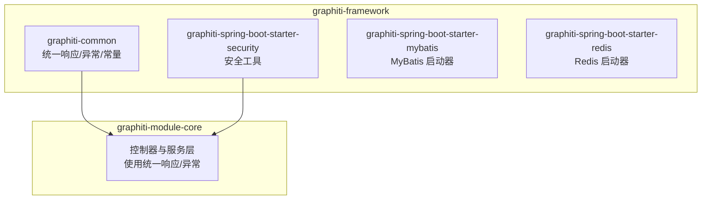
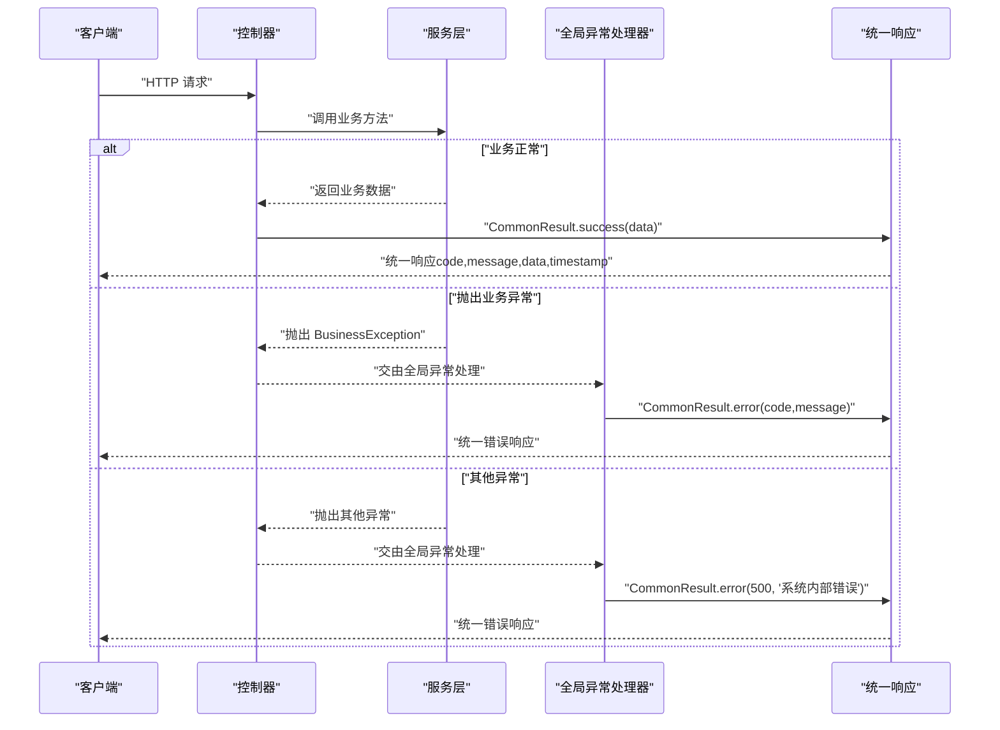
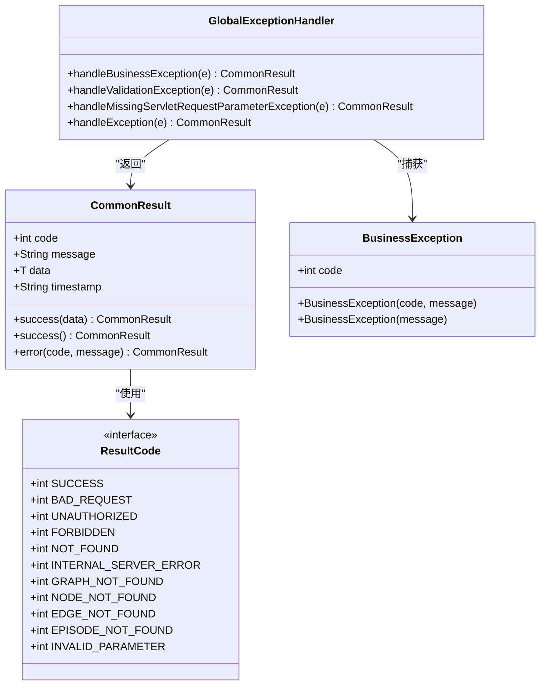
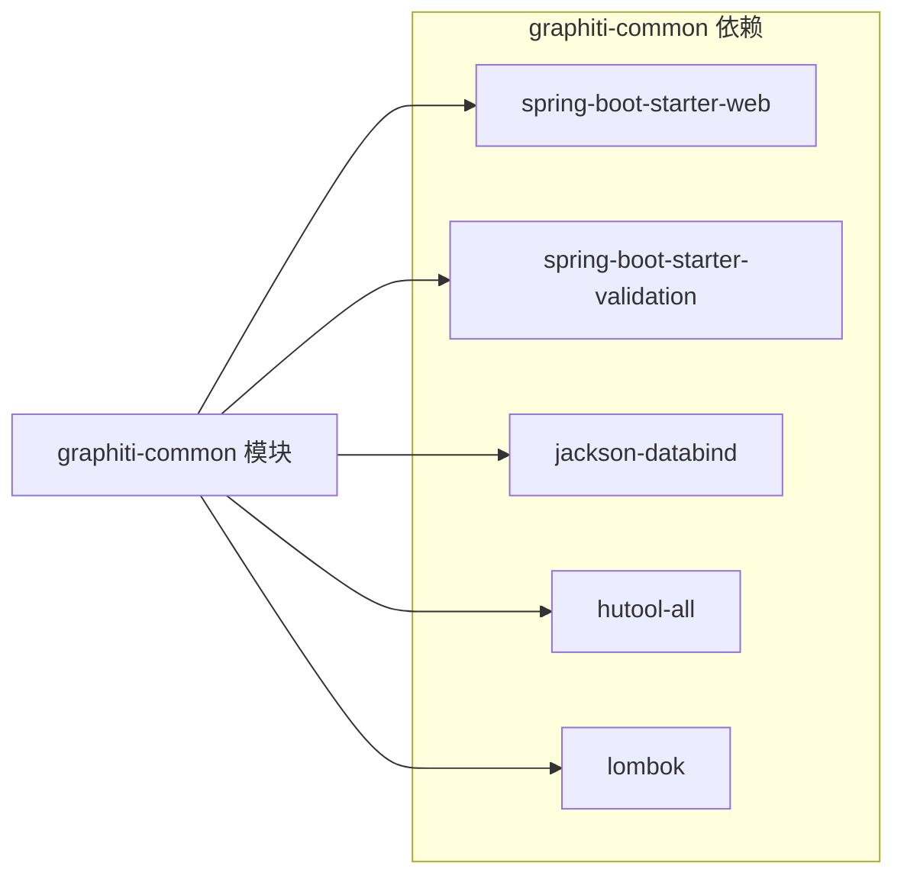

# 通用组件 (graphiti-common)

<cite>
**本文引用的文件**
- [CommonResult.java](file://graphiti-framework/graphiti-common/src/main/java/com/graphiti/common/response/CommonResult.java)
- [ResultCode.java](file://graphiti-framework/graphiti-common/src/main/java/com/graphiti/common/constants/ResultCode.java)
- [BusinessException.java](file://graphiti-framework/graphiti-common/src/main/java/com/graphiti/common/exception/BusinessException.java)
- [GlobalExceptionHandler.java](file://graphiti-framework/graphiti-common/src/main/java/com/graphiti/common/exception/GlobalExceptionHandler.java)
- [pom.xml（graphiti-common）](file://graphiti-framework/graphiti-common/pom.xml)
- [pom.xml（graphiti-framework）](file://graphiti-framework/pom.xml)
- [CustomInstructionController.java](file://graphiti-module-core/src/main/java/com/graphiti/module/graphiti/controller/admin/CustomInstructionController.java)
- [DataImportServiceImpl.java](file://graphiti-module-core/src/main/java/com/graphiti/module/graphiti/service/impl/DataImportServiceImpl.java)
- [UserContext.java](file://graphiti-framework/graphiti-spring-boot-starter-security/src/main/java/com/graphiti/framework/security/util/UserContext.java)
</cite>

## 目录
1. [简介](#简介)
2. [项目结构](#项目结构)
3. [核心组件](#核心组件)
4. [架构总览](#架构总览)
5. [组件详解](#组件详解)
6. [依赖关系分析](#依赖关系分析)
7. [性能与可维护性](#性能与可维护性)
8. [故障排查指南](#故障排查指南)
9. [结论](#结论)
10. [附录：使用示例与最佳实践](#附录使用示例与最佳实践)

## 简介
本文件面向 Graphiti-Java 通用组件模块（graphiti-common），系统化阐述统一响应封装、全局异常处理、错误码设计与使用规范，并结合控制器与服务层的实际用法，给出可操作的使用示例与最佳实践。目标是帮助开发者在不牺牲一致性的前提下，快速、安全地构建标准响应与健壮的异常处理。

## 项目结构
graphiti-common 是框架层的一个子模块，提供统一响应、错误码常量与全局异常处理能力，供上层模块复用。

图表来源
- [pom.xml（graphiti-framework）:22-27](file://graphiti-framework/pom.xml#L22-L27)

章节来源
- [pom.xml（graphiti-framework）:1-29](file://graphiti-framework/pom.xml#L1-L29)

## 核心组件
- 统一响应封装：CommonResult<T> 提供统一的成功/错误响应结构，内置时间戳与静态工厂方法，便于在控制器中快速返回标准格式。
- 错误码常量：ResultCode 接口定义了标准错误码域（如 200 成功、4xx 客户端错误、5xx 服务端错误、1xxx 业务错误），并提供若干 Graphiti 专用业务错误码。
- 业务异常：BusinessException 作为业务异常载体，携带错误码与消息，便于在服务层抛出并在全局异常处理器中统一拦截。
- 全局异常处理：GlobalExceptionHandler 使用 Spring MVC 的@RestControllerAdvice 统一捕获各类异常，输出统一响应格式，保证对外接口的一致性。

章节来源
- [CommonResult.java:13-67](file://graphiti-framework/graphiti-common/src/main/java/com/graphiti/common/response/CommonResult.java#L13-L67)
- [ResultCode.java:7-22](file://graphiti-framework/graphiti-common/src/main/java/com/graphiti/common/constants/ResultCode.java#L7-L22)
- [BusinessException.java:10-32](file://graphiti-framework/graphiti-common/src/main/java/com/graphiti/common/exception/BusinessException.java#L10-L32)
- [GlobalExceptionHandler.java:17-73](file://graphiti-framework/graphiti-common/src/main/java/com/graphiti/common/exception/GlobalExceptionHandler.java#L17-L73)

## 架构总览
统一响应与异常处理在调用链中的位置如下：

图表来源
- [GlobalExceptionHandler.java:26-72](file://graphiti-framework/graphiti-common/src/main/java/com/graphiti/common/exception/GlobalExceptionHandler.java#L26-L72)
- [CommonResult.java:39-66](file://graphiti-framework/graphiti-common/src/main/java/com/graphiti/common/response/CommonResult.java#L39-L66)
- [BusinessException.java:20-31](file://graphiti-framework/graphiti-common/src/main/java/com/graphiti/common/exception/BusinessException.java#L20-L31)

## 组件详解

### 统一响应封装：CommonResult
- 设计理念
  - 统一对外响应结构，包含 code、message、data、timestamp，便于前端与监控系统解析。
  - 静态工厂方法 success/error 提供简洁的构造方式，减少样板代码。
- 关键字段
  - code：状态码，遵循 ResultCode 常量域。
  - message：人类可读的提示信息。
  - data：泛型数据体，支持无数据场景（success()）。
  - timestamp：ISO_LOCAL_DATE_TIME 格式的时间戳。
- 使用建议
  - 控制器层优先使用 CommonResult.success(...) 返回成功响应。
  - 对于明确的错误场景，使用 CommonResult.error(...) 返回错误响应。
  - 当需要返回空数据但成功时，使用无参 success()。

章节来源
- [CommonResult.java:13-67](file://graphiti-framework/graphiti-common/src/main/java/com/graphiti/common/response/CommonResult.java#L13-L67)

### 错误码常量：ResultCode
- 设计模式
  - 采用接口常量定义，避免硬编码，集中管理错误码域。
  - 分层清晰：2xx 成功、4xx 客户端错误、5xx 服务端错误、1xxx 业务错误。
- 常用码值
  - 成功：200
  - 客户端错误：400、401、403、404
  - 服务端错误：500
  - 业务错误（Graphiti）：如图谱/节点/边/事件不存在、参数非法等
- 使用规范
  - 控制器与服务层统一从 ResultCode 引用错误码，保持一致性。
  - 自定义业务错误码建议从 1001 起步，避免与标准码冲突。

章节来源
- [ResultCode.java:7-22](file://graphiti-framework/graphiti-common/src/main/java/com/graphiti/common/constants/ResultCode.java#L7-L22)

### 业务异常：BusinessException
- 设计要点
  - 继承 RuntimeException，适合在业务流程中抛出。
  - 携带 code 字段，便于全局异常处理器映射到统一响应。
  - 提供两个构造器：显式 code 与 message；以及默认 code=500 的便捷构造。
- 适用场景
  - 服务层校验失败、资源不存在、参数非法等业务判定。
  - 与 ResultCode 中的业务错误码配合使用。

章节来源
- [BusinessException.java:10-32](file://graphiti-framework/graphiti-common/src/main/java/com/graphiti/common/exception/BusinessException.java#L10-L32)

### 全局异常处理器：GlobalExceptionHandler
- 处理范围
  - BusinessException：记录日志并返回对应 code/message。
  - 参数校验异常（MethodArgumentNotValidException）：拼接字段级错误信息，返回 400。
  - 缺少请求参数（MissingServletRequestParameterException）：返回 400 并记录告警。
  - 其他未捕获异常：记录错误日志并返回 500。
- 行为特征
  - 使用 @RestControllerAdvice 全局生效。
  - 对不同异常进行分类处理，确保响应格式统一。
  - 通过 CommonResult.error(...) 输出标准错误响应。

章节来源
- [GlobalExceptionHandler.java:17-73](file://graphiti-framework/graphiti-common/src/main/java/com/graphiti/common/exception/GlobalExceptionHandler.java#L17-L73)

### 类关系图

图表来源
- [CommonResult.java:13-67](file://graphiti-framework/graphiti-common/src/main/java/com/graphiti/common/response/CommonResult.java#L13-L67)
- [ResultCode.java:7-22](file://graphiti-framework/graphiti-common/src/main/java/com/graphiti/common/constants/ResultCode.java#L7-L22)
- [BusinessException.java:10-32](file://graphiti-framework/graphiti-common/src/main/java/com/graphiti/common/exception/BusinessException.java#L10-L32)
- [GlobalExceptionHandler.java:17-73](file://graphiti-framework/graphiti-common/src/main/java/com/graphiti/common/exception/GlobalExceptionHandler.java#L17-L73)

## 依赖关系分析
- graphiti-common 依赖
  - spring-boot-starter-web：提供 Web MVC 能力与 @RestControllerAdvice。
  - spring-boot-starter-validation：提供参数校验能力，用于处理 MethodArgumentNotValidException。
  - jackson-databind：JSON 序列化/反序列化。
  - hutool：常用工具库。
  - lombok：简化 POJO 与异常类的样板代码。
- 模块聚合
  - graphiti-framework 作为聚合模块，管理 graphiti-common 与其他启动器模块。

图表来源
- [pom.xml（graphiti-common）:16-38](file://graphiti-framework/graphiti-common/pom.xml#L16-L38)

章节来源
- [pom.xml（graphiti-common）:1-40](file://graphiti-framework/graphiti-common/pom.xml#L1-L40)
- [pom.xml（graphiti-framework）:22-27](file://graphiti-framework/pom.xml#L22-L27)

## 性能与可维护性
- 性能考量
  - CommonResult 的 success/error 工厂方法为轻量封装，开销极低。
  - 全局异常处理器仅做格式化与日志记录，避免在异常路径引入复杂计算。
- 可维护性
  - 将错误码集中定义在 ResultCode，便于统一治理与扩展。
  - BusinessException 与 GlobalExceptionHandler 解耦，便于替换或扩展处理策略。
  - 控制器与服务层通过统一响应与异常类型协作，降低沟通成本。

## 故障排查指南
- 常见问题
  - 控制器未使用统一响应：导致前端解析不一致。应统一使用 CommonResult.success()/error()。
  - 服务层直接抛出原始异常：导致响应格式不统一。应抛出 BusinessException 或在入口处由 GlobalExceptionHandler 捕获。
  - 错误码分散：导致前后端约定不一致。应从 ResultCode 引用标准码。
- 排查步骤
  - 检查控制器是否返回 CommonResult。
  - 检查服务层是否抛出 BusinessException。
  - 检查 GlobalExceptionHandler 是否生效（确认 @RestControllerAdvice 生效范围）。
  - 查看日志中错误码与消息是否符合预期。

章节来源
- [GlobalExceptionHandler.java:26-72](file://graphiti-framework/graphiti-common/src/main/java/com/graphiti/common/exception/GlobalExceptionHandler.java#L26-L72)

## 结论
graphiti-common 通过统一响应、标准错误码与全局异常处理，实现了对外接口的一致性与可维护性。配合 ResultCode 与 BusinessException，开发者可以在服务层专注业务逻辑，在控制器层专注数据封装，最终形成稳定、易扩展的后端架构。

## 附录：使用示例与最佳实践

### 在控制器中返回标准响应
- 成功响应（有数据）
  - 示例路径：[CustomInstructionController.java:30-35](file://graphiti-module-core/src/main/java/com/graphiti/module/graphiti/controller/admin/CustomInstructionController.java#L30-L35)
- 成功响应（无数据）
  - 示例路径：[CustomInstructionController.java:48-52](file://graphiti-module-core/src/main/java/com/graphiti/module/graphiti/controller/admin/CustomInstructionController.java#L48-L52)
- 显式错误响应
  - 示例路径：[DataImportServiceImpl.java:267-269](file://graphiti-module-core/src/main/java/com/graphiti/module/graphiti/service/impl/DataImportServiceImpl.java#L267-L269)

章节来源
- [CustomInstructionController.java:30-52](file://graphiti-module-core/src/main/java/com/graphiti/module/graphiti/controller/admin/CustomInstructionController.java#L30-L52)
- [DataImportServiceImpl.java:267-269](file://graphiti-module-core/src/main/java/com/graphiti/module/graphiti/service/impl/DataImportServiceImpl.java#L267-L269)

### 抛出与捕获业务异常
- 抛出业务异常（服务层）
  - 示例路径：[DataImportServiceImpl.java:286-288](file://graphiti-module-core/src/main/java/com/graphiti/module/graphiti/service/impl/DataImportServiceImpl.java#L286-L288)
  - 示例路径：[DataImportServiceImpl.java:309-311](file://graphiti-module-core/src/main/java/com/graphiti/module/graphiti/service/impl/DataImportServiceImpl.java#L309-L311)
- 全局捕获与统一响应
  - 示例路径：[GlobalExceptionHandler.java:26-30](file://graphiti-framework/graphiti-common/src/main/java/com/graphiti/common/exception/GlobalExceptionHandler.java#L26-L30)

章节来源
- [DataImportServiceImpl.java:286-288](file://graphiti-module-core/src/main/java/com/graphiti/module/graphiti/service/impl/DataImportServiceImpl.java#L286-L288)
- [DataImportServiceImpl.java:309-311](file://graphiti-module-core/src/main/java/com/graphiti/module/graphiti/service/impl/DataImportServiceImpl.java#L309-L311)
- [GlobalExceptionHandler.java:26-30](file://graphiti-framework/graphiti-common/src/main/java/com/graphiti/common/exception/GlobalExceptionHandler.java#L26-L30)

### 错误码使用规范
- 优先从 ResultCode 引用标准码，避免硬编码。
- 业务错误码建议从 1001 起步，预留标准码空间。
- 示例路径：[ResultCode.java:7-22](file://graphiti-framework/graphiti-common/src/main/java/com/graphiti/common/constants/ResultCode.java#L7-L22)

章节来源
- [ResultCode.java:7-22](file://graphiti-framework/graphiti-common/src/main/java/com/graphiti/common/constants/ResultCode.java#L7-L22)

### 安全上下文中的业务异常
- 示例路径：[UserContext.java:21-21](file://graphiti-framework/graphiti-spring-boot-starter-security/src/main/java/com/graphiti/framework/security/util/UserContext.java#L21-L21)，[UserContext.java:30-30](file://graphiti-framework/graphiti-spring-boot-starter-security/src/main/java/com/graphiti/framework/security/util/UserContext.java#L30-L30)，[UserContext.java:40-40](file://graphiti-framework/graphiti-spring-boot-starter-security/src/main/java/com/graphiti/framework/security/util/UserContext.java#L40-L40)，[UserContext.java:46-46](file://graphiti-framework/graphiti-spring-boot-starter-security/src/main/java/com/graphiti/framework/security/util/UserContext.java#L46-L46)

章节来源
- [UserContext.java:21-21](file://graphiti-framework/graphiti-spring-boot-starter-security/src/main/java/com/graphiti/framework/security/util/UserContext.java#L21-L21)
- [UserContext.java:30-30](file://graphiti-framework/graphiti-spring-boot-starter-security/src/main/java/com/graphiti/framework/security/util/UserContext.java#L30-L30)
- [UserContext.java:40-40](file://graphiti-framework/graphiti-spring-boot-starter-security/src/main/java/com/graphiti/framework/security/util/UserContext.java#L40-L40)
- [UserContext.java:46-46](file://graphiti-framework/graphiti-spring-boot-starter-security/src/main/java/com/graphiti/framework/security/util/UserContext.java#L46-L46)

### 最佳实践清单
- 控制器层一律使用 CommonResult.success()/error() 返回结果。
- 服务层遇到业务异常时抛出 BusinessException，避免吞掉异常。
- 错误码统一从 ResultCode 引用，新增业务错误码遵循命名与区间规范。
- 全局异常处理器保持单一职责：只负责格式化与日志记录。
- 对外响应包含 timestamp，便于问题定位与审计。