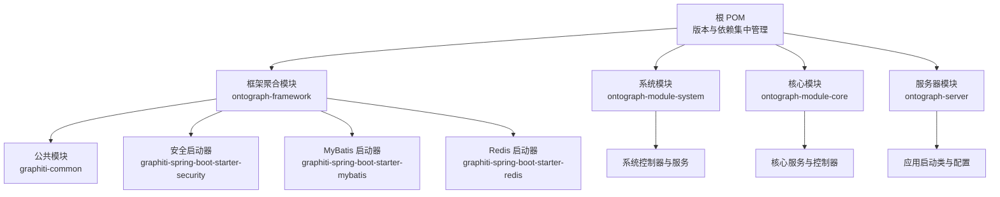
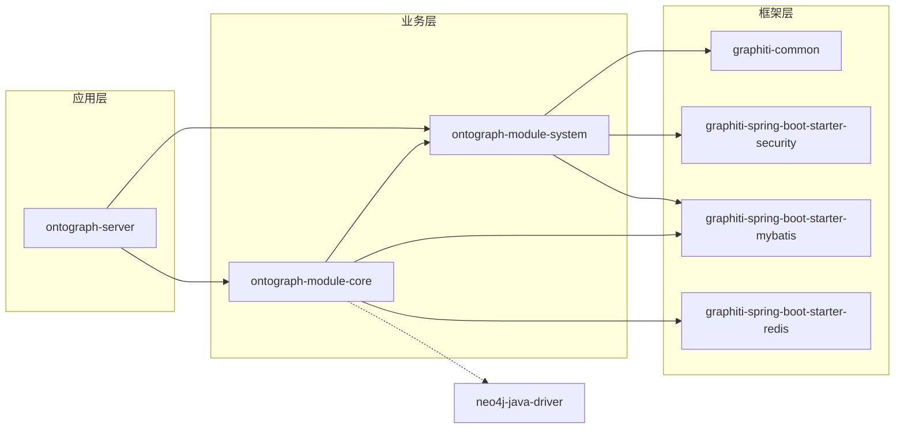
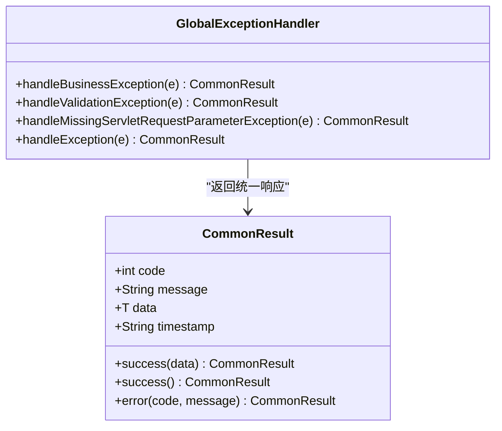
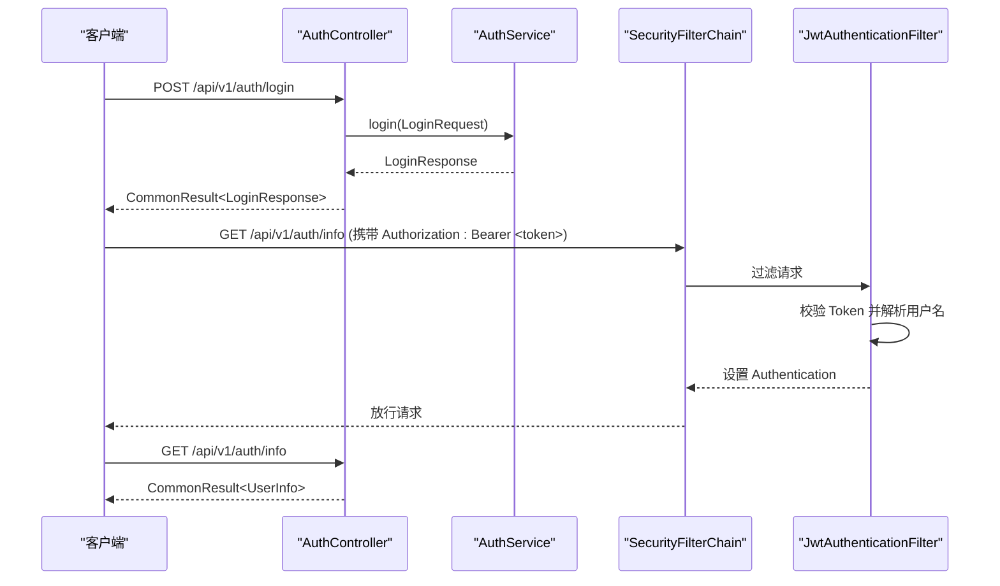
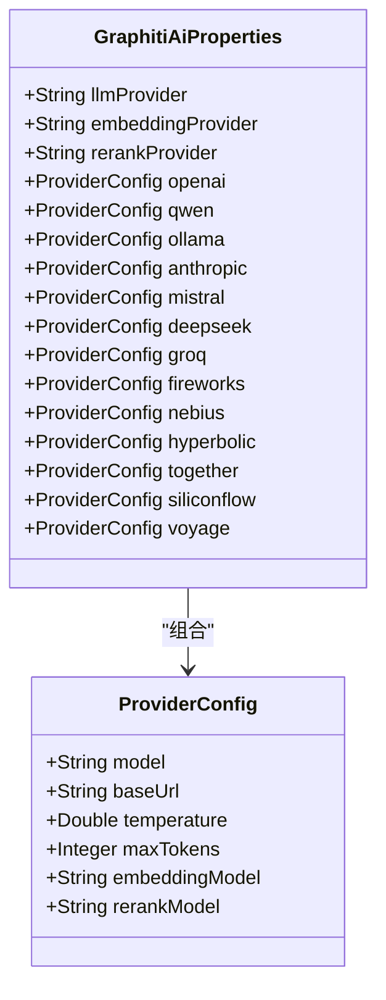
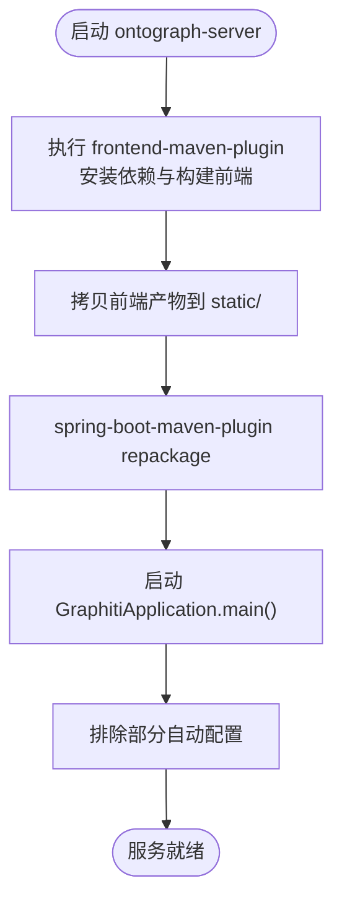
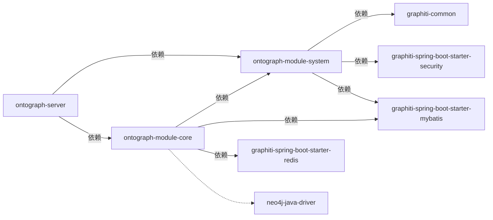

# 模块依赖关系

<!--<cite>
**本文引用的文件**
- [根 POM（父级聚合）](file://pom.xml)
- [占位依赖模块（已弃用）](file://graphiti-dependencies/pom.xml)
- [框架聚合模块](file://ontograph-framework/pom.xml)
- [系统模块 POM](file://ontograph-module-system/pom.xml)
- [核心模块 POM](file://ontograph-module-core/pom.xml)
- [服务器模块 POM](file://ontograph-server/pom.xml)
- [公共模块 POM](file://ontograph-framework/graphiti-common/pom.xml)
- [安全启动器 POM](file://ontograph-framework/graphiti-spring-boot-starter-security/pom.xml)
- [MyBatis 启动器 POM](file://ontograph-framework/graphiti-spring-boot-starter-mybatis/pom.xml)
- [Redis 启动器 POM](file://ontograph-framework/graphiti-spring-boot-starter-redis/pom.xml)
- [统一响应类](file://ontograph-framework/graphiti-common/src/main/java/com/raphiti/common/response/CommonResult.java)
- [全局异常处理器](file://ontograph-framework/graphiti-common/src/main/java/com/raphiti/common/exception/GlobalExceptionHandler.java)
- [安全配置类](file://ontograph-framework/graphiti-spring-boot-starter-security/src/main/java/com/raphiti/framework/security/config/SecurityConfig.java)
- [JWT 认证过滤器](file://ontograph-framework/graphiti-spring-boot-starter-security/src/main/java/com/raphiti/framework/security/jwt/JwtAuthenticationFilter.java)
- [认证控制器](file://ontograph-module-system/src/main/java/com/raphiti/system/controller/AuthController.java)
- [AI 配置属性类](file://ontograph-module-core/src/main/java/com/raphiti/module/graphiti/config/GraphitiAiProperties.java)
- [应用启动类](file://ontograph-server/src/main/java/com/raphiti/GraphitiApplication.java)
- [应用配置文件](file://ontograph-server/src/main/resources/application.yml)
</cite>-->

## 目录
1. [引言](#引言)
2. [项目结构](#项目结构)
3. [核心组件](#核心组件)
4. [架构总览](#架构总览)
5. [详细组件分析](#详细组件分析)
6. [依赖分析](#依赖分析)
7. [性能考虑](#性能考虑)
8. [故障排查指南](#故障排查指南)
9. [结论](#结论)
10. [附录](#附录)

## 引言
本文件围绕 ontograph-java 的 Maven 多模块项目，系统梳理模块依赖管理策略、版本控制机制、模块间通信协议与打包发布流程。重点阐释 ontograph-framework 作为基础框架模块对其他模块的支持作用；明确 ontograph-module-system 与 ontograph-module-core 的业务模块职责划分；解析 ontograph-server 的应用启动功能与前端嵌入流程。同时提供依赖传递规则、冲突解决策略、版本兼容性管理建议，并给出模块扩展与自定义开发规范及依赖注入最佳实践。

## 项目结构
ontograph-java 采用多模块聚合结构，顶层 POM 负责版本与依赖集中管理，四个一级模块分别承担不同职责：
- ontograph-framework：框架层聚合，包含公共模块与若干 Spring Boot 启动器（安全、MyBatis、Redis），为上层业务模块提供基础设施。
- ontograph-module-system：系统模块，负责认证、权限、菜单、通知等系统能力。
- ontograph-module-core：核心业务模块，覆盖图谱管理、本体管理、检索、数据导入导出、AI 推理与嵌入等。
- ontograph-server：应用启动模块，聚合系统与核心模块，提供 Web 启动、Actuator 监控、OpenAPI 文档与前端产物打包。

图表来源
- [根 POM（父级聚合）:15-20](file://pom.xml#L15-L20)
- [框架聚合模块:22-27](file://ontograph-framework/pom.xml#L22-L27)
- [系统模块 POM:1-51](file://ontograph-module-system/pom.xml#L1-L51)
- [核心模块 POM:1-160](file://ontograph-module-core/pom.xml#L1-L160)
- [服务器模块 POM:1-133](file://ontograph-server/pom.xml#L1-L133)

章节来源
- [根 POM（父级聚合）:15-20](file://pom.xml#L15-L20)
- [框架聚合模块:22-27](file://ontograph-framework/pom.xml#L22-L27)

## 核心组件
- 版本与依赖集中管理：顶层 POM 使用 dependencyManagement 管理第三方与内部模块版本，确保一致性与可维护性。
- 框架层（ontograph-framework）：提供统一的公共模块与启动器，降低业务模块重复依赖与配置成本。
- 业务层（ontograph-module-system、ontograph-module-core）：前者聚焦系统能力，后者聚焦图谱与本体等核心业务。
- 应用层（ontograph-server）：整合系统与核心模块，提供 Web 启动、Actuator、OpenAPI 与前端产物打包。

章节来源
- [根 POM（父级聚合）:45-197](file://pom.xml#L45-L197)
- [框架聚合模块:22-27](file://ontograph-framework/pom.xml#L22-L27)
- [系统模块 POM:16-49](file://ontograph-module-system/pom.xml#L16-L49)
- [核心模块 POM:17-145](file://ontograph-module-core/pom.xml#L17-L145)
- [服务器模块 POM:17-40](file://ontograph-server/pom.xml#L17-L40)

## 架构总览
下图展示模块间的依赖关系与启动流程：

图表来源
- [系统模块 POM:16-49](file://ontograph-module-system/pom.xml#L16-L49)
- [核心模块 POM:17-145](file://ontograph-module-core/pom.xml#L17-L145)
- [服务器模块 POM:17-40](file://ontograph-server/pom.xml#L17-L40)
- [公共模块 POM:16-38](file://ontograph-framework/graphiti-common/pom.xml#L16-L38)
- [安全启动器 POM:16-47](file://ontograph-framework/graphiti-spring-boot-starter-security/pom.xml#L16-L47)
- [MyBatis 启动器 POM:19-49](file://ontograph-framework/graphiti-spring-boot-starter-mybatis/pom.xml#L19-L49)
- [Redis 启动器 POM:19-37](file://ontograph-framework/graphiti-spring-boot-starter-redis/pom.xml#L19-L37)

## 详细组件分析

### 组件 A 分析：统一响应与异常处理
- 统一响应类提供标准字段与成功/错误工厂方法，保证前后端交互一致性。
- 全局异常处理器捕获业务异常、参数校验异常与通用异常，统一输出标准响应。

图表来源
- [统一响应类:14-67](file://ontograph-framework/graphiti-common/src/main/java/com/raphiti/common/response/CommonResult.java#L14-L67)
- [全局异常处理器:18-73](file://ontograph-framework/graphiti-common/src/main/java/com/raphiti/common/exception/GlobalExceptionHandler.java#L18-L73)

章节来源
- [统一响应类:14-67](file://ontograph-framework/graphiti-common/src/main/java/com/raphiti/common/response/CommonResult.java#L14-L67)
- [全局异常处理器:18-73](file://ontograph-framework/graphiti-common/src/main/java/com/raphiti/common/exception/GlobalExceptionHandler.java#L18-L73)

### 组件 B 分析：认证与安全通信协议
- 安全配置类启用无状态会话、CORS、JWT 过滤链与未认证/权限不足的统一错误响应。
- JWT 认证过滤器从请求头提取 Bearer Token，验证后设置 Security 上下文。
- 认证控制器提供登录、获取用户信息、退出登录接口，均受安全过滤链保护。

图表来源
- [安全配置类:116-136](file://ontograph-framework/graphiti-spring-boot-starter-security/src/main/java/com/raphiti/framework/security/config/SecurityConfig.java#L116-L136)
- [JWT 认证过滤器:44-59](file://ontograph-framework/graphiti-spring-boot-starter-security/src/main/java/com/raphiti/framework/security/jwt/JwtAuthenticationFilter.java#L44-L59)
- [认证控制器:27-42](file://ontograph-module-system/src/main/java/com/raphiti/system/controller/AuthController.java#L27-L42)

章节来源
- [安全配置类:32-137](file://ontograph-framework/graphiti-spring-boot-starter-security/src/main/java/com/raphiti/framework/security/config/SecurityConfig.java#L32-L137)
- [JWT 认证过滤器:26-60](file://ontograph-framework/graphiti-spring-boot-starter-security/src/main/java/com/raphiti/framework/security/jwt/JwtAuthenticationFilter.java#L26-L60)
- [认证控制器:16-54](file://ontograph-module-system/src/main/java/com/raphiti/system/controller/AuthController.java#L16-L54)

### 组件 C 分析：AI 配置与模型提供商
- AI 配置属性类支持多种 LLM/Embedding/Rerank 提供商，具备模型名、Base URL、温度、最大 token、Embedding/Rerank 模型等配置项。
- 应用配置文件声明默认提供商与密钥/URL 等运行时参数位置。

图表来源
- [AI 配置属性类:15-134](file://ontograph-module-core/src/main/java/com/raphiti/module/graphiti/config/GraphitiAiProperties.java#L15-L134)
- [应用配置文件:20-34](file://ontograph-server/src/main/resources/application.yml#L20-L34)

章节来源
- [AI 配置属性类:13-135](file://ontograph-module-core/src/main/java/com/raphiti/module/graphiti/config/GraphitiAiProperties.java#L13-L135)
- [应用配置文件:20-34](file://ontograph-server/src/main/resources/application.yml#L20-L34)

### 组件 D 分析：应用启动与前端嵌入
- 应用启动类基于 Spring Boot，排除部分自动配置以按需启用具体提供商。
- 服务器模块通过前端插件执行 pnpm 安装与构建，并将产物拷贝到静态资源目录，实现前后端一体化打包。

图表来源
- [应用启动类:18-35](file://ontograph-server/src/main/java/com/raphiti/GraphitiApplication.java#L18-L35)
- [服务器模块 POM:82-128](file://ontograph-server/pom.xml#L82-L128)

章节来源
- [应用启动类:18-35](file://ontograph-server/src/main/java/com/raphiti/GraphitiApplication.java#L18-L35)
- [服务器模块 POM:42-130](file://ontograph-server/pom.xml#L42-L130)

## 依赖分析
- 依赖传递规则
  - ontograph-module-system 依赖 graphiti-common、graphiti-spring-boot-starter-security、graphiti-spring-boot-starter-mybatis。
  - ontograph-module-core 依赖 ontograph-module-system、graphiti-spring-boot-starter-mybatis、graphiti-spring-boot-starter-redis，并引入 Neo4j Java Driver。
  - ontograph-server 依赖 ontograph-module-system 与 ontograph-module-core，作为最终可执行应用。
- 冲突解决策略
  - 顶层 POM 使用 dependencyManagement 统一版本，避免子模块各自声明导致的不一致。
  - Spring Boot 与 Spring AI 通过各自的 BOM 管理版本，减少版本漂移风险。
- 版本兼容性管理
  - Java 语言级别与编译器插件在顶层统一配置，确保各模块一致。
  - Spring Boot 3.x 与 Spring AI 1.x 的组合在顶层 POM 中显式声明，避免隐式版本差异。
- 循环依赖检测
  - 当前结构未见循环依赖：server → core → system，且 framework 层为纯基础设施，不反向依赖业务模块。
- 依赖树分析
  - 可使用 Maven 命令查看依赖树，定位传递依赖与冲突来源，例如：mvn dependency:tree -Dverbose -pl ontograph-server。

图表来源
- [系统模块 POM:16-49](file://ontograph-module-system/pom.xml#L16-L49)
- [核心模块 POM:17-145](file://ontograph-module-core/pom.xml#L17-L145)
- [服务器模块 POM:17-40](file://ontograph-server/pom.xml#L17-L40)

章节来源
- [根 POM（父级聚合）:45-197](file://pom.xml#L45-L197)
- [系统模块 POM:16-49](file://ontograph-module-system/pom.xml#L16-L49)
- [核心模块 POM:17-145](file://ontograph-module-core/pom.xml#L17-L145)
- [服务器模块 POM:17-40](file://ontograph-server/pom.xml#L17-L40)

## 性能考虑
- 无状态安全设计：JWT 无状态会话减少服务器端会话存储开销。
- 前端内嵌：前端构建产物直接打包进后端，减少运行时额外下载与网络往返。
- 监控与可观测性：Actuator 暴露健康与指标端点，便于生产环境监控。
- 数据库与缓存：MyBatis Plus 与 Druid 提升数据库访问效率；Redisson 提供高性能分布式能力。

## 故障排查指南
- 认证失败（401/403）
  - 检查请求头是否包含正确的 Authorization: Bearer <token>。
  - 核对 SecurityConfig 中的放行路径与过滤器顺序。
- 参数校验失败（400）
  - 查看全局异常处理器对 MethodArgumentNotValidException 的处理，确认请求体与 DTO 字段约束。
- 业务异常
  - 自定义业务异常应继承 BusinessException，由 GlobalExceptionHandler 统一转换为 CommonResult。
- 前端无法访问
  - 确认前端构建产物已拷贝至 static/，检查服务器模块 POM 的前端插件执行阶段。

章节来源
- [安全配置类:116-136](file://ontograph-framework/graphiti-spring-boot-starter-security/src/main/java/com/raphiti/framework/security/config/SecurityConfig.java#L116-L136)
- [JWT 认证过滤器:36-59](file://ontograph-framework/graphiti-spring-boot-starter-security/src/main/java/com/raphiti/framework/security/jwt/JwtAuthenticationFilter.java#L36-L59)
- [全局异常处理器:26-72](file://ontograph-framework/graphiti-common/src/main/java/com/raphiti/common/exception/GlobalExceptionHandler.java#L26-L72)
- [统一响应类:39-66](file://ontograph-framework/graphiti-common/src/main/java/com/raphiti/common/response/CommonResult.java#L39-L66)
- [服务器模块 POM:114-126](file://ontograph-server/pom.xml#L114-L126)

## 结论
ontograph-java 通过集中化的版本与依赖管理、清晰的模块分层与职责划分，实现了高内聚、低耦合的多模块架构。框架层提供统一基础设施，业务模块聚焦领域能力，应用层完成集成与打包。该设计有利于团队协作、版本演进与扩展开发。

## 附录
- 模块扩展指南
  - 新增模块遵循“先框架、后业务”的原则：若为通用能力优先放入 ontograph-framework，否则进入 ontograph-module-system 或 ontograph-module-core。
  - 在根 POM 的 dependencyManagement 中统一声明版本，避免子模块重复定义。
- 自定义模块开发规范
  - 统一使用统一响应与异常处理，保持接口一致性。
  - 控制器层使用 Swagger 注解完善 API 文档。
  - 配置类使用 @ConfigurationProperties 绑定 application.yml 中的命名空间。
- 依赖注入最佳实践
  - 优先使用构造函数注入，提升不可变性与测试友好性。
  - 对于跨模块共享的工具类与配置，尽量下沉到 graphiti-common 或对应启动器中。
- 打包发布流程
  - 在 ontograph-server 中执行完整构建，确保前端产物被正确内嵌。
  - 使用 spring-boot-maven-plugin 的 repackage 目标生成可执行 jar。