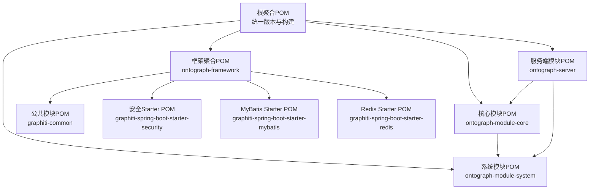
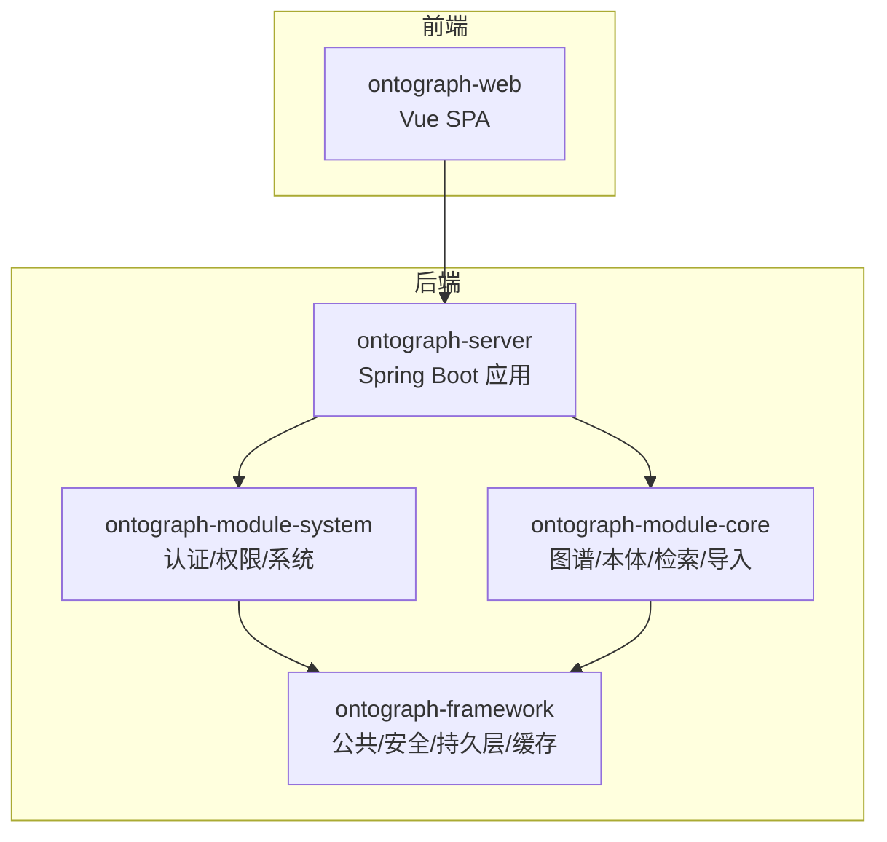
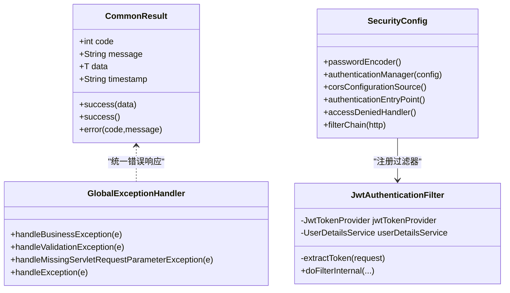
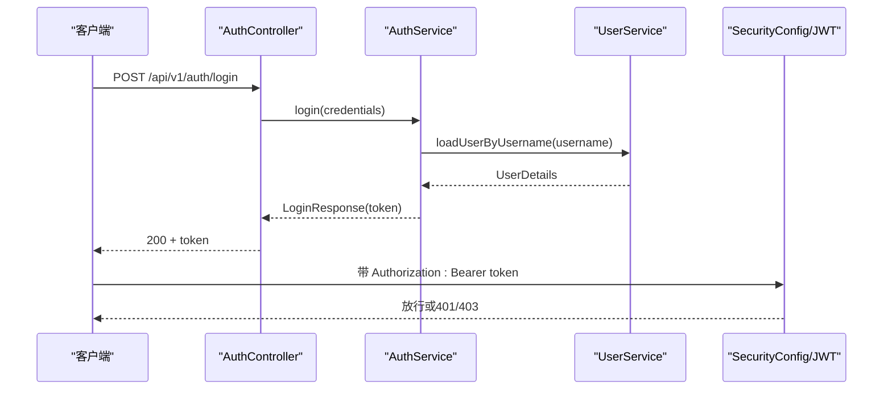
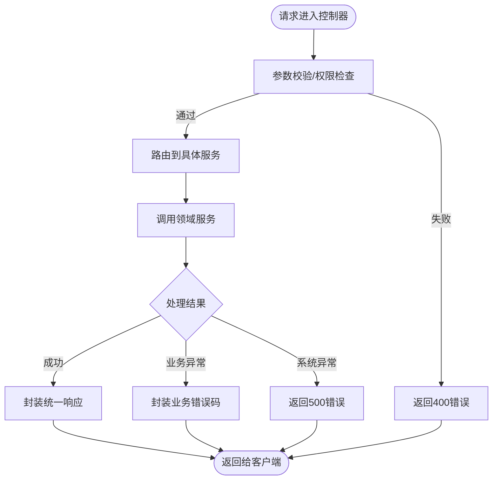
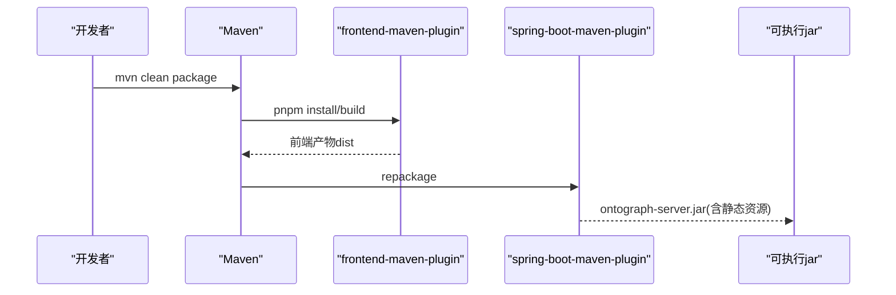
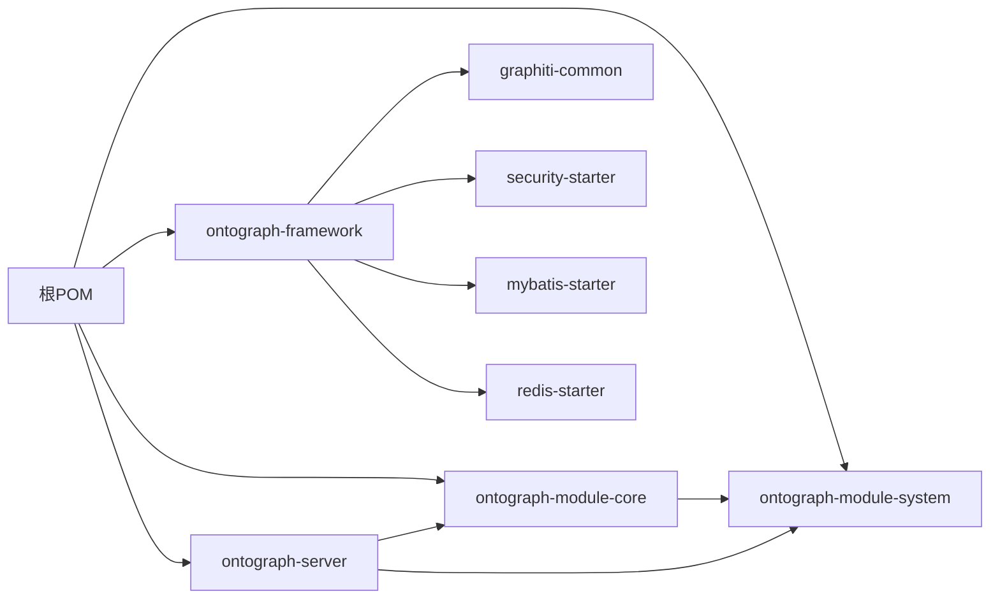

# 模块化设计

<!--<cite>
**本文引用的文件**
- [根POM](file://pom.xml)
- [框架聚合POM](file://ontograph-framework/pom.xml)
- [系统模块POM](file://ontograph-module-system/pom.xml)
- [核心模块POM](file://ontograph-module-core/pom.xml)
- [服务端模块POM](file://ontograph-server/pom.xml)
- [公共模块POM](file://ontograph-framework/graphiti-common/pom.xml)
- [安全Starter POM](file://ontograph-framework/graphiti-spring-boot-starter-security/pom.xml)
- [MyBatis Stater POM](file://ontograph-framework/graphiti-spring-boot-starter-mybatis/pom.xml)
- [Redis Stater POM](file://ontograph-framework/graphiti-spring-boot-starter-redis/pom.xml)
- [依赖聚合模块POM](file://graphiti-dependencies/pom.xml)
- [公共常量：ResultCode](file://ontograph-framework/graphiti-common/src/main/java/com/raphiti/common/constants/ResultCode.java)
- [统一响应：CommonResult](file://ontograph-framework/graphiti-common/src/main/java/com/raphiti/common/response/CommonResult.java)
- [全局异常处理：GlobalExceptionHandler](file://ontograph-framework/graphiti-common/src/main/java/com/raphiti/common/exception/GlobalExceptionHandler.java)
- [安全配置：SecurityConfig](file://ontograph-framework/graphiti-spring-boot-starter-security/src/main/java/com/raphiti/framework/security/config/SecurityConfig.java)
- [JWT过滤器：JwtAuthenticationFilter](file://ontograph-framework/graphiti-spring-boot-starter-security/src/main/java/com/raphiti/framework/security/jwt/JwtAuthenticationFilter.java)
- [系统模块：AuthController](file://ontograph-module-system/src/main/java/com/raphiti/system/controller/AuthController.java)
- [核心模块：GraphitiController](file://ontograph-module-core/src/main/java/com/raphiti/module/graphiti/controller/admin/GraphitiController.java)
- [服务端入口：GraphitiApplication](file://ontograph-server/src/main/java/com/raphiti/GraphitiApplication.java)
</cite>-->

## 目录
1. [引言](#引言)
2. [项目结构](#项目结构)
3. [核心组件](#核心组件)
4. [架构总览](#架构总览)
5. [详细组件分析](#详细组件分析)
6. [依赖分析](#依赖分析)
7. [性能考虑](#性能考虑)
8. [故障排查指南](#故障排查指南)
9. [结论](#结论)
10. [附录](#附录)

## 引言
本文件面向开发者，系统性阐述OntoGraph的模块化设计与实现。项目采用Maven多模块聚合结构，围绕“框架层”“系统管理模块”“核心业务模块”“应用启动模块”“前端模块”进行职责划分，通过清晰的依赖边界实现代码复用、职责分离与测试隔离，并给出版本管理与发布策略建议、接口规范说明以及扩展与自定义开发最佳实践。

## 项目结构
项目采用顶层聚合POM统一管理版本与构建策略，按功能域拆分模块：
- ontograph-framework：框架层聚合，封装通用能力（公共模块、安全、MyBatis、Redis等）
- ontograph-module-system：系统管理模块，提供认证、权限、菜单、通知、日志、角色、用户、系统配置等
- ontograph-module-core：核心业务模块，提供图谱管理、本体管理、检索、数据导入导出、实体抽取、法律知识图谱等功能
- ontograph-server：应用启动模块，整合系统与核心模块，打包为可执行服务，内嵌前端静态资源
- ontograph-web：独立前端模块（Vue+TypeScript），在服务端打包阶段被编译并嵌入

图表来源
- [根POM:15-20](file://pom.xml#L15-L20)
- [框架聚合POM:22-27](file://ontograph-framework/pom.xml#L22-L27)
- [系统模块POM:16-31](file://ontograph-module-system/pom.xml#L16-L31)
- [核心模块POM:17-45](file://ontograph-module-core/pom.xml#L17-L45)
- [服务端模块POM:17-29](file://ontograph-server/pom.xml#L17-L29)

章节来源
- [根POM:15-20](file://pom.xml#L15-L20)
- [框架聚合POM:22-27](file://ontograph-framework/pom.xml#L22-L27)
- [系统模块POM:16-31](file://ontograph-module-system/pom.xml#L16-L31)
- [核心模块POM:17-45](file://ontograph-module-core/pom.xml#L17-L45)
- [服务端模块POM:17-29](file://ontograph-server/pom.xml#L17-L29)

## 核心组件
- 框架层（ontograph-framework）
  - graphiti-common：统一响应、错误码、全局异常处理等横切能力
  - graphiti-spring-boot-starter-security：基于JWT的认证授权、CORS、无状态会话
  - graphiti-spring-boot-starter-mybatis：数据库连接池、动态多数据源、MyBatis-Plus
  - graphiti-spring-boot-starter-redis：Redisson缓存与序列化支持
- 系统模块（ontograph-module-system）：用户认证、权限、菜单、通知、日志、角色、用户、系统配置
- 核心模块（ontograph-module-core）：图谱管理、本体管理、检索、数据导入导出、实体抽取、法律知识图谱、时间序列、社区发现、提示词模板等
- 应用启动模块（ontograph-server）：整合系统与核心模块，打包为可执行服务，内嵌前端静态资源
- 前端模块（ontograph-web）：Vue单页应用，提供图谱浏览、搜索、管理界面

章节来源
- [公共模块POM:16-38](file://ontograph-framework/graphiti-common/pom.xml#L16-L38)
- [安全Starter POM:16-47](file://ontograph-framework/graphiti-spring-boot-starter-security/pom.xml#L16-L47)
- [MyBatis Stater POM:19-48](file://ontograph-framework/graphiti-spring-boot-starter-mybatis/pom.xml#L19-L48)
- [Redis Stater POM:19-37](file://ontograph-framework/graphiti-spring-boot-starter-redis/pom.xml#L19-L37)
- [系统模块POM:16-49](file://ontograph-module-system/pom.xml#L16-L49)
- [核心模块POM:17-145](file://ontograph-module-core/pom.xml#L17-L145)
- [服务端模块POM:17-40](file://ontograph-server/pom.xml#L17-L40)

## 架构总览
整体采用“前后端同服”的部署形态：后端服务在启动时将前端构建产物复制到静态资源目录，浏览器访问后端接口并加载内嵌的前端页面。安全层通过JWT过滤器拦截请求，系统模块负责认证与权限，核心模块承载业务逻辑，框架层提供横切能力。

图表来源
- [服务端模块POM:17-40](file://ontograph-server/pom.xml#L17-L40)
- [系统模块POM:16-49](file://ontograph-module-system/pom.xml#L16-L49)
- [核心模块POM:17-45](file://ontograph-module-core/pom.xml#L17-L45)
- [框架聚合POM:22-27](file://ontograph-framework/pom.xml#L22-L27)

## 详细组件分析

### 组件A：框架层（ontograph-framework）
- 设计原则
  - 职责单一：每个starter聚焦一类技术能力
  - 可组合：通过依赖聚合形成完整能力集
  - 低耦合：公共模块作为基础，避免循环依赖
- 关键实现
  - graphiti-common：统一响应、错误码、全局异常处理
  - graphiti-spring-boot-starter-security：JWT过滤器、CORS、无状态会话、鉴权与授权入口
  - graphiti-spring-boot-starter-mybatis：数据库连接池、动态多数据源、MyBatis-Plus
  - graphiti-spring-boot-starter-redis：Redisson缓存、Jackson时间序列化

图表来源
- [统一响应：CommonResult:14-67](file://ontograph-framework/graphiti-common/src/main/java/com/raphiti/common/response/CommonResult.java#L14-L67)
- [全局异常处理：GlobalExceptionHandler:17-73](file://ontograph-framework/graphiti-common/src/main/java/com/raphiti/common/exception/GlobalExceptionHandler.java#L17-L73)
- [安全配置：SecurityConfig:32-137](file://ontograph-framework/graphiti-spring-boot-starter-security/src/main/java/com/raphiti/framework/security/config/SecurityConfig.java#L32-L137)
- [JWT过滤器：JwtAuthenticationFilter:23-60](file://ontograph-framework/graphiti-spring-boot-starter-security/src/main/java/com/raphiti/framework/security/jwt/JwtAuthenticationFilter.java#L23-L60)

章节来源
- [公共模块POM:16-38](file://ontograph-framework/graphiti-common/pom.xml#L16-L38)
- [安全Starter POM:16-47](file://ontograph-framework/graphiti-spring-boot-starter-security/pom.xml#L16-L47)
- [MyBatis Stater POM:19-48](file://ontograph-framework/graphiti-spring-boot-starter-mybatis/pom.xml#L19-L48)
- [Redis Stater POM:19-37](file://ontograph-framework/graphiti-spring-boot-starter-redis/pom.xml#L19-L37)
- [公共常量：ResultCode:1-23](file://ontograph-framework/graphiti-common/src/main/java/com/raphiti/common/constants/ResultCode.java#L1-L23)
- [统一响应：CommonResult:1-68](file://ontograph-framework/graphiti-common/src/main/java/com/raphiti/common/response/CommonResult.java#L1-L68)
- [全局异常处理：GlobalExceptionHandler:1-74](file://ontograph-framework/graphiti-common/src/main/java/com/raphiti/common/exception/GlobalExceptionHandler.java#L1-L74)
- [安全配置：SecurityConfig:1-138](file://ontograph-framework/graphiti-spring-boot-starter-security/src/main/java/com/raphiti/framework/security/config/SecurityConfig.java#L1-L138)
- [JWT过滤器：JwtAuthenticationFilter:1-61](file://ontograph-framework/graphiti-spring-boot-starter-security/src/main/java/com/raphiti/framework/security/jwt/JwtAuthenticationFilter.java#L1-L61)

### 组件B：系统模块（ontograph-module-system）
- 职责分工
  - 认证与授权：登录、登出、权限校验
  - 用户与角色：用户增删改查、角色管理、菜单权限
  - 系统配置：系统参数、通知配置、操作日志
  - 通知与搜索历史：消息推送、搜索记录
- 接口设计
  - 控制器层：AuthController、UserController、RoleController、MenuController、SystemConfigController、NotificationController、OperationLogController、SearchHistoryController
  - 数据访问层：对应DO/Mapper
  - 服务层：AuthService、UserService、RoleService、MenuService、SystemConfigService、NotificationService、OperationLogService、SearchHistoryService

图表来源
- [系统模块：AuthController](file://ontograph-module-system/src/main/java/com/raphiti/system/controller/AuthController.java)
- [安全配置：SecurityConfig:115-136](file://ontograph-framework/graphiti-spring-boot-starter-security/src/main/java/com/raphiti/framework/security/config/SecurityConfig.java#L115-L136)
- [JWT过滤器：JwtAuthenticationFilter:44-59](file://ontograph-framework/graphiti-spring-boot-starter-security/src/main/java/com/raphiti/framework/security/jwt/JwtAuthenticationFilter.java#L44-L59)

章节来源
- [系统模块POM:16-49](file://ontograph-module-system/pom.xml#L16-L49)

### 组件C：核心模块（ontograph-module-core）
- 职责分工
  - 图谱管理：图谱创建、列表、统计、更新
  - 本体管理：类、属性、约束、定义、版本历史、一致性校验与推理
  - 检索服务：节点、边、剧集、社区、时间序列检索
  - 数据导入导出：批量导入、数据质量、去重、提示词模板
  - 实体抽取与关系抽取：LLM客户端、嵌入向量、Rerank
  - 法律知识图谱：案例、法院、证据、法官、判决、法条等抽取与导入
- 接口设计
  - 控制器层：GraphitiController、OntologyController、SearchController、DataImportController、LegalImportController、PromptController等
  - 服务层：GraphitiService、Ontology*Service、SearchService、Data*Service、Legal*Service、EmbedderService、LlmClientService等

图表来源
- [统一响应：CommonResult:14-67](file://ontograph-framework/graphiti-common/src/main/java/com/raphiti/common/response/CommonResult.java#L14-L67)
- [全局异常处理：GlobalExceptionHandler:17-73](file://ontograph-framework/graphiti-common/src/main/java/com/raphiti/common/exception/GlobalExceptionHandler.java#L17-L73)

章节来源
- [核心模块POM:17-145](file://ontograph-module-core/pom.xml#L17-L145)

### 组件D：应用启动模块（ontograph-server）
- 职责分工
  - 整合系统与核心模块，提供可执行服务
  - 内嵌前端构建产物，提供静态资源
  - 集成OpenAPI/Swagger文档
- 构建流程
  - 使用frontend-maven-plugin在打包阶段安装pnpm、构建前端并拷贝到静态资源目录
  - 使用spring-boot-maven-plugin生成可执行jar

图表来源
- [服务端模块POM:82-128](file://ontograph-server/pom.xml#L82-L128)

章节来源
- [服务端模块POM:17-133](file://ontograph-server/pom.xml#L17-L133)

### 组件E：前端模块（ontograph-web）
- 职责分工
  - 提供图谱可视化、搜索、管理界面
  - 与后端API对接，使用Axios封装请求
- 开发与构建
  - 使用pnpm管理依赖，Vite构建
  - 在服务端打包阶段被复制到静态资源目录

章节来源
- [服务端模块POM:82-128](file://ontograph-server/pom.xml#L82-L128)

## 依赖分析
- 版本与依赖管理
  - 顶层POM通过dependencyManagement集中管理Spring Boot、Spring AI、MyBatis-Plus、Neo4j、JWT、Lombok、MapStruct、Hutool、SpringDoc、PostgreSQL、Redisson、Druid、动态数据源等版本
  - 各模块通过相对版本引用，避免重复与冲突
- 模块间依赖
  - ontograph-module-system 依赖 graphiti-common 与 graphiti-spring-boot-starter-security、graphiti-spring-boot-starter-mybatis
  - ontograph-module-core 依赖 ontograph-module-system、graphiti-spring-boot-starter-mybatis、graphiti-spring-boot-starter-redis、Neo4j驱动、Spring AI系列、Apache Jena、RDF4J
  - ontograph-server 依赖 ontograph-module-system 与 ontograph-module-core，并引入web与OpenAPI
  - ontograph-framework 为聚合模块，内部各starter模块相互独立，通过公共模块解耦

图表来源
- [根POM:45-196](file://pom.xml#L45-L196)
- [系统模块POM:16-31](file://ontograph-module-system/pom.xml#L16-L31)
- [核心模块POM:17-45](file://ontograph-module-core/pom.xml#L17-L45)
- [服务端模块POM:17-29](file://ontograph-server/pom.xml#L17-L29)
- [框架聚合POM:22-27](file://ontograph-framework/pom.xml#L22-L27)

章节来源
- [根POM:45-196](file://pom.xml#L45-L196)
- [系统模块POM:16-31](file://ontograph-module-system/pom.xml#L16-L31)
- [核心模块POM:17-45](file://ontograph-module-core/pom.xml#L17-L45)
- [服务端模块POM:17-29](file://ontograph-server/pom.xml#L17-L29)
- [框架聚合POM:22-27](file://ontograph-framework/pom.xml#L22-L27)

## 性能考虑
- 无状态会话与JWT：减少服务器端会话存储开销，提升横向扩展能力
- 动态数据源与连接池：根据业务场景切换数据源，降低热点库压力
- Redis缓存：热点数据与会话信息缓存，减轻数据库压力
- 前端内嵌：减少跨域与额外HTTP往返，优化首屏体验
- 批量导入与去重：通过MinHash LSH与并行处理提升导入效率
- 向量化与Rerank：结合嵌入模型与重排序算法，平衡召回与排序性能

## 故障排查指南
- 统一响应与错误码
  - 使用统一响应包装返回值，便于前端与监控系统解析
  - 错误码覆盖客户端错误（4xx）、服务端错误（5xx）、业务错误（1xxx）
- 全局异常处理
  - 对业务异常、参数校验异常、缺失参数异常、未知异常进行分类处理，返回标准化错误响应
- 安全相关
  - 未认证返回401 JSON，权限不足返回403 JSON；确保JWT过滤器正确提取与验证Token
- 日志与监控
  - 在异常处理器中记录错误日志，结合Actuator暴露健康与指标

章节来源
- [公共常量：ResultCode:1-23](file://ontograph-framework/graphiti-common/src/main/java/com/raphiti/common/constants/ResultCode.java#L1-L23)
- [统一响应：CommonResult:1-68](file://ontograph-framework/graphiti-common/src/main/java/com/raphiti/common/response/CommonResult.java#L1-L68)
- [全局异常处理：GlobalExceptionHandler:1-74](file://ontograph-framework/graphiti-common/src/main/java/com/raphiti/common/exception/GlobalExceptionHandler.java#L1-L74)
- [安全配置：SecurityConfig:84-113](file://ontograph-framework/graphiti-spring-boot-starter-security/src/main/java/com/raphiti/framework/security/config/SecurityConfig.java#L84-L113)
- [JWT过滤器：JwtAuthenticationFilter:36-59](file://ontograph-framework/graphiti-spring-boot-starter-security/src/main/java/com/raphiti/framework/security/jwt/JwtAuthenticationFilter.java#L36-L59)

## 结论
OntoGraph通过清晰的模块化设计实现了横切能力复用、职责分离与测试隔离。框架层提供统一的安全、持久层与缓存能力；系统模块聚焦认证与权限；核心模块承载复杂业务；服务端模块整合并内嵌前端；前端模块提供交互界面。该架构有利于团队协作、版本演进与生态扩展。

## 附录

### 模块版本管理与发布策略
- 版本策略
  - 采用语义化版本：主版本号.次版本号.修订号[-预发布标签]
  - 项目版本统一在根POM的<version>与dependencyManagement中维护
- 发布流程建议
  - 稳定分支：release-x.y.z，仅修复缺陷
  - 开发分支：develop，合并特性分支
  - Tag发布：在稳定分支打Tag并发布制品
  - 依赖锁定：通过dependencyManagement固定第三方版本，避免漂移
- 依赖聚合模块
  - graphiti-dependencies为占位模块，实际版本管理已迁移至根POM，保留以兼容外部引用

章节来源
- [根POM:8-11](file://pom.xml#L8-L11)
- [根POM:22-43](file://pom.xml#L22-L43)
- [依赖聚合模块POM:8-15](file://graphiti-dependencies/pom.xml#L8-L15)

### 接口规范
- 统一响应
  - 字段：code、message、data、timestamp
  - 成功：code=200；错误：按错误码分类
- 错误码范围
  - 200：成功
  - 400/401/403/404：客户端错误/未认证/权限不足/未找到
  - 500：服务端错误
  - 1001-1099：业务错误（如图谱不存在、节点不存在、参数非法等）
- 安全接口
  - 登录接口：/api/v1/auth/login
  - 未认证/权限不足：返回JSON错误体，code分别为401/403

章节来源
- [统一响应：CommonResult:14-67](file://ontograph-framework/graphiti-common/src/main/java/com/raphiti/common/response/CommonResult.java#L14-L67)
- [公共常量：ResultCode:1-23](file://ontograph-framework/graphiti-common/src/main/java/com/raphiti/common/constants/ResultCode.java#L1-L23)
- [安全配置：SecurityConfig:121-126](file://ontograph-framework/graphiti-spring-boot-starter-security/src/main/java/com/raphiti/framework/security/config/SecurityConfig.java#L121-L126)

### 扩展与自定义开发最佳实践
- 新增业务模块
  - 在graphiti-module-xxx下创建新模块，遵循与ontograph-module-system/ontograph-module-core类似的分层（controller/service/dal/vo/dto/util）
  - 通过dependencyManagement引用公共依赖，避免版本漂移
- 自定义Starter
  - 在ontograph-framework下新增starter模块，提供自动装配与配置项
  - 通过graphiti-common提供通用能力，避免重复造轮子
- 安全与认证
  - 使用graphiti-spring-boot-starter-security提供的JWT过滤器与SecurityConfig，统一认证入口
  - 如需自定义权限规则，扩展AccessDecisionManager或自定义注解
- 数据访问
  - 使用graphiti-spring-boot-starter-mybatis提供的动态数据源与MyBatis-Plus，按表建立Mapper与DO
- 缓存与性能
  - 使用graphiti-spring-boot-starter-redis进行热点数据缓存，结合@Cacheable/@CacheEvict
- 前后端联调
  - 保持接口命名一致，统一使用统一响应；前端通过Axios封装请求，后端通过OpenAPI文档自动生成接口契约

章节来源
- [系统模块POM:16-49](file://ontograph-module-system/pom.xml#L16-L49)
- [核心模块POM:17-145](file://ontograph-module-core/pom.xml#L17-L145)
- [安全Starter POM:16-47](file://ontograph-framework/graphiti-spring-boot-starter-security/pom.xml#L16-L47)
- [MyBatis Stater POM:19-48](file://ontograph-framework/graphiti-spring-boot-starter-mybatis/pom.xml#L19-L48)
- [Redis Stater POM:19-37](file://ontograph-framework/graphiti-spring-boot-starter-redis/pom.xml#L19-L37)