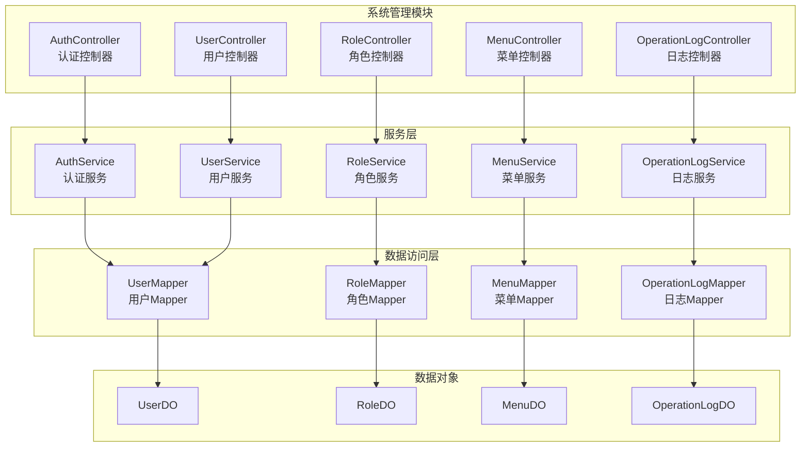
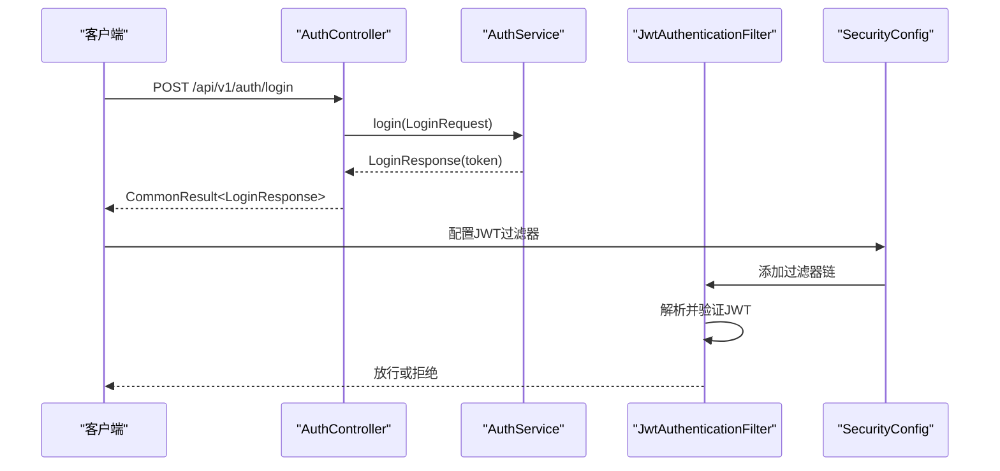
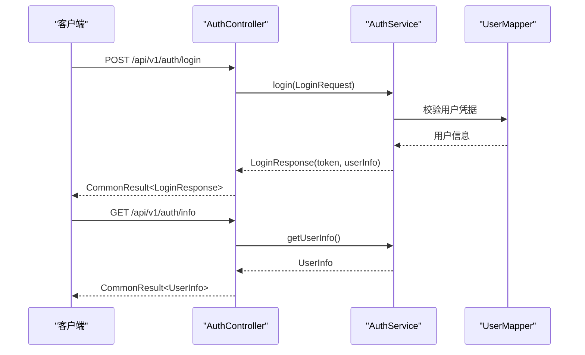
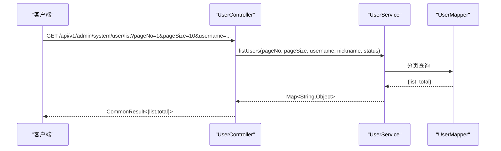
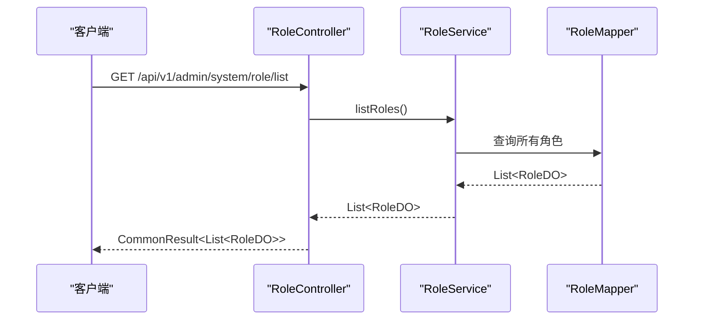
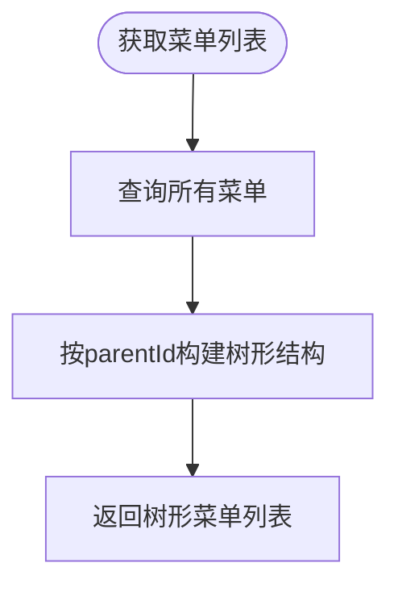
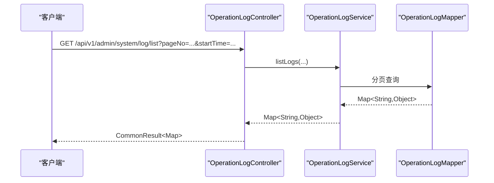
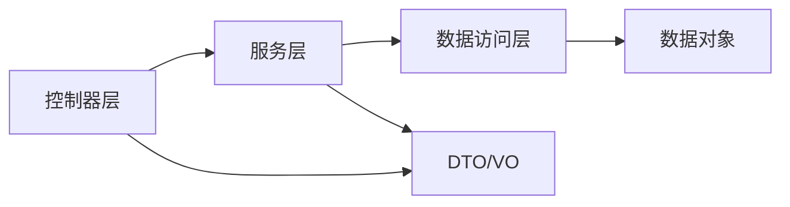
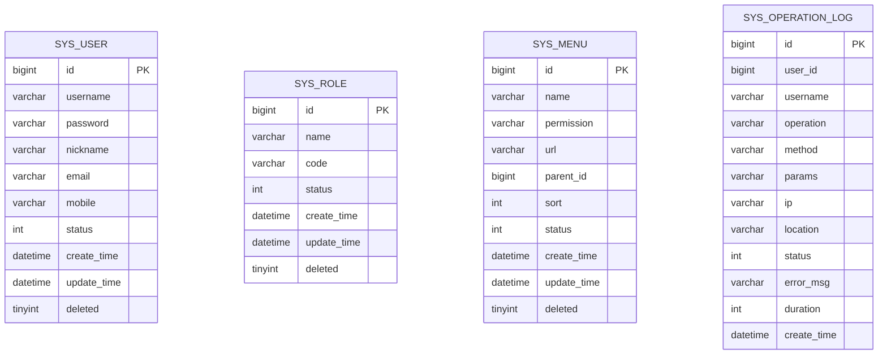

# 系统管理模块 (ontograph-module-system)

<!--<cite>
**本文引用的文件**
- [AuthController.java](file://ontograph-module-system/src/main/java/com/graphiti/system/controller/AuthController.java)
- [UserController.java](file://ontograph-module-system/src/main/java/com/graphiti/system/controller/UserController.java)
- [RoleController.java](file://ontograph-module-system/src/main/java/com/graphiti/system/controller/RoleController.java)
- [MenuController.java](file://ontograph-module-system/src/main/java/com/graphiti/system/controller/MenuController.java)
- [OperationLogController.java](file://ontograph-module-system/src/main/java/com/graphiti/system/controller/OperationLogController.java)
- [AuthService.java](file://ontograph-module-system/src/main/java/com/graphiti/system/service/AuthService.java)
- [UserService.java](file://ontograph-module-system/src/main/java/com/graphiti/system/service/UserService.java)
- [RoleService.java](file://ontograph-module-system/src/main/java/com/graphiti/system/service/RoleService.java)
- [MenuService.java](file://ontograph-module-system/src/main/java/com/graphiti/system/service/MenuService.java)
- [OperationLogService.java](file://ontograph-module-system/src/main/java/com/graphiti/system/service/OperationLogService.java)
- [UserDO.java](file://ontograph-module-system/src/main/java/com/graphiti/system/dal/dataobject/UserDO.java)
- [RoleDO.java](file://ontograph-module-system/src/main/java/com/graphiti/system/dal/dataobject/RoleDO.java)
- [MenuDO.java](file://ontograph-module-system/src/main/java/com/graphiti/system/dal/dataobject/MenuDO.java)
- [OperationLogDO.java](file://ontograph-module-system/src/main/java/com/graphiti/system/dal/dataobject/OperationLogDO.java)
- [UserMapper.java](file://ontograph-module-system/src/main/java/com/graphiti/system/dal/mysql/UserMapper.java)
- [LoginRequest.java](file://ontograph-module-system/src/main/java/com/graphiti/system/dto/LoginRequest.java)
- [LoginResponse.java](file://ontograph-module-system/src/main/java/com/graphiti/system/dto/LoginResponse.java)
- [SecurityConfig.java](file://ontograph-framework/graphiti-spring-boot-starter-security/src/main/java/com/graphiti/framework/security/config/SecurityConfig.java)
- [JwtAuthenticationFilter.java](file://ontograph-framework/graphiti-spring-boot-starter-security/src/main/java/com/graphiti/framework/security/jwt/JwtAuthenticationFilter.java)
- [JwtTokenProvider.java](file://ontograph-framework/graphiti-spring-boot-starter-security/src/main/java/com/graphiti/framework/security/jwt/JwtTokenProvider.java)
- [UserDetailsServiceImpl.java](file://ontograph-module-system/src/main/java/com/graphiti/system/service/UserDetailsServiceImpl.java)
- [CommonResult.java](file://ontograph-framework/graphiti-common/src/main/java/com/graphiti/common/response/CommonResult.java)
- [BusinessException.java](file://ontograph-framework/graphiti-common/src/main/java/com/graphiti/common/exception/BusinessException.java)
- [GlobalExceptionHandler.java](file://ontograph-framework/graphiti-common/src/main/java/com/graphiti/common/exception/GlobalExceptionHandler.java)
- [schema.sql](file://sql/mysql/schema.sql)
- [init-data.sql](file://sql/mysql/init-data.sql)
- [V2__create_notification_tables.sql](file://sql/postgresql/V2__create_notification_tables.sql)
- [V3__create_legal_ontology.sql](file://sql/postgresql/V3__create_legal_ontology.sql)
- [V4__seed_legal_ontology.sql](file://sql/postgresql/V4__seed_legal_ontology.sql)
- [V5__create_ontology_tables.sql](file://sql/postgresql/V5__create_ontology_tables.sql)
- [V6__seed_legal_ontology_v2.sql](file://sql/postgresql/V6__seed_legal_ontology_v2.sql)
- [V7__seed_legal_neo4j_data.sql](file://sql/postgresql/V7__seed_legal_neo4j_data.sql)
- [prompt_template_init.sql](file://docs/sql/prompt_template_init.sql)
- [prompt_template_postgresql_init.sql](file://docs/sql/prompt_template_postgresql_init.sql)
</cite>-->

## 目录
1. [简介](#简介)
2. [项目结构](#项目结构)
3. [核心组件](#核心组件)
4. [架构总览](#架构总览)
5. [详细组件分析](#详细组件分析)
6. [依赖分析](#依赖分析)
7. [性能考虑](#性能考虑)
8. [故障排除指南](#故障排除指南)
9. [结论](#结论)
10. [附录](#附录)

## 简介
本文件为 ontograph-java 系统管理模块（ontograph-module-system）的权威技术文档，覆盖用户管理、角色权限、菜单管理、日志管理等核心功能。文档从控制器层的 RESTful API 设计、服务层的业务逻辑处理、数据访问层的 MyBatis 映射实现三个维度进行深入解析，并结合安全框架的认证与授权机制，阐述用户认证流程、权限控制机制以及操作日志记录。同时，提供数据模型设计、表结构关系、索引优化策略，以及完整的 API 接口文档、参数说明、返回值格式与实际操作示例，帮助开发者快速理解、扩展与定制系统。

## 项目结构
系统管理模块位于 ontograph-module-system 目录下，采用典型的分层架构：controller（控制器）、service（服务）、dal（数据访问层）、dto（数据传输对象）、resources（SQL 初始化脚本）。模块通过 Spring Boot 自动装配与 MyBatis-Plus 进行数据库交互，配合自研安全框架实现 JWT 认证与权限过滤。

**图表来源**
- [AuthController.java:16-54](file://ontograph-module-system/src/main/java/com/graphiti/system/controller/AuthController.java#L16-L54)
- [UserController.java:19-74](file://ontograph-module-system/src/main/java/com/graphiti/system/controller/UserController.java#L19-L74)
- [RoleController.java:17-70](file://ontograph-module-system/src/main/java/com/graphiti/system/controller/RoleController.java#L17-L70)
- [MenuController.java:17-78](file://ontograph-module-system/src/main/java/com/graphiti/system/controller/MenuController.java#L17-L78)
- [OperationLogController.java:15-72](file://ontograph-module-system/src/main/java/com/graphiti/system/controller/OperationLogController.java#L15-L72)
- [AuthService.java:9-25](file://ontograph-module-system/src/main/java/com/graphiti/system/service/AuthService.java#L9-L25)
- [UserService.java:8-60](file://ontograph-module-system/src/main/java/com/graphiti/system/service/UserService.java#L8-L60)
- [RoleService.java:7-48](file://ontograph-module-system/src/main/java/com/graphiti/system/service/RoleService.java#L7-L48)
- [MenuService.java:6-47](file://ontograph-module-system/src/main/java/com/graphiti/system/service/MenuService.java#L6-L47)
- [OperationLogService.java:7-44](file://ontograph-module-system/src/main/java/com/graphiti/system/service/OperationLogService.java#L7-L44)
- [UserMapper.java:7-12](file://ontograph-module-system/src/main/java/com/graphiti/system/dal/mysql/UserMapper.java#L7-L12)
- [UserDO.java:9-37](file://ontograph-module-system/src/main/java/com/graphiti/system/dal/dataobject/UserDO.java#L9-L37)
- [RoleDO.java:9-31](file://ontograph-module-system/src/main/java/com/graphiti/system/dal/dataobject/RoleDO.java#L9-L31)
- [MenuDO.java:12-44](file://ontograph-module-system/src/main/java/com/graphiti/system/dal/dataobject/MenuDO.java#L12-L44)
- [OperationLogDO.java:9-41](file://ontograph-module-system/src/main/java/com/graphiti/system/dal/dataobject/OperationLogDO.java#L9-L41)

**章节来源**
- [AuthController.java:16-54](file://ontograph-module-system/src/main/java/com/graphiti/system/controller/AuthController.java#L16-L54)
- [UserController.java:19-74](file://ontograph-module-system/src/main/java/com/graphiti/system/controller/UserController.java#L19-L74)
- [RoleController.java:17-70](file://ontograph-module-system/src/main/java/com/graphiti/system/controller/RoleController.java#L17-L70)
- [MenuController.java:17-78](file://ontograph-module-system/src/main/java/com/graphiti/system/controller/MenuController.java#L17-L78)
- [OperationLogController.java:15-72](file://ontograph-module-system/src/main/java/com/graphiti/system/controller/OperationLogController.java#L15-L72)

## 核心组件
- 控制器层：提供 RESTful API，统一返回包装类，标注 Swagger 注解，声明安全需求。
- 服务层：定义领域服务接口，封装业务规则与流程编排。
- 数据访问层：基于 MyBatis-Plus 的 BaseMapper，自动提供 CRUD 能力。
- 数据对象：使用注解映射到 MySQL 表结构，支持序列化与时间字段。
- 安全框架：集成 JWT 认证与权限过滤，提供全局异常处理与通用响应封装。

**章节来源**
- [CommonResult.java](file://ontograph-framework/graphiti-common/src/main/java/com/graphiti/common/response/CommonResult.java)
- [BusinessException.java](file://ontograph-framework/graphiti-common/src/main/java/com/graphiti/common/exception/BusinessException.java)
- [GlobalExceptionHandler.java](file://ontograph-framework/graphiti-common/src/main/java/com/graphiti/common/exception/GlobalExceptionHandler.java)

## 架构总览
系统管理模块遵循“控制器-服务-数据访问-数据对象”的分层设计，配合安全框架在请求进入控制器前完成认证与鉴权。认证流程通过 JWT 实现，权限控制基于菜单权限标识与用户角色关联。

**图表来源**
- [AuthController.java:27-32](file://ontograph-module-system/src/main/java/com/graphiti/system/controller/AuthController.java#L27-L32)
- [AuthService.java:14-24](file://ontograph-module-system/src/main/java/com/graphiti/system/service/AuthService.java#L14-L24)
- [JwtAuthenticationFilter.java](file://ontograph-framework/graphiti-spring-boot-starter-security/src/main/java/com/graphiti/framework/security/jwt/JwtAuthenticationFilter.java)
- [SecurityConfig.java](file://ontograph-framework/graphiti-spring-boot-starter-security/src/main/java/com/graphiti/framework/security/config/SecurityConfig.java)

## 详细组件分析

### 认证管理
- 功能概述：提供登录、获取用户信息、退出登录接口；返回统一包装结果。
- 关键点：
  - 登录接口接收用户名与密码，返回包含 JWT 令牌的响应。
  - 获取用户信息接口需要携带 Bearer Token。
  - 退出登录接口清理会话。
- 安全要求：所有受保护接口均需 Bearer Authentication。

**图表来源**
- [AuthController.java:27-42](file://ontograph-module-system/src/main/java/com/graphiti/system/controller/AuthController.java#L27-L42)
- [AuthService.java:14-24](file://ontograph-module-system/src/main/java/com/graphiti/system/service/AuthService.java#L14-L24)
- [UserMapper.java:10-12](file://ontograph-module-system/src/main/java/com/graphiti/system/dal/mysql/UserMapper.java#L10-L12)
- [LoginRequest.java](file://ontograph-module-system/src/main/java/com/graphiti/system/dto/LoginRequest.java)
- [LoginResponse.java](file://ontograph-module-system/src/main/java/com/graphiti/system/dto/LoginResponse.java)

**章节来源**
- [AuthController.java:16-54](file://ontograph-module-system/src/main/java/com/graphiti/system/controller/AuthController.java#L16-L54)
- [AuthService.java:9-25](file://ontograph-module-system/src/main/java/com/graphiti/system/service/AuthService.java#L9-L25)

### 用户管理
- 功能概述：提供用户创建、更新、删除、详情查询、列表查询（分页+多条件过滤）。
- 关键点：
  - 列表查询支持按用户名、昵称模糊匹配与状态过滤。
  - 返回统一包装结果，包含分页数据与总数。
- 安全要求：所有接口均需 Bearer Authentication。

**图表来源**
- [UserController.java:63-73](file://ontograph-module-system/src/main/java/com/graphiti/system/controller/UserController.java#L63-L73)
- [UserService.java:50-59](file://ontograph-module-system/src/main/java/com/graphiti/system/service/UserService.java#L50-L59)
- [UserMapper.java:10-12](file://ontograph-module-system/src/main/java/com/graphiti/system/dal/mysql/UserMapper.java#L10-L12)

**章节来源**
- [UserController.java:19-74](file://ontograph-module-system/src/main/java/com/graphiti/system/controller/UserController.java#L19-L74)
- [UserService.java:8-60](file://ontograph-module-system/src/main/java/com/graphiti/system/service/UserService.java#L8-L60)

### 角色管理
- 功能概述：提供角色创建、更新、删除、详情查询、列表查询。
- 关键点：
  - 支持按角色编码获取角色信息。
  - 列表查询返回所有角色，不分页。
- 安全要求：所有接口均需 Bearer Authentication。

**图表来源**
- [RoleController.java:64-69](file://ontograph-module-system/src/main/java/com/graphiti/system/controller/RoleController.java#L64-L69)
- [RoleService.java:43-47](file://ontograph-module-system/src/main/java/com/graphiti/system/service/RoleService.java#L43-L47)
- [RoleDO.java:12-31](file://ontograph-module-system/src/main/java/com/graphiti/system/dal/dataobject/RoleDO.java#L12-L31)

**章节来源**
- [RoleController.java:17-70](file://ontograph-module-system/src/main/java/com/graphiti/system/controller/RoleController.java#L17-L70)
- [RoleService.java:7-48](file://ontograph-module-system/src/main/java/com/graphiti/system/service/RoleService.java#L7-L48)

### 菜单管理
- 功能概述：提供菜单创建、更新、删除、详情查询、树形列表查询。
- 关键点：
  - 列表查询后端构建树形结构，支持父子关系展示。
  - 支持按权限标识获取菜单信息。
- 安全要求：所有接口均需 Bearer Authentication。

**图表来源**
- [MenuController.java:64-77](file://ontograph-module-system/src/main/java/com/graphiti/system/controller/MenuController.java#L64-L77)
- [MenuService.java:43-47](file://ontograph-module-system/src/main/java/com/graphiti/system/service/MenuService.java#L43-L47)
- [MenuDO.java:12-44](file://ontograph-module-system/src/main/java/com/graphiti/system/dal/dataobject/MenuDO.java#L12-L44)

**章节来源**
- [MenuController.java:17-78](file://ontograph-module-system/src/main/java/com/graphiti/system/controller/MenuController.java#L17-L78)
- [MenuService.java:6-47](file://ontograph-module-system/src/main/java/com/graphiti/system/service/MenuService.java#L6-L47)

### 日志管理
- 功能概述：提供操作日志分页查询、详情查询、删除单条、清空、导出。
- 关键点：
  - 支持按用户名、操作名称、状态、时间范围过滤。
  - 导出接口返回完整日志列表。
- 安全要求：所有接口均需 Bearer Authentication。

**图表来源**
- [OperationLogController.java:27-39](file://ontograph-module-system/src/main/java/com/graphiti/system/controller/OperationLogController.java#L27-L39)
- [OperationLogService.java:15-17](file://ontograph-module-system/src/main/java/com/graphiti/system/service/OperationLogService.java#L15-L17)
- [OperationLogDO.java:9-41](file://ontograph-module-system/src/main/java/com/graphiti/system/dal/dataobject/OperationLogDO.java#L9-L41)

**章节来源**
- [OperationLogController.java:15-72](file://ontograph-module-system/src/main/java/com/graphiti/system/controller/OperationLogController.java#L15-L72)
- [OperationLogService.java:7-44](file://ontograph-module-system/src/main/java/com/graphiti/system/service/OperationLogService.java#L7-L44)

## 依赖分析
- 组件耦合：控制器仅依赖服务接口，服务层依赖数据访问接口，降低耦合度。
- 外部依赖：MyBatis-Plus 提供 ORM 能力；Spring Security 提供认证与权限过滤；Swagger 提供接口文档。
- 循环依赖：未发现循环依赖迹象，职责边界清晰。

**图表来源**
- [AuthController.java:16-54](file://ontograph-module-system/src/main/java/com/graphiti/system/controller/AuthController.java#L16-L54)
- [UserService.java:8-60](file://ontograph-module-system/src/main/java/com/graphiti/system/service/UserService.java#L8-L60)
- [UserMapper.java:10-12](file://ontograph-module-system/src/main/java/com/graphiti/system/dal/mysql/UserMapper.java#L10-L12)
- [UserDO.java:12-37](file://ontograph-module-system/src/main/java/com/graphiti/system/dal/dataobject/UserDO.java#L12-L37)

**章节来源**
- [UserMapper.java:7-12](file://ontograph-module-system/src/main/java/com/graphiti/system/dal/mysql/UserMapper.java#L7-L12)
- [UserDO.java:9-37](file://ontograph-module-system/src/main/java/com/graphiti/system/dal/dataobject/UserDO.java#L9-L37)

## 性能考虑
- 分页查询：用户与日志列表查询均采用分页，避免一次性加载大量数据。
- 模糊匹配：用户名与昵称的模糊查询建议在数据库层面建立合适的索引以提升性能。
- 树形构建：菜单树形结构在内存中构建，建议控制菜单总量或引入缓存。
- JWT 过滤：确保过滤器链高效执行，避免重复解析 Token。
- 缓存策略：对高频读取的角色与菜单信息可引入 Redis 缓存。

## 故障排除指南
- 认证失败：检查 JWT 是否正确生成与传递，确认 SecurityConfig 中的过滤器链配置。
- 参数校验错误：确认 DTO 参数校验注解是否正确，查看全局异常处理器返回的错误信息。
- 数据库连接问题：检查 MyBatis-Plus 配置与数据源设置，确认表结构初始化脚本已执行。
- 权限不足：确认用户角色与菜单权限标识的关联关系是否正确。

**章节来源**
- [GlobalExceptionHandler.java](file://ontograph-framework/graphiti-common/src/main/java/com/graphiti/common/exception/GlobalExceptionHandler.java)
- [BusinessException.java](file://ontograph-framework/graphiti-common/src/main/java/com/graphiti/common/exception/BusinessException.java)

## 结论
ontograph-module-system 模块通过清晰的分层架构与标准的 RESTful API 设计，实现了用户、角色、菜单与日志的全生命周期管理。结合 JWT 认证与权限过滤，系统具备良好的安全性与可维护性。建议在生产环境中进一步完善索引策略、引入缓存与异步日志写入，以提升整体性能与稳定性。

## 附录

### 数据模型与表结构
- sys_user：系统用户表，包含用户基本信息与状态。
- sys_role：系统角色表，包含角色名称、编码与状态。
- sys_menu：系统菜单表，包含菜单名称、权限标识、父级 ID、排序与状态。
- sys_operation_log：操作日志表，记录用户操作、IP、耗时与错误信息。

**图表来源**
- [UserDO.java:12-37](file://ontograph-module-system/src/main/java/com/graphiti/system/dal/dataobject/UserDO.java#L12-L37)
- [RoleDO.java:12-31](file://ontograph-module-system/src/main/java/com/graphiti/system/dal/dataobject/RoleDO.java#L12-L31)
- [MenuDO.java:12-44](file://ontograph-module-system/src/main/java/com/graphiti/system/dal/dataobject/MenuDO.java#L12-L44)
- [OperationLogDO.java:12-41](file://ontograph-module-system/src/main/java/com/graphiti/system/dal/dataobject/OperationLogDO.java#L12-L41)
- [schema.sql](file://sql/mysql/schema.sql)

### 索引优化策略
- sys_user：username 建唯一索引；email、mobile 建普通索引；status 建普通索引。
- sys_role：code 建唯一索引；name 建普通索引。
- sys_menu：permission 建唯一索引；parent_id、sort 建普通索引。
- sys_operation_log：username、operation、status、create_time 建复合索引以支持常见查询场景。

### API 接口文档

- 认证管理
  - POST /api/v1/auth/login
    - 请求体：LoginRequest
    - 返回：CommonResult<LoginResponse>
  - GET /api/v1/auth/info
    - 返回：CommonResult<LoginResponse.UserInfo>
  - POST /api/v1/auth/logout
    - 返回：CommonResult<Void>

- 用户管理
  - POST /api/v1/admin/system/user/create
    - 请求体：UserDO
    - 返回：CommonResult<Long>
  - PUT /api/v1/admin/system/user/update
    - 请求体：UserDO
    - 返回：CommonResult<Boolean>
  - DELETE /api/v1/admin/system/user/delete/{userId}
    - 路径参数：userId
    - 返回：CommonResult<Boolean>
  - GET /api/v1/admin/system/user/get/{userId}
    - 路径参数：userId
    - 返回：CommonResult<UserDO>
  - GET /api/v1/admin/system/user/list?pageNo=&pageSize=&username=&nickname=&status=
    - 查询参数：pageNo, pageSize, username, nickname, status
    - 返回：CommonResult<{list,total}>

- 角色管理
  - POST /api/v1/admin/system/role/create
    - 请求体：RoleDO
    - 返回：CommonResult<Long>
  - PUT /api/v1/admin/system/role/update
    - 请求体：RoleDO
    - 返回：CommonResult<Boolean>
  - DELETE /api/v1/admin/system/role/delete/{roleId}
    - 路径参数：roleId
    - 返回：CommonResult<Boolean>
  - GET /api/v1/admin/system/role/get/{roleId}
    - 路径参数：roleId
    - 返回：CommonResult<RoleDO>
  - GET /api/v1/admin/system/role/list
    - 返回：CommonResult<List<RoleDO>>

- 菜单管理
  - POST /api/v1/admin/system/menu/create
    - 请求体：MenuDO
    - 返回：CommonResult<Long>
  - PUT /api/v1/admin/system/menu/update
    - 请求体：MenuDO
    - 返回：CommonResult<Boolean>
  - DELETE /api/v1/admin/system/menu/delete/{menuId}
    - 路径参数：menuId
    - 返回：CommonResult<Boolean>
  - GET /api/v1/admin/system/menu/get/{menuId}
    - 路径参数：menuId
    - 返回：CommonResult<MenuDO>
  - GET /api/v1/admin/system/menu/list
    - 返回：CommonResult<List<MenuDO>>（树形结构）

- 日志管理
  - GET /api/v1/admin/system/log/list?pageNo=&pageSize=&username=&operation=&status=&startTime=&endTime=
    - 查询参数：pageNo, pageSize, username, operation, status, startTime, endTime
    - 返回：CommonResult<Map<String,Object>>
  - GET /api/v1/admin/system/log/{id}
    - 路径参数：id
    - 返回：CommonResult<OperationLogDO>
  - DELETE /api/v1/admin/system/log/{id}
    - 路径参数：id
    - 返回：CommonResult<Void>
  - DELETE /api/v1/admin/system/log/clear
    - 返回：CommonResult<Void>
  - GET /api/v1/admin/system/log/export?username=&operation=&status=&startTime=&endTime=
    - 查询参数：username, operation, status, startTime, endTime
    - 返回：CommonResult<List<OperationLogDO>>

### 实际操作示例
- 用户登录
  - 步骤：调用登录接口，输入用户名与密码，获取 JWT 令牌。
  - 注意：后续请求需在请求头携带 Authorization: Bearer <token>。
- 创建用户
  - 步骤：准备 UserDO 对象，调用创建接口，返回用户 ID。
- 分配角色
  - 步骤：创建角色后，将用户与角色进行关联（具体关联表与接口请参考角色与用户关联的实现）。
- 配置菜单权限
  - 步骤：创建菜单并设置权限标识，确保用户角色具备相应权限标识，方可访问对应菜单。

### 扩展与定制指南
- 新增控制器：遵循现有命名规范与包结构，在 controller 包下新增控制器类，使用 @SecurityRequirement 声明安全需求。
- 新增服务：在 service 包下新增接口与实现类，保持接口职责单一。
- 新增数据对象：在 dal/dataobject 包下新增 DO 类，使用 MyBatis-Plus 注解映射表结构。
- 新增 Mapper：在 dal/mysql 包下新增 Mapper 接口，继承 BaseMapper。
- 安全扩展：如需新增拦截路径，可在 SecurityConfig 中调整过滤规则；如需自定义权限表达式，可在服务层增加权限校验逻辑。
- 日志扩展：如需记录更多操作细节，可在服务层调用 OperationLogService.saveLog 方法。