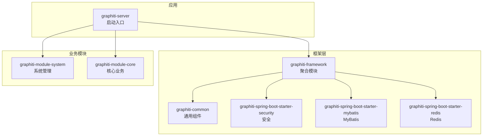
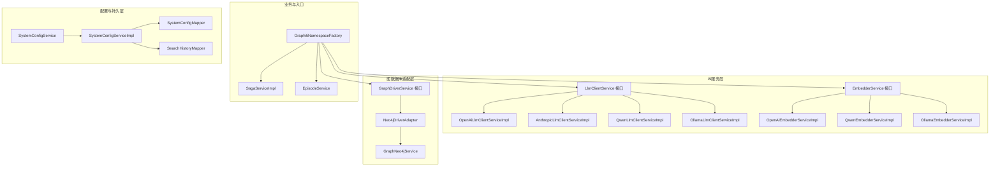
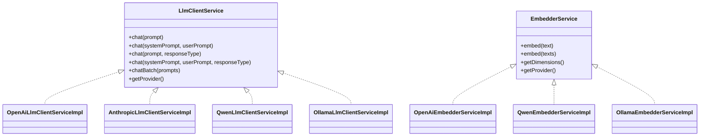
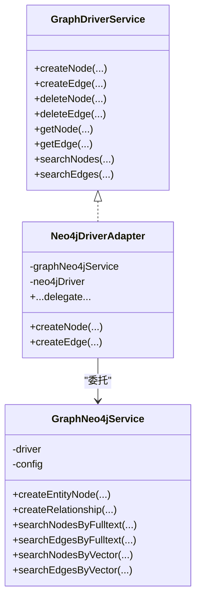
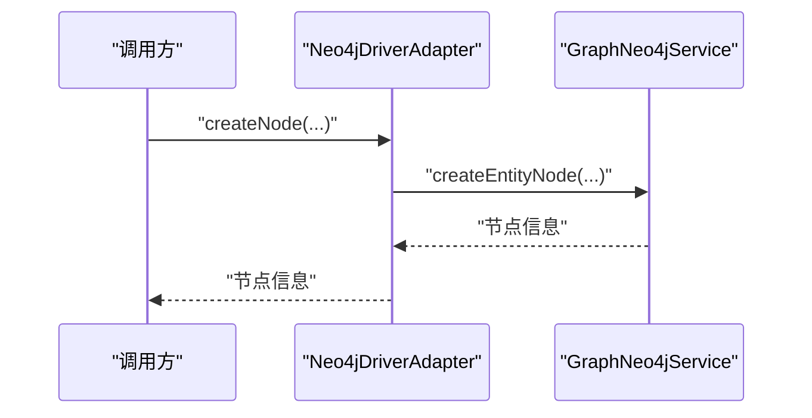
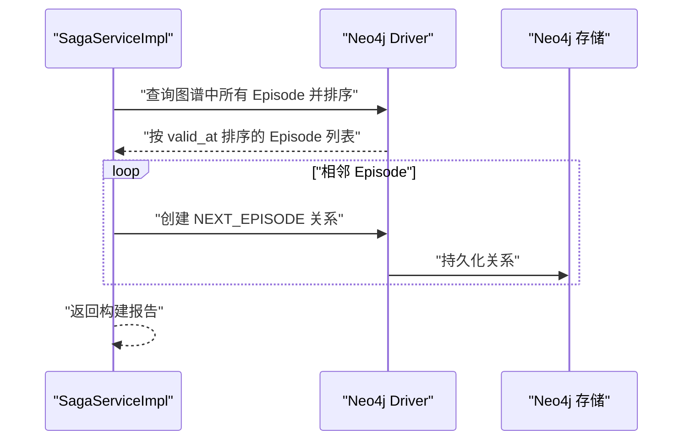
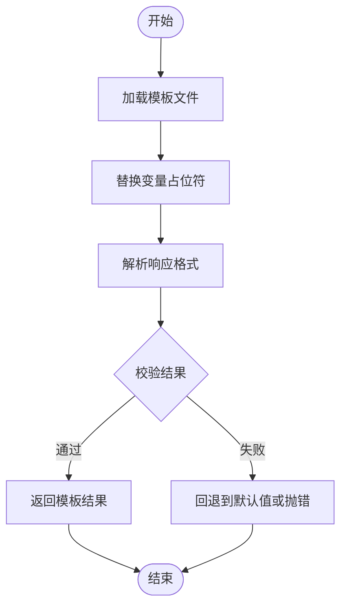
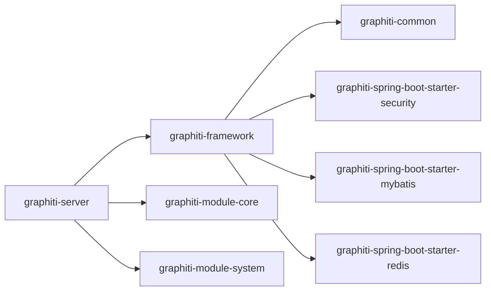

# 设计模式

<cite>
**本文引用的文件**
- [GraphitiAiProperties.java](file://graphiti-module-core/src/main/java/com/graphiti/module/graphiti/config/GraphitiAiProperties.java)
- [LlmClientService.java](file://graphiti-module-core/src/main/java/com/graphiti/module/graphiti/service/LlmClientService.java)
- [OpenAiLlmClientServiceImpl.java](file://graphiti-module-core/src/main/java/com/graphiti/module/graphiti/service/impl/ai/OpenAiLlmClientServiceImpl.java)
- [AnthropicLlmClientServiceImpl.java](file://graphiti-module-core/src/main/java/com/graphiti/module/graphiti/service/impl/ai/AnthropicLlmClientServiceImpl.java)
- [QwenLlmClientServiceImpl.java](file://graphiti-module-core/src/main/java/com/graphiti/module/graphiti/service/impl/ai/QwenLlmClientServiceImpl.java)
- [OllamaLlmClientServiceImpl.java](file://graphiti-module-core/src/main/java/com/graphiti/module/graphiti/service/impl/ai/OllamaLlmClientServiceImpl.java)
- [EmbedderService.java](file://graphiti-module-core/src/main/java/com/graphiti/module/graphiti/service/EmbedderService.java)
- [OpenAiEmbedderServiceImpl.java](file://graphiti-module-core/src/main/java/com/graphiti/module/graphiti/service/impl/ai/OpenAiEmbedderServiceImpl.java)
- [QwenEmbedderServiceImpl.java](file://graphiti-module-core/src/main/java/com/graphiti/module/graphiti/service/impl/ai/QwenEmbedderServiceImpl.java)
- [OllamaEmbedderServiceImpl.java](file://graphiti-module-core/src/main/java/com/graphiti/module/graphiti/service/impl/ai/OllamaEmbedderServiceImpl.java)
- [GraphDriverService.java](file://graphiti-module-core/src/main/java/com/graphiti/module/graphiti/service/GraphDriverService.java)
- [Neo4jDriverAdapter.java](file://graphiti-module-core/src/main/java/com/graphiti/module/graphiti/service/impl/Neo4jDriverAdapter.java)
- [GraphNeo4jService.java](file://graphiti-module-core/src/main/java/com/graphiti/module/graphiti/service/GraphNeo4jService.java)
- [GraphitiNamespaceFactory.java](file://graphiti-module-core/src/main/java/com/graphiti/module/graphiti/namespace/GraphitiNamespaceFactory.java)
- [SagaServiceImpl.java](file://graphiti-module-core/src/main/java/com/graphiti/module/graphiti/service/impl/SagaServiceImpl.java)
- [GraphNeo4jConfig.java](file://graphiti-module-core/src/main/java/com/graphiti/module/graphiti/config/GraphNeo4jConfig.java)
- [SystemConfigService.java](file://graphiti-module-system/src/main/java/com/graphiti/system/service/SystemConfigService.java)
- [SystemConfigServiceImpl.java](file://graphiti-module-system/src/main/java/com/graphiti/system/service/impl/SystemConfigServiceImpl.java)
- [SystemConfigMapper.java](file://graphiti-module-system/src/main/java/com/graphiti/system/dal/mysql/SystemConfigMapper.java)
- [SearchHistoryMapper.java](file://graphiti-module-system/src/main/java/com/graphiti/system/dal/mysql/SearchHistoryMapper.java)
- [PromptTemplateService.java](file://graphiti-module-core/src/main/java/com/graphiti/module/graphiti/service/PromptTemplateService.java)
- [PromptTemplateServiceImpl.java](file://graphiti-module-core/src/main/java/com/graphiti/module/graphiti/service/impl/PromptTemplateServiceImpl.java)
- [PromptTemplateDO.java](file://graphiti-module-core/src/main/java/com/graphiti/module/graphiti/dal/dataobject/PromptTemplateDO.java)
- [PromptTemplateVO.java](file://graphiti-module-core/src/main/java/com/graphiti/module/graphiti/vo/prompt/PromptTemplateVO.java)
- [EpisodeService.java](file://graphiti-module-core/src/main/java/com/graphiti/module/graphiti/service/EpisodeService.java)
- [EpisodeInfoRespVO.java](file://graphiti-module-core/src/main/java/com/graphiti/module/graphiti/vo/episode/EpisodeInfoRespVO.java)
- [graphiti-spring-boot-starter-redis/pom.xml](file://graphiti-framework/graphiti-spring-boot-starter-redis/pom.xml)
- [graphiti-framework/pom.xml](file://graphiti-framework/pom.xml)
</cite>

## 目录
1. [简介](#简介)
2. [项目结构](#项目结构)
3. [核心组件](#核心组件)
4. [架构总览](#架构总览)
5. [详细组件分析](#详细组件分析)
6. [依赖分析](#依赖分析)
7. [性能考虑](#性能考虑)
8. [故障排查指南](#故障排查指南)
9. [结论](#结论)
10. [附录](#附录)

## 简介
本文件聚焦于Graphiti-Java项目中的设计模式应用，结合实际代码路径与实现细节，系统梳理并解析以下模式在工程中的落地方式与价值：
- 工厂模式：在AI服务提供者中的应用
- 策略模式：在数据库适配器中的实现
- 适配器模式：在Neo4j驱动中的使用
- 观察者模式：在事件处理中的体现
- 模板方法模式：在业务流程中的应用
- 单例模式：在配置管理与工具类中的使用
- 装饰器模式：在拦截器链中的实现

同时，给出技术选型考量、性能影响与最佳实践建议，帮助开发者在实际开发中正确选择与应用这些模式。

## 项目结构
Graphiti-Java采用多模块聚合结构，核心模块包括：
- graphiti-framework：框架聚合模块，包含通用组件与Spring Boot Starter封装
- graphiti-module-system：系统管理模块（用户、菜单、日志、配置等）
- graphiti-module-core：核心业务模块（知识图谱、抽取、嵌入、提示词、事件等）
- graphiti-server：应用启动入口

图表来源
- [graphiti-framework/pom.xml:22-27](file://graphiti-framework/pom.xml#L22-L27)
- [graphiti-spring-boot-starter-redis/pom.xml:1-38](file://graphiti-framework/graphiti-spring-boot-starter-redis/pom.xml#L1-L38)

章节来源
- [graphiti-framework/pom.xml:1-28](file://graphiti-framework/pom.xml#L1-L28)

## 核心组件
围绕设计模式的应用，本节梳理关键组件与其职责边界：
- AI服务层：统一LLM客户端与嵌入服务接口，屏蔽不同Provider差异
- 图数据库适配层：抽象图驱动接口，Neo4j适配器实现具体桥接
- 命名空间工厂：集中装配各领域命名空间，作为入口与组合点
- Saga服务：基于时序链的事件编排与上下文管理
- 配置与持久层：系统配置服务与MyBatis Mapper，支撑策略与配置管理

章节来源
- [LlmClientService.java:17-70](file://graphiti-module-core/src/main/java/com/graphiti/module/graphiti/service/LlmClientService.java#L17-L70)
- [EmbedderService.java:9-39](file://graphiti-module-core/src/main/java/com/graphiti/module/graphiti/service/EmbedderService.java#L9-L39)
- [GraphDriverService.java:10-51](file://graphiti-module-core/src/main/java/com/graphiti/module/graphiti/service/GraphDriverService.java#L10-L51)
- [Neo4jDriverAdapter.java:17-83](file://graphiti-module-core/src/main/java/com/graphiti/module/graphiti/service/impl/Neo4jDriverAdapter.java#L17-L83)
- [GraphitiNamespaceFactory.java:37-143](file://graphiti-module-core/src/main/java/com/graphiti/module/graphiti/namespace/GraphitiNamespaceFactory.java#L37-L143)
- [SagaServiceImpl.java:24-73](file://graphiti-module-core/src/main/java/com/graphiti/module/graphiti/service/impl/SagaServiceImpl.java#L24-L73)
- [SystemConfigService.java:10-47](file://graphiti-module-system/src/main/java/com/graphiti/system/service/SystemConfigService.java#L10-L47)
- [SystemConfigServiceImpl.java:23-102](file://graphiti-module-system/src/main/java/com/graphiti/system/service/impl/SystemConfigServiceImpl.java#L23-L102)

## 架构总览
下图展示设计模式在整体架构中的位置与交互关系：

图表来源
- [LlmClientService.java:17-70](file://graphiti-module-core/src/main/java/com/graphiti/module/graphiti/service/LlmClientService.java#L17-L70)
- [EmbedderService.java:9-39](file://graphiti-module-core/src/main/java/com/graphiti/module/graphiti/service/EmbedderService.java#L9-L39)
- [OpenAiLlmClientServiceImpl.java:23-110](file://graphiti-module-core/src/main/java/com/graphiti/module/graphiti/service/impl/ai/OpenAiLlmClientServiceImpl.java#L23-L110)
- [AnthropicLlmClientServiceImpl.java:37-112](file://graphiti-module-core/src/main/java/com/graphiti/module/graphiti/service/impl/ai/AnthropicLlmClientServiceImpl.java#L37-L112)
- [QwenLlmClientServiceImpl.java:23-98](file://graphiti-module-core/src/main/java/com/graphiti/module/graphiti/service/impl/ai/QwenLlmClientServiceImpl.java#L23-L98)
- [OllamaLlmClientServiceImpl.java:23-98](file://graphiti-module-core/src/main/java/com/graphiti/module/graphiti/service/impl/ai/OllamaLlmClientServiceImpl.java#L23-L98)
- [OpenAiEmbedderServiceImpl.java:24-107](file://graphiti-module-core/src/main/java/com/graphiti/module/graphiti/service/impl/ai/OpenAiEmbedderServiceImpl.java#L24-L107)
- [QwenEmbedderServiceImpl.java:24-66](file://graphiti-module-core/src/main/java/com/graphiti/module/graphiti/service/impl/ai/QwenEmbedderServiceImpl.java#L24-L66)
- [OllamaEmbedderServiceImpl.java:24-78](file://graphiti-module-core/src/main/java/com/graphiti/module/graphiti/service/impl/ai/OllamaEmbedderServiceImpl.java#L24-L78)
- [GraphDriverService.java:10-51](file://graphiti-module-core/src/main/java/com/graphiti/module/graphiti/service/GraphDriverService.java#L10-L51)
- [Neo4jDriverAdapter.java:17-83](file://graphiti-module-core/src/main/java/com/graphiti/module/graphiti/service/impl/Neo4jDriverAdapter.java#L17-L83)
- [GraphNeo4jService.java:21-800](file://graphiti-module-core/src/main/java/com/graphiti/module/graphiti/service/GraphNeo4jService.java#L21-L800)
- [GraphitiNamespaceFactory.java:37-143](file://graphiti-module-core/src/main/java/com/graphiti/module/graphiti/namespace/GraphitiNamespaceFactory.java#L37-L143)
- [SagaServiceImpl.java:24-147](file://graphiti-module-core/src/main/java/com/graphiti/module/graphiti/service/impl/SagaServiceImpl.java#L24-L147)
- [SystemConfigService.java:10-47](file://graphiti-module-system/src/main/java/com/graphiti/system/service/SystemConfigService.java#L10-L47)
- [SystemConfigServiceImpl.java:23-122](file://graphiti-module-system/src/main/java/com/graphiti/system/service/impl/SystemConfigServiceImpl.java#L23-L122)
- [SystemConfigMapper.java:10-12](file://graphiti-module-system/src/main/java/com/graphiti/system/dal/mysql/SystemConfigMapper.java#L10-L12)
- [SearchHistoryMapper.java:10-12](file://graphiti-module-system/src/main/java/com/graphiti/system/dal/mysql/SearchHistoryMapper.java#L10-L12)

## 详细组件分析

### 工厂模式：AI服务提供者的动态选择
- 模式要点
  - 通过条件注解与配置项动态激活不同Provider实现，形成“工厂”式的服务实例选择
  - LLM客户端与嵌入服务均暴露统一接口，屏蔽底层差异
- 关键实现
  - LLM客户端接口与多个Provider实现类，分别通过条件注解读取配置项决定启用
  - 嵌入服务同样以接口抽象，不同Provider实现对应不同模型与维度
- 代码路径
  - [LlmClientService.java:17-70](file://graphiti-module-core/src/main/java/com/graphiti/module/graphiti/service/LlmClientService.java#L17-L70)
  - [OpenAiLlmClientServiceImpl.java:23-110](file://graphiti-module-core/src/main/java/com/graphiti/module/graphiti/service/impl/ai/OpenAiLlmClientServiceImpl.java#L23-L110)
  - [AnthropicLlmClientServiceImpl.java:37-112](file://graphiti-module-core/src/main/java/com/graphiti/module/graphiti/service/impl/ai/AnthropicLlmClientServiceImpl.java#L37-L112)
  - [QwenLlmClientServiceImpl.java:23-98](file://graphiti-module-core/src/main/java/com/graphiti/module/graphiti/service/impl/ai/QwenLlmClientServiceImpl.java#L23-L98)
  - [OllamaLlmClientServiceImpl.java:23-98](file://graphiti-module-core/src/main/java/com/graphiti/module/graphiti/service/impl/ai/OllamaLlmClientServiceImpl.java#L23-L98)
  - [EmbedderService.java:9-39](file://graphiti-module-core/src/main/java/com/graphiti/module/graphiti/service/EmbedderService.java#L9-L39)
  - [OpenAiEmbedderServiceImpl.java:24-107](file://graphiti-module-core/src/main/java/com/graphiti/module/graphiti/service/impl/ai/OpenAiEmbedderServiceImpl.java#L24-L107)
  - [QwenEmbedderServiceImpl.java:24-66](file://graphiti-module-core/src/main/java/com/graphiti/module/graphiti/service/impl/ai/QwenEmbedderServiceImpl.java#L24-L66)
  - [OllamaEmbedderServiceImpl.java:24-78](file://graphiti-module-core/src/main/java/com/graphiti/module/graphiti/service/impl/ai/OllamaEmbedderServiceImpl.java#L24-L78)
  - [GraphitiAiProperties.java:52-134](file://graphiti-module-core/src/main/java/com/graphiti/module/graphiti/config/GraphitiAiProperties.java#L52-L134)

图表来源
- [LlmClientService.java:17-70](file://graphiti-module-core/src/main/java/com/graphiti/module/graphiti/service/LlmClientService.java#L17-L70)
- [OpenAiLlmClientServiceImpl.java:23-110](file://graphiti-module-core/src/main/java/com/graphiti/module/graphiti/service/impl/ai/OpenAiLlmClientServiceImpl.java#L23-L110)
- [AnthropicLlmClientServiceImpl.java:37-112](file://graphiti-module-core/src/main/java/com/graphiti/module/graphiti/service/impl/ai/AnthropicLlmClientServiceImpl.java#L37-L112)
- [QwenLlmClientServiceImpl.java:23-98](file://graphiti-module-core/src/main/java/com/graphiti/module/graphiti/service/impl/ai/QwenLlmClientServiceImpl.java#L23-L98)
- [OllamaLlmClientServiceImpl.java:23-98](file://graphiti-module-core/src/main/java/com/graphiti/module/graphiti/service/impl/ai/OllamaLlmClientServiceImpl.java#L23-L98)
- [EmbedderService.java:9-39](file://graphiti-module-core/src/main/java/com/graphiti/module/graphiti/service/EmbedderService.java#L9-L39)
- [OpenAiEmbedderServiceImpl.java:24-107](file://graphiti-module-core/src/main/java/com/graphiti/module/graphiti/service/impl/ai/OpenAiEmbedderServiceImpl.java#L24-L107)
- [QwenEmbedderServiceImpl.java:24-66](file://graphiti-module-core/src/main/java/com/graphiti/module/graphiti/service/impl/ai/QwenEmbedderServiceImpl.java#L24-L66)
- [OllamaEmbedderServiceImpl.java:24-78](file://graphiti-module-core/src/main/java/com/graphiti/module/graphiti/service/impl/ai/OllamaEmbedderServiceImpl.java#L24-L78)

章节来源
- [LlmClientService.java:17-70](file://graphiti-module-core/src/main/java/com/graphiti/module/graphiti/service/LlmClientService.java#L17-L70)
- [EmbedderService.java:9-39](file://graphiti-module-core/src/main/java/com/graphiti/module/graphiti/service/EmbedderService.java#L9-L39)
- [OpenAiLlmClientServiceImpl.java:23-110](file://graphiti-module-core/src/main/java/com/graphiti/module/graphiti/service/impl/ai/OpenAiLlmClientServiceImpl.java#L23-L110)
- [AnthropicLlmClientServiceImpl.java:37-112](file://graphiti-module-core/src/main/java/com/graphiti/module/graphiti/service/impl/ai/AnthropicLlmClientServiceImpl.java#L37-L112)
- [QwenLlmClientServiceImpl.java:23-98](file://graphiti-module-core/src/main/java/com/graphiti/module/graphiti/service/impl/ai/QwenLlmClientServiceImpl.java#L23-L98)
- [OllamaLlmClientServiceImpl.java:23-98](file://graphiti-module-core/src/main/java/com/graphiti/module/graphiti/service/impl/ai/OllamaLlmClientServiceImpl.java#L23-L98)
- [OpenAiEmbedderServiceImpl.java:24-107](file://graphiti-module-core/src/main/java/com/graphiti/module/graphiti/service/impl/ai/OpenAiEmbedderServiceImpl.java#L24-L107)
- [QwenEmbedderServiceImpl.java:24-66](file://graphiti-module-core/src/main/java/com/graphiti/module/graphiti/service/impl/ai/QwenEmbedderServiceImpl.java#L24-L66)
- [OllamaEmbedderServiceImpl.java:24-78](file://graphiti-module-core/src/main/java/com/graphiti/module/graphiti/service/impl/ai/OllamaEmbedderServiceImpl.java#L24-L78)
- [GraphitiAiProperties.java:52-134](file://graphiti-module-core/src/main/java/com/graphiti/module/graphiti/config/GraphitiAiProperties.java#L52-L134)

### 策略模式：数据库适配器的多实现
- 模式要点
  - 抽象统一的图驱动接口，针对不同图数据库提供不同实现
  - 通过适配器将具体驱动服务包装为统一接口，便于上层业务无感切换
- 关键实现
  - 图驱动接口定义统一能力；Neo4j适配器将具体服务包装为统一接口
  - GraphNeo4jService直接封装Neo4j Driver，提供节点/边CRUD与搜索能力
- 代码路径
  - [GraphDriverService.java:10-51](file://graphiti-module-core/src/main/java/com/graphiti/module/graphiti/service/GraphDriverService.java#L10-L51)
  - [Neo4jDriverAdapter.java:17-83](file://graphiti-module-core/src/main/java/com/graphiti/module/graphiti/service/impl/Neo4jDriverAdapter.java#L17-L83)
  - [GraphNeo4jService.java:21-800](file://graphiti-module-core/src/main/java/com/graphiti/module/graphiti/service/GraphNeo4jService.java#L21-L800)

图表来源
- [GraphDriverService.java:10-51](file://graphiti-module-core/src/main/java/com/graphiti/module/graphiti/service/GraphDriverService.java#L10-L51)
- [Neo4jDriverAdapter.java:17-83](file://graphiti-module-core/src/main/java/com/graphiti/module/graphiti/service/impl/Neo4jDriverAdapter.java#L17-L83)
- [GraphNeo4jService.java:21-800](file://graphiti-module-core/src/main/java/com/graphiti/module/graphiti/service/GraphNeo4jService.java#L21-L800)

章节来源
- [GraphDriverService.java:10-51](file://graphiti-module-core/src/main/java/com/graphiti/module/graphiti/service/GraphDriverService.java#L10-L51)
- [Neo4jDriverAdapter.java:17-83](file://graphiti-module-core/src/main/java/com/graphiti/module/graphiti/service/impl/Neo4jDriverAdapter.java#L17-L83)
- [GraphNeo4jService.java:21-800](file://graphiti-module-core/src/main/java/com/graphiti/module/graphiti/service/GraphNeo4jService.java#L21-L800)

### 适配器模式：Neo4j驱动的统一接入
- 模式要点
  - 将GraphNeo4jService的能力适配为GraphDriverService接口，实现“旧接口—新实现”的桥接
  - 保持上层业务对统一接口的依赖，隐藏底层驱动差异
- 代码路径
  - [Neo4jDriverAdapter.java:17-83](file://graphiti-module-core/src/main/java/com/graphiti/module/graphiti/service/impl/Neo4jDriverAdapter.java#L17-L83)

图表来源
- [Neo4jDriverAdapter.java:24-28](file://graphiti-module-core/src/main/java/com/graphiti/module/graphiti/service/impl/Neo4jDriverAdapter.java#L24-L28)
- [GraphNeo4jService.java:41-64](file://graphiti-module-core/src/main/java/com/graphiti/module/graphiti/service/GraphNeo4jService.java#L41-L64)

章节来源
- [Neo4jDriverAdapter.java:17-83](file://graphiti-module-core/src/main/java/com/graphiti/module/graphiti/service/impl/Neo4jDriverAdapter.java#L17-L83)
- [GraphNeo4jService.java:21-800](file://graphiti-module-core/src/main/java/com/graphiti/module/graphiti/service/GraphNeo4jService.java#L21-L800)

### 观察者模式：事件处理与上下文联动
- 模式要点
  - 事件（Episode）之间通过时序边建立依赖关系，形成“发布—订阅”式的上下文传播
  - Saga服务负责构建与维护时序链，提供上下文查询能力
- 代码路径
  - [SagaServiceImpl.java:24-147](file://graphiti-module-core/src/main/java/com/graphiti/module/graphiti/service/impl/SagaServiceImpl.java#L24-L147)
  - [EpisodeService.java:12-52](file://graphiti-module-core/src/main/java/com/graphiti/module/graphiti/service/EpisodeService.java#L12-L52)
  - [EpisodeInfoRespVO.java:14-52](file://graphiti-module-core/src/main/java/com/graphiti/module/graphiti/vo/episode/EpisodeInfoRespVO.java#L14-L52)

图表来源
- [SagaServiceImpl.java:28-73](file://graphiti-module-core/src/main/java/com/graphiti/module/graphiti/service/impl/SagaServiceImpl.java#L28-L73)
- [GraphNeo4jService.java:336-495](file://graphiti-module-core/src/main/java/com/graphiti/module/graphiti/service/GraphNeo4jService.java#L336-L495)

章节来源
- [SagaServiceImpl.java:24-147](file://graphiti-module-core/src/main/java/com/graphiti/module/graphiti/service/impl/SagaServiceImpl.java#L24-L147)
- [EpisodeService.java:12-52](file://graphiti-module-core/src/main/java/com/graphiti/module/graphiti/service/EpisodeService.java#L12-L52)
- [EpisodeInfoRespVO.java:14-52](file://graphiti-module-core/src/main/java/com/graphiti/module/graphiti/vo/episode/EpisodeInfoRespVO.java#L14-L52)

### 模板方法模式：业务流程的稳定骨架
- 模式要点
  - 在提示词模板服务中，定义模板加载、变量替换与结果解析的固定流程骨架，子步骤由具体实现定制
  - 通过默认方法与模板文件加载机制，形成稳定的业务处理流程
- 代码路径
  - [PromptTemplateService.java:14-55](file://graphiti-module-core/src/main/java/com/graphiti/module/graphiti/service/PromptTemplateService.java#L14-L55)
  - [PromptTemplateServiceImpl.java:31-35](file://graphiti-module-core/src/main/java/com/graphiti/module/graphiti/service/impl/PromptTemplateServiceImpl.java#L31-L35)
  - [PromptTemplateDO.java:14-59](file://graphiti-module-core/src/main/java/com/graphiti/module/graphiti/dal/dataobject/PromptTemplateDO.java#L14-L59)
  - [PromptTemplateVO.java:15-45](file://graphiti-module-core/src/main/java/com/graphiti/module/graphiti/vo/prompt/PromptTemplateVO.java#L15-L45)

图表来源
- [PromptTemplateService.java:14-55](file://graphiti-module-core/src/main/java/com/graphiti/module/graphiti/service/PromptTemplateService.java#L14-L55)
- [PromptTemplateServiceImpl.java:31-35](file://graphiti-module-core/src/main/java/com/graphiti/module/graphiti/service/impl/PromptTemplateServiceImpl.java#L31-L35)
- [PromptTemplateDO.java:14-59](file://graphiti-module-core/src/main/java/com/graphiti/module/graphiti/dal/dataobject/PromptTemplateDO.java#L14-L59)
- [PromptTemplateVO.java:15-45](file://graphiti-module-core/src/main/java/com/graphiti/module/graphiti/vo/prompt/PromptTemplateVO.java#L15-L45)

章节来源
- [PromptTemplateService.java:14-55](file://graphiti-module-core/src/main/java/com/graphiti/module/graphiti/service/PromptTemplateService.java#L14-L55)
- [PromptTemplateServiceImpl.java:31-35](file://graphiti-module-core/src/main/java/com/graphiti/module/graphiti/service/impl/PromptTemplateServiceImpl.java#L31-L35)
- [PromptTemplateDO.java:14-59](file://graphiti-module-core/src/main/java/com/graphiti/module/graphiti/dal/dataobject/PromptTemplateDO.java#L14-L59)
- [PromptTemplateVO.java:15-45](file://graphiti-module-core/src/main/java/com/graphiti/module/graphiti/vo/prompt/PromptTemplateVO.java#L15-L45)

### 单例模式：配置管理与工具类
- 模式要点
  - Spring容器中的Bean默认即单例，通过@ConfigurationProperties与@Bean实现配置单例化
  - 工具类（如向量转换）以静态方法形式提供，避免重复实例化
- 代码路径
  - [GraphNeo4jConfig.java:17-46](file://graphiti-module-core/src/main/java/com/graphiti/module/graphiti/config/GraphNeo4jConfig.java#L17-L46)
  - [GraphNeo4jService.java:798-800](file://graphiti-module-core/src/main/java/com/graphiti/module/graphiti/service/GraphNeo4jService.java#L798-L800)

章节来源
- [GraphNeo4jConfig.java:17-46](file://graphiti-module-core/src/main/java/com/graphiti/module/graphiti/config/GraphNeo4jConfig.java#L17-L46)
- [GraphNeo4jService.java:798-800](file://graphiti-module-core/src/main/java/com/graphiti/module/graphiti/service/GraphNeo4jService.java#L798-L800)

### 装饰器模式：拦截器链与横切关注点
- 模式要点
  - 通过Spring Security与JWT过滤器链实现认证与授权的装饰
  - 通过Redis缓存与序列化工具实现横切的缓存装饰
- 代码路径
  - [graphiti-framework/graphiti-spring-boot-starter-redis/pom.xml:19-37](file://graphiti-framework/graphiti-spring-boot-starter-redis/pom.xml#L19-L37)

章节来源
- [graphiti-framework/graphiti-spring-boot-starter-redis/pom.xml:19-37](file://graphiti-framework/graphiti-spring-boot-starter-redis/pom.xml#L19-L37)

## 依赖分析
- 模块间耦合
  - graphiti-server依赖graphiti-framework与graphiti-module-core/graphiti-module-system
  - graphiti-framework聚合通用组件，降低业务模块重复依赖
- 组件内聚
  - AI服务与图数据库适配器通过接口解耦，便于替换与扩展
  - 命名空间工厂集中装配，提升入口一致性与可维护性

图表来源
- [graphiti-framework/pom.xml:22-27](file://graphiti-framework/pom.xml#L22-L27)

章节来源
- [graphiti-framework/pom.xml:1-28](file://graphiti-framework/pom.xml#L1-L28)

## 性能考虑
- 工厂模式
  - 条件注解在启动阶段确定实现，运行期零开销；注意避免过多Provider导致启动时间增加
- 策略/适配器模式
  - 适配器委托调用会引入一层方法调用开销，通常可忽略；关键在于减少不必要的对象创建
- 观察者/时序链
  - Saga构建涉及多次写入，建议批处理与事务控制；合理设置索引以降低查询成本
- 模板方法
  - 模板加载与字符串替换为CPU密集型，建议缓存模板与变量映射
- 单例
  - 配置Bean与工具方法为天然单例，避免重复初始化；注意线程安全与不可变性
- 装饰器
  - 缓存装饰与过滤器链需平衡命中率与内存占用，避免过度装饰导致延迟放大

## 故障排查指南
- AI服务异常
  - 嵌入服务在空输入或API返回null时抛出明确异常，检查模型配置与输入合法性
  - LLM客户端在异常时记录错误并抛出运行时异常，定位具体Provider配置
- 图数据库适配
  - 适配器方法缺失或签名不一致会导致编译期错误；确保与GraphDriverService接口保持一致
  - Neo4j索引未创建会导致向量/全文搜索失败，查看日志并执行初始化脚本
- 配置管理
  - 系统配置服务在查询不存在的配置时抛出业务异常，检查键值与状态
  - MyBatis Mapper未标注@Mapper会导致注入失败，确保Mapper接口正确注解

章节来源
- [OpenAiEmbedderServiceImpl.java:34-60](file://graphiti-module-core/src/main/java/com/graphiti/module/graphiti/service/impl/ai/OpenAiEmbedderServiceImpl.java#L34-L60)
- [OpenAiLlmClientServiceImpl.java:74-82](file://graphiti-module-core/src/main/java/com/graphiti/module/graphiti/service/impl/ai/OpenAiLlmClientServiceImpl.java#L74-L82)
- [Neo4jDriverAdapter.java:17-83](file://graphiti-module-core/src/main/java/com/graphiti/module/graphiti/service/impl/Neo4jDriverAdapter.java#L17-L83)
- [GraphNeo4jService.java:608-762](file://graphiti-module-core/src/main/java/com/graphiti/module/graphiti/service/GraphNeo4jService.java#L608-L762)
- [SystemConfigServiceImpl.java:53-59](file://graphiti-module-system/src/main/java/com/graphiti/system/service/impl/SystemConfigServiceImpl.java#L53-L59)
- [SystemConfigMapper.java:10-12](file://graphiti-module-system/src/main/java/com/graphiti/system/dal/mysql/SystemConfigMapper.java#L10-L12)
- [SearchHistoryMapper.java:10-12](file://graphiti-module-system/src/main/java/com/graphiti/system/dal/mysql/SearchHistoryMapper.java#L10-L12)

## 结论
Graphiti-Java在设计模式层面体现了清晰的分层与解耦思路：
- 工厂模式让AI服务具备灵活可插拔的Provider选择能力
- 策略与适配器模式共同实现了数据库驱动的抽象与桥接
- 观察者模式通过时序链实现事件上下文的自然流转
- 模板方法模式稳定了提示词模板的处理流程
- 单例与装饰器模式分别强化了配置管理与横切关注点的实现

在实际开发中，建议遵循“接口优先、配置驱动、最小侵入”的原则，结合性能与可维护性进行权衡。

## 附录
- 设计模式选择的技术考量
  - 可扩展性：优先采用接口+多实现的策略/工厂模式
  - 可测试性：通过接口与工厂注入Mock实现，便于单元测试
  - 可运维性：通过配置文件与条件注解实现环境差异化
- 性能影响评估
  - 方法调用链深度与序列化开销是主要瓶颈，应避免过度装饰与深层嵌套
  - 索引与缓存是图数据库与AI服务的关键性能抓手