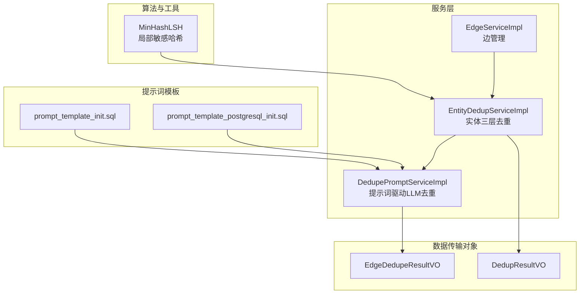
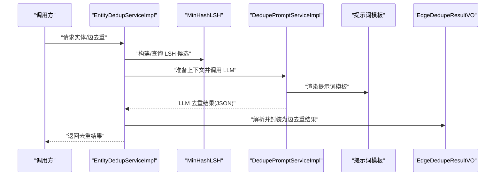
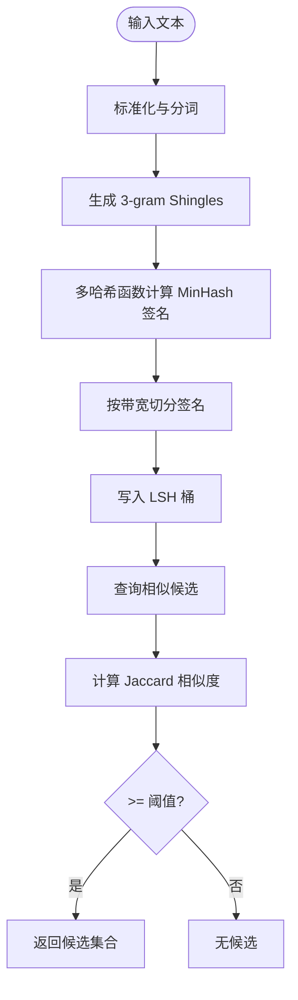
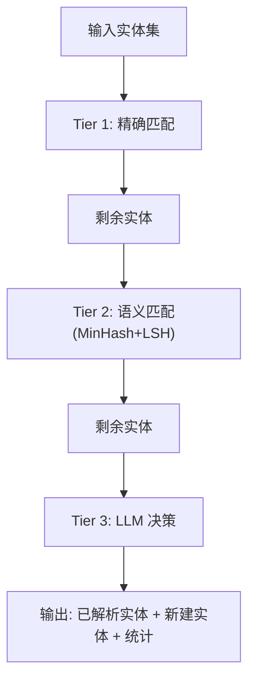
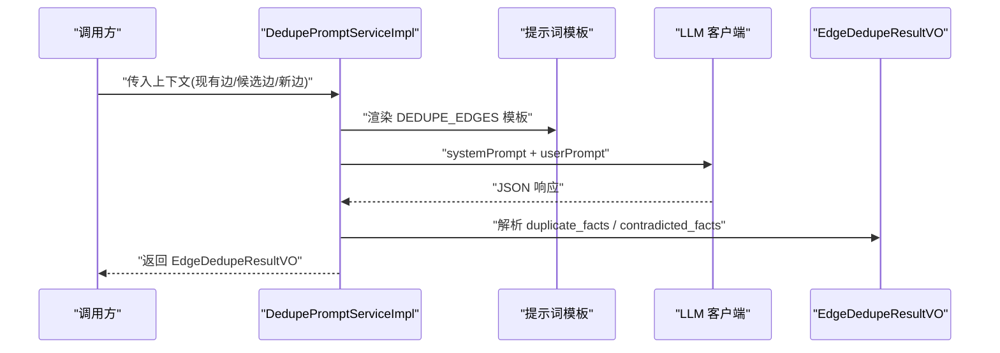
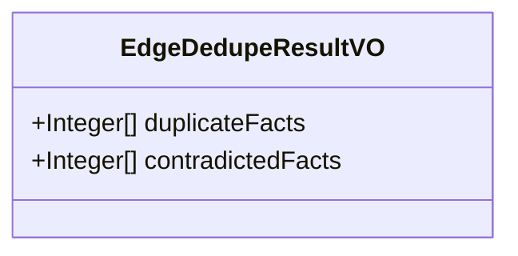
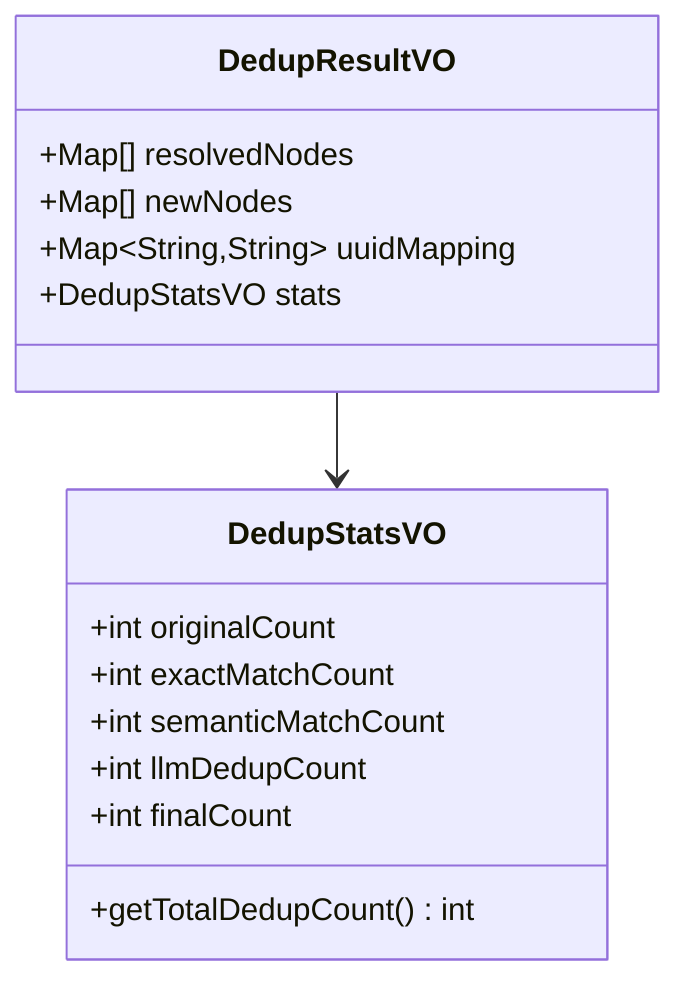
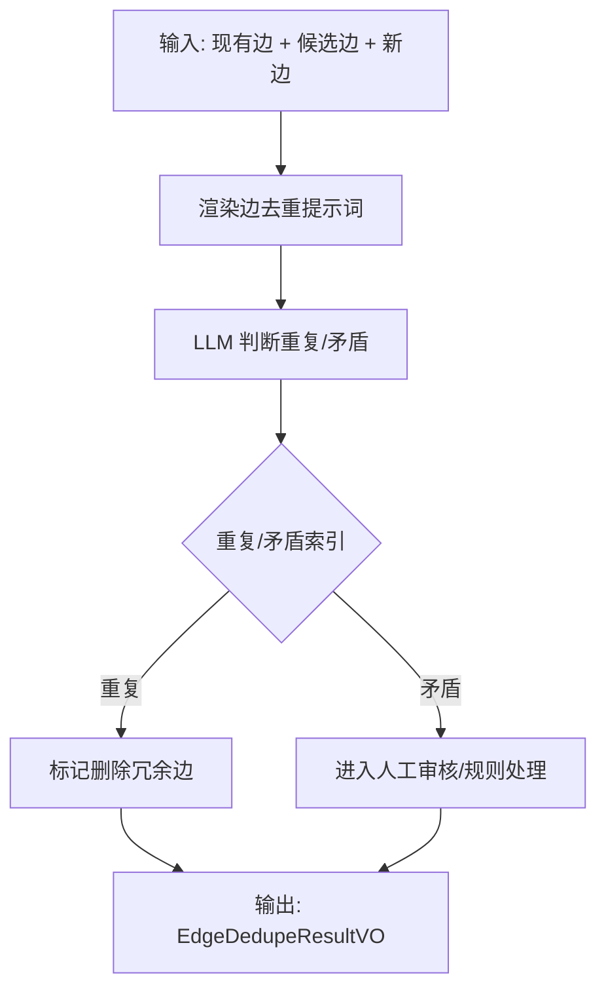
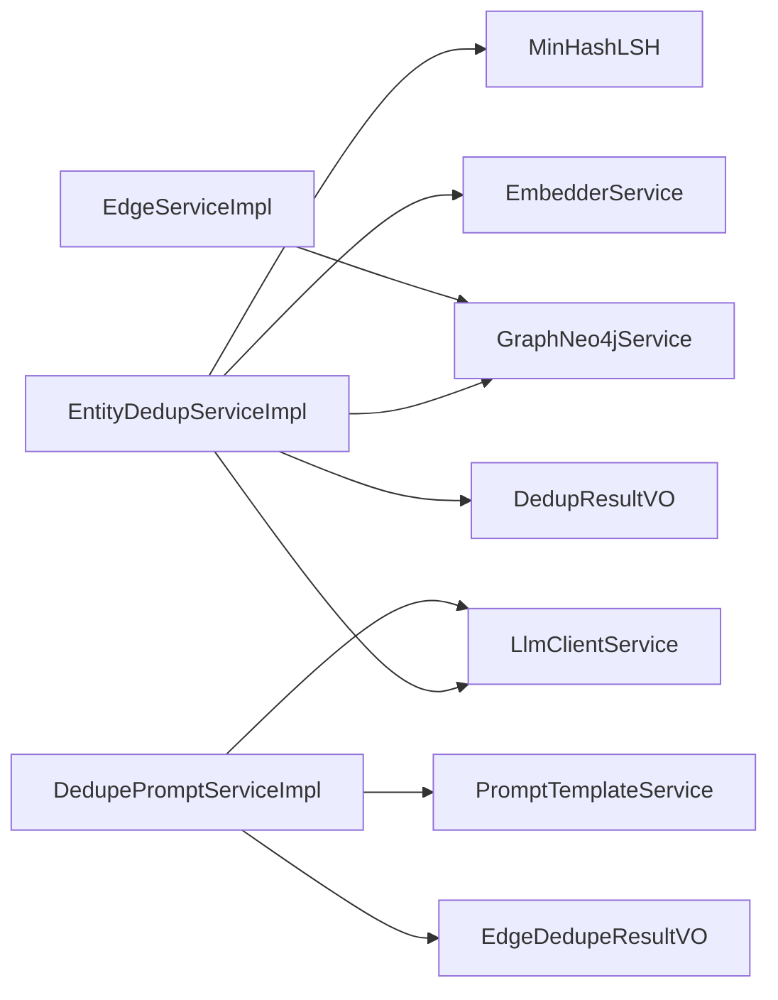

# 关系去重服务

<!--<cite>
**本文引用的文件**
- [MinHashLSH.java](file://graphiti-module-core/src/main/java/com/graphiti/module/graphiti/util/MinHashLSH.java)
- [EntityDedupServiceImpl.java](file://graphiti-module-core/src/main/java/com/graphiti/module/graphiti/service/impl/EntityDedupServiceImpl.java)
- [DedupePromptServiceImpl.java](file://graphiti-module-core/src/main/java/com/graphiti/module/graphiti/service/impl/DedupePromptServiceImpl.java)
- [EdgeDedupeResultVO.java](file://graphiti-module-core/src/main/java/com/graphiti/module/graphiti/vo/dedup/EdgeDedupeResultVO.java)
- [DedupResultVO.java](file://graphiti-module-core/src/main/java/com/graphiti/module/graphiti/vo/dedup/DedupResultVO.java)
- [prompt_template_init.sql](file://docs/sql/prompt_template_init.sql)
- [prompt_template_postgresql_init.sql](file://docs/sql/prompt_template_postgresql_init.sql)
- [EdgeServiceImpl.java](file://graphiti-module-core/src/main/java/com/graphiti/module/graphiti/service/impl/EdgeServiceImpl.java)
- [2026-05-11-ontograph-java-full-migration-plan.md](file://docs/superpowers/plans/2026-05-11-ontograph-java-full-migration-plan.md)
</cite>-->

## 目录
1. [简介](#简介)
2. [项目结构](#项目结构)
3. [核心组件](#核心组件)
4. [架构总览](#架构总览)
5. [详细组件分析](#详细组件分析)
6. [依赖分析](#依赖分析)
7. [性能考虑](#性能考虑)
8. [故障排查指南](#故障排查指南)
9. [结论](#结论)
10. [附录](#附录)

## 简介
本文件面向“关系去重服务”的技术实现，聚焦于边去重流程中的去重算法、相似关系识别、冲突检测与合并决策机制，并结合提示词设计与结果数据结构，给出可落地的性能优化与质量保障方案。文档同时梳理了与实体去重相关的 MinHash+LSH 算法、阈值策略以及 LLM 决策在提示词层面的约束。

## 项目结构
围绕关系去重的关键模块与文件分布如下：
- 算法与工具
  - MinHashLSH：局部敏感哈希与 Jaccard 相似度计算
- 服务层
  - EntityDedupServiceImpl：实体三层去重策略（精确匹配、语义匹配、LLM 决策）
  - DedupePromptServiceImpl：基于提示词模板的 LLM 去重调用与结果解析
  - EdgeServiceImpl：边的创建与读取（为去重提供基础能力）
- 数据传输对象
  - EdgeDedupeResultVO：边去重结果
  - DedupResultVO：实体去重结果与统计
- 提示词模板
  - SQL 初始化脚本：定义边去重提示词模板与变量

**图表来源**
- [MinHashLSH.java:18-195](file://graphiti-module-core/src/main/java/com/graphiti/module/graphiti/util/MinHashLSH.java#L18-L195)
- [EntityDedupServiceImpl.java:41-398](file://graphiti-module-core/src/main/java/com/graphiti/module/graphiti/service/impl/EntityDedupServiceImpl.java#L41-L398)
- [DedupePromptServiceImpl.java:31-342](file://graphiti-module-core/src/main/java/com/graphiti/module/graphiti/service/impl/DedupePromptServiceImpl.java#L31-L342)
- [EdgeDedupeResultVO.java:11-20](file://graphiti-module-core/src/main/java/com/graphiti/module/graphiti/vo/dedup/EdgeDedupeResultVO.java#L11-L20)
- [DedupResultVO.java:11-71](file://graphiti-module-core/src/main/java/com/graphiti/module/graphiti/vo/dedup/DedupResultVO.java#L11-L71)
- [prompt_template_init.sql:217-284](file://docs/sql/prompt_template_init.sql#L217-L284)
- [prompt_template_postgresql_init.sql:403-657](file://docs/sql/prompt_template_postgresql_init.sql#L403-L657)
- [EdgeServiceImpl.java:24-172](file://graphiti-module-core/src/main/java/com/graphiti/module/graphiti/service/impl/EdgeServiceImpl.java#L24-L172)

**章节来源**
- [MinHashLSH.java:18-195](file://graphiti-module-core/src/main/java/com/graphiti/module/graphiti/util/MinHashLSH.java#L18-L195)
- [EntityDedupServiceImpl.java:41-398](file://graphiti-module-core/src/main/java/com/graphiti/module/graphiti/service/impl/EntityDedupServiceImpl.java#L41-L398)
- [DedupePromptServiceImpl.java:31-342](file://graphiti-module-core/src/main/java/com/graphiti/module/graphiti/service/impl/DedupePromptServiceImpl.java#L31-L342)
- [EdgeDedupeResultVO.java:11-20](file://graphiti-module-core/src/main/java/com/graphiti/module/graphiti/vo/dedup/EdgeDedupeResultVO.java#L11-L20)
- [DedupResultVO.java:11-71](file://graphiti-module-core/src/main/java/com/graphiti/module/graphiti/vo/dedup/DedupResultVO.java#L11-L71)
- [prompt_template_init.sql:217-284](file://docs/sql/prompt_template_init.sql#L217-L284)
- [prompt_template_postgresql_init.sql:403-657](file://docs/sql/prompt_template_postgresql_init.sql#L403-L657)
- [EdgeServiceImpl.java:24-172](file://graphiti-module-core/src/main/java/com/graphiti/module/graphiti/service/impl/EdgeServiceImpl.java#L24-L172)

## 核心组件
- MinHashLSH：实现 MinHash 签名与 LSH 分桶，支持相似度查询与阈值判断，用于语义层级的候选集筛选与相似度计算。
- EntityDedupServiceImpl：三层去重策略的统一入口，负责精确匹配、语义匹配（MinHash+LSH）、向量相似度与 LLM 决策的编排。
- DedupePromptServiceImpl：基于提示词模板渲染与 LLM 调用，解析边去重结果（重复事实索引、矛盾事实索引）。
- EdgeDedupeResultVO：边去重结果载体，包含重复事实索引列表与矛盾事实索引列表。
- DedupResultVO：实体去重结果载体，包含已解析实体、新建实体、UUID 映射与统计信息。
- 提示词模板：SQL 初始化脚本中定义边去重提示词模板与变量，约束 LLM 的输出格式与判断边界。

**章节来源**
- [MinHashLSH.java:18-195](file://graphiti-module-core/src/main/java/com/graphiti/module/graphiti/util/MinHashLSH.java#L18-L195)
- [EntityDedupServiceImpl.java:41-398](file://graphiti-module-core/src/main/java/com/graphiti/module/graphiti/service/impl/EntityDedupServiceImpl.java#L41-L398)
- [DedupePromptServiceImpl.java:31-342](file://graphiti-module-core/src/main/java/com/graphiti/module/graphiti/service/impl/DedupePromptServiceImpl.java#L31-L342)
- [EdgeDedupeResultVO.java:11-20](file://graphiti-module-core/src/main/java/com/graphiti/module/graphiti/vo/dedup/EdgeDedupeResultVO.java#L11-L20)
- [DedupResultVO.java:11-71](file://graphiti-module-core/src/main/java/com/graphiti/module/graphiti/vo/dedup/DedupResultVO.java#L11-L71)
- [prompt_template_init.sql:217-284](file://docs/sql/prompt_template_init.sql#L217-L284)
- [prompt_template_postgresql_init.sql:403-657](file://docs/sql/prompt_template_postgresql_init.sql#L403-L657)

## 架构总览
下图展示关系去重在系统中的位置与交互：实体去重服务负责整体去重策略编排；提示词服务负责将上下文与模板渲染后交由 LLM；MinHashLSH 提供语义相似度候选；最终通过提示词解析得到边去重结果。

**图表来源**
- [EntityDedupServiceImpl.java:54-172](file://graphiti-module-core/src/main/java/com/graphiti/module/graphiti/service/impl/EntityDedupServiceImpl.java#L54-L172)
- [MinHashLSH.java:48-94](file://graphiti-module-core/src/main/java/com/graphiti/module/graphiti/util/MinHashLSH.java#L48-L94)
- [DedupePromptServiceImpl.java:141-165](file://graphiti-module-core/src/main/java/com/graphiti/module/graphiti/service/impl/DedupePromptServiceImpl.java#L141-L165)
- [EdgeDedupeResultVO.java:11-20](file://graphiti-module-core/src/main/java/com/graphiti/module/graphiti/vo/dedup/EdgeDedupeResultVO.java#L11-L20)

## 详细组件分析

### MinHashLSH 局部敏感哈希与 Jaccard 相似度
- 算法要点
  - 使用 3-gram 文本切片生成 Shingles，随后通过多哈希函数计算 MinHash 签名。
  - 将签名按固定带宽（band）切分，形成 LSH 桶，提升相似候选检索效率。
  - 相似度估计采用 Jaccard 系数，即相同位置哈希值的比例。
- 阈值与配置
  - 固定阈值 0.9；带宽 4，共 8 个 band（32 个哈希函数）。
- 时间复杂度
  - 构建索引：O(N·K)，N 为条目数，K 为哈希函数数量。
  - 查询候选：近似 O(K)（受桶内冲突影响）。
- 应用场景
  - 在实体去重的语义层（Tier 2）用于快速召回高相似候选，再结合其他策略做最终判定。

**图表来源**
- [MinHashLSH.java:133-179](file://graphiti-module-core/src/main/java/com/graphiti/module/graphiti/util/MinHashLSH.java#L133-L179)
- [MinHashLSH.java:48-94](file://graphiti-module-core/src/main/java/com/graphiti/module/graphiti/util/MinHashLSH.java#L48-L94)

**章节来源**
- [MinHashLSH.java:18-195](file://graphiti-module-core/src/main/java/com/graphiti/module/graphiti/util/MinHashLSH.java#L18-L195)

### 实体三层去重策略（与边去重的关系）
- 策略概览
  - Tier 1：精确匹配（规范化字符串）
  - Tier 2：语义匹配（MinHash+LSH，Jaccard ≥ 0.9）
  - Tier 3：LLM 决策（向量相似度与提示词）
- 与边去重的衔接
  - 实体去重完成后，实体名称与 UUID 的映射可用于边的端点一致性校验与去重前的预处理。
  - 边去重依赖 LLM 对“重复事实”和“矛盾事实”的判断，提示词模板明确要求只对“同一现实对象或概念”才视为重复。

**图表来源**
- [EntityDedupServiceImpl.java:54-172](file://graphiti-module-core/src/main/java/com/graphiti/module/graphiti/service/impl/EntityDedupServiceImpl.java#L54-L172)

**章节来源**
- [EntityDedupServiceImpl.java:21-36](file://graphiti-module-core/src/main/java/com/graphiti/module/graphiti/service/impl/EntityDedupServiceImpl.java#L21-L36)

### DedupePromptServiceImpl：提示词设计与边去重决策
- 功能职责
  - 渲染边去重提示词模板，调用 LLM，解析 JSON 输出为 EdgeDedupeResultVO。
  - 支持单实体/批量实体/节点分组等不同场景的提示词模板。
- 边去重提示词要点
  - 明确“重复事实”与“矛盾事实”的区分边界。
  - 强调“仅当指代同一现实对象或概念时才视为重复”，避免误判。
  - 要求 LLM 返回 JSON 结构，包含重复事实索引与矛盾事实索引列表。
- 结果解析
  - 解析 JSON 中的重复事实索引与矛盾事实索引，封装为 EdgeDedupeResultVO。

**图表来源**
- [DedupePromptServiceImpl.java:141-165](file://graphiti-module-core/src/main/java/com/graphiti/module/graphiti/service/impl/DedupePromptServiceImpl.java#L141-L165)
- [prompt_template_init.sql:217-284](file://docs/sql/prompt_template_init.sql#L217-L284)
- [prompt_template_postgresql_init.sql:403-657](file://docs/sql/prompt_template_postgresql_init.sql#L403-L657)

**章节来源**
- [DedupePromptServiceImpl.java:31-342](file://graphiti-module-core/src/main/java/com/graphiti/module/graphiti/service/impl/DedupePromptServiceImpl.java#L31-L342)
- [prompt_template_init.sql:217-284](file://docs/sql/prompt_template_init.sql#L217-L284)
- [prompt_template_postgresql_init.sql:403-657](file://docs/sql/prompt_template_postgresql_init.sql#L403-L657)

### EdgeDedupeResultVO：边去重结果数据结构
- 字段说明
  - duplicateFacts：重复事实的索引列表（仅来自 EXISTING FACTS 范围）
  - contradictedFacts：矛盾事实的索引列表（来自完整索引范围）
- 用途
  - 作为 LLM 去重输出的承载对象，便于后续执行删除、保留或进一步人工审核。

**图表来源**
- [EdgeDedupeResultVO.java:11-20](file://graphiti-module-core/src/main/java/com/graphiti/module/graphiti/vo/dedup/EdgeDedupeResultVO.java#L11-L20)

**章节来源**
- [EdgeDedupeResultVO.java:11-20](file://graphiti-module-core/src/main/java/com/graphiti/module/graphiti/vo/dedup/EdgeDedupeResultVO.java#L11-L20)

### DedupResultVO：实体去重结果与统计
- 字段说明
  - resolvedNodes：已解析实体（映射到现有节点）
  - newNodes：需要新建的实体
  - uuidMapping：名称到 UUID 的映射
  - stats：去重统计（原始数量、精确匹配、语义匹配、LLM 去重、最终数量）
- 用途
  - 为实体去重提供统一结果载体与统计口径，支撑后续边去重前的实体一致性校验。

**图表来源**
- [DedupResultVO.java:11-71](file://graphiti-module-core/src/main/java/com/graphiti/module/graphiti/vo/dedup/DedupResultVO.java#L11-L71)

**章节来源**
- [DedupResultVO.java:11-71](file://graphiti-module-core/src/main/java/com/graphiti/module/graphiti/vo/dedup/DedupResultVO.java#L11-L71)

### 边去重流程：相似关系识别、冲突检测与合并决策
- 相似关系识别
  - 基于现有边与候选边的事实描述，使用 LLM 判断是否存在重复事实。
- 冲突检测
  - 当存在矛盾事实（如时间、有效性区间冲突）时，明确标注并交由人工审核或规则处理。
- 合并决策
  - 根据 duplicate_facts 与 contradicted_facts 的索引，决定删除冗余边或保留更优边。
- 与提示词模板的约束
  - 提示词模板强调“仅当指代同一现实对象或概念才视为重复”，避免误判。

**图表来源**
- [DedupePromptServiceImpl.java:141-165](file://graphiti-module-core/src/main/java/com/graphiti/module/graphiti/service/impl/DedupePromptServiceImpl.java#L141-L165)
- [prompt_template_init.sql:217-284](file://docs/sql/prompt_template_init.sql#L217-L284)
- [prompt_template_postgresql_init.sql:403-657](file://docs/sql/prompt_template_postgresql_init.sql#L403-L657)

**章节来源**
- [DedupePromptServiceImpl.java:141-165](file://graphiti-module-core/src/main/java/com/graphiti/module/graphiti/service/impl/DedupePromptServiceImpl.java#L141-L165)
- [prompt_template_init.sql:217-284](file://docs/sql/prompt_template_init.sql#L217-L284)
- [prompt_template_postgresql_init.sql:403-657](file://docs/sql/prompt_template_postgresql_init.sql#L403-L657)

## 依赖分析
- 组件耦合
  - EntityDedupServiceImpl 依赖 MinHashLSH、EmbedderService、LlmClientService、GraphNeo4jService。
  - DedupePromptServiceImpl 依赖 PromptTemplateService、LlmClientService，解析 LLM 输出为 VO。
  - EdgeServiceImpl 提供边的读写能力，为去重提供数据基础。
- 外部依赖
  - 提示词模板存储于数据库初始化脚本，确保 LLM 输出格式与约束一致。

**图表来源**
- [EntityDedupServiceImpl.java:41-50](file://graphiti-module-core/src/main/java/com/graphiti/module/graphiti/service/impl/EntityDedupServiceImpl.java#L41-L50)
- [DedupePromptServiceImpl.java:31-35](file://graphiti-module-core/src/main/java/com/graphiti/module/graphiti/service/impl/DedupePromptServiceImpl.java#L31-L35)
- [EdgeServiceImpl.java:24-29](file://graphiti-module-core/src/main/java/com/graphiti/module/graphiti/service/impl/EdgeServiceImpl.java#L24-L29)

**章节来源**
- [EntityDedupServiceImpl.java:41-50](file://graphiti-module-core/src/main/java/com/graphiti/module/graphiti/service/impl/EntityDedupServiceImpl.java#L41-L50)
- [DedupePromptServiceImpl.java:31-35](file://graphiti-module-core/src/main/java/com/graphiti/module/graphiti/service/impl/DedupePromptServiceImpl.java#L31-L35)
- [EdgeServiceImpl.java:24-29](file://graphiti-module-core/src/main/java/com/graphiti/module/graphiti/service/impl/EdgeServiceImpl.java#L24-L29)

## 性能考虑
- 索引策略
  - MinHashLSH 的 LSH 分桶显著降低相似查询的复杂度，建议在实体规模较大时启用。
  - 对实体名称建立规范化索引，减少 Tier 1 精确匹配的扫描范围。
- 批处理大小
  - 实体去重与边去重建议分批处理，避免一次性加载过多数据导致内存压力。
  - LLM 调用应限制单次上下文长度与候选数量，以控制成本与延迟。
- 内存管理
  - MinHashLSH 的签名与桶结构占用内存与键值数量成正比，建议在批处理结束后清理索引或复用实例。
  - 对大图进行分页查询与流式处理，避免一次性拉取全量边/节点。
- 相似度阈值
  - Jaccard 阈值 0.9 在召回与精度间取得平衡；若误删风险较高，可适当提高阈值或增加人工审核环节。

[本节为通用性能建议，不直接分析具体文件]

## 故障排查指南
- LLM 去重结果解析失败
  - 现象：提示词服务解析 JSON 抛错或返回非预期格式。
  - 排查：确认提示词模板是否正确渲染；检查 LLM 输出是否包含 JSON 代码块；必要时开启日志定位。
- 提示词模板缺失或变量不匹配
  - 现象：渲染提示词时报错或上下文变量为空。
  - 排查：核对初始化脚本中模板与变量定义；确认变量来源与必填项。
- 去重结果不符合预期
  - 现象：重复/矛盾判定错误。
  - 排查：调整阈值与候选数量；优化提示词约束；引入人工审核流程。

**章节来源**
- [DedupePromptServiceImpl.java:202-258](file://graphiti-module-core/src/main/java/com/graphiti/module/graphiti/service/impl/DedupePromptServiceImpl.java#L202-L258)
- [prompt_template_init.sql:217-284](file://docs/sql/prompt_template_init.sql#L217-L284)
- [prompt_template_postgresql_init.sql:403-657](file://docs/sql/prompt_template_postgresql_init.sql#L403-L657)

## 结论
关系去重服务通过三层策略与提示词约束，实现了从精确匹配到语义相似再到 LLM 决策的渐进式去重。MinHash+LSH 提升了语义候选检索效率，提示词模板明确了重复与矛盾的判断边界，EdgeDedupeResultVO 与 DedupResultVO 提供了清晰的结果表达与统计口径。结合合理的批处理与内存管理策略，可在保证准确性的同时提升整体性能。

[本节为总结性内容，不直接分析具体文件]

## 附录
- 相关实现参考（迁移计划文档）
  - 节点/边去重的早期实现思路与接口设计，可作为理解当前去重策略演进的背景材料。

**章节来源**
- [2026-05-11-ontograph-java-full-migration-plan.md:1575-1718](file://docs/superpowers/plans/2026-05-11-ontograph-java-full-migration-plan.md#L1575-L1718)