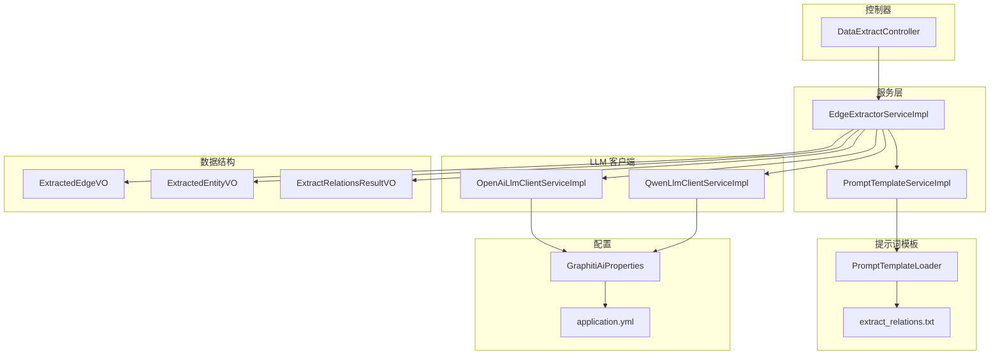
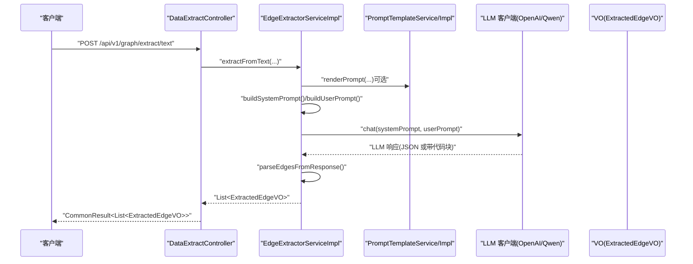
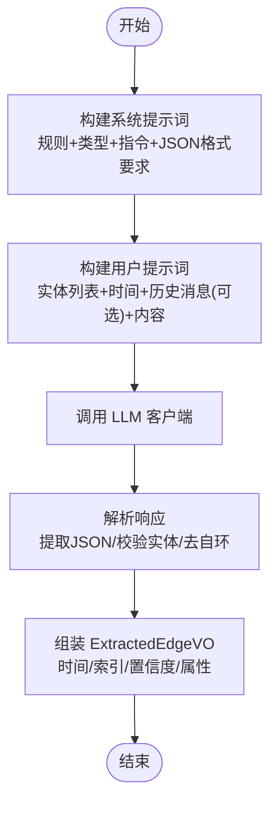
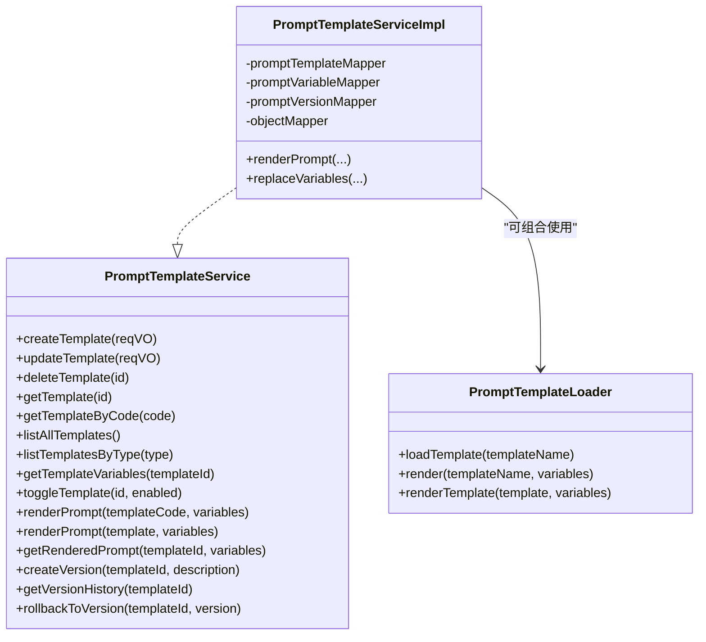
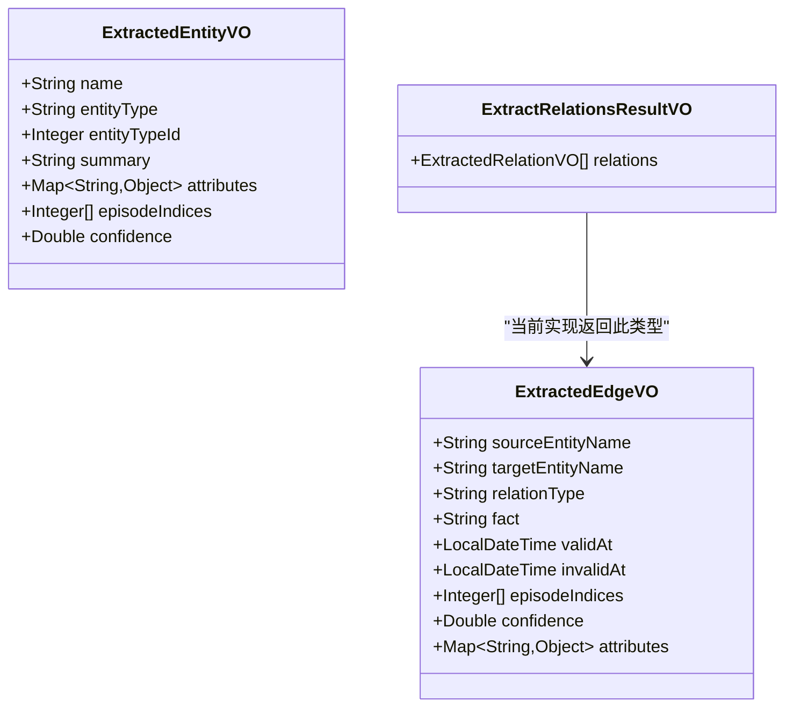
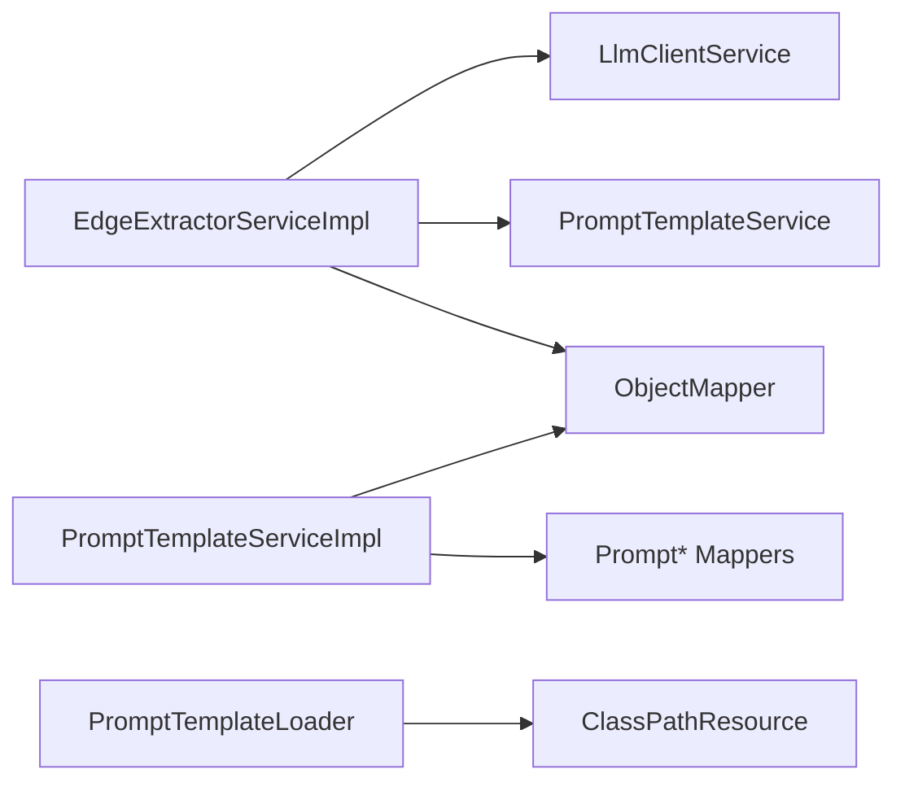

# 关系抽取服务

<!--<cite>
**本文引用的文件**
- [EdgeExtractorServiceImpl.java](file://graphiti-module-core/src/main/java/com/graphiti/module/graphiti/service/impl/EdgeExtractorServiceImpl.java)
- [EdgeExtractorService.java](file://graphiti-module-core/src/main/java/com/graphiti/module/graphiti/service/EdgeExtractorService.java)
- [PromptTemplateService.java](file://graphiti-module-core/src/main/java/com/graphiti/module/graphiti/service/PromptTemplateService.java)
- [PromptTemplateServiceImpl.java](file://graphiti-module-core/src/main/java/com/graphiti/module/graphiti/service/impl/PromptTemplateServiceImpl.java)
- [PromptTemplateLoader.java](file://graphiti-module-core/src/main/java/com/graphiti/module/graphiti/util/PromptTemplateLoader.java)
- [extract_relations.txt](file://graphiti-module-core/src/main/resources/prompts/extract_relations.txt)
- [ExtractedEdgeVO.java](file://graphiti-module-core/src/main/java/com/graphiti/module/graphiti/vo/extractor/ExtractedEdgeVO.java)
- [ExtractedEntityVO.java](file://graphiti-module-core/src/main/java/com/graphiti/module/graphiti/vo/extractor/ExtractedEntityVO.java)
- [ExtractRelationsResultVO.java](file://graphiti-module-core/src/main/java/com/graphiti/module/graphiti/vo/llm/ExtractRelationsResultVO.java)
- [OpenAiLlmClientServiceImpl.java](file://graphiti-module-core/src/main/java/com/graphiti/module/graphiti/service/impl/ai/OpenAiLlmClientServiceImpl.java)
- [QwenLlmClientServiceImpl.java](file://graphiti-module-core/src/main/java/com/graphiti/module/graphiti/service/impl/ai/QwenLlmClientServiceImpl.java)
- [GraphitiAiProperties.java](file://graphiti-module-core/src/main/java/com/graphiti/module/graphiti/config/GraphitiAiProperties.java)
- [DataExtractController.java](file://graphiti-module-core/src/main/java/com/graphiti/module/graphiti/controller/admin/DataExtractController.java)
- [application.yml](file://graphiti-server/src/main/resources/application.yml)
</cite>-->

## 目录
1. [简介](#简介)
2. [项目结构](#项目结构)
3. [核心组件](#核心组件)
4. [架构总览](#架构总览)
5. [详细组件分析](#详细组件分析)
6. [依赖分析](#依赖分析)
7. [性能考虑](#性能考虑)
8. [故障排查指南](#故障排查指南)
9. [结论](#结论)
10. [附录](#附录)

## 简介
本文件面向关系抽取服务的技术实现，围绕 EdgeExtractorServiceImpl 的大语言模型驱动关系抽取算法进行深入解析。内容涵盖文本预处理、提示词工程、模型调用与结果解析流程；说明关系类型分类体系、置信度评估机制与多轮对话优化策略；阐述提取结果的数据结构设计（ExtractedEdgeVO 字段与数据格式规范）；介绍提示词模板的使用与自定义配置（extract_relations.txt 模板编写规范与优化技巧）；并提供性能优化、批量处理与错误恢复机制的实际建议与示例路径。

## 项目结构
关系抽取能力主要由以下模块协同完成：
- 服务层：EdgeExtractorService/Impl 负责关系抽取主流程
- 提示词模板：PromptTemplateService/Impl 与 PromptTemplateLoader 提供模板管理与渲染
- 大语言模型客户端：OpenAiLlmClientServiceImpl、QwenLlmClientServiceImpl 等
- 控制器：DataExtractController 提供对外接口
- VO 类：ExtractedEdgeVO、ExtractedEntityVO、ExtractRelationsResultVO 描述数据结构
- 配置：GraphitiAiProperties、application.yml 提供模型提供商与运行参数

图表来源
- [EdgeExtractorServiceImpl.java:1-362](file://graphiti-module-core/src/main/java/com/graphiti/module/graphiti/service/impl/EdgeExtractorServiceImpl.java#L1-L362)
- [PromptTemplateServiceImpl.java:1-403](file://graphiti-module-core/src/main/java/com/graphiti/module/graphiti/service/impl/PromptTemplateServiceImpl.java#L1-L403)
- [PromptTemplateLoader.java:1-87](file://graphiti-module-core/src/main/java/com/graphiti/module/graphiti/util/PromptTemplateLoader.java#L1-L87)
- [extract_relations.txt:1-33](file://graphiti-module-core/src/main/resources/prompts/extract_relations.txt#L1-L33)
- [OpenAiLlmClientServiceImpl.java:1-111](file://graphiti-module-core/src/main/java/com/graphiti/module/graphiti/service/impl/ai/OpenAiLlmClientServiceImpl.java#L1-L111)
- [QwenLlmClientServiceImpl.java:1-98](file://graphiti-module-core/src/main/java/com/graphiti/module/graphiti/service/impl/ai/QwenLlmClientServiceImpl.java#L1-L98)
- [DataExtractController.java:1-279](file://graphiti-module-core/src/main/java/com/graphiti/module/graphiti/controller/admin/DataExtractController.java#L1-L279)
- [GraphitiAiProperties.java:1-135](file://graphiti-module-core/src/main/java/com/graphiti/module/graphiti/config/GraphitiAiProperties.java#L1-L135)
- [application.yml:1-67](file://graphiti-server/src/main/resources/application.yml#L1-L67)

章节来源
- [EdgeExtractorServiceImpl.java:1-362](file://graphiti-module-core/src/main/java/com/graphiti/module/graphiti/service/impl/EdgeExtractorServiceImpl.java#L1-L362)
- [DataExtractController.java:1-279](file://graphiti-module-core/src/main/java/com/graphiti/module/graphiti/controller/admin/DataExtractController.java#L1-L279)

## 核心组件
- EdgeExtractorService/Impl：关系抽取主流程，负责构建系统提示词与用户提示词、调用 LLM、解析 JSON 结果并输出 ExtractedEdgeVO 列表
- PromptTemplateService/Impl：模板管理与渲染，支持变量替换、版本控制与回滚
- PromptTemplateLoader：从 classpath 加载内置模板，支持变量替换
- LLM 客户端：OpenAI/Qwen 等客户端封装，统一 chat/chatBatch 接口
- VO 类：ExtractedEdgeVO、ExtractedEntityVO、ExtractRelationsResultVO 定义数据结构
- 配置：GraphitiAiProperties 与 application.yml 提供提供商、模型、温度等参数

章节来源
- [EdgeExtractorService.java:1-64](file://graphiti-module-core/src/main/java/com/graphiti/module/graphiti/service/EdgeExtractorService.java#L1-L64)
- [EdgeExtractorServiceImpl.java:1-362](file://graphiti-module-core/src/main/java/com/graphiti/module/graphiti/service/impl/EdgeExtractorServiceImpl.java#L1-L362)
- [PromptTemplateService.java:1-110](file://graphiti-module-core/src/main/java/com/graphiti/module/graphiti/service/PromptTemplateService.java#L1-L110)
- [PromptTemplateServiceImpl.java:1-403](file://graphiti-module-core/src/main/java/com/graphiti/module/graphiti/service/impl/PromptTemplateServiceImpl.java#L1-L403)
- [PromptTemplateLoader.java:1-87](file://graphiti-module-core/src/main/java/com/graphiti/module/graphiti/util/PromptTemplateLoader.java#L1-L87)
- [OpenAiLlmClientServiceImpl.java:1-111](file://graphiti-module-core/src/main/java/com/graphiti/module/graphiti/service/impl/ai/OpenAiLlmClientServiceImpl.java#L1-L111)
- [QwenLlmClientServiceImpl.java:1-98](file://graphiti-module-core/src/main/java/com/graphiti/module/graphiti/service/impl/ai/QwenLlmClientServiceImpl.java#L1-L98)
- [ExtractedEdgeVO.java:1-41](file://graphiti-module-core/src/main/java/com/graphiti/module/graphiti/vo/extractor/ExtractedEdgeVO.java#L1-L41)
- [ExtractedEntityVO.java:1-37](file://graphiti-module-core/src/main/java/com/graphiti/module/graphiti/vo/extractor/ExtractedEntityVO.java#L1-L37)
- [ExtractRelationsResultVO.java:1-23](file://graphiti-module-core/src/main/java/com/graphiti/module/graphiti/vo/llm/ExtractRelationsResultVO.java#L1-L23)
- [GraphitiAiProperties.java:1-135](file://graphiti-module-core/src/main/java/com/graphiti/module/graphiti/config/GraphitiAiProperties.java#L1-L135)
- [application.yml:1-67](file://graphiti-server/src/main/resources/application.yml#L1-L67)

## 架构总览
关系抽取服务采用“提示词工程 + 大语言模型 + 结构化解析”的架构模式。系统通过控制器接收请求，服务层根据输入类型（文本/消息/模板）构建提示词，调用 LLM 客户端获取响应，再解析为结构化结果返回。

图表来源
- [DataExtractController.java:48-58](file://graphiti-module-core/src/main/java/com/graphiti/module/graphiti/controller/admin/DataExtractController.java#L48-L58)
- [EdgeExtractorServiceImpl.java:58-90](file://graphiti-module-core/src/main/java/com/graphiti/module/graphiti/service/impl/EdgeExtractorServiceImpl.java#L58-L90)
- [PromptTemplateServiceImpl.java:213-236](file://graphiti-module-core/src/main/java/com/graphiti/module/graphiti/service/impl/PromptTemplateServiceImpl.java#L213-L236)
- [OpenAiLlmClientServiceImpl.java:41-97](file://graphiti-module-core/src/main/java/com/graphiti/module/graphiti/service/impl/ai/OpenAiLlmClientServiceImpl.java#L41-L97)
- [QwenLlmClientServiceImpl.java:28-84](file://graphiti-module-core/src/main/java/com/graphiti/module/graphiti/service/impl/ai/QwenLlmClientServiceImpl.java#L28-L84)

## 详细组件分析

### EdgeExtractorServiceImpl：关系抽取算法实现
- 文本预处理
  - 构建系统提示词：包含角色设定、提取规则、关系类型定义、自定义指令与 JSON 输出格式约束
  - 构建用户提示词：注入实体列表、参考时间、历史消息（消息模式）、当前内容
  - 模板模式：根据 sourceType 选择 _text/_message/_json 模板，回退到默认模板
- 模型调用
  - 统一通过 LlmClientService.chat(systemPrompt, userPrompt) 发起请求
  - 支持 OpenAI/Qwen 等提供商，可通过配置切换
- 结果解析
  - 从响应中提取 JSON（优先查找代码块，其次查找首尾花括号）
  - 校验实体名称一致性（不区分大小写），过滤自环关系
  - 解析时间字段、episode_indices、confidence 与扩展 attributes
  - 输出 ExtractedEdgeVO 列表

图表来源
- [EdgeExtractorServiceImpl.java:128-227](file://graphiti-module-core/src/main/java/com/graphiti/module/graphiti/service/impl/EdgeExtractorServiceImpl.java#L128-L227)
- [EdgeExtractorServiceImpl.java:231-360](file://graphiti-module-core/src/main/java/com/graphiti/module/graphiti/service/impl/EdgeExtractorServiceImpl.java#L231-L360)

章节来源
- [EdgeExtractorServiceImpl.java:58-124](file://graphiti-module-core/src/main/java/com/graphiti/module/graphiti/service/impl/EdgeExtractorServiceImpl.java#L58-L124)
- [EdgeExtractorServiceImpl.java:128-227](file://graphiti-module-core/src/main/java/com/graphiti/module/graphiti/service/impl/EdgeExtractorServiceImpl.java#L128-L227)
- [EdgeExtractorServiceImpl.java:231-360](file://graphiti-module-core/src/main/java/com/graphiti/module/graphiti/service/impl/EdgeExtractorServiceImpl.java#L231-L360)

### 关系类型分类体系
- 默认关系类型：提供常见关系类型清单（SCREAMING_SNAKE_CASE 格式），如 WORKS_AT、LIVES_IN、KNOWS、PARTICIPATES_IN、OWNS、LOCATED_IN、RELATED_TO、CREATED_BY、BELONGS_TO、MARRIED_TO、PARENT_OF、SIBLING_OF、FRIEND_OF
- 自定义类型：通过 edgeTypesConfig 注入，系统提示词会合并显示，确保抽取时遵循统一命名与语义
- 类型约束：抽取结果 relation_type 必须匹配定义集合，否则会被过滤

章节来源
- [EdgeExtractorServiceImpl.java:36-54](file://graphiti-module-core/src/main/java/com/graphiti/module/graphiti/service/impl/EdgeExtractorServiceImpl.java#L36-L54)

### 置信度评估机制
- confidence 字段：从响应 JSON 中提取数值型置信度，若缺失则为 null
- 评估建议：可在提示词中增加“给出置信度分数（0-1）”的要求，或通过多轮验证提升稳定性
- 注意：当前实现未内置置信度阈值过滤逻辑，建议在上层业务中按需过滤低置信度边

章节来源
- [EdgeExtractorServiceImpl.java:308-313](file://graphiti-module-core/src/main/java/com/graphiti/module/graphiti/service/impl/EdgeExtractorServiceImpl.java#L308-L313)
- [EdgeExtractorServiceImpl.java:267-268](file://graphiti-module-core/src/main/java/com/graphiti/module/graphiti/service/impl/EdgeExtractorServiceImpl.java#L267-L268)

### 多轮对话优化策略
- 历史消息注入：消息模式下将 previousEpisodes 序列化为用户提示词的一部分，帮助模型理解上下文
- 时间参考：referenceTime 用于解析相对时间（如“昨天”、“下个月”），提升时间维度准确性
- episode_indices：记录关系来源的 episode 索引，便于溯源与增量更新

章节来源
- [EdgeExtractorServiceImpl.java:75-89](file://graphiti-module-core/src/main/java/com/graphiti/module/graphiti/service/impl/EdgeExtractorServiceImpl.java#L75-L89)
- [EdgeExtractorServiceImpl.java:184-210](file://graphiti-module-core/src/main/java/com/graphiti/module/graphiti/service/impl/EdgeExtractorServiceImpl.java#L184-L210)

### 提示词工程与模板系统
- PromptTemplateService/Impl
  - 支持模板 CRUD、变量管理、版本控制与回滚
  - 渲染时使用正则替换变量占位符，返回 RenderedPrompt（systemPrompt、userPrompt、responseFormat、model）
- PromptTemplateLoader
  - 从 classpath 加载内置模板（如 extract_relations.txt），支持变量替换
- extract_relations.txt
  - 定义关系抽取的 JSON 输出格式、约束与示例，作为模板渲染的基础
- 模板选择策略
  - 根据 sourceType 选择 _text/_message/_json 后缀模板，若不存在则回退到默认模板

图表来源
- [PromptTemplateService.java:1-110](file://graphiti-module-core/src/main/java/com/graphiti/module/graphiti/service/PromptTemplateService.java#L1-L110)
- [PromptTemplateServiceImpl.java:1-403](file://graphiti-module-core/src/main/java/com/graphiti/module/graphiti/service/impl/PromptTemplateServiceImpl.java#L1-L403)
- [PromptTemplateLoader.java:1-87](file://graphiti-module-core/src/main/java/com/graphiti/module/graphiti/util/PromptTemplateLoader.java#L1-L87)

章节来源
- [PromptTemplateService.java:1-110](file://graphiti-module-core/src/main/java/com/graphiti/module/graphiti/service/PromptTemplateService.java#L1-L110)
- [PromptTemplateServiceImpl.java:213-236](file://graphiti-module-core/src/main/java/com/graphiti/module/graphiti/service/impl/PromptTemplateServiceImpl.java#L213-L236)
- [PromptTemplateLoader.java:28-73](file://graphiti-module-core/src/main/java/com/graphiti/module/graphiti/util/PromptTemplateLoader.java#L28-L73)
- [extract_relations.txt:1-33](file://graphiti-module-core/src/main/resources/prompts/extract_relations.txt#L1-L33)

### 提示词模板编写规范与优化技巧
- 输出格式约束：严格要求 JSON 结构，明确 edges 数组与字段定义
- 实体一致性：要求 source/target 必须来自实体列表，避免虚构关系
- 示例引导：提供输入输出示例，增强模型对任务的理解
- 变量替换：使用 {{variable}} 占位符，渲染时按需替换
- 优化建议：
  - 明确关系类型边界，减少歧义
  - 在提示词中加入“只提取文本中明确表达的关系”等约束
  - 对复杂场景分步提示，降低一次性生成的难度

章节来源
- [extract_relations.txt:1-33](file://graphiti-module-core/src/main/resources/prompts/extract_relations.txt#L1-L33)
- [PromptTemplateServiceImpl.java:241-260](file://graphiti-module-core/src/main/java/com/graphiti/module/graphiti/service/impl/PromptTemplateServiceImpl.java#L241-L260)

### 提取结果的数据结构设计
- ExtractedEdgeVO 字段定义
  - sourceEntityName、targetEntityName：源/目标实体名称（保留原始大小写）
  - relationType：关系类型（SCREAMING_SNAKE_CASE）
  - fact：事实描述
  - validAt、invalidAt：生效/失效时间（ISO 8601）
  - episodeIndices：来源 episode 索引列表，默认 [0]
  - confidence：置信度（数值，可空）
  - attributes：扩展属性键值对
- ExtractedEntityVO 字段定义（用于实体上下文）
  - name、entityType、entityTypeId、summary、attributes、episodeIndices、confidence
- ExtractRelationsResultVO
  - relations：List<ExtractedRelationVO>（注：当前实现返回 ExtractedEdgeVO 列表）

图表来源
- [ExtractedEdgeVO.java:1-41](file://graphiti-module-core/src/main/java/com/graphiti/module/graphiti/vo/extractor/ExtractedEdgeVO.java#L1-L41)
- [ExtractedEntityVO.java:1-37](file://graphiti-module-core/src/main/java/com/graphiti/module/graphiti/vo/extractor/ExtractedEntityVO.java#L1-L37)
- [ExtractRelationsResultVO.java:1-23](file://graphiti-module-core/src/main/java/com/graphiti/module/graphiti/vo/llm/ExtractRelationsResultVO.java#L1-L23)

章节来源
- [ExtractedEdgeVO.java:12-40](file://graphiti-module-core/src/main/java/com/graphiti/module/graphiti/vo/extractor/ExtractedEdgeVO.java#L12-L40)
- [ExtractedEntityVO.java:14-36](file://graphiti-module-core/src/main/java/com/graphiti/module/graphiti/vo/extractor/ExtractedEntityVO.java#L14-L36)
- [ExtractRelationsResultVO.java:18-22](file://graphiti-module-core/src/main/java/com/graphiti/module/graphiti/vo/llm/ExtractRelationsResultVO.java#L18-L22)

### LLM 客户端与配置
- OpenAiLlmClientServiceImpl：封装 OpenAI 兼容 API，支持私有化部署（base-url），提供 chat/chatBatch 与结构化输出
- QwenLlmClientServiceImpl：通过 OpenAI 兼容 API 调用通义千问
- GraphitiAiProperties：集中管理 llmProvider、embeddingProvider、rerankProvider 与各提供商的模型、温度、maxTokens 等参数
- application.yml：激活 dev 环境，设置 JWT、日志级别与 Spring AI 配置入口

章节来源
- [OpenAiLlmClientServiceImpl.java:36-110](file://graphiti-module-core/src/main/java/com/graphiti/module/graphiti/service/impl/ai/OpenAiLlmClientServiceImpl.java#L36-L110)
- [QwenLlmClientServiceImpl.java:23-97](file://graphiti-module-core/src/main/java/com/graphiti/module/graphiti/service/impl/ai/QwenLlmClientServiceImpl.java#L23-L97)
- [GraphitiAiProperties.java:16-135](file://graphiti-module-core/src/main/java/com/graphiti/module/graphiti/config/GraphitiAiProperties.java#L16-L135)
- [application.yml:25-34](file://graphiti-server/src/main/resources/application.yml#L25-L34)

## 依赖分析
- 组件耦合
  - EdgeExtractorServiceImpl 依赖 LlmClientService、PromptTemplateService、ObjectMapper
  - PromptTemplateServiceImpl 依赖 Mapper 与 ObjectMapper，提供模板 CRUD、变量替换与版本管理
  - PromptTemplateLoader 依赖 ClassPathResource，提供内置模板加载与变量替换
- 外部依赖
  - Spring AI ChatClient 用于与 LLM 交互
  - Jackson ObjectMapper 用于 JSON 解析与序列化
- 潜在循环依赖
  - 未发现直接循环依赖；服务间通过接口解耦

图表来源
- [EdgeExtractorServiceImpl.java:28-30](file://graphiti-module-core/src/main/java/com/graphiti/module/graphiti/service/impl/EdgeExtractorServiceImpl.java#L28-L30)
- [PromptTemplateServiceImpl.java:36-39](file://graphiti-module-core/src/main/java/com/graphiti/module/graphiti/service/impl/PromptTemplateServiceImpl.java#L36-L39)
- [PromptTemplateLoader.java:30-41](file://graphiti-module-core/src/main/java/com/graphiti/module/graphiti/util/PromptTemplateLoader.java#L30-L41)

章节来源
- [EdgeExtractorServiceImpl.java:1-362](file://graphiti-module-core/src/main/java/com/graphiti/module/graphiti/service/impl/EdgeExtractorServiceImpl.java#L1-L362)
- [PromptTemplateServiceImpl.java:1-403](file://graphiti-module-core/src/main/java/com/graphiti/module/graphiti/service/impl/PromptTemplateServiceImpl.java#L1-L403)

## 性能考虑
- 批量处理策略
  - LLM 客户端提供 chatBatch 接口，可将多个提示词并行提交（取决于底层实现与并发限制）
  - 建议将同一批次内的实体与上下文合并，减少重复提示词传输
- 结果解析优化
  - 优先匹配代码块 JSON，其次匹配首尾花括号，避免多余字符串扫描
  - 实体名称映射使用 HashMap，解析阶段按需构建，注意内存占用
- 模板渲染优化
  - PromptTemplateServiceImpl 使用正则替换变量，变量较多时建议缓存渲染结果或复用模板对象
- 错误恢复机制
  - 解析失败时记录警告日志并返回空列表或部分结果
  - 模板渲染异常时自动回退到默认模板，保证可用性
- 配置优化
  - GraphitiAiProperties 中可调整温度与 maxTokens，平衡质量与成本
  - application.yml 中可启用更详细的日志以便定位问题

章节来源
- [OpenAiLlmClientServiceImpl.java:100-104](file://graphiti-module-core/src/main/java/com/graphiti/module/graphiti/service/impl/ai/OpenAiLlmClientServiceImpl.java#L100-L104)
- [EdgeExtractorServiceImpl.java:341-360](file://graphiti-module-core/src/main/java/com/graphiti/module/graphiti/service/impl/EdgeExtractorServiceImpl.java#L341-L360)
- [PromptTemplateServiceImpl.java:241-260](file://graphiti-module-core/src/main/java/com/graphiti/module/graphiti/service/impl/PromptTemplateServiceImpl.java#L241-L260)
- [GraphitiAiProperties.java:115-122](file://graphiti-module-core/src/main/java/com/graphiti/module/graphiti/config/GraphitiAiProperties.java#L115-L122)
- [application.yml:36-41](file://graphiti-server/src/main/resources/application.yml#L36-L41)

## 故障排查指南
- 提示词未正确渲染
  - 检查模板是否存在与变量是否齐全；确认 PromptTemplateServiceImpl 的变量替换逻辑
  - 参考路径：[PromptTemplateServiceImpl.java:241-260](file://graphiti-module-core/src/main/java/com/graphiti/module/graphiti/service/impl/PromptTemplateServiceImpl.java#L241-L260)
- LLM 返回非 JSON 或代码块
  - 确认系统提示词要求严格 JSON 输出；解析函数会尝试提取代码块与普通 JSON
  - 参考路径：[EdgeExtractorServiceImpl.java:341-360](file://graphiti-module-core/src/main/java/com/graphiti/module/graphiti/service/impl/EdgeExtractorServiceImpl.java#L341-L360)
- 实体名称不一致导致被过滤
  - 核对实体列表与提示词中的名称一致性（大小写不敏感映射）
  - 参考路径：[EdgeExtractorServiceImpl.java:234-259](file://graphiti-module-core/src/main/java/com/graphiti/module/graphiti/service/impl/EdgeExtractorServiceImpl.java#L234-L259)
- 置信度缺失
  - 在提示词中显式要求输出 confidence 字段；当前实现仅解析数值型置信度
  - 参考路径：[EdgeExtractorServiceImpl.java:308-313](file://graphiti-module-core/src/main/java/com/graphiti/module/graphiti/service/impl/EdgeExtractorServiceImpl.java#L308-L313)
- 模板回退失败
  - 若带后缀模板不存在，系统会回退到默认模板；检查模板编码与后缀拼接逻辑
  - 参考路径：[EdgeExtractorServiceImpl.java:114-120](file://graphiti-module-core/src/main/java/com/graphiti/module/graphiti/service/impl/EdgeExtractorServiceImpl.java#L114-L120)

章节来源
- [PromptTemplateServiceImpl.java:241-260](file://graphiti-module-core/src/main/java/com/graphiti/module/graphiti/service/impl/PromptTemplateServiceImpl.java#L241-L260)
- [EdgeExtractorServiceImpl.java:234-259](file://graphiti-module-core/src/main/java/com/graphiti/module/graphiti/service/impl/EdgeExtractorServiceImpl.java#L234-L259)
- [EdgeExtractorServiceImpl.java:308-313](file://graphiti-module-core/src/main/java/com/graphiti/module/graphiti/service/impl/EdgeExtractorServiceImpl.java#L308-L313)
- [EdgeExtractorServiceImpl.java:114-120](file://graphiti-module-core/src/main/java/com/graphiti/module/graphiti/service/impl/EdgeExtractorServiceImpl.java#L114-L120)

## 结论
EdgeExtractorServiceImpl 通过严谨的提示词工程与结构化解析，实现了稳定的关系抽取能力。结合模板系统与多轮上下文，能够适配文本与消息等多种输入形式。建议在生产环境中强化提示词约束、引入置信度阈值过滤与多轮验证，并结合批量处理与缓存策略进一步提升吞吐与稳定性。

## 附录
- 对外接口示例路径
  - 文本抽取：[DataExtractController.java:48-58](file://graphiti-module-core/src/main/java/com/graphiti/module/graphiti/controller/admin/DataExtractController.java#L48-L58)
  - 仅实体抽取：[DataExtractController.java:103-114](file://graphiti-module-core/src/main/java/com/graphiti/module/graphiti/controller/admin/DataExtractController.java#L103-L114)
  - 仅关系抽取：[DataExtractController.java:119-136](file://graphiti-module-core/src/main/java/com/graphiti/module/graphiti/controller/admin/DataExtractController.java#L119-L136)
- 默认关系类型清单：[EdgeExtractorServiceImpl.java:36-54](file://graphiti-module-core/src/main/java/com/graphiti/module/graphiti/service/impl/EdgeExtractorServiceImpl.java#L36-L54)
- 提示词模板示例：[extract_relations.txt:1-33](file://graphiti-module-core/src/main/resources/prompts/extract_relations.txt#L1-L33)
- LLM 客户端配置：[GraphitiAiProperties.java:16-135](file://graphiti-module-core/src/main/java/com/graphiti/module/graphiti/config/GraphitiAiProperties.java#L16-L135)，[application.yml:25-34](file://graphiti-server/src/main/resources/application.yml#L25-L34)