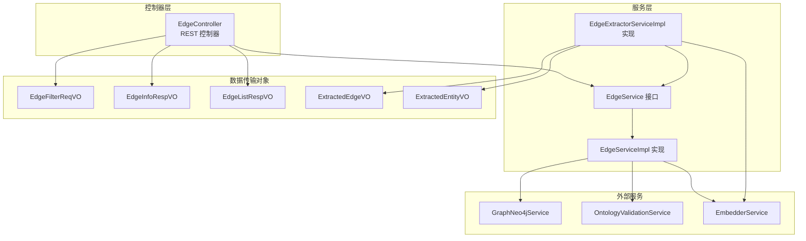
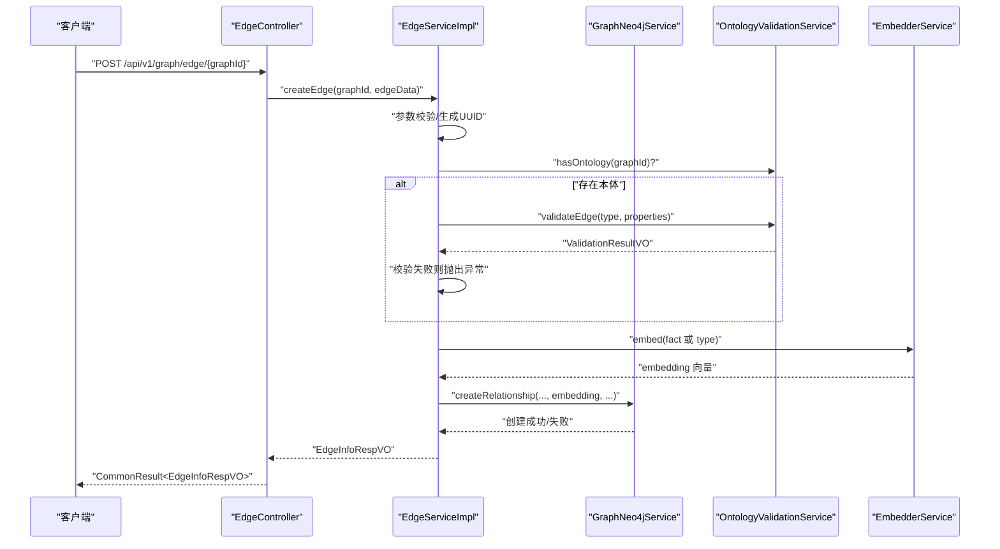
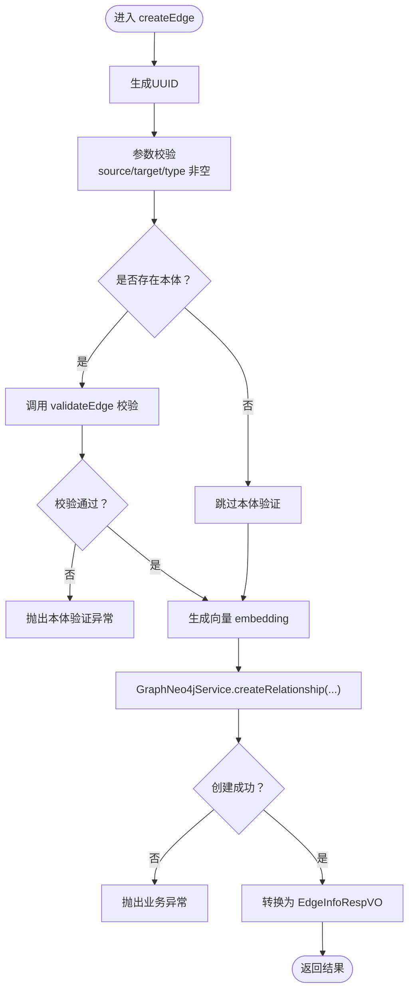
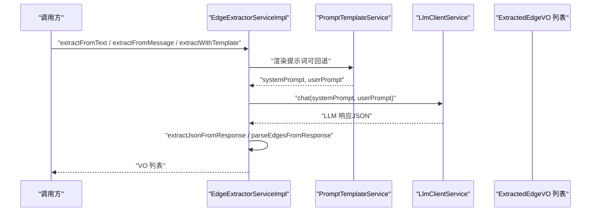
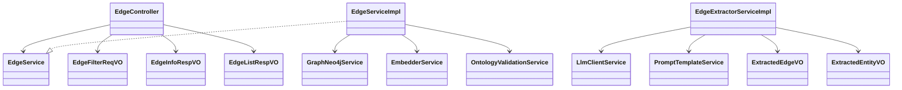

# 关系管理

<!--<cite>
**本文引用的文件**
- [EdgeController.java](file://ontograph-module-core/src/main/java/com/raphiti/module/graphiti/controller/admin/EdgeController.java)
- [EdgeService.java](file://ontograph-module-core/src/main/java/com/raphiti/module/graphiti/service/EdgeService.java)
- [EdgeServiceImpl.java](file://ontograph-module-core/src/main/java/com/raphiti/module/graphiti/service/impl/EdgeServiceImpl.java)
- [EdgeFilterReqVO.java](file://ontograph-module-core/src/main/java/com/raphiti/module/graphiti/vo/edge/EdgeFilterReqVO.java)
- [EdgeInfoRespVO.java](file://ontograph-module-core/src/main/java/com/raphiti/module/graphiti/vo/edge/EdgeInfoRespVO.java)
- [EdgeListRespVO.java](file://ontograph-module-core/src/main/java/com/raphiti/module/graphiti/vo/edge/EdgeListRespVO.java)
- [EdgeExtractorServiceImpl.java](file://ontograph-module-core/src/main/java/com/raphiti/module/graphiti/service/impl/EdgeExtractorServiceImpl.java)
- [ExtractedEdgeVO.java](file://ontograph-module-core/src/main/java/com/raphiti/module/graphiti/vo/extractor/ExtractedEdgeVO.java)
- [ExtractedEntityVO.java](file://ontograph-module-core/src/main/java/com/raphiti/module/graphiti/vo/extractor/ExtractedEntityVO.java)
- [EdgeServiceImplTest.java](file://ontograph-module-core/src/test/java/com/raphiti/module/graphiti/service/EdgeServiceImplTest.java)
</cite>-->

## 目录
1. [简介](#简介)
2. [项目结构](#项目结构)
3. [核心组件](#核心组件)
4. [架构总览](#架构总览)
5. [详细组件分析](#详细组件分析)
6. [依赖分析](#依赖分析)
7. [性能考虑](#性能考虑)
8. [故障排查指南](#故障排查指南)
9. [结论](#结论)
10. [附录](#附录)

## 简介
本文件聚焦“关系管理”能力，围绕以下主题展开：
- EdgeController 中关系 CRUD 的完整实现与 API 定义
- 关系抽取服务（EdgeExtractorServiceImpl）的 AI 驱动识别流程、关系类型与置信度处理
- 关系去重与合并策略（基于现有实体去重服务的复用思路）
- 关系验证与约束校验（本体验证、循环依赖检测现状与建议）
- 完整 API 文档、数据模型、索引策略与性能优化方案
- 关系质量控制、批量处理策略与错误恢复机制

## 项目结构
关系管理相关代码主要分布在模块 core 的 controller、service、vo 三层，并通过 GraphNeo4jService 与 Neo4j 图数据库交互。

图表来源
- [EdgeController.java:1-91](file://ontograph-module-core/src/main/java/com/raphiti/module/graphiti/controller/admin/EdgeController.java#L1-L91)
- [EdgeService.java:1-61](file://ontograph-module-core/src/main/java/com/raphiti/module/graphiti/service/EdgeService.java#L1-L61)
- [EdgeServiceImpl.java:1-172](file://ontograph-module-core/src/main/java/com/raphiti/module/graphiti/service/impl/EdgeServiceImpl.java#L1-L172)
- [EdgeExtractorServiceImpl.java:1-362](file://ontograph-module-core/src/main/java/com/raphiti/module/graphiti/service/impl/EdgeExtractorServiceImpl.java#L1-L362)
- [EdgeFilterReqVO.java:1-38](file://ontograph-module-core/src/main/java/com/raphiti/module/graphiti/vo/edge/EdgeFilterReqVO.java#L1-L38)
- [EdgeInfoRespVO.java:1-70](file://ontograph-module-core/src/main/java/com/raphiti/module/graphiti/vo/edge/EdgeInfoRespVO.java#L1-L70)
- [EdgeListRespVO.java:1-70](file://ontograph-module-core/src/main/java/com/raphiti/module/graphiti/vo/edge/EdgeListRespVO.java#L1-L70)
- [ExtractedEdgeVO.java:1-41](file://ontograph-module-core/src/main/java/com/raphiti/module/graphiti/vo/extractor/ExtractedEdgeVO.java#L1-L41)
- [ExtractedEntityVO.java:1-37](file://ontograph-module-core/src/main/java/com/raphiti/module/graphiti/vo/extractor/ExtractedEntityVO.java#L1-L37)

章节来源
- [EdgeController.java:1-91](file://ontograph-module-core/src/main/java/com/raphiti/module/graphiti/controller/admin/EdgeController.java#L1-L91)
- [EdgeService.java:1-61](file://ontograph-module-core/src/main/java/com/raphiti/module/graphiti/service/EdgeService.java#L1-L61)
- [EdgeServiceImpl.java:1-172](file://ontograph-module-core/src/main/java/com/raphiti/module/graphiti/service/impl/EdgeServiceImpl.java#L1-L172)

## 核心组件
- EdgeController：提供关系 CRUD 与查询接口，统一返回 CommonResult 包裹的 VO 结构
- EdgeService：定义关系管理的业务契约（列表、详情、创建、更新、删除、双向查询）
- EdgeServiceImpl：实现关系 CRUD 与验证、嵌入向量生成、Neo4j 交互
- EdgeExtractorServiceImpl：AI 驱动的关系抽取实现，支持文本/消息/模板三种输入模式
- VO 层：EdgeFilterReqVO、EdgeInfoRespVO、EdgeListRespVO、ExtractedEdgeVO、ExtractedEntityVO

章节来源
- [EdgeController.java:1-91](file://ontograph-module-core/src/main/java/com/raphiti/module/graphiti/controller/admin/EdgeController.java#L1-L91)
- [EdgeService.java:1-61](file://ontograph-module-core/src/main/java/com/raphiti/module/graphiti/service/EdgeService.java#L1-L61)
- [EdgeServiceImpl.java:1-172](file://ontograph-module-core/src/main/java/com/raphiti/module/graphiti/service/impl/EdgeServiceImpl.java#L1-L172)
- [EdgeExtractorServiceImpl.java:1-362](file://ontograph-module-core/src/main/java/com/raphiti/module/graphiti/service/impl/EdgeExtractorServiceImpl.java#L1-L362)
- [EdgeFilterReqVO.java:1-38](file://ontograph-module-core/src/main/java/com/raphiti/module/graphiti/vo/edge/EdgeFilterReqVO.java#L1-L38)
- [EdgeInfoRespVO.java:1-70](file://ontograph-module-core/src/main/java/com/raphiti/module/graphiti/vo/edge/EdgeInfoRespVO.java#L1-L70)
- [EdgeListRespVO.java:1-70](file://ontograph-module-core/src/main/java/com/raphiti/module/graphiti/vo/edge/EdgeListRespVO.java#L1-L70)
- [ExtractedEdgeVO.java:1-41](file://ontograph-module-core/src/main/java/com/raphiti/module/graphiti/vo/extractor/ExtractedEdgeVO.java#L1-L41)
- [ExtractedEntityVO.java:1-37](file://ontograph-module-core/src/main/java/com/raphiti/module/graphiti/vo/extractor/ExtractedEntityVO.java#L1-L37)

## 架构总览
关系管理采用“控制器-服务-数据访问”的分层架构，服务层通过 GraphNeo4jService 与 Neo4j 交互；在创建关系时，若存在本体约束，则调用 OntologyValidationService 进行合法性校验；同时利用 EmbedderService 生成向量用于后续检索与相似度计算。

图表来源
- [EdgeController.java:53-60](file://ontograph-module-core/src/main/java/com/raphiti/module/graphiti/controller/admin/EdgeController.java#L53-L60)
- [EdgeServiceImpl.java:61-102](file://ontograph-module-core/src/main/java/com/raphiti/module/graphiti/service/impl/EdgeServiceImpl.java#L61-L102)
- [EdgeService.java:29-51](file://ontograph-module-core/src/main/java/com/raphiti/module/graphiti/service/EdgeService.java#L29-L51)

## 详细组件分析

### EdgeController：关系 CRUD 与查询
- 列表查询：支持按 type/source/target 过滤与分页（skip/limit），返回 EdgeListRespVO 列表
- 详情查询：按 edgeUuid 返回 EdgeInfoRespVO
- 创建关系：接收 Map<String,Object>，返回 EdgeInfoRespVO
- 更新关系：预留接口，当前抛出待实现异常
- 删除关系：按 edgeUuid 删除
- 双向查询：查询两节点间的所有边（双向）

章节来源
- [EdgeController.java:33-90](file://ontograph-module-core/src/main/java/com/raphiti/module/graphiti/controller/admin/EdgeController.java#L33-L90)
- [EdgeFilterReqVO.java:10-37](file://ontograph-module-core/src/main/java/com/raphiti/module/graphiti/vo/edge/EdgeFilterReqVO.java#L10-L37)
- [EdgeInfoRespVO.java:12-69](file://ontograph-module-core/src/main/java/com/raphiti/module/graphiti/vo/edge/EdgeInfoRespVO.java#L12-L69)
- [EdgeListRespVO.java:12-69](file://ontograph-module-core/src/main/java/com/raphiti/module/graphiti/vo/edge/EdgeListRespVO.java#L12-L69)

### EdgeService 与 EdgeServiceImpl：关系 CRUD 实现
- listEdges：调用 GraphNeo4jService 执行分页查询，转换为 EdgeListRespVO
- getEdgeDetail：按 UUID 查询，不存在则抛业务异常
- createEdge：参数校验、本体验证、向量嵌入、Neo4j 创建、结果转换
- updateEdge：当前抛出待实现异常（TODO）
- deleteEdge：调用 GraphNeo4jService 删除
- getEdgesBetweenNodes：查询两节点间所有边（双向）

图表来源
- [EdgeServiceImpl.java:61-102](file://ontograph-module-core/src/main/java/com/raphiti/module/graphiti/service/impl/EdgeServiceImpl.java#L61-L102)

章节来源
- [EdgeService.java:12-60](file://ontograph-module-core/src/main/java/com/raphiti/module/graphiti/service/EdgeService.java#L12-L60)
- [EdgeServiceImpl.java:31-124](file://ontograph-module-core/src/main/java/com/raphiti/module/graphiti/service/impl/EdgeServiceImpl.java#L31-L124)

### EdgeExtractorServiceImpl：AI 驱动关系抽取
- 默认关系类型：提供常见关系类型清单（SCREAMING_SNAKE_CASE）
- 输入模式：
  - 文本抽取：extractFromText(content, entities, referenceTime, edgeTypesConfig, customInstructions)
  - 消息抽取：extractFromMessage(content, entities, previousEpisodes, referenceTime, edgeTypesConfig, customInstructions)
  - 模板抽取：extractWithTemplate(content, entities, sourceType, templateCode, variables)
- 提示词构建：buildSystemPrompt、buildTextUserPrompt、buildMessageUserPrompt
- 响应解析：parseEdgesFromResponse，支持 JSON 代码块与普通 JSON 对象提取，实体名大小写不敏感匹配，跳过自环，解析 valid_at/invalid_at、episode_indices、confidence、attributes
- 时间解析与序列化：extractJsonFromResponse、serializeEntities、parseDateTime

图表来源
- [EdgeExtractorServiceImpl.java:58-124](file://ontograph-module-core/src/main/java/com/raphiti/module/graphiti/service/impl/EdgeExtractorServiceImpl.java#L58-L124)
- [EdgeExtractorServiceImpl.java:231-282](file://ontograph-module-core/src/main/java/com/raphiti/module/graphiti/service/impl/EdgeExtractorServiceImpl.java#L231-L282)

章节来源
- [EdgeExtractorServiceImpl.java:34-54](file://ontograph-module-core/src/main/java/com/raphiti/module/graphiti/service/impl/EdgeExtractorServiceImpl.java#L34-L54)
- [EdgeExtractorServiceImpl.java:58-89](file://ontograph-module-core/src/main/java/com/raphiti/module/graphiti/service/impl/EdgeExtractorServiceImpl.java#L58-L89)
- [EdgeExtractorServiceImpl.java:93-124](file://ontograph-module-core/src/main/java/com/raphiti/module/graphiti/service/impl/EdgeExtractorServiceImpl.java#L93-L124)
- [EdgeExtractorServiceImpl.java:128-227](file://ontograph-module-core/src/main/java/com/raphiti/module/graphiti/service/impl/EdgeExtractorServiceImpl.java#L128-L227)
- [EdgeExtractorServiceImpl.java:231-360](file://ontograph-module-core/src/main/java/com/raphiti/module/graphiti/service/impl/EdgeExtractorServiceImpl.java#L231-L360)
- [ExtractedEdgeVO.java:12-40](file://ontograph-module-core/src/main/java/com/raphiti/module/graphiti/vo/extractor/ExtractedEdgeVO.java#L12-L40)
- [ExtractedEntityVO.java:14-36](file://ontograph-module-core/src/main/java/com/raphiti/module/graphiti/vo/extractor/ExtractedEntityVO.java#L14-L36)

### 关系去重与合并（EntityDedupServiceImpl 复用思路）
- 当前仓库未提供独立的 EdgeDedupServiceImpl，但可复用实体去重服务的策略思想：
  - 基于实体名规范化与近似匹配（如最小哈希 LSH、编辑距离）
  - 对关系三元组（source, relation_type, target）进行相似度评分
  - 冲突解决：保留高置信度、最新时间窗口内的关系；对歧义关系触发人工确认
- 建议在 EdgeServiceImpl 之前引入去重阶段，减少重复边入库

（本节为概念性设计，不直接分析具体文件）

### 关系验证与约束
- 本体验证：当图谱存在本体时，创建关系前调用 validateEdge，失败抛出 OntologyValidationException
- 参数校验：source/target/type 非空校验
- 循环依赖检测：当前未在关系层实现，可在查询路径或导入阶段增加检测（建议）

章节来源
- [EdgeServiceImpl.java:82-87](file://ontograph-module-core/src/main/java/com/raphiti/module/graphiti/service/impl/EdgeServiceImpl.java#L82-L87)
- [EdgeServiceImplTest.java:1490-1516](file://ontograph-module-core/src/test/java/com/raphiti/module/graphiti/service/EdgeServiceImplTest.java#L1490-L1516)

## 依赖分析
- EdgeController 依赖 EdgeService
- EdgeServiceImpl 依赖 GraphNeo4jService、EmbedderService、OntologyValidationService
- EdgeExtractorServiceImpl 依赖 LlmClientService、PromptTemplateService、ObjectMapper
- VO 层仅作为数据载体，无复杂依赖

图表来源
- [EdgeController.java:1-91](file://ontograph-module-core/src/main/java/com/raphiti/module/graphiti/controller/admin/EdgeController.java#L1-L91)
- [EdgeService.java:1-61](file://ontograph-module-core/src/main/java/com/raphiti/module/graphiti/service/EdgeService.java#L1-L61)
- [EdgeServiceImpl.java:1-172](file://ontograph-module-core/src/main/java/com/raphiti/module/graphiti/service/impl/EdgeServiceImpl.java#L1-L172)
- [EdgeExtractorServiceImpl.java:1-362](file://ontograph-module-core/src/main/java/com/raphiti/module/graphiti/service/impl/EdgeExtractorServiceImpl.java#L1-L362)

## 性能考虑
- 分页查询：listEdges 使用 skip/limit，建议结合索引与游标分页优化
- 向量检索：创建关系时生成 embedding，建议在 Neo4j 中建立向量索引以加速相似关系检索
- 批量导入：建议将多条关系合并为事务提交，减少网络往返
- 缓存策略：热点关系的读取可引入 Redis 缓存（需注意一致性）
- 日志与监控：对 LLM 调用耗时、本体验证耗时、Neo4j 写入耗时进行埋点

（本节为通用性能建议，不直接分析具体文件）

## 故障排查指南
- 创建关系失败：检查 source/target/type 是否为空；查看本体验证是否通过；确认向量生成是否成功
- 本体验证异常：根据 ValidationResultVO 中的错误信息修正关系类型或属性
- LLM 响应解析失败：确认提示词输出为标准 JSON；检查 extractJsonFromResponse 的容错逻辑
- 删除关系日志：关注删除操作的日志记录，确保幂等性

章节来源
- [EdgeServiceImpl.java:72-101](file://ontograph-module-core/src/main/java/com/raphiti/module/graphiti/service/impl/EdgeServiceImpl.java#L72-L101)
- [EdgeServiceImplTest.java:1504-1516](file://ontograph-module-core/src/test/java/com/raphiti/module/graphiti/service/EdgeServiceImplTest.java#L1504-L1516)
- [EdgeExtractorServiceImpl.java:277-281](file://ontograph-module-core/src/main/java/com/raphiti/module/graphiti/service/impl/EdgeExtractorServiceImpl.java#L277-L281)

## 结论
本关系管理子系统提供了完整的 REST API 与服务实现，覆盖关系 CRUD、查询与 AI 驱动抽取。在创建环节集成本体验证与向量嵌入，为后续检索与推理奠定基础。当前更新接口处于预留状态，建议尽快补齐；同时建议引入独立的关系去重服务与循环依赖检测，提升图谱质量与稳定性。

## 附录

### API 文档（EdgeController）
- 获取边列表
  - 方法：POST
  - 路径：/api/v1/graph/edge/list/{graphId}
  - 请求体：EdgeFilterReqVO（type、source、target、skip、limit）
  - 响应：CommonResult<List<EdgeListRespVO>>
- 获取边详情
  - 方法：GET
  - 路径：/api/v1/graph/edge/{graphId}/{edgeUuid}
  - 响应：CommonResult<EdgeInfoRespVO>
- 创建边
  - 方法：POST
  - 路径：/api/v1/graph/edge/{graphId}
  - 请求体：Map<String,Object>（包含 source、target、type、fact、properties 等）
  - 响应：CommonResult<EdgeInfoRespVO>
- 更新边
  - 方法：PUT
  - 路径：/api/v1/graph/edge/{graphId}/{edgeUuid}
  - 请求体：Map<String,Object>
  - 响应：CommonResult<EdgeInfoRespVO>
- 删除边
  - 方法：DELETE
  - 路径：/api/v1/graph/edge/{graphId}/{edgeUuid}
  - 响应：CommonResult<Boolean>
- 查询两节点间边
  - 方法：GET
  - 路径：/api/v1/graph/edge/between/{sourceUuid}/{targetUuid}
  - 响应：CommonResult<List<EdgeListRespVO>>

章节来源
- [EdgeController.java:33-90](file://ontograph-module-core/src/main/java/com/raphiti/module/graphiti/controller/admin/EdgeController.java#L33-L90)

### 数据模型定义
- EdgeFilterReqVO：type、source、target、skip、limit
- EdgeListRespVO：uuid、source、target、type、properties、name、createdAt、validAt、invalidAt、expiredAt、episodes
- EdgeInfoRespVO：uuid、source、target、type、name、createdAt、validAt、invalidAt、expiredAt、episodes、properties
- ExtractedEdgeVO：sourceEntityName、targetEntityName、relationType、fact、validAt、invalidAt、episodeIndices、confidence、attributes
- ExtractedEntityVO：name、entityType、entityTypeId、summary、attributes、episodeIndices、confidence

章节来源
- [EdgeFilterReqVO.java:10-37](file://ontograph-module-core/src/main/java/com/raphiti/module/graphiti/vo/edge/EdgeFilterReqVO.java#L10-L37)
- [EdgeListRespVO.java:12-69](file://ontograph-module-core/src/main/java/com/raphiti/module/graphiti/vo/edge/EdgeListRespVO.java#L12-L69)
- [EdgeInfoRespVO.java:12-69](file://ontograph-module-core/src/main/java/com/raphiti/module/graphiti/vo/edge/EdgeInfoRespVO.java#L12-L69)
- [ExtractedEdgeVO.java:12-40](file://ontograph-module-core/src/main/java/com/raphiti/module/graphiti/vo/extractor/ExtractedEdgeVO.java#L12-L40)
- [ExtractedEntityVO.java:14-36](file://ontograph-module-core/src/main/java/com/raphiti/module/graphiti/vo/extractor/ExtractedEntityVO.java#L14-L36)

### 索引策略与性能优化
- Neo4j 索引建议
  - 关系类型与端点 UUID 上建立索引，加速过滤与双向查询
  - 为关系属性（如 validAt/invalidAt、fact）建立索引或向量索引
- 分页与游标
  - 使用 skip/limit 时，建议配合唯一排序键与游标分页
- 批量处理
  - 导入阶段使用事务批处理，降低写放大
- 缓存
  - 对热点关系详情与列表进行缓存，注意与图数据库的一致性

（本节为通用建议，不直接分析具体文件）

### 关系质量控制与错误恢复
- 质量控制
  - 本体验证：强制约束关系类型与属性
  - 置信度阈值：抽取结果可设置最低置信度，低于阈值丢弃
  - 去重：基于三元组相似度与时间窗口合并
- 错误恢复
  - LLM 失败回退：尝试不同提示词或回退到默认模板
  - 重试与幂等：删除/创建操作需保证幂等性，必要时引入补偿任务

（本节为通用建议，不直接分析具体文件）