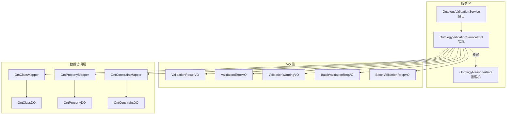
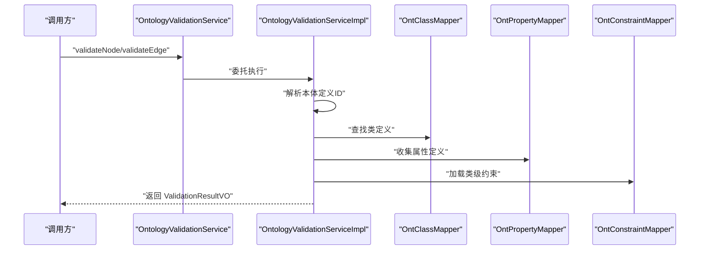
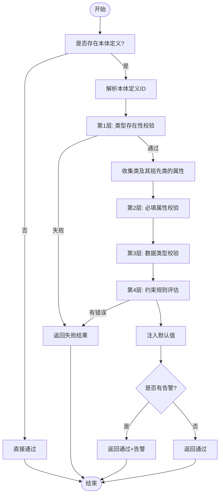
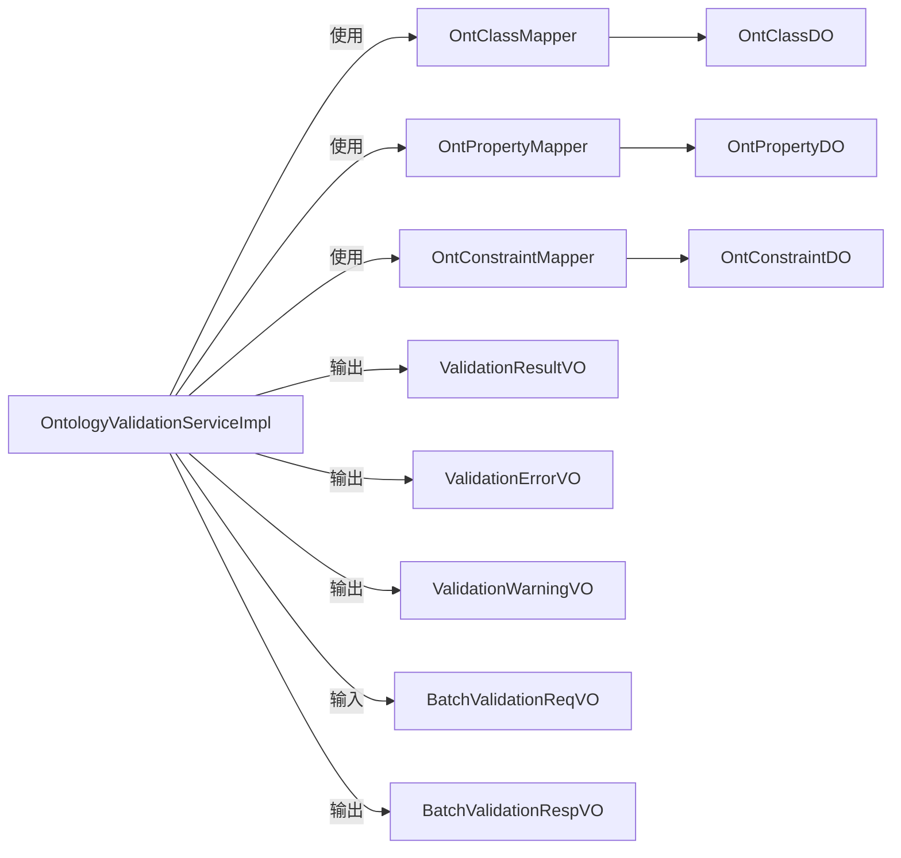

# 关系验证服务

<!--<cite>
**本文引用的文件**
- [OntologyValidationServiceImpl.java](file://graphiti-module-core/src/main/java/com/graphiti/module/graphiti/service/impl/OntologyValidationServiceImpl.java)
- [OntologyValidationService.java](file://graphiti-module-core/src/main/java/com/graphiti/module/graphiti/service/OntologyValidationService.java)
- [ValidationResultVO.java](file://graphiti-module-core/src/main/java/com/graphiti/module/graphiti/vo/ontology/ValidationResultVO.java)
- [ValidationErrorVO.java](file://graphiti-module-core/src/main/java/com/graphiti/module/graphiti/vo/ontology/ValidationErrorVO.java)
- [ValidationWarningVO.java](file://docs/superpowers/specs/2026-05-10-graphiti-java-full-alignment-design.md)
- [BatchValidationReqVO.java](file://graphiti-module-core/src/main/java/com/graphiti/module/graphiti/vo/ontology/BatchValidationReqVO.java)
- [BatchValidationRespVO.java](file://graphiti-module-core/src/main/java/com/graphiti/module/graphiti/vo/ontology/BatchValidationRespVO.java)
- [OntologyValidationException.java](file://graphiti-module-core/src/main/java/com/graphiti/module/graphiti/exception/OntologyValidationException.java)
- [OntologyReasonerImpl.java](file://graphiti-module-core/src/main/java/com/graphiti/module/graphiti/service/impl/OntologyReasonerImpl.java)
- [OntClassDO.java](file://graphiti-module-core/src/main/java/com/graphiti/module/graphiti/dal/dataobject/ont/OntClassDO.java)
- [OntPropertyDO.java](file://graphiti-module-core/src/main/java/com/graphiti/module/graphiti/dal/dataobject/ont/OntPropertyDO.java)
- [OntConstraintDO.java](file://graphiti-module-core/src/main/java/com/graphiti/module/graphiti/dal/dataobject/ont/OntConstraintDO.java)
- [OntClassMapper.java](file://graphiti-module-core/src/main/java/com/graphiti/module/graphiti/dal/mysql/ont/OntClassMapper.java)
- [OntPropertyMapper.java](file://graphiti-module-core/src/main/java/com/graphiti/module/graphiti/dal/mysql/ont/OntPropertyMapper.java)
- [OntConstraintMapper.java](file://graphiti-module-core/src/main/java/com/graphiti/module/graphiti/dal/mysql/ont/OntConstraintMapper.java)
- [OntologyValidationServiceImplTest.java](file://graphiti-module-core/src/test/java/com/graphiti/module/graphiti/service/OntologyValidationServiceImplTest.java)
</cite>-->

## 目录
1. [简介](#简介)
2. [项目结构](#项目结构)
3. [核心组件](#核心组件)
4. [架构总览](#架构总览)
5. [详细组件分析](#详细组件分析)
6. [依赖分析](#依赖分析)
7. [性能考虑](#性能考虑)
8. [故障排查指南](#故障排查指南)
9. [结论](#结论)
10. [附录](#附录)

## 简介
本文件系统化梳理关系验证服务的技术实现，重点围绕 OntologyValidationServiceImpl 的关系合法性验证机制展开，覆盖以下主题：
- 本体约束检查、类型兼容性验证与循环依赖检测
- 6层验证引擎工作原理：从语法验证到语义推理的完整流程
- ValidationResultVO 与 ValidationErrorVO 的数据结构设计及语义
- 验证规则配置、动态验证策略与自定义扩展机制
- 性能优化：缓存、增量验证与并行处理
- 失败处理流程、错误修复建议与人工干预机制

## 项目结构
关系验证服务位于 graphiti-module-core 模块，采用分层与职责分离的设计：
- 服务接口与实现：OntologyValidationService 与 OntologyValidationServiceImpl
- VO 层：ValidationResultVO、ValidationErrorVO、ValidationWarningVO、BatchValidationReqVO、BatchValidationRespVO
- 异常层：OntologyValidationException
- 数据访问层：OntClassMapper、OntPropertyMapper、OntConstraintMapper 及对应 DO
- 推理层：OntologyReasonerImpl（为后续语义推理与一致性检查预留）

图表来源
- [OntologyValidationService.java:18-39](file://graphiti-module-core/src/main/java/com/graphiti/module/graphiti/service/OntologyValidationService.java#L18-L39)
- [OntologyValidationServiceImpl.java:26-345](file://graphiti-module-core/src/main/java/com/graphiti/module/graphiti/service/impl/OntologyValidationServiceImpl.java#L26-L345)
- [OntologyReasonerImpl.java:21-161](file://graphiti-module-core/src/main/java/com/graphiti/module/graphiti/service/impl/OntologyReasonerImpl.java#L21-L161)
- [ValidationResultVO.java:15-35](file://graphiti-module-core/src/main/java/com/graphiti/module/graphiti/vo/ontology/ValidationResultVO.java#L15-L35)
- [ValidationErrorVO.java:10-20](file://graphiti-module-core/src/main/java/com/graphiti/module/graphiti/vo/ontology/ValidationErrorVO.java#L10-L20)
- [ValidationWarningVO.java:757-772](file://docs/superpowers/specs/2026-05-10-graphiti-java-full-alignment-design.md#L757-L772)
- [BatchValidationReqVO.java:8-23](file://graphiti-module-core/src/main/java/com/graphiti/module/graphiti/vo/ontology/BatchValidationReqVO.java#L8-L23)
- [BatchValidationRespVO.java:8-16](file://graphiti-module-core/src/main/java/com/graphiti/module/graphiti/vo/ontology/BatchValidationRespVO.java#L8-L16)
- [OntClassMapper.java:11-21](file://graphiti-module-core/src/main/java/com/graphiti/module/graphiti/dal/mysql/ont/OntClassMapper.java#L11-L21)
- [OntPropertyMapper.java:12-22](file://graphiti-module-core/src/main/java/com/graphiti/module/graphiti/dal/mysql/ont/OntPropertyMapper.java#L12-L22)
- [OntConstraintMapper.java:10-18](file://graphiti-module-core/src/main/java/com/graphiti/module/graphiti/dal/mysql/ont/OntConstraintMapper.java#L10-L18)

章节来源
- [OntologyValidationService.java:8-39](file://graphiti-module-core/src/main/java/com/graphiti/module/graphiti/service/OntologyValidationService.java#L8-L39)
- [OntologyValidationServiceImpl.java:26-345](file://graphiti-module-core/src/main/java/com/graphiti/module/graphiti/service/impl/OntologyValidationServiceImpl.java#L26-L345)

## 核心组件
- 验证服务接口：定义节点/边验证、批量验证与本体存在性判断等能力
- 验证服务实现：实现6层验证引擎，封装本体约束、类型兼容性与约束规则评估
- 结果与错误 VO：统一承载验证通过/失败、错误层级、错误列表与告警列表
- 数据访问层：基于 MyBatis 的 Mapper 与 DO，支撑类、属性与约束的查询
- 推理机实现：为后续 OWL 约束与语义推理预留能力

章节来源
- [OntologyValidationService.java:18-39](file://graphiti-module-core/src/main/java/com/graphiti/module/graphiti/service/OntologyValidationService.java#L18-L39)
- [OntologyValidationServiceImpl.java:26-345](file://graphiti-module-core/src/main/java/com/graphiti/module/graphiti/service/impl/OntologyValidationServiceImpl.java#L26-L345)
- [ValidationResultVO.java:15-35](file://graphiti-module-core/src/main/java/com/graphiti/module/graphiti/vo/ontology/ValidationResultVO.java#L15-L35)
- [ValidationErrorVO.java:10-20](file://graphiti-module-core/src/main/java/com/graphiti/module/graphiti/vo/ontology/ValidationErrorVO.java#L10-L20)
- [ValidationWarningVO.java:757-772](file://docs/superpowers/specs/2026-05-10-graphiti-java-full-alignment-design.md#L757-L772)
- [OntologyReasonerImpl.java:21-161](file://graphiti-module-core/src/main/java/com/graphiti/module/graphiti/service/impl/OntologyReasonerImpl.java#L21-L161)

## 架构总览
关系验证服务以“服务接口 + 实现 + VO + 数据访问 + 推理机”的分层架构组织，形成从请求到结果的闭环。

图表来源
- [OntologyValidationService.java:18-39](file://graphiti-module-core/src/main/java/com/graphiti/module/graphiti/service/OntologyValidationService.java#L18-L39)
- [OntologyValidationServiceImpl.java:39-129](file://graphiti-module-core/src/main/java/com/graphiti/module/graphiti/service/impl/OntologyValidationServiceImpl.java#L39-L129)
- [OntClassMapper.java:11-21](file://graphiti-module-core/src/main/java/com/graphiti/module/graphiti/dal/mysql/ont/OntClassMapper.java#L11-L21)
- [OntPropertyMapper.java:12-22](file://graphiti-module-core/src/main/java/com/graphiti/module/graphiti/dal/mysql/ont/OntPropertyMapper.java#L12-L22)
- [OntConstraintMapper.java:10-18](file://graphiti-module-core/src/main/java/com/graphiti/module/graphiti/dal/mysql/ont/OntConstraintMapper.java#L10-L18)

## 详细组件分析

### 6层验证引擎工作原理
OntologyValidationServiceImpl 将验证过程划分为6层，当前实现覆盖前4层，第5/6层为预留扩展点：
- 第1层：类型存在性（节点类或边属性 URI/本地名匹配）
- 第2层：必填属性校验（isRequired=true 的属性必须非空）
- 第3层：数据类型兼容性（基于 rangeDataType 的严格类型判定）
- 第4层：约束规则评估（枚举、范围、正则等）
- 第5层：OWL 约束（预留）
- 第6层：推理扩展（预留）

图表来源
- [OntologyValidationServiceImpl.java:39-87](file://graphiti-module-core/src/main/java/com/graphiti/module/graphiti/service/impl/OntologyValidationServiceImpl.java#L39-L87)
- [OntologyValidationServiceImpl.java:90-129](file://graphiti-module-core/src/main/java/com/graphiti/module/graphiti/service/impl/OntologyValidationServiceImpl.java#L90-L129)
- [OntologyValidationServiceImpl.java:207-343](file://graphiti-module-core/src/main/java/com/graphiti/module/graphiti/service/impl/OntologyValidationServiceImpl.java#L207-L343)

章节来源
- [OntologyValidationService.java:10-17](file://graphiti-module-core/src/main/java/com/graphiti/module/graphiti/service/OntologyValidationService.java#L10-L17)
- [OntologyValidationServiceImpl.java:39-129](file://graphiti-module-core/src/main/java/com/graphiti/module/graphiti/service/impl/OntologyValidationServiceImpl.java#L39-L129)

### 本体约束检查与类型兼容性验证
- 类型存在性：节点类型通过本地名或 URI 匹配；边类型通过 URI 或本地名匹配，若不存在则允许通过并返回告警
- 属性收集：递归收集类及其祖先类的属性定义，确保继承链上的约束与默认值生效
- 必填属性：对 isRequired=true 的属性进行非空校验
- 类型兼容性：依据属性的 rangeDataType 进行严格类型判定，支持字符串、整数、浮点、布尔、日期时间、JSON 等常见类型
- 默认值注入：对缺失且存在默认值的属性进行类型安全的默认值注入

章节来源
- [OntologyValidationServiceImpl.java:53-87](file://graphiti-module-core/src/main/java/com/graphiti/module/graphiti/service/impl/OntologyValidationServiceImpl.java#L53-L87)
- [OntologyValidationServiceImpl.java:90-129](file://graphiti-module-core/src/main/java/com/graphiti/module/graphiti/service/impl/OntologyValidationServiceImpl.java#L90-L129)
- [OntologyValidationServiceImpl.java:184-205](file://graphiti-module-core/src/main/java/com/graphiti/module/graphiti/service/impl/OntologyValidationServiceImpl.java#L184-L205)
- [OntologyValidationServiceImpl.java:207-240](file://graphiti-module-core/src/main/java/com/graphiti/module/graphiti/service/impl/OntologyValidationServiceImpl.java#L207-L240)
- [OntologyValidationServiceImpl.java:242-254](file://graphiti-module-core/src/main/java/com/graphiti/module/graphiti/service/impl/OntologyValidationServiceImpl.java#L242-L254)
- [OntologyValidationServiceImpl.java:324-343](file://graphiti-module-core/src/main/java/com/graphiti/module/graphiti/service/impl/OntologyValidationServiceImpl.java#L324-L343)

### 约束规则评估与循环依赖检测
- 约束规则评估：支持枚举、数值范围与正则表达式三类内置约束，错误消息可自定义，解析失败会记录告警
- 循环依赖检测：当前实现未显式检测类继承或属性域/范围的循环依赖。可在类收集阶段引入访问标记与拓扑检查以增强健壮性

章节来源
- [OntologyValidationServiceImpl.java:256-322](file://graphiti-module-core/src/main/java/com/graphiti/module/graphiti/service/impl/OntologyValidationServiceImpl.java#L256-L322)
- [OntologyValidationServiceImpl.java:198-205](file://graphiti-module-core/src/main/java/com/graphiti/module/graphiti/service/impl/OntologyValidationServiceImpl.java#L198-L205)

### ValidationResultVO 与 ValidationErrorVO 数据结构设计
- ValidationResultVO：统一承载验证结果状态、错误层级、错误列表、告警列表与属性增强后的结果
- ValidationErrorVO：描述单条错误，包含层级、错误码、消息、属性名与尝试值
- ValidationWarningVO：描述告警，包含层级、消息与建议（在设计文档中定义）

章节来源
- [ValidationResultVO.java:15-35](file://graphiti-module-core/src/main/java/com/graphiti/module/graphiti/vo/ontology/ValidationResultVO.java#L15-L35)
- [ValidationErrorVO.java:10-20](file://graphiti-module-core/src/main/java/com/graphiti/module/graphiti/vo/ontology/ValidationErrorVO.java#L10-L20)
- [ValidationWarningVO.java:757-772](file://docs/superpowers/specs/2026-05-10-graphiti-java-full-alignment-design.md#L757-L772)

### 验证规则配置与动态策略
- 规则来源：类、属性与约束均来自数据库表结构（OntClassDO、OntPropertyDO、OntConstraintDO）
- 动态策略：通过属性的 isRequired、rangeDataType、defaultValue 以及约束表的 constraintType/value/errorMessage 实现动态验证
- 自定义扩展：约束类型预留 CUSTOM_SPARQL，推理机预留 OWL 约束与语义推理，便于未来扩展

章节来源
- [OntClassDO.java:10-48](file://graphiti-module-core/src/main/java/com/graphiti/module/graphiti/dal/dataobject/ont/OntClassDO.java#L10-L48)
- [OntPropertyDO.java:11-77](file://graphiti-module-core/src/main/java/com/graphiti/module/graphiti/dal/dataobject/ont/OntPropertyDO.java#L11-L77)
- [OntConstraintDO.java:9-42](file://graphiti-module-core/src/main/java/com/graphiti/module/graphiti/dal/dataobject/ont/OntConstraintDO.java#L9-L42)
- [OntologyReasonerImpl.java:21-161](file://graphiti-module-core/src/main/java/com/graphiti/module/graphiti/service/impl/OntologyReasonerImpl.java#L21-L161)

### 批量验证与并行处理
- 批量接口：BatchValidationReqVO 支持同时提交节点与边的验证任务
- 并行处理：当前实现为顺序遍历，建议在上层控制器或业务层引入线程池并发执行各子任务，并合并 BatchValidationRespVO

章节来源
- [BatchValidationReqVO.java:8-23](file://graphiti-module-core/src/main/java/com/graphiti/module/graphiti/vo/ontology/BatchValidationReqVO.java#L8-L23)
- [BatchValidationRespVO.java:8-16](file://graphiti-module-core/src/main/java/com/graphiti/module/graphiti/vo/ontology/BatchValidationRespVO.java#L8-L16)
- [OntologyValidationServiceImpl.java:132-158](file://graphiti-module-core/src/main/java/com/graphiti/module/graphiti/service/impl/OntologyValidationServiceImpl.java#L132-L158)

### 验证失败处理流程与人工干预
- 失败封装：OntologyValidationException 将 ValidationResultVO 作为内部字段，便于上层捕获与统一处理
- 建议流程：记录失败详情 → 生成修复清单 → 人工审核与修正 → 重新验证

章节来源
- [OntologyValidationException.java:8-30](file://graphiti-module-core/src/main/java/com/graphiti/module/graphiti/exception/OntologyValidationException.java#L8-L30)

## 依赖分析
服务实现依赖于数据访问层与 VO 层，形成清晰的单向依赖：

图表来源
- [OntologyValidationServiceImpl.java:26-345](file://graphiti-module-core/src/main/java/com/graphiti/module/graphiti/service/impl/OntologyValidationServiceImpl.java#L26-L345)
- [OntologyValidationServiceImpl.java:132-158](file://graphiti-module-core/src/main/java/com/graphiti/module/graphiti/service/impl/OntologyValidationServiceImpl.java#L132-L158)
- [OntClassMapper.java:11-21](file://graphiti-module-core/src/main/java/com/graphiti/module/graphiti/dal/mysql/ont/OntClassMapper.java#L11-L21)
- [OntPropertyMapper.java:12-22](file://graphiti-module-core/src/main/java/com/graphiti/module/graphiti/dal/mysql/ont/OntPropertyMapper.java#L12-L22)
- [OntConstraintMapper.java:10-18](file://graphiti-module-core/src/main/java/com/graphiti/module/graphiti/dal/mysql/ont/OntConstraintMapper.java#L10-L18)

章节来源
- [OntologyValidationServiceImpl.java:26-345](file://graphiti-module-core/src/main/java/com/graphiti/module/graphiti/service/impl/OntologyValidationServiceImpl.java#L26-L345)

## 性能考虑
- 缓存策略
  - 本体定义解析：按 graphId 缓存 definitionId，避免重复查询
  - 类与属性查询：在上层或缓存层对常用类/属性 URI/本地名进行缓存
  - 推理机：OntologyReasonerImpl 已具备按 graphId 的推理模型缓存，建议结合预热与生命周期管理
- 增量验证
  - 对于节点/边属性变更，仅对受影响的属性与约束进行校验，减少全量扫描
- 并行处理
  - 批量验证建议在业务层引入线程池并发执行，降低端到端延迟
- I/O 优化
  - 使用 MyBatis 的批量查询与合理索引，减少数据库往返

章节来源
- [OntologyValidationServiceImpl.java:167-174](file://graphiti-module-core/src/main/java/com/graphiti/module/graphiti/service/impl/OntologyValidationServiceImpl.java#L167-L174)
- [OntologyReasonerImpl.java:23-53](file://graphiti-module-core/src/main/java/com/graphiti/module/graphiti/service/impl/OntologyReasonerImpl.java#L23-L53)

## 故障排查指南
- 常见问题定位
  - 类型未定义：检查本体定义 ID 解析与类 URI/本地名匹配
  - 缺少必填属性：核对 isRequired 标记与传入属性集合
  - 类型不匹配：确认 rangeDataType 与传入值类型一致
  - 约束违规：检查约束类型、值与错误消息配置
- 日志与异常
  - 约束值解析失败会记录告警日志，便于定位配置问题
  - 使用 OntologyValidationException 捕获并统一上报验证失败
- 修复建议
  - 优先修复高优先级错误（如类型未定义、必填缺失）
  - 对于类型不匹配，调整属性类型或转换输入值
  - 对于约束违规，根据错误消息调整属性值或更新本体约束

章节来源
- [OntologyValidationServiceImpl.java:318-321](file://graphiti-module-core/src/main/java/com/graphiti/module/graphiti/service/impl/OntologyValidationServiceImpl.java#L318-L321)
- [OntologyValidationException.java:8-30](file://graphiti-module-core/src/main/java/com/graphiti/module/graphiti/exception/OntologyValidationException.java#L8-L30)

## 结论
关系验证服务通过6层验证引擎实现了从语法到语义的渐进式校验，结合本体驱动的约束与类型系统，提供了可配置、可扩展与可观察的验证能力。当前实现聚焦于节点与边的合法性校验，OWL 约束与推理扩展为后续演进预留空间。配合缓存、增量与并行优化，可在保证正确性的同时显著提升吞吐与响应性能。

## 附录
- 单元测试要点
  - 验证通过/失败构造器行为
  - 告警模式下的通过结果
  - 错误对象的字段一致性

章节来源
- [OntologyValidationServiceImplTest.java:12-47](file://graphiti-module-core/src/test/java/com/graphiti/module/graphiti/service/OntologyValidationServiceImplTest.java#L12-L47)