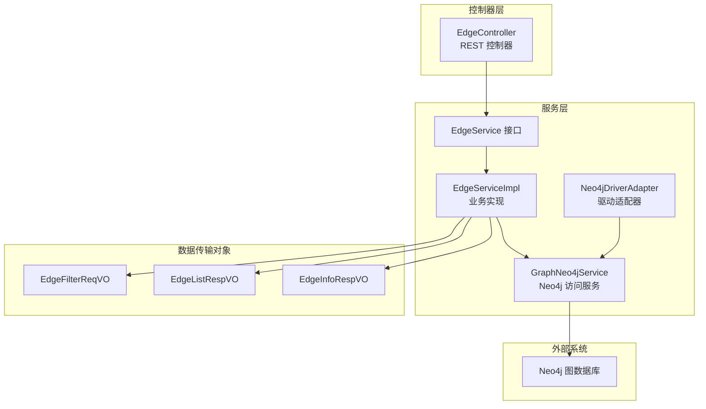
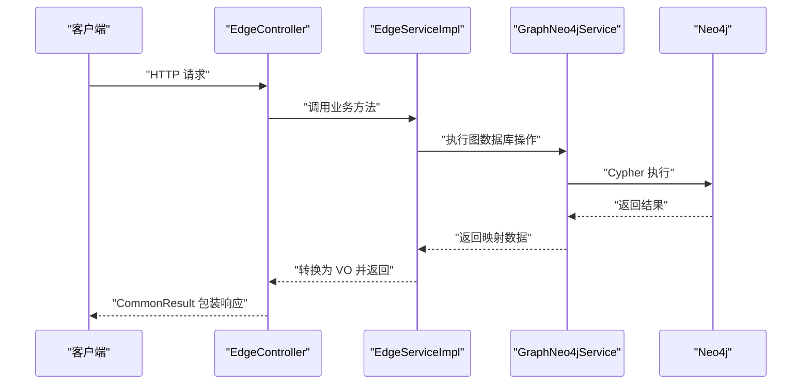
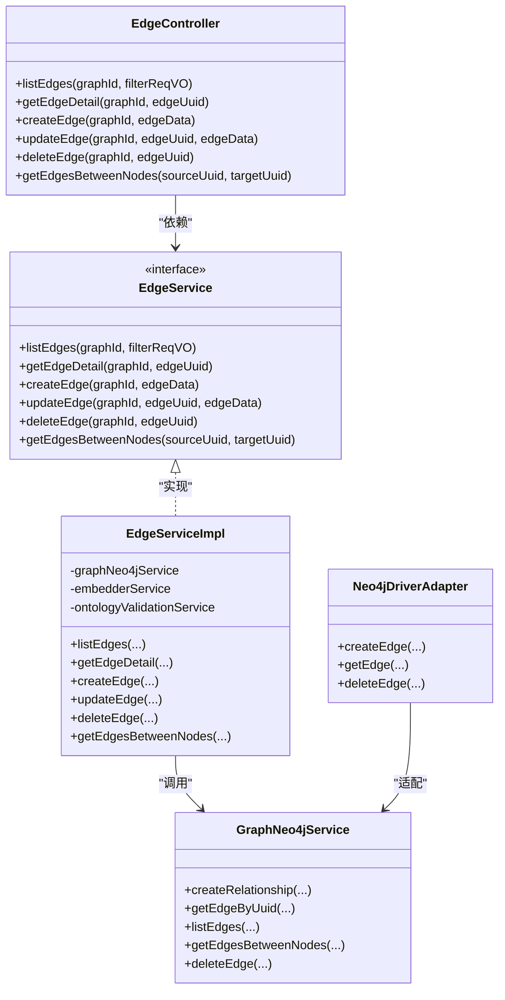

# 边CRUD操作

<!--<cite>
**本文引用的文件**
- [EdgeController.java](file://graphiti-module-core/src/main/java/com/graphiti/module/graphiti/controller/admin/EdgeController.java)
- [EdgeService.java](file://graphiti-module-core/src/main/java/com/graphiti/module/graphiti/service/EdgeService.java)
- [EdgeServiceImpl.java](file://graphiti-module-core/src/main/java/com/graphiti/module/graphiti/service/impl/EdgeServiceImpl.java)
- [GraphNeo4jService.java](file://graphiti-module-core/src/main/java/com/graphiti/module/graphiti/service/GraphNeo4jService.java)
- [EdgeFilterReqVO.java](file://graphiti-module-core/src/main/java/com/graphiti/module/graphiti/vo/edge/EdgeFilterReqVO.java)
- [EdgeInfoRespVO.java](file://graphiti-module-core/src/main/java/com/graphiti/module/graphiti/vo/edge/EdgeInfoRespVO.java)
- [EdgeListRespVO.java](file://graphiti-module-core/src/main/java/com/graphiti/module/graphiti/vo/edge/EdgeListRespVO.java)
- [Neo4jDriverAdapter.java](file://graphiti-module-core/src/main/java/com/graphiti/module/graphiti/service/impl/Neo4jDriverAdapter.java)
- [OntologyValidationServiceImpl.java](file://docs/superpowers/plans/2026-05-10-ontology-phase1-schema-enforcement.md)
- [EdgeServiceImplTest.java](file://graphiti-module-core/src/test/java/com/graphiti/module/graphiti/service/EdgeServiceImplTest.java)
</cite>-->

## 目录
1. [简介](#简介)
2. [项目结构](#项目结构)
3. [核心组件](#核心组件)
4. [架构总览](#架构总览)
5. [详细组件分析](#详细组件分析)
6. [依赖关系分析](#依赖关系分析)
7. [性能考虑](#性能考虑)
8. [故障排查指南](#故障排查指南)
9. [结论](#结论)
10. [附录](#附录)

## 简介
本文件围绕“边（Edge）CRUD 操作”进行系统化技术文档编写，重点覆盖以下内容：
- EdgeController 中边的完整生命周期管理：列表查询、详情获取、创建、更新、删除等。
- EdgeServiceImpl 的业务逻辑处理、参数验证、数据转换与异常处理机制。
- EdgeFilterReqVO、EdgeInfoRespVO、EdgeListRespVO 等数据传输对象的设计理念与字段含义。
- 完整的 RESTful API 接口文档：HTTP 方法、URL 路径、请求参数、响应格式与错误码说明。
- 高级查询能力：分页查询、条件过滤、排序规则的实现方案。

## 项目结构
本项目采用模块化分层架构，边的 CRUD 能力主要由控制器层、服务层、数据访问层与 VO 对象组成，并通过 Neo4j 作为图数据库存储引擎。

图表来源
- [EdgeController.java:1-91](file://graphiti-module-core/src/main/java/com/graphiti/module/graphiti/controller/admin/EdgeController.java#L1-L91)
- [EdgeService.java:1-61](file://graphiti-module-core/src/main/java/com/graphiti/module/graphiti/service/EdgeService.java#L1-L61)
- [EdgeServiceImpl.java:1-172](file://graphiti-module-core/src/main/java/com/graphiti/module/graphiti/service/impl/EdgeServiceImpl.java#L1-L172)
- [GraphNeo4jService.java:1-200](file://graphiti-module-core/src/main/java/com/graphiti/module/graphiti/service/GraphNeo4jService.java#L1-L200)
- [Neo4jDriverAdapter.java:1-69](file://graphiti-module-core/src/main/java/com/graphiti/module/graphiti/service/impl/Neo4jDriverAdapter.java#L1-L69)
- [EdgeFilterReqVO.java:1-38](file://graphiti-module-core/src/main/java/com/graphiti/module/graphiti/vo/edge/EdgeFilterReqVO.java#L1-L38)
- [EdgeListRespVO.java:1-70](file://graphiti-module-core/src/main/java/com/graphiti/module/graphiti/vo/edge/EdgeListRespVO.java#L1-L70)
- [EdgeInfoRespVO.java:1-70](file://graphiti-module-core/src/main/java/com/graphiti/module/graphiti/vo/edge/EdgeInfoRespVO.java#L1-L70)

章节来源
- [EdgeController.java:1-91](file://graphiti-module-core/src/main/java/com/graphiti/module/graphiti/controller/admin/EdgeController.java#L1-L91)
- [EdgeService.java:1-61](file://graphiti-module-core/src/main/java/com/graphiti/module/graphiti/service/EdgeService.java#L1-L61)
- [EdgeServiceImpl.java:1-172](file://graphiti-module-core/src/main/java/com/graphiti/module/graphiti/service/impl/EdgeServiceImpl.java#L1-L172)
- [GraphNeo4jService.java:1-200](file://graphiti-module-core/src/main/java/com/graphiti/module/graphiti/service/GraphNeo4jService.java#L1-L200)
- [EdgeFilterReqVO.java:1-38](file://graphiti-module-core/src/main/java/com/graphiti/module/graphiti/vo/edge/EdgeFilterReqVO.java#L1-L38)
- [EdgeListRespVO.java:1-70](file://graphiti-module-core/src/main/java/com/graphiti/module/graphiti/vo/edge/EdgeListRespVO.java#L1-L70)
- [EdgeInfoRespVO.java:1-70](file://graphiti-module-core/src/main/java/com/graphiti/module/graphiti/vo/edge/EdgeInfoRespVO.java#L1-L70)

## 核心组件
- EdgeController：暴露 RESTful 接口，负责接收请求、参数校验与返回统一响应包装。
- EdgeService/EdgeServiceImpl：封装业务逻辑，包括参数校验、本体校验、向量嵌入、数据转换与异常处理。
- GraphNeo4jService：封装 Neo4j 的原生 CRUD 操作，提供创建关系、查询关系、删除关系等能力。
- VO 对象：EdgeFilterReqVO、EdgeListRespVO、EdgeInfoRespVO，用于请求过滤、列表响应与详情响应的数据结构设计。

章节来源
- [EdgeController.java:23-90](file://graphiti-module-core/src/main/java/com/graphiti/module/graphiti/controller/admin/EdgeController.java#L23-L90)
- [EdgeService.java:9-60](file://graphiti-module-core/src/main/java/com/graphiti/module/graphiti/service/EdgeService.java#L9-L60)
- [EdgeServiceImpl.java:19-171](file://graphiti-module-core/src/main/java/com/graphiti/module/graphiti/service/impl/EdgeServiceImpl.java#L19-L171)
- [GraphNeo4jService.java:81-174](file://graphiti-module-core/src/main/java/com/graphiti/module/graphiti/service/GraphNeo4jService.java#L81-L174)
- [EdgeFilterReqVO.java:6-37](file://graphiti-module-core/src/main/java/com/graphiti/module/graphiti/vo/edge/EdgeFilterReqVO.java#L6-L37)
- [EdgeListRespVO.java:8-69](file://graphiti-module-core/src/main/java/com/graphiti/module/graphiti/vo/edge/EdgeListRespVO.java#L8-L69)
- [EdgeInfoRespVO.java:8-69](file://graphiti-module-core/src/main/java/com/graphiti/module/graphiti/vo/edge/EdgeInfoRespVO.java#L8-L69)

## 架构总览
下图展示了从控制器到服务再到数据访问层的整体调用链路，以及与 Neo4j 的交互。

图表来源
- [EdgeController.java:33-90](file://graphiti-module-core/src/main/java/com/graphiti/module/graphiti/controller/admin/EdgeController.java#L33-L90)
- [EdgeServiceImpl.java:31-124](file://graphiti-module-core/src/main/java/com/graphiti/module/graphiti/service/impl/EdgeServiceImpl.java#L31-L124)
- [GraphNeo4jService.java:93-174](file://graphiti-module-core/src/main/java/com/graphiti/module/graphiti/service/GraphNeo4jService.java#L93-L174)

## 详细组件分析

### EdgeController：边的REST API
- 路径与方法
  - GET /api/v1/graph/edge/between/{sourceUuid}/{targetUuid}
    - 功能：查询两节点间的所有边（双向）
    - 请求参数：sourceUuid、targetUuid（路径变量）
    - 响应：CommonResult<List<EdgeListRespVO>>
  - POST /api/v1/graph/edge/list/{graphId}
    - 功能：按过滤条件与分页获取边列表
    - 请求参数：graphId（路径变量）、请求体为 EdgeFilterReqVO
    - 响应：CommonResult<List<EdgeListRespVO>>
  - GET /api/v1/graph/edge/{graphId}/{edgeUuid}
    - 功能：获取边详情
    - 请求参数：graphId、edgeUuid（路径变量）
    - 响应：CommonResult<EdgeInfoRespVO>
  - POST /api/v1/graph/edge/{graphId}
    - 功能：创建新边
    - 请求参数：graphId（路径变量）、请求体为 Map<String,Object>（包含 source、target、type、properties 等）
    - 响应：CommonResult<EdgeInfoRespVO>
  - PUT /api/v1/graph/edge/{graphId}/{edgeUuid}
    - 功能：更新边（当前实现抛出待实现异常）
    - 请求参数：graphId、edgeUuid（路径变量）、请求体为 Map<String,Object>
    - 响应：CommonResult<EdgeInfoRespVO>
  - DELETE /api/v1/graph/edge/{graphId}/{edgeUuid}
    - 功能：删除边
    - 请求参数：graphId、edgeUuid（路径变量）
    - 响应：CommonResult<Boolean>

- 安全性与认证
  - 所有接口均声明需要 Bearer Token 认证。

章节来源
- [EdgeController.java:33-90](file://graphiti-module-core/src/main/java/com/graphiti/module/graphiti/controller/admin/EdgeController.java#L33-L90)

### EdgeService/EdgeServiceImpl：业务逻辑与数据转换
- 列表查询（listEdges）
  - 参数：graphId、EdgeFilterReqVO（type、source、target、skip、limit）
  - 步骤：调用 GraphNeo4jService.listEdges，遍历结果并转换为 EdgeListRespVO 列表
- 详情查询（getEdgeDetail）
  - 参数：graphId、edgeUuid
  - 步骤：GraphNeo4jService.getEdgeByUuid 查询；若为空则抛出业务异常；否则转换为 EdgeInfoRespVO
- 创建边（createEdge）
  - 参数：graphId、Map<String,Object>（包含 source、target、type、fact、properties）
  - 步骤：
    - 校验必填字段（source、target、type）
    - 若存在本体定义，则调用 OntologyValidationService.validateEdge 校验属性与类型
    - 使用 EmbedderService 生成向量 embedding
    - 调用 GraphNeo4jService.createRelationship 创建关系
    - 转换为 EdgeInfoRespVO 返回
- 更新边（updateEdge）
  - 当前实现：抛出业务异常，提示功能待实现
- 删除边（deleteEdge）
  - 调用 GraphNeo4jService.deleteEdge 并记录日志
- 两节点间边查询（getEdgesBetweenNodes）
  - 参数：sourceUuid、targetUuid
  - 步骤：GraphNeo4jService.getEdgesBetweenNodes 查询并转换为 EdgeListRespVO 列表

- 数据转换
  - convertToEdgeListRespVO：提取 uuid、source、target、type 及其余属性（排除系统字段）
  - convertToEdgeInfoRespVO：同上，用于详情响应

- 异常处理
  - 业务异常：如边不存在、创建失败、参数缺失等
  - 本体校验异常：OntologyValidationException（当本体校验未通过）

章节来源
- [EdgeService.java:12-60](file://graphiti-module-core/src/main/java/com/graphiti/module/graphiti/service/EdgeService.java#L12-L60)
- [EdgeServiceImpl.java:31-124](file://graphiti-module-core/src/main/java/com/graphiti/module/graphiti/service/impl/EdgeServiceImpl.java#L31-L124)
- [EdgeServiceImpl.java:128-170](file://graphiti-module-core/src/main/java/com/graphiti/module/graphiti/service/impl/EdgeServiceImpl.java#L128-L170)

### GraphNeo4jService：图数据库操作
- 创建关系（createRelationship）
  - 支持两种重载：自动推断关系类型或显式传入 Neo4j 关系类型
  - 参数：graphId、edgeUuid、sourceUuid、targetUuid、type/fact/embedding/properties
  - 返回：创建的关系映射（包含 uuid、type、fact、embedding 等）
- 查询关系
  - getEdgeByUuid：按 uuid 查询单条关系
  - listEdges：按过滤条件与分页查询关系列表
  - getEdgesBetweenNodes：查询两节点间的边（双向）
- 删除关系（deleteEdge）
  - 根据 graphId 与 uuid 删除关系

章节来源
- [GraphNeo4jService.java:93-174](file://graphiti-module-core/src/main/java/com/graphiti/module/graphiti/service/GraphNeo4jService.java#L93-L174)
- [GraphNeo4jService.java:191-200](file://graphiti-module-core/src/main/java/com/graphiti/module/graphiti/service/GraphNeo4jService.java#L191-L200)

### 数据传输对象（VO）
- EdgeFilterReqVO
  - 字段：type（关系类型）、source（源节点UUID）、target（目标节点UUID）、skip（跳过数，默认0）、limit（限制数，默认20）
  - 设计理念：用于列表查询的过滤与分页控制
- EdgeListRespVO
  - 字段：uuid、source、target、type、properties、name、createdAt、validAt、invalidAt、expiredAt、episodes
  - 设计理念：列表展示所需的简要信息，便于前端渲染
- EdgeInfoRespVO
  - 字段：uuid、source、target、type、name、createdAt、validAt、invalidAt、expiredAt、episodes、properties
  - 设计理念：详情页所需完整信息，包含时间维度与关联实体

章节来源
- [EdgeFilterReqVO.java:10-37](file://graphiti-module-core/src/main/java/com/graphiti/module/graphiti/vo/edge/EdgeFilterReqVO.java#L10-L37)
- [EdgeListRespVO.java:11-69](file://graphiti-module-core/src/main/java/com/graphiti/module/graphiti/vo/edge/EdgeListRespVO.java#L11-L69)
- [EdgeInfoRespVO.java:12-69](file://graphiti-module-core/src/main/java/com/graphiti/module/graphiti/vo/edge/EdgeInfoRespVO.java#L12-L69)

### 本体校验与嵌入向量
- 本体校验
  - EdgeServiceImpl 在创建边时，若图存在本体定义，则调用 OntologyValidationService.validateEdge 进行校验
  - 校验失败抛出 OntologyValidationException
- 嵌入向量
  - 使用 EmbedderService 对 fact 或 type+relationship 文本生成向量，写入关系属性 embedding

章节来源
- [EdgeServiceImpl.java:82-87](file://graphiti-module-core/src/main/java/com/graphiti/module/graphiti/service/impl/EdgeServiceImpl.java#L82-L87)
- [EdgeServiceImpl.java:89-91](file://graphiti-module-core/src/main/java/com/graphiti/module/graphiti/service/impl/EdgeServiceImpl.java#L89-L91)
- [OntologyValidationServiceImpl.java:944-985](file://docs/superpowers/plans/2026-05-10-ontology-phase1-schema-enforcement.md#L944-L985)

### API 接口文档

- 获取边列表
  - 方法：POST
  - 路径：/api/v1/graph/edge/list/{graphId}
  - 认证：Bearer Token
  - 请求体：EdgeFilterReqVO（可选）
    - type：关系类型（精确匹配）
    - source：源节点UUID
    - target：目标节点UUID
    - skip：跳过数量（默认0）
    - limit：限制数量（默认20）
  - 响应体：CommonResult<List<EdgeListRespVO>>

- 获取边详情
  - 方法：GET
  - 路径：/api/v1/graph/edge/{graphId}/{edgeUuid}
  - 认证：Bearer Token
  - 响应体：CommonResult<EdgeInfoRespVO>

- 创建边
  - 方法：POST
  - 路径：/api/v1/graph/edge/{graphId}
  - 认证：Bearer Token
  - 请求体：Map<String,Object>
    - source：源节点UUID（必填）
    - target：目标节点UUID（必填）
    - type：关系类型（必填）
    - fact：关系事实描述（可选）
    - properties：扩展属性（可选）
  - 响应体：CommonResult<EdgeInfoRespVO>

- 更新边
  - 方法：PUT
  - 路径：/api/v1/graph/edge/{graphId}/{edgeUuid}
  - 认证：Bearer Token
  - 请求体：Map<String,Object>
  - 响应体：CommonResult<EdgeInfoRespVO>
  - 备注：当前实现抛出业务异常，提示功能待实现

- 删除边
  - 方法：DELETE
  - 路径：/api/v1/graph/edge/{graphId}/{edgeUuid}
  - 认证：Bearer Token
  - 响应体：CommonResult<Boolean>

- 查询两节点间边
  - 方法：GET
  - 路径：/api/v1/graph/edge/between/{sourceUuid}/{targetUuid}
  - 认证：Bearer Token
  - 响应体：CommonResult<List<EdgeListRespVO>>

- 错误码说明
  - 1004：边不存在
  - 1007：源节点UUID不能为空
  - 1008：目标节点UUID不能为空
  - 1009：关系类型不能为空
  - 500：创建边失败（或更新功能待实现）

章节来源
- [EdgeController.java:33-90](file://graphiti-module-core/src/main/java/com/graphiti/module/graphiti/controller/admin/EdgeController.java#L33-L90)
- [EdgeServiceImpl.java:54-57](file://graphiti-module-core/src/main/java/com/graphiti/module/graphiti/service/impl/EdgeServiceImpl.java#L54-L57)
- [EdgeServiceImpl.java:72-80](file://graphiti-module-core/src/main/java/com/graphiti/module/graphiti/service/impl/EdgeServiceImpl.java#L72-L80)
- [EdgeServiceImpl.java:97-99](file://graphiti-module-core/src/main/java/com/graphiti/module/graphiti/service/impl/EdgeServiceImpl.java#L97-L99)
- [EdgeServiceImpl.java:107](file://graphiti-module-core/src/main/java/com/graphiti/module/graphiti/service/impl/EdgeServiceImpl.java#L107)

### 高级查询功能实现方案
- 分页查询
  - 通过 EdgeFilterReqVO 的 skip 与 limit 控制分页
  - GraphNeo4jService.listEdges 接收 skip/limit 参数并返回对应结果
- 条件过滤
  - type、source、target 字段用于精确过滤
  - 可结合本体校验对属性进行更严格约束
- 排序规则
  - 当前实现未提供显式排序字段
  - 可在 GraphNeo4jService.listEdges 中增加 ORDER BY 子句以支持 createdAt、validAt 等排序

章节来源
- [EdgeFilterReqVO.java:16-36](file://graphiti-module-core/src/main/java/com/graphiti/module/graphiti/vo/edge/EdgeFilterReqVO.java#L16-L36)
- [EdgeServiceImpl.java:34-41](file://graphiti-module-core/src/main/java/com/graphiti/module/graphiti/service/impl/EdgeServiceImpl.java#L34-L41)

## 依赖关系分析

图表来源
- [EdgeController.java:30-31](file://graphiti-module-core/src/main/java/com/graphiti/module/graphiti/controller/admin/EdgeController.java#L30-L31)
- [EdgeService.java:12-60](file://graphiti-module-core/src/main/java/com/graphiti/module/graphiti/service/EdgeService.java#L12-L60)
- [EdgeServiceImpl.java:27-29](file://graphiti-module-core/src/main/java/com/graphiti/module/graphiti/service/impl/EdgeServiceImpl.java#L27-L29)
- [GraphNeo4jService.java:93-174](file://graphiti-module-core/src/main/java/com/graphiti/module/graphiti/service/GraphNeo4jService.java#L93-L174)
- [Neo4jDriverAdapter.java:24-47](file://graphiti-module-core/src/main/java/com/graphiti/module/graphiti/service/impl/Neo4jDriverAdapter.java#L24-L47)

章节来源
- [EdgeController.java:29-31](file://graphiti-module-core/src/main/java/com/graphiti/module/graphiti/controller/admin/EdgeController.java#L29-L31)
- [EdgeServiceImpl.java:27-29](file://graphiti-module-core/src/main/java/com/graphiti/module/graphiti/service/impl/EdgeServiceImpl.java#L27-L29)
- [Neo4jDriverAdapter.java:24-47](file://graphiti-module-core/src/main/java/com/graphiti/module/graphiti/service/impl/Neo4jDriverAdapter.java#L24-L47)

## 性能考虑
- 向量索引
  - GraphNeo4jService.initVectorIndexes 支持为节点与边创建向量索引，提升相似度检索性能
- 分页与过滤
  - 建议在高基数场景下合理设置 limit，避免一次性返回过多数据
- 嵌入生成
  - 嵌入生成为 CPU 密集型操作，建议异步化或批量处理
- 事务与会话
  - GraphNeo4jService 使用 Session 执行 Cypher，注意控制会话生命周期与并发

章节来源
- [GraphNeo4jService.java:768-786](file://graphiti-module-core/src/main/java/com/graphiti/module/graphiti/service/GraphNeo4jService.java#L768-L786)

## 故障排查指南
- 常见问题
  - 边不存在：getEdgeDetail 抛出业务异常（错误码 1004）
  - 参数缺失：创建边时缺少 source/target/type 抛出业务异常（错误码 1007/1008/1009）
  - 创建失败：GraphNeo4jService.createRelationship 返回空时抛出业务异常（错误码 500）
  - 更新功能未实现：updateEdge 抛出业务异常，提示功能待实现
- 本体校验失败
  - validateEdge 返回失败时抛出 OntologyValidationException
- 单元测试参考
  - EdgeServiceImplTest 提供了无本体、有本体且通过/失败的测试用例，可用于定位问题

章节来源
- [EdgeServiceImpl.java:54-57](file://graphiti-module-core/src/main/java/com/graphiti/module/graphiti/service/impl/EdgeServiceImpl.java#L54-L57)
- [EdgeServiceImpl.java:72-80](file://graphiti-module-core/src/main/java/com/graphiti/module/graphiti/service/impl/EdgeServiceImpl.java#L72-L80)
- [EdgeServiceImpl.java:97-99](file://graphiti-module-core/src/main/java/com/graphiti/module/graphiti/service/impl/EdgeServiceImpl.java#L97-L99)
- [EdgeServiceImpl.java:107](file://graphiti-module-core/src/main/java/com/graphiti/module/graphiti/service/impl/EdgeServiceImpl.java#L107)
- [EdgeServiceImplTest.java:1489-1516](file://graphiti-module-core/src/test/java/com/graphiti/module/graphiti/service/EdgeServiceImplTest.java#L1489-L1516)

## 结论
本文件系统梳理了边的 CRUD 生命周期、控制器与服务层的职责划分、数据访问层的图数据库操作、VO 设计理念与 API 规范，并提供了性能优化与故障排查建议。当前实现支持边的创建、查询与删除，更新功能处于待实现状态；建议后续完善更新逻辑与排序、索引策略，以满足生产环境的高性能需求。

## 附录
- 术语
  - graphId：图谱标识，Neo4j 中作为 group_id 使用
  - uuid：实体或关系的全局唯一标识
  - fact：关系的事实描述文本，用于生成向量嵌入
- 参考实现
  - Neo4jDriverAdapter 将 GraphNeo4jService 适配为 GraphDriverService 接口，便于统一驱动层抽象

章节来源
- [Neo4jDriverAdapter.java:17-69](file://graphiti-module-core/src/main/java/com/graphiti/module/graphiti/service/impl/Neo4jDriverAdapter.java#L17-L69)