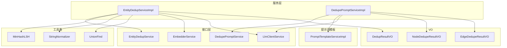
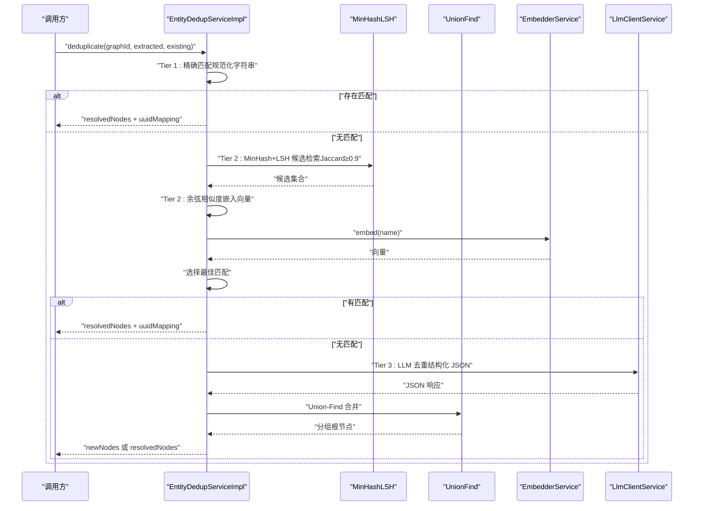
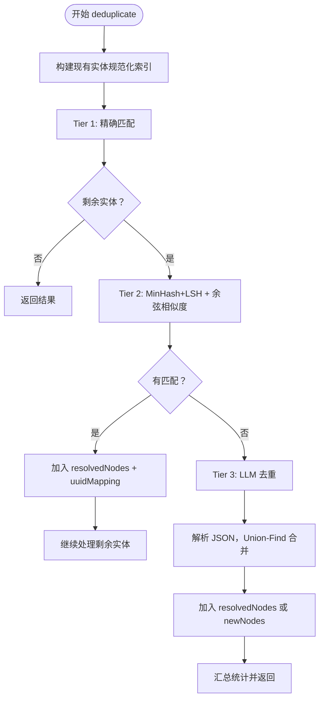
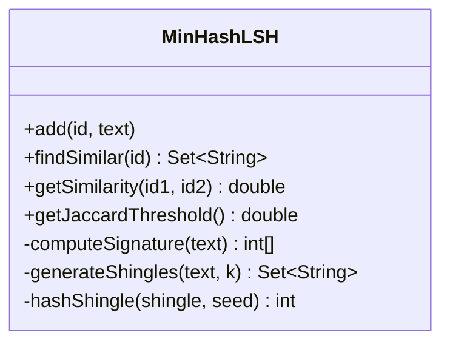
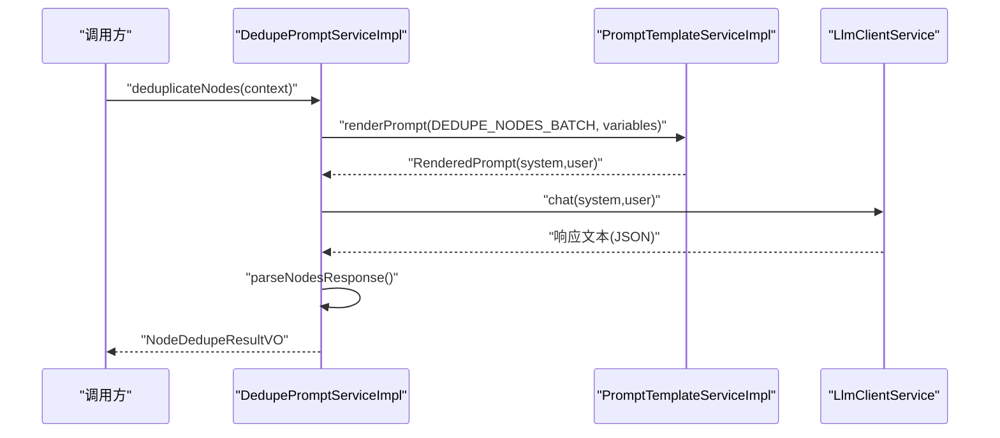
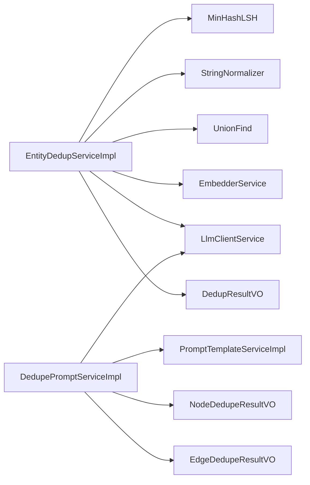

# 实体去重

<!--<cite>
**本文引用的文件**
- [EntityDedupServiceImpl.java](file://graphiti-module-core/src/main/java/com/graphiti/module/graphiti/service/impl/EntityDedupServiceImpl.java)
- [DedupePromptServiceImpl.java](file://graphiti-module-core/src/main/java/com/graphiti/module/graphiti/service/impl/DedupePromptServiceImpl.java)
- [NodeDedupeResultVO.java](file://graphiti-module-core/src/main/java/com/graphiti/module/graphiti/vo/dedup/NodeDedupeResultVO.java)
- [EdgeDedupeResultVO.java](file://graphiti-module-core/src/main/java/com/graphiti/module/graphiti/vo/dedup/EdgeDedupeResultVO.java)
- [DedupResultVO.java](file://graphiti-module-core/src/main/java/com/graphiti/module/graphiti/vo/dedup/DedupResultVO.java)
- [MinHashLSH.java](file://graphiti-module-core/src/main/java/com/graphiti/module/graphiti/util/MinHashLSH.java)
- [StringNormalizer.java](file://graphiti-module-core/src/main/java/com/graphiti/module/graphiti/util/StringNormalizer.java)
- [UnionFind.java](file://graphiti-module-core/src/main/java/com/graphiti/module/graphiti/util/UnionFind.java)
- [EntityDedupService.java](file://graphiti-module-core/src/main/java/com/graphiti/module/graphiti/service/EntityDedupService.java)
- [DedupePromptService.java](file://graphiti-module-core/src/main/java/com/graphiti/module/graphiti/service/DedupePromptService.java)
- [EmbedderService.java](file://graphiti-module-core/src/main/java/com/graphiti/module/graphiti/service/EmbedderService.java)
- [LlmClientService.java](file://graphiti-module-core/src/main/java/com/graphiti/module/graphiti/service/LlmClientService.java)
- [PromptTemplateServiceImpl.java](file://graphiti-module-core/src/main/java/com/graphiti/module/graphiti/service/impl/PromptTemplateServiceImpl.java)
</cite>-->

## 目录
1. [简介](#简介)
2. [项目结构](#项目结构)
3. [核心组件](#核心组件)
4. [架构总览](#架构总览)
5. [详细组件分析](#详细组件分析)
6. [依赖关系分析](#依赖关系分析)
7. [性能考虑](#性能考虑)
8. [故障排查指南](#故障排查指南)
9. [结论](#结论)
10. [附录](#附录)

## 简介
本文件面向“实体去重”功能的技术文档，聚焦于以下方面：
- 三层去重策略：精确匹配（Tier 1）、语义匹配（Tier 2，MinHash+LSH，Jaccard≥0.9）、LLM 决策（Tier 3）
- 去重算法实现细节：MinHashLSH 局部敏感哈希与 Jaccard 相似度、余弦相似度、并查集（Union-Find）分组
- 去重结果数据结构：NodeDedupeResultVO、EdgeDedupeResultVO、DedupResultVO
- 提示词工程在去重决策中的作用：DedupePromptServiceImpl 通过模板渲染与 LLM 输出解析驱动去重
- 性能优化：并行处理、索引优化、内存管理
- 质量评估与人工审核：指标建议、流程建议、错误处理
- 对图谱一致性与查询性能的影响

## 项目结构
与实体去重相关的关键模块与文件：
- 服务层：EntityDedupServiceImpl、DedupePromptServiceImpl
- 接口层：EntityDedupService、DedupePromptService、EmbedderService、LlmClientService
- 工具类：MinHashLSH、StringNormalizer、UnionFind
- VO 层：NodeDedupeResultVO、EdgeDedupeResultVO、DedupResultVO
- 提示词模板：PromptTemplateServiceImpl（支撑 DedupePromptServiceImpl）

图表来源
- [EntityDedupServiceImpl.java:1-398](file://graphiti-module-core/src/main/java/com/graphiti/module/graphiti/service/impl/EntityDedupServiceImpl.java#L1-L398)
- [DedupePromptServiceImpl.java:1-342](file://graphiti-module-core/src/main/java/com/graphiti/module/graphiti/service/impl/DedupePromptServiceImpl.java#L1-L342)
- [MinHashLSH.java:1-196](file://graphiti-module-core/src/main/java/com/graphiti/module/graphiti/util/MinHashLSH.java#L1-L196)
- [StringNormalizer.java:1-82](file://graphiti-module-core/src/main/java/com/graphiti/module/graphiti/util/StringNormalizer.java#L1-L82)
- [UnionFind.java:1-125](file://graphiti-module-core/src/main/java/com/graphiti/module/graphiti/util/UnionFind.java#L1-L125)
- [EntityDedupService.java:1-69](file://graphiti-module-core/src/main/java/com/graphiti/module/graphiti/service/EntityDedupService.java#L1-L69)
- [DedupePromptService.java:1-108](file://graphiti-module-core/src/main/java/com/graphiti/module/graphiti/service/DedupePromptService.java#L1-L108)
- [EmbedderService.java:1-41](file://graphiti-module-core/src/main/java/com/graphiti/module/graphiti/service/EmbedderService.java#L1-L41)
- [LlmClientService.java:1-158](file://graphiti-module-core/src/main/java/com/graphiti/module/graphiti/service/LlmClientService.java#L1-L158)
- [PromptTemplateServiceImpl.java:1-403](file://graphiti-module-core/src/main/java/com/graphiti/module/graphiti/service/impl/PromptTemplateServiceImpl.java#L1-L403)
- [NodeDedupeResultVO.java:1-32](file://graphiti-module-core/src/main/java/com/graphiti/module/graphiti/vo/dedup/NodeDedupeResultVO.java#L1-L32)
- [EdgeDedupeResultVO.java:1-21](file://graphiti-module-core/src/main/java/com/graphiti/module/graphiti/vo/dedup/EdgeDedupeResultVO.java#L1-L21)
- [DedupResultVO.java:1-72](file://graphiti-module-core/src/main/java/com/graphiti/module/graphiti/vo/dedup/DedupResultVO.java#L1-L72)

章节来源
- [EntityDedupServiceImpl.java:1-398](file://graphiti-module-core/src/main/java/com/graphiti/module/graphiti/service/impl/EntityDedupServiceImpl.java#L1-L398)
- [DedupePromptServiceImpl.java:1-342](file://graphiti-module-core/src/main/java/com/graphiti/module/graphiti/service/impl/DedupePromptServiceImpl.java#L1-L342)

## 核心组件
- 三层去重策略
  - Tier 1：精确匹配（字符串规范化后精确比对）
  - Tier 2：语义匹配（MinHash+LSH，Jaccard 相似度≥0.9）
  - Tier 3：LLM 决策（对剩余实体进行结构化解析与去重）
- 关键算法与工具
  - MinHashLSH：局部敏感哈希，加速候选检索
  - Jaccard 相似度：衡量字符串集合相似度
  - 余弦相似度：向量空间相似度（嵌入向量）
  - 并查集（Union-Find）：对候选对进行连通分量合并
- 结果数据结构
  - DedupResultVO：主流程输出，含 resolvedNodes、newNodes、uuidMapping、统计
  - NodeDedupeResultVO：节点去重结果
  - EdgeDedupeResultVO：边去重结果

章节来源
- [EntityDedupServiceImpl.java:21-37](file://graphiti-module-core/src/main/java/com/graphiti/module/graphiti/service/impl/EntityDedupServiceImpl.java#L21-L37)
- [EntityDedupService.java:8-24](file://graphiti-module-core/src/main/java/com/graphiti/module/graphiti/service/EntityDedupService.java#L8-L24)
- [DedupResultVO.java:11-72](file://graphiti-module-core/src/main/java/com/graphiti/module/graphiti/vo/dedup/DedupResultVO.java#L11-L72)
- [NodeDedupeResultVO.java:11-32](file://graphiti-module-core/src/main/java/com/graphiti/module/graphiti/vo/dedup/NodeDedupeResultVO.java#L11-L32)
- [EdgeDedupeResultVO.java:11-21](file://graphiti-module-core/src/main/java/com/graphiti/module/graphiti/vo/dedup/EdgeDedupeResultVO.java#L11-L21)

## 架构总览
实体去重的整体流程由三层组成，并在必要时引入 LLM 与嵌入向量进行最终判定。

图表来源
- [EntityDedupServiceImpl.java:54-172](file://graphiti-module-core/src/main/java/com/graphiti/module/graphiti/service/impl/EntityDedupServiceImpl.java#L54-L172)
- [MinHashLSH.java:69-94](file://graphiti-module-core/src/main/java/com/graphiti/module/graphiti/util/MinHashLSH.java#L69-L94)
- [EmbedderService.java:16-25](file://graphiti-module-core/src/main/java/com/graphiti/module/graphiti/service/EmbedderService.java#L16-L25)
- [LlmClientService.java:25-55](file://graphiti-module-core/src/main/java/com/graphiti/module/graphiti/service/LlmClientService.java#L25-L55)
- [UnionFind.java:36-77](file://graphiti-module-core/src/main/java/com/graphiti/module/graphiti/util/UnionFind.java#L36-L77)

## 详细组件分析

### 1) 实体去重服务（EntityDedupServiceImpl）
- 三层策略
  - Tier 1：规范化字符串精确匹配，使用 StringNormalizer.normalizeExact
  - Tier 2：MinHash+LSH，Jaccard 相似度阈值 0.9；对候选进行余弦相似度二次筛选
  - Tier 3：LLM 去重，解析结构化 JSON 输出，使用 Union-Find 合并重复组
- 关键阈值
  - 余弦相似度阈值：0.6
  - Jaccard 阈值：0.9
  - 候选上限：15（用于向量相似度候选限制）
- 数据结构
  - DedupResultVO.resolvedNodes：映射到现有节点的实体（包含 originalName、resolvedUuid）
  - DedupResultVO.newNodes：需新建的实体
  - DedupResultVO.uuidMapping：名称到 UUID 的映射
  - DedupResultVO.stats：统计计数（原始、精确匹配、语义匹配、LLM 去重、最终）

图表来源
- [EntityDedupServiceImpl.java:54-172](file://graphiti-module-core/src/main/java/com/graphiti/module/graphiti/service/impl/EntityDedupServiceImpl.java#L54-L172)
- [DedupResultVO.java:11-72](file://graphiti-module-core/src/main/java/com/graphiti/module/graphiti/vo/dedup/DedupResultVO.java#L11-L72)

章节来源
- [EntityDedupServiceImpl.java:54-172](file://graphiti-module-core/src/main/java/com/graphiti/module/graphiti/service/impl/EntityDedupServiceImpl.java#L54-L172)
- [EntityDedupService.java:25-68](file://graphiti-module-core/src/main/java/com/graphiti/module/graphiti/service/EntityDedupService.java#L25-L68)

### 2) MinHashLSH 局部敏感哈希与 Jaccard 相似度
- MinHash 配置
  - PERMUTATIONS=32，BAND_SIZE=4，NUM_BANDS=8
  - JACCARD_THRESHOLD=0.9
- 核心能力
  - add(id, text)：计算签名并插入 LSH 桶
  - findSimilar(id)：基于桶快速召回候选
  - getSimilarity(id1, id2)：计算 MinHash Jaccard 相似度
- 3-gram Shingles 生成与带盐哈希函数保证稳定性

图表来源
- [MinHashLSH.java:18-196](file://graphiti-module-core/src/main/java/com/graphiti/module/graphiti/util/MinHashLSH.java#L18-L196)

章节来源
- [MinHashLSH.java:18-196](file://graphiti-module-core/src/main/java/com/graphiti/module/graphiti/util/MinHashLSH.java#L18-L196)

### 3) 字符串规范化与熵检测
- normalizeExact：小写化、合并空白，用于精确匹配
- hasEnoughEntropy：长度≥6 且熵≥1.5，决定是否进入 MinHash 匹配阶段

章节来源
- [StringNormalizer.java:18-80](file://graphiti-module-core/src/main/java/com/graphiti/module/graphiti/util/StringNormalizer.java#L18-L80)

### 4) 并查集（Union-Find）
- 路径压缩与按秩合并，支持对候选对进行连通分量合并
- 在 LLM 去重与语义去重中用于分组

章节来源
- [UnionFind.java:15-125](file://graphiti-module-core/src/main/java/com/graphiti/module/graphiti/util/UnionFind.java#L15-L125)

### 5) 去重结果数据结构
- DedupResultVO
  - resolvedNodes：映射到现有节点的实体
  - newNodes：需新建的实体
  - uuidMapping：名称到 UUID 的映射
  - stats：统计信息（原始、精确匹配、语义匹配、LLM 去重、最终）
- NodeDedupeResultVO
  - entityResolutions：节点重复信息列表
  - NodeDuplicate：包含 id、name、duplicateCandidateId
- EdgeDedupeResultVO
  - duplicateFacts：重复事实索引（仅来自 EXISTING FACTS 范围）
  - contradictedFacts：矛盾事实索引（来自完整索引范围）

章节来源
- [DedupResultVO.java:11-72](file://graphiti-module-core/src/main/java/com/graphiti/module/graphiti/vo/dedup/DedupResultVO.java#L11-L72)
- [NodeDedupeResultVO.java:11-32](file://graphiti-module-core/src/main/java/com/graphiti/module/graphiti/vo/dedup/NodeDedupeResultVO.java#L11-L32)
- [EdgeDedupeResultVO.java:11-21](file://graphiti-module-core/src/main/java/com/graphiti/module/graphiti/vo/dedup/EdgeDedupeResultVO.java#L11-L21)

### 6) 提示词工程与 LLM 去重（DedupePromptServiceImpl）
- 支持四种提示词模板代码：
  - DEDUPE_NODES_SINGLE：单实体 vs 现有实体
  - DEDUPE_NODES_BATCH：批量实体 vs 现有实体
  - DEDUPE_NODES_GROUP：节点列表分组去重
  - DEDUPE_EDGES：边去重
- 流程
  - 渲染模板（PromptTemplateServiceImpl.renderPrompt）
  - LLM chat（LlmClientService）
  - JSON 解析与字段提取（parseSingleNodeResponse、parseNodesResponse、parseEdgeResponse）
  - 异常处理与回退（失败时抛出异常或返回默认结构）

图表来源
- [DedupePromptServiceImpl.java:74-105](file://graphiti-module-core/src/main/java/com/graphiti/module/graphiti/service/impl/DedupePromptServiceImpl.java#L74-L105)
- [PromptTemplateServiceImpl.java:213-236](file://graphiti-module-core/src/main/java/com/graphiti/module/graphiti/service/impl/PromptTemplateServiceImpl.java#L213-L236)
- [LlmClientService.java:25-55](file://graphiti-module-core/src/main/java/com/graphiti/module/graphiti/service/LlmClientService.java#L25-L55)

章节来源
- [DedupePromptServiceImpl.java:31-165](file://graphiti-module-core/src/main/java/com/graphiti/module/graphiti/service/impl/DedupePromptServiceImpl.java#L31-L165)
- [DedupePromptService.java:20-108](file://graphiti-module-core/src/main/java/com/graphiti/module/graphiti/service/DedupePromptService.java#L20-L108)

## 依赖关系分析
- 低耦合高内聚的服务接口与实现分离
- 工具类独立封装算法细节，便于替换与测试
- 提示词模板系统解耦 LLM 调用与业务逻辑

图表来源
- [EntityDedupServiceImpl.java:43-45](file://graphiti-module-core/src/main/java/com/graphiti/module/graphiti/service/impl/EntityDedupServiceImpl.java#L43-L45)
- [DedupePromptServiceImpl.java:33-34](file://graphiti-module-core/src/main/java/com/graphiti/module/graphiti/service/impl/DedupePromptServiceImpl.java#L33-L34)

章节来源
- [EntityDedupServiceImpl.java:43-45](file://graphiti-module-core/src/main/java/com/graphiti/module/graphiti/service/impl/EntityDedupServiceImpl.java#L43-L45)
- [DedupePromptServiceImpl.java:33-34](file://graphiti-module-core/src/main/java/com/graphiti/module/graphiti/service/impl/DedupePromptServiceImpl.java#L33-L34)

## 性能考虑
- 并行处理
  - 对候选集合与向量相似度计算可并行化（注意线程安全与共享状态）
  - LLM 请求可批量化（chatBatch），减少网络往返
- 索引优化
  - MinHashLSH 的桶数量与 band 大小影响召回精度与速度，建议根据实体规模调参
  - 嵌入向量可结合向量索引（如向量数据库）加速相似度检索
- 内存管理
  - 控制候选集大小（如 NODE_DEDUP_CANDIDATE_LIMIT=15），避免 OOM
  - 合理清理 MinHashLSH 索引（clear），释放内存
- 算法复杂度
  - MinHashLSH 候选检索近似线性，Jaccard 计算 O(k)（k 为 PERMUTATIONS）
  - Union-Find 并查集近似 O(α(n)) 每次操作
  - 余弦相似度计算 O(d)（d 为向量维度）

[本节为通用性能建议，不直接分析具体文件]

## 故障排查指南
- LLM 去重失败
  - 现象：JSON 解析异常或 LLM 返回非结构化文本
  - 处理：捕获异常并回退到原始列表；增强 JSON 提取逻辑（extractJson）
- 嵌入向量为空
  - 现象：候选 embedding 为空导致无法计算相似度
  - 处理：跳过该候选或降级到精确匹配/语义匹配
- MinHash 候选为空
  - 现象：Jaccard 阈值过高或文本熵不足
  - 处理：降低阈值或放宽熵要求；增加预过滤（长度/熵）
- 统计不一致
  - 现象：stats.finalCount 与实际结果不符
  - 处理：核对 resolvedNodes + newNodes 计数逻辑

章节来源
- [EntityDedupServiceImpl.java:308-312](file://graphiti-module-core/src/main/java/com/graphiti/module/graphiti/service/impl/EntityDedupServiceImpl.java#L308-L312)
- [DedupePromptServiceImpl.java:260-297](file://graphiti-module-core/src/main/java/com/graphiti/module/graphiti/service/impl/DedupePromptServiceImpl.java#L260-L297)

## 结论
本实现以三层策略为核心，结合 MinHash+LSH 的高效候选检索与 LLM 的结构化决策，形成从“确定性匹配”到“语义近似”，再到“智能判定”的完整闭环。通过规范化的数据结构与清晰的接口设计，既保证了可扩展性，也为后续的质量评估与人工审核提供了基础。

[本节为总结性内容，不直接分析具体文件]

## 附录

### A. 去重质量评估指标（建议）
- 准确率（Precision）：resolvedNodes 中真正重复的比例
- 召回率（Recall）：实际重复被正确识别的比例
- F1 值：准确率与召回率的调和平均
- 误判率（False Positive Rate）：非重复被误判为重复的比例
- 人工审核成本：每千条实体的人工复核数量与耗时
- LLM 成功率：结构化 JSON 解析成功率与一致性

[本节为通用评估建议，不直接分析具体文件]

### B. 人工审核流程（建议）
- 抽样复核：对 LLM 去重结果进行随机抽样复核
- 争议仲裁：对边界案例（相似度接近阈值）交由专家评审
- 结果归档：记录每次人工修正的原因与依据，持续优化阈值与提示词

[本节为通用流程建议，不直接分析具体文件]

### C. 对图谱一致性与查询性能的影响
- 一致性
  - 去重可显著减少冗余节点/边，提升实体命名一致性与关系完整性
  - 建议在导入批次后统一执行去重，避免增量冲突
- 查询性能
  - 减少重复节点可降低遍历与匹配开销
  - 建议在导入后重建索引与统计，确保查询计划最优

[本节为通用影响分析，不直接分析具体文件]