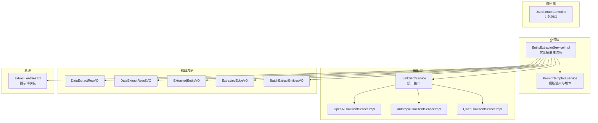
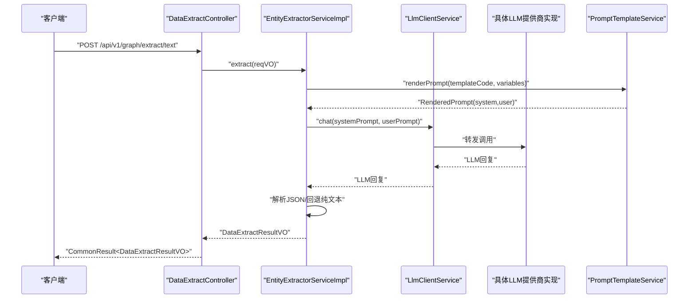
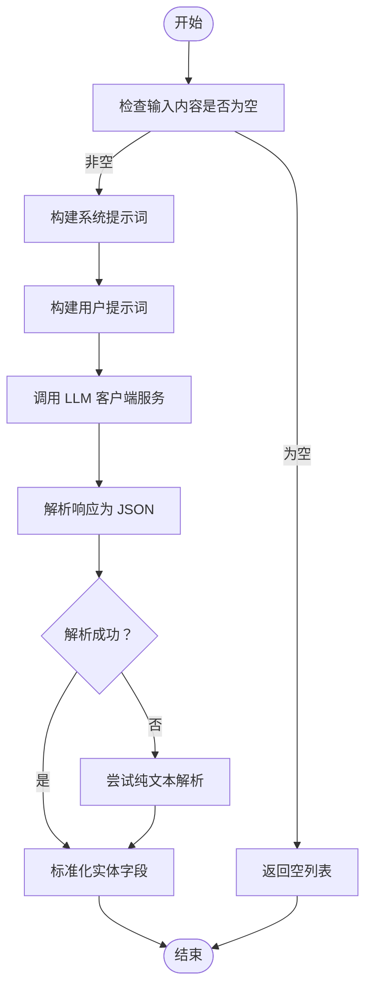
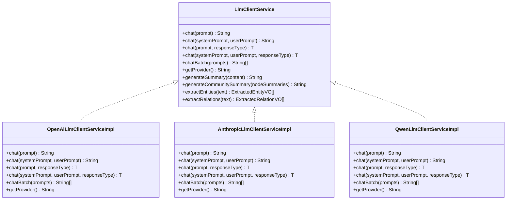
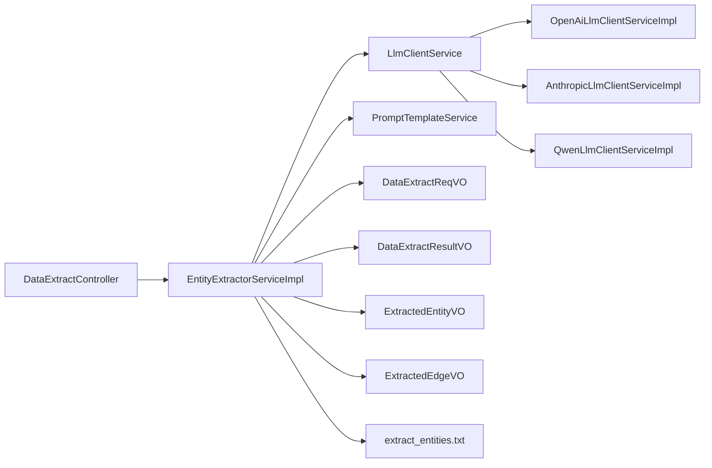

# 实体抽取

<!--<cite>
**本文引用的文件**
- [EntityExtractorServiceImpl.java](file://ontograph-module-core/src/main/java/com/graphiti/module/graphiti/service/impl/EntityExtractorServiceImpl.java)
- [EntityExtractorService.java](file://ontograph-module-core/src/main/java/com/graphiti/module/graphiti/service/EntityExtractorService.java)
- [LlmClientService.java](file://ontograph-module-core/src/main/java/com/graphiti/module/graphiti/service/LlmClientService.java)
- [PromptTemplateService.java](file://ontograph-module-core/src/main/java/com/graphiti/module/graphiti/service/PromptTemplateService.java)
- [OpenAiLlmClientServiceImpl.java](file://ontograph-module-core/src/main/java/com/graphiti/module/graphiti/service/impl/ai/OpenAiLlmClientServiceImpl.java)
- [AnthropicLlmClientServiceImpl.java](file://ontograph-module-core/src/main/java/com/graphiti/module/graphiti/service/impl/ai/AnthropicLlmClientServiceImpl.java)
- [QwenLlmClientServiceImpl.java](file://ontograph-module-core/src/main/java/com/graphiti/module/graphiti/service/impl/ai/QwenLlmClientServiceImpl.java)
- [DataExtractController.java](file://ontograph-module-core/src/main/java/com/graphiti/module/graphiti/controller/admin/DataExtractController.java)
- [DataExtractReqVO.java](file://ontograph-module-core/src/main/java/com/graphiti/module/graphiti/vo/extractor/DataExtractReqVO.java)
- [DataExtractResultVO.java](file://ontograph-module-core/src/main/java/com/graphiti/module/graphiti/vo/extractor/DataExtractResultVO.java)
- [ExtractedEntityVO.java（抽取结果）](file://ontograph-module-core/src/main/java/com/graphiti/module/graphiti/vo/extractor/ExtractedEntityVO.java)
- [ExtractedEdgeVO.java](file://ontograph-module-core/src/main/java/com/graphiti/module/graphiti/vo/extractor/ExtractedEdgeVO.java)
- [BatchExtractEntitiesVO.java](file://ontograph-module-core/src/main/java/com/graphiti/module/graphiti/vo/extractor/BatchExtractEntitiesVO.java)
- [extract_entities.txt](file://ontograph-module-core/src/main/resources/prompts/extract_entities.txt)
</cite>-->

## 目录
1. [简介](#简介)
2. [项目结构](#项目结构)
3. [核心组件](#核心组件)
4. [架构总览](#架构总览)
5. [详细组件分析](#详细组件分析)
6. [依赖分析](#依赖分析)
7. [性能考虑](#性能考虑)
8. [故障排查指南](#故障排查指南)
9. [结论](#结论)
10. [附录](#附录)

## 简介
本文件面向“实体抽取”功能的技术文档，聚焦于 AI 驱动的实体识别算法实现，涵盖提示词工程、大语言模型（LLM）调用流程、实体标准化处理、输入输出格式、质量控制机制、性能优化策略以及多 LLM 提供商集成与配置管理。读者将能够理解从原始文本到结构化实体的完整链路，并掌握如何扩展与优化该能力。

## 项目结构
实体抽取能力主要分布在以下模块与文件中：
- 控制层：对外暴露 HTTP 接口，接收请求并返回结果
- 业务层：封装实体抽取的核心逻辑，负责提示词构建、调用 LLM、解析响应与标准化
- 适配层：对不同 LLM 提供商（OpenAI、Anthropic、Qwen）进行统一抽象与实现
- 模板层：支持基于模板的提示词渲染与版本化管理
- 视图对象：定义请求参数、响应结构与实体表示模型



图表来源
- [DataExtractController.java:1-279](file://ontograph-module-core/src/main/java/com/graphiti/module/graphiti/controller/admin/DataExtractController.java#L1-L279)
- [EntityExtractorServiceImpl.java:1-306](file://ontograph-module-core/src/main/java/com/graphiti/module/graphiti/service/impl/EntityExtractorServiceImpl.java#L1-L306)
- [LlmClientService.java:1-158](file://ontograph-module-core/src/main/java/com/graphiti/module/graphiti/service/LlmClientService.java#L1-L158)
- [OpenAiLlmClientServiceImpl.java:1-111](file://ontograph-module-core/src/main/java/com/graphiti/module/graphiti/service/impl/ai/OpenAiLlmClientServiceImpl.java#L1-L111)
- [AnthropicLlmClientServiceImpl.java:1-112](file://ontograph-module-core/src/main/java/com/graphiti/module/graphiti/service/impl/ai/AnthropicLlmClientServiceImpl.java#L1-L112)
- [QwenLlmClientServiceImpl.java:1-98](file://ontograph-module-core/src/main/java/com/graphiti/module/graphiti/service/impl/ai/QwenLlmClientServiceImpl.java#L1-L98)
- [PromptTemplateService.java:1-110](file://ontograph-module-core/src/main/java/com/graphiti/module/graphiti/service/PromptTemplateService.java#L1-L110)
- [extract_entities.txt:1-28](file://ontograph-module-core/src/main/resources/prompts/extract_entities.txt#L1-L28)

章节来源
- [DataExtractController.java:1-279](file://ontograph-module-core/src/main/java/com/graphiti/module/graphiti/controller/admin/DataExtractController.java#L1-L279)
- [EntityExtractorServiceImpl.java:1-306](file://ontograph-module-core/src/main/java/com/graphiti/module/graphiti/service/impl/EntityExtractorServiceImpl.java#L1-L306)

## 核心组件
- 实体抽取服务实现：负责提示词构建、调用 LLM、解析响应、实体标准化与容错处理
- LLM 客户端服务接口与实现：屏蔽不同提供商差异，统一聊天、结构化解析与批处理
- 提示词模板服务：支持模板渲染、变量替换、版本管理
- 控制器：对外提供文本/JSON/仅实体/仅关系等接口，封装请求校验与结果包装
- VO 模型：定义请求参数、响应结构与实体表示模型

章节来源
- [EntityExtractorService.java:1-63](file://ontograph-module-core/src/main/java/com/graphiti/module/graphiti/service/EntityExtractorService.java#L1-L63)
- [LlmClientService.java:1-158](file://ontograph-module-core/src/main/java/com/graphiti/module/graphiti/service/LlmClientService.java#L1-L158)
- [PromptTemplateService.java:1-110](file://ontograph-module-core/src/main/java/com/graphiti/module/graphiti/service/PromptTemplateService.java#L1-L110)
- [DataExtractController.java:1-279](file://ontograph-module-core/src/main/java/com/graphiti/module/graphiti/controller/admin/DataExtractController.java#L1-L279)

## 架构总览
实体抽取采用“控制器-服务-适配器-模板-资源”的分层架构，确保：
- 控制器仅负责协议与编排
- 服务层专注提示词工程与解析逻辑
- 适配器屏蔽 LLM 提供商差异
- 模板服务支持动态与版本化提示词
- 资源文件提供基础提示词模板



图表来源
- [DataExtractController.java:48-58](file://ontograph-module-core/src/main/java/com/graphiti/module/graphiti/controller/admin/DataExtractController.java#L48-L58)
- [EntityExtractorServiceImpl.java:99-128](file://ontograph-module-core/src/main/java/com/graphiti/module/graphiti/service/impl/EntityExtractorServiceImpl.java#L99-L128)
- [LlmClientService.java:25-55](file://ontograph-module-core/src/main/java/com/graphiti/module/graphiti/service/LlmClientService.java#L25-L55)
- [OpenAiLlmClientServiceImpl.java:42-97](file://ontograph-module-core/src/main/java/com/graphiti/module/graphiti/service/impl/ai/OpenAiLlmClientServiceImpl.java#L42-L97)
- [AnthropicLlmClientServiceImpl.java:42-98](file://ontograph-module-core/src/main/java/com/graphiti/module/graphiti/service/impl/ai/AnthropicLlmClientServiceImpl.java#L42-L98)
- [QwenLlmClientServiceImpl.java:28-84](file://ontograph-module-core/src/main/java/com/graphiti/module/graphiti/service/impl/ai/QwenLlmClientServiceImpl.java#L28-L84)

## 详细组件分析

### 实体抽取服务实现（EntityExtractorServiceImpl）
- 功能职责
  - 提供多种输入源的实体抽取入口：文本、JSON、消息（含历史上下文）、模板渲染
  - 构建系统提示词与用户提示词，约束提取规则与输出格式
  - 调用 LLM 客户端服务获取回复，并解析为结构化实体列表
  - 标准化实体字段：名称、类型、摘要、属性、episode 索引、置信度
  - 容错与回退：当 JSON 结构异常时尝试纯文本解析
- 关键流程
  - 输入校验 → 构建系统提示词 → 构建用户提示词 → LLM 调用 → 响应解析 → 实体标准化 → 返回结果
- 提示词工程
  - 系统提示词包含提取规则、实体类型定义、自定义指令与严格 JSON 输出格式要求
  - 用户提示词根据数据源类型拼接内容（文本/JSON/消息+历史）
- 响应解析
  - 优先解析标准 JSON；若失败则尝试从 LLM 回复中提取代码块或首个大括号包裹的对象
  - 回退策略：按“名称(类型)”格式解析纯文本行
- 实体标准化
  - 字段映射：name、entity_type、summary、episode_indices、confidence
  - episode_indices 缺省时默认为 [0]；confidence 缺省时为 null
- 模板集成
  - 支持通过模板编码与变量渲染生成最终提示词，自动选择对应源类型的模板变体



图表来源
- [EntityExtractorServiceImpl.java:52-95](file://ontograph-module-core/src/main/java/com/graphiti/module/graphiti/service/impl/EntityExtractorServiceImpl.java#L52-L95)
- [EntityExtractorServiceImpl.java:132-196](file://ontograph-module-core/src/main/java/com/graphiti/module/graphiti/service/impl/EntityExtractorServiceImpl.java#L132-L196)
- [EntityExtractorServiceImpl.java:200-283](file://ontograph-module-core/src/main/java/com/graphiti/module/graphiti/service/impl/EntityExtractorServiceImpl.java#L200-L283)
- [EntityExtractorServiceImpl.java:285-304](file://ontograph-module-core/src/main/java/com/graphiti/module/graphiti/service/impl/EntityExtractorServiceImpl.java#L285-L304)

章节来源
- [EntityExtractorServiceImpl.java:1-306](file://ontograph-module-core/src/main/java/com/graphiti/module/graphiti/service/impl/EntityExtractorServiceImpl.java#L1-L306)

### LLM 客户端服务接口与实现
- 统一接口能力
  - 单轮对话、带系统提示词对话、结构化 JSON 解析、批量调用、提供商标识
  - 默认摘要生成、社区摘要生成、内置模板实体/关系抽取
- 多提供商适配
  - OpenAI：支持私有化部署（通过 base-url 配置），默认启用
  - Anthropic：条件装配，需显式配置 provider=anthropic
  - Qwen：通过 OpenAI 兼容 API 调用，条件装配，需显式配置 provider=qwen
- 批处理机制
  - 提供 chatBatch 方法，内部以串行流式调用，便于扩展为并发批处理



图表来源
- [LlmClientService.java:17-71](file://ontograph-module-core/src/main/java/com/graphiti/module/graphiti/service/LlmClientService.java#L17-L71)
- [OpenAiLlmClientServiceImpl.java:35-110](file://ontograph-module-core/src/main/java/com/graphiti/module/graphiti/service/impl/ai/OpenAiLlmClientServiceImpl.java#L35-L110)
- [AnthropicLlmClientServiceImpl.java:36-111](file://ontograph-module-core/src/main/java/com/graphiti/module/graphiti/service/impl/ai/AnthropicLlmClientServiceImpl.java#L36-L111)
- [QwenLlmClientServiceImpl.java:22-97](file://ontograph-module-core/src/main/java/com/graphiti/module/graphiti/service/impl/ai/QwenLlmClientServiceImpl.java#L22-L97)

章节来源
- [LlmClientService.java:1-158](file://ontograph-module-core/src/main/java/com/graphiti/module/graphiti/service/LlmClientService.java#L1-L158)
- [OpenAiLlmClientServiceImpl.java:1-111](file://ontograph-module-core/src/main/java/com/graphiti/module/graphiti/service/impl/ai/OpenAiLlmClientServiceImpl.java#L1-L111)
- [AnthropicLlmClientServiceImpl.java:1-112](file://ontograph-module-core/src/main/java/com/graphiti/module/graphiti/service/impl/ai/AnthropicLlmClientServiceImpl.java#L1-L112)
- [QwenLlmClientServiceImpl.java:1-98](file://ontograph-module-core/src/main/java/com/graphiti/module/graphiti/service/impl/ai/QwenLlmClientServiceImpl.java#L1-L98)

### 提示词模板服务（PromptTemplateService）
- 能力范围
  - 模板 CRUD、按类型查询、变量管理、启用/禁用、版本创建与回滚
  - 渲染提示词：支持模板编码与对象两种方式，返回系统提示词与用户提示词
- 在实体抽取中的应用
  - 根据 sourceType 选择 _text/_json/_message 模板变体
  - 若特定变体不存在则回退到默认模板
  - 注入 episode_content 与 reference_time 等基础变量

章节来源
- [PromptTemplateService.java:1-110](file://ontograph-module-core/src/main/java/com/graphiti/module/graphiti/service/PromptTemplateService.java#L1-L110)
- [EntityExtractorServiceImpl.java:100-128](file://ontograph-module-core/src/main/java/com/graphiti/module/graphiti/service/impl/EntityExtractorServiceImpl.java#L100-L128)

### 控制器（DataExtractController）
- 接口能力
  - 文本提取、JSON 文件上传提取、仅实体提取、仅关系提取、JSON 预览、默认类型查询
  - 请求参数校验、错误码封装、日志记录
- 与服务层协作
  - 将请求参数封装为 DataExtractReqVO，调用 DataExtractService 或直接调用 EntityExtractorServiceImpl
  - 返回 DataExtractResultVO，包含实体/关系统计、原始响应、错误列表与耗时

章节来源
- [DataExtractController.java:1-279](file://ontograph-module-core/src/main/java/com/graphiti/module/graphiti/controller/admin/DataExtractController.java#L1-L279)

### 输入输出格式与实体表示模型

#### DataExtractReqVO（请求参数）
- 关键字段
  - graphId、content、sourceType、sourceDescription、entityTypesConfig、edgeTypesConfig、customInstructions、previousEpisodes、referenceTime、entityOnly、edgeOnly、existingEntities、promptTemplateId、extraVariables
- 语义说明
  - 支持文本/JSON/消息三种源类型
  - previousEpisodes 用于消息上下文增强
  - entityOnly/edgeOnly 控制仅提取实体或仅提取关系
  - existingEntities 为关系提取提供候选实体

章节来源
- [DataExtractReqVO.java:1-74](file://ontograph-module-core/src/main/java/com/graphiti/module/graphiti/vo/extractor/DataExtractReqVO.java#L1-L74)

#### DataExtractResultVO（响应结构）
- 关键字段
  - entities、edges、entityCount、edgeCount、entityTypeStatistics、edgeTypeStatistics、rawResponse、errors、elapsedMs
- 语义说明
  - 包含实体与关系的统计信息与原始响应，便于审计与二次处理

章节来源
- [DataExtractResultVO.java:1-42](file://ontograph-module-core/src/main/java/com/graphiti/module/graphiti/vo/extractor/DataExtractResultVO.java#L1-L42)

#### ExtractedEntityVO（实体表示模型）
- 字段设计
  - name、entityType、entityTypeId、summary、attributes、episodeIndices、confidence
- 设计要点
  - 支持属性扩展 attributes
  - episodeIndices 记录实体出现的 episode 索引
  - confidence 用于质量控制与后续过滤

章节来源
- [ExtractedEntityVO.java（抽取结果）:1-37](file://ontograph-module-core/src/main/java/com/graphiti/module/graphiti/vo/extractor/ExtractedEntityVO.java#L1-L37)

#### ExtractedEdgeVO（关系表示模型）
- 字段设计
  - sourceEntityName、targetEntityName、relationType、fact、validAt、invalidAt、episodeIndices、confidence、attributes
- 设效用
  - 描述实体间的时间有效性与置信度

章节来源
- [ExtractedEdgeVO.java:1-41](file://ontograph-module-core/src/main/java/com/graphiti/module/graphiti/vo/extractor/ExtractedEdgeVO.java#L1-L41)

#### 批量实体提取结果（BatchExtractEntitiesVO）
- 字段设计
  - entities、totalCount、typeStatistics
- 用途
  - 用于批量场景下的实体汇总统计

章节来源
- [BatchExtractEntitiesVO.java:1-23](file://ontograph-module-core/src/main/java/com/graphiti/module/graphiti/vo/extractor/BatchExtractEntitiesVO.java#L1-L23)

### 提示词模板资源
- extract_entities.txt
  - 定义实体抽取的模板与严格 JSON 输出格式
  - 支持示例与占位符 {{text}}

章节来源
- [extract_entities.txt:1-28](file://ontograph-module-core/src/main/resources/prompts/extract_entities.txt#L1-L28)

## 依赖分析
- 控制器依赖服务层；服务层依赖 LLM 客户端与模板服务
- LLM 客户端接口被多个提供商实现类实现，通过条件装配选择具体实现
- 实体抽取服务依赖 JSON 解析与时间格式化工具



图表来源
- [DataExtractController.java:38-41](file://ontograph-module-core/src/main/java/com/graphiti/module/graphiti/controller/admin/DataExtractController.java#L38-L41)
- [EntityExtractorServiceImpl.java:28-30](file://ontograph-module-core/src/main/java/com/graphiti/module/graphiti/service/impl/EntityExtractorServiceImpl.java#L28-L30)
- [OpenAiLlmClientServiceImpl.java:35-36](file://ontograph-module-core/src/main/java/com/graphiti/module/graphiti/service/impl/ai/OpenAiLlmClientServiceImpl.java#L35-L36)
- [AnthropicLlmClientServiceImpl.java:36-37](file://ontograph-module-core/src/main/java/com/graphiti/module/graphiti/service/impl/ai/AnthropicLlmClientServiceImpl.java#L36-L37)
- [QwenLlmClientServiceImpl.java:22-23](file://ontograph-module-core/src/main/java/com/graphiti/module/graphiti/service/impl/ai/QwenLlmClientServiceImpl.java#L22-L23)

章节来源
- [EntityExtractorServiceImpl.java:1-306](file://ontograph-module-core/src/main/java/com/graphiti/module/graphiti/service/impl/EntityExtractorServiceImpl.java#L1-L306)
- [LlmClientService.java:1-158](file://ontograph-module-core/src/main/java/com/graphiti/module/graphiti/service/LlmClientService.java#L1-L158)

## 性能考虑
- 批处理机制
  - LLM 客户端提供 chatBatch 方法，当前为串行流式调用；建议在高并发场景下引入线程池与限流，避免阻塞主线程
- 响应解析优化
  - 优先解析标准 JSON，减少正则匹配开销；仅在失败时启用回退解析
- 模板渲染缓存
  - 对常用模板与变量组合进行缓存，降低重复渲染成本
- 日志与监控
  - 记录每步耗时（LLM 调用前后、解析前后），便于定位性能瓶颈
- 分页与限流
  - 控制单次请求的实体/关系数量，避免 LLM 输出过长导致解析与存储压力

## 故障排查指南
- LLM 调用失败
  - 检查 provider 配置与网络连通性；确认 base-url、API Key 正确
  - 查看服务端异常日志，关注 RuntimeException 包装信息
- 响应解析失败
  - 确认系统提示词要求严格 JSON 输出；若 LLM 返回非标准 JSON，触发回退解析
  - 检查是否存在 ```json 代码块或首尾大括号包裹的对象
- 实体缺失或重复
  - 调整实体类型定义与自定义指令，明确提取边界
  - 使用 episodeIndices 追踪实体来源，避免重复统计
- 模板渲染异常
  - 确认模板编码正确，必要时回退到默认模板
  - 检查变量注入是否完整（如 episode_content、reference_time）

章节来源
- [EntityExtractorServiceImpl.java:218-222](file://ontograph-module-core/src/main/java/com/graphiti/module/graphiti/service/impl/EntityExtractorServiceImpl.java#L218-L222)
- [AnthropicLlmClientServiceImpl.java:50-53](file://ontograph-module-core/src/main/java/com/graphiti/module/graphiti/service/impl/ai/AnthropicLlmClientServiceImpl.java#L50-L53)
- [OpenAiLlmClientServiceImpl.java:49-52](file://ontograph-module-core/src/main/java/com/graphiti/module/graphiti/service/impl/ai/OpenAiLlmClientServiceImpl.java#L49-L52)
- [QwenLlmClientServiceImpl.java:36-39](file://ontograph-module-core/src/main/java/com/graphiti/module/graphiti/service/impl/ai/QwenLlmClientServiceImpl.java#L36-L39)

## 结论
实体抽取功能通过清晰的分层架构与统一的 LLM 客户端接口，实现了对多数据源的 AI 驱动实体识别。提示词工程与模板系统提供了强大的可配置性，而完善的解析与回退策略保障了鲁棒性。结合批处理、缓存与监控，可在生产环境中获得稳定且高性能的实体抽取能力。

## 附录

### 质量控制机制
- 置信度评分
  - 实体与关系支持 confidence 字段，可用于后续阈值过滤与人工审核
- 多轮验证
  - 通过 customInstructions 与 entityTypesConfig 精细化约束提取行为
- 人工审核
  - 通过 DataExtractResultVO.existingEntities 与实体详情进行人工复核与修正

章节来源
- [ExtractedEntityVO.java（抽取结果）:34-35](file://ontograph-module-core/src/main/java/com/graphiti/module/graphiti/vo/extractor/ExtractedEntityVO.java#L34-L35)
- [ExtractedEdgeVO.java:35-36](file://ontograph-module-core/src/main/java/com/graphiti/module/graphiti/vo/extractor/ExtractedEdgeVO.java#L35-L36)
- [DataExtractController.java:129-131](file://ontograph-module-core/src/main/java/com/graphiti/module/graphiti/controller/admin/DataExtractController.java#L129-L131)

### LLM 提供商集成与配置管理
- 配置项
  - graphiti.ai.llm-provider：选择提供商（openai/anthropic/qwen）
  - 各提供商的 base-url、API Key、模型参数等由对应实现类读取
- 行为差异
  - OpenAI 默认启用；Anthropic 与 Qwen 通过条件装配启用
  - 批量调用在各实现中均提供 chatBatch，默认串行，可扩展并发

章节来源
- [OpenAiLlmClientServiceImpl.java:35-36](file://ontograph-module-core/src/main/java/com/graphiti/module/graphiti/service/impl/ai/OpenAiLlmClientServiceImpl.java#L35-L36)
- [AnthropicLlmClientServiceImpl.java:36-37](file://ontograph-module-core/src/main/java/com/graphiti/module/graphiti/service/impl/ai/AnthropicLlmClientServiceImpl.java#L36-L37)
- [QwenLlmClientServiceImpl.java:22-23](file://ontograph-module-core/src/main/java/com/graphiti/module/graphiti/service/impl/ai/QwenLlmClientServiceImpl.java#L22-L23)