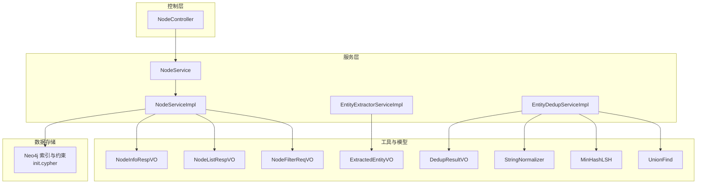
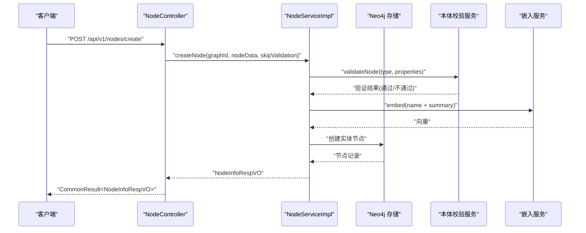
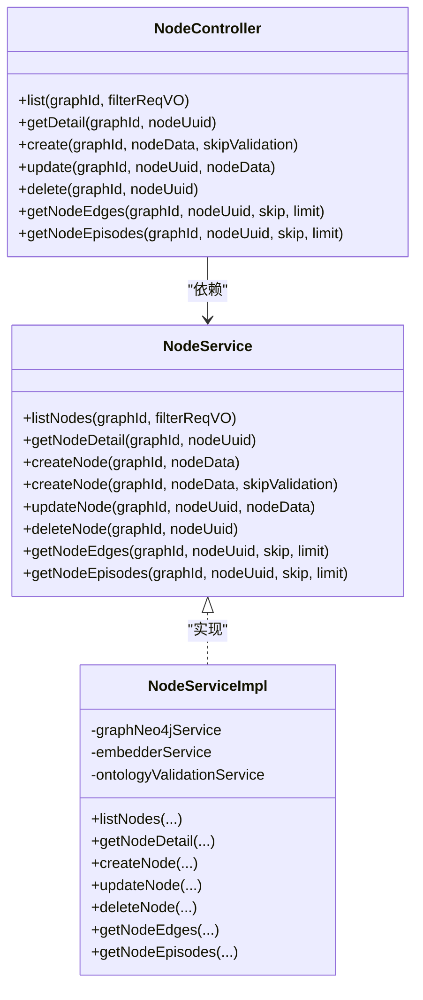
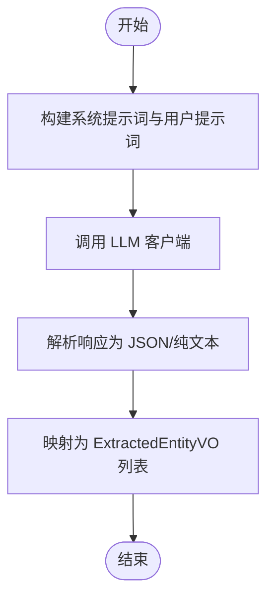
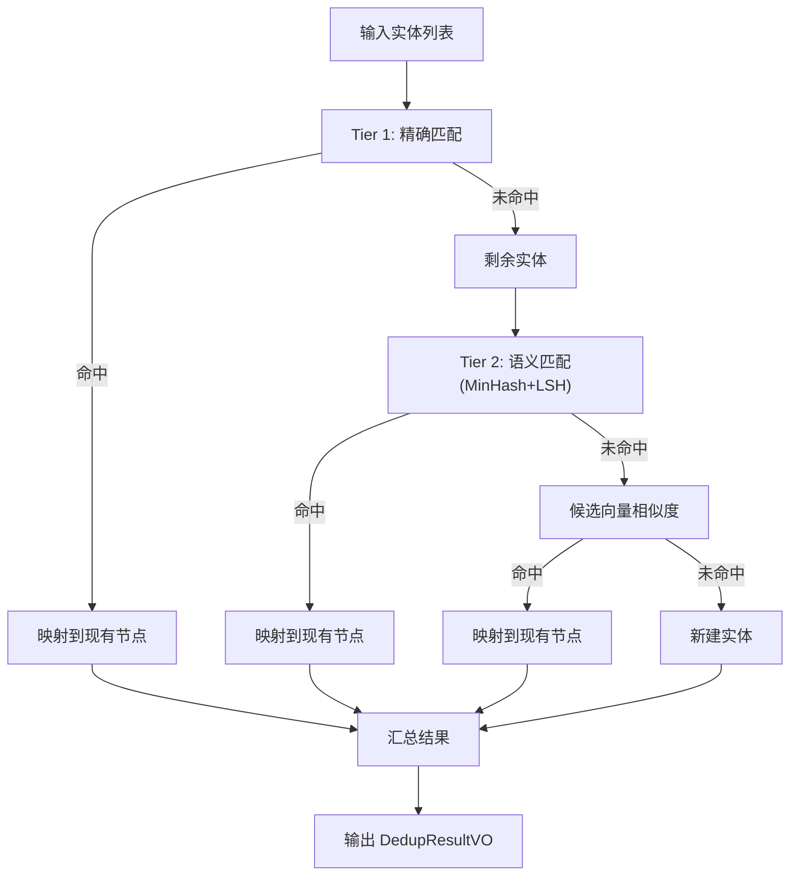
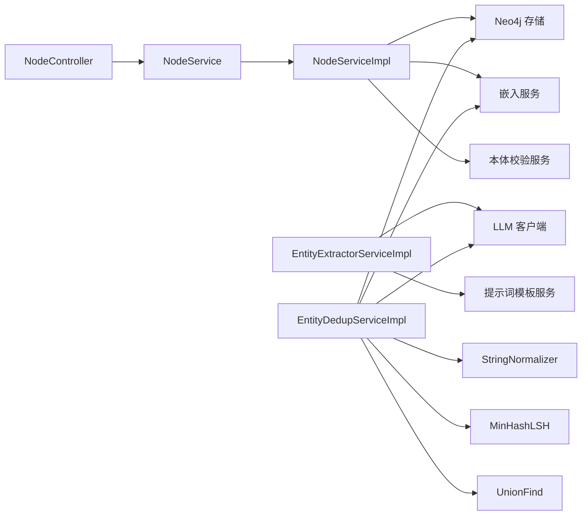

# 实体管理

<!--<cite>
**本文引用的文件**
- [NodeController.java](file://graphiti-module-core/src/main/java/com/graphiti/module/graphiti/controller/admin/NodeController.java)
- [NodeService.java](file://graphiti-module-core/src/main/java/com/graphiti/module/graphiti/service/NodeService.java)
- [NodeServiceImpl.java](file://graphiti-module-core/src/main/java/com/graphiti/module/graphiti/service/impl/NodeServiceImpl.java)
- [NodeInfoRespVO.java](file://graphiti-module-core/src/main/java/com/graphiti/module/graphiti/vo/node/NodeInfoRespVO.java)
- [NodeListRespVO.java](file://graphiti-module-core/src/main/java/com/graphiti/module/graphiti/vo/node/NodeListRespVO.java)
- [NodeFilterReqVO.java](file://graphiti-module-core/src/main/java/com/graphiti/module/graphiti/vo/node/NodeFilterReqVO.java)
- [EntityExtractorServiceImpl.java](file://graphiti-module-core/src/main/java/com/graphiti/module/graphiti/service/impl/EntityExtractorServiceImpl.java)
- [ExtractedEntityVO.java](file://graphiti-module-core/src/main/java/com/graphiti/module/graphiti/vo/extractor/ExtractedEntityVO.java)
- [EntityDedupServiceImpl.java](file://graphiti-module-core/src/main/java/com/graphiti/module/graphiti/service/impl/EntityDedupServiceImpl.java)
- [DedupResultVO.java](file://graphiti-module-core/src/main/java/com/graphiti/module/graphiti/vo/dedup/DedupResultVO.java)
- [StringNormalizer.java](file://graphiti-module-core/src/main/java/com/graphiti/module/graphiti/util/StringNormalizer.java)
- [MinHashLSH.java](file://graphiti-module-core/src/main/java/com/graphiti/module/graphiti/util/MinHashLSH.java)
- [UnionFind.java](file://graphiti-module-core/src/main/java/com/graphiti/module/graphiti/util/UnionFind.java)
- [init.cypher](file://sql/neo4j/init.cypher)
</cite>-->

## 目录
1. [简介](#简介)
2. [项目结构](#项目结构)
3. [核心组件](#核心组件)
4. [架构总览](#架构总览)
5. [详细组件分析](#详细组件分析)
6. [依赖分析](#依赖分析)
7. [性能考量](#性能考量)
8. [故障排查指南](#故障排查指南)
9. [结论](#结论)
10. [附录](#附录)

## 简介
本文件聚焦于“实体管理”能力，涵盖节点的 CRUD 操作、实体抽取与标准化、实体去重与合并、以及实体解析相关的歧义消解与上下文理解。文档基于仓库中的实际实现，提供面向开发与运维的完整技术说明，包括 API 定义、数据模型、索引策略与性能优化建议。

## 项目结构
围绕实体管理的关键模块与文件分布如下：
- 控制层：NodeController 提供节点的增删改查与关联查询接口
- 服务层：NodeService/NodeServiceImpl 实现节点业务逻辑；EntityExtractorServiceImpl 实现 AI 驱动的实体抽取；EntityDedupServiceImpl 实现三层去重策略
- VO/模型：NodeInfoRespVO、NodeListRespVO、NodeFilterReqVO、ExtractedEntityVO、DedupResultVO
- 工具类：StringNormalizer、MinHashLSH、UnionFind
- 数据库/索引：Neo4j 初始化脚本定义唯一约束与索引

图表来源
- [NodeController.java:1-143](file://graphiti-module-core/src/main/java/com/graphiti/module/graphiti/controller/admin/NodeController.java#L1-L143)
- [NodeService.java:1-79](file://graphiti-module-core/src/main/java/com/graphiti/module/graphiti/service/NodeService.java#L1-L79)
- [NodeServiceImpl.java:1-214](file://graphiti-module-core/src/main/java/com/graphiti/module/graphiti/service/impl/NodeServiceImpl.java#L1-L214)
- [EntityExtractorServiceImpl.java:1-306](file://graphiti-module-core/src/main/java/com/graphiti/module/graphiti/service/impl/EntityExtractorServiceImpl.java#L1-L306)
- [EntityDedupServiceImpl.java:1-398](file://graphiti-module-core/src/main/java/com/graphiti/module/graphiti/service/impl/EntityDedupServiceImpl.java#L1-L398)
- [StringNormalizer.java:1-82](file://graphiti-module-core/src/main/java/com/graphiti/module/graphiti/util/StringNormalizer.java#L1-L82)
- [MinHashLSH.java:1-196](file://graphiti-module-core/src/main/java/com/graphiti/module/graphiti/util/MinHashLSH.java#L1-L196)
- [UnionFind.java:1-125](file://graphiti-module-core/src/main/java/com/graphiti/module/graphiti/util/UnionFind.java#L1-L125)
- [init.cypher:1-33](file://sql/neo4j/init.cypher#L1-L33)

章节来源
- [NodeController.java:1-143](file://graphiti-module-core/src/main/java/com/graphiti/module/graphiti/controller/admin/NodeController.java#L1-L143)
- [NodeService.java:1-79](file://graphiti-module-core/src/main/java/com/graphiti/module/graphiti/service/NodeService.java#L1-L79)
- [NodeServiceImpl.java:1-214](file://graphiti-module-core/src/main/java/com/graphiti/module/graphiti/service/impl/NodeServiceImpl.java#L1-L214)
- [EntityExtractorServiceImpl.java:1-306](file://graphiti-module-core/src/main/java/com/graphiti/module/graphiti/service/impl/EntityExtractorServiceImpl.java#L1-L306)
- [EntityDedupServiceImpl.java:1-398](file://graphiti-module-core/src/main/java/com/graphiti/module/graphiti/service/impl/EntityDedupServiceImpl.java#L1-L398)
- [init.cypher:1-33](file://sql/neo4j/init.cypher#L1-L33)

## 核心组件
- 节点控制器 NodeController：暴露节点列表、详情、创建、更新、删除、关联边与 Episode 查询等 REST 接口
- 节点服务 NodeService/NodeServiceImpl：封装节点 CRUD 与关联查询，集成本体校验、嵌入向量生成与图谱元数据更新
- 实体抽取 EntityExtractorServiceImpl：基于 LLM 的文本/JSON/消息抽取，支持模板化提示词与响应解析
- 实体去重 EntityDedupServiceImpl：三层去重策略（精确匹配、语义匹配、LLM 决策），结合 MinHash+LSH、向量余弦相似度与并查集合并
- 工具类：StringNormalizer（规范化）、MinHashLSH（局部敏感哈希）、UnionFind（并查集）
- 数据模型：NodeInfoRespVO、NodeListRespVO、NodeFilterReqVO、ExtractedEntityVO、DedupResultVO

章节来源
- [NodeController.java:1-143](file://graphiti-module-core/src/main/java/com/graphiti/module/graphiti/controller/admin/NodeController.java#L1-L143)
- [NodeService.java:1-79](file://graphiti-module-core/src/main/java/com/graphiti/module/graphiti/service/NodeService.java#L1-L79)
- [NodeServiceImpl.java:1-214](file://graphiti-module-core/src/main/java/com/graphiti/module/graphiti/service/impl/NodeServiceImpl.java#L1-L214)
- [EntityExtractorServiceImpl.java:1-306](file://graphiti-module-core/src/main/java/com/graphiti/module/graphiti/service/impl/EntityExtractorServiceImpl.java#L1-L306)
- [EntityDedupServiceImpl.java:1-398](file://graphiti-module-core/src/main/java/com/graphiti/module/graphiti/service/impl/EntityDedupServiceImpl.java#L1-L398)
- [StringNormalizer.java:1-82](file://graphiti-module-core/src/main/java/com/graphiti/module/graphiti/util/StringNormalizer.java#L1-L82)
- [MinHashLSH.java:1-196](file://graphiti-module-core/src/main/java/com/graphiti/module/graphiti/util/MinHashLSH.java#L1-L196)
- [UnionFind.java:1-125](file://graphiti-module-core/src/main/java/com/graphiti/module/graphiti/util/UnionFind.java#L1-L125)

## 架构总览
下图展示实体管理端到端流程：控制层接收请求，调用服务层执行业务逻辑，服务层访问 Neo4j 存储与外部嵌入/LLM 能力，最终返回统一响应模型。

图表来源
- [NodeController.java:66-72](file://graphiti-module-core/src/main/java/com/graphiti/module/graphiti/controller/admin/NodeController.java#L66-L72)
- [NodeServiceImpl.java:64-111](file://graphiti-module-core/src/main/java/com/graphiti/module/graphiti/service/impl/NodeServiceImpl.java#L64-L111)

## 详细组件分析

### 节点管理（NodeController/NodeService/NodeServiceImpl）
- 控制器职责
  - 列表查询：支持按名称模糊、类型精确、分页参数过滤
  - 详情查询：按 UUID 获取节点信息
  - 创建节点：支持跳过本体校验（批量导入场景）
  - 删除节点：级联删除关联边并更新图谱计数
  - 关联查询：节点关联边与 Episode 列表
- 服务实现要点
  - 本体校验：若存在本体，先进行节点类型与属性校验，必要时合并注入的默认属性
  - 嵌入向量：基于 name 与 summary 生成向量，用于后续相似度与检索
  - 图谱元数据：创建/删除节点后更新节点计数（预留实现）
  - 响应转换：将底层存储映射为 NodeListRespVO/NodeInfoRespVO

图表来源
- [NodeController.java:1-143](file://graphiti-module-core/src/main/java/com/graphiti/module/graphiti/controller/admin/NodeController.java#L1-L143)
- [NodeService.java:1-79](file://graphiti-module-core/src/main/java/com/graphiti/module/graphiti/service/NodeService.java#L1-L79)
- [NodeServiceImpl.java:1-214](file://graphiti-module-core/src/main/java/com/graphiti/module/graphiti/service/impl/NodeServiceImpl.java#L1-L214)

章节来源
- [NodeController.java:35-141](file://graphiti-module-core/src/main/java/com/graphiti/module/graphiti/controller/admin/NodeController.java#L35-L141)
- [NodeService.java:13-78](file://graphiti-module-core/src/main/java/com/graphiti/module/graphiti/service/NodeService.java#L13-L78)
- [NodeServiceImpl.java:32-214](file://graphiti-module-core/src/main/java/com/graphiti/module/graphiti/service/impl/NodeServiceImpl.java#L32-L214)

### 实体抽取（EntityExtractorServiceImpl）
- 功能概述
  - 支持文本、JSON、消息三种输入源的实体抽取
  - 支持自定义实体类型与指令，以及模板化提示词
  - 响应解析：优先解析标准 JSON，回退到纯文本格式
- 抽取流程
  - 构建系统提示词与用户提示词
  - 调用 LLM 客户端获取响应
  - 解析 ExtractedEntityVO 列表（名称、类型、摘要、episode 索引、置信度）

图表来源
- [EntityExtractorServiceImpl.java:52-128](file://graphiti-module-core/src/main/java/com/graphiti/module/graphiti/service/impl/EntityExtractorServiceImpl.java#L52-L128)
- [EntityExtractorServiceImpl.java:200-304](file://graphiti-module-core/src/main/java/com/graphiti/module/graphiti/service/impl/EntityExtractorServiceImpl.java#L200-L304)

章节来源
- [EntityExtractorServiceImpl.java:36-95](file://graphiti-module-core/src/main/java/com/graphiti/module/graphiti/service/impl/EntityExtractorServiceImpl.java#L36-L95)
- [EntityExtractorServiceImpl.java:132-196](file://graphiti-module-core/src/main/java/com/graphiti/module/graphiti/service/impl/EntityExtractorServiceImpl.java#L132-L196)
- [EntityExtractorServiceImpl.java:200-304](file://graphiti-module-core/src/main/java/com/graphiti/module/graphiti/service/impl/EntityExtractorServiceImpl.java#L200-L304)

### 实体去重（EntityDedupServiceImpl）
- 三层去重策略
  - Tier 1：精确匹配（规范化字符串匹配）
  - Tier 2：语义匹配（MinHash + LSH，Jaccard 相似度阈值）
  - Tier 3：LLM 决策（对候选进行重复性判断）
- 核心算法
  - 规范化：StringNormalizer.normalizeExact
  - 语义索引：MinHashLSH 构建签名与桶，快速召回候选
  - 向量相似：余弦相似度阈值筛选
  - 合并：UnionFind 并查集按组保留代表元素
- 输出模型：DedupResultVO，包含 resolvedNodes、newNodes、uuidMapping 与统计

图表来源
- [EntityDedupServiceImpl.java:54-172](file://graphiti-module-core/src/main/java/com/graphiti/module/graphiti/service/impl/EntityDedupServiceImpl.java#L54-L172)
- [EntityDedupServiceImpl.java:344-396](file://graphiti-module-core/src/main/java/com/graphiti/module/graphiti/service/impl/EntityDedupServiceImpl.java#L344-L396)
- [StringNormalizer.java:18-23](file://graphiti-module-core/src/main/java/com/graphiti/module/graphiti/util/StringNormalizer.java#L18-L23)
- [MinHashLSH.java:48-94](file://graphiti-module-core/src/main/java/com/graphiti/module/graphiti/util/MinHashLSH.java#L48-L94)
- [UnionFind.java:36-77](file://graphiti-module-core/src/main/java/com/graphiti/module/graphiti/util/UnionFind.java#L36-L77)

章节来源
- [EntityDedupServiceImpl.java:47-50](file://graphiti-module-core/src/main/java/com/graphiti/module/graphiti/service/impl/EntityDedupServiceImpl.java#L47-L50)
- [EntityDedupServiceImpl.java:71-159](file://graphiti-module-core/src/main/java/com/graphiti/module/graphiti/service/impl/EntityDedupServiceImpl.java#L71-L159)
- [EntityDedupServiceImpl.java:240-312](file://graphiti-module-core/src/main/java/com/graphiti/module/graphiti/service/impl/EntityDedupServiceImpl.java#L240-L312)
- [DedupResultVO.java:11-72](file://graphiti-module-core/src/main/java/com/graphiti/module/graphiti/vo/dedup/DedupResultVO.java#L11-L72)

### 实体解析与上下文理解
- 实体抽取支持历史消息上下文（previousEpisodes），在提示词中注入上下文，提升跨消息的实体一致性
- 去重阶段可结合 LLM 对候选进行重复性判断，进一步降低误判风险
- 类型推断与标准化：通过默认类型配置与自定义指令，结合 LLM 输出的实体类型字段，实现类型规范化

章节来源
- [EntityExtractorServiceImpl.java:84-95](file://graphiti-module-core/src/main/java/com/graphiti/module/graphiti/service/impl/EntityExtractorServiceImpl.java#L84-L95)
- [EntityExtractorServiceImpl.java:132-165](file://graphiti-module-core/src/main/java/com/graphiti/module/graphiti/service/impl/EntityExtractorServiceImpl.java#L132-L165)
- [EntityDedupServiceImpl.java:245-267](file://graphiti-module-core/src/main/java/com/graphiti/module/graphiti/service/impl/EntityDedupServiceImpl.java#L245-L267)

## 依赖分析
- 控制层依赖服务接口，服务实现依赖 Neo4j 存储、嵌入服务与本体校验服务
- 去重服务依赖嵌入服务、Neo4j 读取现有节点、LLM 客户端
- 工具类之间低耦合，分别承担规范化、索引与合并职责

图表来源
- [NodeServiceImpl.java:28-30](file://graphiti-module-core/src/main/java/com/graphiti/module/graphiti/service/impl/NodeServiceImpl.java#L28-L30)
- [EntityExtractorServiceImpl.java:28-30](file://graphiti-module-core/src/main/java/com/graphiti/module/graphiti/service/impl/EntityExtractorServiceImpl.java#L28-L30)
- [EntityDedupServiceImpl.java:43-45](file://graphiti-module-core/src/main/java/com/graphiti/module/graphiti/service/impl/EntityDedupServiceImpl.java#L43-L45)

章节来源
- [NodeServiceImpl.java:28-30](file://graphiti-module-core/src/main/java/com/graphiti/module/graphiti/service/impl/NodeServiceImpl.java#L28-L30)
- [EntityExtractorServiceImpl.java:28-30](file://graphiti-module-core/src/main/java/com/graphiti/module/graphiti/service/impl/EntityExtractorServiceImpl.java#L28-L30)
- [EntityDedupServiceImpl.java:43-45](file://graphiti-module-core/src/main/java/com/graphiti/module/graphiti/service/impl/EntityDedupServiceImpl.java#L43-L45)

## 性能考量
- 索引策略（Neo4j）
  - 唯一性约束：实体与事件节点的 uuid
  - 索引：group_id、name；全文索引：name 与 summary
  - 关系索引：RELATES_TO 关系的 type
- 去重性能
  - MinHash+LSH：通过签名与分桶快速召回候选，降低全量 Jaccard 计算成本
  - 向量相似：仅对候选集计算余弦相似度，阈值控制减少无效比较
  - 并查集：高效合并重复组，避免多次遍历
- 响应解析健壮性：优先解析结构化 JSON，回退到纯文本解析，提升鲁棒性

章节来源
- [init.cypher:3-32](file://sql/neo4j/init.cypher#L3-L32)
- [MinHashLSH.java:48-94](file://graphiti-module-core/src/main/java/com/graphiti/module/graphiti/util/MinHashLSH.java#L48-L94)
- [EntityExtractorServiceImpl.java:285-304](file://graphiti-module-core/src/main/java/com/graphiti/module/graphiti/service/impl/EntityExtractorServiceImpl.java#L285-L304)

## 故障排查指南
- 节点创建失败
  - 检查本体校验是否通过；若启用本体，确保 type 与属性符合约束
  - 校验名称非空；确认嵌入服务可用
- 去重结果异常
  - 检查实体名称规范化是否正确；确认 MinHash 参数与阈值设置合理
  - 若 LLM 去重失败，查看日志并确认提示词模板与上下文拼接
- 响应解析失败
  - LLM 返回非结构化内容时，检查解析回退逻辑是否生效

章节来源
- [NodeServiceImpl.java:74-87](file://graphiti-module-core/src/main/java/com/graphiti/module/graphiti/service/impl/NodeServiceImpl.java#L74-L87)
- [EntityExtractorServiceImpl.java:218-222](file://graphiti-module-core/src/main/java/com/graphiti/module/graphiti/service/impl/EntityExtractorServiceImpl.java#L218-L222)
- [EntityDedupServiceImpl.java:308-311](file://graphiti-module-core/src/main/java/com/graphiti/module/graphiti/service/impl/EntityDedupServiceImpl.java#L308-L311)

## 结论
本实体管理子系统以清晰的分层设计实现了从数据抽取、标准化、去重到存储的闭环。通过三层去重策略与工具类的组合，兼顾了准确性与性能；同时，统一的 VO 模型与 Neo4j 索引策略为后续扩展与优化提供了良好基础。

## 附录

### API 文档（节点管理）
- 获取节点列表
  - 方法：GET
  - 路径：/api/v1/nodes/list
  - 请求参数：
    - graphId：图谱ID（必填）
    - filterReqVO：NodeFilterReqVO（名称模糊、类型精确、分页）
  - 响应：CommonResult<List<NodeListRespVO>>
- 获取节点详情
  - 方法：GET
  - 路径：/api/v1/nodes/{nodeUuid}
  - 请求参数：
    - graphId：图谱ID（必填）
    - nodeUuid：节点UUID（必填）
  - 响应：CommonResult<NodeInfoRespVO>
- 创建节点
  - 方法：POST
  - 路径：/api/v1/nodes/create
  - 请求参数：
    - graphId：图谱ID（必填）
    - nodeData：Map（name/type/summary/properties）
    - skipValidation：是否跳过本体校验（可选，默认 false）
  - 响应：CommonResult<NodeInfoRespVO>
- 更新节点
  - 方法：PUT
  - 路径：/api/v1/nodes/{nodeUuid}
  - 请求参数：
    - graphId：图谱ID（必填）
    - nodeUuid：节点UUID（必填）
    - nodeData：Map（更新属性）
  - 响应：CommonResult<NodeInfoRespVO>
- 删除节点
  - 方法：DELETE
  - 路径：/api/v1/nodes/{nodeUuid}
  - 请求参数：
    - graphId：图谱ID（必填）
    - nodeUuid：节点UUID（必填）
  - 响应：CommonResult<Void>
- 获取节点关联边
  - 方法：GET
  - 路径：/api/v1/nodes/{nodeUuid}/edges
  - 请求参数：
    - graphId：图谱ID（必填）
    - nodeUuid：节点UUID（必填）
    - skip/limit：分页参数
  - 响应：CommonResult<List<EdgeListRespVO>>
- 获取节点关联 Episode
  - 方法：GET
  - 路径：/api/v1/nodes/{nodeUuid}/episodes
  - 请求参数：
    - graphId：图谱ID（必填）
    - nodeUuid：节点UUID（必填）
    - skip/limit：分页参数
  - 响应：CommonResult<List<Map<String, Object>>>

章节来源
- [NodeController.java:35-141](file://graphiti-module-core/src/main/java/com/graphiti/module/graphiti/controller/admin/NodeController.java#L35-L141)

### 数据模型定义
- 节点详情响应 NodeInfoRespVO
  - 字段：uuid、name、type、properties、summary、groupId、createdAt、validAt、invalidAt、labels、attributes
- 节点列表响应 NodeListRespVO
  - 字段：uuid、name、type、label、groupId、createdAt、summary、attributes、properties
- 节点过滤请求 NodeFilterReqVO
  - 字段：name、type、skip、limit
- 实体抽取结果 ExtractedEntityVO
  - 字段：name、entityType、entityTypeId、summary、attributes、episodeIndices、confidence
- 去重结果 DedupResultVO
  - 字段：resolvedNodes、newNodes、uuidMapping、stats（包含原始数量、精确匹配、语义匹配、LLM 去重、最终数量）

章节来源
- [NodeInfoRespVO.java:11-70](file://graphiti-module-core/src/main/java/com/graphiti/module/graphiti/vo/node/NodeInfoRespVO.java#L11-L70)
- [NodeListRespVO.java:11-60](file://graphiti-module-core/src/main/java/com/graphiti/module/graphiti/vo/node/NodeListRespVO.java#L11-L60)
- [NodeFilterReqVO.java:10-33](file://graphiti-module-core/src/main/java/com/graphiti/module/graphiti/vo/node/NodeFilterReqVO.java#L10-L33)
- [ExtractedEntityVO.java:12-37](file://graphiti-module-core/src/main/java/com/graphiti/module/graphiti/vo/extractor/ExtractedEntityVO.java#L12-L37)
- [DedupResultVO.java:11-72](file://graphiti-module-core/src/main/java/com/graphiti/module/graphiti/vo/dedup/DedupResultVO.java#L11-L72)

### 索引策略与初始化
- Neo4j 初始化脚本
  - 唯一性约束：实体与事件节点 uuid
  - 索引：实体/事件 group_id、实体 name；全文索引：实体 name 与 summary
  - 关系索引：RELATES_TO 关系 type

章节来源
- [init.cypher:3-32](file://sql/neo4j/init.cypher#L3-L32)