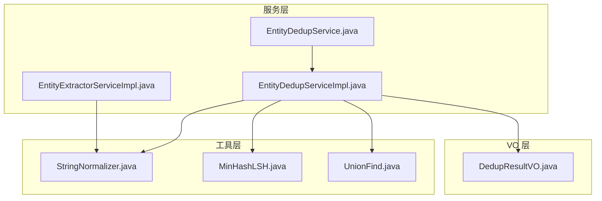
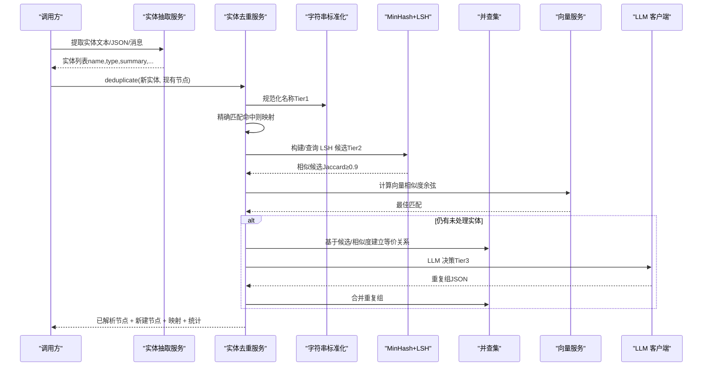
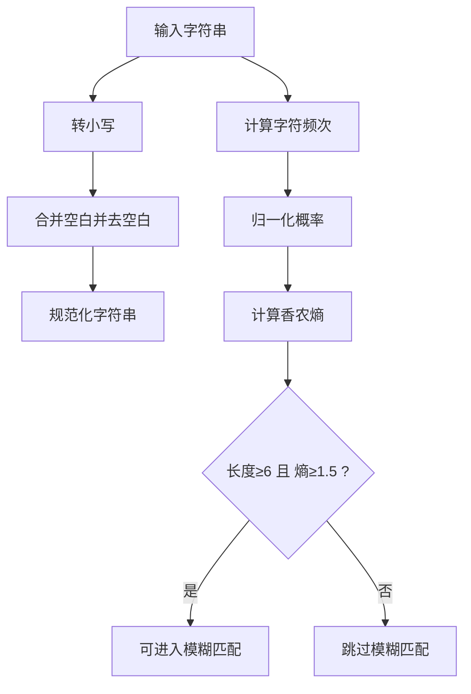
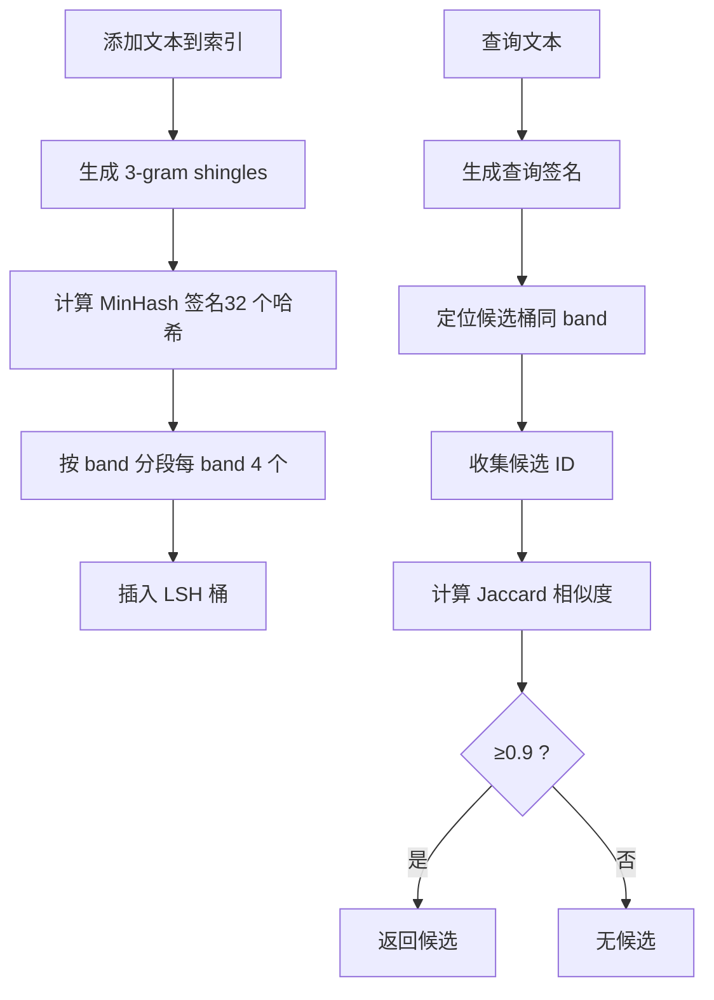
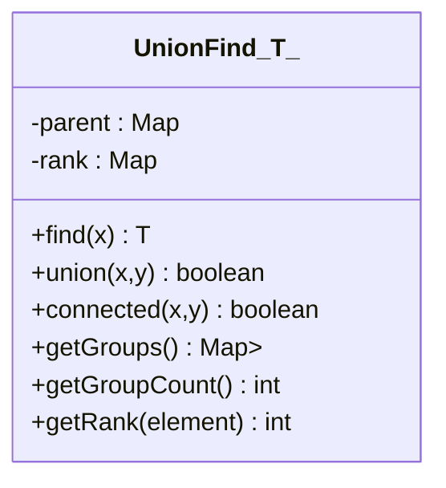
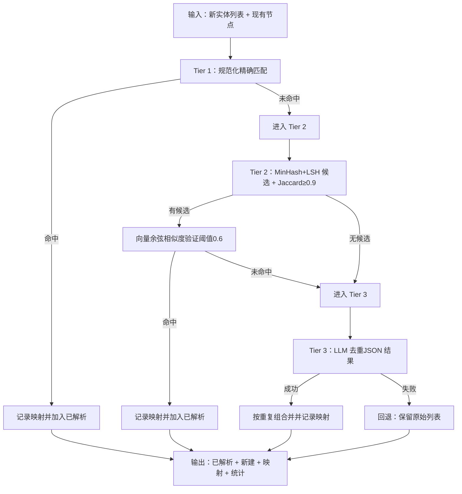
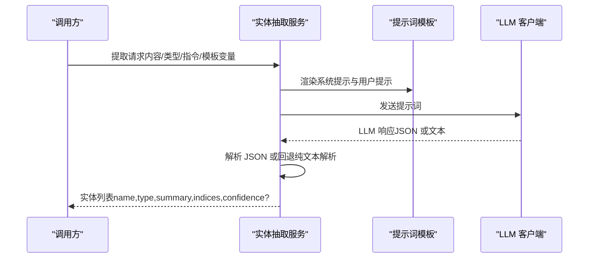
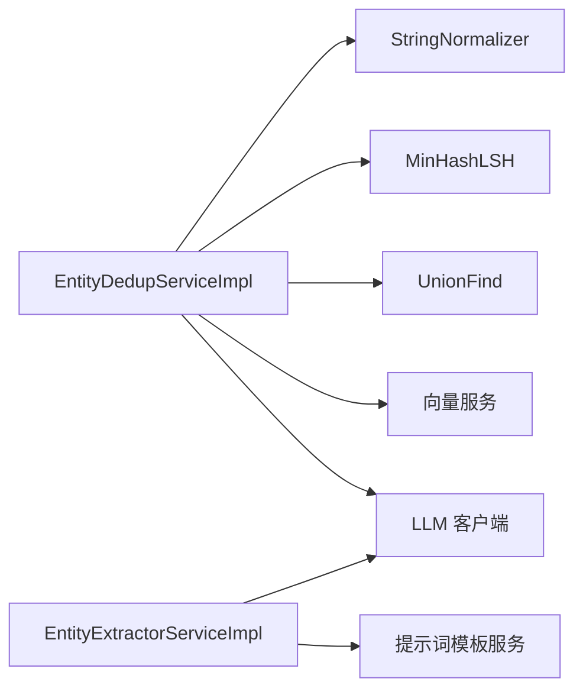

# 实体解析

<cite>
**本文引用的文件**
- [StringNormalizer.java](file://graphiti-module-core/src/main/java/com/graphiti/module/graphiti/util/StringNormalizer.java)
- [UnionFind.java](file://graphiti-module-core/src/main/java/com/graphiti/module/graphiti/util/UnionFind.java)
- [MinHashLSH.java](file://graphiti-module-core/src/main/java/com/graphiti/module/graphiti/util/MinHashLSH.java)
- [EntityDedupServiceImpl.java](file://graphiti-module-core/src/main/java/com/graphiti/module/graphiti/service/impl/EntityDedupServiceImpl.java)
- [EntityDedupService.java](file://graphiti-module-core/src/main/java/com/graphiti/module/graphiti/service/EntityDedupService.java)
- [EntityExtractorServiceImpl.java](file://graphiti-module-core/src/main/java/com/graphiti/module/graphiti/service/impl/EntityExtractorServiceImpl.java)
- [DedupResultVO.java](file://graphiti-module-core/src/main/java/com/graphiti/module/graphiti/vo/dedup/DedupResultVO.java)
</cite>

## 目录
1. [简介](#简介)
2. [项目结构](#项目结构)
3. [核心组件](#核心组件)
4. [架构总览](#架构总览)
5. [详细组件分析](#详细组件分析)
6. [依赖关系分析](#依赖关系分析)
7. [性能考量](#性能考量)
8. [故障排查指南](#故障排查指南)
9. [结论](#结论)
10. [附录](#附录)

## 简介
本文件系统性阐述图谱项目中的实体解析能力，重点覆盖以下方面：
- 三层去重策略：精确匹配（Tier 1）、语义匹配（Tier 2，MinHash+LSH）、LLM 决策（Tier 3）
- 上下文理解、类型推断与语义关联分析的实现路径
- 字符串标准化（StringNormalizer）在去重中的作用与策略
- 并查集（UnionFind）在实体等价关系建立中的应用
- 质量评估指标（准确率、召回率、F1 分数）的计算思路与落地建议
- 配置项（解析策略、阈值、规则）与可调参数
- 解析失败的回退机制与人工干预流程
- 对图谱质量与用户体验的影响

## 项目结构
实体解析相关代码主要位于核心模块 graphiti-module-core 中，采用“服务层 + 工具层 + VO 层”的分层组织：
- 工具层：字符串标准化、MinHash+LSH、并查集
- 服务层：实体抽取、实体去重
- VO 层：去重结果模型

**图表来源**
- [StringNormalizer.java:1-82](file://graphiti-module-core/src/main/java/com/graphiti/module/graphiti/util/StringNormalizer.java#L1-L82)
- [MinHashLSH.java:1-196](file://graphiti-module-core/src/main/java/com/graphiti/module/graphiti/util/MinHashLSH.java#L1-L196)
- [UnionFind.java:1-125](file://graphiti-module-core/src/main/java/com/graphiti/module/graphiti/util/UnionFind.java#L1-L125)
- [EntityExtractorServiceImpl.java:1-306](file://graphiti-module-core/src/main/java/com/graphiti/module/graphiti/service/impl/EntityExtractorServiceImpl.java#L1-L306)
- [EntityDedupServiceImpl.java:1-398](file://graphiti-module-core/src/main/java/com/graphiti/module/graphiti/service/impl/EntityDedupServiceImpl.java#L1-L398)
- [EntityDedupService.java:1-69](file://graphiti-module-core/src/main/java/com/graphiti/module/graphiti/service/EntityDedupService.java#L1-L69)
- [DedupResultVO.java:1-72](file://graphiti-module-core/src/main/java/com/graphiti/module/graphiti/vo/dedup/DedupResultVO.java#L1-L72)

**章节来源**
- [EntityDedupServiceImpl.java:21-37](file://graphiti-module-core/src/main/java/com/graphiti/module/graphiti/service/impl/EntityDedupServiceImpl.java#L21-L37)
- [EntityDedupService.java:8-24](file://graphiti-module-core/src/main/java/com/graphiti/module/graphiti/service/EntityDedupService.java#L8-L24)

## 核心组件
- 字符串标准化（StringNormalizer）
  - 提供精确匹配所需的规范化字符串（小写、多余空白合并、去空白）
  - 提供模糊匹配前置条件检查（长度阈值、香农熵）
- MinHash+LSH（MinHashLSH）
  - 三层策略中的第二层：基于 MinHash 签名与 LSH 分桶的近似去重
  - Jaccard 相似度阈值固定为 0.9
- 并查集（UnionFind）
  - 在语义匹配与 LLM 去重中，用于建立实体间的等价关系与分组
- 实体去重服务（EntityDedupServiceImpl）
  - 实现三层去重策略，输出已解析节点、新建节点与映射关系
  - 提供精确匹配、语义匹配、LLM 去重的独立方法
- 实体抽取服务（EntityExtractorServiceImpl）
  - 通过提示词与 LLM 从文本/JSON/消息中抽取实体，产出实体名称、类型、摘要等
- 去重结果 VO（DedupResultVO）
  - 封装去重结果与统计信息

**章节来源**
- [StringNormalizer.java:11-80](file://graphiti-module-core/src/main/java/com/graphiti/module/graphiti/util/StringNormalizer.java#L11-L80)
- [MinHashLSH.java:11-26](file://graphiti-module-core/src/main/java/com/graphiti/module/graphiti/util/MinHashLSH.java#L11-L26)
- [UnionFind.java:3-14](file://graphiti-module-core/src/main/java/com/graphiti/module/graphiti/util/UnionFind.java#L3-L14)
- [EntityDedupServiceImpl.java:21-37](file://graphiti-module-core/src/main/java/com/graphiti/module/graphiti/service/impl/EntityDedupServiceImpl.java#L21-L37)
- [EntityExtractorServiceImpl.java:19-48](file://graphiti-module-core/src/main/java/com/graphiti/module/graphiti/service/impl/EntityExtractorServiceImpl.java#L19-L48)
- [DedupResultVO.java:8-36](file://graphiti-module-core/src/main/java/com/graphiti/module/graphiti/vo/dedup/DedupResultVO.java#L8-L36)

## 架构总览
实体解析的整体流程分为“抽取—去重—入库”三个阶段，其中去重采用三层策略：
- Tier 1：规范化字符串精确匹配
- Tier 2：MinHash+LSH 的语义近似匹配（Jaccard ≥ 0.9）
- Tier 3：向量余弦相似度与 LLM 决策兜底

**图表来源**
- [EntityExtractorServiceImpl.java:52-95](file://graphiti-module-core/src/main/java/com/graphiti/module/graphiti/service/impl/EntityExtractorServiceImpl.java#L52-L95)
- [EntityDedupServiceImpl.java:54-172](file://graphiti-module-core/src/main/java/com/graphiti/module/graphiti/service/impl/EntityDedupServiceImpl.java#L54-L172)
- [StringNormalizer.java:18-23](file://graphiti-module-core/src/main/java/com/graphiti/module/graphiti/util/StringNormalizer.java#L18-L23)
- [MinHashLSH.java:48-94](file://graphiti-module-core/src/main/java/com/graphiti/module/graphiti/util/MinHashLSH.java#L48-L94)
- [UnionFind.java:55-88](file://graphiti-module-core/src/main/java/com/graphiti/module/graphiti/util/UnionFind.java#L55-L88)

## 详细组件分析

### 字符串标准化（StringNormalizer）
- 精确匹配规范化
  - 将输入转为小写，合并多个空白为单个空格，并去除首尾空白
  - 用于 Tier 1 精确匹配前的预处理，提升大小写与多余空白导致的误判
- 香农熵与长度检查
  - 计算字符分布熵，结合最小长度阈值（≥6）决定是否进入模糊匹配
  - 熵值越高，字符类型多样性越大，越适合 MinHash 检测
- 适用场景
  - 作为去重流程的前置步骤，统一命名规范，减少噪声

**图表来源**
- [StringNormalizer.java:18-80](file://graphiti-module-core/src/main/java/com/graphiti/module/graphiti/util/StringNormalizer.java#L18-L80)

**章节来源**
- [StringNormalizer.java:11-80](file://graphiti-module-core/src/main/java/com/graphiti/module/graphiti/util/StringNormalizer.java#L11-L80)

### MinHash+LSH（语义匹配）
- MinHash 签名
  - 生成 3-gram 的 shingles，使用多轮哈希函数得到 MinHash 签名
  - 默认签名长度为 32，便于分 band（每 band 4 个哈希值，共 8 bands）
- LSH 分桶
  - 按 band 将签名映射到桶，查询时仅在同 band 桶内检索候选
  - 减少全量比较开销，提高大规模文本的近似相似度检索效率
- 相似度与阈值
  - 基于 MinHash 签名的匹配比例计算 Jaccard 相似度
  - 阈值固定为 0.9，高于该阈值的候选进入下一步处理

**图表来源**
- [MinHashLSH.java:48-119](file://graphiti-module-core/src/main/java/com/graphiti/module/graphiti/util/MinHashLSH.java#L48-L119)

**章节来源**
- [MinHashLSH.java:11-26](file://graphiti-module-core/src/main/java/com/graphiti/module/graphiti/util/MinHashLSH.java#L11-L26)
- [EntityDedupServiceImpl.java:95-138](file://graphiti-module-core/src/main/java/com/graphiti/module/graphiti/service/impl/EntityDedupServiceImpl.java#L95-L138)

### 并查集（UnionFind）在实体链接中的应用
- 功能
  - 支持路径压缩与按秩合并，保证查找与合并操作接近常数时间
  - 在语义匹配与 LLM 去重中，将具有等价关系的实体聚合成连通分量
- 使用场景
  - 语义匹配：对候选对执行 union，最终按根节点聚合
  - LLM 去重：根据 LLM 返回的重复组，对索引进行合并

**图表来源**
- [UnionFind.java:15-124](file://graphiti-module-core/src/main/java/com/graphiti/module/graphiti/util/UnionFind.java#L15-L124)

**章节来源**
- [UnionFind.java:3-14](file://graphiti-module-core/src/main/java/com/graphiti/module/graphiti/util/UnionFind.java#L3-L14)
- [EntityDedupServiceImpl.java:192-237](file://graphiti-module-core/src/main/java/com/graphiti/module/graphiti/service/impl/EntityDedupServiceImpl.java#L192-L237)
- [EntityDedupServiceImpl.java:286-312](file://graphiti-module-core/src/main/java/com/graphiti/module/graphiti/service/impl/EntityDedupServiceImpl.java#L286-L312)

### 实体去重服务（EntityDedupServiceImpl）
- 三层策略
  - Tier 1：规范化字符串精确匹配，命中即映射到现有节点
  - Tier 2：MinHash+LSH 候选 + Jaccard ≥ 0.9，必要时进一步向量余弦相似度验证
  - Tier 3：LLM 判定重复组，若失败则回退为原始列表
- 关键阈值
  - 余弦相似度阈值：0.6
  - LSH Jaccard 阈值：0.9
  - 候选限制：每节点最多候选数（实现中用于向量相似度候选筛选）
- 输出
  - 已解析节点（含原始名称与解析目标 UUID）
  - 新建节点（需创建新实体）
  - 名称到 UUID 的映射
  - 去重统计（原始数量、精确匹配、语义匹配、LLM 去重、最终数量）

**图表来源**
- [EntityDedupServiceImpl.java:54-172](file://graphiti-module-core/src/main/java/com/graphiti/module/graphiti/service/impl/EntityDedupServiceImpl.java#L54-L172)
- [EntityDedupServiceImpl.java:240-312](file://graphiti-module-core/src/main/java/com/graphiti/module/graphiti/service/impl/EntityDedupServiceImpl.java#L240-L312)

**章节来源**
- [EntityDedupServiceImpl.java:21-37](file://graphiti-module-core/src/main/java/com/graphiti/module/graphiti/service/impl/EntityDedupServiceImpl.java#L21-L37)
- [EntityDedupServiceImpl.java:54-172](file://graphiti-module-core/src/main/java/com/graphiti/module/graphiti/service/impl/EntityDedupServiceImpl.java#L54-L172)
- [EntityDedupServiceImpl.java:344-396](file://graphiti-module-core/src/main/java/com/graphiti/module/graphiti/service/impl/EntityDedupServiceImpl.java#L344-L396)
- [DedupResultVO.java:37-70](file://graphiti-module-core/src/main/java/com/graphiti/module/graphiti/vo/dedup/DedupResultVO.java#L37-L70)

### 实体抽取服务（EntityExtractorServiceImpl）
- 支持的数据源类型：文本、JSON、消息（可携带历史对话）
- 默认实体类型配置：人物、组织、地点、事件、概念、产品、文档、通用实体
- 提示词构建：系统提示 + 用户提示（支持自定义指令与模板变量）
- 响应解析：优先解析标准 JSON；失败时尝试纯文本解析
- 输出：实体名称、类型、摘要、出现的剧集索引、置信度（可选）

**图表来源**
- [EntityExtractorServiceImpl.java:52-95](file://graphiti-module-core/src/main/java/com/graphiti/module/graphiti/service/impl/EntityExtractorServiceImpl.java#L52-L95)
- [EntityExtractorServiceImpl.java:132-196](file://graphiti-module-core/src/main/java/com/graphiti/module/graphiti/service/impl/EntityExtractorServiceImpl.java#L132-L196)
- [EntityExtractorServiceImpl.java:200-225](file://graphiti-module-core/src/main/java/com/graphiti/module/graphiti/service/impl/EntityExtractorServiceImpl.java#L200-L225)

**章节来源**
- [EntityExtractorServiceImpl.java:34-48](file://graphiti-module-core/src/main/java/com/graphiti/module/graphiti/service/impl/EntityExtractorServiceImpl.java#L34-L48)
- [EntityExtractorServiceImpl.java:52-95](file://graphiti-module-core/src/main/java/com/graphiti/module/graphiti/service/impl/EntityExtractorServiceImpl.java#L52-L95)
- [EntityExtractorServiceImpl.java:200-225](file://graphiti-module-core/src/main/java/com/graphiti/module/graphiti/service/impl/EntityExtractorServiceImpl.java#L200-L225)

## 依赖关系分析
- 组件耦合
  - EntityDedupServiceImpl 依赖 StringNormalizer、MinHashLSH、UnionFind、向量服务与 LLM 客户端
  - EntityExtractorServiceImpl 依赖 LLM 客户端与提示词模板服务
- 外部依赖
  - 向量服务：用于余弦相似度计算
  - LLM 客户端：用于 Tier 3 的重复判定
- 潜在循环依赖
  - 当前各组件均为单向依赖，未见循环

**图表来源**
- [EntityDedupServiceImpl.java:3-11](file://graphiti-module-core/src/main/java/com/graphiti/module/graphiti/service/impl/EntityDedupServiceImpl.java#L3-L11)
- [EntityExtractorServiceImpl.java:28-30](file://graphiti-module-core/src/main/java/com/graphiti/module/graphiti/service/impl/EntityExtractorServiceImpl.java#L28-L30)

**章节来源**
- [EntityDedupServiceImpl.java:3-11](file://graphiti-module-core/src/main/java/com/graphiti/module/graphiti/service/impl/EntityDedupServiceImpl.java#L3-L11)
- [EntityExtractorServiceImpl.java:28-30](file://graphiti-module-core/src/main/java/com/graphiti/module/graphiti/service/impl/EntityExtractorServiceImpl.java#L28-L30)

## 性能考量
- 时间复杂度
  - Tier 1：O(N) 规范化 + 查找索引
  - Tier 2：MinHash+LSH 查询近似候选，典型远小于全量比较
  - Tier 3：向量相似度对候选集进行验证；LLM 调用成本最高
- 空间复杂度
  - LSH 桶与签名表占用与索引规模成正比；MinHash 签名长度固定为 32
- 优化建议
  - 控制候选上限（如实现中对候选数量的限制）以降低向量计算与 LLM 成本
  - 对高频实体与常用名称建立二级缓存
  - 异步批处理与并发控制，避免阻塞主线程

[本节为通用性能讨论，不直接分析具体文件]

## 故障排查指南
- 常见问题
  - LLM 去重失败：返回原始列表，不影响整体流程
  - 向量服务不可用：跳过向量相似度验证，仅依赖 LSH 候选
  - 规范化后为空：跳过该实体的 Tier 1 匹配
- 日志与统计
  - 服务层记录各层级命中情况与最终数量，便于定位瓶颈
  - 建议增加异常捕获与重试策略（针对外部服务）
- 人工干预
  - 对 Tier 3 的 LLM 结果进行审核与修正
  - 对边界案例（低熵、短名称）进行规则微调或人工标注

**章节来源**
- [EntityDedupServiceImpl.java:308-312](file://graphiti-module-core/src/main/java/com/graphiti/module/graphiti/service/impl/EntityDedupServiceImpl.java#L308-L312)
- [EntityDedupServiceImpl.java:71-93](file://graphiti-module-core/src/main/java/com/graphiti/module/graphiti/service/impl/EntityDedupServiceImpl.java#L71-L93)
- [EntityDedupServiceImpl.java:114-138](file://graphiti-module-core/src/main/java/com/graphiti/module/graphiti/service/impl/EntityDedupServiceImpl.java#L114-L138)

## 结论
本实现以三层策略为核心，结合字符串标准化、MinHash+LSH、向量相似度与 LLM 决策，形成从确定性到语义再到智能的渐进式去重体系。并查集在等价关系建立与分组聚合中发挥关键作用。通过合理的阈值与候选限制，可在保证质量的同时兼顾性能。建议在生产环境中持续监控统计指标与外部服务稳定性，并引入人工审核与规则迭代机制。

[本节为总结性内容，不直接分析具体文件]

## 附录

### 配置选项与阈值
- 阈值与参数
  - 余弦相似度阈值：0.6
  - LSH Jaccard 阈值：0.9
  - 候选限制：每节点最大候选数（实现中存在相关字段，便于控制成本）
  - 字符串熵阈值：1.5；最小长度：6
- 解析策略选择
  - 精确匹配（Tier 1）：适用于规范化后完全一致的实体
  - 语义匹配（Tier 2）：适用于拼写差异、缩写等语义相近但不完全相同的实体
  - LLM 决策（Tier 3）：适用于歧义高、边界案例或需要上下文理解的场景
- 规则定制
  - 实体类型定义与默认类型可在抽取阶段配置
  - 自定义指令与模板变量可用于引导 LLM 行为

**章节来源**
- [EntityDedupService.java:18-23](file://graphiti-module-core/src/main/java/com/graphiti/module/graphiti/service/EntityDedupService.java#L18-L23)
- [EntityDedupServiceImpl.java:47-50](file://graphiti-module-core/src/main/java/com/graphiti/module/graphiti/service/impl/EntityDedupServiceImpl.java#L47-L50)
- [StringNormalizer.java:68-80](file://graphiti-module-core/src/main/java/com/graphiti/module/graphiti/util/StringNormalizer.java#L68-L80)
- [EntityExtractorServiceImpl.java:34-48](file://graphiti-module-core/src/main/java/com/graphiti/module/graphiti/service/impl/EntityExtractorServiceImpl.java#L34-L48)

### 质量评估机制（指标与计算思路）
- 指标定义
  - 准确率（Precision）= 真正例 /（真正例 + 假正例）
  - 召回率（Recall）= 真正例 /（真正例 + 假反例）
  - F1 分数 = 2 × Precision×Recall /（Precision + Recall）
- 计算思路
  - 以“正确合并的实体对”为真正例；以“错误合并”为假正例；以“遗漏的重复对”为假反例
  - 建议在测试集中标注真实重复关系，结合去重结果统计 TP/FP/FN
- 统计输出
  - 去重统计 VO 提供原始数量、精确匹配、语义匹配、LLM 去重与最终数量，可作为评估输入

**章节来源**
- [DedupResultVO.java:37-70](file://graphiti-module-core/src/main/java/com/graphiti/module/graphiti/vo/dedup/DedupResultVO.java#L37-L70)

### 解析失败的处理策略与回退机制
- Tier 3 LLM 失败：回退为原始实体列表，确保流程不中断
- 向量服务异常：跳过向量验证，仅依赖 LSH 候选
- 规范化为空：跳过该实体的 Tier 1 匹配
- 建议
  - 对 Tier 3 的失败样本进行收集与复盘
  - 引入重试与降级策略，保障稳定性

**章节来源**
- [EntityDedupServiceImpl.java:308-312](file://graphiti-module-core/src/main/java/com/graphiti/module/graphiti/service/impl/EntityDedupServiceImpl.java#L308-L312)
- [EntityDedupServiceImpl.java:344-396](file://graphiti-module-core/src/main/java/com/graphiti/module/graphiti/service/impl/EntityDedupServiceImpl.java#L344-L396)

### 对图谱质量与用户体验的影响
- 图谱质量
  - 降低重复节点，提升实体一致性与可读性
  - 通过 LSH 与向量验证减少漏判与误判
- 用户体验
  - 减少重复实体带来的搜索与浏览干扰
  - Tier 3 的 LLM 决策可提升边界案例的准确性，改善用户信任度

[本节为概念性说明，不直接分析具体文件]