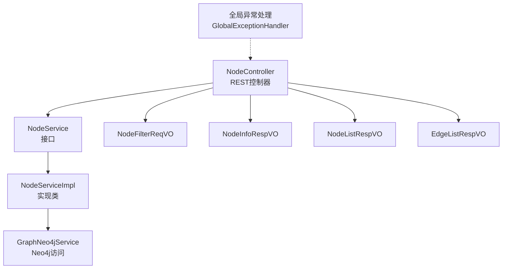
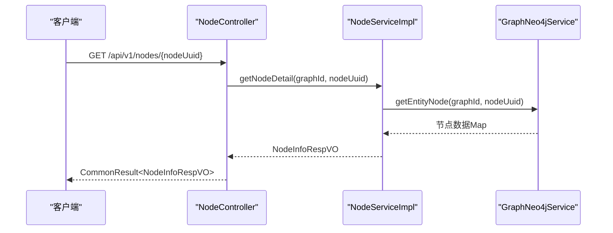
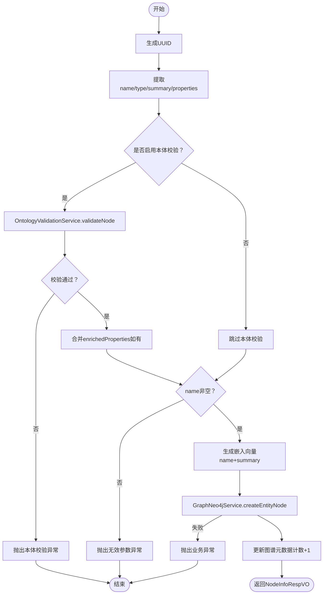
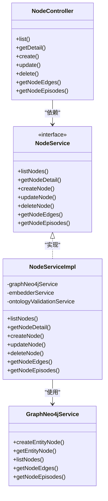

# 节点CRUD操作

<!--<cite>
**本文档引用的文件**
- [NodeController.java](file://ontograph-module-core/src/main/java/com/graphiti/module/graphiti/controller/admin/NodeController.java)
- [NodeService.java](file://ontograph-module-core/src/main/java/com/graphiti/module/graphiti/service/NodeService.java)
- [NodeServiceImpl.java](file://ontograph-module-core/src/main/java/com/graphiti/module/graphiti/service/impl/NodeServiceImpl.java)
- [NodeFilterReqVO.java](file://ontograph-module-core/src/main/java/com/graphiti/module/graphiti/vo/node/NodeFilterReqVO.java)
- [NodeInfoRespVO.java](file://ontograph-module-core/src/main/java/com/graphiti/module/graphiti/vo/node/NodeInfoRespVO.java)
- [NodeListRespVO.java](file://ontograph-module-core/src/main/java/com/graphiti/module/graphiti/vo/node/NodeListRespVO.java)
- [EdgeListRespVO.java](file://ontograph-module-core/src/main/java/com/graphiti/module/graphiti/vo/edge/EdgeListRespVO.java)
- [GraphNeo4jService.java](file://ontograph-module-core/src/main/java/com/graphiti/module/graphiti/service/GraphNeo4jService.java)
- [GlobalExceptionHandler.java](file://ontograph-framework/graphiti-common/src/main/java/com/graphiti/common/exception/GlobalExceptionHandler.java)
- [BusinessException.java](file://ontograph-framework/graphiti-common/src/main/java/com/graphiti/common/exception/BusinessException.java)
- [ResultCode.java](file://ontograph-framework/graphiti-common/src/main/java/com/graphiti/common/constants/ResultCode.java)
</cite>-->

## 目录
1. [简介](#简介)
2. [项目结构](#项目结构)
3. [核心组件](#核心组件)
4. [架构总览](#架构总览)
5. [详细组件分析](#详细组件分析)
6. [依赖分析](#依赖分析)
7. [性能考虑](#性能考虑)
8. [故障排查指南](#故障排查指南)
9. [结论](#结论)

## 简介
本文件聚焦于OntoGraph项目中“节点”的CRUD操作实现，围绕NodeController控制器提供的REST API，系统梳理节点创建、查询、更新、删除以及批量相关能力，并深入解析过滤条件设计、数据传输对象定义、节点关联边与Episode查询、错误处理机制、权限验证与性能优化策略。

## 项目结构
- 控制层：NodeController提供REST接口，负责参数接收、鉴权声明与结果封装。
- 服务层：NodeService定义节点管理接口；NodeServiceImpl实现业务逻辑，集成本体校验、嵌入向量生成、Neo4j读写等。
- 数据访问层：GraphNeo4jService封装Neo4j驱动，提供节点与边的CRUD、搜索、时序查询等能力。
- VO层：NodeFilterReqVO、NodeInfoRespVO、NodeListRespVO、EdgeListRespVO等数据传输对象，规范请求与响应结构。
- 异常与常量：全局异常处理器与业务错误码，统一错误响应格式。

图表来源
- [NodeController.java:1-143](file://ontograph-module-core/src/main/java/com/graphiti/module/graphiti/controller/admin/NodeController.java#L1-L143)
- [NodeService.java:1-79](file://ontograph-module-core/src/main/java/com/graphiti/module/graphiti/service/NodeService.java#L1-L79)
- [NodeServiceImpl.java:1-214](file://ontograph-module-core/src/main/java/com/graphiti/module/graphiti/service/impl/NodeServiceImpl.java#L1-L214)
- [GraphNeo4jService.java:1-1347](file://ontograph-module-core/src/main/java/com/graphiti/module/graphiti/service/GraphNeo4jService.java#L1-L1347)
- [GlobalExceptionHandler.java:1-74](file://ontograph-framework/graphiti-common/src/main/java/com/graphiti/common/exception/GlobalExceptionHandler.java#L1-L74)

章节来源
- [NodeController.java:1-143](file://ontograph-module-core/src/main/java/com/graphiti/module/graphiti/controller/admin/NodeController.java#L1-L143)
- [NodeService.java:1-79](file://ontograph-module-core/src/main/java/com/graphiti/module/graphiti/service/NodeService.java#L1-L79)
- [NodeServiceImpl.java:1-214](file://ontograph-module-core/src/main/java/com/graphiti/module/graphiti/service/impl/NodeServiceImpl.java#L1-L214)
- [GraphNeo4jService.java:1-1347](file://ontograph-module-core/src/main/java/com/graphiti/module/graphiti/service/GraphNeo4jService.java#L1-L1347)
- [GlobalExceptionHandler.java:1-74](file://ontograph-framework/graphiti-common/src/main/java/com/graphiti/common/exception/GlobalExceptionHandler.java#L1-L74)

## 核心组件
- NodeController：暴露节点管理REST接口，声明Bearer认证需求，使用CommonResult统一封装响应。
- NodeService/NodeServiceImpl：实现节点CRUD与关联查询，集成本体校验与嵌入向量生成。
- GraphNeo4jService：基于Neo4j驱动的节点与边操作，支持分页、过滤、全文检索、向量检索与时序查询。
- VO层：NodeFilterReqVO（过滤条件）、NodeInfoRespVO（节点详情）、NodeListRespVO（节点列表）、EdgeListRespVO（边列表）。
- 异常与常量：BusinessException、GlobalExceptionHandler、ResultCode统一错误码与异常处理。

章节来源
- [NodeController.java:23-143](file://ontograph-module-core/src/main/java/com/graphiti/module/graphiti/controller/admin/NodeController.java#L23-L143)
- [NodeService.java:13-79](file://ontograph-module-core/src/main/java/com/graphiti/module/graphiti/service/NodeService.java#L13-L79)
- [NodeServiceImpl.java:26-214](file://ontograph-module-core/src/main/java/com/graphiti/module/graphiti/service/impl/NodeServiceImpl.java#L26-L214)
- [GraphNeo4jService.java:21-1347](file://ontograph-module-core/src/main/java/com/graphiti/module/graphiti/service/GraphNeo4jService.java#L21-L1347)
- [NodeFilterReqVO.java:10-33](file://ontograph-module-core/src/main/java/com/graphiti/module/graphiti/vo/node/NodeFilterReqVO.java#L10-L33)
- [NodeInfoRespVO.java:12-70](file://ontograph-module-core/src/main/java/com/graphiti/module/graphiti/vo/node/NodeInfoRespVO.java#L12-L70)
- [NodeListRespVO.java:12-60](file://ontograph-module-core/src/main/java/com/graphiti/module/graphiti/vo/node/NodeListRespVO.java#L12-L60)
- [EdgeListRespVO.java:12-70](file://ontograph-module-core/src/main/java/com/graphiti/module/graphiti/vo/edge/EdgeListRespVO.java#L12-L70)
- [BusinessException.java:10-33](file://ontograph-framework/graphiti-common/src/main/java/com/graphiti/common/exception/BusinessException.java#L10-L33)
- [GlobalExceptionHandler.java:17-74](file://ontograph-framework/graphiti-common/src/main/java/com/graphiti/common/exception/GlobalExceptionHandler.java#L17-L74)
- [ResultCode.java:7-23](file://ontograph-framework/graphiti-common/src/main/java/com/graphiti/common/constants/ResultCode.java#L7-L23)

## 架构总览
节点CRUD涉及三层协作：控制层负责参数与鉴权，服务层执行业务规则（本体校验、嵌入生成），数据访问层对接Neo4j数据库。节点详情查询与列表查询分别映射到GraphNeo4jService的实体节点查询与分页查询。

图表来源
- [NodeController.java:48-56](file://ontograph-module-core/src/main/java/com/graphiti/module/graphiti/controller/admin/NodeController.java#L48-L56)
- [NodeServiceImpl.java:49-56](file://ontograph-module-core/src/main/java/com/graphiti/module/graphiti/service/impl/NodeServiceImpl.java#L49-L56)
- [GraphNeo4jService.java:197-209](file://ontograph-module-core/src/main/java/com/graphiti/module/graphiti/service/GraphNeo4jService.java#L197-L209)

## 详细组件分析

### REST API端点定义与行为
- 列表查询
  - 方法与路径：GET /api/v1/nodes/list
  - 请求参数：graphId（路径参数）、NodeFilterReqVO（查询体）
  - 响应：CommonResult<List<NodeListRespVO>>
  - 行为：调用NodeService.listNodes，分页返回节点列表
- 节点详情
  - 方法与路径：GET /api/v1/nodes/{nodeUuid}
  - 请求参数：graphId（查询参数）、nodeUuid（路径参数）
  - 响应：CommonResult<NodeInfoRespVO>
  - 行为：调用NodeService.getNodeDetail，不存在则抛业务异常
- 节点创建
  - 方法与路径：POST /api/v1/nodes/create
  - 请求参数：graphId（查询参数）、nodeData（请求体，包含name/type/summary/properties）、skipValidation（可选）
  - 响应：CommonResult<NodeInfoRespVO>
  - 行为：生成UUID、本体校验（可跳过）、嵌入向量生成、创建节点并更新图谱元数据计数
- 节点更新
  - 方法与路径：PUT /api/v1/nodes/{nodeUuid}
  - 请求参数：graphId（查询参数）、nodeUuid（路径参数）、nodeData（请求体）
  - 响应：CommonResult<NodeInfoRespVO>
  - 行为：当前实现抛出待实现异常（预留接口）
- 节点删除
  - 方法与路径：DELETE /api/v1/nodes/{nodeUuid}
  - 请求参数：graphId（查询参数）、nodeUuid（路径参数）
  - 响应：CommonResult<Void>
  - 行为：调用NodeService.deleteNode，删除节点并更新图谱元数据计数
- 节点关联边
  - 方法与路径：GET /api/v1/nodes/{nodeUuid}/edges
  - 请求参数：graphId（查询参数）、nodeUuid（路径参数）、skip/limit（查询参数）
  - 响应：CommonResult<List<EdgeListRespVO>>
  - 行为：GraphNeo4jService.getNodeEdges双向查询
- 节点关联Episode
  - 方法与路径：GET /api/v1/nodes/{nodeUuid}/episodes
  - 请求参数：graphId（查询参数）、nodeUuid（路径参数）、skip/limit（查询参数）
  - 响应：CommonResult<List<Map>>
  - 行为：GraphNeo4jService.getNodeEpisodes查询提及Episode

章节来源
- [NodeController.java:35-141](file://ontograph-module-core/src/main/java/com/graphiti/module/graphiti/controller/admin/NodeController.java#L35-L141)
- [NodeService.java:13-79](file://ontograph-module-core/src/main/java/com/graphiti/module/graphiti/service/NodeService.java#L13-L79)
- [NodeServiceImpl.java:32-125](file://ontograph-module-core/src/main/java/com/graphiti/module/graphiti/service/impl/NodeServiceImpl.java#L32-L125)
- [GraphNeo4jService.java:1191-1252](file://ontograph-module-core/src/main/java/com/graphiti/module/graphiti/service/GraphNeo4jService.java#L1191-L1252)

### 过滤条件设计：NodeFilterReqVO
- 字段说明
  - name：节点名称（模糊匹配）
  - type：节点类型（精确匹配）
  - skip/limit：分页控制（默认skip=0，limit=20）
- 设计要点
  - 当前NodeServiceImpl的listNodes直接透传skip/limit给GraphNeo4jService.listNodes，未对name/type做Cypher拼接过滤。
  - 若需启用name/type过滤，应在GraphNeo4jService.findNodes或listNodes中增加对应WHERE条件。

章节来源
- [NodeFilterReqVO.java:10-33](file://ontograph-module-core/src/main/java/com/graphiti/module/graphiti/vo/node/NodeFilterReqVO.java#L10-L33)
- [NodeServiceImpl.java:32-47](file://ontograph-module-core/src/main/java/com/graphiti/module/graphiti/service/impl/NodeServiceImpl.java#L32-L47)
- [GraphNeo4jService.java:218-235](file://ontograph-module-core/src/main/java/com/graphiti/module/graphiti/service/GraphNeo4jService.java#L218-L235)
- [GraphNeo4jService.java:1055-1096](file://ontograph-module-core/src/main/java/com/graphiti/module/graphiti/service/GraphNeo4jService.java#L1055-L1096)

### 数据传输对象：NodeInfoRespVO 与 NodeListRespVO
- NodeInfoRespVO（节点详情）
  - 字段：uuid/name/type/properties/summary/groupId/createdAt/validAt/invalidAt/labels/attributes
  - 用途：返回节点完整信息，转换时剔除系统字段（如uuid、name、type、summary、group_id、labels等）
- NodeListRespVO（节点列表）
  - 字段：uuid/name/type/label/groupId/createdAt/summary/attributes/properties
  - 用途：列表页展示，包含简要属性与标签
- EdgeListRespVO（边列表）
  - 字段：uuid/source/target/type/properties/name/createdAt/validAt/invalidAt/expiredAt/episodes
  - 用途：返回节点关联边的简要信息

章节来源
- [NodeInfoRespVO.java:12-70](file://ontograph-module-core/src/main/java/com/graphiti/module/graphiti/vo/node/NodeInfoRespVO.java#L12-L70)
- [NodeListRespVO.java:12-60](file://ontograph-module-core/src/main/java/com/graphiti/module/graphiti/vo/node/NodeListRespVO.java#L12-L60)
- [EdgeListRespVO.java:12-70](file://ontograph-module-core/src/main/java/com/graphiti/module/graphiti/vo/edge/EdgeListRespVO.java#L12-L70)
- [NodeServiceImpl.java:132-171](file://ontograph-module-core/src/main/java/com/graphiti/module/graphiti/service/impl/NodeServiceImpl.java#L132-L171)
- [NodeServiceImpl.java:198-212](file://ontograph-module-core/src/main/java/com/graphiti/module/graphiti/service/impl/NodeServiceImpl.java#L198-L212)

### 节点创建流程（含本体校验与嵌入向量）

图表来源
- [NodeServiceImpl.java:64-111](file://ontograph-module-core/src/main/java/com/graphiti/module/graphiti/service/impl/NodeServiceImpl.java#L64-L111)
- [GraphNeo4jService.java:41-64](file://ontograph-module-core/src/main/java/com/graphiti/module/graphiti/service/GraphNeo4jService.java#L41-L64)

章节来源
- [NodeServiceImpl.java:64-111](file://ontograph-module-core/src/main/java/com/graphiti/module/graphiti/service/impl/NodeServiceImpl.java#L64-L111)
- [GraphNeo4jService.java:41-64](file://ontograph-module-core/src/main/java/com/graphiti/module/graphiti/service/GraphNeo4jService.java#L41-L64)

### 节点详情查询与删除
- 详情查询：GraphNeo4jService.getEntityNode返回节点后，NodeServiceImpl.convertToNodeInfoRespVO剔除系统字段，返回NodeInfoRespVO；若节点不存在，抛出业务异常。
- 删除：GraphNeo4jService.deleteEntityNode执行删除，NodeServiceImpl.updateGraphNodeCount记录元数据变更（当前日志提示，后续可接入具体服务）。

章节来源
- [NodeServiceImpl.java:49-56](file://ontograph-module-core/src/main/java/com/graphiti/module/graphiti/service/impl/NodeServiceImpl.java#L49-L56)
- [NodeServiceImpl.java:119-125](file://ontograph-module-core/src/main/java/com/graphiti/module/graphiti/service/impl/NodeServiceImpl.java#L119-L125)
- [GraphNeo4jService.java:197-209](file://ontograph-module-core/src/main/java/com/graphiti/module/graphiti/service/GraphNeo4jService.java#L197-L209)
- [GraphNeo4jService.java:553-562](file://ontograph-module-core/src/main/java/com/graphiti/module/graphiti/service/GraphNeo4jService.java#L553-L562)

### 节点关联边与Episode查询
- 关联边：GraphNeo4jService.getNodeEdges双向查询（作为source或target），返回EdgeListRespVO列表。
- 关联Episode：GraphNeo4jService.getNodeEpisodes通过MENTIONS关系查询提及Episode，返回简要信息列表。

章节来源
- [NodeServiceImpl.java:183-196](file://ontograph-module-core/src/main/java/com/graphiti/module/graphiti/service/impl/NodeServiceImpl.java#L183-L196)
- [GraphNeo4jService.java:1191-1217](file://ontograph-module-core/src/main/java/com/graphiti/module/graphiti/service/GraphNeo4jService.java#L1191-L1217)
- [GraphNeo4jService.java:1226-1252](file://ontograph-module-core/src/main/java/com/graphiti/module/graphiti/service/GraphNeo4jService.java#L1226-L1252)

### 权限验证与安全
- NodeController在各操作上声明了Bearer认证需求，确保接口访问受JWT保护。
- 具体鉴权实现由框架安全模块负责，控制器仅做注解声明。

章节来源
- [NodeController.java:35-141](file://ontograph-module-core/src/main/java/com/graphiti/module/graphiti/controller/admin/NodeController.java#L35-L141)

### 错误处理机制
- 全局异常：GlobalExceptionHandler统一捕获BusinessException、参数校验异常、缺少参数异常与其他未知异常，返回CommonResult错误响应。
- 业务异常：ResultCode定义标准业务错误码，如NODE_NOT_FOUND、INVALID_PARAMETER等。
- NodeServiceImpl在节点不存在、创建失败、参数非法等场景抛出BusinessException，交由全局异常处理器处理。

章节来源
- [GlobalExceptionHandler.java:17-74](file://ontograph-framework/graphiti-common/src/main/java/com/graphiti/common/exception/GlobalExceptionHandler.java#L17-L74)
- [BusinessException.java:10-33](file://ontograph-framework/graphiti-common/src/main/java/com/graphiti/common/exception/BusinessException.java#L10-L33)
- [ResultCode.java:7-23](file://ontograph-framework/graphiti-common/src/main/java/com/graphiti/common/constants/ResultCode.java#L7-L23)
- [NodeServiceImpl.java:52-54](file://ontograph-module-core/src/main/java/com/graphiti/module/graphiti/service/impl/NodeServiceImpl.java#L52-L54)
- [NodeServiceImpl.java:103-105](file://ontograph-module-core/src/main/java/com/graphiti/module/graphiti/service/impl/NodeServiceImpl.java#L103-L105)

## 依赖分析
- 控制器依赖服务接口与VO类，服务实现依赖Neo4j访问层与嵌入向量服务。
- NodeServiceImpl与GraphNeo4jService耦合度较高，建议在复杂查询场景引入Repository/DAO抽象以降低耦合。
- 异常处理与响应封装集中在公共模块，保证跨模块一致性。

图表来源
- [NodeController.java:27-141](file://ontograph-module-core/src/main/java/com/graphiti/module/graphiti/controller/admin/NodeController.java#L27-L141)
- [NodeService.java:13-79](file://ontograph-module-core/src/main/java/com/graphiti/module/graphiti/service/NodeService.java#L13-L79)
- [NodeServiceImpl.java:26-214](file://ontograph-module-core/src/main/java/com/graphiti/module/graphiti/service/impl/NodeServiceImpl.java#L26-L214)
- [GraphNeo4jService.java:21-1347](file://ontograph-module-core/src/main/java/com/graphiti/module/graphiti/service/GraphNeo4jService.java#L21-L1347)

章节来源
- [NodeController.java:27-141](file://ontograph-module-core/src/main/java/com/graphiti/module/graphiti/controller/admin/NodeController.java#L27-L141)
- [NodeService.java:13-79](file://ontograph-module-core/src/main/java/com/graphiti/module/graphiti/service/NodeService.java#L13-L79)
- [NodeServiceImpl.java:26-214](file://ontograph-module-core/src/main/java/com/graphiti/module/graphiti/service/impl/NodeServiceImpl.java#L26-L214)
- [GraphNeo4jService.java:21-1347](file://ontograph-module-core/src/main/java/com/graphiti/module/graphiti/service/GraphNeo4jService.java#L21-L1347)

## 性能考虑
- 分页与限制：列表查询与边查询均支持skip/limit，避免一次性返回大量数据。
- 向量索引：GraphNeo4jService.initVectorIndexes初始化节点与边的向量索引，支持向量相似度检索；需在应用启动时调用。
- 全文索引：提供全文检索节点与边的能力，但需预先创建索引；若未创建会记录警告。
- 嵌入生成：创建节点时生成嵌入向量，建议在批量导入场景通过skipValidation参数跳过本体校验以提升吞吐。
- 时序查询：支持按参考时间戳查询有效节点/边，适合历史回放场景。

章节来源
- [GraphNeo4jService.java:768-791](file://ontograph-module-core/src/main/java/com/graphiti/module/graphiti/service/GraphNeo4jService.java#L768-L791)
- [GraphNeo4jService.java:658-688](file://ontograph-module-core/src/main/java/com/graphiti/module/graphiti/service/GraphNeo4jService.java#L658-L688)
- [GraphNeo4jService.java:699-762](file://ontograph-module-core/src/main/java/com/graphiti/module/graphiti/service/GraphNeo4jService.java#L699-L762)
- [NodeServiceImpl.java:60-87](file://ontograph-module-core/src/main/java/com/graphiti/module/graphiti/service/impl/NodeServiceImpl.java#L60-L87)

## 故障排查指南
- 参数缺失：缺少必需参数将被GlobalExceptionHandler捕获并返回400错误。
- 业务异常：如节点不存在（1003）、参数非法（1006）、创建失败（500）等，统一返回业务错误码与消息。
- 本体校验失败：OntologyValidationException包装校验结果，前端可据此展示具体错误项。
- Neo4j连接问题：检查驱动配置与索引状态；向量/全文索引未创建会导致相应查询失败并记录警告。

章节来源
- [GlobalExceptionHandler.java:26-72](file://ontograph-framework/graphiti-common/src/main/java/com/graphiti/common/exception/GlobalExceptionHandler.java#L26-L72)
- [ResultCode.java:15-22](file://ontograph-framework/graphiti-common/src/main/java/com/graphiti/common/constants/ResultCode.java#L15-L22)
- [NodeServiceImpl.java:52-54](file://ontograph-module-core/src/main/java/com/graphiti/module/graphiti/service/impl/NodeServiceImpl.java#L52-L54)
- [GraphNeo4jService.java:645-648](file://ontograph-module-core/src/main/java/com/graphiti/module/graphiti/service/GraphNeo4jService.java#L645-L648)

## 结论
本实现以清晰的分层架构支撑节点CRUD与关联查询：控制层统一鉴权与响应，服务层承载业务规则（本体校验、嵌入生成、分页与过滤），数据访问层专注Neo4j交互。当前更新接口预留待实现，建议尽快补齐以完善生命周期管理。通过向量与全文索引、分页与限制、时序查询等能力，系统具备良好的可扩展性与性能基础。