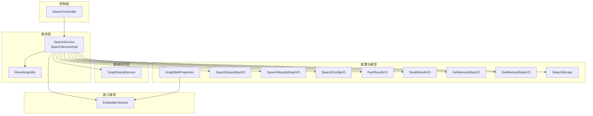
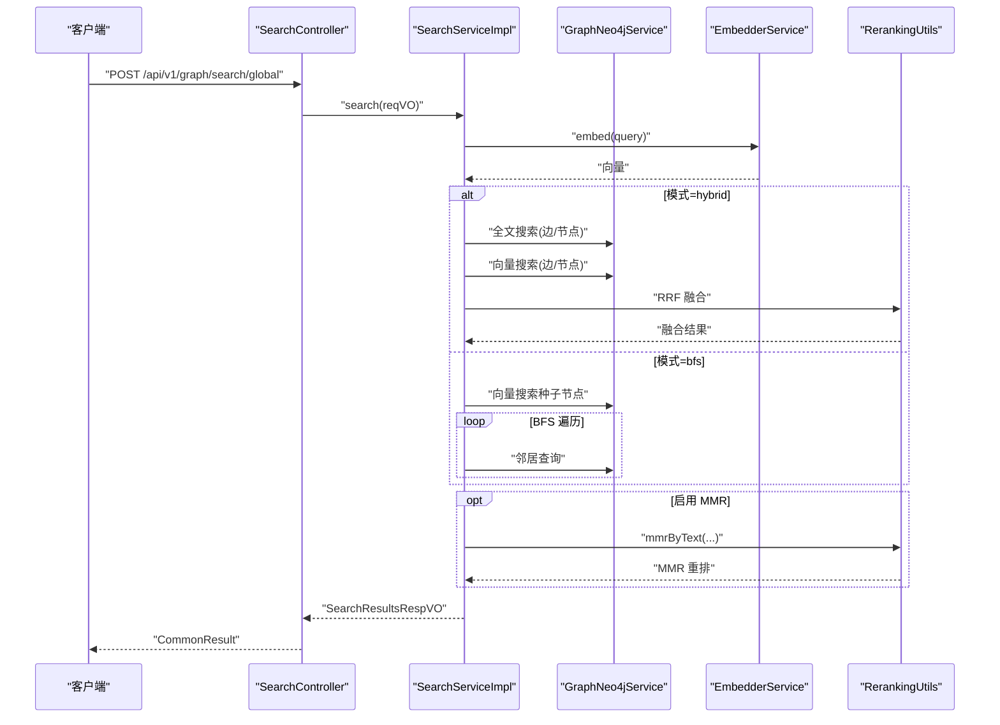
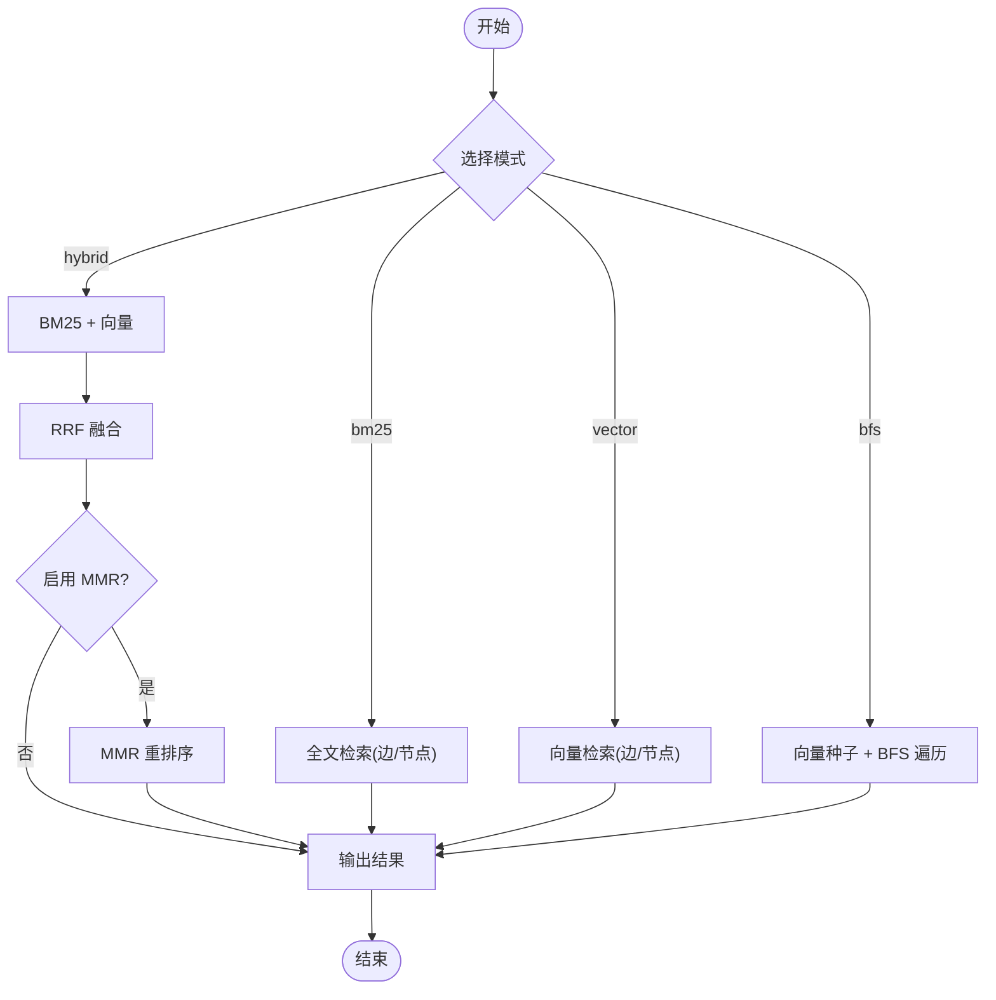
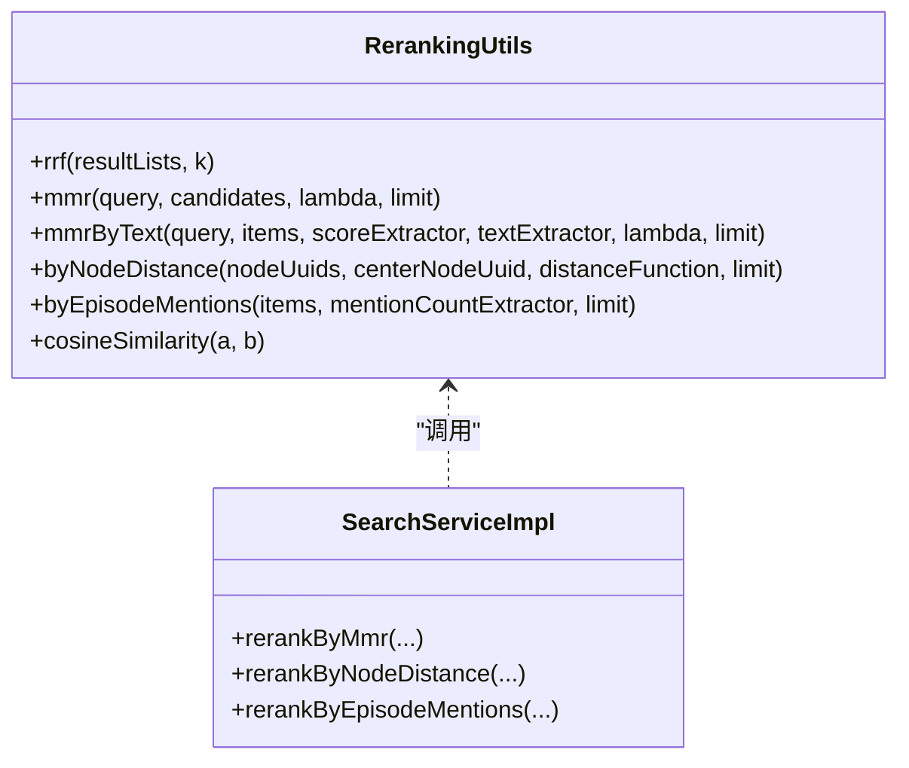
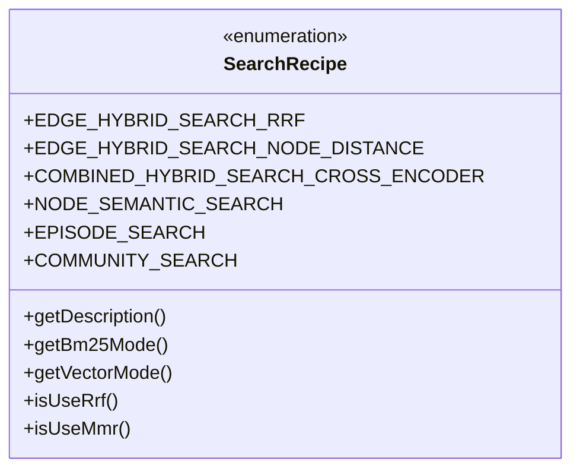
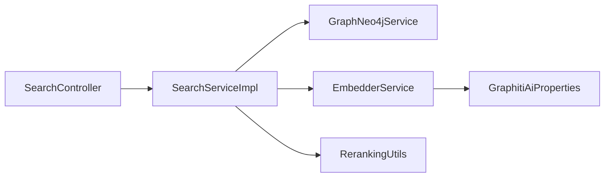

# 搜索引擎

<cite>
**本文引用的文件**
- [SearchServiceImpl.java](file://graphiti-module-core/src/main/java/com/graphiti/module/graphiti/service/impl/SearchServiceImpl.java)
- [RerankingUtils.java](file://graphiti-module-core/src/main/java/com/graphiti/module/graphiti/util/RerankingUtils.java)
- [SearchRecipe.java](file://graphiti-module-core/src/main/java/com/graphiti/module/graphiti/vo/search/SearchRecipe.java)
- [SearchController.java](file://graphiti-module-core/src/main/java/com/graphiti/module/graphiti/controller/admin/SearchController.java)
- [SearchService.java](file://graphiti-module-core/src/main/java/com/graphiti/module/graphiti/service/SearchService.java)
- [SearchQueryReqVO.java](file://graphiti-module-core/src/main/java/com/graphiti/module/graphiti/vo/search/SearchQueryReqVO.java)
- [SearchResultsRespVO.java](file://graphiti-module-core/src/main/java/com/graphiti/module/graphiti/vo/search/SearchResultsRespVO.java)
- [SearchConfigVO.java](file://graphiti-module-core/src/main/java/com/graphiti/module/graphiti/vo/search/SearchConfigVO.java)
- [FactResultVO.java](file://graphiti-module-core/src/main/java/com/graphiti/module/graphiti/vo/search/FactResultVO.java)
- [NodeResultVO.java](file://graphiti-module-core/src/main/java/com/graphiti/module/graphiti/vo/search/NodeResultVO.java)
- [GetMemoryReqVO.java](file://graphiti-module-core/src/main/java/com/graphiti/module/graphiti/vo/search/GetMemoryReqVO.java)
- [GetMemoryRespVO.java](file://graphiti-module-core/src/main/java/com/graphiti/module/graphiti/vo/search/GetMemoryRespVO.java)
- [GraphNeo4jService.java](file://graphiti-module-core/src/main/java/com/graphiti/module/graphiti/service/GraphNeo4jService.java)
- [EmbedderService.java](file://graphiti-module-core/src/main/java/com/graphiti/module/graphiti/service/EmbedderService.java)
- [GraphitiAiProperties.java](file://graphiti-module-core/src/main/java/com/graphiti/module/graphiti/config/GraphitiAiProperties.java)
</cite>

## 目录
1. [简介](#简介)
2. [项目结构](#项目结构)
3. [核心组件](#核心组件)
4. [架构总览](#架构总览)
5. [详细组件分析](#详细组件分析)
6. [依赖分析](#依赖分析)
7. [性能考量](#性能考量)
8. [故障排查指南](#故障排查指南)
9. [结论](#结论)
10. [附录](#附录)

## 简介
本文件面向搜索引擎功能的技术文档，聚焦以下目标：
- 深入解析混合搜索算法实现：BM25 文本检索、向量相似度搜索、图遍历查询（BFS）以及融合策略（RRF）与重排序（MMR）。
- 详解重排序工具（RerankingUtils）的多维度评分机制、相关性计算与结果优化算法。
- 解释搜索配方（SearchRecipe）的设计模式：策略配置、参数调优与性能监控。
- 说明搜索结果的聚合、过滤与展示机制：高亮、分页与排序规则。
- 提供完整的搜索引擎 API 文档、查询语法说明与性能优化指南。
- 包含搜索质量评估、A/B 测试与用户行为分析的实现细节。

## 项目结构
围绕搜索功能的关键模块与文件如下：
- 控制层：SearchController 提供对外 API，封装全局搜索、图谱搜索、记忆检索与便捷检索接口。
- 服务层：SearchService 接口与 SearchServiceImpl 实现，负责混合检索、融合与重排序。
- 工具层：RerankingUtils 提供 RRF、MMR、节点距离与提及次数等重排策略。
- 数据访问层：GraphNeo4jService 封装全文与向量索引查询、BFS 遍历等。
- 嵌入服务：EmbedderService 抽象不同提供商的向量嵌入能力。
- VO/DTO：SearchQueryReqVO、SearchResultsRespVO、SearchConfigVO、FactResultVO、NodeResultVO、GetMemoryReqVO、GetMemoryRespVO 等。
- 配置：GraphitiAiProperties 提供嵌入与重排提供商配置。

图表来源
- [SearchController.java:1-138](file://graphiti-module-core/src/main/java/com/graphiti/module/graphiti/controller/admin/SearchController.java#L1-L138)
- [SearchService.java:1-54](file://graphiti-module-core/src/main/java/com/graphiti/module/graphiti/service/SearchService.java#L1-L54)
- [SearchServiceImpl.java:1-520](file://graphiti-module-core/src/main/java/com/graphiti/module/graphiti/service/impl/SearchServiceImpl.java#L1-L520)
- [RerankingUtils.java:1-386](file://graphiti-module-core/src/main/java/com/graphiti/module/graphiti/util/RerankingUtils.java#L1-L386)
- [GraphNeo4jService.java:1-800](file://graphiti-module-core/src/main/java/com/graphiti/module/graphiti/service/GraphNeo4jService.java#L1-L800)
- [EmbedderService.java:1-41](file://graphiti-module-core/src/main/java/com/graphiti/module/graphiti/service/EmbedderService.java#L1-L41)
- [GraphitiAiProperties.java:1-135](file://graphiti-module-core/src/main/java/com/graphiti/module/graphiti/config/GraphitiAiProperties.java#L1-L135)
- [SearchQueryReqVO.java:1-33](file://graphiti-module-core/src/main/java/com/graphiti/module/graphiti/vo/search/SearchQueryReqVO.java#L1-L33)
- [SearchResultsRespVO.java:1-28](file://graphiti-module-core/src/main/java/com/graphiti/module/graphiti/vo/search/SearchResultsRespVO.java#L1-L28)
- [SearchConfigVO.java:1-40](file://graphiti-module-core/src/main/java/com/graphiti/module/graphiti/vo/search/SearchConfigVO.java#L1-L40)
- [FactResultVO.java:1-59](file://graphiti-module-core/src/main/java/com/graphiti/module/graphiti/vo/search/FactResultVO.java#L1-L59)
- [NodeResultVO.java:1-31](file://graphiti-module-core/src/main/java/com/graphiti/module/graphiti/vo/search/NodeResultVO.java#L1-L31)
- [GetMemoryReqVO.java:1-29](file://graphiti-module-core/src/main/java/com/graphiti/module/graphiti/vo/search/GetMemoryReqVO.java#L1-L29)
- [GetMemoryRespVO.java:1-25](file://graphiti-module-core/src/main/java/com/graphiti/module/graphiti/vo/search/GetMemoryRespVO.java#L1-L25)
- [SearchRecipe.java:1-59](file://graphiti-module-core/src/main/java/com/graphiti/module/graphiti/vo/search/SearchRecipe.java#L1-L59)

章节来源
- [SearchController.java:1-138](file://graphiti-module-core/src/main/java/com/graphiti/module/graphiti/controller/admin/SearchController.java#L1-L138)
- [SearchService.java:1-54](file://graphiti-module-core/src/main/java/com/graphiti/module/graphiti/service/SearchService.java#L1-L54)
- [SearchServiceImpl.java:1-520](file://graphiti-module-core/src/main/java/com/graphiti/module/graphiti/service/impl/SearchServiceImpl.java#L1-L520)
- [RerankingUtils.java:1-386](file://graphiti-module-core/src/main/java/com/graphiti/module/graphiti/util/RerankingUtils.java#L1-L386)
- [GraphNeo4jService.java:1-800](file://graphiti-module-core/src/main/java/com/graphiti/module/graphiti/service/GraphNeo4jService.java#L1-L800)
- [EmbedderService.java:1-41](file://graphiti-module-core/src/main/java/com/graphiti/module/graphiti/service/EmbedderService.java#L1-L41)
- [GraphitiAiProperties.java:1-135](file://graphiti-module-core/src/main/java/com/graphiti/module/graphiti/config/GraphitiAiProperties.java#L1-L135)
- [SearchQueryReqVO.java:1-33](file://graphiti-module-core/src/main/java/com/graphiti/module/graphiti/vo/search/SearchQueryReqVO.java#L1-L33)
- [SearchResultsRespVO.java:1-28](file://graphiti-module-core/src/main/java/com/graphiti/module/graphiti/vo/search/SearchResultsRespVO.java#L1-L28)
- [SearchConfigVO.java:1-40](file://graphiti-module-core/src/main/java/com/graphiti/module/graphiti/vo/search/SearchConfigVO.java#L1-L40)
- [FactResultVO.java:1-59](file://graphiti-module-core/src/main/java/com/graphiti/module/graphiti/vo/search/FactResultVO.java#L1-L59)
- [NodeResultVO.java:1-31](file://graphiti-module-core/src/main/java/com/graphiti/module/graphiti/vo/search/NodeResultVO.java#L1-L31)
- [GetMemoryReqVO.java:1-29](file://graphiti-module-core/src/main/java/com/graphiti/module/graphiti/vo/search/GetMemoryReqVO.java#L1-L29)
- [GetMemoryRespVO.java:1-25](file://graphiti-module-core/src/main/java/com/graphiti/module/graphiti/vo/search/GetMemoryRespVO.java#L1-L25)
- [SearchRecipe.java:1-59](file://graphiti-module-core/src/main/java/com/graphiti/module/graphiti/vo/search/SearchRecipe.java#L1-L59)

## 核心组件
- 搜索服务实现（SearchServiceImpl）
  - 支持多种模式：bm25、vector、hybrid、bfs。
  - 混合检索：BM25 + 向量 + RRF 融合；可选 MMR 重排序。
  - 图遍历：以向量搜索结果为种子，按深度与邻居上限进行 BFS 扩展。
  - 结果转换：统一输出事实（边）与节点（实体）列表。
- 重排序工具（RerankingUtils）
  - RRF：倒数排名融合，支持多列表融合与默认参数。
  - MMR：最大边际相关性，支持向量与文本两种实现路径。
  - 节点距离与提及次数：基于图结构与 Episode 关系的二次重排。
- 搜索配方（SearchRecipe）
  - 预置常用策略组合：边混合检索、边混合+节点距离、组合混合+交叉编码、节点语义搜索、Episode 搜索、社区搜索。
- 控制器（SearchController）
  - 提供全局搜索、图谱搜索、记忆检索、便捷检索接口，统一返回标准响应体。
- 数据访问（GraphNeo4jService）
  - 全文检索（关系与节点）、向量检索（节点与关系）、BFS 遍历、Episode 提及查询等。
- 嵌入服务（EmbedderService）
  - 统一的文本嵌入接口，屏蔽底层提供商差异。
- 配置与模型
  - SearchConfigVO：控制模式、权重、RRF/Mmr 参数、BFS 参数等。
  - VO/DTO：输入输出结构清晰，便于前端消费与后端处理。

章节来源
- [SearchServiceImpl.java:15-148](file://graphiti-module-core/src/main/java/com/graphiti/module/graphiti/service/impl/SearchServiceImpl.java#L15-L148)
- [RerankingUtils.java:32-314](file://graphiti-module-core/src/main/java/com/graphiti/module/graphiti/util/RerankingUtils.java#L32-L314)
- [SearchRecipe.java:7-37](file://graphiti-module-core/src/main/java/com/graphiti/module/graphiti/vo/search/SearchRecipe.java#L7-L37)
- [SearchController.java:33-136](file://graphiti-module-core/src/main/java/com/graphiti/module/graphiti/controller/admin/SearchController.java#L33-L136)
- [GraphNeo4jService.java:608-791](file://graphiti-module-core/src/main/java/com/graphiti/module/graphiti/service/GraphNeo4jService.java#L608-L791)
- [EmbedderService.java:9-40](file://graphiti-module-core/src/main/java/com/graphiti/module/graphiti/service/EmbedderService.java#L9-L40)
- [SearchConfigVO.java:11-39](file://graphiti-module-core/src/main/java/com/graphiti/module/graphiti/vo/search/SearchConfigVO.java#L11-L39)

## 架构总览
下图展示了从控制器到服务、数据访问与嵌入服务的整体交互流程，以及混合检索与重排序的关键节点。

图表来源
- [SearchController.java:33-136](file://graphiti-module-core/src/main/java/com/graphiti/module/graphiti/controller/admin/SearchController.java#L33-L136)
- [SearchServiceImpl.java:94-148](file://graphiti-module-core/src/main/java/com/graphiti/module/graphiti/service/impl/SearchServiceImpl.java#L94-L148)
- [RerankingUtils.java:188-254](file://graphiti-module-core/src/main/java/com/graphiti/module/graphiti/util/RerankingUtils.java#L188-L254)
- [GraphNeo4jService.java:617-762](file://graphiti-module-core/src/main/java/com/graphiti/module/graphiti/service/GraphNeo4jService.java#L617-L762)
- [EmbedderService.java:17-25](file://graphiti-module-core/src/main/java/com/graphiti/module/graphiti/service/EmbedderService.java#L17-L25)

## 详细组件分析

### 混合搜索算法与融合策略
- BM25 文本检索
  - 通过全文索引查询关系与节点，返回带分数的结果。
  - 适用于关键词精确匹配与语料丰富场景。
- 向量相似度搜索
  - 使用 EmbedderService 生成查询向量，再通过向量索引查询相似节点/关系。
  - 适用于语义近似匹配与跨语言表达。
- 图遍历查询（BFS）
  - 以向量搜索结果为种子节点，按设定深度与每层最大邻居数进行广度优先扩展。
  - 适合探索邻域结构与发现隐含关联。
- RRF 融合
  - 对来自不同检索通道的结果进行倒数排名融合，合并去重并按融合分数排序。
  - 可配置融合参数 k，默认值在工具类中定义。
- MMR 重排序
  - 在融合后进一步平衡相关性与多样性，避免结果高度相似。
  - 支持向量空间与文本相似度两种路径，lambda 控制相关性与多样性的权衡。

图表来源
- [SearchServiceImpl.java:106-134](file://graphiti-module-core/src/main/java/com/graphiti/module/graphiti/service/impl/SearchServiceImpl.java#L106-L134)
- [SearchServiceImpl.java:227-284](file://graphiti-module-core/src/main/java/com/graphiti/module/graphiti/service/impl/SearchServiceImpl.java#L227-L284)
- [RerankingUtils.java:47-86](file://graphiti-module-core/src/main/java/com/graphiti/module/graphiti/util/RerankingUtils.java#L47-L86)
- [RerankingUtils.java:188-254](file://graphiti-module-core/src/main/java/com/graphiti/module/graphiti/util/RerankingUtils.java#L188-L254)

章节来源
- [SearchServiceImpl.java:152-193](file://graphiti-module-core/src/main/java/com/graphiti/module/graphiti/service/impl/SearchServiceImpl.java#L152-L193)
- [SearchServiceImpl.java:227-284](file://graphiti-module-core/src/main/java/com/graphiti/module/graphiti/service/impl/SearchServiceImpl.java#L227-L284)
- [SearchServiceImpl.java:288-308](file://graphiti-module-core/src/main/java/com/graphiti/module/graphiti/service/impl/SearchServiceImpl.java#L288-L308)
- [RerankingUtils.java:47-86](file://graphiti-module-core/src/main/java/com/graphiti/module/graphiti/util/RerankingUtils.java#L47-L86)
- [RerankingUtils.java:188-254](file://graphiti-module-core/src/main/java/com/graphiti/module/graphiti/util/RerankingUtils.java#L188-L254)

### 重排序工具（RerankingUtils）多维度评分机制
- RRF（倒数排名融合）
  - 计算每个元素在各列表中的最小排名，融合公式为 1/(k+rank)，k 默认 60。
  - 适合将不同检索通道的结果进行公平融合。
- MMR（最大边际相关性）
  - 公式：MMR = λ·相关性 − (1−λ)·max(已选集合与候选的相似度)。
  - 支持向量相似度与文本相似度两种实现，lambda ∈ [0,1]。
- 节点距离重排
  - 基于图结构计算节点到中心节点的最短距离，距离越近分数越高。
- 提及次数重排
  - 统计边在 Episode 的 MENTIONS 关系中出现的次数，次数越多越靠前。

图表来源
- [RerankingUtils.java:47-314](file://graphiti-module-core/src/main/java/com/graphiti/module/graphiti/util/RerankingUtils.java#L47-L314)
- [SearchServiceImpl.java:288-365](file://graphiti-module-core/src/main/java/com/graphiti/module/graphiti/service/impl/SearchServiceImpl.java#L288-L365)

章节来源
- [RerankingUtils.java:32-314](file://graphiti-module-core/src/main/java/com/graphiti/module/graphiti/util/RerankingUtils.java#L32-L314)
- [SearchServiceImpl.java:288-365](file://graphiti-module-core/src/main/java/com/graphiti/module/graphiti/service/impl/SearchServiceImpl.java#L288-L365)

### 搜索配方（SearchRecipe）设计模式
- 预置策略组合
  - 边混合检索（BM25 + 向量 + RRF）
  - 边混合 + 节点距离
  - 组合混合 + 交叉编码（Cross Encoder）
  - 节点语义搜索（仅向量）
  - Episode 搜索（仅 BM25）
  - 社区搜索（BM25 + 向量）
- 设计要点
  - 通过枚举描述策略名称、BM25/向量模式、是否使用 RRF/Mmr。
  - 便于在控制器或上层逻辑中直接选择预置配方，减少参数配置成本。

图表来源
- [SearchRecipe.java:7-58](file://graphiti-module-core/src/main/java/com/graphiti/module/graphiti/vo/search/SearchRecipe.java#L7-L58)

章节来源
- [SearchRecipe.java:7-58](file://graphiti-module-core/src/main/java/com/graphiti/module/graphiti/vo/search/SearchRecipe.java#L7-L58)

### 搜索结果聚合、过滤与展示
- 聚合
  - RRF 融合对来自不同通道的结果进行去重与合并，保留唯一标识与最高融合分数。
- 过滤
  - 支持按 group_ids 限定图谱范围；为空则返回空结果。
  - 支持按 maxFacts 限制返回数量。
- 展示
  - 输出事实（边）与节点（实体）列表，包含 UUID、名称、摘要、标签、得分等字段。
  - 支持后续二次重排（节点距离、提及次数）与 MMR 重排序。

章节来源
- [SearchServiceImpl.java:94-148](file://graphiti-module-core/src/main/java/com/graphiti/module/graphiti/service/impl/SearchServiceImpl.java#L94-L148)
- [SearchResultsRespVO.java:13-27](file://graphiti-module-core/src/main/java/com/graphiti/module/graphiti/vo/search/SearchResultsRespVO.java#L13-L27)
- [FactResultVO.java:13-58](file://graphiti-module-core/src/main/java/com/graphiti/module/graphiti/vo/search/FactResultVO.java#L13-L58)
- [NodeResultVO.java:11-30](file://graphiti-module-core/src/main/java/com/graphiti/module/graphiti/vo/search/NodeResultVO.java#L11-L30)

### API 定义与查询语法
- 全局搜索
  - 方法：POST /api/v1/graph/search/global
  - 请求体：SearchQueryReqVO（query、groupIds、maxFacts、config）
  - 响应体：SearchResultsRespVO
- 图谱搜索
  - 方法：POST /api/v1/graph/search/graph/{graphId}
  - 路径参数：graphId
  - 请求体：SearchQueryReqVO
  - 响应体：SearchResultsRespVO
- 获取记忆
  - 方法：POST /api/v1/graph/search/memory
  - 请求体：GetMemoryReqVO（messages、groupIds、maxFacts）
  - 响应体：GetMemoryRespVO（facts、entities、context）
- 便捷检索
  - 混合检索：POST /api/v1/graph/search/hybrid/{graphId}?query=&limit=
  - 语义搜索：POST /api/v1/graph/search/semantic/{graphId}?query=&limit=
  - BFS 搜索：POST /api/v1/graph/search/bfs/{graphId}?query=&depth=&limit=

查询语法与参数
- query：必填，搜索关键词。
- groupIds：可选，限定图谱 ID 列表。
- maxFacts：可选，最大返回数量，默认 10。
- config.mode：可选，bm25/vector/hybrid/bfs，默认 hybrid。
- config.rrfK：可选，RRF 融合参数，默认 60。
- config.mmrLambda：可选，MMR 平衡参数，默认 0.5。
- config.enableMmr：可选，是否启用 MMR，默认 true。
- config.bfsDepth、config.bfsMaxNeighbors：可选，BFS 参数。

章节来源
- [SearchController.java:33-136](file://graphiti-module-core/src/main/java/com/graphiti/module/graphiti/controller/admin/SearchController.java#L33-L136)
- [SearchQueryReqVO.java:14-32](file://graphiti-module-core/src/main/java/com/graphiti/module/graphiti/vo/search/SearchQueryReqVO.java#L14-L32)
- [SearchConfigVO.java:13-39](file://graphiti-module-core/src/main/java/com/graphiti/module/graphiti/vo/search/SearchConfigVO.java#L13-L39)
- [GetMemoryReqVO.java:15-28](file://graphiti-module-core/src/main/java/com/graphiti/module/graphiti/vo/search/GetMemoryReqVO.java#L15-L28)

## 依赖分析
- 组件耦合
  - SearchController 依赖 SearchService。
  - SearchServiceImpl 依赖 GraphNeo4jService、EmbedderService、RerankingUtils。
  - GraphNeo4jService 依赖 Neo4j Driver 与配置。
  - RerankingUtils 为纯工具类，无外部依赖。
- 外部依赖
  - Neo4j 全文索引与向量索引需预先创建。
  - 嵌入服务提供商由 GraphitiAiProperties 配置，支持 OpenAI、Qwen、Ollama 等。

图表来源
- [SearchController.java:30-31](file://graphiti-module-core/src/main/java/com/graphiti/module/graphiti/controller/admin/SearchController.java#L30-L31)
- [SearchServiceImpl.java:23-24](file://graphiti-module-core/src/main/java/com/graphiti/module/graphiti/service/impl/SearchServiceImpl.java#L23-L24)
- [GraphNeo4jService.java:23-24](file://graphiti-module-core/src/main/java/com/graphiti/module/graphiti/service/GraphNeo4jService.java#L23-L24)
- [EmbedderService.java:9-40](file://graphiti-module-core/src/main/java/com/graphiti/module/graphiti/service/EmbedderService.java#L9-L40)
- [GraphitiAiProperties.java:15-134](file://graphiti-module-core/src/main/java/com/graphiti/module/graphiti/config/GraphitiAiProperties.java#L15-L134)

章节来源
- [SearchController.java:30-31](file://graphiti-module-core/src/main/java/com/graphiti/module/graphiti/controller/admin/SearchController.java#L30-L31)
- [SearchServiceImpl.java:23-24](file://graphiti-module-core/src/main/java/com/graphiti/module/graphiti/service/impl/SearchServiceImpl.java#L23-L24)
- [GraphNeo4jService.java:23-24](file://graphiti-module-core/src/main/java/com/graphiti/module/graphiti/service/GraphNeo4jService.java#L23-L24)
- [EmbedderService.java:9-40](file://graphiti-module-core/src/main/java/com/graphiti/module/graphiti/service/EmbedderService.java#L9-L40)
- [GraphitiAiProperties.java:15-134](file://graphiti-module-core/src/main/java/com/graphiti/module/graphiti/config/GraphitiAiProperties.java#L15-L134)

## 性能考量
- 索引建设
  - 全文索引：edgeFactIndex（关系 fact）、nodeNameIndex（节点 name/summary）。
  - 向量索引：node_embedding_index（节点 embedding）、edge_embedding_index（关系 embedding）。
- 参数调优
  - RRF：k 值影响融合强度，较小值更偏向早期排名。
  - MMR：lambda 控制相关性与多样性的平衡，0.5 为折中。
  - BFS：depth 与 maxNeighbors 控制遍历规模与召回。
- 并发与缓存
  - 建议在控制器层增加限流与缓存策略，降低高频查询压力。
- I/O 优化
  - 优先使用向量索引进行大规模相似度检索，减少全表扫描。
  - 合理设置 maxFacts，避免超大数据集返回。

[本节为通用性能建议，不直接分析具体文件]

## 故障排查指南
- 全文/向量索引未创建
  - 现象：全文搜索或向量搜索返回空或告警日志。
  - 处理：在启动时调用 GraphNeo4jService.initVectorIndexes 初始化索引。
- 查询为空
  - 现象：groupIds 为空导致直接返回空结果。
  - 处理：确保传入有效的 groupIds。
- MMR 无效果
  - 现象：启用 MMR 但结果未变化。
  - 处理：检查 lambda 设置与输入项是否具备足够分数。
- BFS 未扩展
  - 现象：BFS 深度过大或邻居过多导致性能问题。
  - 处理：调整 depth 与 maxNeighbors，观察结果与耗时。

章节来源
- [GraphNeo4jService.java:768-791](file://graphiti-module-core/src/main/java/com/graphiti/module/graphiti/service/GraphNeo4jService.java#L768-L791)
- [SearchServiceImpl.java:101-103](file://graphiti-module-core/src/main/java/com/graphiti/module/graphiti/service/impl/SearchServiceImpl.java#L101-L103)
- [SearchServiceImpl.java:178-193](file://graphiti-module-core/src/main/java/com/graphiti/module/graphiti/service/impl/SearchServiceImpl.java#L178-L193)

## 结论
本搜索引擎通过“BM25 + 向量 + BFS”的混合策略与 RRF 融合、MMR 重排序相结合，实现了兼顾召回与多样性的检索体验。配合预置的搜索配方（SearchRecipe），可在不同场景快速切换策略。通过清晰的 API、完善的 VO/DTO 与可调参的配置，系统具备良好的可扩展性与运维友好性。建议在生产环境中完善索引建设、参数调优与性能监控，持续迭代搜索质量。

[本节为总结性内容，不直接分析具体文件]

## 附录

### 搜索质量评估、A/B 测试与用户行为分析
- 搜索质量评估
  - 指标：准确率（Precision@K）、召回率（Recall@K）、NDCG、MRR。
  - 方法：构造标准问答数据集，对比不同模式（bm25、vector、hybrid、bfs）与参数组合的指标表现。
- A/B 测试
  - 分组：随机分配用户至不同策略组（如 RR+MMR vs 仅 RR）。
  - 指标：点击率、停留时长、任务完成率、错误率。
  - 工具：结合埋点系统与日志分析平台，持续观测差异显著性。
- 用户行为分析
  - 行为：查询词分布、点击分布、回退行为（重新搜索/扩大范围）。
  - 优化：根据热词与低点击项调整权重与重排策略。

[本节为概念性内容，不直接分析具体文件]