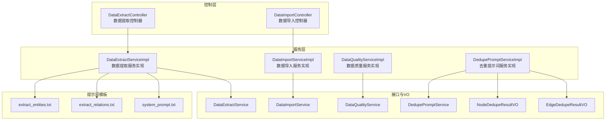
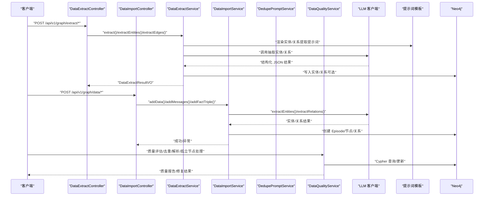
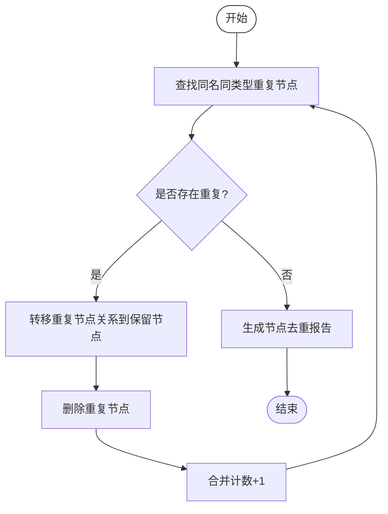
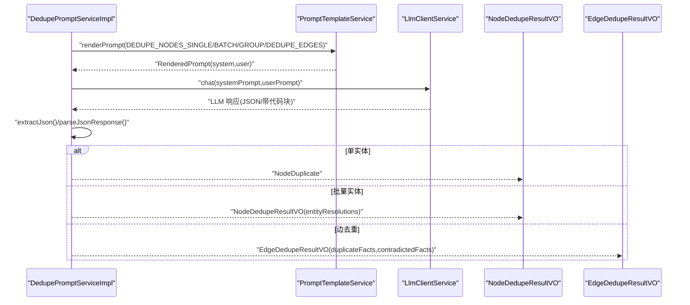
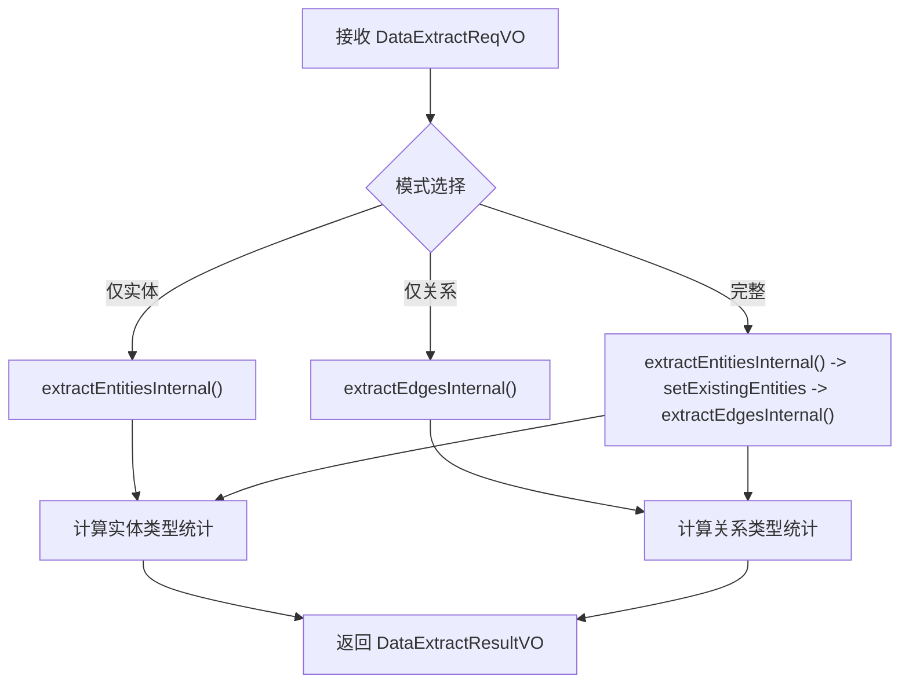
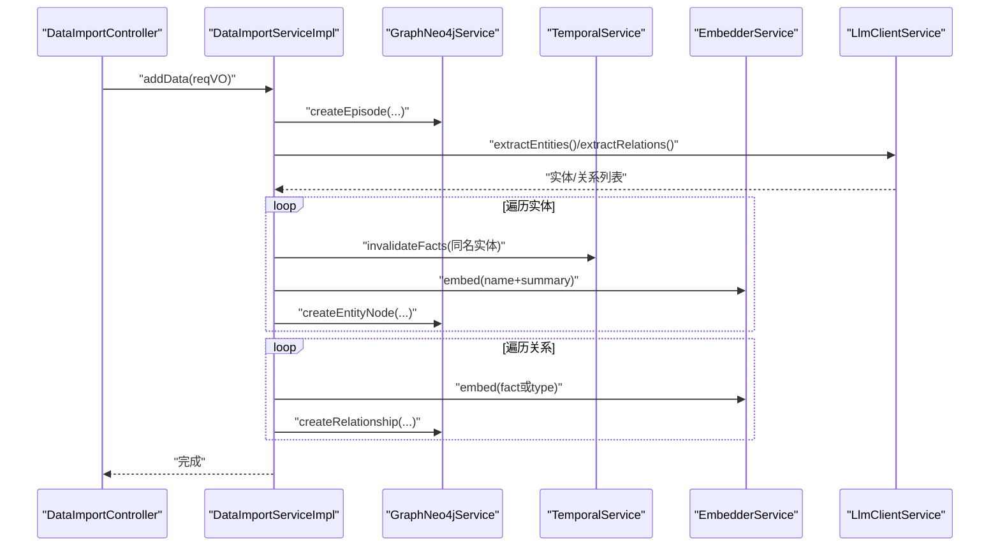
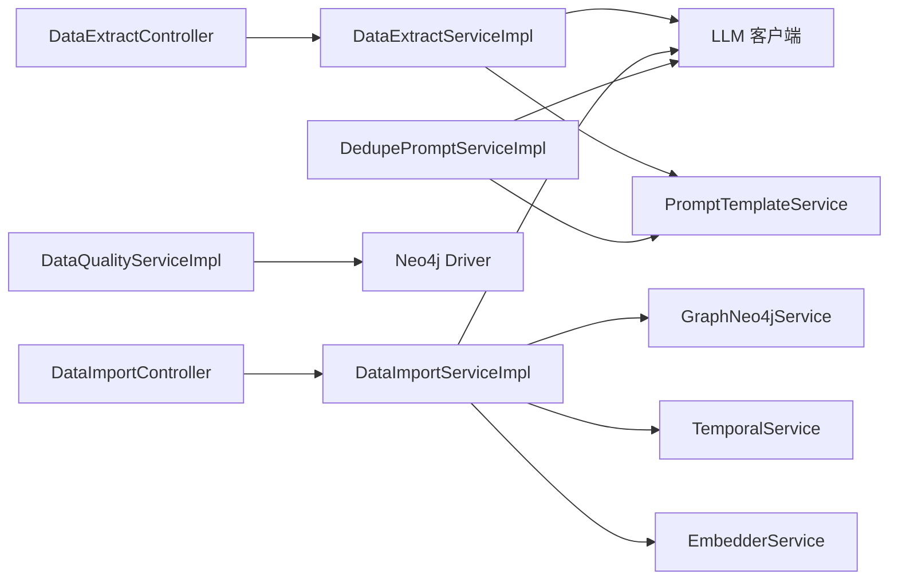
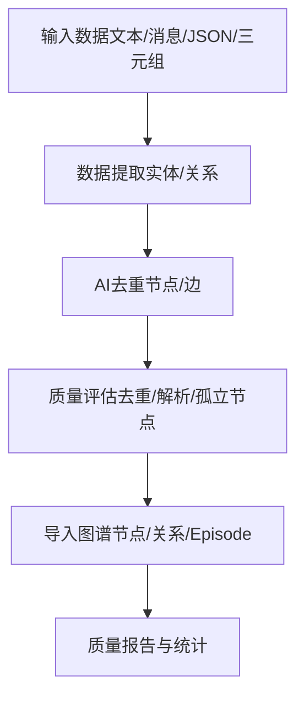

# 数据质量管理

<!--<cite>
**本文引用的文件**
- [DataQualityServiceImpl.java](file://graphiti-module-core/src/main/java/com/graphiti/module/graphiti/service/impl/DataQualityServiceImpl.java)
- [DedupePromptServiceImpl.java](file://graphiti-module-core/src/main/java/com/graphiti/module/graphiti/service/impl/DedupePromptServiceImpl.java)
- [DataExtractServiceImpl.java](file://graphiti-module-core/src/main/java/com/graphiti/module/graphiti/service/impl/DataExtractServiceImpl.java)
- [DataImportServiceImpl.java](file://graphiti-module-core/src/main/java/com/graphiti/module/graphiti/service/impl/DataImportServiceImpl.java)
- [DataQualityService.java](file://graphiti-module-core/src/main/java/com/graphiti/module/graphiti/service/DataQualityService.java)
- [DedupePromptService.java](file://graphiti-module-core/src/main/java/com/graphiti/module/graphiti/service/DedupePromptService.java)
- [DataExtractService.java](file://graphiti-module-core/src/main/java/com/graphiti/module/graphiti/service/DataExtractService.java)
- [DataImportService.java](file://graphiti-module-core/src/main/java/com/graphiti/module/graphiti/service/DataImportService.java)
- [NodeDedupeResultVO.java](file://graphiti-module-core/src/main/java/com/graphiti/module/graphiti/vo/dedup/NodeDedupeResultVO.java)
- [EdgeDedupeResultVO.java](file://graphiti-module-core/src/main/java/com/graphiti/module/graphiti/vo/dedup/EdgeDedupeResultVO.java)
- [DataExtractController.java](file://graphiti-module-core/src/main/java/com/graphiti/module/graphiti/controller/admin/DataExtractController.java)
- [DataImportController.java](file://graphiti-module-core/src/main/java/com/graphiti/module/graphiti/controller/admin/DataImportController.java)
- [extract_entities.txt](file://graphiti-module-core/src/main/resources/prompts/extract_entities.txt)
- [extract_relations.txt](file://graphiti-module-core/src/main/resources/prompts/extract_relations.txt)
- [system_prompt.txt](file://graphiti-module-core/src/main/resources/prompts/system_prompt.txt)
</cite>-->

## 目录
1. [简介](#简介)
2. [项目结构](#项目结构)
3. [核心组件](#核心组件)
4. [架构总览](#架构总览)
5. [详细组件分析](#详细组件分析)
6. [依赖分析](#依赖分析)
7. [性能考虑](#性能考虑)
8. [故障排查指南](#故障排查指南)
9. [结论](#结论)
10. [附录](#附录)

## 简介
本文件面向“数据质量管理”主题，系统性梳理并解读以下关键能力：
- 数据质量评估与清洗：节点/边去重、实体解析、孤立节点处理
- AI驱动去重策略：基于提示词工程与大模型的节点/边去重
- 自动化数据提取：实体与关系抽取、格式转换与结构化输出
- 数据导入管线：批量导入、错误处理与进度跟踪
- 质量指标与改进策略：完整性、一致性、重复性、时效性等维度
- 数据清洗规则、质量监控仪表板与异常处理机制

## 项目结构
围绕数据质量管理的相关模块主要分布在 graphiti-module-core 的 service 层与 controller 层，并辅以提示词模板资源文件。



图表来源
- [DataExtractController.java:1-279](file://graphiti-module-core/src/main/java/com/graphiti/module/graphiti/controller/admin/DataExtractController.java#L1-L279)
- [DataImportController.java:1-112](file://graphiti-module-core/src/main/java/com/graphiti/module/graphiti/controller/admin/DataImportController.java#L1-L112)
- [DataExtractServiceImpl.java:1-261](file://graphiti-module-core/src/main/java/com/graphiti/module/graphiti/service/impl/DataExtractServiceImpl.java#L1-L261)
- [DataImportServiceImpl.java:1-323](file://graphiti-module-core/src/main/java/com/graphiti/module/graphiti/service/impl/DataImportServiceImpl.java#L1-L323)
- [DataQualityServiceImpl.java:1-219](file://graphiti-module-core/src/main/java/com/graphiti/module/graphiti/service/impl/DataQualityServiceImpl.java#L1-L219)
- [DedupePromptServiceImpl.java:1-342](file://graphiti-module-core/src/main/java/com/graphiti/module/graphiti/service/impl/DedupePromptServiceImpl.java#L1-L342)
- [extract_entities.txt:1-28](file://graphiti-module-core/src/main/resources/prompts/extract_entities.txt#L1-L28)
- [extract_relations.txt:1-33](file://graphiti-module-core/src/main/resources/prompts/extract_relations.txt#L1-L33)
- [system_prompt.txt:1-11](file://graphiti-module-core/src/main/resources/prompts/system_prompt.txt#L1-L11)

章节来源
- [DataExtractController.java:1-279](file://graphiti-module-core/src/main/java/com/graphiti/module/graphiti/controller/admin/DataExtractController.java#L1-L279)
- [DataImportController.java:1-112](file://graphiti-module-core/src/main/java/com/graphiti/module/graphiti/controller/admin/DataImportController.java#L1-L112)

## 核心组件
- 数据质量服务（DataQualityServiceImpl）
  - 节点去重：基于名称与类型聚合，保留最新节点并迁移关系
  - 边去重：基于源/目标+类型聚合，保留首条边并删除冗余
  - 实体解析：基于名称包含关系近似相似度，建立 SAME_AS 关系
  - 孤立节点检测与修复：可删除或添加自环
- AI驱动去重服务（DedupePromptServiceImpl）
  - 单实体/批量实体去重：渲染提示词并调用 LLM，解析 JSON 结果
  - 边去重：对比新边与现有边，识别重复与矛盾事实
  - 节点/边事实格式转换与分组
- 数据提取服务（DataExtractServiceImpl）
  - 支持文本/消息/JSON 多源输入；按模式抽取实体与关系
  - 统计实体/关系类型分布，记录耗时与错误
- 数据导入服务（DataImportServiceImpl）
  - 单条/批量/消息/三元组导入；自动实体与关系提取
  - 时序失效、向量嵌入、节点/关系创建与错误处理

章节来源
- [DataQualityServiceImpl.java:26-219](file://graphiti-module-core/src/main/java/com/graphiti/module/graphiti/service/impl/DataQualityServiceImpl.java#L26-L219)
- [DedupePromptServiceImpl.java:44-342](file://graphiti-module-core/src/main/java/com/graphiti/module/graphiti/service/impl/DedupePromptServiceImpl.java#L44-L342)
- [DataExtractServiceImpl.java:44-261](file://graphiti-module-core/src/main/java/com/graphiti/module/graphiti/service/impl/DataExtractServiceImpl.java#L44-L261)
- [DataImportServiceImpl.java:36-323](file://graphiti-module-core/src/main/java/com/graphiti/module/graphiti/service/impl/DataImportServiceImpl.java#L36-L323)

## 架构总览
下图展示数据质量管理在系统中的端到端流程：从控制器接收请求，经服务层调用 LLM/提示词模板与图数据库，最终产出结构化结果与质量报告。



图表来源
- [DataExtractController.java:48-136](file://graphiti-module-core/src/main/java/com/graphiti/module/graphiti/controller/admin/DataExtractController.java#L48-L136)
- [DataImportController.java:32-101](file://graphiti-module-core/src/main/java/com/graphiti/module/graphiti/controller/admin/DataImportController.java#L32-L101)
- [DataExtractServiceImpl.java:44-188](file://graphiti-module-core/src/main/java/com/graphiti/module/graphiti/service/impl/DataExtractServiceImpl.java#L44-L188)
- [DataImportServiceImpl.java:36-224](file://graphiti-module-core/src/main/java/com/graphiti/module/graphiti/service/impl/DataImportServiceImpl.java#L36-L224)
- [DedupePromptServiceImpl.java:44-165](file://graphiti-module-core/src/main/java/com/graphiti/module/graphiti/service/impl/DedupePromptServiceImpl.java#L44-L165)
- [extract_entities.txt:1-28](file://graphiti-module-core/src/main/resources/prompts/extract_entities.txt#L1-L28)
- [extract_relations.txt:1-33](file://graphiti-module-core/src/main/resources/prompts/extract_relations.txt#L1-L33)
- [system_prompt.txt:1-11](file://graphiti-module-core/src/main/resources/prompts/system_prompt.txt#L1-L11)

## 详细组件分析

### 数据质量服务（DataQualityServiceImpl）
- 节点去重
  - 聚合同名同类型的节点，保留最新节点，迁移其关系后删除重复节点
  - 关系转移包括出边与入边，确保图连通性
- 边去重
  - 基于源/目标+类型聚合，保留首条边并删除其余重复边
- 实体解析
  - 使用 CONTAINS 近似判断名称相似度，建立 SAME_AS 关系标记解析
- 孤立节点处理
  - 检测无出入边的节点，支持删除或添加自环以标识孤立状态



图表来源
- [DataQualityServiceImpl.java:27-58](file://graphiti-module-core/src/main/java/com/graphiti/module/graphiti/service/impl/DataQualityServiceImpl.java#L27-L58)

章节来源
- [DataQualityServiceImpl.java:26-219](file://graphiti-module-core/src/main/java/com/graphiti/module/graphiti/service/impl/DataQualityServiceImpl.java#L26-L219)

### AI驱动去重服务（DedupePromptServiceImpl）
- 单实体去重
  - 渲染提示词模板，调用 LLM，解析 JSON 并映射为 NodeDuplicate
- 批量实体去重
  - 渲染批量提示词，调用 LLM，解析 entity_resolutions 列表
- 边去重
  - 渲染边去重提示词，调用 LLM，解析 duplicateFacts 与 contradictedFacts
- 提示词工程
  - 通过 PromptTemplateService 渲染模板变量（如 previousEpisodes、episodeContent、existingNodes/Edges、newEdge 等）
- 响应解析
  - 支持从 ```json ... ``` 或裸 JSON 中提取 JSON 片段，容错解析



图表来源
- [DedupePromptServiceImpl.java](file://graphiti-module-core/src/main/java/com/graphiti/module/graphiti/service/impl/DedupePromptServiceImpl.java#L44-L165)
- [NodeDedupeResultVO.java](file://graphiti-module-core/src/main/java/com/graphiti/module/graphiti/vo/dedup/NodeDedupeResultVO.java#L1-L32)
- [EdgeDedupeResultVO.java](file://graphiti-module-core/src/main/java/com/graphiti/module/graphiti/vo/dedup/EdgeDedupeResultVO.java#L1-L21)

章节来源
- [DedupePromptServiceImpl.java](file://graphiti-module-core/src/main/java/com/graphiti/module/graphiti/service/impl/DedupePromptServiceImpl.java#L44-L342)
- [NodeDedupeResultVO.java](file://graphiti-module-core/src/main/java/com/graphiti/module/graphiti/vo/dedup/NodeDedupeResultVO.java#L1-L32)
- [EdgeDedupeResultVO.java](file://graphiti-module-core/src/main/java/com/graphiti/module/graphiti/vo/dedup/EdgeDedupeResultVO.java#L1-L21)

### 数据提取服务（DataExtractServiceImpl）
- 输入类型适配
  - 文本/消息/JSON：分别调用实体/关系提取器
- 流程编排
  - 完整模式：先实体后关系；仅实体/仅关系模式独立执行
- 统计与耗时
  - 计算实体类型与关系类型分布，记录总耗时与错误列表
- 上下文 Episodes
  - 将 previousEpisodes 转换为 map 列表传入 LLM 提示词



图表来源
- [DataExtractServiceImpl.java](file://graphiti-module-core/src/main/java/com/graphiti/module/graphiti/service/impl/DataExtractServiceImpl.java#L44-L261)

章节来源
- [DataExtractServiceImpl.java](file://graphiti-module-core/src/main/java/com/graphiti/module/graphiti/service/impl/DataExtractServiceImpl.java#L44-L261)

### 数据导入服务（DataImportServiceImpl）
- 单条导入
  - 创建 Episode → LLM 抽取实体/关系 → 时序失效同名旧实体 → 生成向量 → 写入节点/关系
- 批量导入
  - 逐条转发至 addData，后续可扩展批处理优化
- 消息导入
  - 合并多轮对话为单个 Episode，再执行实体/关系抽取与写入
- 事实三元组导入
  - 查找或创建源/目标节点 → 创建关系并生成向量
- 删除操作
  - 支持按边 UUID、图谱 ID、Episode UUID 删除



图表来源
- [DataImportServiceImpl.java](file://graphiti-module-core/src/main/java/com/graphiti/module/graphiti/service/impl/DataImportServiceImpl.java#L36-L224)
- [DataImportController.java](file://graphiti-module-core/src/main/java/com/graphiti/module/graphiti/controller/admin/DataImportController.java#L32-L62)

章节来源
- [DataImportServiceImpl.java](file://graphiti-module-core/src/main/java/com/graphiti/module/graphiti/service/impl/DataImportServiceImpl.java#L36-L323)
- [DataImportController.java](file://graphiti-module-core/src/main/java/com/graphiti/module/graphiti/controller/admin/DataImportController.java#L32-L101)

## 依赖分析
- 控制器到服务
  - DataExtractController → DataExtractService → DataExtractServiceImpl
  - DataImportController → DataImportService → DataImportServiceImpl
- 服务到外部能力
  - DataExtractServiceImpl 依赖提示词模板与 LLM 客户端
  - DedupePromptServiceImpl 依赖 PromptTemplateService 与 LLM 客户端
  - DataImportServiceImpl 依赖 GraphNeo4jService、TemporalService、EmbedderService、LlmClientService
- 数据访问
  - DataQualityServiceImpl 直接使用 Neo4j Driver 执行 Cypher



图表来源
- [DataExtractController.java](file://graphiti-module-core/src/main/java/com/graphiti/module/graphiti/controller/admin/DataExtractController.java#L1-L279)
- [DataImportController.java](file://graphiti-module-core/src/main/java/com/graphiti/module/graphiti/controller/admin/DataImportController.java#L1-L112)
- [DataExtractServiceImpl.java](file://graphiti-module-core/src/main/java/com/graphiti/module/graphiti/service/impl/DataExtractServiceImpl.java#L1-L261)
- [DataImportServiceImpl.java](file://graphiti-module-core/src/main/java/com/graphiti/module/graphiti/service/impl/DataImportServiceImpl.java#L1-L323)
- [DedupePromptServiceImpl.java](file://graphiti-module-core/src/main/java/com/graphiti/module/graphiti/service/impl/DedupePromptServiceImpl.java#L1-L342)
- [DataQualityServiceImpl.java](file://graphiti-module-core/src/main/java/com/graphiti/module/graphiti/service/impl/DataQualityServiceImpl.java#L1-L219)

## 性能考虑
- 批量导入
  - 当前逐条 addData，建议引入事务批处理与并发优化，减少数据库往返
- 提示词调用
  - 合理设置超时与重试；对 JSON 解析失败进行降级处理
- Cypher 查询
  - 在大规模图上进行聚合与删除时，建议增加索引与分页处理
- 向量嵌入
  - 批量嵌入时采用向量化接口，避免逐条调用导致延迟

## 故障排查指南
- 数据提取失败
  - 检查提示词模板加载与 LLM 响应格式；确认 JSON 提取逻辑是否命中 ```json 代码块
  - 关注 DataExtractServiceImpl 的错误收集与耗时记录
- 导入异常
  - 核查实体/关系抽取结果；确认节点 UUID 映射与关系两端节点存在性
  - 时序失效与向量生成异常需结合日志定位
- 去重结果异常
  - 检查 DedupePromptServiceImpl 的上下文变量渲染与 JSON 解析
  - 对比 NodeDedupeResultVO/EdgeDedupeResultVO 字段映射是否一致
- 质量评估问题
  - 确认 Cypher 查询条件与图数据一致性；关注孤立节点修复模式（删除/自环）

章节来源
- [DataExtractServiceImpl.java:85-96](file://graphiti-module-core/src/main/java/com/graphiti/module/graphiti/service/impl/DataExtractServiceImpl.java#L85-L96)
- [DataImportServiceImpl.java:108-109](file://graphiti-module-core/src/main/java/com/graphiti/module/graphiti/service/impl/DataImportServiceImpl.java#L108-L109)
- [DedupePromptServiceImpl.java:202-269](file://graphiti-module-core/src/main/java/com/graphiti/module/graphiti/service/impl/DedupePromptServiceImpl.java#L202-L269)
- [DataQualityServiceImpl.java:145-176](file://graphiti-module-core/src/main/java/com/graphiti/module/graphiti/service/impl/DataQualityServiceImpl.java#L145-L176)

## 结论
该数据质量管理方案通过“规则+AI”的双轨策略实现高质量的知识图谱构建：
- 规则层保障完整性与一致性（去重、解析、孤立节点处理）
- AI层提升复杂场景下的去重与抽取准确率（提示词工程与模型调用）
- 控制层提供统一接口，服务层实现可扩展的处理链路
建议后续完善批量导入优化、质量监控仪表板与异常告警机制，持续迭代质量指标与清洗规则。

## 附录

### 数据质量管理流程（端到端）


### 质量指标定义与改进策略
- 完整性
  - 指标：实体/关系覆盖率、字段填充率
  - 改进：提示词增强、默认值注入、缺失字段告警
- 一致性
  - 指标：类型冲突率、属性冲突率、时间戳一致性
  - 改进：本体校验、时序失效策略、属性合并
- 重复性
  - 指标：节点/边重复率、去重命中率
  - 改进：更细粒度相似度阈值、提示词引导、人工复核
- 时效性
  - 指标：导入延迟、处理吞吐、批处理耗时
  - 改进：批处理优化、缓存与向量化、异步队列

### 数据清洗规则（示例）
- 节点清洗
  - 同名同类型节点合并；保留最新；迁移关系
  - 孤立节点：删除或添加自环
- 边清洗
  - 相同源/目标+类型去重；保留首条
- 实体解析
  - 名称包含近似相似度触发 SAME_AS 关系

### 质量监控仪表板（建议）
- 指标看板
  - 导入总量/成功率/失败原因分布
  - 去重数量/命中率/解析数量
  - 实体/关系类型分布与趋势
- 异常告警
  - LLM 响应格式异常、Cypher 执行失败、节点映射缺失