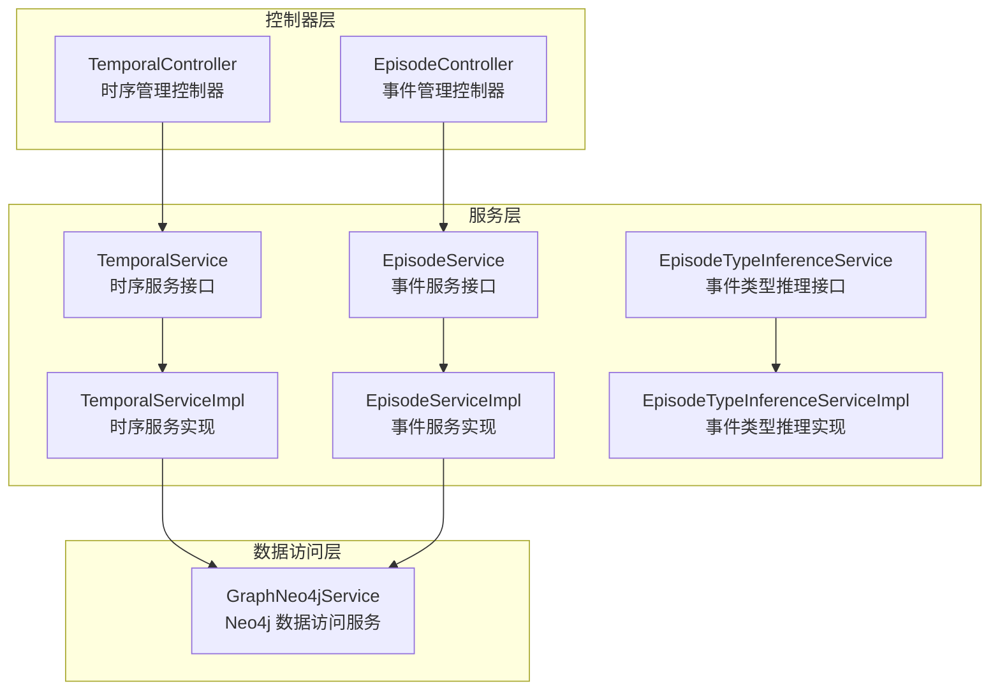
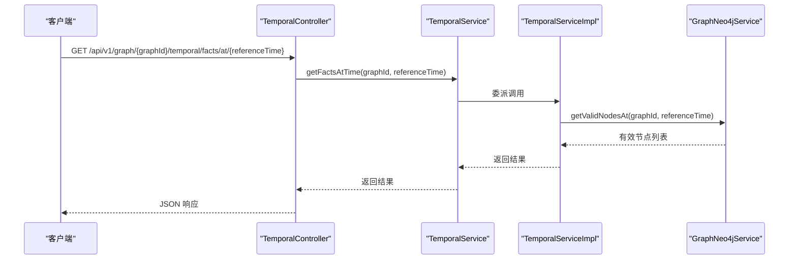
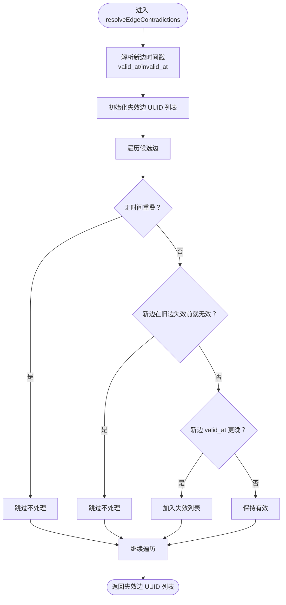
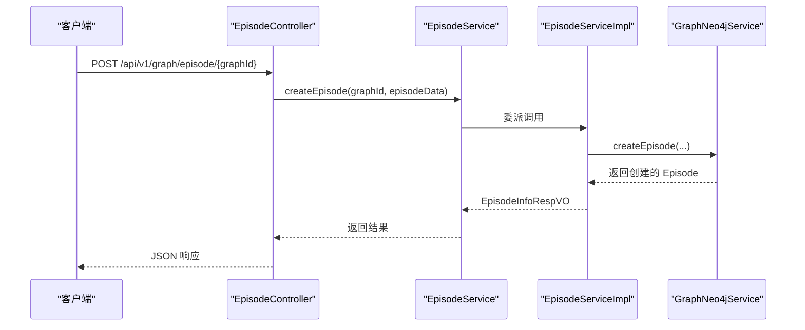
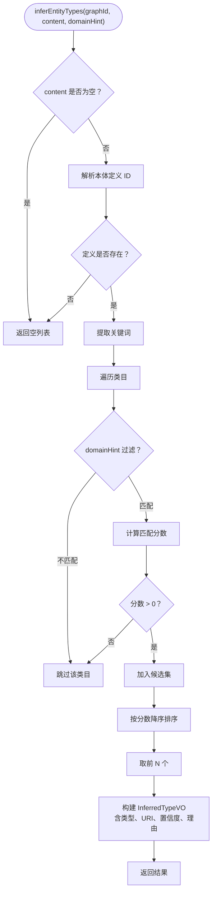
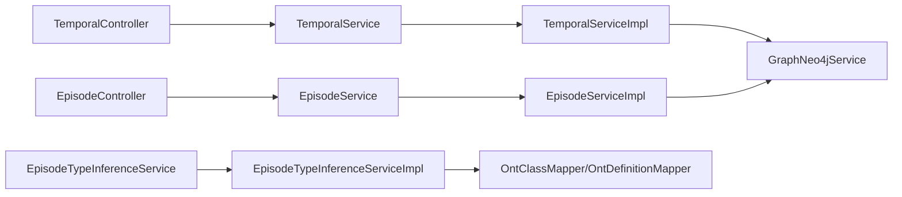

# 时间序列管理

<!--<cite>
**本文引用的文件**
- [TemporalServiceImpl.java](file://ontograph-module-core/src/main/java/com/graphiti/module/graphiti/service/impl/TemporalServiceImpl.java)
- [TemporalService.java](file://ontograph-module-core/src/main/java/com/graphiti/module/graphiti/service/TemporalService.java)
- [TemporalController.java](file://ontograph-module-core/src/main/java/com/graphiti/module/graphiti/controller/admin/TemporalController.java)
- [EpisodeServiceImpl.java](file://ontograph-module-core/src/main/java/com/graphiti/module/graphiti/service/impl/EpisodeServiceImpl.java)
- [EpisodeService.java](file://ontograph-module-core/src/main/java/com/graphiti/module/graphiti/service/EpisodeService.java)
- [EpisodeController.java](file://ontograph-module-core/src/main/java/com/graphiti/module/graphiti/controller/admin/EpisodeController.java)
- [EpisodeTypeInferenceServiceImpl.java](file://ontograph-module-core/src/main/java/com/graphiti/module/graphiti/service/impl/EpisodeTypeInferenceServiceImpl.java)
- [EpisodeTypeInferenceService.java](file://ontograph-module-core/src/main/java/com/graphiti/module/graphiti/service/EpisodeTypeInferenceService.java)
- [GraphNeo4jService.java](file://ontograph-module-core/src/main/java/com/graphiti/module/graphiti/service/GraphNeo4jService.java)
- [EpisodeInfoRespVO.java](file://ontograph-module-core/src/main/java/com/graphiti/module/graphiti/vo/episode/EpisodeInfoRespVO.java)
- [EpisodeListRespVO.java](file://ontograph-module-core/src/main/java/com/graphiti/module/graphiti/vo/episode/EpisodeListRespVO.java)
- [EpisodeMentionsRespVO.java](file://ontograph-module-core/src/main/java/com/graphiti/module/graphiti/vo/episode/EposideMentionsRespVO.java)
- [InferredTypeVO.java](file://ontograph-module-core/src/main/java/com/graphiti/module/graphiti/vo/ontology/InferredTypeVO.java)
</cite>-->

## 目录
1. [简介](#简介)
2. [项目结构](#项目结构)
3. [核心组件](#核心组件)
4. [架构总览](#架构总览)
5. [详细组件分析](#详细组件分析)
6. [依赖分析](#依赖分析)
7. [性能考虑](#性能考虑)
8. [故障排查指南](#故障排查指南)
9. [结论](#结论)
10. [附录](#附录)

## 简介
本文件聚焦于时间序列管理功能，围绕以下目标展开：
- 深入解释 TemporalServiceImpl 中历史状态查询的实现机制，包括时间点查询、时间段查询与快照生成。
- 详述事件实体（Episode）的生命周期管理，涵盖事件创建、类型推断、状态变更与归档处理。
- 阐明事件类型推理服务（EpisodeTypeInferenceServiceImpl）的自动化事件分类算法、上下文理解与类型预测机制。
- 介绍时间序列数据的存储策略、索引优化与查询性能提升方案。
- 提供时间序列管理的完整 API 文档、数据模型设计与时序索引策略。
- 包含事件关联分析、时间线重建与历史数据恢复的实现细节。

## 项目结构
时间序列管理相关模块主要分布在 core 模块的服务层与控制层，采用“控制器-服务-数据访问”的分层架构：
- 控制器层：提供 REST API，分别面向时序管理和事件管理。
- 服务层：封装业务逻辑，协调数据访问与外部依赖。
- 数据访问层：基于 Neo4j 的 GraphNeo4jService 提供节点、边与 Episode 的读写能力。

图表来源
- [TemporalController.java:1-67](file://ontograph-module-core/src/main/java/com/graphiti/module/graphiti/controller/admin/TemporalController.java#L1-L67)
- [EpisodeController.java:1-79](file://ontograph-module-core/src/main/java/com/graphiti/module/graphiti/controller/admin/EpisodeController.java#L1-L79)
- [TemporalService.java:1-95](file://ontograph-module-core/src/main/java/com/graphiti/module/graphiti/service/TemporalService.java#L1-L95)
- [TemporalServiceImpl.java:1-160](file://ontograph-module-core/src/main/java/com/graphiti/module/graphiti/service/impl/TemporalServiceImpl.java#L1-L160)
- [EpisodeService.java:1-53](file://ontograph-module-core/src/main/java/com/graphiti/module/graphiti/service/EpisodeService.java#L1-L53)
- [EpisodeServiceImpl.java:1-161](file://ontograph-module-core/src/main/java/com/graphiti/module/graphiti/service/impl/EpisodeServiceImpl.java#L1-L161)
- [EpisodeTypeInferenceService.java:1-13](file://ontograph-module-core/src/main/java/com/graphiti/module/graphiti/service/EpisodeTypeInferenceService.java#L1-L13)
- [EpisodeTypeInferenceServiceImpl.java:1-113](file://ontograph-module-core/src/main/java/com/graphiti/module/graphiti/service/impl/EpisodeTypeInferenceServiceImpl.java#L1-L113)
- [GraphNeo4jService.java:1-800](file://ontograph-module-core/src/main/java/com/graphiti/module/graphiti/service/GraphNeo4jService.java#L1-L800)

章节来源
- [TemporalController.java:1-67](file://ontograph-module-core/src/main/java/com/graphiti/module/graphiti/controller/admin/TemporalController.java#L1-L67)
- [EpisodeController.java:1-79](file://ontograph-module-core/src/main/java/com/graphiti/module/graphiti/controller/admin/EpisodeController.java#L1-L79)
- [TemporalService.java:1-95](file://ontograph-module-core/src/main/java/com/graphiti/module/graphiti/service/TemporalService.java#L1-L95)
- [TemporalServiceImpl.java:1-160](file://ontograph-module-core/src/main/java/com/graphiti/module/graphiti/service/impl/TemporalServiceImpl.java#L1-L160)
- [EpisodeService.java:1-53](file://ontograph-module-core/src/main/java/com/graphiti/module/graphiti/service/EpisodeService.java#L1-L53)
- [EpisodeServiceImpl.java:1-161](file://ontograph-module-core/src/main/java/com/graphiti/module/graphiti/service/impl/EpisodeServiceImpl.java#L1-L161)
- [EpisodeTypeInferenceService.java:1-13](file://ontograph-module-core/src/main/java/com/graphiti/module/graphiti/service/EpisodeTypeInferenceService.java#L1-L13)
- [EpisodeTypeInferenceServiceImpl.java:1-113](file://ontograph-module-core/src/main/java/com/graphiti/module/graphiti/service/impl/EpisodeTypeInferenceServiceImpl.java#L1-L113)
- [GraphNeo4jService.java:1-800](file://ontograph-module-core/src/main/java/com/graphiti/module/graphiti/service/GraphNeo4jService.java#L1-L800)

## 核心组件
- 时序服务接口与实现：负责时间有效性判定、历史版本查询与边冲突解决。
- 事件服务接口与实现：负责事件的增删查改、提及查询与生命周期管理。
- 事件类型推理服务：基于本体定义与关键词匹配进行事件类型自动分类。
- Neo4j 数据访问服务：提供节点、边与 Episode 的读写、搜索与索引初始化能力。

章节来源
- [TemporalService.java:1-95](file://ontograph-module-core/src/main/java/com/graphiti/module/graphiti/service/TemporalService.java#L1-L95)
- [TemporalServiceImpl.java:1-160](file://ontograph-module-core/src/main/java/com/graphiti/module/graphiti/service/impl/TemporalServiceImpl.java#L1-L160)
- [EpisodeService.java:1-53](file://ontograph-module-core/src/main/java/com/graphiti/module/graphiti/service/EpisodeService.java#L1-L53)
- [EpisodeServiceImpl.java:1-161](file://ontograph-module-core/src/main/java/com/graphiti/module/graphiti/service/impl/EpisodeServiceImpl.java#L1-L161)
- [EpisodeTypeInferenceService.java:1-13](file://ontograph-module-core/src/main/java/com/graphiti/module/graphiti/service/EpisodeTypeInferenceService.java#L1-L13)
- [EpisodeTypeInferenceServiceImpl.java:1-113](file://ontograph-module-core/src/main/java/com/graphiti/module/graphiti/service/impl/EpisodeTypeInferenceServiceImpl.java#L1-L113)
- [GraphNeo4jService.java:1-800](file://ontograph-module-core/src/main/java/com/graphiti/module/graphiti/service/GraphNeo4jService.java#L1-L800)

## 架构总览
时间序列管理的端到端流程如下：
- 控制器接收请求，调用对应服务。
- 服务层协调数据访问层，执行 Cypher 查询或更新。
- Neo4j 数据访问层封装图数据库操作，提供节点、边与 Episode 的 CRUD、搜索与索引能力。
- 类型推理服务从本体映射层读取定义，结合关键词匹配给出类型建议。

图表来源
- [TemporalController.java:30-38](file://ontograph-module-core/src/main/java/com/graphiti/module/graphiti/controller/admin/TemporalController.java#L30-L38)
- [TemporalService.java:70-77](file://ontograph-module-core/src/main/java/com/graphiti/module/graphiti/service/TemporalService.java#L70-L77)
- [TemporalServiceImpl.java:114-117](file://ontograph-module-core/src/main/java/com/graphiti/module/graphiti/service/impl/TemporalServiceImpl.java#L114-L117)
- [GraphNeo4jService.java:1-800](file://ontograph-module-core/src/main/java/com/graphiti/module/graphiti/service/GraphNeo4jService.java#L1-L800)

## 详细组件分析

### 时序服务组件分析（TemporalServiceImpl）
- 历史状态查询机制
  - 当前有效事实：直接返回有效节点集合。
  - 指定时间点查询：基于 valid_at/invalid_at 过滤有效节点与边。
  - 实体历史版本：按时间倒序返回实体版本列表。
- 边冲突解决
  - 根据新边与候选边的时间区间进行三类判定，决定是否使旧边失效。
  - 支持时间戳解析（毫秒与 ISO 8601），兼容字符串与数值输入。
- 批量失效
  - 通过 Cypher 更新边的 invalid_at 与 expired_at 字段，标记明确失效。

图表来源
- [TemporalServiceImpl.java:44-85](file://ontograph-module-core/src/main/java/com/graphiti/module/graphiti/service/impl/TemporalServiceImpl.java#L44-L85)

章节来源
- [TemporalServiceImpl.java:110-127](file://ontograph-module-core/src/main/java/com/graphiti/module/graphiti/service/impl/TemporalServiceImpl.java#L110-L127)
- [TemporalServiceImpl.java:131-158](file://ontograph-module-core/src/main/java/com/graphiti/module/graphiti/service/impl/TemporalServiceImpl.java#L131-L158)

### 事件实体生命周期管理（EpisodeServiceImpl）
- 生命周期阶段
  - 创建：生成 UUID，校验内容非空，调用数据访问层创建 Episode。
  - 查询：支持分页列表、详情查询、提及节点与边查询。
  - 删除：调用数据访问层执行 DETACH DELETE。
- 数据模型要点
  - Episode 节点包含 group_id、uuid、name、source、source_description、content、created_at、valid_at、processed 等字段。
  - 提及关系 MENTIONS 用于建立 Episode 与实体/边的关联。

图表来源
- [EpisodeController.java:60-67](file://ontograph-module-core/src/main/java/com/graphiti/module/graphiti/controller/admin/EpisodeController.java#L60-L67)
- [EpisodeService.java:38-44](file://ontograph-module-core/src/main/java/com/graphiti/module/graphiti/service/EpisodeService.java#L38-L44)
- [EpisodeServiceImpl.java:72-96](file://ontograph-module-core/src/main/java/com/graphiti/module/graphiti/service/impl/EpisodeServiceImpl.java#L72-L96)
- [GraphNeo4jService.java:508-546](file://ontograph-module-core/src/main/java/com/graphiti/module/graphiti/service/GraphNeo4jService.java#L508-L546)

章节来源
- [EpisodeServiceImpl.java:29-102](file://ontograph-module-core/src/main/java/com/graphiti/module/graphiti/service/impl/EpisodeServiceImpl.java#L29-L102)
- [EpisodeInfoRespVO.java:14-52](file://ontograph-module-core/src/main/java/com/graphiti/module/graphiti/vo/episode/EpisodeInfoRespVO.java#L14-L52)
- [EpisodeListRespVO.java:13-24](file://ontograph-module-core/src/main/java/com/graphiti/module/graphiti/vo/episode/EpisodeListRespVO.java#L13-L24)
- [EpisodeMentionsRespVO.java:13-66](file://ontograph-module-core/src/main/java/com/graphiti/module/graphiti/vo/episode/EposideMentionsRespVO.java#L13-L66)

### 事件类型推理服务（EpisodeTypeInferenceServiceImpl）
- 自动化分类算法
  - 解析定义：根据 graphId 解析当前有效本体定义 ID。
  - 关键词提取：清洗并提取正文关键词，限制数量与长度。
  - 匹配评分：基于本地名与描述的关键词包含关系计算匹配分数，归一化至 0~1。
  - 结果排序与裁剪：按分数降序，取前 N 个候选，构建推理结果 VO。
- 上下文理解与类型预测
  - 支持领域提示 domainHint 进行过滤。
  - 构建可解释的理由字符串，记录命中的关键词。

图表来源
- [EpisodeTypeInferenceServiceImpl.java:28-63](file://ontograph-module-core/src/main/java/com/graphiti/module/graphiti/service/impl/EpisodeTypeInferenceServiceImpl.java#L28-L63)
- [InferredTypeVO.java:8-13](file://ontograph-module-core/src/main/java/com/graphiti/module/graphiti/vo/ontology/InferredTypeVO.java#L8-L13)

章节来源
- [EpisodeTypeInferenceServiceImpl.java:70-109](file://ontograph-module-core/src/main/java/com/graphiti/module/graphiti/service/impl/EpisodeTypeInferenceServiceImpl.java#L70-L109)
- [EpisodeTypeInferenceService.java:9-11](file://ontograph-module-core/src/main/java/com/graphiti/module/graphiti/service/EpisodeTypeInferenceService.java#L9-L11)

### 数据模型与索引策略
- 节点与边的时间字段
  - Entity/Episode 节点：group_id、uuid、name、type、summary、embedding、valid_at、invalid_at、created_at、processed 等。
  - 关系边：uuid、type、fact、embedding、valid_at、invalid_at、expired_at、group_id 等。
- 索引与搜索
  - 向量索引：节点与边的 embedding 字段建立向量索引，支持余弦相似度检索。
  - 全文索引：节点 name/summary 与边 fact 建立全文索引，支持关键词检索。
  - 搜索方法：提供基于向量与全文的节点/边搜索接口，支持分页与评分返回。

章节来源
- [GraphNeo4jService.java:41-64](file://ontograph-module-core/src/main/java/com/graphiti/module/graphiti/service/GraphNeo4jService.java#L41-L64)
- [GraphNeo4jService.java:93-174](file://ontograph-module-core/src/main/java/com/graphiti/module/graphiti/service/GraphNeo4jService.java#L93-L174)
- [GraphNeo4jService.java:699-762](file://ontograph-module-core/src/main/java/com/graphiti/module/graphiti/service/GraphNeo4jService.java#L699-L762)
- [GraphNeo4jService.java:617-688](file://ontograph-module-core/src/main/java/com/graphiti/module/graphiti/service/GraphNeo4jService.java#L617-L688)

## 依赖分析
- 控制器依赖服务接口，服务实现依赖数据访问层。
- 时序服务与事件服务均依赖 GraphNeo4jService。
- 事件类型推理服务依赖本体映射层（MyBatis Mapper）以获取本体定义与类目。

图表来源
- [TemporalController.java:22](file://ontograph-module-core/src/main/java/com/graphiti/module/graphiti/controller/admin/TemporalController.java#L22)
- [EpisodeController.java:30](file://ontograph-module-core/src/main/java/com/graphiti/module/graphiti/controller/admin/EpisodeController.java#L30)
- [TemporalServiceImpl.java:25](file://ontograph-module-core/src/main/java/com/graphiti/module/graphiti/service/impl/TemporalServiceImpl.java#L25)
- [EpisodeServiceImpl.java:27](file://ontograph-module-core/src/main/java/com/graphiti/module/graphiti/service/impl/EpisodeServiceImpl.java#L27)
- [EpisodeTypeInferenceServiceImpl.java:25-26](file://ontograph-module-core/src/main/java/com/graphiti/module/graphiti/service/impl/EpisodeTypeInferenceServiceImpl.java#L25-L26)

章节来源
- [TemporalService.java:1-95](file://ontograph-module-core/src/main/java/com/graphiti/module/graphiti/service/TemporalService.java#L1-L95)
- [EpisodeService.java:1-53](file://ontograph-module-core/src/main/java/com/graphiti/module/graphiti/service/EpisodeService.java#L1-L53)
- [EpisodeTypeInferenceService.java:1-13](file://ontograph-module-core/src/main/java/com/graphiti/module/graphiti/service/EpisodeTypeInferenceService.java#L1-L13)

## 性能考虑
- 索引策略
  - 向量索引：为 embedding 字段建立向量索引，选择合适的相似度函数（如余弦），并设置维度参数。
  - 全文索引：为高频查询字段（节点 name/summary、边 fact）建立全文索引，提升模糊与关键词检索性能。
- 查询优化
  - 使用 valid_at/invalid_at 进行时间过滤，避免全表扫描。
  - 对分页查询使用 SKIP/LIMIT，注意大偏移场景下的性能权衡。
  - 在高并发场景下，合理设置会话池与事务隔离级别。
- 存储与归档
  - 历史版本查询按时间倒序返回，建议在数据层维护版本链或归档表以降低热数据压力。
  - 对长期不活跃的 Episode 或边，可通过归档流程迁移至冷存储。

[本节为通用性能指导，无需列出具体文件来源]

## 故障排查指南
- 时间戳解析异常
  - 现象：时间戳字符串无法解析导致返回 null。
  - 排查：检查传入格式（毫秒整数或 ISO 8601），确认日志告警。
- 边冲突解决无效
  - 现象：新边未使旧边失效。
  - 排查：核对 valid_at/invalid_at 的时序关系；确认候选边集合是否正确。
- 事件创建失败
  - 现象：创建接口返回错误。
  - 排查：确认 content 非空；检查数据访问层返回值与异常日志。
- 搜索索引未生效
  - 现象：向量/全文搜索返回空或报索引不存在。
  - 排查：确认索引已初始化；检查索引名称与字段配置。

章节来源
- [TemporalServiceImpl.java:134-158](file://ontograph-module-core/src/main/java/com/graphiti/module/graphiti/service/impl/TemporalServiceImpl.java#L134-L158)
- [EpisodeServiceImpl.java:83-95](file://ontograph-module-core/src/main/java/com/graphiti/module/graphiti/service/impl/EpisodeServiceImpl.java#L83-L95)
- [GraphNeo4jService.java:768-791](file://ontograph-module-core/src/main/java/com/graphiti/module/graphiti/service/GraphNeo4jService.java#L768-L791)

## 结论
本时间序列管理方案以 Neo4j 为核心，结合向量与全文索引，实现了高效的事实与关系时间有效性管理、事件生命周期管理与自动化类型推理。通过清晰的分层架构与完善的 API 设计，系统具备良好的扩展性与可维护性。建议在生产环境中配合索引初始化、查询优化与归档策略，持续保障性能与稳定性。

[本节为总结性内容，无需列出具体文件来源]

## 附录

### 完整 API 文档

- 时序管理
  - 获取当前有效事实
    - 方法：GET
    - 路径：/api/v1/graph/{graphId}/temporal/facts/current
    - 请求参数：graphId（路径）
    - 响应：List<Map<String,Object>>
  - 获取指定时间点的有效事实
    - 方法：GET
    - 路径：/api/v1/graph/{graphId}/temporal/facts/at/{referenceTime}
    - 请求参数：graphId（路径）、referenceTime（路径，毫秒）
    - 响应：List<Map<String,Object>>
  - 获取指定时间点的有效关系
    - 方法：GET
    - 路径：/api/v1/graph/{graphId}/temporal/relationships/at/{referenceTime}
    - 请求参数：graphId（路径）、referenceTime（路径，毫秒）
    - 响应：List<Map<String,Object>>
  - 获取实体历史版本
    - 方法：GET
    - 路径：/api/v1/graph/{graphId}/temporal/history/{entityName}
    - 请求参数：graphId（路径）、entityName（路径）
    - 响应：List<Map<String,Object>>
  - 批量失效事实
    - 方法：POST
    - 路径：/api/v1/graph/{graphId}/temporal/facts/invalidate
    - 请求参数：graphId（路径）、body：List<String>（实体名称列表）
    - 响应：CommonResult<Void>

- 事件管理
  - 获取事件列表
    - 方法：GET
    - 路径：/api/v1/graph/episode/list/{graphId}
    - 请求参数：graphId（路径）、limit（查询参数，默认20）、offset（查询参数，默认0）
    - 响应：CommonResult<EpisodeListRespVO>
  - 获取事件详情
    - 方法：GET
    - 路径：/api/v1/graph/episode/{graphId}/{episodeUuid}
    - 请求参数：graphId（路径）、episodeUuid（路径）
    - 响应：CommonResult<EpisodeInfoRespVO>
  - 获取事件提及
    - 方法：GET
    - 路径：/api/v1/graph/episode/{graphId}/{episodeUuid}/mentions
    - 请求参数：graphId（路径）、episodeUuid（路径）
    - 响应：CommonResult<EpisodeMentionsRespVO>
  - 创建事件
    - 方法：POST
    - 路径：/api/v1/graph/episode/{graphId}
    - 请求参数：graphId（路径）、body：Map<String,Object>（包含 name、source、sourceDescription、content、properties 等）
    - 响应：CommonResult<EpisodeInfoRespVO>
  - 删除事件
    - 方法：DELETE
    - 路径：/api/v1/graph/episode/{graphId}/{episodeUuid}
    - 请求参数：graphId（路径）、episodeUuid（路径）
    - 响应：CommonResult<Boolean>

章节来源
- [TemporalController.java:24-66](file://ontograph-module-core/src/main/java/com/graphiti/module/graphiti/controller/admin/TemporalController.java#L24-L66)
- [EpisodeController.java:32-78](file://ontograph-module-core/src/main/java/com/graphiti/module/graphiti/controller/admin/EpisodeController.java#L32-L78)

### 数据模型设计要点
- Episode 节点
  - 关键字段：group_id、uuid、name、source、source_description、content、created_at、valid_at、processed。
  - 用途：承载事件文本与元数据，作为时间序列的“快照”入口。
- 关系边（RELATES_TO）
  - 关键字段：uuid、type、fact、embedding、valid_at、invalid_at、expired_at、group_id。
  - 用途：表示实体间随时间变化的事实关系。
- 提及关系（MENTIONS）
  - 用途：连接 Episode 与其提及的实体与边，支撑事件关联分析与时间线重建。

章节来源
- [GraphNeo4jService.java:508-546](file://ontograph-module-core/src/main/java/com/graphiti/module/graphiti/service/GraphNeo4jService.java#L508-L546)
- [GraphNeo4jService.java:426-495](file://ontograph-module-core/src/main/java/com/graphiti/module/graphiti/service/GraphNeo4jService.java#L426-L495)

### 时序索引策略
- 向量索引
  - 节点：node_embedding_index（字段：embedding，维度由参数传入）
  - 边：edge_embedding_index（字段：embedding，维度由参数传入）
- 全文索引
  - 节点：nodeNameIndex（字段：name、summary）
  - 边：edgeFactIndex（字段：fact）

章节来源
- [GraphNeo4jService.java:768-791](file://ontograph-module-core/src/main/java/com/graphiti/module/graphiti/service/GraphNeo4jService.java#L768-L791)
- [GraphNeo4jService.java:617-688](file://ontograph-module-core/src/main/java/com/graphiti/module/graphiti/service/GraphNeo4jService.java#L617-L688)