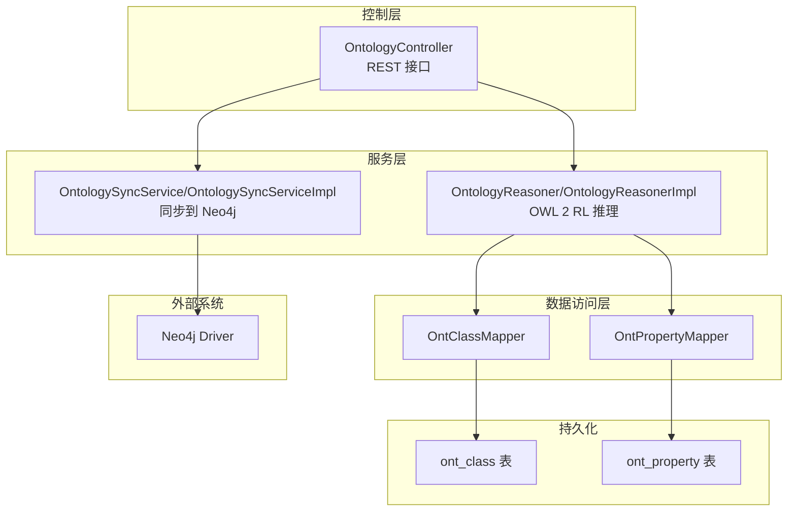
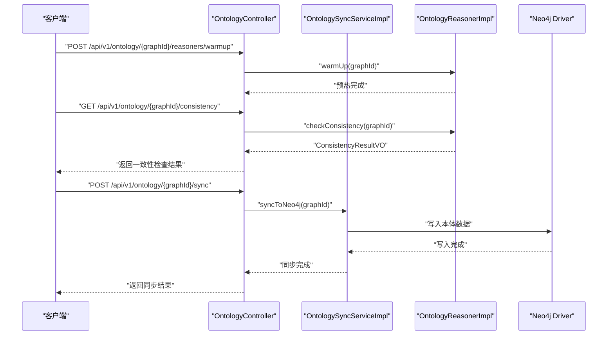
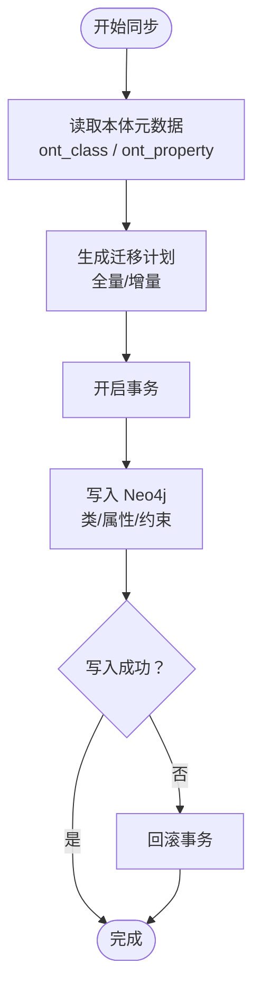
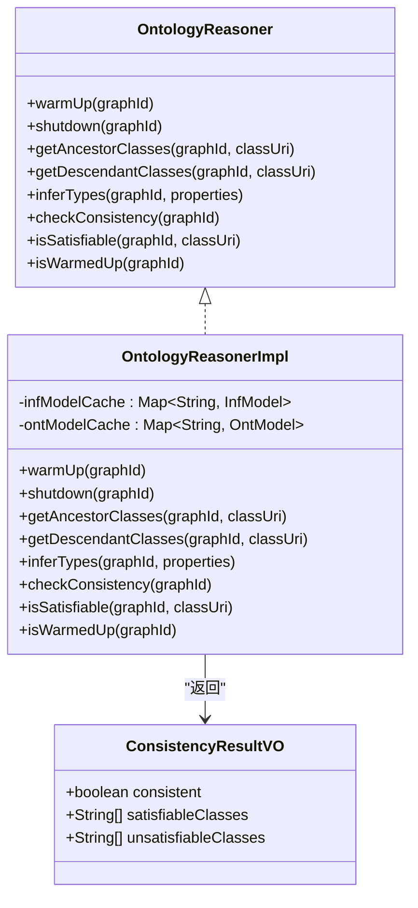
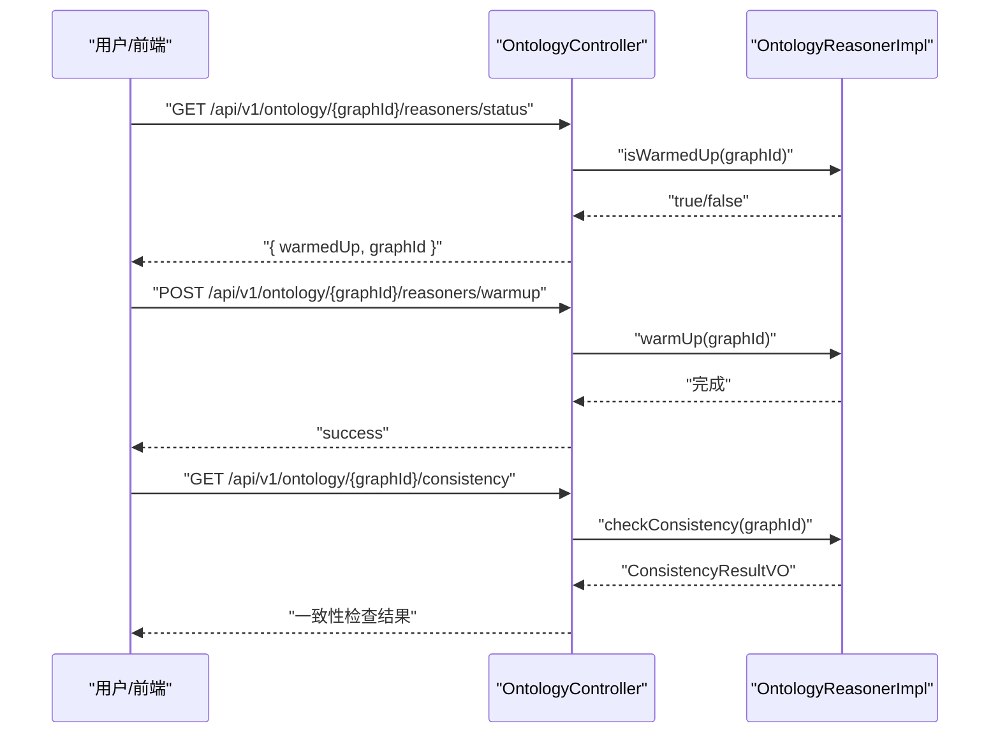
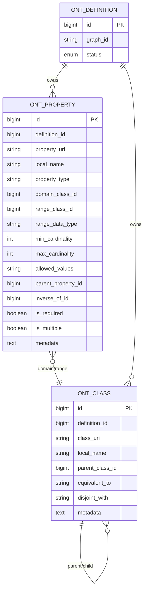
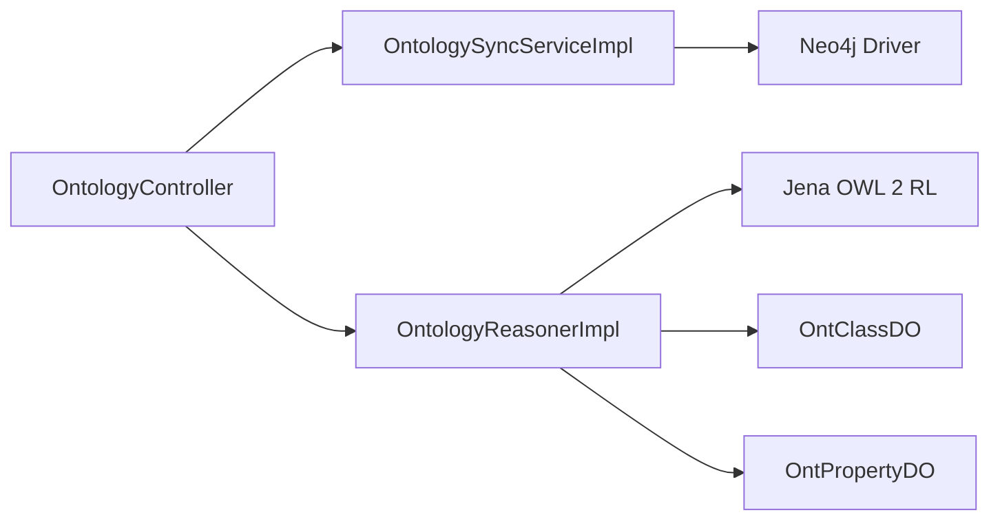

# 本体同步与推理

<!--<cite>
**本文引用的文件**
- [graphiti-module-core/src/main/java/com/graphiti/module/graphiti/service/impl/OntologySyncServiceImpl.java](file://graphiti-module-core/src/main/java/com/graphiti/module/graphiti/service/impl/OntologySyncServiceImpl.java)
- [graphiti-module-core/src/main/java/com/graphiti/module/graphiti/service/OntologySyncService.java](file://graphiti-module-core/src/main/java/com/graphiti/module/graphiti/service/OntologySyncService.java)
- [graphiti-module-core/src/main/java/com/graphiti/module/graphiti/service/impl/OntologyReasonerImpl.java](file://graphiti-module-core/src/main/java/com/graphiti/module/graphiti/service/impl/OntologyReasonerImpl.java)
- [graphiti-module-core/src/main/java/com/graphiti/module/graphiti/service/OntologyReasoner.java](file://graphiti-module-core/src/main/java/com/graphiti/module/graphiti/service/OntologyReasoner.java)
- [graphiti-module-core/src/main/java/com/graphiti/module/graphiti/controller/admin/OntologyController.java](file://graphiti-module-core/src/main/java/com/graphiti/module/graphiti/controller/admin/OntologyController.java)
- [graphiti-module-core/src/main/java/com/graphiti/module/graphiti/dal/mysql/ont/OntClassMapper.java](file://graphiti-module-core/src/main/java/com/graphiti/module/graphiti/dal/mysql/ont/OntClassMapper.java)
- [graphiti-module-core/src/main/java/com/graphiti/module/graphiti/dal/mysql/ont/OntPropertyMapper.java](file://graphiti-module-core/src/main/java/com/graphiti/module/graphiti/dal/mysql/ont/OntPropertyMapper.java)
- [graphiti-module-core/src/main/java/com/graphiti/module/graphiti/dal/dataobject/ont/OntClassDO.java](file://graphiti-module-core/src/main/java/com/graphiti/module/graphiti/dal/dataobject/ont/OntClassDO.java)
- [graphiti-module-core/src/main/java/com/graphiti/module/graphiti/dal/dataobject/ont/OntPropertyDO.java](file://graphiti-module-core/src/main/java/com/graphiti/module/graphiti/dal/dataobject/ont/OntPropertyDO.java)
- [graphiti-module-core/src/main/java/com/graphiti/module/graphiti/vo/ontology/ConsistencyResultVO.java](file://graphiti-module-core/src/main/java/com/graphiti/module/graphiti/vo/ontology/ConsistencyResultVO.java)
- [graphiti-module-core/src/test/java/com/graphiti/module/graphiti/service/OntologyReasonerImplTest.java](file://graphiti-module-core/src/test/java/com/graphiti/module/graphiti/service/OntologyReasonerImplTest.java)
- [graphiti-module-core/src/main/java/com/graphiti/module/graphiti/service/impl/Neo4jDriverAdapter.java](file://graphiti-module-core/src/main/java/com/graphiti/module/graphiti/service/impl/Neo4jDriverAdapter.java)
- [graphiti-module-core/src/main/java/com/graphiti/module/graphiti/config/GraphNeo4jConfig.java](file://graphiti-module-core/src/main/java/com/graphiti/module/graphiti/config/GraphNeo4jConfig.java)
- [docs/superpowers/plans/2026-05-10-ontology-phase2-4-remaining.md](file://docs/superpowers/plans/2026-05-10-ontology-phase2-4-remaining.md)
</cite>-->

## 目录
1. [引言](#引言)
2. [项目结构](#项目结构)
3. [核心组件](#核心组件)
4. [架构总览](#架构总览)
5. [详细组件分析](#详细组件分析)
6. [依赖分析](#依赖分析)
7. [性能考虑](#性能考虑)
8. [故障排查指南](#故障排查指南)
9. [结论](#结论)
10. [附录](#附录)

## 引言
本文件聚焦于“本体同步与推理”能力的技术文档，围绕以下目标展开：
- 本体同步服务（OntologySyncServiceImpl）的跨系统数据同步机制，包括数据迁移、版本对比与冲突解决策略的设计思路与落地路径。
- 本体推理服务（OntologyReasonerImpl）的 OWL 2 RL 推理实现，涵盖 Jena InfGraph 的集成、推理规则应用、预热机制、状态管理与性能优化。
- 一致性检查与推理结果验证的实现细节。
- 推理缓存、增量推理与分布式推理的支持方案设计。

当前仓库中，推理与同步功能处于“规划实现阶段”，本文在不臆造现有实现的前提下，基于接口与规划文档，给出可落地的架构与实现建议，并标注已实现或待实现部分。

## 项目结构
本体相关能力主要位于 graphiti-module-core 模块，采用分层架构：
- 控制层：OntologyController 提供本体管理与推理状态查询接口。
- 服务层：OntologySyncService/OntologySyncServiceImpl 负责本体到 Neo4j 的同步；OntologyReasoner/OntologyReasonerImpl 提供 OWL 2 RL 推理能力。
- 数据访问层：OntClassMapper/OntPropertyMapper 访问本体元数据表（ont_class、ont_property）。
- VO/DO：ConsistencyResultVO、OntClassDO、OntPropertyDO 定义一致性结果与本体数据模型。
- 测试：OntologyReasonerImplTest 验证推理机状态与行为边界。

图表来源
- [graphiti-module-core/src/main/java/com/graphiti/module/graphiti/controller/admin/OntologyController.java:1-232](file://graphiti-module-core/src/main/java/com/graphiti/module/graphiti/controller/admin/OntologyController.java#L1-L232)
- [graphiti-module-core/src/main/java/com/graphiti/module/graphiti/service/impl/OntologySyncServiceImpl.java:1-33](file://graphiti-module-core/src/main/java/com/graphiti/module/graphiti/service/impl/OntologySyncServiceImpl.java#L1-L33)
- [graphiti-module-core/src/main/java/com/graphiti/module/graphiti/service/impl/OntologyReasonerImpl.java:1-161](file://graphiti-module-core/src/main/java/com/graphiti/module/graphiti/service/impl/OntologyReasonerImpl.java#L1-L161)
- [graphiti-module-core/src/main/java/com/graphiti/module/graphiti/dal/mysql/ont/OntClassMapper.java:1-22](file://graphiti-module-core/src/main/java/com/graphiti/module/graphiti/dal/mysql/ont/OntClassMapper.java#L1-L22)
- [graphiti-module-core/src/main/java/com/graphiti/module/graphiti/dal/mysql/ont/OntPropertyMapper.java:1-23](file://graphiti-module-core/src/main/java/com/graphiti/module/graphiti/dal/mysql/ont/OntPropertyMapper.java#L1-L23)

章节来源
- [graphiti-module-core/src/main/java/com/graphiti/module/graphiti/controller/admin/OntologyController.java:1-232](file://graphiti-module-core/src/main/java/com/graphiti/module/graphiti/controller/admin/OntologyController.java#L1-L232)
- [graphiti-module-core/src/main/java/com/graphiti/module/graphiti/service/impl/OntologySyncServiceImpl.java:1-33](file://graphiti-module-core/src/main/java/com/graphiti/module/graphiti/service/impl/OntologySyncServiceImpl.java#L1-L33)
- [graphiti-module-core/src/main/java/com/graphiti/module/graphiti/service/impl/OntologyReasonerImpl.java:1-161](file://graphiti-module-core/src/main/java/com/graphiti/module/graphiti/service/impl/OntologyReasonerImpl.java#L1-L161)
- [graphiti-module-core/src/main/java/com/graphiti/module/graphiti/dal/mysql/ont/OntClassMapper.java:1-22](file://graphiti-module-core/src/main/java/com/graphiti/module/graphiti/dal/mysql/ont/OntClassMapper.java#L1-L22)
- [graphiti-module-core/src/main/java/com/graphiti/module/graphiti/dal/mysql/ont/OntPropertyMapper.java:1-23](file://graphiti-module-core/src/main/java/com/graphiti/module/graphiti/dal/mysql/ont/OntPropertyMapper.java#L1-L23)

## 核心组件
- 同步服务接口与实现
  - 接口：提供全量同步、增量同步与清理 Neo4j 本体数据的能力。
  - 实现：当前实现为占位，日志记录了同步流程，实际数据迁移逻辑需结合 GraphNeo4jService 与 Neo4j DriverAdapter 完成。
- 推理服务接口与实现
  - 接口：提供预热、关闭、祖先/后代类查询、类型推断、一致性检查、可满足性判断与状态查询。
  - 实现：使用 Jena OWL 2 RL 推理机，维护 InfModel 与 OntModel 缓存，支持类层次遍历与基础一致性检查。
- 控制器
  - 提供推理机状态查询、预热与一致性检查等 REST 接口，便于前端与运维使用。
- 数据访问层
  - 通过 Mapper 查询本体类与属性，支撑推理与验证所需的本体元数据。
- VO/DO
  - ConsistencyResultVO 描述一致性检查结果；OntClassDO/OntPropertyDO 描述本体结构与约束。

章节来源
- [graphiti-module-core/src/main/java/com/graphiti/module/graphiti/service/OntologySyncService.java:1-11](file://graphiti-module-core/src/main/java/com/graphiti/module/graphiti/service/OntologySyncService.java#L1-L11)
- [graphiti-module-core/src/main/java/com/graphiti/module/graphiti/service/impl/OntologySyncServiceImpl.java:1-33](file://graphiti-module-core/src/main/java/com/graphiti/module/graphiti/service/impl/OntologySyncServiceImpl.java#L1-L33)
- [graphiti-module-core/src/main/java/com/graphiti/module/graphiti/service/OntologyReasoner.java:1-25](file://graphiti-module-core/src/main/java/com/graphiti/module/graphiti/service/OntologyReasoner.java#L1-L25)
- [graphiti-module-core/src/main/java/com/graphiti/module/graphiti/service/impl/OntologyReasonerImpl.java:1-161](file://graphiti-module-core/src/main/java/com/graphiti/module/graphiti/service/impl/OntologyReasonerImpl.java#L1-L161)
- [graphiti-module-core/src/main/java/com/graphiti/module/graphiti/controller/admin/OntologyController.java:202-231](file://graphiti-module-core/src/main/java/com/graphiti/module/graphiti/controller/admin/OntologyController.java#L202-L231)
- [graphiti-module-core/src/main/java/com/graphiti/module/graphiti/dal/mysql/ont/OntClassMapper.java:1-22](file://graphiti-module-core/src/main/java/com/graphiti/module/graphiti/dal/mysql/ont/OntClassMapper.java#L1-L22)
- [graphiti-module-core/src/main/java/com/graphiti/module/graphiti/dal/mysql/ont/OntPropertyMapper.java:1-23](file://graphiti-module-core/src/main/java/com/graphiti/module/graphiti/dal/mysql/ont/OntPropertyMapper.java#L1-L23)
- [graphiti-module-core/src/main/java/com/graphiti/module/graphiti/vo/ontology/ConsistencyResultVO.java:1-15](file://graphiti-module-core/src/main/java/com/graphiti/module/graphiti/vo/ontology/ConsistencyResultVO.java#L1-L15)

## 架构总览
本体同步与推理的整体交互如下：
- 控制器接收请求，调用服务层。
- 同步服务负责将本体元数据写入 Neo4j（当前为占位，后续接入 GraphNeo4jService 与 Neo4j DriverAdapter）。
- 推理服务在预热时构建 Jena 推理模型，提供类层次查询与一致性检查；支持按图谱维度缓存推理模型，便于多租户隔离。

图表来源
- [graphiti-module-core/src/main/java/com/graphiti/module/graphiti/controller/admin/OntologyController.java:202-231](file://graphiti-module-core/src/main/java/com/graphiti/module/graphiti/controller/admin/OntologyController.java#L202-L231)
- [graphiti-module-core/src/main/java/com/graphiti/module/graphiti/service/impl/OntologySyncServiceImpl.java:16-31](file://graphiti-module-core/src/main/java/com/graphiti/module/graphiti/service/impl/OntologySyncServiceImpl.java#L16-L31)
- [graphiti-module-core/src/main/java/com/graphiti/module/graphiti/service/impl/OntologyReasonerImpl.java:27-53](file://graphiti-module-core/src/main/java/com/graphiti/module/graphiti/service/impl/OntologyReasonerImpl.java#L27-L53)

## 详细组件分析

### 同步服务组件分析
- 职责
  - 全量同步：将本体定义写入 Neo4j。
  - 增量同步：按类 ID 范围进行增量迁移。
  - 清理：清空 Neo4j 中的本体数据。
- 当前实现
  - 占位实现仅记录日志，未实际写入 Neo4j。
- 建议实现要点
  - 读取本体元数据：通过 OntClassMapper/OntPropertyMapper 获取类与属性定义。
  - 写入策略：将类与属性映射为 Neo4j 节点与关系，建立类层次与属性域/范围约束。
  - 版本对比与冲突解决：基于版本历史（ont_version_history）比较差异，采用“保留最新”或“合并策略”处理冲突。
  - 并发与幂等：使用事务保证一致性，避免重复写入。

图表来源
- [graphiti-module-core/src/main/java/com/graphiti/module/graphiti/service/impl/OntologySyncServiceImpl.java:16-31](file://graphiti-module-core/src/main/java/com/graphiti/module/graphiti/service/impl/OntologySyncServiceImpl.java#L16-L31)
- [graphiti-module-core/src/main/java/com/graphiti/module/graphiti/dal/mysql/ont/OntClassMapper.java:13-20](file://graphiti-module-core/src/main/java/com/graphiti/module/graphiti/dal/mysql/ont/OntClassMapper.java#L13-L20)
- [graphiti-module-core/src/main/java/com/graphiti/module/graphiti/dal/mysql/ont/OntPropertyMapper.java:14-21](file://graphiti-module-core/src/main/java/com/graphiti/module/graphiti/dal/mysql/ont/OntPropertyMapper.java#L14-L21)

章节来源
- [graphiti-module-core/src/main/java/com/graphiti/module/graphiti/service/OntologySyncService.java:1-11](file://graphiti-module-core/src/main/java/com/graphiti/module/graphiti/service/OntologySyncService.java#L1-L11)
- [graphiti-module-core/src/main/java/com/graphiti/module/graphiti/service/impl/OntologySyncServiceImpl.java:1-33](file://graphiti-module-core/src/main/java/com/graphiti/module/graphiti/service/impl/OntologySyncServiceImpl.java#L1-L33)
- [graphiti-module-core/src/main/java/com/graphiti/module/graphiti/dal/mysql/ont/OntClassMapper.java:1-22](file://graphiti-module-core/src/main/java/com/graphiti/module/graphiti/dal/mysql/ont/OntClassMapper.java#L1-L22)
- [graphiti-module-core/src/main/java/com/graphiti/module/graphiti/dal/mysql/ont/OntPropertyMapper.java:1-23](file://graphiti-module-core/src/main/java/com/graphiti/module/graphiti/dal/mysql/ont/OntPropertyMapper.java#L1-L23)

### 推理服务组件分析
- 职责
  - 预热：为指定 graphId 构建并缓存推理模型（InfModel/OntModel）。
  - 关闭：释放缓存与资源。
  - 类层次查询：祖先/后代类递归收集。
  - 一致性检查：基于核心类的可满足性判断。
  - 可满足性判断：判断类是否存在实例或被继承。
  - 状态查询：判断推理机是否已预热。
- Jena 集成
  - 使用 OWL 2 RL 推理机，绑定本体模式，构建推理图。
  - 通过 RDFS:subClassOf 进行类层次遍历。
- 缓存与并发
  - 使用并发安全的 Map 缓存推理模型，按 graphId 隔离。
  - 关键方法加同步锁，确保预热/关闭过程的原子性。

图表来源
- [graphiti-module-core/src/main/java/com/graphiti/module/graphiti/service/OntologyReasoner.java:1-25](file://graphiti-module-core/src/main/java/com/graphiti/module/graphiti/service/OntologyReasoner.java#L1-L25)
- [graphiti-module-core/src/main/java/com/graphiti/module/graphiti/service/impl/OntologyReasonerImpl.java:21-161](file://graphiti-module-core/src/main/java/com/graphiti/module/graphiti/service/impl/OntologyReasonerImpl.java#L21-L161)
- [graphiti-module-core/src/main/java/com/graphiti/module/graphiti/vo/ontology/ConsistencyResultVO.java:1-15](file://graphiti-module-core/src/main/java/com/graphiti/module/graphiti/vo/ontology/ConsistencyResultVO.java#L1-L15)

章节来源
- [graphiti-module-core/src/main/java/com/graphiti/module/graphiti/service/OntologyReasoner.java:1-25](file://graphiti-module-core/src/main/java/com/graphiti/module/graphiti/service/OntologyReasoner.java#L1-L25)
- [graphiti-module-core/src/main/java/com/graphiti/module/graphiti/service/impl/OntologyReasonerImpl.java:1-161](file://graphiti-module-core/src/main/java/com/graphiti/module/graphiti/service/impl/OntologyReasonerImpl.java#L1-L161)
- [graphiti-module-core/src/main/java/com/graphiti/module/graphiti/vo/ontology/ConsistencyResultVO.java:1-15](file://graphiti-module-core/src/main/java/com/graphiti/module/graphiti/vo/ontology/ConsistencyResultVO.java#L1-L15)

### 控制器与接口序列

图表来源
- [graphiti-module-core/src/main/java/com/graphiti/module/graphiti/controller/admin/OntologyController.java:202-231](file://graphiti-module-core/src/main/java/com/graphiti/module/graphiti/controller/admin/OntologyController.java#L202-L231)
- [graphiti-module-core/src/main/java/com/graphiti/module/graphiti/service/impl/OntologyReasonerImpl.java:27-53](file://graphiti-module-core/src/main/java/com/graphiti/module/graphiti/service/impl/OntologyReasonerImpl.java#L27-L53)
- [graphiti-module-core/src/main/java/com/graphiti/module/graphiti/service/impl/OntologyReasonerImpl.java:89-118](file://graphiti-module-core/src/main/java/com/graphiti/module/graphiti/service/impl/OntologyReasonerImpl.java#L89-L118)

章节来源
- [graphiti-module-core/src/main/java/com/graphiti/module/graphiti/controller/admin/OntologyController.java:202-231](file://graphiti-module-core/src/main/java/com/graphiti/module/graphiti/controller/admin/OntologyController.java#L202-L231)

### 数据模型与映射
- 本体类（ont_class）
  - 字段：definition_id、class_uri、local_name、parent_class_id、equivalent_to、disjoint_with、metadata 等。
- 本体属性（ont_property）
  - 字段：definition_id、property_uri、local_name、property_type、domain_class_id、range_class_id、range_data_type、cardinality、metadata 等。
- 映射关系
  - 类与属性通过 definition_id 关联到同一本体版本。
  - 类的父子关系通过 parent_class_id 维护层次结构。
  - 属性的域/范围通过 domain_class_id/range_class_id 关联到类。

图表来源
- [graphiti-module-core/src/main/java/com/graphiti/module/graphiti/dal/dataobject/ont/OntClassDO.java:10-48](file://graphiti-module-core/src/main/java/com/graphiti/module/graphiti/dal/dataobject/ont/OntClassDO.java#L10-L48)
- [graphiti-module-core/src/main/java/com/graphiti/module/graphiti/dal/dataobject/ont/OntPropertyDO.java:10-77](file://graphiti-module-core/src/main/java/com/graphiti/module/graphiti/dal/dataobject/ont/OntPropertyDO.java#L10-L77)

章节来源
- [graphiti-module-core/src/main/java/com/graphiti/module/graphiti/dal/dataobject/ont/OntClassDO.java:1-49](file://graphiti-module-core/src/main/java/com/graphiti/module/graphiti/dal/dataobject/ont/OntClassDO.java#L1-L49)
- [graphiti-module-core/src/main/java/com/graphiti/module/graphiti/dal/dataobject/ont/OntPropertyDO.java:1-78](file://graphiti-module-core/src/main/java/com/graphiti/module/graphiti/dal/dataobject/ont/OntPropertyDO.java#L1-L78)
- [graphiti-module-core/src/main/java/com/graphiti/module/graphiti/dal/mysql/ont/OntClassMapper.java:1-22](file://graphiti-module-core/src/main/java/com/graphiti/module/graphiti/dal/mysql/ont/OntClassMapper.java#L1-L22)
- [graphiti-module-core/src/main/java/com/graphiti/module/graphiti/dal/mysql/ont/OntPropertyMapper.java:1-23](file://graphiti-module-core/src/main/java/com/graphiti/module/graphiti/dal/mysql/ont/OntPropertyMapper.java#L1-L23)

## 依赖分析
- 组件耦合
  - 控制器依赖服务接口，降低对具体实现的耦合。
  - 推理服务依赖 Jena API，面向接口编程，便于替换实现。
  - 同步服务依赖 Neo4j 驱动与 GraphNeo4jService，当前实现为占位，耦合度低，便于扩展。
- 外部依赖
  - Jena（OWL 2 RL 推理机、InfModel、OntModel）。
  - Neo4j Driver（驱动适配器与配置）。
- 循环依赖
  - 未发现循环依赖迹象。

图表来源
- [graphiti-module-core/src/main/java/com/graphiti/module/graphiti/controller/admin/OntologyController.java:202-231](file://graphiti-module-core/src/main/java/com/graphiti/module/graphiti/controller/admin/OntologyController.java#L202-L231)
- [graphiti-module-core/src/main/java/com/graphiti/module/graphiti/service/impl/OntologySyncServiceImpl.java:1-33](file://graphiti-module-core/src/main/java/com/graphiti/module/graphiti/service/impl/OntologySyncServiceImpl.java#L1-L33)
- [graphiti-module-core/src/main/java/com/graphiti/module/graphiti/service/impl/OntologyReasonerImpl.java:1-161](file://graphiti-module-core/src/main/java/com/graphiti/module/graphiti/service/impl/OntologyReasonerImpl.java#L1-L161)
- [graphiti-module-core/src/main/java/com/graphiti/module/graphiti/dal/dataobject/ont/OntClassDO.java:1-49](file://graphiti-module-core/src/main/java/com/graphiti/module/graphiti/dal/dataobject/ont/OntClassDO.java#L1-L49)
- [graphiti-module-core/src/main/java/com/graphiti/module/graphiti/dal/dataobject/ont/OntPropertyDO.java:1-78](file://graphiti-module-core/src/main/java/com/graphiti/module/graphiti/dal/dataobject/ont/OntPropertyDO.java#L1-L78)

章节来源
- [graphiti-module-core/src/main/java/com/graphiti/module/graphiti/service/impl/OntologySyncServiceImpl.java:1-33](file://graphiti-module-core/src/main/java/com/graphiti/module/graphiti/service/impl/OntologySyncServiceImpl.java#L1-L33)
- [graphiti-module-core/src/main/java/com/graphiti/module/graphiti/service/impl/OntologyReasonerImpl.java:1-161](file://graphiti-module-core/src/main/java/com/graphiti/module/graphiti/service/impl/OntologyReasonerImpl.java#L1-L161)

## 性能考虑
- 推理缓存
  - 按 graphId 缓存 InfModel/OntModel，避免重复构建；在服务关闭或内存压力时清理。
- 并发与线程安全
  - 预热/关闭方法加同步锁，防止并发修改缓存导致的竞态。
- 类层次遍历
  - 使用递归遍历 RDFS:subClassOf，建议限制最大深度与去重集合，避免无限递归与重复计算。
- 一致性检查
  - 仅检查核心类（如 owl:Thing、rdfs:Resource）的可满足性，减少开销。
- 同步性能
  - 增量同步按类 ID 范围迁移，结合数据库索引与批处理提升吞吐。
  - 事务分片与幂等写入，降低锁竞争与回滚概率。

## 故障排查指南
- 推理机未初始化
  - 现象：一致性检查返回“推理机未初始化”，可满足性判断返回默认值。
  - 处理：先调用预热接口，再执行一致性检查。
- 类层次查询为空
  - 现象：祖先/后代类查询返回空列表。
  - 处理：确认推理机已预热且类 URI 正确；检查本体中是否存在该类。
- 同步失败
  - 现象：同步接口返回异常或数据未写入。
  - 处理：检查 Neo4j 连接配置与权限；确认 GraphNeo4jService 与 Neo4j DriverAdapter 正常工作。

章节来源
- [graphiti-module-core/src/test/java/com/graphiti/module/graphiti/service/OntologyReasonerImplTest.java:46-56](file://graphiti-module-core/src/test/java/com/graphiti/module/graphiti/service/OntologyReasonerImplTest.java#L46-L56)
- [graphiti-module-core/src/main/java/com/graphiti/module/graphiti/service/impl/OntologyReasonerImpl.java:89-118](file://graphiti-module-core/src/main/java/com/graphiti/module/graphiti/service/impl/OntologyReasonerImpl.java#L89-L118)
- [graphiti-module-core/src/main/java/com/graphiti/module/graphiti/service/impl/Neo4jDriverAdapter.java:1-83](file://graphiti-module-core/src/main/java/com/graphiti/module/graphiti/service/impl/Neo4jDriverAdapter.java#L1-L83)
- [graphiti-module-core/src/main/java/com/graphiti/module/graphiti/config/GraphNeo4jConfig.java:1-46](file://graphiti-module-core/src/main/java/com/graphiti/module/graphiti/config/GraphNeo4jConfig.java#L1-L46)

## 结论
- 同步与推理模块目前处于“接口定义+占位实现+规划落地”的阶段。推理侧已具备 Jena 集成与基础一致性检查能力；同步侧需进一步对接 Neo4j 与 GraphNeo4jService。
- 建议优先完成同步服务的完整实现，随后完善推理服务的类型推断与约束验证，最终形成闭环的本体治理能力。

## 附录

### 推理缓存、增量推理与分布式推理支持方案
- 推理缓存
  - 按 graphId 维度缓存 InfModel/OntModel；提供预热/关闭接口；在内存不足时触发淘汰策略。
- 增量推理
  - 基于版本历史（ont_version_history）识别变更，仅对受影响的类/属性进行推理模型更新；结合类层次传播，减少全量重算。
- 分布式推理
  - 将不同 graphId 的推理模型分布到不同节点；通过缓存键空间隔离；在集群中引入 TTL 与失效广播，保持一致性。

章节来源
- [docs/superpowers/plans/2026-05-10-ontology-phase2-4-remaining.md:1244-1248](file://docs/superpowers/plans/2026-05-10-ontology-phase2-4-remaining.md#L1244-L1248)