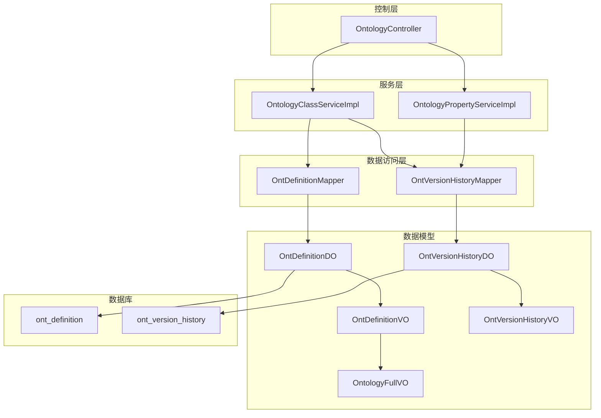
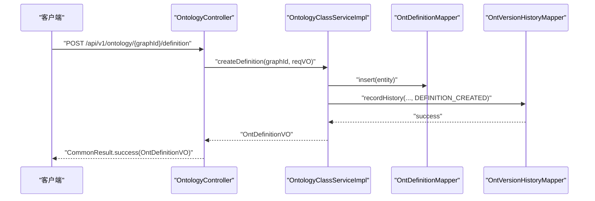
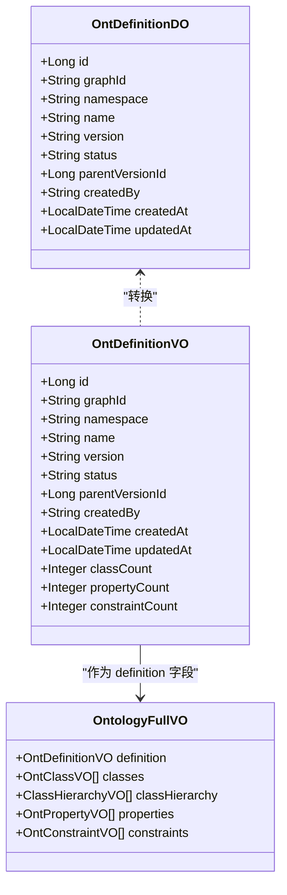
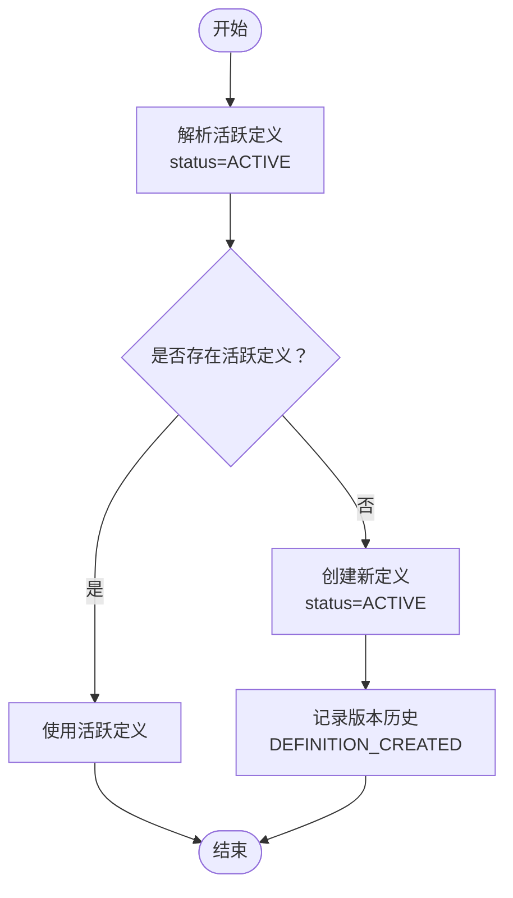
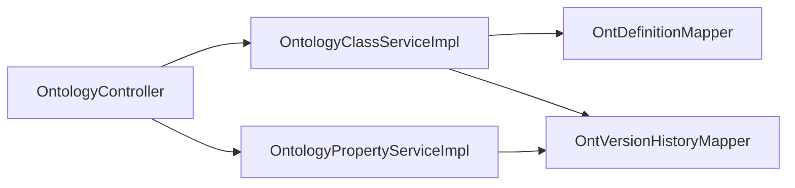

# 本体定义管理

<!--<cite>
**本文档引用的文件**
- [OntologyController.java](file://graphiti-module-core/src/main/java/com/graphiti/module/graphiti/controller/admin/OntologyController.java)
- [OntologyClassServiceImpl.java](file://graphiti-module-core/src/main/java/com/graphiti/module/graphiti/service/impl/OntologyClassServiceImpl.java)
- [OntologyPropertyServiceImpl.java](file://graphiti-module-core/src/main/java/com/graphiti/module/graphiti/service/impl/OntologyPropertyServiceImpl.java)
- [OntDefinitionDO.java](file://graphiti-module-core/src/main/java/com/graphiti/module/graphiti/dal/dataobject/ont/OntDefinitionDO.java)
- [OntDefinitionVO.java](file://graphiti-module-core/src/main/java/com/graphiti/module/graphiti/vo/ontology/OntDefinitionVO.java)
- [OntologyFullVO.java](file://graphiti-module-core/src/main/java/com/graphiti/module/graphiti/vo/ontology/OntologyFullVO.java)
- [OntVersionHistoryDO.java](file://graphiti-module-core/src/main/java/com/graphiti/module/graphiti/dal/dataobject/ont/OntVersionHistoryDO.java)
- [OntVersionHistoryVO.java](file://graphiti-module-core/src/main/java/com/graphiti/module/graphiti/vo/ontology/OntVersionHistoryVO.java)
- [OntDefinitionMapper.java](file://graphiti-module-core/src/main/java/com/graphiti/module/graphiti/dal/mysql/ont/OntDefinitionMapper.java)
- [OntVersionHistoryMapper.java](file://graphiti-module-core/src/main/java/com/graphiti/module/graphiti/dal/mysql/ont/OntVersionHistoryMapper.java)
- [OntologyClassService.java](file://graphiti-module-core/src/main/java/com/graphiti/module/graphiti/service/OntologyClassService.java)
- [OntologyPropertyService.java](file://graphiti-module-core/src/main/java/com/graphiti/module/graphiti/service/OntologyPropertyService.java)
- [V1__create_ontology_tables.sql](file://sql/postgresql/V1__create_ontology_tables.sql)
</cite>-->

## 目录
1. [简介](#简介)
2. [项目结构](#项目结构)
3. [核心组件](#核心组件)
4. [架构总览](#架构总览)
5. [详细组件分析](#详细组件分析)
6. [依赖分析](#依赖分析)
7. [性能考虑](#性能考虑)
8. [故障排查指南](#故障排查指南)
9. [结论](#结论)
10. [附录](#附录)

## 简介
本文件聚焦于“本体定义管理”能力，系统性阐述本体定义的创建、查询与版本控制机制，覆盖 OntologyController 中定义管理接口的完整实现，以及本体定义的数据结构（OntDefinitionDO）与视图对象（OntDefinitionVO、OntologyFullVO）的设计与用途。文档还包含激活机制、版本切换逻辑、数据迁移策略、API 调用示例、错误处理与并发控制、事务管理等关键主题。

## 项目结构
围绕本体定义管理的关键模块与文件组织如下：
- 控制层：OntologyController 提供本体定义的查询与创建接口，并聚合类、属性、约束与版本历史管理。
- 服务层：OntologyClassServiceImpl 与 OntologyPropertyServiceImpl 实现具体业务逻辑，负责定义、类、属性、约束与版本历史的增删改查与一致性校验。
- 数据访问层：各 Mapper 接口（如 OntDefinitionMapper、OntVersionHistoryMapper）通过 MyBatis-Plus 访问数据库。
- 数据模型：OntDefinitionDO、OntDefinitionVO、OntologyFullVO、OntVersionHistoryDO、OntVersionHistoryVO 描述持久化与对外传输的数据结构。
- 数据库脚本：V1__create_ontology_tables.sql 定义本体相关表结构及索引。

**图表来源**
- [OntologyController.java:16-232](file://graphiti-module-core/src/main/java/com/graphiti/module/graphiti/controller/admin/OntologyController.java#L16-L232)
- [OntologyClassServiceImpl.java:34-368](file://graphiti-module-core/src/main/java/com/graphiti/module/graphiti/service/impl/OntologyClassServiceImpl.java#L34-L368)
- [OntologyPropertyServiceImpl.java:26-374](file://graphiti-module-core/src/main/java/com/graphiti/module/graphiti/service/impl/OntologyPropertyServiceImpl.java#L26-L374)
- [OntDefinitionMapper.java:1-10](file://graphiti-module-core/src/main/java/com/graphiti/module/graphiti/dal/mysql/ont/OntDefinitionMapper.java#L1-L10)
- [OntVersionHistoryMapper.java:1-16](file://graphiti-module-core/src/main/java/com/graphiti/module/graphiti/dal/mysql/ont/OntVersionHistoryMapper.java#L1-L16)
- [OntDefinitionDO.java:1-36](file://graphiti-module-core/src/main/java/com/graphiti/module/graphiti/dal/dataobject/ont/OntDefinitionDO.java#L1-L36)
- [OntDefinitionVO.java:1-64](file://graphiti-module-core/src/main/java/com/graphiti/module/graphiti/vo/ontology/OntDefinitionVO.java#L1-L64)
- [OntologyFullVO.java:1-37](file://graphiti-module-core/src/main/java/com/graphiti/module/graphiti/vo/ontology/OntologyFullVO.java#L1-L37)
- [OntVersionHistoryDO.java:1-31](file://graphiti-module-core/src/main/java/com/graphiti/module/graphiti/dal/dataobject/ont/OntVersionHistoryDO.java#L1-L31)
- [OntVersionHistoryVO.java:1-54](file://graphiti-module-core/src/main/java/com/graphiti/module/graphiti/vo/ontology/OntVersionHistoryVO.java#L1-L54)
- [V1__create_ontology_tables.sql:1-126](file://sql/postgresql/V1__create_ontology_tables.sql#L1-L126)

**章节来源**
- [OntologyController.java:16-232](file://graphiti-module-core/src/main/java/com/graphiti/module/graphiti/controller/admin/OntologyController.java#L16-L232)
- [V1__create_ontology_tables.sql:1-126](file://sql/postgresql/V1__create_ontology_tables.sql#L1-L126)

## 核心组件
- 控制器接口：提供本体定义的获取与创建、完整本体信息查询、批量验证、类/属性/约束管理、版本历史查询、Schema.org 导入与推理机状态管理等。
- 服务实现：
  - OntologyClassServiceImpl：负责本体定义的创建与查询、类的增删改查、类层次构建、统计数量、版本历史记录。
  - OntologyPropertyServiceImpl：负责属性与约束的增删改查、属性祖先链查询、版本历史记录。
- 数据模型：
  - OntDefinitionDO/OntDefinitionVO：描述本体定义的持久化与对外传输结构，包含命名空间、名称、版本、状态、父子版本关系、创建者与时间戳等。
  - OntologyFullVO：封装完整本体信息，包含定义、类列表、类层次树、属性列表与约束列表。
  - OntVersionHistoryDO/OntVersionHistoryVO：记录每次变更的类型、实体类型、前后状态快照、摘要与变更人。
- 数据访问层：通过 Mapper 接口访问数据库，支持按定义 ID 查询版本历史、插入定义与历史记录。

**章节来源**
- [OntologyController.java:32-55](file://graphiti-module-core/src/main/java/com/graphiti/module/graphiti/controller/admin/OntologyController.java#L32-L55)
- [OntologyClassServiceImpl.java:45-98](file://graphiti-module-core/src/main/java/com/graphiti/module/graphiti/service/impl/OntologyClassServiceImpl.java#L45-L98)
- [OntologyPropertyServiceImpl.java:37-118](file://graphiti-module-core/src/main/java/com/graphiti/module/graphiti/service/impl/OntologyPropertyServiceImpl.java#L37-L118)
- [OntDefinitionDO.java:10-35](file://graphiti-module-core/src/main/java/com/graphiti/module/graphiti/dal/dataobject/ont/OntDefinitionDO.java#L10-L35)
- [OntDefinitionVO.java:20-63](file://graphiti-module-core/src/main/java/com/graphiti/module/graphiti/vo/ontology/OntDefinitionVO.java#L20-L63)
- [OntologyFullVO.java:22-36](file://graphiti-module-core/src/main/java/com/graphiti/module/graphiti/vo/ontology/OntologyFullVO.java#L22-L36)
- [OntVersionHistoryDO.java:10-30](file://graphiti-module-core/src/main/java/com/graphiti/module/graphiti/dal/dataobject/ont/OntVersionHistoryDO.java#L10-L30)
- [OntVersionHistoryVO.java:19-53](file://graphiti-module-core/src/main/java/com/graphiti/module/graphiti/vo/ontology/OntVersionHistoryVO.java#L19-L53)

## 架构总览
本体定义管理采用分层架构：控制层统一入口，服务层承载业务规则与事务边界，数据访问层屏蔽数据库细节，数据模型贯穿各层。版本历史贯穿所有写操作，确保可追溯性。

**图表来源**
- [OntologyController.java:40-47](file://graphiti-module-core/src/main/java/com/graphiti/module/graphiti/controller/admin/OntologyController.java#L40-L47)
- [OntologyClassServiceImpl.java:45-62](file://graphiti-module-core/src/main/java/com/graphiti/module/graphiti/service/impl/OntologyClassServiceImpl.java#L45-L62)
- [OntDefinitionMapper.java:1-10](file://graphiti-module-core/src/main/java/com/graphiti/module/graphiti/dal/mysql/ont/OntDefinitionMapper.java#L1-L10)
- [OntVersionHistoryMapper.java:1-16](file://graphiti-module-core/src/main/java/com/graphiti/module/graphiti/dal/mysql/ont/OntVersionHistoryMapper.java#L1-L16)

## 详细组件分析

### 本体定义数据结构与视图对象
- OntDefinitionDO：持久化实体，包含自增主键、图谱标识、命名空间、名称、版本、状态（ACTIVE/DEPRECATED/ARCHIVED）、父版本 ID、创建与更新时间、创建者等字段。
- OntDefinitionVO：对外传输对象，扩展了类/属性/约束数量统计字段，便于前端展示与概览。
- OntologyFullVO：组合视图，包含定义、类列表、类层次树、属性列表与约束列表，用于一次性获取完整本体信息。

**图表来源**
- [OntDefinitionDO.java:10-35](file://graphiti-module-core/src/main/java/com/graphiti/module/graphiti/dal/dataobject/ont/OntDefinitionDO.java#L10-L35)
- [OntDefinitionVO.java:20-63](file://graphiti-module-core/src/main/java/com/graphiti/module/graphiti/vo/ontology/OntDefinitionVO.java#L20-L63)
- [OntologyFullVO.java:22-36](file://graphiti-module-core/src/main/java/com/graphiti/module/graphiti/vo/ontology/OntologyFullVO.java#L22-L36)

**章节来源**
- [OntDefinitionDO.java:10-35](file://graphiti-module-core/src/main/java/com/graphiti/module/graphiti/dal/dataobject/ont/OntDefinitionDO.java#L10-L35)
- [OntDefinitionVO.java:20-63](file://graphiti-module-core/src/main/java/com/graphiti/module/graphiti/vo/ontology/OntDefinitionVO.java#L20-L63)
- [OntologyFullVO.java:22-36](file://graphiti-module-core/src/main/java/com/graphiti/module/graphiti/vo/ontology/OntologyFullVO.java#L22-L36)

### 控制器接口与API调用示例
- 获取本体定义：GET /api/v1/ontology/{graphId}/definition
- 创建本体定义：POST /api/v1/ontology/{graphId}/definition
- 获取完整本体：GET /api/v1/ontology/{graphId}
- 批量验证：POST /api/v1/ontology/{graphId}/validate/batch
- 版本历史：GET /api/v1/ontology/{graphId}/history
- Schema.org 导入：POST /api/v1/ontology/{graphId}/import/schema-org
- 推理机状态与预热：GET /api/v1/ontology/{graphId}/reasoners/status, POST /api/v1/ontology/{graphId}/reasoners/warmup
- 一致性检查：GET /api/v1/ontology/{graphId}/consistency

以下为典型调用流程（以创建本体定义为例）：

**图表来源**
- [OntologyController.java:40-47](file://graphiti-module-core/src/main/java/com/graphiti/module/graphiti/controller/admin/OntologyController.java#L40-L47)
- [OntologyClassServiceImpl.java:45-62](file://graphiti-module-core/src/main/java/com/graphiti/module/graphiti/service/impl/OntologyClassServiceImpl.java#L45-L62)
- [OntDefinitionMapper.java:1-10](file://graphiti-module-core/src/main/java/com/graphiti/module/graphiti/dal/mysql/ont/OntDefinitionMapper.java#L1-L10)
- [OntVersionHistoryMapper.java:1-16](file://graphiti-module-core/src/main/java/com/graphiti/module/graphiti/dal/mysql/ont/OntVersionHistoryMapper.java#L1-L16)

**章节来源**
- [OntologyController.java:32-55](file://graphiti-module-core/src/main/java/com/graphiti/module/graphiti/controller/admin/OntologyController.java#L32-L55)

### 本体定义的激活机制与版本控制
- 激活机制：服务层通过查询 ACTIVE 状态的定义作为当前活跃版本，保证同一图谱仅有一个活跃定义。
- 版本控制：定义表包含 version 与 parent_version_id 字段，支持版本号演进与父子版本关联；版本历史表记录每次变更的前后状态快照与摘要。
- 版本切换逻辑：当前实现通过 ACTIVE 状态唯一性保障切换；如需多版本并存或回滚，可在现有基础上扩展版本切换策略（例如新增版本切换接口与历史回放机制）。

**图表来源**
- [OntologyClassServiceImpl.java:204-215](file://graphiti-module-core/src/main/java/com/graphiti/module/graphiti/service/impl/OntologyClassServiceImpl.java#L204-L215)
- [OntologyClassServiceImpl.java:45-62](file://graphiti-module-core/src/main/java/com/graphiti/module/graphiti/service/impl/OntologyClassServiceImpl.java#L45-L62)
- [V1__create_ontology_tables.sql:4-17](file://sql/postgresql/V1__create_ontology_tables.sql#L4-L17)

**章节来源**
- [OntologyClassServiceImpl.java:204-215](file://graphiti-module-core/src/main/java/com/graphiti/module/graphiti/service/impl/OntologyClassServiceImpl.java#L204-L215)
- [V1__create_ontology_tables.sql:4-17](file://sql/postgresql/V1__create_ontology_tables.sql#L4-L17)

### 数据迁移策略
- 表结构演进：通过数据库迁移脚本（如 V1__create_ontology_tables.sql）定义表结构与索引，后续版本可通过新增列、索引或表的方式进行演进。
- 历史兼容：版本历史记录保留变更前后状态，便于回溯与审计；迁移时可基于历史记录进行数据对齐与修复。
- 外部本体对齐：提供 ont_mapping 表用于外部本体（如 Schema.org）映射，支持增量对齐与冲突处理。

**章节来源**
- [V1__create_ontology_tables.sql:113-126](file://sql/postgresql/V1__create_ontology_tables.sql#L113-L126)

### 错误处理与并发控制
- 业务异常：服务层抛出 BusinessException，携带明确的错误码与消息，便于前端与调用方处理。
- 并发控制：通过数据库唯一约束（如定义表的唯一索引）与服务层查询限制（ACTIVE 唯一）降低并发风险。
- 事务管理：写操作使用 @Transactional，确保单次操作的原子性；历史记录与主数据写入在同一事务内完成。

**章节来源**
- [OntologyClassServiceImpl.java:75-76](file://graphiti-module-core/src/main/java/com/graphiti/module/graphiti/service/impl/OntologyClassServiceImpl.java#L75-L76)
- [OntologyPropertyServiceImpl.java:48-53](file://graphiti-module-core/src/main/java/com/graphiti/module/graphiti/service/impl/OntologyPropertyServiceImpl.java#L48-L53)
- [V1__create_ontology_tables.sql:16-17](file://sql/postgresql/V1__create_ontology_tables.sql#L16-L17)

## 依赖分析
- 控制器依赖服务接口：OntologyController 注入 OntologyValidationService、OntologyClassService、OntologyPropertyService、OntologyReasoner、SchemaOrgImportService。
- 服务实现依赖 Mapper：OntologyClassServiceImpl 与 OntologyPropertyServiceImpl 依赖对应的 Mapper 进行数据访问。
- 数据模型依赖：DO/VO 之间通过 toXxx 方法相互转换，保持数据一致性。

**图表来源**
- [OntologyController.java:25-29](file://graphiti-module-core/src/main/java/com/graphiti/module/graphiti/controller/admin/OntologyController.java#L25-L29)
- [OntologyClassServiceImpl.java:36-41](file://graphiti-module-core/src/main/java/com/graphiti/module/graphiti/service/impl/OntologyClassServiceImpl.java#L36-L41)
- [OntologyPropertyServiceImpl.java:28-33](file://graphiti-module-core/src/main/java/com/graphiti/module/graphiti/service/impl/OntologyPropertyServiceImpl.java#L28-L33)
- [OntDefinitionMapper.java:1-10](file://graphiti-module-core/src/main/java/com/graphiti/module/graphiti/dal/mysql/ont/OntDefinitionMapper.java#L1-L10)
- [OntVersionHistoryMapper.java:1-16](file://graphiti-module-core/src/main/java/com/graphiti/module/graphiti/dal/mysql/ont/OntVersionHistoryMapper.java#L1-L16)

**章节来源**
- [OntologyController.java:25-29](file://graphiti-module-core/src/main/java/com/graphiti/module/graphiti/controller/admin/OntologyController.java#L25-L29)
- [OntologyClassServiceImpl.java:36-41](file://graphiti-module-core/src/main/java/com/graphiti/module/graphiti/service/impl/OntologyClassServiceImpl.java#L36-L41)
- [OntologyPropertyServiceImpl.java:28-33](file://graphiti-module-core/src/main/java/com/graphiti/module/graphiti/service/impl/OntologyPropertyServiceImpl.java#L28-L33)

## 性能考虑
- 索引优化：定义表与历史表均建立必要索引（如 graph_id、status、definition_id、changed_at），提升查询效率。
- 批量查询：类层次构建与属性/约束查询采用按定义 ID 的批量查询，减少 N+1 查询开销。
- 序列化成本：版本历史记录使用 JSON 文本存储前后状态，注意序列化/反序列化成本与存储大小权衡。

**章节来源**
- [V1__create_ontology_tables.sql:18-19](file://sql/postgresql/V1__create_ontology_tables.sql#L18-L19)
- [V1__create_ontology_tables.sql:109-110](file://sql/postgresql/V1__create_ontology_tables.sql#L109-L110)
- [OntologyClassServiceImpl.java:217-228](file://graphiti-module-core/src/main/java/com/graphiti/module/graphiti/service/impl/OntologyClassServiceImpl.java#L217-L228)
- [OntologyPropertyServiceImpl.java:113-118](file://graphiti-module-core/src/main/java/com/graphiti/module/graphiti/service/impl/OntologyPropertyServiceImpl.java#L113-L118)

## 故障排查指南
- 本体未定义：当图谱未创建活跃定义时，获取完整本体会抛出业务异常，需先创建本体定义。
- 删除受限：删除类或属性时，若存在子类或约束引用，会抛出业务异常提示先清理依赖。
- 唯一性冲突：定义表的唯一索引防止重复版本或命名冲突，需调整版本号或命名空间。
- 历史记录失败：记录版本历史时的异常会被捕获并记录日志，不影响主流程，但需关注历史缺失问题。

**章节来源**
- [OntologyClassServiceImpl.java:106-108](file://graphiti-module-core/src/main/java/com/graphiti/module/graphiti/service/impl/OntologyClassServiceImpl.java#L106-L108)
- [OntologyClassServiceImpl.java:161-163](file://graphiti-module-core/src/main/java/com/graphiti/module/graphiti/service/impl/OntologyClassServiceImpl.java#L161-L163)
- [OntologyPropertyServiceImpl.java:96-98](file://graphiti-module-core/src/main/java/com/graphiti/module/graphiti/service/impl/OntologyPropertyServiceImpl.java#L96-L98)
- [V1__create_ontology_tables.sql:16-17](file://sql/postgresql/V1__create_ontology_tables.sql#L16-L17)
- [OntologyClassServiceImpl.java:363-365](file://graphiti-module-core/src/main/java/com/graphiti/module/graphiti/service/impl/OntologyClassServiceImpl.java#L363-L365)

## 结论
本体定义管理通过清晰的分层设计与完善的版本历史机制，实现了对本体定义的全生命周期管理。控制器提供完备的 API，服务层承担严格的业务规则与事务控制，数据模型与数据库脚本共同保障数据一致性与可追溯性。未来可在版本切换、多版本并存与历史回放等方面进一步增强能力。

## 附录
- 数据库表结构参考：见 V1__create_ontology_tables.sql
- 服务接口定义：见 OntologyClassService、OntologyPropertyService

**章节来源**
- [V1__create_ontology_tables.sql:1-126](file://sql/postgresql/V1__create_ontology_tables.sql#L1-L126)
- [OntologyClassService.java:9-34](file://graphiti-module-core/src/main/java/com/graphiti/module/graphiti/service/OntologyClassService.java#L9-L34)
- [OntologyPropertyService.java:8-37](file://graphiti-module-core/src/main/java/com/graphiti/module/graphiti/service/OntologyPropertyService.java#L8-L37)