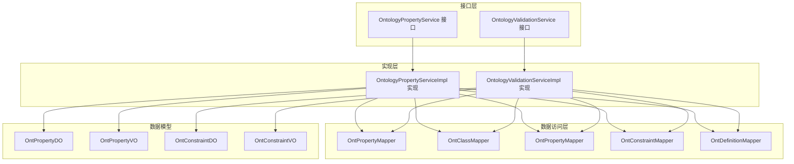
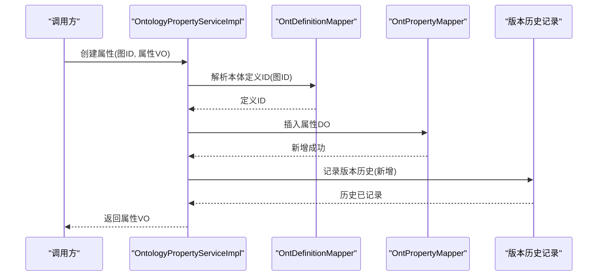
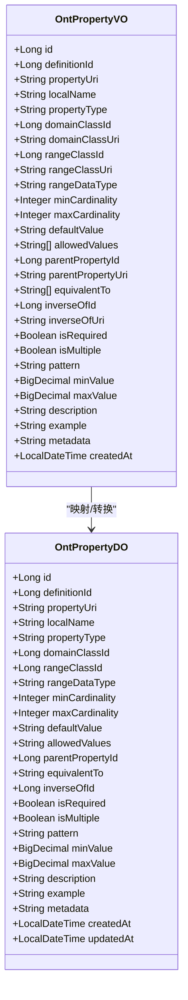
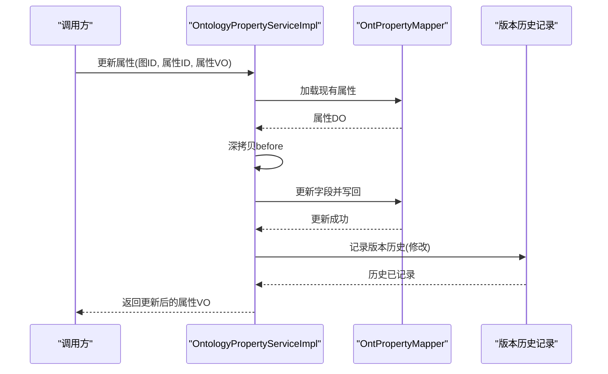
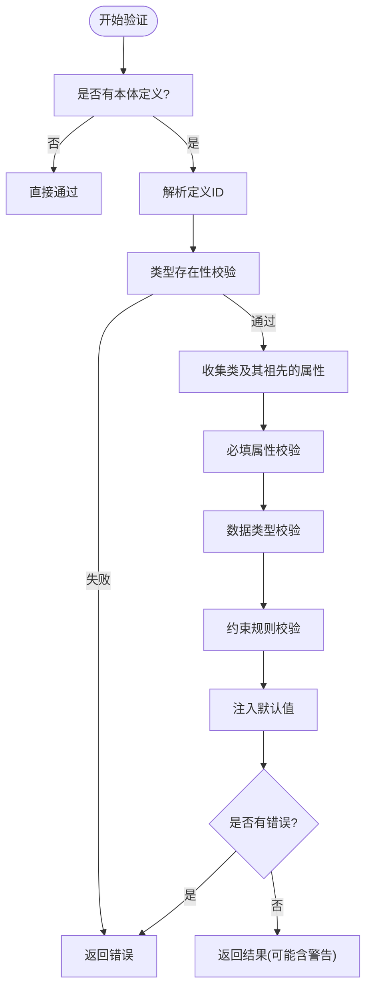
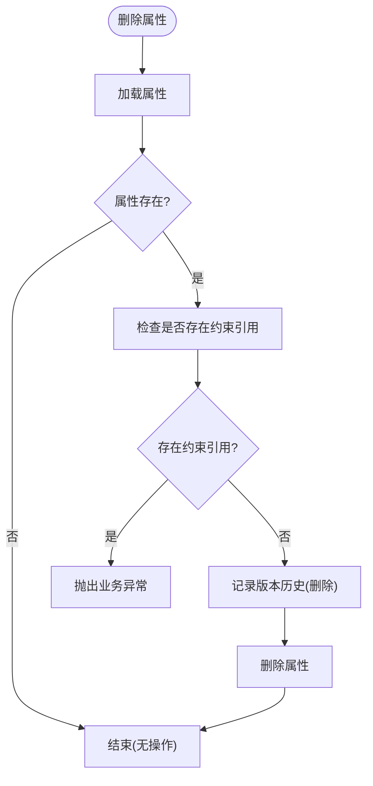
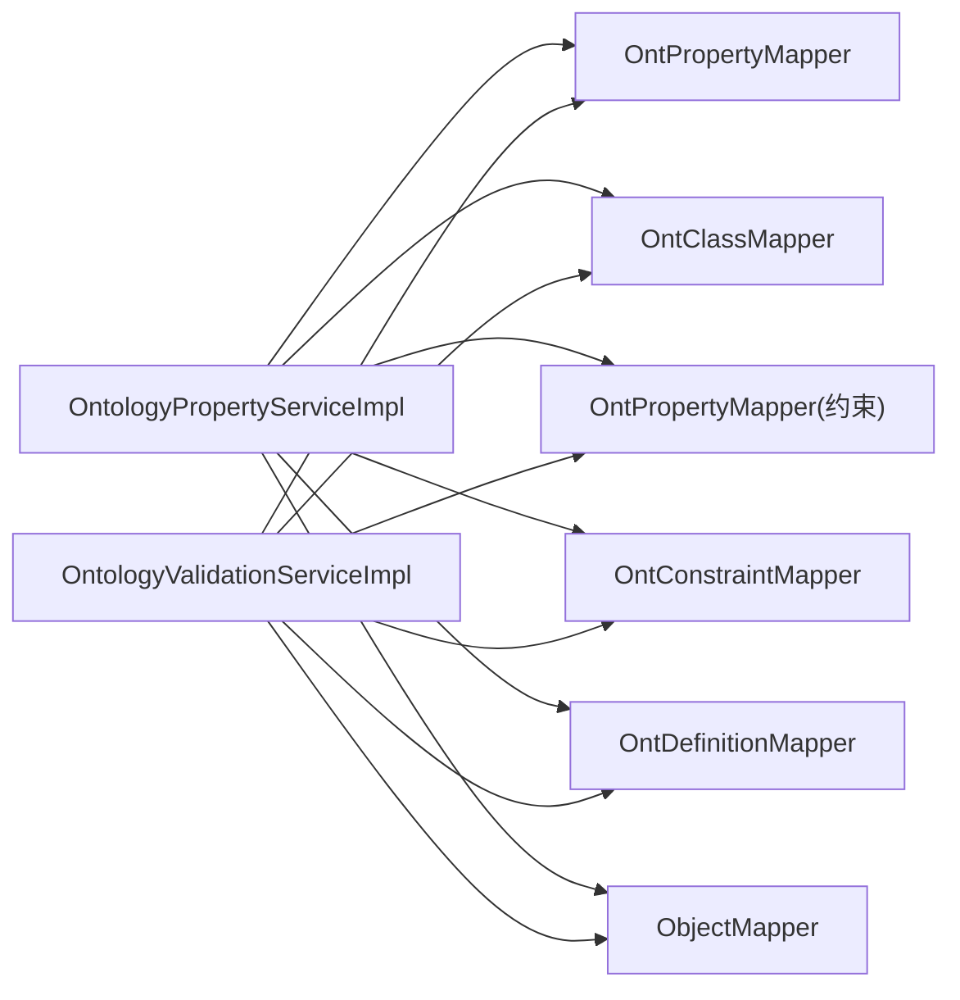

# 本体属性管理

<!--<cite>
**本文档引用的文件**
- [OntologyPropertyServiceImpl.java](file://ontograph-module-core/src/main/java/com/graphiti/module/graphiti/service/impl/OntologyPropertyServiceImpl.java)
- [OntologyPropertyService.java](file://ontograph-module-core/src/main/java/com/graphiti/module/graphiti/service/OntologyPropertyService.java)
- [OntPropertyDO.java](file://ontograph-module-core/src/main/java/com/graphiti/module/graphiti/dal/dataobject/ont/OntPropertyDO.java)
- [OntPropertyMapper.java](file://ontograph-module-core/src/main/java/com/graphiti/module/graphiti/dal/mysql/ont/OntPropertyMapper.java)
- [OntPropertyVO.java](file://ontograph-module-core/src/main/java/com/graphiti/module/graphiti/vo/ontology/OntPropertyVO.java)
- [OntologyValidationServiceImpl.java](file://ontograph-module-core/src/main/java/com/graphiti/module/graphiti/service/impl/OntologyValidationServiceImpl.java)
- [OntologyValidationService.java](file://ontograph-module-core/src/main/java/com/graphiti/module/graphiti/service/OntologyValidationService.java)
- [OntologyValidationException.java](file://ontograph-module-core/src/main/java/com/graphiti/module/graphiti/exception/OntologyValidationException.java)
- [OntConstraintDO.java](file://ontograph-module-core/src/main/java/com/graphiti/module/graphiti/dal/dataobject/ont/OntConstraintDO.java)
- [OntConstraintVO.java](file://ontograph-module-core/src/main/java/com/graphiti/module/graphiti/vo/ontology/OntConstraintVO.java)
- [ValidationResultVO.java](file://ontograph-module-core/src/main/java/com/graphiti/module/graphiti/vo/ontology/ValidationResultVO.java)
- [OntologyPropertyServiceImplTest.java](file://ontograph-module-core/src/test/java/com/graphiti/module/graphiti/service/OntologyPropertyServiceImplTest.java)
</cite>-->

## 目录
1. [引言](#引言)
2. [项目结构](#项目结构)
3. [核心组件](#核心组件)
4. [架构总览](#架构总览)
5. [详细组件分析](#详细组件分析)
6. [依赖关系分析](#依赖关系分析)
7. [性能考虑](#性能考虑)
8. [故障排除指南](#故障排除指南)
9. [结论](#结论)

## 引言
本文件聚焦于“本体属性管理”能力的技术文档，围绕属性定义、约束与验证机制展开，重点覆盖以下方面：
- 属性定义的数据结构与视图对象：OntPropertyDO 与 OntPropertyVO 的字段语义、取值范围与映射关系
- 属性约束规则的实现：域约束、范围约束、功能约束、对称性约束等
- 属性生命周期管理：创建、更新、删除、查询与祖先属性收集
- 级联删除与引用清理策略：基于外键约束与业务前置检查
- 属性验证、冲突检测与一致性维护：分层验证与默认值注入
- 与验证服务的协作：节点/边的本体一致性校验流程

## 项目结构
本体属性管理功能位于 ontograph-module-core 模块中，采用“接口 + 实现 + DO/VO + Mapper”的分层设计：
- 接口层：对外暴露属性管理与约束管理能力
- 实现层：集中处理业务逻辑、事务控制、历史记录与数据转换
- 数据访问层：MyBatis Mapper 提供基础 CRUD 与按定义/类过滤查询
- 视图对象层：VO 负责对外传输与展示，DO 负责持久化存储
- 验证服务：独立的验证引擎负责运行时校验与错误聚合

图表来源
- [OntologyPropertyService.java:1-38](file://ontograph-module-core/src/main/java/com/graphiti/module/graphiti/service/OntologyPropertyService.java#L1-L38)
- [OntologyPropertyServiceImpl.java:1-374](file://ontograph-module-core/src/main/java/com/graphiti/module/graphiti/service/impl/OntologyPropertyServiceImpl.java#L1-L374)
- [OntPropertyMapper.java:1-23](file://ontograph-module-core/src/main/java/com/graphiti/module/graphiti/dal/mysql/ont/OntPropertyMapper.java#L1-L23)
- [OntPropertyDO.java:1-78](file://ontograph-module-core/src/main/java/com/graphiti/module/graphiti/dal/dataobject/ont/OntPropertyDO.java#L1-L78)
- [OntPropertyVO.java:1-44](file://ontograph-module-core/src/main/java/com/graphiti/module/graphiti/vo/ontology/OntPropertyVO.java#L1-L44)
- [OntologyValidationService.java:1-40](file://ontograph-module-core/src/main/java/com/graphiti/module/graphiti/service/OntologyValidationService.java#L1-L40)
- [OntologyValidationServiceImpl.java:1-345](file://ontograph-module-core/src/main/java/com/graphiti/module/graphiti/service/impl/OntologyValidationServiceImpl.java#L1-L345)
- [OntConstraintDO.java:1-43](file://ontograph-module-core/src/main/java/com/graphiti/module/graphiti/dal/dataobject/ont/OntConstraintDO.java#L1-L43)
- [OntConstraintVO.java:1-51](file://ontograph-module-core/src/main/java/com/graphiti/module/graphiti/vo/ontology/OntConstraintVO.java#L1-L51)

章节来源
- [OntologyPropertyService.java:1-38](file://ontograph-module-core/src/main/java/com/graphiti/module/graphiti/service/OntologyPropertyService.java#L1-L38)
- [OntologyPropertyServiceImpl.java:1-374](file://ontograph-module-core/src/main/java/com/graphiti/module/graphiti/service/impl/OntologyPropertyServiceImpl.java#L1-L374)
- [OntPropertyMapper.java:1-23](file://ontograph-module-core/src/main/java/com/graphiti/module/graphiti/dal/mysql/ont/OntPropertyMapper.java#L1-L23)

## 核心组件
- 属性管理服务接口与实现：提供属性的增删改查、按类筛选、祖先链收集与版本历史记录
- 数据对象与视图对象：OntPropertyDO 用于持久化，OntPropertyVO 用于对外传输与展示
- 约束数据模型：OntConstraintDO/VO 描述属性约束类型、取值与错误信息
- 验证服务：分层校验节点/边属性，支持批量验证与默认值注入

章节来源
- [OntologyPropertyService.java:1-38](file://ontograph-module-core/src/main/java/com/graphiti/module/graphiti/service/OntologyPropertyService.java#L1-L38)
- [OntologyPropertyServiceImpl.java:1-374](file://ontograph-module-core/src/main/java/com/graphiti/module/graphiti/service/impl/OntologyPropertyServiceImpl.java#L1-L374)
- [OntPropertyDO.java:1-78](file://ontograph-module-core/src/main/java/com/graphiti/module/graphiti/dal/dataobject/ont/OntPropertyDO.java#L1-L78)
- [OntPropertyVO.java:1-44](file://ontograph-module-core/src/main/java/com/graphiti/module/graphiti/vo/ontology/OntPropertyVO.java#L1-L44)
- [OntConstraintDO.java:1-43](file://ontograph-module-core/src/main/java/com/graphiti/module/graphiti/dal/dataobject/ont/OntConstraintDO.java#L1-L43)
- [OntConstraintVO.java:1-51](file://ontograph-module-core/src/main/java/com/graphiti/module/graphiti/vo/ontology/OntConstraintVO.java#L1-L51)
- [OntologyValidationService.java:1-40](file://ontograph-module-core/src/main/java/com/graphiti/module/graphiti/service/OntologyValidationService.java#L1-L40)
- [OntologyValidationServiceImpl.java:1-345](file://ontograph-module-core/src/main/java/com/graphiti/module/graphiti/service/impl/OntologyValidationServiceImpl.java#L1-L345)

## 架构总览
本体属性管理遵循“服务层编排 + 数据访问层查询 + 验证引擎协同”的架构模式。服务层负责：
- 解析图 ID 获取本体定义 ID
- 将 VO 映射为 DO 进行持久化
- 查询 DO 并映射为 VO 返回
- 记录版本历史
- 协同验证服务进行运行时校验

图表来源
- [OntologyPropertyServiceImpl.java:37-62](file://ontograph-module-core/src/main/java/com/graphiti/module/graphiti/service/impl/OntologyPropertyServiceImpl.java#L37-L62)
- [OntPropertyMapper.java:1-23](file://ontograph-module-core/src/main/java/com/graphiti/module/graphiti/dal/mysql/ont/OntPropertyMapper.java#L1-L23)

## 详细组件分析

### 属性定义数据结构与视图对象
- OntPropertyDO 字段要点
  - 基本标识：id、definitionId、propertyUri、localName
  - 类型与范围：propertyType（如 OBJECT/DATATYPE/ANNOTATION/TRANSITIVE/SYMMETRIC/FUNCTIONAL）、domainClassId、rangeClassId、rangeDataType
  - 多重性：minCardinality、maxCardinality
  - 默认值与枚举：defaultValue、allowedValues（JSON 数组字符串）
  - 继承与对称：parentPropertyId、equivalentTo（JSON 数组字符串）、inverseOfId
  - 必填与多值：isRequired、isMultiple
  - 校验参数：pattern、minValue、maxValue
  - 元数据与时间戳：description、example、metadata、createdAt、updatedAt
- OntPropertyVO 字段要点
  - 与 DO 对应的属性映射，额外包含 domainClassUri、rangeClassUri、parentPropertyUri、inverseOfUri 等 URI 字段
  - 支持 allowedValues、equivalentTo 列表

图表来源
- [OntPropertyDO.java:1-78](file://ontograph-module-core/src/main/java/com/graphiti/module/graphiti/dal/dataobject/ont/OntPropertyDO.java#L1-L78)
- [OntPropertyVO.java:1-44](file://ontograph-module-core/src/main/java/com/graphiti/module/graphiti/vo/ontology/OntPropertyVO.java#L1-L44)

章节来源
- [OntPropertyDO.java:1-78](file://ontograph-module-core/src/main/java/com/graphiti/module/graphiti/dal/dataobject/ont/OntPropertyDO.java#L1-L78)
- [OntPropertyVO.java:1-44](file://ontograph-module-core/src/main/java/com/graphiti/module/graphiti/vo/ontology/OntPropertyVO.java#L1-L44)

### 属性管理服务实现（OntologyPropertyServiceImpl）
- 关键职责
  - 属性创建：解析图 ID → 校验类存在性 → 构造 DO → 插入 → 记录历史
  - 属性更新：加载现有 DO → 浅拷贝 before → 更新字段 → 写回 → 记录历史
  - 属性删除：前置检查是否存在约束引用 → 记录历史 → 删除
  - 属性查询：按 ID、按定义、按类过滤、祖先链收集
  - 约束管理：列出、创建、删除约束
  - 版本历史：统一记录变更前后状态
  - 数据转换：toVO/toEntity/cloneDO/recordHistory

图表来源
- [OntologyPropertyServiceImpl.java:64-86](file://ontograph-module-core/src/main/java/com/graphiti/module/graphiti/service/impl/OntologyPropertyServiceImpl.java#L64-L86)

章节来源
- [OntologyPropertyServiceImpl.java:37-126](file://ontograph-module-core/src/main/java/com/graphiti/module/graphiti/service/impl/OntologyPropertyServiceImpl.java#L37-L126)
- [OntPropertyMapper.java:1-23](file://ontograph-module-core/src/main/java/com/graphiti/module/graphiti/dal/mysql/ont/OntPropertyMapper.java#L1-L23)

### 约束规则实现
- 约束类型与值
  - 约束类型：CARDINALITY、PATTERN、RANGE、ENUM、NOT_NULL、CUSTOM_SPARQL、UNIQUE、LENGTH 等
  - 约束值：JSON 文本，如 { "min": 1, "max": 5 } 或 { "pattern": "^[A-Z].*" }
  - 错误消息与严重级别：可配置
- 验证引擎（OntologyValidationServiceImpl）
  - 分层校验：类型存在性、必填、数据类型、约束规则
  - 默认值注入：根据属性定义的 defaultValue 与 rangeDataType 进行解析与注入
  - 边类型校验：边存储在属性表中，按 URI/localName 匹配

图表来源
- [OntologyValidationServiceImpl.java:39-129](file://ontograph-module-core/src/main/java/com/graphiti/module/graphiti/service/impl/OntologyValidationServiceImpl.java#L39-L129)
- [ValidationResultVO.java:1-36](file://ontograph-module-core/src/main/java/com/graphiti/module/graphiti/vo/ontology/ValidationResultVO.java#L1-L36)

章节来源
- [OntologyValidationServiceImpl.java:256-322](file://ontograph-module-core/src/main/java/com/graphiti/module/graphiti/service/impl/OntologyValidationServiceImpl.java#L256-L322)
- [ValidationResultVO.java:1-36](file://ontograph-module-core/src/main/java/com/graphiti/module/graphiti/vo/ontology/ValidationResultVO.java#L1-L36)

### 属性删除的级联处理与引用清理
- 删除前置检查：若存在约束引用则拒绝删除，并抛出业务异常
- 删除执行：记录历史后删除属性
- 约束清理：删除属性前需先删除或解除所有对该属性的约束引用

图表来源
- [OntologyPropertyServiceImpl.java:88-103](file://ontograph-module-core/src/main/java/com/graphiti/module/graphiti/service/impl/OntologyPropertyServiceImpl.java#L88-L103)

章节来源
- [OntologyPropertyServiceImpl.java:88-103](file://ontograph-module-core/src/main/java/com/graphiti/module/graphiti/service/impl/OntologyPropertyServiceImpl.java#L88-L103)

### 属性验证、冲突检测与一致性维护
- 验证流程
  - 节点：类型存在性 → 必填属性 → 数据类型 → 约束规则 → 注入默认值
  - 边：边类型存在性（允许宽松通过并给出警告）→ 必填/类型校验
- 冲突检测
  - 通过约束类型与值进行冲突检测（如 ENUM、RANGE、PATTERN）
  - 通过 OntologyValidationException 抛出聚合错误
- 一致性维护
  - 通过版本历史记录变更，便于审计与回溯
  - 通过默认值注入提升数据一致性

章节来源
- [OntologyValidationServiceImpl.java:39-129](file://ontograph-module-core/src/main/java/com/graphiti/module/graphiti/service/impl/OntologyValidationServiceImpl.java#L39-L129)
- [OntologyValidationException.java:1-31](file://ontograph-module-core/src/main/java/com/graphiti/module/graphiti/exception/OntologyValidationException.java#L1-L31)

## 依赖关系分析
- 服务层依赖
  - OntologyPropertyServiceImpl 依赖多个 Mapper 与 ObjectMapper
  - 通过 resolveDefinitionId 统一解析本体定义 ID
- 数据访问层
  - OntPropertyMapper 提供按定义/类/URI 查询
  - 约束与类的查询由对应 Mapper 提供
- 验证服务
  - 与属性/类/约束表联合查询，构建分层校验

图表来源
- [OntologyPropertyServiceImpl.java:28-33](file://ontograph-module-core/src/main/java/com/graphiti/module/graphiti/service/impl/OntologyPropertyServiceImpl.java#L28-L33)
- [OntologyValidationServiceImpl.java:28-32](file://ontograph-module-core/src/main/java/com/graphiti/module/graphiti/service/impl/OntologyValidationServiceImpl.java#L28-L32)

章节来源
- [OntologyPropertyServiceImpl.java:28-33](file://ontograph-module-core/src/main/java/com/graphiti/module/graphiti/service/impl/OntologyPropertyServiceImpl.java#L28-L33)
- [OntologyValidationServiceImpl.java:28-32](file://ontograph-module-core/src/main/java/com/graphiti/module/graphiti/service/impl/OntologyValidationServiceImpl.java#L28-L32)

## 性能考虑
- 查询优化
  - 使用按定义 ID 的索引查询属性列表与按类过滤查询
  - 在验证阶段尽量减少重复查询，复用已加载的类与属性集合
- 序列化开销
  - allowedValues/equivalentTo 与 JSON 字符串互转，建议在 VO 层缓存解析结果
- 事务边界
  - 属性创建/更新/删除均在事务内执行，避免中间态
- 批量验证
  - 提供批量验证接口，减少往返次数

## 故障排除指南
- 常见异常与定位
  - 图谱未定义本体：创建/更新属性时解析定义失败
  - 不存在的类 ID：domain/range 类 ID 不存在
  - 属性不存在：更新/删除时目标属性不存在
  - 存在约束引用：删除属性前需清理约束
- 日志与历史
  - 服务层对 JSON 解析失败进行告警日志
  - 版本历史记录变更前后状态，便于问题追踪
- 验证异常
  - OntologyValidationException 聚合错误信息，便于前端展示

章节来源
- [OntologyPropertyServiceImpl.java:37-103](file://ontograph-module-core/src/main/java/com/graphiti/module/graphiti/service/impl/OntologyPropertyServiceImpl.java#L37-L103)
- [OntologyValidationException.java:1-31](file://ontograph-module-core/src/main/java/com/graphiti/module/graphiti/exception/OntologyValidationException.java#L1-L31)

## 结论
本体属性管理功能通过清晰的分层设计与严格的约束校验，实现了属性定义、约束与验证的全生命周期管理。服务层承担编排与一致性维护，验证层提供分层校验与默认值注入，配合版本历史记录，确保系统的可审计性与稳定性。建议在后续迭代中进一步完善 OWL 约束与推理扩展，以满足更复杂的本体建模需求。