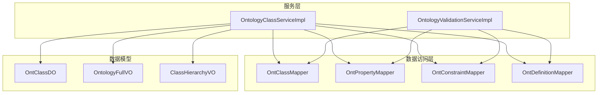
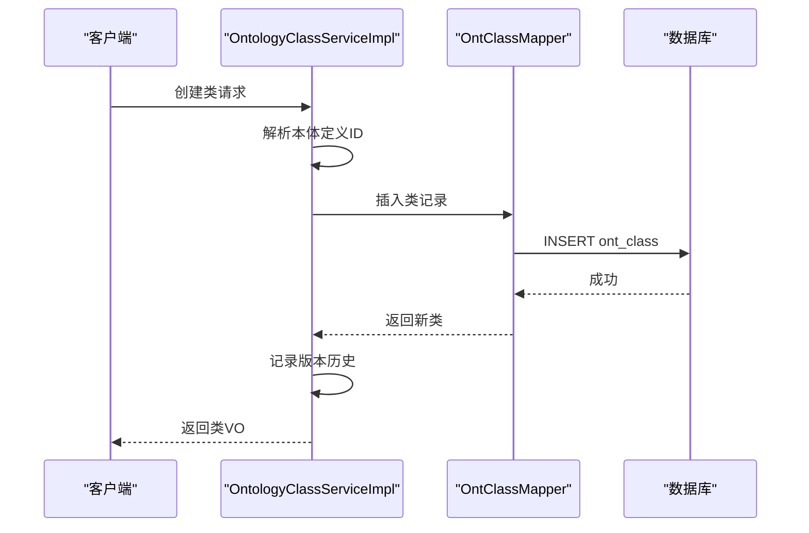
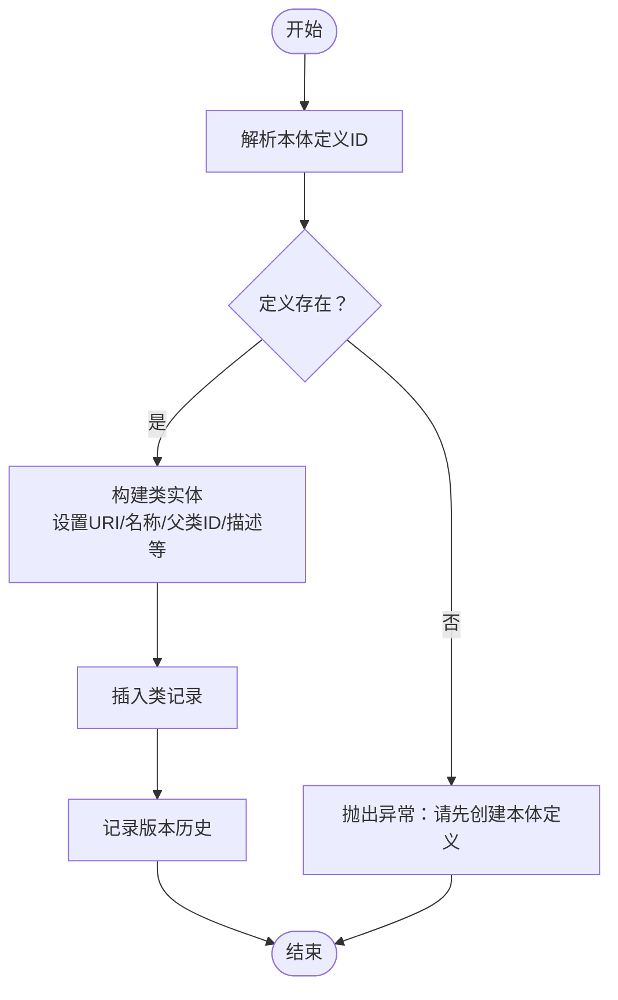
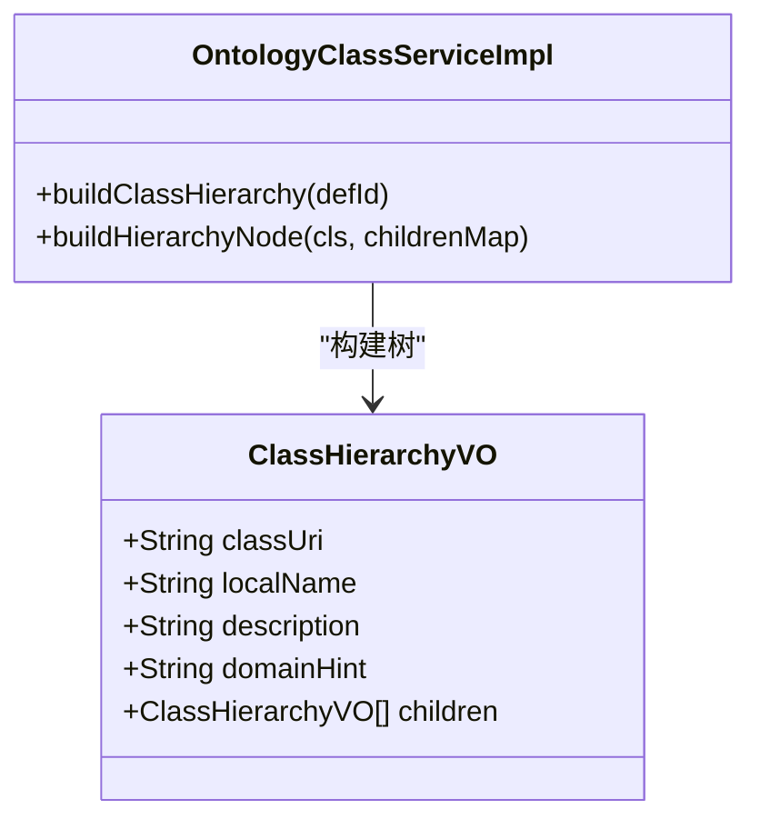
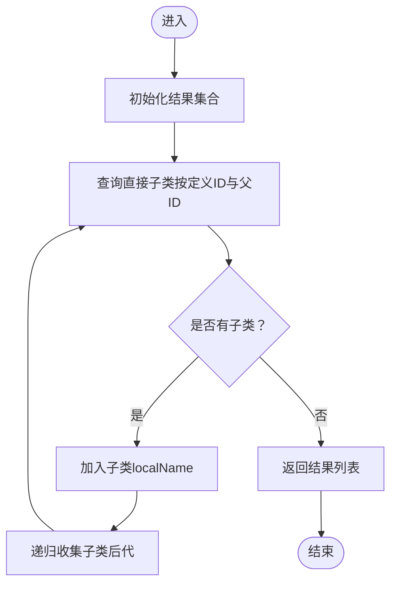
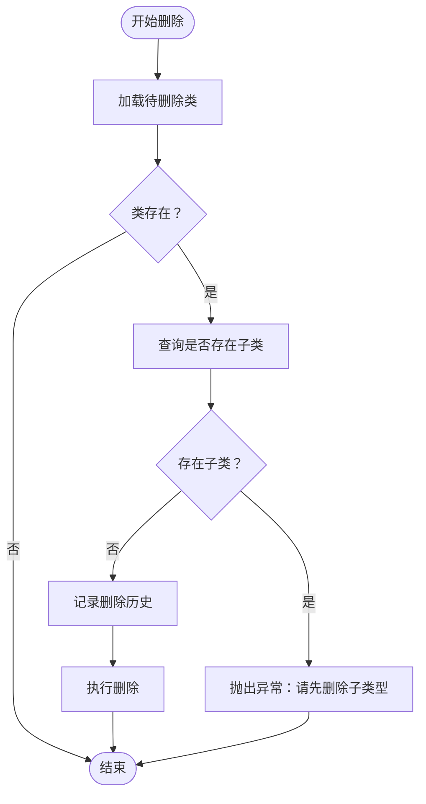
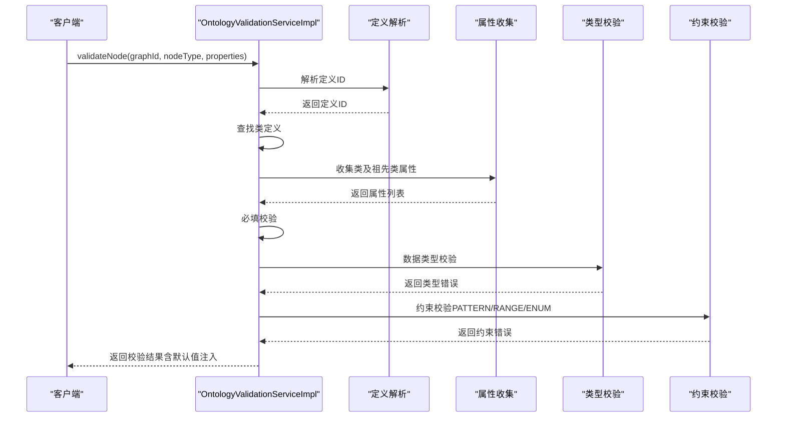
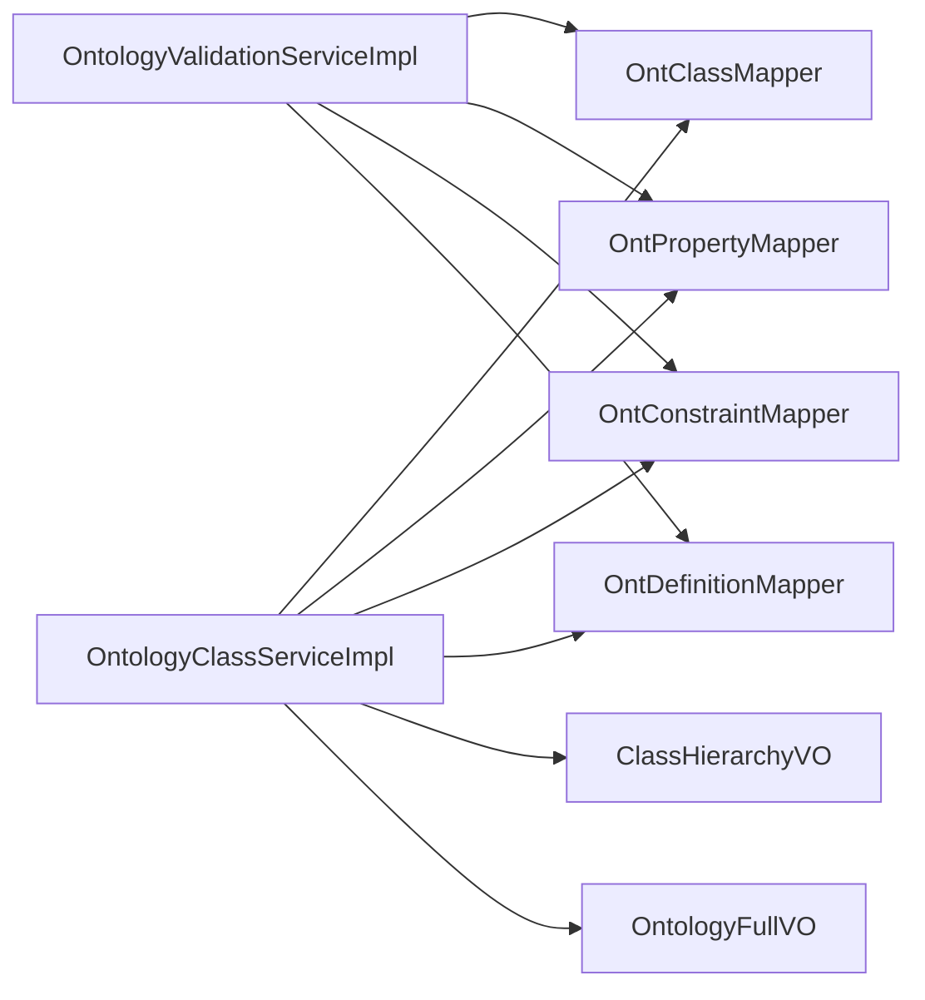

# 本体类管理

<!--<cite>
**本文档引用的文件**
- [OntologyClassServiceImpl.java](file://graphiti-module-core/src/main/java/com/graphiti/module/graphiti/service/impl/OntologyClassServiceImpl.java)
- [OntologyClassService.java](file://graphiti-module-core/src/main/java/com/graphiti/module/graphiti/service/OntologyClassService.java)
- [OntClassMapper.java](file://graphiti-module-core/src/main/java/com/graphiti/module/graphiti/dal/mysql/ont/OntClassMapper.java)
- [ClassHierarchyVO.java](file://graphiti-module-core/src/main/java/com/graphiti/module/graphiti/vo/ontology/ClassHierarchyVO.java)
- [OntClassDO.java](file://graphiti-module-core/src/main/java/com/graphiti/module/graphiti/dal/dataobject/ont/OntClassDO.java)
- [OntologyFullVO.java](file://graphiti-module-core/src/main/java/com/graphiti/module/graphiti/vo/ontology/OntologyFullVO.java)
- [OntologyValidationServiceImpl.java](file://graphiti-module-core/src/main/java/com/graphiti/module/graphiti/service/impl/OntologyValidationServiceImpl.java)
- [OntologyValidationException.java](file://graphiti-module-core/src/main/java/com/graphiti/module/graphiti/exception/OntologyValidationException.java)
- [OntologyClassServiceImplTest.java](file://graphiti-module-core/src/test/java/com/graphiti/module/graphiti/service/OntologyClassServiceImplTest.java)
</cite>-->

## 目录
1. [简介](#简介)
2. [项目结构](#项目结构)
3. [核心组件](#核心组件)
4. [架构总览](#架构总览)
5. [详细组件分析](#详细组件分析)
6. [依赖分析](#依赖分析)
7. [性能考虑](#性能考虑)
8. [故障排查指南](#故障排查指南)
9. [结论](#结论)
10. [附录](#附录)

## 简介
本文件聚焦于“本体类管理”能力的技术实现，围绕类定义的 CRUD 操作、类层次结构与继承关系处理、类层次树构建与查询、类删除的安全检查机制，以及类属性绑定、类型推断与查询优化进行系统化梳理。重点解读 OntologyClassServiceImpl 的核心实现，包括：
- 类创建时的父类解析与空值处理
- 类层次树构建算法（递归构建与扁平化输出）
- 子类存在性验证与删除安全检查
- 类属性绑定、类型推断与约束校验的协同工作流

## 项目结构
本体类管理相关代码主要位于模块 core 中的服务层与数据访问层，采用分层设计：
- 接口层：OntologyClassService 定义对外契约
- 实现层：OntologyClassServiceImpl 提供具体业务逻辑
- 数据访问层：OntClassMapper 等 MyBatis Mapper 负责数据库交互
- 视图对象层：ClassHierarchyVO、OntClassVO、OntologyFullVO 等用于服务间传输与前端展示
- 验证与异常：OntologyValidationServiceImpl 提供类型与约束校验；OntologyValidationException 封装校验异常

图表来源
- [OntologyClassServiceImpl.java:1-368](file://graphiti-module-core/src/main/java/com/graphiti/module/graphiti/service/impl/OntologyClassServiceImpl.java#L1-L368)
- [OntologyValidationServiceImpl.java:1-345](file://graphiti-module-core/src/main/java/com/graphiti/module/graphiti/service/impl/OntologyValidationServiceImpl.java#L1-L345)
- [OntClassMapper.java:1-22](file://graphiti-module-core/src/main/java/com/graphiti/module/graphiti/dal/mysql/ont/OntClassMapper.java#L1-L22)
- [ClassHierarchyVO.java:1-22](file://graphiti-module-core/src/main/java/com/graphiti/module/graphiti/vo/ontology/ClassHierarchyVO.java#L1-L22)
- [OntologyFullVO.java:1-37](file://graphiti-module-core/src/main/java/com/graphiti/module/graphiti/vo/ontology/OntologyFullVO.java#L1-L37)

章节来源
- [OntologyClassService.java:1-35](file://graphiti-module-core/src/main/java/com/graphiti/module/graphiti/service/OntologyClassService.java#L1-L35)
- [OntologyClassServiceImpl.java:1-368](file://graphiti-module-core/src/main/java/com/graphiti/module/graphiti/service/impl/OntologyClassServiceImpl.java#L1-L368)

## 核心组件
- 类管理接口：定义创建、更新、删除、查询单个类、列出类、获取类层次树、获取后代类名等能力
- 类管理实现：负责事务控制、定义解析、类创建/更新/删除、层次树构建与后代收集
- 数据访问层：基于 MyBatis 的 Mapper，提供按定义 ID 查询类、根类、父子关系查询等
- 视图对象：ClassHierarchyVO 用于层次树展示；OntClassVO 用于类详情；OntologyFullVO 聚合完整本体信息
- 验证服务：在节点/边写入前对类型存在性、必填属性、数据类型、约束进行逐层校验，并支持默认值注入

章节来源
- [OntologyClassService.java:1-35](file://graphiti-module-core/src/main/java/com/graphiti/module/graphiti/service/OntologyClassService.java#L1-L35)
- [OntologyClassServiceImpl.java:102-191](file://graphiti-module-core/src/main/java/com/graphiti/module/graphiti/service/impl/OntologyClassServiceImpl.java#L102-L191)
- [OntClassMapper.java:13-21](file://graphiti-module-core/src/main/java/com/graphiti/module/graphiti/dal/mysql/ont/OntClassMapper.java#L13-L21)
- [ClassHierarchyVO.java:14-21](file://graphiti-module-core/src/main/java/com/graphiti/module/graphiti/vo/ontology/ClassHierarchyVO.java#L14-L21)
- [OntologyFullVO.java:20-36](file://graphiti-module-core/src/main/java/com/graphiti/module/graphiti/vo/ontology/OntologyFullVO.java#L20-L36)
- [OntologyValidationServiceImpl.java:39-87](file://graphiti-module-core/src/main/java/com/graphiti/module/graphiti/service/impl/OntologyValidationServiceImpl.java#L39-L87)

## 架构总览
本体类管理遵循“接口-实现-数据访问-视图对象”的分层架构，核心流程如下：
- 类 CRUD：由 OntologyClassServiceImpl 承载，统一开启事务，调用 Mapper 完成持久化，并记录版本历史
- 层次树构建：基于类的 parent_class_id 建立 children 映射，自顶向下递归生成 ClassHierarchyVO 树
- 删除安全检查：在删除前检查是否存在子类，避免破坏继承层级
- 属性绑定与类型推断：在写入节点/边前，通过 OntologyValidationServiceImpl 对类型存在性、必填、类型匹配、约束进行校验，并可注入默认值

图表来源
- [OntologyClassServiceImpl.java:102-130](file://graphiti-module-core/src/main/java/com/graphiti/module/graphiti/service/impl/OntologyClassServiceImpl.java#L102-L130)
- [OntClassMapper.java:13-14](file://graphiti-module-core/src/main/java/com/graphiti/module/graphiti/dal/mysql/ont/OntClassMapper.java#L13-L14)

## 详细组件分析

### 类定义 CRUD 与父类解析
- 创建类
  - 自动解析 classUri：若未提供则生成默认 URI
  - 设置 definitionId、localName、parentClassId、描述、示例、领域提示、元数据等
  - 插入后记录版本历史
- 更新类
  - 支持局部字段更新（localName、classUri、description、parentClassId、domainHint）
  - 克隆更新前状态，记录变更摘要
- 删除类
  - 先检查是否存在子类，若有则抛出业务异常，阻止删除
  - 记录删除历史后执行删除

图表来源
- [OntologyClassServiceImpl.java:104-130](file://graphiti-module-core/src/main/java/com/graphiti/module/graphiti/service/impl/OntologyClassServiceImpl.java#L104-L130)

章节来源
- [OntologyClassServiceImpl.java:102-170](file://graphiti-module-core/src/main/java/com/graphiti/module/graphiti/service/impl/OntologyClassServiceImpl.java#L102-L170)

### 类层次树构建与扁平化
- 根节点选择：筛选 parent_class_id 为空的类作为根
- 子节点映射：按 parent_class_id 分组构建 childrenMap
- 递归构建：从根节点出发，递归构建 ClassHierarchyVO 树
- 扁平化输出：对外暴露的 getClassHierarchy 返回树形结构，便于前端渲染或进一步处理

图表来源
- [ClassHierarchyVO.java:14-21](file://graphiti-module-core/src/main/java/com/graphiti/module/graphiti/vo/ontology/ClassHierarchyVO.java#L14-L21)
- [OntologyClassServiceImpl.java:217-240](file://graphiti-module-core/src/main/java/com/graphiti/module/graphiti/service/impl/OntologyClassServiceImpl.java#L217-L240)

章节来源
- [OntologyClassServiceImpl.java:217-240](file://graphiti-module-core/src/main/java/com/graphiti/module/graphiti/service/impl/OntologyClassServiceImpl.java#L217-L240)
- [ClassHierarchyVO.java:14-21](file://graphiti-module-core/src/main/java/com/graphiti/module/graphiti/vo/ontology/ClassHierarchyVO.java#L14-L21)

### 后代类收集与查询
- getDescendantClasses 使用递归收集指定类的所有后代 localName，返回字符串列表
- 内部通过按 definition_id 与 parent_class_id 查询直接子类，再递归遍历

图表来源
- [OntologyClassServiceImpl.java:194-200](file://graphiti-module-core/src/main/java/com/graphiti/module/graphiti/service/impl/OntologyClassServiceImpl.java#L194-L200)
- [OntologyClassServiceImpl.java:242-251](file://graphiti-module-core/src/main/java/com/graphiti/module/graphiti/service/impl/OntologyClassServiceImpl.java#L242-L251)

章节来源
- [OntologyClassServiceImpl.java:194-200](file://graphiti-module-core/src/main/java/com/graphiti/module/graphiti/service/impl/OntologyClassServiceImpl.java#L194-L200)
- [OntologyClassServiceImpl.java:242-251](file://graphiti-module-core/src/main/java/com/graphiti/module/graphiti/service/impl/OntologyClassServiceImpl.java#L242-L251)

### 类删除的安全检查机制
- 在删除前查询是否存在以该类为父类的子类
- 若存在子类，抛出业务异常，阻止删除
- 删除成功后记录版本历史

图表来源
- [OntologyClassServiceImpl.java:153-169](file://graphiti-module-core/src/main/java/com/graphiti/module/graphiti/service/impl/OntologyClassServiceImpl.java#L153-L169)

章节来源
- [OntologyClassServiceImpl.java:153-169](file://graphiti-module-core/src/main/java/com/graphiti/module/graphiti/service/impl/OntologyClassServiceImpl.java#L153-L169)

### 类属性绑定、类型推断与查询优化
- 类型存在性校验：validateNode 首先根据 graphId 解析本体定义，查找节点类型是否在本体中定义
- 属性收集：收集目标类及其祖先类的属性定义，确保继承链上的属性均被纳入校验
- 必填属性校验：遍历属性定义，检查 properties 中对应键值是否缺失或为空
- 数据类型校验：依据属性定义中的范围数据类型进行严格校验（字符串、整数、浮点、布尔、日期、JSON 等）
- 约束校验：支持 PATTERN、RANGE、ENUM 等约束类型，结合 JSON 值进行匹配
- 默认值注入：对缺失但具备默认值的属性进行类型化注入，提升写入一致性
- 查询优化：
  - 通过按 definition_id 的条件查询减少扫描范围
  - 通过按 parent_class_id 的分组与过滤快速建立层次映射
  - 通过按 domain_class_id 的条件限制属性查询范围

图表来源
- [OntologyValidationServiceImpl.java:39-87](file://graphiti-module-core/src/main/java/com/graphiti/module/graphiti/service/impl/OntologyValidationServiceImpl.java#L39-L87)
- [OntologyValidationServiceImpl.java:184-205](file://graphiti-module-core/src/main/java/com/graphiti/module/graphiti/service/impl/OntologyValidationServiceImpl.java#L184-L205)
- [OntologyValidationServiceImpl.java:207-254](file://graphiti-module-core/src/main/java/com/graphiti/module/graphiti/service/impl/OntologyValidationServiceImpl.java#L207-L254)
- [OntologyValidationServiceImpl.java:256-322](file://graphiti-module-core/src/main/java/com/graphiti/module/graphiti/service/impl/OntologyValidationServiceImpl.java#L256-L322)
- [OntologyValidationServiceImpl.java:324-343](file://graphiti-module-core/src/main/java/com/graphiti/module/graphiti/service/impl/OntologyValidationServiceImpl.java#L324-L343)

章节来源
- [OntologyValidationServiceImpl.java:39-87](file://graphiti-module-core/src/main/java/com/graphiti/module/graphiti/service/impl/OntologyValidationServiceImpl.java#L39-L87)
- [OntologyValidationServiceImpl.java:184-205](file://graphiti-module-core/src/main/java/com/graphiti/module/graphiti/service/impl/OntologyValidationServiceImpl.java#L184-L205)
- [OntologyValidationServiceImpl.java:207-254](file://graphiti-module-core/src/main/java/com/graphiti/module/graphiti/service/impl/OntologyValidationServiceImpl.java#L207-L254)
- [OntologyValidationServiceImpl.java:256-322](file://graphiti-module-core/src/main/java/com/graphiti/module/graphiti/service/impl/OntologyValidationServiceImpl.java#L256-L322)
- [OntologyValidationServiceImpl.java:324-343](file://graphiti-module-core/src/main/java/com/graphiti/module/graphiti/service/impl/OntologyValidationServiceImpl.java#L324-L343)

### 版本历史与异常处理
- 版本历史记录：每次定义/类/属性/约束的增删改均会记录 beforeState、afterState、diffSummary 等，便于审计与回溯
- 异常封装：OntologyValidationException 将校验结果封装为业务异常，便于上层统一处理

章节来源
- [OntologyClassServiceImpl.java:349-366](file://graphiti-module-core/src/main/java/com/graphiti/module/graphiti/service/impl/OntologyClassServiceImpl.java#L349-L366)
- [OntologyValidationException.java:1-31](file://graphiti-module-core/src/main/java/com/graphiti/module/graphiti/exception/OntologyValidationException.java#L1-L31)

## 依赖分析
- 服务层依赖
  - OntologyClassServiceImpl 依赖多个 Mapper（定义、类、属性、约束、版本历史）与 ObjectMapper
  - 通过事务注解保证类 CRUD 的原子性
- 数据访问层依赖
  - OntClassMapper 提供按定义 ID、根类、父子关系的查询
  - OntPropertyMapper 与 OntConstraintMapper 提供属性与约束的查询
- 视图对象依赖
  - ClassHierarchyVO 仅包含树形结构所需字段
  - OntologyFullVO 聚合定义、类、层次树、属性、约束

图表来源
- [OntologyClassServiceImpl.java:36-41](file://graphiti-module-core/src/main/java/com/graphiti/module/graphiti/service/impl/OntologyClassServiceImpl.java#L36-L41)
- [OntologyValidationServiceImpl.java:28-32](file://graphiti-module-core/src/main/java/com/graphiti/module/graphiti/service/impl/OntologyValidationServiceImpl.java#L28-L32)
- [OntClassMapper.java:13-21](file://graphiti-module-core/src/main/java/com/graphiti/module/graphiti/dal/mysql/ont/OntClassMapper.java#L13-L21)
- [ClassHierarchyVO.java:14-21](file://graphiti-module-core/src/main/java/com/graphiti/module/graphiti/vo/ontology/ClassHierarchyVO.java#L14-L21)
- [OntologyFullVO.java:20-36](file://graphiti-module-core/src/main/java/com/graphiti/module/graphiti/vo/ontology/OntologyFullVO.java#L20-L36)

章节来源
- [OntologyClassServiceImpl.java:36-41](file://graphiti-module-core/src/main/java/com/graphiti/module/graphiti/service/impl/OntologyClassServiceImpl.java#L36-L41)
- [OntologyValidationServiceImpl.java:28-32](file://graphiti-module-core/src/main/java/com/graphiti/module/graphiti/service/impl/OntologyValidationServiceImpl.java#L28-L32)

## 性能考虑
- 层次树构建
  - 时间复杂度：O(N)，其中 N 为类总数；通过一次全量查询与一次分组完成映射
  - 空间复杂度：O(N) 用于 childrenMap 与递归栈
- 后代收集
  - 递归深度取决于继承层级；建议控制类层级深度，避免过深导致栈溢出
- 查询优化
  - 使用按 definition_id 的过滤减少扫描范围
  - 使用按 parent_class_id 的分组与过滤快速建立层次映射
  - 使用按 domain_class_id 的过滤限制属性查询范围
- 序列化与克隆
  - 历史记录与更新前状态克隆使用 ObjectMapper，注意大对象序列化开销

[本节为通用性能讨论，不直接分析具体文件]

## 故障排查指南
- 创建类失败
  - 检查 graphId 是否已激活本体定义；若未定义，需先创建本体定义
  - 检查 classUri 与 localName 是否符合预期
- 删除类失败
  - 若提示存在子类型，请先删除所有子类后再尝试删除
- 层次树显示异常
  - 检查 parent_class_id 是否正确；确认 childrenMap 构建逻辑
- 校验失败
  - 关注必填属性缺失、类型不匹配、约束违规等错误码
  - 可通过 OntologyValidationException 获取详细的错误摘要

章节来源
- [OntologyClassServiceImpl.java:104-130](file://graphiti-module-core/src/main/java/com/graphiti/module/graphiti/service/impl/OntologyClassServiceImpl.java#L104-L130)
- [OntologyClassServiceImpl.java:153-169](file://graphiti-module-core/src/main/java/com/graphiti/module/graphiti/service/impl/OntologyClassServiceImpl.java#L153-L169)
- [OntologyValidationException.java:1-31](file://graphiti-module-core/src/main/java/com/graphiti/module/graphiti/exception/OntologyValidationException.java#L1-L31)

## 结论
本体类管理通过清晰的分层设计与严格的事务控制，实现了类定义的完整生命周期管理。层次树构建算法简洁高效，删除安全检查有效防止了继承关系的破坏。配合验证服务的类型存在性、必填、类型匹配与约束校验，以及默认值注入，整体形成了从“定义—结构—约束—写入”的闭环保障体系。

[本节为总结性内容，不直接分析具体文件]

## 附录
- 测试要点
  - 验证类 VO 的 setter 与 builder 正常工作
  - 验证层次树 VO 的嵌套结构构建正确

章节来源
- [OntologyClassServiceImplTest.java:12-51](file://graphiti-module-core/src/test/java/com/graphiti/module/graphiti/service/OntologyClassServiceImplTest.java#L12-L51)