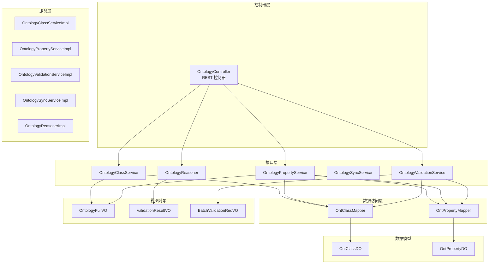
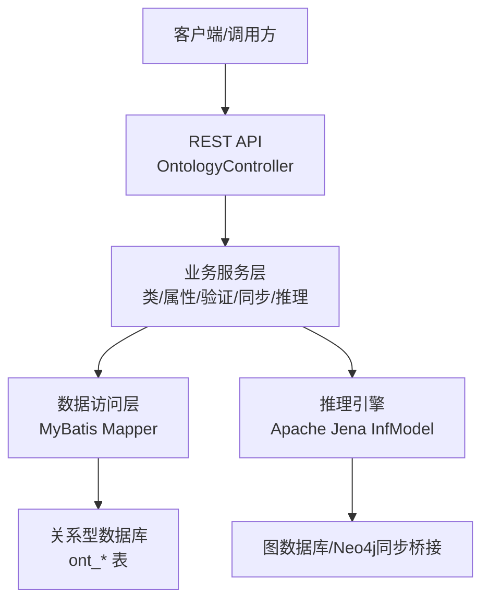
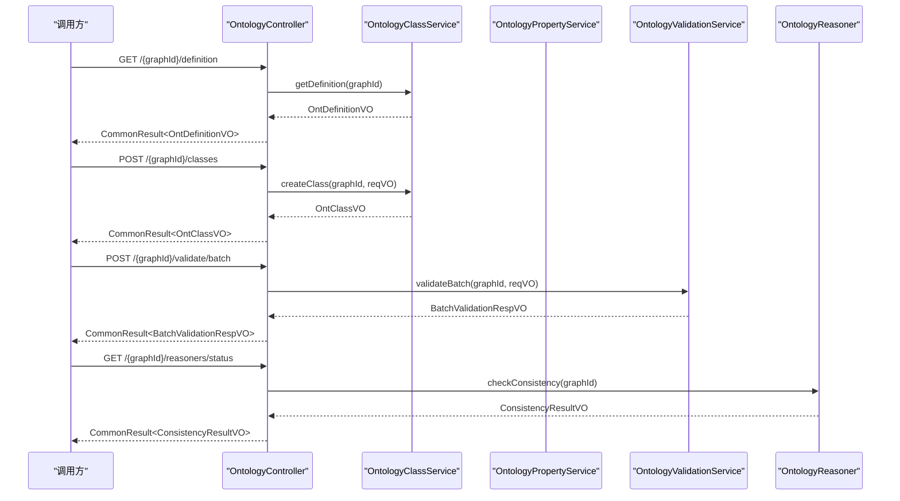
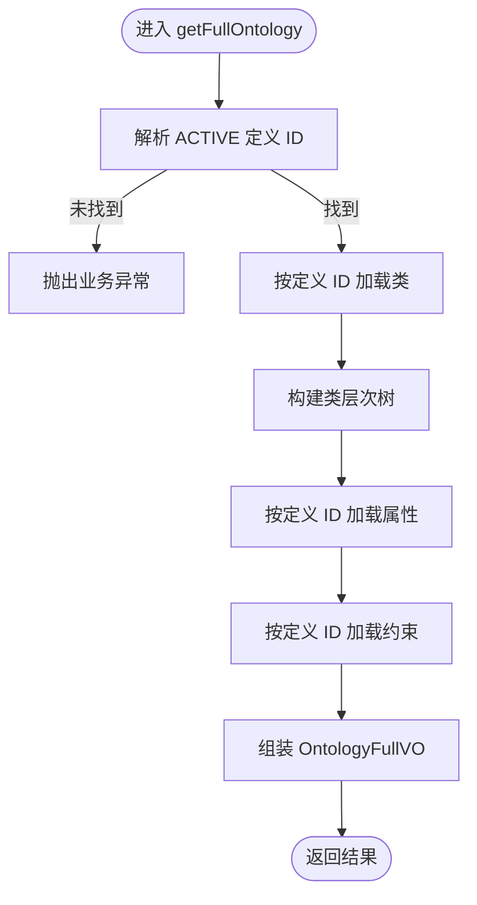
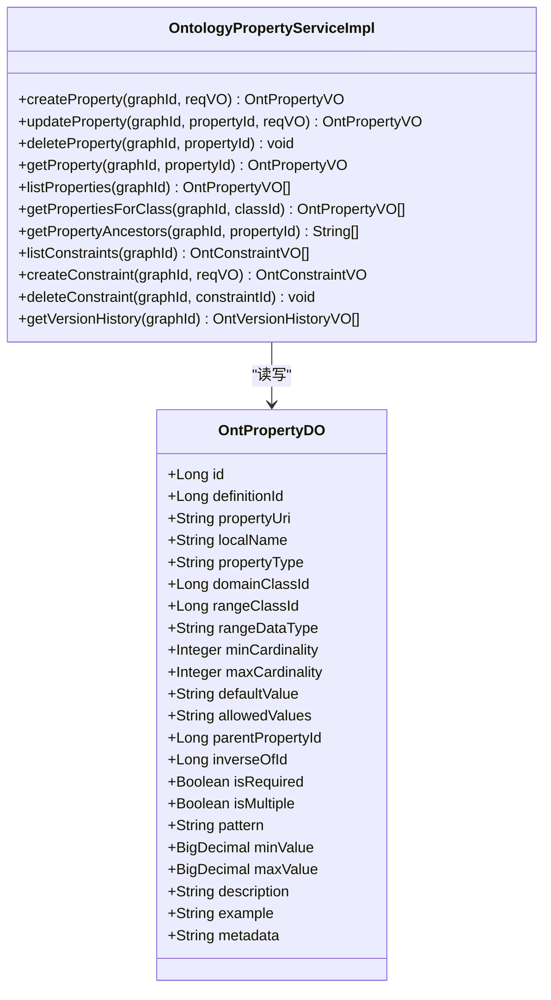
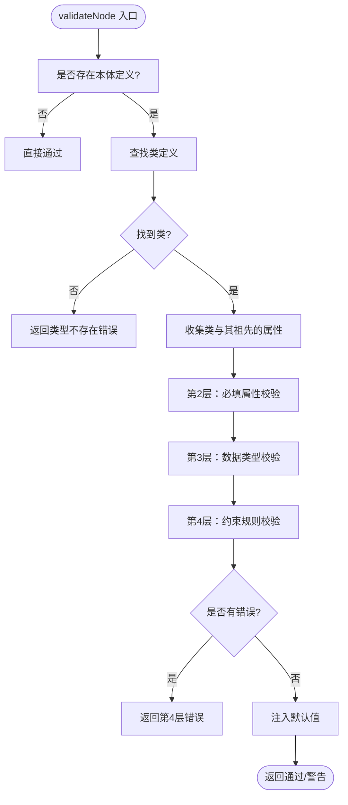
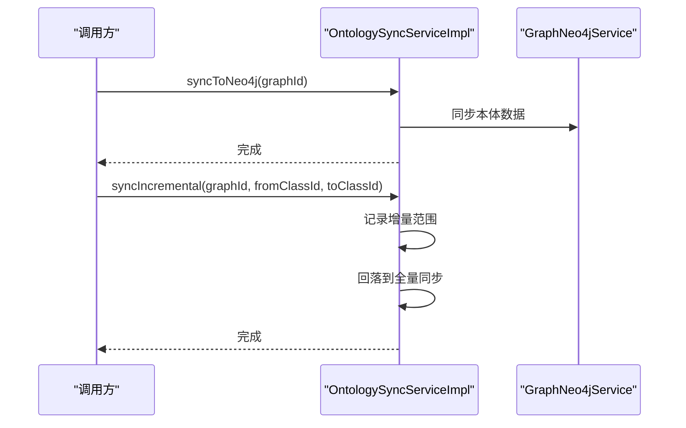
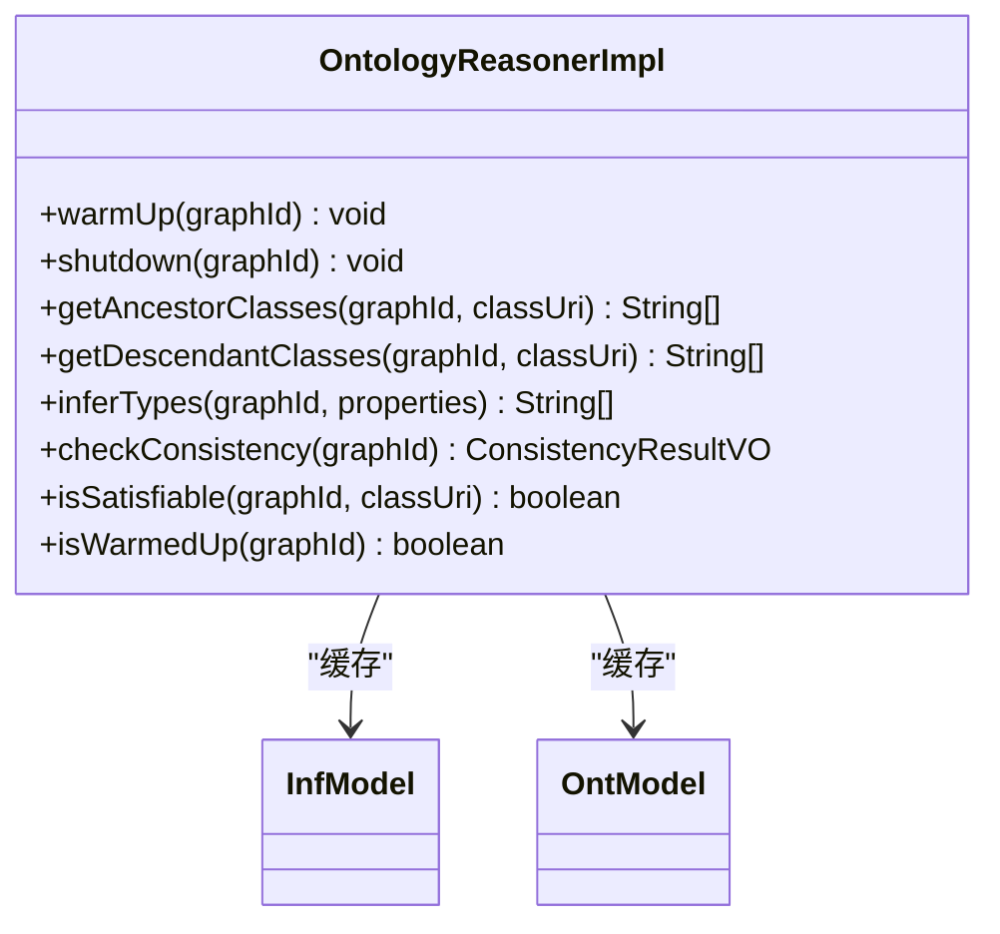
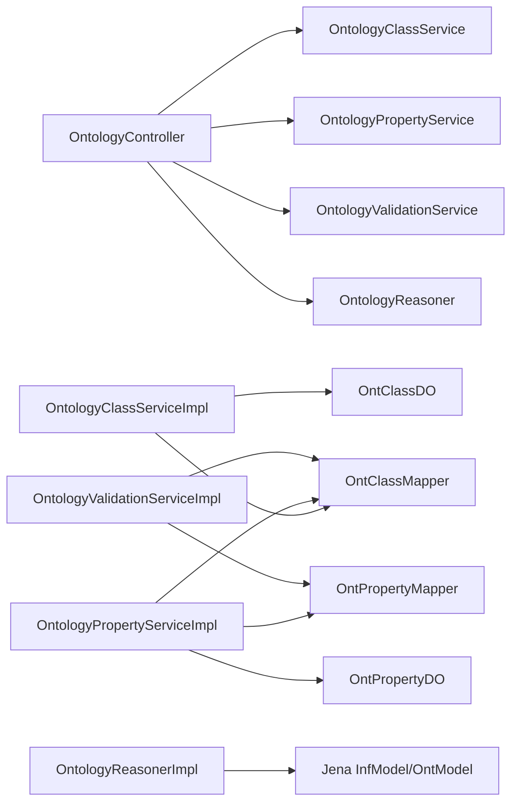
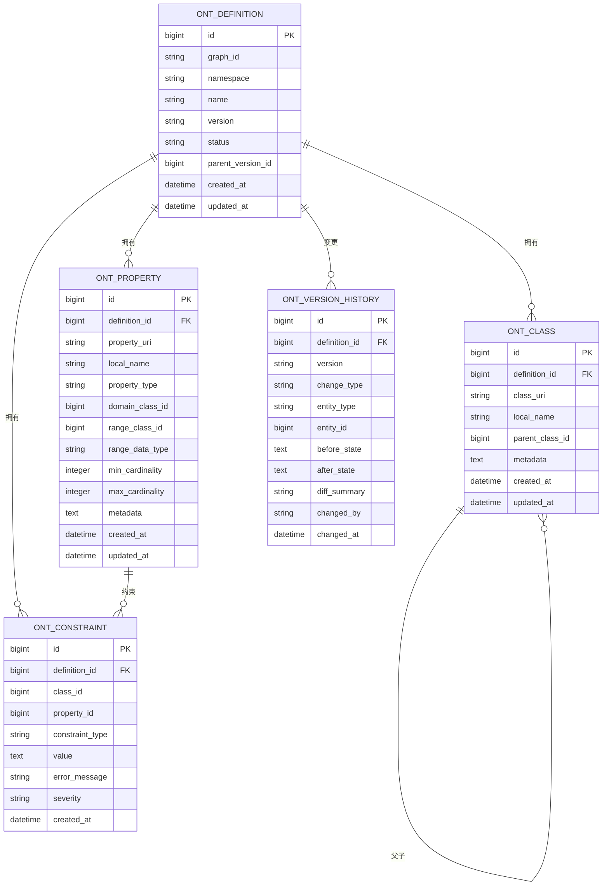

# 本体系统

<cite>
**本文引用的文件**
- [OntologyController.java](file://graphiti-module-core/src/main/java/com/graphiti/module/graphiti/controller/admin/OntologyController.java)
- [OntologyClassServiceImpl.java](file://graphiti-module-core/src/main/java/com/graphiti/module/graphiti/service/impl/OntologyClassServiceImpl.java)
- [OntologyPropertyServiceImpl.java](file://graphiti-module-core/src/main/java/com/graphiti/module/graphiti/service/impl/OntologyPropertyServiceImpl.java)
- [OntologyValidationServiceImpl.java](file://graphiti-module-core/src/main/java/com/graphiti/module/graphiti/service/impl/OntologyValidationServiceImpl.java)
- [OntologySyncServiceImpl.java](file://graphiti-module-core/src/main/java/com/graphiti/module/graphiti/service/impl/OntologySyncServiceImpl.java)
- [OntologyReasonerImpl.java](file://graphiti-module-core/src/main/java/com/graphiti/module/graphiti/service/impl/OntologyReasonerImpl.java)
- [OntologyClassService.java](file://graphiti-module-core/src/main/java/com/graphiti/module/graphiti/service/OntologyClassService.java)
- [OntologyPropertyService.java](file://graphiti-module-core/src/main/java/com/graphiti/module/graphiti/service/OntologyPropertyService.java)
- [OntologyValidationService.java](file://graphiti-module-core/src/main/java/com/graphiti/module/graphiti/service/OntologyValidationService.java)
- [OntologyReasoner.java](file://graphiti-module-core/src/main/java/com/graphiti/module/graphiti/service/OntologyReasoner.java)
- [OntologySyncService.java](file://graphiti-module-core/src/main/java/com/graphiti/module/graphiti/service/OntologySyncService.java)
- [OntologyFullVO.java](file://graphiti-module-core/src/main/java/com/graphiti/module/graphiti/vo/ontology/OntologyFullVO.java)
- [ValidationResultVO.java](file://graphiti-module-core/src/main/java/com/graphiti/module/graphiti/vo/ontology/ValidationResultVO.java)
- [BatchValidationReqVO.java](file://graphiti-module-core/src/main/java/com/graphiti/module/graphiti/vo/ontology/BatchValidationReqVO.java)
- [OntClassDO.java](file://graphiti-module-core/src/main/java/com/graphiti/module/graphiti/dal/dataobject/ont/OntClassDO.java)
- [OntPropertyDO.java](file://graphiti-module-core/src/main/java/com/graphiti/module/graphiti/dal/dataobject/ont/OntPropertyDO.java)
- [OntClassMapper.java](file://graphiti-module-core/src/main/java/com/graphiti/module/graphiti/dal/mysql/ont/OntClassMapper.java)
- [OntPropertyMapper.java](file://graphiti-module-core/src/main/java/com/graphiti/module/graphiti/dal/mysql/ont/OntPropertyMapper.java)
</cite>

## 目录
1. [简介](#简介)
2. [项目结构](#项目结构)
3. [核心组件](#核心组件)
4. [架构总览](#架构总览)
5. [详细组件分析](#详细组件分析)
6. [依赖分析](#依赖分析)
7. [性能考虑](#性能考虑)
8. [故障排查指南](#故障排查指南)
9. [结论](#结论)
10. [附录](#附录)

## 简介
本体系统围绕“知识图谱本体”进行全生命周期管理，覆盖本体定义、类与属性建模、约束规则、版本历史、验证引擎、推理与一致性检查、以及与图数据库的同步能力。本文档聚焦于以下实现要点：
- OntologyController：本体管理的完整对外接口，统一编排类、属性、约束、版本历史与推理能力。
- OntologyClassServiceImpl：类层次结构管理、继承关系处理与类型推断基础能力。
- OntologyPropertyServiceImpl：属性定义、域/范围限制、多重性与模式约束。
- OntologyValidationServiceImpl：分层验证引擎（类型存在性、必填、类型匹配、约束、OWL一致性、推理扩展）。
- OntologySyncServiceImpl：本体到图数据库的同步与增量同步策略。
- OntologyReasonerImpl：基于 Apache Jena 的 OWL 2 RL 推理机预热、一致性检查与类祖先/后代检索。

## 项目结构
本体相关代码主要位于 graphiti-module-core 模块的 controller、service、dal、vo、vo.ontology 包中；数据库表结构由 MyBatis Mapper 映射至 DO 对象。

图表来源
- [OntologyController.java:1-232](file://graphiti-module-core/src/main/java/com/graphiti/module/graphiti/controller/admin/OntologyController.java#L1-L232)
- [OntologyClassServiceImpl.java:1-368](file://graphiti-module-core/src/main/java/com/graphiti/module/graphiti/service/impl/OntologyClassServiceImpl.java#L1-L368)
- [OntologyPropertyServiceImpl.java:1-374](file://graphiti-module-core/src/main/java/com/graphiti/module/graphiti/service/impl/OntologyPropertyServiceImpl.java#L1-L374)
- [OntologyValidationServiceImpl.java:1-345](file://graphiti-module-core/src/main/java/com/graphiti/module/graphiti/service/impl/OntologyValidationServiceImpl.java#L1-L345)
- [OntologySyncServiceImpl.java:1-33](file://graphiti-module-core/src/main/java/com/graphiti/module/graphiti/service/impl/OntologySyncServiceImpl.java#L1-L33)
- [OntologyReasonerImpl.java:1-161](file://graphiti-module-core/src/main/java/com/graphiti/module/graphiti/service/impl/OntologyReasonerImpl.java#L1-L161)
- [OntClassMapper.java:1-22](file://graphiti-module-core/src/main/java/com/graphiti/module/graphiti/dal/mysql/ont/OntClassMapper.java#L1-L22)
- [OntPropertyMapper.java:1-23](file://graphiti-module-core/src/main/java/com/graphiti/module/graphiti/dal/mysql/ont/OntPropertyMapper.java#L1-L23)
- [OntClassDO.java:1-49](file://graphiti-module-core/src/main/java/com/graphiti/module/graphiti/dal/dataobject/ont/OntClassDO.java#L1-L49)
- [OntPropertyDO.java:1-78](file://graphiti-module-core/src/main/java/com/graphiti/module/graphiti/dal/dataobject/ont/OntPropertyDO.java#L1-L78)
- [OntologyFullVO.java:1-37](file://graphiti-module-core/src/main/java/com/graphiti/module/graphiti/vo/ontology/OntologyFullVO.java#L1-L37)
- [ValidationResultVO.java:1-36](file://graphiti-module-core/src/main/java/com/graphiti/module/graphiti/vo/ontology/ValidationResultVO.java#L1-L36)
- [BatchValidationReqVO.java:1-24](file://graphiti-module-core/src/main/java/com/graphiti/module/graphiti/vo/ontology/BatchValidationReqVO.java#L1-L24)

章节来源
- [OntologyController.java:1-232](file://graphiti-module-core/src/main/java/com/graphiti/module/graphiti/controller/admin/OntologyController.java#L1-L232)
- [OntologyClassServiceImpl.java:1-368](file://graphiti-module-core/src/main/java/com/graphiti/module/graphiti/service/impl/OntologyClassServiceImpl.java#L1-L368)
- [OntologyPropertyServiceImpl.java:1-374](file://graphiti-module-core/src/main/java/com/graphiti/module/graphiti/service/impl/OntologyPropertyServiceImpl.java#L1-L374)
- [OntologyValidationServiceImpl.java:1-345](file://graphiti-module-core/src/main/java/com/graphiti/module/graphiti/service/impl/OntologyValidationServiceImpl.java#L1-L345)
- [OntologySyncServiceImpl.java:1-33](file://graphiti-module-core/src/main/java/com/graphiti/module/graphiti/service/impl/OntologySyncServiceImpl.java#L1-L33)
- [OntologyReasonerImpl.java:1-161](file://graphiti-module-core/src/main/java/com/graphiti/module/graphiti/service/impl/OntologyReasonerImpl.java#L1-L161)

## 核心组件
- 控制器编排：OntologyController 将本体定义、类、属性、约束、版本历史、Schema.org 导入、推理状态与一致性检查统一暴露为 REST 接口。
- 类服务：负责本体定义创建与查询、完整本体组装、类增删改查、类层次构建与后代收集。
- 属性服务：负责属性增删改查、属性与类的域/范围关联、属性继承链回溯、约束管理与版本历史记录。
- 验证服务：实现 6 层验证（类型存在性、必填、类型匹配、约束、OWL 一致性预留、推理扩展预留），支持节点/边与批量验证。
- 同步服务：桥接本体与图数据库，提供全量同步、增量同步与清理能力。
- 推理服务：基于 Jena 的 OWL 2 RL 推理机，提供预热、一致性检查、类祖先/后代检索。

章节来源
- [OntologyController.java:32-231](file://graphiti-module-core/src/main/java/com/graphiti/module/graphiti/controller/admin/OntologyController.java#L32-L231)
- [OntologyClassServiceImpl.java:45-98](file://graphiti-module-core/src/main/java/com/graphiti/module/graphiti/service/impl/OntologyClassServiceImpl.java#L45-L98)
- [OntologyPropertyServiceImpl.java:37-126](file://graphiti-module-core/src/main/java/com/graphiti/module/graphiti/service/impl/OntologyPropertyServiceImpl.java#L37-L126)
- [OntologyValidationServiceImpl.java:39-158](file://graphiti-module-core/src/main/java/com/graphiti/module/graphiti/service/impl/OntologyValidationServiceImpl.java#L39-L158)
- [OntologySyncServiceImpl.java:16-31](file://graphiti-module-core/src/main/java/com/graphiti/module/graphiti/service/impl/OntologySyncServiceImpl.java#L16-L31)
- [OntologyReasonerImpl.java:26-133](file://graphiti-module-core/src/main/java/com/graphiti/module/graphiti/service/impl/OntologyReasonerImpl.java#L26-L133)

## 架构总览
本体系统采用分层架构：控制器层负责对外暴露 API；服务层封装业务逻辑；DAO 层通过 MyBatis 访问关系型数据库；VO 用于传输层数据结构；推理层使用 Jena 进行本体推理与一致性检查。

图表来源
- [OntologyController.java:20-231](file://graphiti-module-core/src/main/java/com/graphiti/module/graphiti/controller/admin/OntologyController.java#L20-L231)
- [OntologyClassServiceImpl.java:34-41](file://graphiti-module-core/src/main/java/com/graphiti/module/graphiti/service/impl/OntologyClassServiceImpl.java#L34-L41)
- [OntologyPropertyServiceImpl.java:26-33](file://graphiti-module-core/src/main/java/com/graphiti/module/graphiti/service/impl/OntologyPropertyServiceImpl.java#L26-L33)
- [OntologyValidationServiceImpl.java:26-32](file://graphiti-module-core/src/main/java/com/graphiti/module/graphiti/service/impl/OntologyValidationServiceImpl.java#L26-L32)
- [OntologySyncServiceImpl.java:12-14](file://graphiti-module-core/src/main/java/com/graphiti/module/graphiti/service/impl/OntologySyncServiceImpl.java#L12-L14)
- [OntologyReasonerImpl.java:21-24](file://graphiti-module-core/src/main/java/com/graphiti/module/graphiti/service/impl/OntologyReasonerImpl.java#L21-L24)

## 详细组件分析

### OntologyController：本体管理的完整实现
- 本体定义管理：获取/创建本体定义，支持命名空间、版本、描述与创建人信息。
- 完整本体获取：一次性返回定义、类、类层次树、属性与约束。
- 类管理：列出、层级树、创建、更新、删除（拒绝存在子类时删除）。
- 属性管理：列出、创建、更新、删除（拒绝存在约束引用时删除）。
- 约束管理：列出、创建、删除。
- 版本历史：按定义维度查询变更记录。
- Schema.org 导入：从 Schema.org 导入领域类与属性。
- 推理能力：推理机状态查询、预热、一致性检查。

图表来源
- [OntologyController.java:32-231](file://graphiti-module-core/src/main/java/com/graphiti/module/graphiti/controller/admin/OntologyController.java#L32-L231)
- [OntologyClassServiceImpl.java:45-130](file://graphiti-module-core/src/main/java/com/graphiti/module/graphiti/service/impl/OntologyClassServiceImpl.java#L45-L130)
- [OntologyPropertyServiceImpl.java:37-126](file://graphiti-module-core/src/main/java/com/graphiti/module/graphiti/service/impl/OntologyPropertyServiceImpl.java#L37-L126)
- [OntologyValidationServiceImpl.java:132-158](file://graphiti-module-core/src/main/java/com/graphiti/module/graphiti/service/impl/OntologyValidationServiceImpl.java#L132-L158)
- [OntologyReasonerImpl.java:89-118](file://graphiti-module-core/src/main/java/com/graphiti/module/graphiti/service/impl/OntologyReasonerImpl.java#L89-L118)

章节来源
- [OntologyController.java:32-231](file://graphiti-module-core/src/main/java/com/graphiti/module/graphiti/controller/admin/OntologyController.java#L32-L231)

### OntologyClassServiceImpl：类层次结构管理与继承关系
- 本体定义：创建时自动填充命名空间、版本、状态与创建信息，并记录版本历史。
- 完整本体组装：按定义 ID 查询类、属性、约束，构建类层次树。
- 类管理：创建/更新/删除类，删除前检查是否存在子类。
- 类层次：构建根节点集合，递归生成树形结构；支持后代类名收集。
- VO 转换：解析 JSON 字段（如 equivalentTo、disjointWith），补充父类 URI、域提示等。

图表来源
- [OntologyClassServiceImpl.java:72-98](file://graphiti-module-core/src/main/java/com/graphiti/module/graphiti/service/impl/OntologyClassServiceImpl.java#L72-L98)
- [OntologyClassServiceImpl.java:217-240](file://graphiti-module-core/src/main/java/com/graphiti/module/graphiti/service/impl/OntologyClassServiceImpl.java#L217-L240)

章节来源
- [OntologyClassServiceImpl.java:45-98](file://graphiti-module-core/src/main/java/com/graphiti/module/graphiti/service/impl/OntologyClassServiceImpl.java#L45-L98)
- [OntologyClassServiceImpl.java:102-176](file://graphiti-module-core/src/main/java/com/graphiti/module/graphiti/service/impl/OntologyClassServiceImpl.java#L102-L176)
- [OntologyClassServiceImpl.java:187-200](file://graphiti-module-core/src/main/java/com/graphiti/module/graphiti/service/impl/OntologyClassServiceImpl.java#L187-L200)
- [OntologyClassServiceImpl.java:217-251](file://graphiti-module-core/src/main/java/com/graphiti/module/graphiti/service/impl/OntologyClassServiceImpl.java#L217-L251)

### OntologyPropertyServiceImpl：属性定义、域/范围与多重性
- 属性创建：校验域/范围类 ID 存在性，构造 URI，默认类型 DATATYPE，记录历史。
- 属性更新：支持多字段增量更新，记录前后状态差异。
- 属性删除：拒绝存在约束引用的属性。
- 属性查询：按图谱定义 ID 列表、按类筛选、属性祖先链回溯。
- 约束管理：按定义维度列出、创建、删除约束。
- 版本历史：统一记录变更类型、实体类型、前后状态与摘要。

图表来源
- [OntologyPropertyServiceImpl.java:26-374](file://graphiti-module-core/src/main/java/com/graphiti/module/graphiti/service/impl/OntologyPropertyServiceImpl.java#L26-L374)
- [OntPropertyDO.java:1-78](file://graphiti-module-core/src/main/java/com/graphiti/module/graphiti/dal/dataobject/ont/OntPropertyDO.java#L1-L78)

章节来源
- [OntologyPropertyServiceImpl.java:37-126](file://graphiti-module-core/src/main/java/com/graphiti/module/graphiti/service/impl/OntologyPropertyServiceImpl.java#L37-L126)
- [OntologyPropertyServiceImpl.java:148-181](file://graphiti-module-core/src/main/java/com/graphiti/module/graphiti/service/impl/OntologyPropertyServiceImpl.java#L148-L181)
- [OntologyPropertyServiceImpl.java:185-191](file://graphiti-module-core/src/main/java/com/graphiti/module/graphiti/service/impl/OntologyPropertyServiceImpl.java#L185-L191)
- [OntPropertyDO.java:14-77](file://graphiti-module-core/src/main/java/com/graphiti/module/graphiti/dal/dataobject/ont/OntPropertyDO.java#L14-L77)

### OntologyValidationServiceImpl：6 层验证引擎与一致性检查
- 分层验证：
  - 第 1 层：类型存在性（节点类型必须在本体中定义）
  - 第 2 层：必填属性校验（isRequired）
  - 第 3 层：数据类型校验（字符串/整数/浮点/布尔/日期/JSON 等）
  - 第 4 层：约束规则校验（正则、数值范围、枚举）
  - 第 5 层：OWL 约束（预留）
  - 第 6 层：推理扩展（预留）
- 边验证：边类型存储在属性表中，支持本地名或 URI 匹配，未定义边类型允许通过并给出警告。
- 批量验证：聚合节点/边验证结果，统计有效数量。
- 默认值注入：根据属性默认值与类型进行解析注入。

图表来源
- [OntologyValidationServiceImpl.java:39-87](file://graphiti-module-core/src/main/java/com/graphiti/module/graphiti/service/impl/OntologyValidationServiceImpl.java#L39-L87)
- [OntologyValidationServiceImpl.java:207-240](file://graphiti-module-core/src/main/java/com/graphiti/module/graphiti/service/impl/OntologyValidationServiceImpl.java#L207-L240)
- [OntologyValidationServiceImpl.java:256-322](file://graphiti-module-core/src/main/java/com/graphiti/module/graphiti/service/impl/OntologyValidationServiceImpl.java#L256-L322)
- [ValidationResultVO.java:15-35](file://graphiti-module-core/src/main/java/com/graphiti/module/graphiti/vo/ontology/ValidationResultVO.java#L15-L35)
- [BatchValidationReqVO.java:8-23](file://graphiti-module-core/src/main/java/com/graphiti/module/graphiti/vo/ontology/BatchValidationReqVO.java#L8-L23)

章节来源
- [OntologyValidationServiceImpl.java:39-158](file://graphiti-module-core/src/main/java/com/graphiti/module/graphiti/service/impl/OntologyValidationServiceImpl.java#L39-L158)
- [ValidationResultVO.java:15-35](file://graphiti-module-core/src/main/java/com/graphiti/module/graphiti/vo/ontology/ValidationResultVO.java#L15-L35)
- [BatchValidationReqVO.java:8-23](file://graphiti-module-core/src/main/java/com/graphiti/module/graphiti/vo/ontology/BatchValidationReqVO.java#L8-L23)

### OntologySyncServiceImpl：跨系统同步与数据迁移策略
- 全量同步：将本体定义、类、属性、约束等同步至图数据库（当前日志占位，后续可接入 GraphNeo4jService）。
- 增量同步：按类 ID 范围进行增量同步，最终回落到全量同步以保证一致性。
- 清理策略：清除 Neo4j 中的本体相关数据，便于重置或迁移。

图表来源
- [OntologySyncServiceImpl.java:16-31](file://graphiti-module-core/src/main/java/com/graphiti/module/graphiti/service/impl/OntologySyncServiceImpl.java#L16-L31)

章节来源
- [OntologySyncServiceImpl.java:16-31](file://graphiti-module-core/src/main/java/com/graphiti/module/graphiti/service/impl/OntologySyncServiceImpl.java#L16-L31)

### OntologyReasonerImpl：逻辑推理、一致性检查与知识扩展
- 预热：为每个 graphId 创建并缓存 OWL 2 RL 推理模型（InfModel + OntModel），设置命名空间。
- 关闭：移除缓存并释放资源。
- 类祖先/后代检索：基于 RDFS.subClassOf 关系递归收集。
- 一致性检查：检查核心类（如 owl:Thing、rdfs:Resource）的可满足性，返回一致/不一致列表。
- 推理扩展：预留 inferTypes 与更高层推理能力。

图表来源
- [OntologyReasonerImpl.java:21-161](file://graphiti-module-core/src/main/java/com/graphiti/module/graphiti/service/impl/OntologyReasonerImpl.java#L21-L161)

章节来源
- [OntologyReasonerImpl.java:26-133](file://graphiti-module-core/src/main/java/com/graphiti/module/graphiti/service/impl/OntologyReasonerImpl.java#L26-L133)
- [OntologyReasonerImpl.java:89-128](file://graphiti-module-core/src/main/java/com/graphiti/module/graphiti/service/impl/OntologyReasonerImpl.java#L89-L128)

## 依赖分析
- 控制器依赖服务接口，服务实现依赖 MyBatis Mapper 与 DO 对象。
- 验证服务依赖类与属性的 DO 与 Mapper，推理服务依赖 Jena 库。
- 同步服务依赖图数据库服务接口（当前实现为日志占位）。

图表来源
- [OntologyController.java:25-29](file://graphiti-module-core/src/main/java/com/graphiti/module/graphiti/controller/admin/OntologyController.java#L25-L29)
- [OntologyClassServiceImpl.java:36-41](file://graphiti-module-core/src/main/java/com/graphiti/module/graphiti/service/impl/OntologyClassServiceImpl.java#L36-L41)
- [OntologyPropertyServiceImpl.java:28-33](file://graphiti-module-core/src/main/java/com/graphiti/module/graphiti/service/impl/OntologyPropertyServiceImpl.java#L28-L33)
- [OntologyValidationServiceImpl.java:28-32](file://graphiti-module-core/src/main/java/com/graphiti/module/graphiti/service/impl/OntologyValidationServiceImpl.java#L28-L32)
- [OntologyReasonerImpl.java:23-24](file://graphiti-module-core/src/main/java/com/graphiti/module/graphiti/service/impl/OntologyReasonerImpl.java#L23-L24)
- [OntClassMapper.java:11-21](file://graphiti-module-core/src/main/java/com/graphiti/module/graphiti/dal/mysql/ont/OntClassMapper.java#L11-L21)
- [OntPropertyMapper.java:12-22](file://graphiti-module-core/src/main/java/com/graphiti/module/graphiti/dal/mysql/ont/OntPropertyMapper.java#L12-L22)
- [OntClassDO.java:10-48](file://graphiti-module-core/src/main/java/com/graphiti/module/graphiti/dal/dataobject/ont/OntClassDO.java#L10-L48)
- [OntPropertyDO.java:11-77](file://graphiti-module-core/src/main/java/com/graphiti/module/graphiti/dal/dataobject/ont/OntPropertyDO.java#L11-L77)

章节来源
- [OntologyController.java:25-29](file://graphiti-module-core/src/main/java/com/graphiti/module/graphiti/controller/admin/OntologyController.java#L25-L29)
- [OntologyClassServiceImpl.java:36-41](file://graphiti-module-core/src/main/java/com/graphiti/module/graphiti/service/impl/OntologyClassServiceImpl.java#L36-L41)
- [OntologyPropertyServiceImpl.java:28-33](file://graphiti-module-core/src/main/java/com/graphiti/module/graphiti/service/impl/OntologyPropertyServiceImpl.java#L28-L33)
- [OntologyValidationServiceImpl.java:28-32](file://graphiti-module-core/src/main/java/com/graphiti/module/graphiti/service/impl/OntologyValidationServiceImpl.java#L28-L32)
- [OntologyReasonerImpl.java:23-24](file://graphiti-module-core/src/main/java/com/graphiti/module/graphiti/service/impl/OntologyReasonerImpl.java#L23-L24)

## 性能考虑
- 查询优化：类与属性按 definition_id 进行过滤，避免全表扫描；类层次树构建使用一次加载+内存构建。
- 缓存策略：推理机 InfModel/OntModel 以 graphId 为键缓存，避免重复初始化。
- 批量验证：节点/边分别遍历，减少单次调用开销；默认值注入仅在无值时进行类型转换。
- 数据序列化：JSON 字段采用 ObjectMapper 序列化/反序列化，异常时记录告警并继续流程。

## 故障排查指南
- 本体未定义：当图谱未创建 ACTIVE 本体定义时，相关操作会返回空或通过（向后兼容），可通过 getDefinition 或 createDefinition 解决。
- 删除受阻：
  - 类：存在子类时拒绝删除，需先删除子类。
  - 属性：存在约束引用时拒绝删除，需先删除相关约束。
- 验证失败：
  - 类型不存在：确保节点类型已在本体中定义。
  - 必填缺失：检查 isRequired 为 true 的属性是否传入。
  - 类型不匹配：确认属性的 rangeDataType 与实际值类型一致。
  - 约束违规：检查正则、数值范围、枚举等约束配置。
- 推理未初始化：推理机需要先 warmUp，否则一致性检查会返回未初始化提示。

章节来源
- [OntologyClassServiceImpl.java:153-169](file://graphiti-module-core/src/main/java/com/graphiti/module/graphiti/service/impl/OntologyClassServiceImpl.java#L153-L169)
- [OntologyPropertyServiceImpl.java:88-103](file://graphiti-module-core/src/main/java/com/graphiti/module/graphiti/service/impl/OntologyPropertyServiceImpl.java#L88-L103)
- [OntologyValidationServiceImpl.java:53-79](file://graphiti-module-core/src/main/java/com/graphiti/module/graphiti/service/impl/OntologyValidationServiceImpl.java#L53-L79)
- [OntologyReasonerImpl.java:89-96](file://graphiti-module-core/src/main/java/com/graphiti/module/graphiti/service/impl/OntologyReasonerImpl.java#L89-L96)

## 结论
本体系统提供了从定义、建模、验证、推理到同步的完整能力闭环。类与属性服务支撑了灵活的本体建模；验证引擎保障了数据质量；推理服务为一致性检查与知识扩展奠定基础；同步服务为跨系统集成提供桥梁。建议在生产环境中完善同步服务与推理扩展，并持续优化批量验证与缓存策略。

## 附录
- 数据模型概览（简化）

图表来源
- [OntClassDO.java:10-48](file://graphiti-module-core/src/main/java/com/graphiti/module/graphiti/dal/dataobject/ont/OntClassDO.java#L10-L48)
- [OntPropertyDO.java:11-77](file://graphiti-module-core/src/main/java/com/graphiti/module/graphiti/dal/dataobject/ont/OntPropertyDO.java#L11-L77)