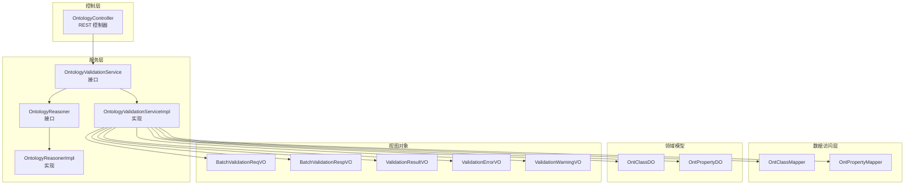
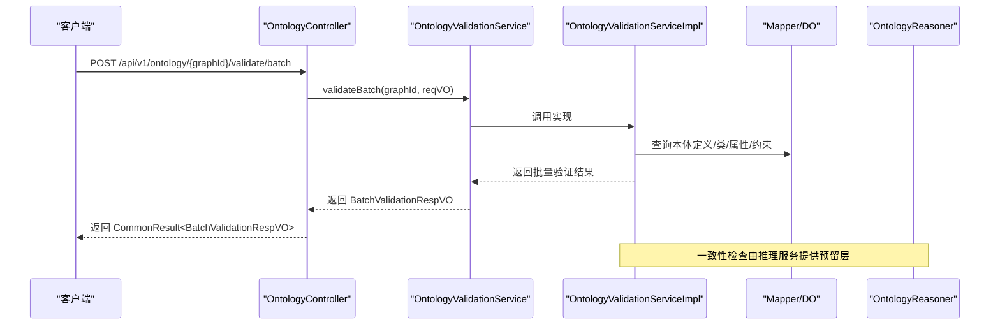
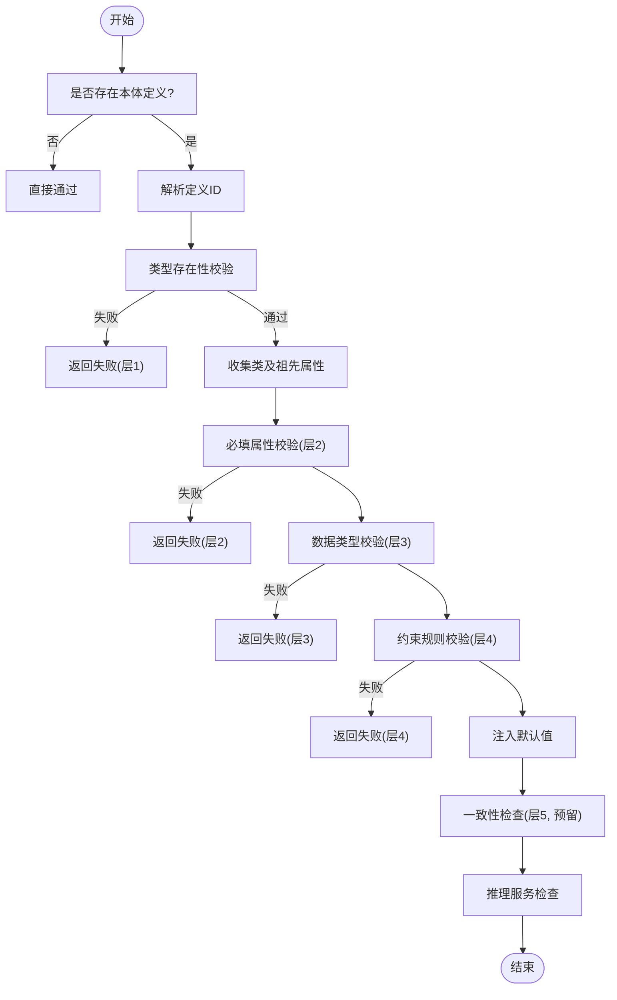
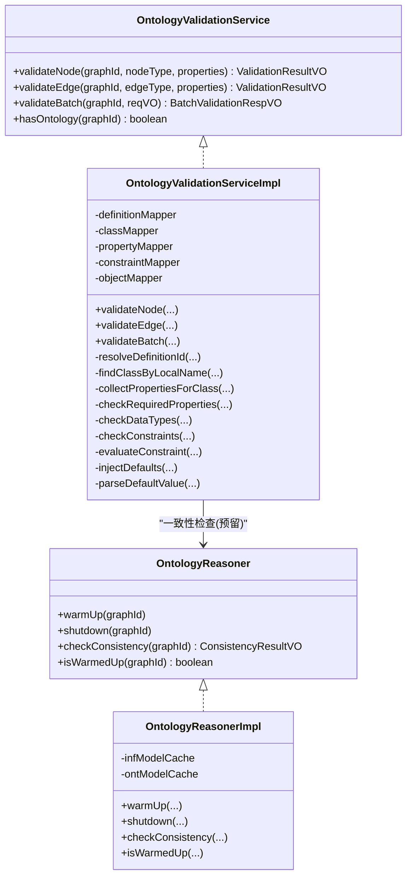
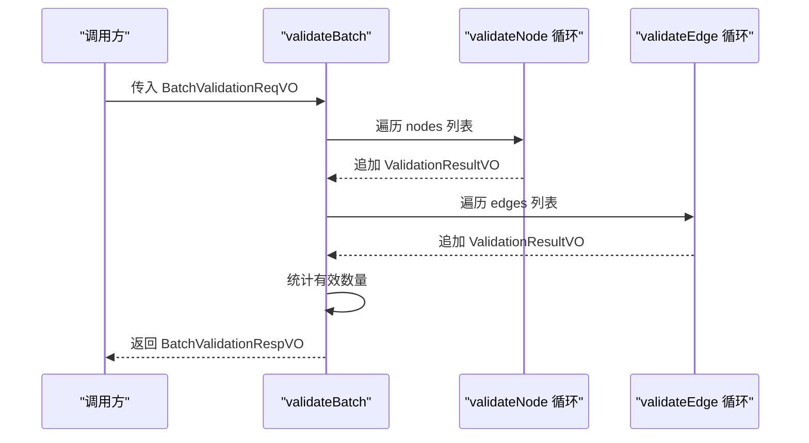
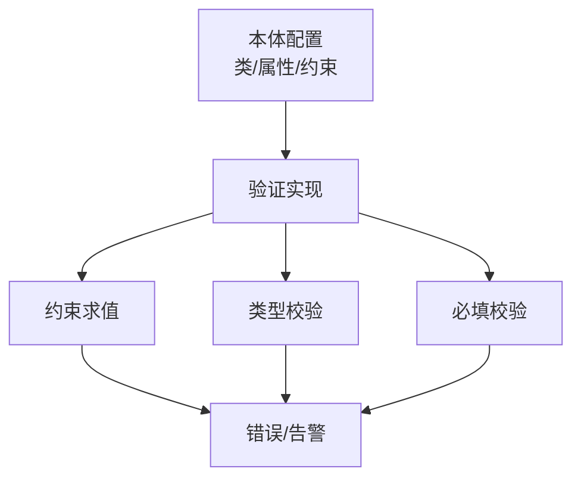
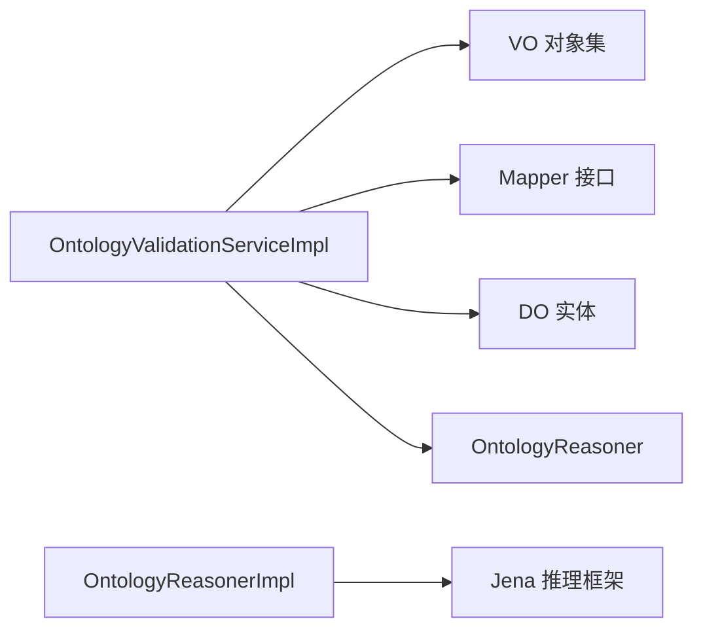

# 本体验证引擎

<!--<cite>
**本文引用的文件**
- [OntologyValidationServiceImpl.java](file://ontograph-module-core/src/main/java/com/graphiti/module/graphiti/service/impl/OntologyValidationServiceImpl.java)
- [OntologyValidationService.java](file://ontograph-module-core/src/main/java/com/graphiti/module/graphiti/service/OntologyValidationService.java)
- [OntologyValidationException.java](file://ontograph-module-core/src/main/java/com/graphiti/module/graphiti/exception/OntologyValidationException.java)
- [BatchValidationReqVO.java](file://ontograph-module-core/src/main/java/com/graphiti/module/graphiti/vo/ontology/BatchValidationReqVO.java)
- [BatchValidationRespVO.java](file://ontograph-module-core/src/main/java/com/graphiti/module/graphiti/vo/ontology/BatchValidationRespVO.java)
- [ValidationResultVO.java](file://ontograph-module-core/src/main/java/com/graphiti/module/graphiti/vo/ontology/ValidationResultVO.java)
- [ValidationErrorVO.java](file://ontograph-module-core/src/main/java/com/graphiti/module/graphiti/vo/ontology/ValidationErrorVO.java)
- [ValidationWarningVO.java](file://ontograph-module-core/src/main/java/com/graphiti/module/graphiti/vo/ontology/ValidationWarningVO.java)
- [OntologyController.java](file://ontograph-module-core/src/main/java/com/graphiti/module/graphiti/controller/admin/OntologyController.java)
- [OntologyReasoner.java](file://ontograph-module-core/src/main/java/com/graphiti/module/graphiti/service/OntologyReasoner.java)
- [OntologyReasonerImpl.java](file://ontograph-module-core/src/main/java/com/graphiti/module/graphiti/service/impl/OntologyReasonerImpl.java)
- [OntClassDO.java](file://ontograph-module-core/src/main/java/com/graphiti/module/graphiti/dal/dataobject/ont/OntClassDO.java)
- [OntPropertyDO.java](file://ontograph-module-core/src/main/java/com/graphiti/module/graphiti/dal/dataobject/ont/OntPropertyDO.java)
- [OntClassMapper.java](file://ontograph-module-core/src/main/java/com/graphiti/module/graphiti/dal/mysql/ont/OntClassMapper.java)
- [OntPropertyMapper.java](file://ontograph-module-core/src/main/java/com/graphiti/module/graphiti/dal/mysql/ont/OntPropertyMapper.java)
- [OntologyValidationServiceImplTest.java](file://ontograph-module-core/src/test/java/com/graphiti/module/graphiti/service/OntologyValidationServiceImplTest.java)
</cite>-->

## 目录
1. [引言](#引言)
2. [项目结构](#项目结构)
3. [核心组件](#核心组件)
4. [架构总览](#架构总览)
5. [详细组件分析](#详细组件分析)
6. [依赖分析](#依赖分析)
7. [性能考虑](#性能考虑)
8. [故障排查指南](#故障排查指南)
9. [结论](#结论)
10. [附录](#附录)

## 引言
本文件面向“本体验证引擎”的技术实现，围绕6层验证体系进行系统化说明，重点剖析 OntologyValidationServiceImpl 的核心算法与流程，并覆盖以下主题：
- 6层验证的分层策略与职责边界
- 语法验证、语义验证、一致性检查、完整性验证、性能验证、业务规则验证的实现要点
- 批量验证的并行策略、错误聚合与结果合并
- 规则配置化与可扩展点
- 性能优化、缓存策略与错误定位

## 项目结构
本体验证引擎位于 ontograph-module-core 模块，采用“接口 + 实现 + VO + Mapper + 控制器 + 异常 + 测试”分层组织，核心入口为 OntologyController 的 /api/v1/ontology/{graphId}/validate/batch 批量验证端点。

图表来源
- [OntologyController.java:57-64](file://ontograph-module-core/src/main/java/com/graphiti/module/graphiti/controller/admin/OntologyController.java#L57-L64)
- [OntologyValidationService.java:18-39](file://ontograph-module-core/src/main/java/com/graphiti/module/graphiti/service/OntologyValidationService.java#L18-L39)
- [OntologyValidationServiceImpl.java:26-34](file://ontograph-module-core/src/main/java/com/graphiti/module/graphiti/service/impl/OntologyValidationServiceImpl.java#L26-L34)
- [OntologyReasoner.java:7-24](file://ontograph-module-core/src/main/java/com/graphiti/module/graphiti/service/OntologyReasoner.java#L7-L24)
- [OntologyReasonerImpl.java:21-43](file://ontograph-module-core/src/main/java/com/graphiti/module/graphiti/service/impl/OntologyReasonerImpl.java#L21-L43)
- [OntClassMapper.java:11-21](file://ontograph-module-core/src/main/java/com/graphiti/module/graphiti/dal/mysql/ont/OntClassMapper.java#L11-L21)
- [OntPropertyMapper.java:11-22](file://ontograph-module-core/src/main/java/com/graphiti/module/graphiti/dal/mysql/ont/OntPropertyMapper.java#L11-L22)
- [BatchValidationReqVO.java:8-23](file://ontograph-module-core/src/main/java/com/graphiti/module/graphiti/vo/ontology/BatchValidationReqVO.java#L8-L23)
- [BatchValidationRespVO.java:9-16](file://ontograph-module-core/src/main/java/com/graphiti/module/graphiti/vo/ontology/BatchValidationRespVO.java#L9-L16)
- [ValidationResultVO.java:15-35](file://ontograph-module-core/src/main/java/com/graphiti/module/graphiti/vo/ontology/ValidationResultVO.java#L15-L35)
- [ValidationErrorVO.java:10-20](file://ontograph-module-core/src/main/java/com/graphiti/module/graphiti/vo/ontology/ValidationErrorVO.java#L10-L20)
- [ValidationWarningVO.java:9-14](file://ontograph-module-core/src/main/java/com/graphiti/module/graphiti/vo/ontology/ValidationWarningVO.java#L9-L14)

章节来源
- [OntologyController.java:1-232](file://ontograph-module-core/src/main/java/com/graphiti/module/graphiti/controller/admin/OntologyController.java#L1-L232)
- [OntologyValidationService.java:1-40](file://ontograph-module-core/src/main/java/com/graphiti/module/graphiti/service/OntologyValidationService.java#L1-L40)
- [OntologyValidationServiceImpl.java:1-345](file://ontograph-module-core/src/main/java/com/graphiti/module/graphiti/service/impl/OntologyValidationServiceImpl.java#L1-L345)

## 核心组件
- 验证服务接口与实现：定义节点/边验证、批量验证、本体存在性判断等能力，实现6层验证流水线。
- 视图对象：统一承载验证结果、错误与告警信息，支持错误码、层级、属性名与尝试值等上下文。
- 数据访问层：基于 MyBatis Mapper 查询本体定义、类、属性与约束。
- 推理服务：提供 OWL 一致性检查与类层次推断能力（预留层6的推理扩展）。
- 控制器：对外暴露批量验证 REST 接口，调用验证服务并返回标准化结果。

章节来源
- [OntologyValidationService.java:18-39](file://ontograph-module-core/src/main/java/com/graphiti/module/graphiti/service/OntologyValidationService.java#L18-L39)
- [OntologyValidationServiceImpl.java:26-345](file://ontograph-module-core/src/main/java/com/graphiti/module/graphiti/service/impl/OntologyValidationServiceImpl.java#L26-L345)
- [ValidationResultVO.java:15-35](file://ontograph-module-core/src/main/java/com/graphiti/module/graphiti/vo/ontology/ValidationResultVO.java#L15-L35)
- [ValidationErrorVO.java:10-20](file://ontograph-module-core/src/main/java/com/graphiti/module/graphiti/vo/ontology/ValidationErrorVO.java#L10-L20)
- [ValidationWarningVO.java:9-14](file://ontograph-module-core/src/main/java/com/graphiti/module/graphiti/vo/ontology/ValidationWarningVO.java#L9-L14)
- [OntologyReasoner.java:7-24](file://ontograph-module-core/src/main/java/com/graphiti/module/graphiti/service/OntologyReasoner.java#L7-L24)
- [OntologyReasonerImpl.java:21-161](file://ontograph-module-core/src/main/java/com/graphiti/module/graphiti/service/impl/OntologyReasonerImpl.java#L21-L161)
- [OntologyController.java:57-64](file://ontograph-module-core/src/main/java/com/graphiti/module/graphiti/controller/admin/OntologyController.java#L57-L64)

## 架构总览
验证引擎采用“接口隔离 + 分层解耦 + VO 中介”的架构模式，控制器负责编排，服务层负责规则与算法，DAO 层负责数据读取，推理服务提供 OWL 一致性检查能力。

图表来源
- [OntologyController.java:57-64](file://ontograph-module-core/src/main/java/com/graphiti/module/graphiti/controller/admin/OntologyController.java#L57-L64)
- [OntologyValidationService.java:18-39](file://ontograph-module-core/src/main/java/com/graphiti/module/graphiti/service/OntologyValidationService.java#L18-L39)
- [OntologyValidationServiceImpl.java:131-158](file://ontograph-module-core/src/main/java/com/graphiti/module/graphiti/service/impl/OntologyValidationServiceImpl.java#L131-L158)
- [OntologyReasoner.java:7-24](file://ontograph-module-core/src/main/java/com/graphiti/module/graphiti/service/OntologyReasoner.java#L7-L24)

## 详细组件分析

### 6层验证流水线与实现机制
- 层1：类型存在性
  - 节点：根据 graphId 解析 ACTIVE 定义，按本地名或 URI 查找类；不存在则直接失败。
  - 边：优先按 URI 匹配，其次按本地名/URI 匹配；不存在时允许通过并给出告警（向后兼容）。
- 层2：属性必填
  - 遍历类及其祖先类的属性定义，检查 required=true 的属性是否缺失。
- 层3：数据类型
  - 基于属性定义的 rangeDataType 进行严格类型校验，支持字符串、整数、浮点、布尔、日期时间、JSON 等。
- 层4：约束规则
  - 读取类级约束，支持 Pattern、Range、Enum 等类型，失败时记录错误码与上下文。
- 层5：一致性检查（预留）
  - 通过推理服务对核心类进行可满足性检查，返回一致性结果。
- 层6：推理扩展（预留）
  - 提供类层次推断与类型推理接口，便于后续扩展。

图表来源
- [OntologyValidationServiceImpl.java:39-129](file://ontograph-module-core/src/main/java/com/graphiti/module/graphiti/service/impl/OntologyValidationServiceImpl.java#L39-L129)
- [OntologyValidationServiceImpl.java:256-322](file://ontograph-module-core/src/main/java/com/graphiti/module/graphiti/service/impl/OntologyValidationServiceImpl.java#L256-L322)
- [OntologyReasonerImpl.java:88-118](file://ontograph-module-core/src/main/java/com/graphiti/module/graphiti/service/impl/OntologyReasonerImpl.java#L88-L118)

章节来源
- [OntologyValidationServiceImpl.java:39-129](file://ontograph-module-core/src/main/java/com/graphiti/module/graphiti/service/impl/OntologyValidationServiceImpl.java#L39-L129)
- [OntologyValidationServiceImpl.java:207-322](file://ontograph-module-core/src/main/java/com/graphiti/module/graphiti/service/impl/OntologyValidationServiceImpl.java#L207-L322)
- [OntologyReasonerImpl.java:88-118](file://ontograph-module-core/src/main/java/com/graphiti/module/graphiti/service/impl/OntologyReasonerImpl.java#L88-L118)

### 核心算法：OntologyValidationServiceImpl
- 输入输出
  - 节点/边验证：输入 graphId、类型名、属性映射；输出统一的 ValidationResultVO。
  - 批量验证：输入 BatchValidationReqVO，输出 BatchValidationRespVO，包含节点/边分别的统计与明细。
- 关键算法
  - 类型解析：根据 graphId 查询 ACTIVE 定义，再按本地名或 URI 查找类/属性。
  - 属性收集：递归收集类与其祖先类的属性集合，确保继承链上的属性均被校验。
  - 约束求值：解析约束 JSON 值，按类型执行正则、范围、枚举等判定。
  - 默认值注入：在属性缺失时按定义的默认值与数据类型进行安全转换。
- 错误码与上下文
  - 使用统一错误码前缀（如 ONT001/ONT002/ONT003/ONT004），并携带属性名与尝试值，便于前端展示与定位。

图表来源
- [OntologyValidationService.java:18-39](file://ontograph-module-core/src/main/java/com/graphiti/module/graphiti/service/OntologyValidationService.java#L18-L39)
- [OntologyValidationServiceImpl.java:26-345](file://ontograph-module-core/src/main/java/com/graphiti/module/graphiti/service/impl/OntologyValidationServiceImpl.java#L26-L345)
- [OntologyReasoner.java:7-24](file://ontograph-module-core/src/main/java/com/graphiti/module/graphiti/service/OntologyReasoner.java#L7-L24)
- [OntologyReasonerImpl.java:21-161](file://ontograph-module-core/src/main/java/com/graphiti/module/graphiti/service/impl/OntologyReasonerImpl.java#L21-L161)

章节来源
- [OntologyValidationServiceImpl.java:26-345](file://ontograph-module-core/src/main/java/com/graphiti/module/graphiti/service/impl/OntologyValidationServiceImpl.java#L26-L345)
- [OntologyReasonerImpl.java:21-161](file://ontograph-module-core/src/main/java/com/graphiti/module/graphiti/service/impl/OntologyReasonerImpl.java#L21-L161)

### 批量验证：并行、聚合与合并
- 并行策略
  - 当前实现为顺序遍历节点与边列表，逐项调用 validateNode/validateEdge。
  - 可扩展为并行流（如 parallelStream）或线程池批处理，以提升吞吐。
- 错误聚合
  - 每个条目独立产生 ValidationResultVO，包含 errors 与 warnings 列表。
- 结果合并
  - 统计 total/valid 数量，汇总 nodeResults 与 edgeResults，形成 BatchValidationRespVO。

图表来源
- [OntologyValidationServiceImpl.java:131-158](file://ontograph-module-core/src/main/java/com/graphiti/module/graphiti/service/impl/OntologyValidationServiceImpl.java#L131-L158)
- [BatchValidationReqVO.java:8-23](file://ontograph-module-core/src/main/java/com/graphiti/module/graphiti/vo/ontology/BatchValidationReqVO.java#L8-L23)
- [BatchValidationRespVO.java:9-16](file://ontograph-module-core/src/main/java/com/graphiti/module/graphiti/vo/ontology/BatchValidationRespVO.java#L9-L16)

章节来源
- [OntologyValidationServiceImpl.java:131-158](file://ontograph-module-core/src/main/java/com/graphiti/module/graphiti/service/impl/OntologyValidationServiceImpl.java#L131-L158)
- [BatchValidationReqVO.java:8-23](file://ontograph-module-core/src/main/java/com/graphiti/module/graphiti/vo/ontology/BatchValidationReqVO.java#L8-L23)
- [BatchValidationRespVO.java:9-16](file://ontograph-module-core/src/main/java/com/graphiti/module/graphiti/vo/ontology/BatchValidationRespVO.java#L9-L16)

### 规则配置化与扩展点
- 配置化
  - 类与属性定义：通过 OntClassDO、OntPropertyDO 的字段（如 isRequired、rangeDataType、defaultValue、pattern、min/max 等）驱动验证行为。
  - 约束定义：通过 OntConstraintDO 的 constraintType 与 value JSON 驱动 Pattern/RANGE/ENUM 等规则。
- 扩展点
  - 新增约束类型：在 evaluateConstraint 中增加分支，读取 valueMap 的新键值。
  - 新增数据类型：在 checkValueType 中扩展类型分支。
  - 新增验证层：在 validateNode/validateEdge 中插入新步骤，保持 errors 聚合与 early exit 语义。

图表来源
- [OntologyValidationServiceImpl.java:256-322](file://ontograph-module-core/src/main/java/com/graphiti/module/graphiti/service/impl/OntologyValidationServiceImpl.java#L256-L322)
- [OntologyValidationServiceImpl.java:223-240](file://ontograph-module-core/src/main/java/com/graphiti/module/graphiti/service/impl/OntologyValidationServiceImpl.java#L223-L240)
- [OntologyValidationServiceImpl.java:207-221](file://ontograph-module-core/src/main/java/com/graphiti/module/graphiti/service/impl/OntologyValidationServiceImpl.java#L207-L221)
- [OntPropertyDO.java:35-67](file://ontograph-module-core/src/main/java/com/graphiti/module/graphiti/dal/dataobject/ont/OntPropertyDO.java#L35-L67)
- [OntClassDO.java:16-41](file://ontograph-module-core/src/main/java/com/graphiti/module/graphiti/dal/dataobject/ont/OntClassDO.java#L16-L41)

章节来源
- [OntologyValidationServiceImpl.java:223-322](file://ontograph-module-core/src/main/java/com/graphiti/module/graphiti/service/impl/OntologyValidationServiceImpl.java#L223-L322)
- [OntPropertyDO.java:35-67](file://ontograph-module-core/src/main/java/com/graphiti/module/graphiti/dal/dataobject/ont/OntPropertyDO.java#L35-L67)
- [OntClassDO.java:16-41](file://ontograph-module-core/src/main/java/com/graphiti/module/graphiti/dal/dataobject/ont/OntClassDO.java#L16-L41)

### 错误定位与异常处理
- 错误定位
  - ValidationErrorVO 记录 layer、code、message、property、attemptedValue，便于前端精准提示。
  - ValidationWarningVO 记录 layer、message、suggestion，用于非阻塞性提示。
- 异常封装
  - OntologyValidationException 将 ValidationResultVO 封装为业务异常，保留错误摘要与数量统计。

章节来源
- [ValidationErrorVO.java:10-20](file://ontograph-module-core/src/main/java/com/graphiti/module/graphiti/vo/ontology/ValidationErrorVO.java#L10-L20)
- [ValidationWarningVO.java:9-14](file://ontograph-module-core/src/main/java/com/graphiti/module/graphiti/vo/ontology/ValidationWarningVO.java#L9-L14)
- [OntologyValidationException.java:8-30](file://ontograph-module-core/src/main/java/com/graphiti/module/graphiti/exception/OntologyValidationException.java#L8-L30)

## 依赖分析
- 组件内聚与耦合
  - 验证实现依赖多个 Mapper 与 DO，但通过 VO 解耦外部接口；与推理服务松耦合，仅在需要时调用。
- 外部依赖
  - Jena 推理框架用于一致性检查（预留层）。
  - MyBatis 用于本体数据持久化查询。
- 潜在循环依赖
  - 未见循环依赖迹象；各层职责清晰。

图表来源
- [OntologyValidationServiceImpl.java:26-34](file://ontograph-module-core/src/main/java/com/graphiti/module/graphiti/service/impl/OntologyValidationServiceImpl.java#L26-L34)
- [OntologyReasonerImpl.java:21-43](file://ontograph-module-core/src/main/java/com/graphiti/module/graphiti/service/impl/OntologyReasonerImpl.java#L21-L43)

章节来源
- [OntologyValidationServiceImpl.java:26-34](file://ontograph-module-core/src/main/java/com/graphiti/module/graphiti/service/impl/OntologyValidationServiceImpl.java#L26-L34)
- [OntologyReasonerImpl.java:21-43](file://ontograph-module-core/src/main/java/com/graphiti/module/graphiti/service/impl/OntologyReasonerImpl.java#L21-L43)

## 性能考虑
- 查询优化
  - 类与属性查询使用精确条件（definition_id、class_id、property_uri 等），避免全表扫描。
  - 属性收集时先收集类与祖先 ID 集合，再一次性查询，减少多次往返。
- 类型校验
  - checkValueType 使用 switch 分支匹配，避免反射与字符串解析开销。
- 约束求值
  - 约束 JSON 解析仅在需要时进行，且捕获异常避免中断整体流程。
- 批量处理
  - 当前顺序遍历，建议引入并行处理（如线程池 + CompletableFuture）以提升吞吐；注意保持错误聚合与统计准确性。
- 缓存策略
  - 推理服务已内置缓存（InfModel/OntModel），验证服务可复用该缓存以减少推理成本。
  - 可在验证服务层增加热点本体定义与属性元数据缓存，降低频繁查询开销。

章节来源
- [OntologyValidationServiceImpl.java:184-205](file://ontograph-module-core/src/main/java/com/graphiti/module/graphiti/service/impl/OntologyValidationServiceImpl.java#L184-L205)
- [OntologyValidationServiceImpl.java:242-254](file://ontograph-module-core/src/main/java/com/graphiti/module/graphiti/service/impl/OntologyValidationServiceImpl.java#L242-L254)
- [OntologyValidationServiceImpl.java:286-322](file://ontograph-module-core/src/main/java/com/graphiti/module/graphiti/service/impl/OntologyValidationServiceImpl.java#L286-L322)
- [OntologyReasonerImpl.java:23-42](file://ontograph-module-core/src/main/java/com/graphiti/module/graphiti/service/impl/OntologyReasonerImpl.java#L23-L42)

## 故障排查指南
- 常见问题
  - 类型未定义：层1失败，错误码 ONT001；检查 graphId 是否正确、本体是否 ACTIVE。
  - 缺少必填属性：层2失败，错误码 ONT002；确认属性 isRequired 与传入 properties。
  - 类型不匹配：层3失败，错误码 ONT003；核对 rangeDataType 与实际值类型。
  - 约束违规：层4失败，错误码 ONT004；检查约束类型与 value JSON。
- 排查步骤
  - 通过 BatchValidationRespVO 的统计信息快速定位失败比例。
  - 逐条检查 ValidationResultVO 的 errors/warnings，结合属性名与尝试值定位。
  - 若涉及一致性问题，调用推理服务的检查接口获取更详细的不一致信息。
- 单元测试参考
  - 验证结果构造与断言逻辑，确保新增规则不会破坏现有行为。

章节来源
- [OntologyValidationServiceImplTest.java:12-47](file://ontograph-module-core/src/test/java/com/graphiti/module/graphiti/service/OntologyValidationServiceImplTest.java#L12-L47)
- [ValidationResultVO.java:24-34](file://ontograph-module-core/src/main/java/com/graphiti/module/graphiti/vo/ontology/ValidationResultVO.java#L24-L34)
- [ValidationErrorVO.java:17-19](file://ontograph-module-core/src/main/java/com/graphiti/module/graphiti/vo/ontology/ValidationErrorVO.java#L17-L19)
- [OntologyReasonerImpl.java:88-118](file://ontograph-module-core/src/main/java/com/graphiti/module/graphiti/service/impl/OntologyReasonerImpl.java#L88-L118)

## 结论
本体验证引擎以清晰的6层流水线为核心，结合配置化的类/属性/约束定义，实现了从语法到语义再到一致性的多维验证。当前实现具备良好的扩展性与可维护性，建议在批量处理上引入并行化与缓存策略，进一步提升性能；同时完善层5/层6的推理能力，以支撑更复杂的本体检索与一致性保障。

## 附录
- 关键接口与实现一览
  - 验证服务接口与实现：[OntologyValidationService.java:18-39](file://ontograph-module-core/src/main/java/com/graphiti/module/graphiti/service/OntologyValidationService.java#L18-L39)，[OntologyValidationServiceImpl.java:26-345](file://ontograph-module-core/src/main/java/com/graphiti/module/graphiti/service/impl/OntologyValidationServiceImpl.java#L26-L345)
  - 视图对象：[ValidationResultVO.java:15-35](file://ontograph-module-core/src/main/java/com/graphiti/module/graphiti/vo/ontology/ValidationResultVO.java#L15-L35)，[ValidationErrorVO.java:10-20](file://ontograph-module-core/src/main/java/com/graphiti/module/graphiti/vo/ontology/ValidationErrorVO.java#L10-L20)，[ValidationWarningVO.java:9-14](file://ontograph-module-core/src/main/java/com/graphiti/module/graphiti/vo/ontology/ValidationWarningVO.java#L9-L14)
  - 批量验证 VO：[BatchValidationReqVO.java:8-23](file://ontograph-module-core/src/main/java/com/graphiti/module/graphiti/vo/ontology/BatchValidationReqVO.java#L8-L23)，[BatchValidationRespVO.java:9-16](file://ontograph-module-core/src/main/java/com/graphiti/module/graphiti/vo/ontology/BatchValidationRespVO.java#L9-L16)
  - 推理服务：[OntologyReasoner.java:7-24](file://ontograph-module-core/src/main/java/com/graphiti/module/graphiti/service/OntologyReasoner.java#L7-L24)，[OntologyReasonerImpl.java:21-161](file://ontograph-module-core/src/main/java/com/graphiti/module/graphiti/service/impl/OntologyReasonerImpl.java#L21-L161)
  - 控制器端点：[OntologyController.java:57-64](file://ontograph-module-core/src/main/java/com/graphiti/module/graphiti/controller/admin/OntologyController.java#L57-L64)
  - 数据模型与 Mapper：[OntClassDO.java:10-48](file://ontograph-module-core/src/main/java/com/graphiti/module/graphiti/dal/dataobject/ont/OntClassDO.java#L10-L48)，[OntPropertyDO.java:11-77](file://ontograph-module-core/src/main/java/com/graphiti/module/graphiti/dal/dataobject/ont/OntPropertyDO.java#L11-L77)，[OntClassMapper.java:11-21](file://ontograph-module-core/src/main/java/com/graphiti/module/graphiti/dal/mysql/ont/OntClassMapper.java#L11-L21)，[OntPropertyMapper.java:11-22](file://ontograph-module-core/src/main/java/com/graphiti/module/graphiti/dal/mysql/ont/OntPropertyMapper.java#L11-L22)
  - 异常封装：[OntologyValidationException.java:8-30](file://ontograph-module-core/src/main/java/com/graphiti/module/graphiti/exception/OntologyValidationException.java#L8-L30)
  - 单元测试：[OntologyValidationServiceImplTest.java:12-47](file://ontograph-module-core/src/test/java/com/graphiti/module/graphiti/service/OntologyValidationServiceImplTest.java#L12-L47)