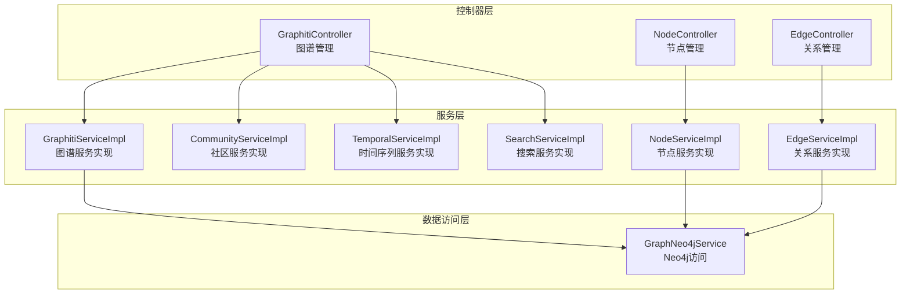
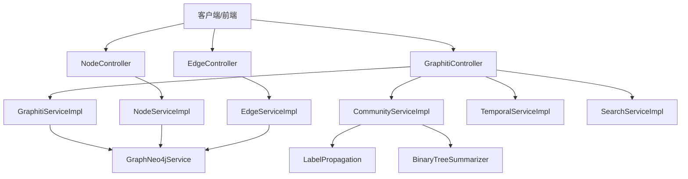
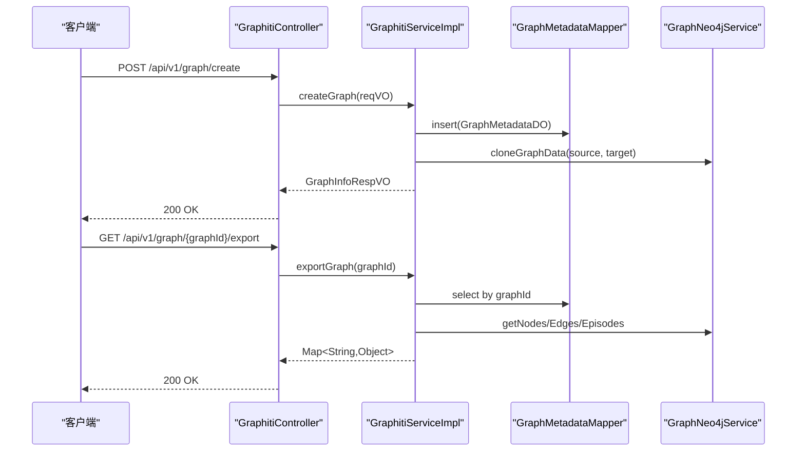
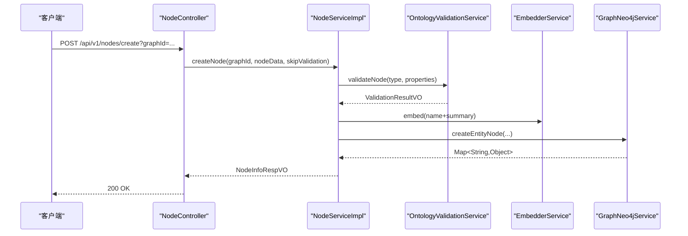
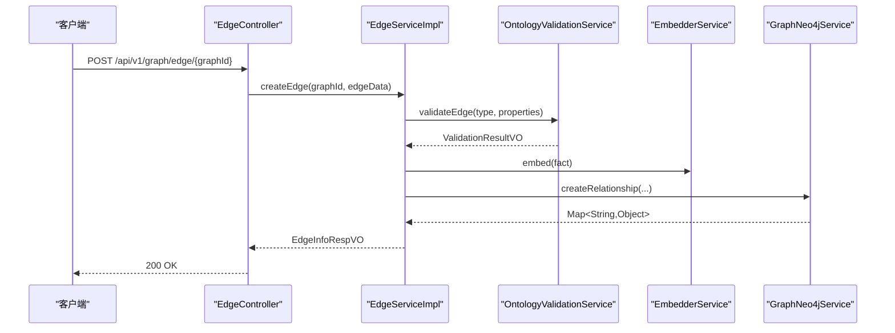
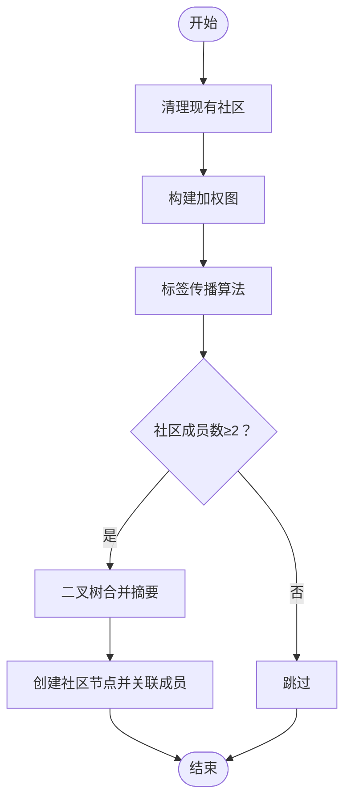
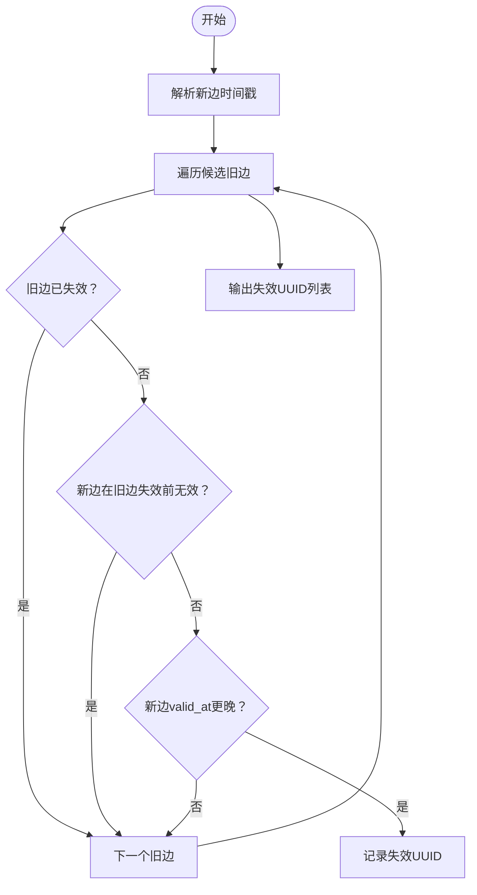
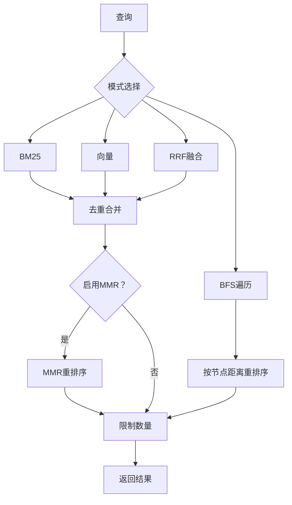
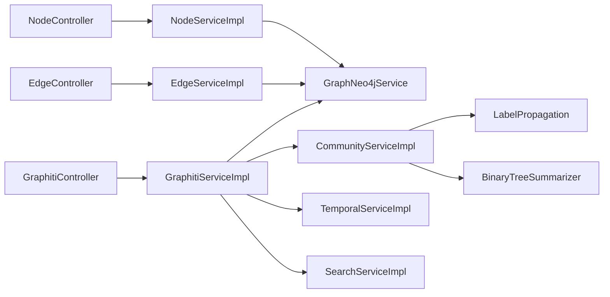

# 核心业务模块 (graphiti-module-core)

<!--<cite>
**本文档引用的文件**   
- [GraphitiController.java](file://graphiti-module-core/src/main/java/com/graphiti/module/graphiti/controller/admin/GraphitiController.java)
- [NodeController.java](file://graphiti-module-core/src/main/java/com/graphiti/module/graphiti/controller/admin/NodeController.java)
- [EdgeController.java](file://graphiti-module-core/src/main/java/com/graphiti/module/graphiti/controller/admin/EdgeController.java)
- [GraphitiServiceImpl.java](file://graphiti-module-core/src/main/java/com/graphiti/module/graphiti/service/impl/GraphitiServiceImpl.java)
- [NodeServiceImpl.java](file://graphiti-module-core/src/main/java/com/graphiti/module/graphiti/service/impl/NodeServiceImpl.java)
- [EdgeServiceImpl.java](file://graphiti-module-core/src/main/java/com/graphiti/module/graphiti/service/impl/EdgeServiceImpl.java)
- [CommunityService.java](file://graphiti-module-core/src/main/java/com/graphiti/module/graphiti/service/CommunityService.java)
- [CommunityServiceImpl.java](file://graphiti-module-core/src/main/java/com/graphiti/module/graphiti/service/impl/CommunityServiceImpl.java)
- [TemporalService.java](file://graphiti-module-core/src/main/java/com/graphiti/module/graphiti/service/TemporalService.java)
- [TemporalServiceImpl.java](file://graphiti-module-core/src/main/java/com/graphiti/module/graphiti/service/impl/TemporalServiceImpl.java)
- [SearchService.java](file://graphiti-module-core/src/main/java/com/graphiti/module/graphiti/service/SearchService.java)
- [SearchServiceImpl.java](file://graphiti-module-core/src/main/java/com/graphiti/module/graphiti/service/impl/SearchServiceImpl.java)
- [LabelPropagation.java](file://graphiti-module-core/src/main/java/com/graphiti/module/graphiti/util/LabelPropagation.java)
- [BinaryTreeSummarizer.java](file://graphiti-module-core/src/main/java/com/graphiti/module/graphiti/util/BinaryTreeSummarizer.java)
- [GraphNeo4jService.java](file://graphiti-module-core/src/main/java/com/graphiti/module/graphiti/service/GraphNeo4jService.java)
- [system_prompt.txt](file://graphiti-module-core/src/main/resources/prompts/system_prompt.txt)
</cite>-->

## 目录
1. [简介](#简介)
2. [项目结构](#项目结构)
3. [核心组件](#核心组件)
4. [架构总览](#架构总览)
5. [详细组件分析](#详细组件分析)
6. [依赖分析](#依赖分析)
7. [性能考虑](#性能考虑)
8. [故障排查指南](#故障排查指南)
9. [结论](#结论)
10. [附录](#附录)

## 简介
本文件面向Graphiti-Java核心业务模块，聚焦于知识图谱管理（GraphitiController）、实体管理（NodeController）、关系管理（EdgeController）以及对应服务实现（GraphitiServiceImpl、NodeServiceImpl、EdgeServiceImpl）。文档深入阐述图谱生命周期管理、元数据管理、图谱克隆与导出、节点CRUD与去重、实体解析与类型推断、关系抽取与验证、社区发现、时间序列管理、搜索功能与数据质量保障等高级特性，并提供业务流程图与数据流向图，帮助开发者快速理解与扩展。

## 项目结构
核心模块采用“控制器-服务-数据访问”的分层设计，控制器负责HTTP接口与参数封装，服务层编排业务流程与跨域调用，数据访问层对接Neo4j与MySQL，工具类提供算法与重排序能力。

图表来源
- [GraphitiController.java:1-235](file://graphiti-module-core/src/main/java/com/graphiti/module/graphiti/controller/admin/GraphitiController.java#L1-L235)
- [NodeController.java:1-143](file://graphiti-module-core/src/main/java/com/graphiti/module/graphiti/controller/admin/NodeController.java#L1-L143)
- [EdgeController.java:1-91](file://graphiti-module-core/src/main/java/com/graphiti/module/graphiti/controller/admin/EdgeController.java#L1-L91)
- [GraphitiServiceImpl.java:1-256](file://graphiti-module-core/src/main/java/com/graphiti/module/graphiti/service/impl/GraphitiServiceImpl.java#L1-L256)
- [NodeServiceImpl.java:1-214](file://graphiti-module-core/src/main/java/com/graphiti/module/graphiti/service/impl/NodeServiceImpl.java#L1-L214)
- [EdgeServiceImpl.java:1-172](file://graphiti-module-core/src/main/java/com/graphiti/module/graphiti/service/impl/EdgeServiceImpl.java#L1-L172)
- [CommunityServiceImpl.java:1-289](file://graphiti-module-core/src/main/java/com/graphiti/module/graphiti/service/impl/CommunityServiceImpl.java#L1-L289)
- [TemporalServiceImpl.java:1-160](file://graphiti-module-core/src/main/java/com/graphiti/module/graphiti/service/impl/TemporalServiceImpl.java#L1-L160)
- [SearchServiceImpl.java:1-520](file://graphiti-module-core/src/main/java/com/graphiti/module/graphiti/service/impl/SearchServiceImpl.java#L1-L520)
- [GraphNeo4jService.java:1-800](file://graphiti-module-core/src/main/java/com/graphiti/module/graphiti/service/GraphNeo4jService.java#L1-L800)

章节来源
- [GraphitiController.java:1-235](file://graphiti-module-core/src/main/java/com/graphiti/module/graphiti/controller/admin/GraphitiController.java#L1-L235)
- [NodeController.java:1-143](file://graphiti-module-core/src/main/java/com/graphiti/module/graphiti/controller/admin/NodeController.java#L1-L143)
- [EdgeController.java:1-91](file://graphiti-module-core/src/main/java/com/graphiti/module/graphiti/controller/admin/EdgeController.java#L1-L91)

## 核心组件
- 图谱管理（GraphitiController + GraphitiServiceImpl）
  - 图谱生命周期：创建、查询、更新、删除、清空、统计
  - 元数据管理：MySQL持久化图谱元数据，Neo4j统计与数据
  - 克隆与导出：克隆图谱数据（group_id迁移），导出节点/边/Episode
- 实体管理（NodeController + NodeServiceImpl）
  - 节点CRUD：列表、详情、创建、更新、删除、关联边与Episode
  - 实体去重：基于本体校验与属性合并
  - 类型推断与解析：本体校验服务注入默认属性
- 关系管理（EdgeController + EdgeServiceImpl）
  - 关系抽取：输入source/target/type/fact/properties
  - 关系去重与验证：本体校验、时间冲突解决、向量索引
  - 存储：Neo4j创建关系，维护group_id与有效时间戳
- 高级特性
  - 社区发现：加权标签传播 + 二叉树摘要生成
  - 时间序列：有效/失效时间戳管理、历史版本查询
  - 搜索：BM25、向量、BFS、RRF、MMR融合检索
  - 数据质量：本体校验、去重提示、错误码与异常

章节来源
- [GraphitiServiceImpl.java:1-256](file://graphiti-module-core/src/main/java/com/graphiti/module/graphiti/service/impl/GraphitiServiceImpl.java#L1-L256)
- [NodeServiceImpl.java:1-214](file://graphiti-module-core/src/main/java/com/graphiti/module/graphiti/service/impl/NodeServiceImpl.java#L1-L214)
- [EdgeServiceImpl.java:1-172](file://graphiti-module-core/src/main/java/com/graphiti/module/graphiti/service/impl/EdgeServiceImpl.java#L1-L172)
- [CommunityServiceImpl.java:1-289](file://graphiti-module-core/src/main/java/com/graphiti/module/graphiti/service/impl/CommunityServiceImpl.java#L1-L289)
- [TemporalServiceImpl.java:1-160](file://graphiti-module-core/src/main/java/com/graphiti/module/graphiti/service/impl/TemporalServiceImpl.java#L1-L160)
- [SearchServiceImpl.java:1-520](file://graphiti-module-core/src/main/java/com/graphiti/module/graphiti/service/impl/SearchServiceImpl.java#L1-L520)

## 架构总览
下图展示控制器到服务再到数据访问的整体交互路径，以及社区发现、时间序列与搜索的关键流程。

图表来源
- [GraphitiController.java:1-235](file://graphiti-module-core/src/main/java/com/graphiti/module/graphiti/controller/admin/GraphitiController.java#L1-L235)
- [NodeController.java:1-143](file://graphiti-module-core/src/main/java/com/graphiti/module/graphiti/controller/admin/NodeController.java#L1-L143)
- [EdgeController.java:1-91](file://graphiti-module-core/src/main/java/com/graphiti/module/graphiti/controller/admin/EdgeController.java#L1-L91)
- [GraphitiServiceImpl.java:1-256](file://graphiti-module-core/src/main/java/com/graphiti/module/graphiti/service/impl/GraphitiServiceImpl.java#L1-L256)
- [NodeServiceImpl.java:1-214](file://graphiti-module-core/src/main/java/com/graphiti/module/graphiti/service/impl/NodeServiceImpl.java#L1-L214)
- [EdgeServiceImpl.java:1-172](file://graphiti-module-core/src/main/java/com/graphiti/module/graphiti/service/impl/EdgeServiceImpl.java#L1-L172)
- [CommunityServiceImpl.java:1-289](file://graphiti-module-core/src/main/java/com/graphiti/module/graphiti/service/impl/CommunityServiceImpl.java#L1-L289)
- [TemporalServiceImpl.java:1-160](file://graphiti-module-core/src/main/java/com/graphiti/module/graphiti/service/impl/TemporalServiceImpl.java#L1-L160)
- [SearchServiceImpl.java:1-520](file://graphiti-module-core/src/main/java/com/graphiti/module/graphiti/service/impl/SearchServiceImpl.java#L1-L520)
- [GraphNeo4jService.java:1-800](file://graphiti-module-core/src/main/java/com/graphiti/module/graphiti/service/GraphNeo4jService.java#L1-L800)
- [LabelPropagation.java:1-256](file://graphiti-module-core/src/main/java/com/graphiti/module/graphiti/util/LabelPropagation.java#L1-L256)
- [BinaryTreeSummarizer.java:1-279](file://graphiti-module-core/src/main/java/com/graphiti/module/graphiti/util/BinaryTreeSummarizer.java#L1-L279)

## 详细组件分析

### 图谱管理（GraphitiController + GraphitiServiceImpl）
- 控制器职责
  - 图谱CRUD：创建、列表、详情、更新、删除、清空
  - 统计与查询：全系统统计、指定图谱统计、节点/边列表
  - 社区管理：构建社区、列出社区、搜索社区
  - 克隆与导出：克隆图谱、导出图谱数据
  - 历史状态：按时间点查询节点/边
- 服务实现要点
  - 元数据持久化：GraphMetadataDO + GraphMetadataMapper
  - 克隆：复制元数据并迁移Neo4j数据（group_id）
  - 导出：返回元数据 + Neo4j节点/边/Episode
  - 统计：聚合节点/边数量，按需查询Episode数量

图表来源
- [GraphitiController.java:50-208](file://graphiti-module-core/src/main/java/com/graphiti/module/graphiti/controller/admin/GraphitiController.java#L50-L208)
- [GraphitiServiceImpl.java:30-205](file://graphiti-module-core/src/main/java/com/graphiti/module/graphiti/service/impl/GraphitiServiceImpl.java#L30-L205)
- [GraphNeo4jService.java:569-594](file://graphiti-module-core/src/main/java/com/graphiti/module/graphiti/service/GraphNeo4jService.java#L569-L594)

章节来源
- [GraphitiController.java:50-235](file://graphiti-module-core/src/main/java/com/graphiti/module/graphiti/controller/admin/GraphitiController.java#L50-L235)
- [GraphitiServiceImpl.java:30-256](file://graphiti-module-core/src/main/java/com/graphiti/module/graphiti/service/impl/GraphitiServiceImpl.java#L30-L256)

### 实体管理（NodeController + NodeServiceImpl）
- 控制器职责
  - 节点列表、详情、创建、更新、删除
  - 关联边与Episode查询
- 服务实现要点
  - 本体校验：OntologyValidationService.validateNode
  - 嵌入向量：EmbedderService.embed(name+summary)
  - 创建后更新图谱元数据中的节点计数
  - 查询与转换：NodeListRespVO/NodeInfoRespVO

图表来源
- [NodeController.java:66-72](file://graphiti-module-core/src/main/java/com/graphiti/module/graphiti/controller/admin/NodeController.java#L66-L72)
- [NodeServiceImpl.java:58-111](file://graphiti-module-core/src/main/java/com/graphiti/module/graphiti/service/impl/NodeServiceImpl.java#L58-L111)
- [GraphNeo4jService.java:41-64](file://graphiti-module-core/src/main/java/com/graphiti/module/graphiti/service/GraphNeo4jService.java#L41-L64)

章节来源
- [NodeController.java:35-141](file://graphiti-module-core/src/main/java/com/graphiti/module/graphiti/controller/admin/NodeController.java#L35-L141)
- [NodeServiceImpl.java:32-214](file://graphiti-module-core/src/main/java/com/graphiti/module/graphiti/service/impl/NodeServiceImpl.java#L32-L214)

### 关系管理（EdgeController + EdgeServiceImpl）
- 控制器职责
  - 关系列表、详情、创建、更新、删除
  - 两节点间关系查询
- 服务实现要点
  - 本体校验：validateEdge
  - 嵌入向量：embed(fact或type关系)
  - 创建关系并写入Neo4j
  - 删除关系与时间序列失效

图表来源
- [EdgeController.java:53-60](file://graphiti-module-core/src/main/java/com/graphiti/module/graphiti/controller/admin/EdgeController.java#L53-L60)
- [EdgeServiceImpl.java:60-102](file://graphiti-module-core/src/main/java/com/graphiti/module/graphiti/service/impl/EdgeServiceImpl.java#L60-L102)
- [GraphNeo4jService.java:93-174](file://graphiti-module-core/src/main/java/com/graphiti/module/graphiti/service/GraphNeo4jService.java#L93-L174)

章节来源
- [EdgeController.java:33-90](file://graphiti-module-core/src/main/java/com/graphiti/module/graphiti/controller/admin/EdgeController.java#L33-L90)
- [EdgeServiceImpl.java:31-172](file://graphiti-module-core/src/main/java/com/graphiti/module/graphiti/service/impl/EdgeServiceImpl.java#L31-L172)

### 社区发现（CommunityServiceImpl）
- 核心算法
  - 加权标签传播：统计邻居社区加权票数，平票时选择较大社区ID
  - 二叉树合并摘要：两两合并摘要，最终生成社区名称与摘要
- 流程图

图表来源
- [CommunityServiceImpl.java:41-132](file://graphiti-module-core/src/main/java/com/graphiti/module/graphiti/service/impl/CommunityServiceImpl.java#L41-L132)
- [LabelPropagation.java:130-189](file://graphiti-module-core/src/main/java/com/graphiti/module/graphiti/util/LabelPropagation.java#L130-L189)
- [BinaryTreeSummarizer.java:52-94](file://graphiti-module-core/src/main/java/com/graphiti/module/graphiti/util/BinaryTreeSummarizer.java#L52-L94)

章节来源
- [CommunityService.java:9-38](file://graphiti-module-core/src/main/java/com/graphiti/module/graphiti/service/CommunityService.java#L9-L38)
- [CommunityServiceImpl.java:41-289](file://graphiti-module-core/src/main/java/com/graphiti/module/graphiti/service/impl/CommunityServiceImpl.java#L41-L289)
- [LabelPropagation.java:1-256](file://graphiti-module-core/src/main/java/com/graphiti/module/graphiti/util/LabelPropagation.java#L1-L256)
- [BinaryTreeSummarizer.java:1-279](file://graphiti-module-core/src/main/java/com/graphiti/module/graphiti/util/BinaryTreeSummarizer.java#L1-L279)

### 时间序列管理（TemporalServiceImpl）
- 功能
  - 失效节点/边：按名称或节点UUID批量失效
  - 冲突解决：比较valid_at/invalid_at，判定旧边是否失效
  - 历史查询：当前有效、指定时间点有效、历史版本
- 流程图

图表来源
- [TemporalServiceImpl.java:43-85](file://graphiti-module-core/src/main/java/com/graphiti/module/graphiti/service/impl/TemporalServiceImpl.java#L43-L85)
- [GraphNeo4jService.java:93-174](file://graphiti-module-core/src/main/java/com/graphiti/module/graphiti/service/GraphNeo4jService.java#L93-L174)

章节来源
- [TemporalService.java:19-95](file://graphiti-module-core/src/main/java/com/graphiti/module/graphiti/service/TemporalService.java#L19-L95)
- [TemporalServiceImpl.java:27-160](file://graphiti-module-core/src/main/java/com/graphiti/module/graphiti/service/impl/TemporalServiceImpl.java#L27-L160)

### 搜索功能（SearchServiceImpl）
- 检索模式
  - BM25：全文索引
  - 向量：节点/边向量索引
  - BFS：以向量种子节点进行图遍历
  - RRF：双路结果融合
  - MMR：重排序提升多样性与相关性
- 流程图

图表来源
- [SearchServiceImpl.java:94-148](file://graphiti-module-core/src/main/java/com/graphiti/module/graphiti/service/impl/SearchServiceImpl.java#L94-L148)
- [SearchServiceImpl.java:227-284](file://graphiti-module-core/src/main/java/com/graphiti/module/graphiti/service/impl/SearchServiceImpl.java#L227-L284)
- [SearchServiceImpl.java:288-308](file://graphiti-module-core/src/main/java/com/graphiti/module/graphiti/service/impl/SearchServiceImpl.java#L288-L308)
- [SearchServiceImpl.java:320-337](file://graphiti-module-core/src/main/java/com/graphiti/module/graphiti/service/impl/SearchServiceImpl.java#L320-L337)
- [SearchServiceImpl.java:348-365](file://graphiti-module-core/src/main/java/com/graphiti/module/graphiti/service/impl/SearchServiceImpl.java#L348-L365)

章节来源
- [SearchService.java:15-54](file://graphiti-module-core/src/main/java/com/graphiti/module/graphiti/service/SearchService.java#L15-L54)
- [SearchServiceImpl.java:26-520](file://graphiti-module-core/src/main/java/com/graphiti/module/graphiti/service/impl/SearchServiceImpl.java#L26-L520)

## 依赖分析
- 控制器依赖服务接口，服务实现依赖Neo4j驱动与嵌入服务
- 社区发现依赖标签传播与摘要生成工具
- 时间序列依赖Neo4j的valid_at/invalid_at字段
- 搜索依赖Neo4j全文与向量索引

图表来源
- [GraphitiController.java:41-48](file://graphiti-module-core/src/main/java/com/graphiti/module/graphiti/controller/admin/GraphitiController.java#L41-L48)
- [NodeController.java:27-28](file://graphiti-module-core/src/main/java/com/graphiti/module/graphiti/controller/admin/NodeController.java#L27-L28)
- [EdgeController.java:30-31](file://graphiti-module-core/src/main/java/com/graphiti/module/graphiti/controller/admin/EdgeController.java#L30-L31)
- [GraphitiServiceImpl.java:28-29](file://graphiti-module-core/src/main/java/com/graphiti/module/graphiti/service/impl/GraphitiServiceImpl.java#L28-L29)
- [NodeServiceImpl.java:28-30](file://graphiti-module-core/src/main/java/com/graphiti/module/graphiti/service/impl/NodeServiceImpl.java#L28-L30)
- [EdgeServiceImpl.java:27-29](file://graphiti-module-core/src/main/java/com/graphiti/module/graphiti/service/impl/EdgeServiceImpl.java#L27-L29)
- [CommunityServiceImpl.java:32-33](file://graphiti-module-core/src/main/java/com/graphiti/module/graphiti/service/impl/CommunityServiceImpl.java#L32-L33)
- [TemporalServiceImpl.java:25](file://graphiti-module-core/src/main/java/com/graphiti/module/graphiti/service/impl/TemporalServiceImpl.java#L25)
- [SearchServiceImpl.java:23-24](file://graphiti-module-core/src/main/java/com/graphiti/module/graphiti/service/impl/SearchServiceImpl.java#L23-L24)

章节来源
- [GraphitiController.java:1-235](file://graphiti-module-core/src/main/java/com/graphiti/module/graphiti/controller/admin/GraphitiController.java#L1-L235)
- [NodeController.java:1-143](file://graphiti-module-core/src/main/java/com/graphiti/module/graphiti/controller/admin/NodeController.java#L1-L143)
- [EdgeController.java:1-91](file://graphiti-module-core/src/main/java/com/graphiti/module/graphiti/controller/admin/EdgeController.java#L1-L91)

## 性能考虑
- 索引与向量
  - Neo4j全文索引与向量索引需在启动时初始化
  - 建议在导入数据后调用initVectorIndexes
- 并发与批处理
  - 社区构建使用固定线程池与CompletableFuture并行
  - BFS遍历限制深度与邻居数量，避免图爆炸
- 缓存与去重
  - RRF融合与MMR重排序减少重复检索
  - 本体校验与属性合并避免冗余写入
- IO与事务
  - 服务层使用@Transactional控制一致性
  - 批量删除/失效操作建议分批提交

## 故障排查指南
- 常见错误与定位
  - 图谱不存在/已删除：GraphitiServiceImpl.getGraphMetadataByGraphId抛BusinessException
  - 节点/边不存在：NodeServiceImpl/EdgeServiceImpl抛BusinessException
  - 本体校验失败：OntologyValidationException，检查ValidationResultVO
  - 搜索索引未创建：全文/向量搜索返回空或告警日志
- 日志与监控
  - 控制器层统一返回CommonResult，便于前端与网关监控
  - 服务层关键路径打印info/warn日志，便于问题追踪

章节来源
- [GraphitiServiceImpl.java:214-223](file://graphiti-module-core/src/main/java/com/graphiti/module/graphiti/service/impl/GraphitiServiceImpl.java#L214-L223)
- [NodeServiceImpl.java:50-56](file://graphiti-module-core/src/main/java/com/graphiti/module/graphiti/service/impl/NodeServiceImpl.java#L50-L56)
- [EdgeServiceImpl.java:51-58](file://graphiti-module-core/src/main/java/com/graphiti/module/graphiti/service/impl/EdgeServiceImpl.java#L51-L58)
- [SearchServiceImpl.java:646-648](file://graphiti-module-core/src/main/java/com/graphiti/module/graphiti/service/impl/SearchServiceImpl.java#L646-L648)

## 结论
本模块围绕“控制器-服务-数据访问”三层架构，结合Neo4j图数据库与向量索引，提供了完整的知识图谱生命周期管理、实体与关系的高质量处理、社区发现与时间序列管理、以及强大的混合检索能力。通过本文件的流程图与依赖分析，开发者可快速定位实现细节并进行扩展与优化。

## 附录
- 提示词系统
  - system_prompt用于抽取结构化信息，指导LLM遵循JSON格式与时间一致性

章节来源
- [system_prompt.txt:1-11](file://graphiti-module-core/src/main/resources/prompts/system_prompt.txt#L1-L11)