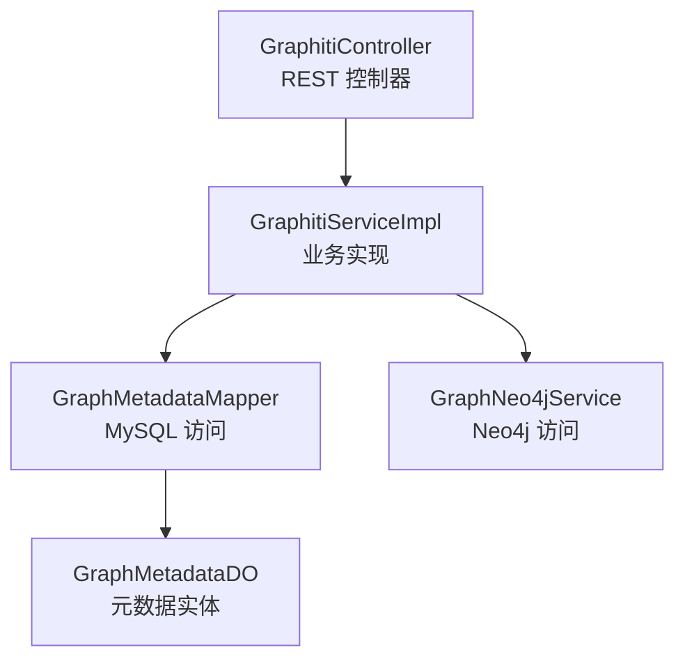
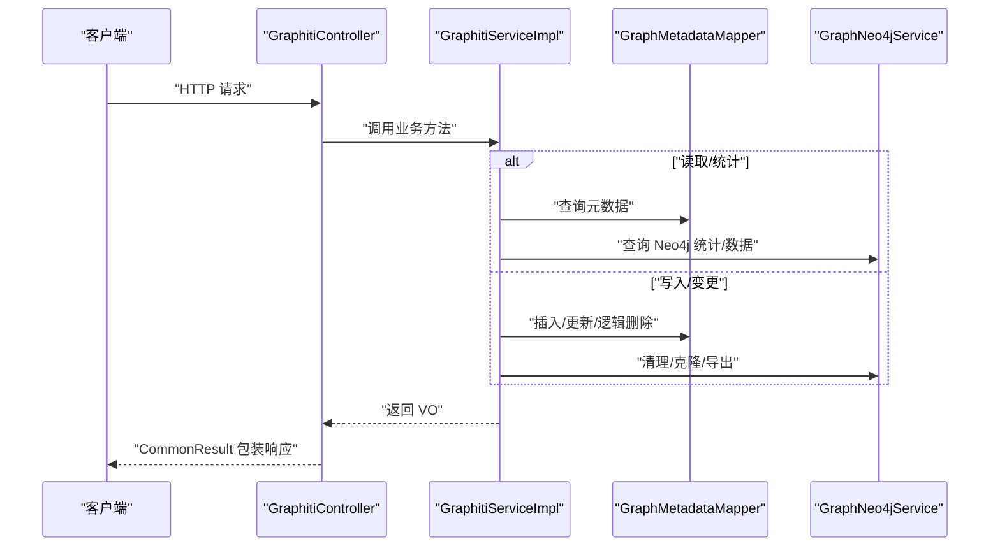
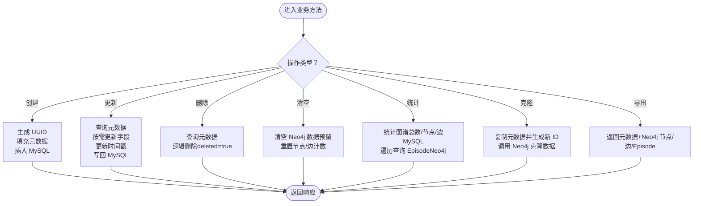
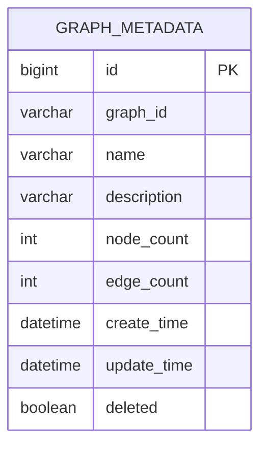
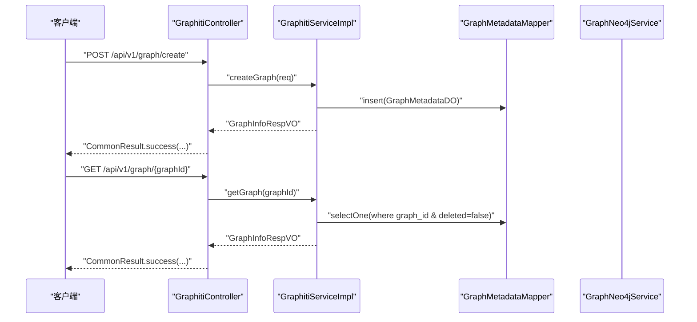
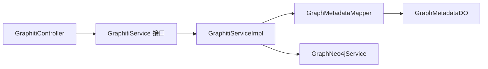

# 知识图谱管理

<cite>
**本文引用的文件**
- [GraphitiController.java](file://graphiti-module-core/src/main/java/com/graphiti/module/graphiti/controller/admin/GraphitiController.java)
- [GraphitiServiceImpl.java](file://graphiti-module-core/src/main/java/com/graphiti/module/graphiti/service/impl/GraphitiServiceImpl.java)
- [GraphitiService.java](file://graphiti-module-core/src/main/java/com/graphiti/module/graphiti/service/GraphitiService.java)
- [GraphMetadataMapper.java](file://graphiti-module-core/src/main/java/com/graphiti/module/graphiti/dal/mysql/GraphMetadataMapper.java)
- [GraphMetadataDO.java](file://graphiti-module-core/src/main/java/com/graphiti/module/graphiti/dal/dataobject/GraphMetadataDO.java)
- [CreateGraphReqVO.java](file://graphiti-module-core/src/main/java/com/graphiti/module/graphiti/vo/graph/CreateGraphReqVO.java)
- [UpdateGraphReqVO.java](file://graphiti-module-core/src/main/java/com/graphiti/module/graphiti/vo/graph/UpdateGraphReqVO.java)
- [GraphInfoRespVO.java](file://graphiti-module-core/src/main/java/com/graphiti/module/graphiti/vo/graph/GraphInfoRespVO.java)
- [GraphListRespVO.java](file://graphiti-module-core/src/main/java/com/graphiti/module/graphiti/vo/graph/GraphListRespVO.java)
- [GraphStatsRespVO.java](file://graphiti-module-core/src/main/java/com/graphiti/module/graphiti/vo/graph/GraphStatsRespVO.java)
- [GraphNeo4jService.java](file://graphiti-module-core/src/main/java/com/graphiti/module/graphiti/service/GraphNeo4jService.java)
</cite>

## 目录
1. [简介](#简介)
2. [项目结构](#项目结构)
3. [核心组件](#核心组件)
4. [架构总览](#架构总览)
5. [详细组件分析](#详细组件分析)
6. [依赖分析](#依赖分析)
7. [性能考虑](#性能考虑)
8. [故障排查指南](#故障排查指南)
9. [结论](#结论)
10. [附录](#附录)

## 简介
本文件聚焦于知识图谱管理功能，围绕 GraphitiController 的图谱生命周期管理（创建、查询、更新、删除、清空）与 GraphitiServiceImpl 的核心业务逻辑展开，同时覆盖图谱元数据管理、统计信息、克隆与导出、状态管理、数据一致性、事务处理与错误处理机制。文档还提供完整的 API 接口说明、参数校验规则、响应格式以及最佳实践与性能优化建议。

## 项目结构
- 控制层：GraphitiController 提供 REST API，负责接收请求、参数校验与返回统一响应包装。
- 服务层：GraphitiServiceImpl 实现图谱生命周期与统计、克隆、导出等核心业务；GraphNeo4jService 提供 Neo4j 数据读写与统计能力。
- 数据访问层：GraphMetadataMapper 访问 MySQL 表 graphiti_graph_metadata；GraphMetadataDO 映射该表。
- 视图对象：VO 类用于请求与响应的数据结构化传输。

图表来源
- [GraphitiController.java:37-235](file://graphiti-module-core/src/main/java/com/graphiti/module/graphiti/controller/admin/GraphitiController.java#L37-L235)
- [GraphitiServiceImpl.java:24-256](file://graphiti-module-core/src/main/java/com/graphiti/module/graphiti/service/impl/GraphitiServiceImpl.java#L24-L256)
- [GraphMetadataMapper.java:7-15](file://graphiti-module-core/src/main/java/com/graphiti/module/graphiti/dal/mysql/GraphMetadataMapper.java#L7-L15)
- [GraphMetadataDO.java:8-60](file://graphiti-module-core/src/main/java/com/graphiti/module/graphiti/dal/dataobject/GraphMetadataDO.java#L8-L60)
- [GraphNeo4jService.java:21-800](file://graphiti-module-core/src/main/java/com/graphiti/module/graphiti/service/GraphNeo4jService.java#L21-L800)

章节来源
- [GraphitiController.java:37-235](file://graphiti-module-core/src/main/java/com/graphiti/module/graphiti/controller/admin/GraphitiController.java#L37-L235)
- [GraphitiServiceImpl.java:24-256](file://graphiti-module-core/src/main/java/com/graphiti/module/graphiti/service/impl/GraphitiServiceImpl.java#L24-L256)
- [GraphMetadataMapper.java:7-15](file://graphiti-module-core/src/main/java/com/graphiti/module/graphiti/dal/mysql/GraphMetadataMapper.java#L7-L15)
- [GraphMetadataDO.java:8-60](file://graphiti-module-core/src/main/java/com/graphiti/module/graphiti/dal/dataobject/GraphMetadataDO.java#L8-L60)
- [GraphNeo4jService.java:21-800](file://graphiti-module-core/src/main/java/com/graphiti/module/graphiti/service/GraphNeo4jService.java#L21-L800)

## 核心组件
- GraphitiController：提供图谱管理的 REST 接口，包括创建、列表、详情、更新、删除、清空、统计、克隆、导出、节点/边列表、社区管理、历史状态查询等。
- GraphitiServiceImpl：实现图谱生命周期与统计、克隆、导出等业务逻辑，使用 MySQL 元数据与 Neo4j 数据双存储。
- GraphMetadataMapper/GraphMetadataDO：MySQL 元数据持久化，记录图谱基本信息与计数。
- GraphNeo4jService：Neo4j 数据访问与统计，提供节点/边 CRUD、全文/向量检索、图谱统计等能力。
- VO 类：CreateGraphReqVO、UpdateGraphReqVO、GraphInfoRespVO、GraphListRespVO、GraphStatsRespVO 定义请求与响应结构。

章节来源
- [GraphitiController.java:37-235](file://graphiti-module-core/src/main/java/com/graphiti/module/graphiti/controller/admin/GraphitiController.java#L37-L235)
- [GraphitiServiceImpl.java:24-256](file://graphiti-module-core/src/main/java/com/graphiti/module/graphiti/service/impl/GraphitiServiceImpl.java#L24-L256)
- [GraphMetadataMapper.java:7-15](file://graphiti-module-core/src/main/java/com/graphiti/module/graphiti/dal/mysql/GraphMetadataMapper.java#L7-L15)
- [GraphMetadataDO.java:8-60](file://graphiti-module-core/src/main/java/com/graphiti/module/graphiti/dal/dataobject/GraphMetadataDO.java#L8-L60)
- [GraphNeo4jService.java:21-800](file://graphiti-module-core/src/main/java/com/graphiti/module/graphiti/service/GraphNeo4jService.java#L21-L800)
- [CreateGraphReqVO.java:1-23](file://graphiti-module-core/src/main/java/com/graphiti/module/graphiti/vo/graph/CreateGraphReqVO.java#L1-L23)
- [UpdateGraphReqVO.java:1-23](file://graphiti-module-core/src/main/java/com/graphiti/module/graphiti/vo/graph/UpdateGraphReqVO.java#L1-L23)
- [GraphInfoRespVO.java:1-42](file://graphiti-module-core/src/main/java/com/graphiti/module/graphiti/vo/graph/GraphInfoRespVO.java#L1-L42)
- [GraphListRespVO.java:1-25](file://graphiti-module-core/src/main/java/com/graphiti/module/graphiti/vo/graph/GraphListRespVO.java#L1-L25)
- [GraphStatsRespVO.java:1-48](file://graphiti-module-core/src/main/java/com/graphiti/module/graphiti/vo/graph/GraphStatsRespVO.java#L1-L48)

## 架构总览
下图展示图谱管理端到端流程：控制层接收请求，服务层协调 MySQL 元数据与 Neo4j 数据，最终返回统一响应。

图表来源
- [GraphitiController.java:50-235](file://graphiti-module-core/src/main/java/com/graphiti/module/graphiti/controller/admin/GraphitiController.java#L50-L235)
- [GraphitiServiceImpl.java:30-205](file://graphiti-module-core/src/main/java/com/graphiti/module/graphiti/service/impl/GraphitiServiceImpl.java#L30-L205)
- [GraphMetadataMapper.java:7-15](file://graphiti-module-core/src/main/java/com/graphiti/module/graphiti/dal/mysql/GraphMetadataMapper.java#L7-L15)
- [GraphNeo4jService.java:569-606](file://graphiti-module-core/src/main/java/com/graphiti/module/graphiti/service/GraphNeo4jService.java#L569-L606)

## 详细组件分析

### 控制器：GraphitiController
- 职责：提供图谱管理 REST API，统一鉴权注解，参数校验，调用服务层并返回 CommonResult 包装结果。
- 关键接口：
  - 创建图谱：POST /api/v1/graph/create
  - 列表图谱：GET /api/v1/graph/list
  - 图谱详情：GET /api/v1/graph/{graphId}
  - 更新图谱：PUT /api/v1/graph/{graphId}
  - 删除图谱：DELETE /api/v1/graph/{graphId}
  - 清空图谱：POST /api/v1/graph/{graphId}/clear
  - 系统统计：GET /api/v1/graph/stats
  - 图谱统计：GET /api/v1/graph/{graphId}/stats
  - 节点列表：GET /api/v1/graph/{graphId}/nodes
  - 边列表：GET /api/v1/graph/{graphId}/edges
  - 克隆图谱：POST /api/v1/graph/{graphId}/clone
  - 导出图谱：GET /api/v1/graph/{graphId}/export
  - 历史状态：GET /api/v1/graph/{graphId}/history

章节来源
- [GraphitiController.java:50-235](file://graphiti-module-core/src/main/java/com/graphiti/module/graphiti/controller/admin/GraphitiController.java#L50-L235)

### 服务实现：GraphitiServiceImpl
- 事务性：使用 @Transactional(rollbackFor = Exception.class) 保证写操作一致性。
- 生命周期管理：
  - createGraph：生成 UUID，填充元数据，插入 MySQL，返回 GraphInfoRespVO。
  - listGraphs：支持分页，过滤 deleted=false，返回 GraphListRespVO。
  - getGraph：按 graphId 查询未删除元数据，转换为响应 VO。
  - updateGraph：按需更新 name/description，更新时间戳，写回 MySQL。
  - deleteGraph：逻辑删除（deleted=true），记录日志。
  - clearGraph：清空 Neo4j 数据（预留），重置 MySQL 节点/边计数。
- 统计信息：
  - getGraphStats：统计图谱总数、节点/边总数（来自 MySQL），Episode 总数（遍历各图谱查询 Neo4j）。
- 克隆与导出：
  - cloneGraph：复制元数据并生成新 graphId，调用 Neo4j 克隆数据，返回新图信息。
  - exportGraph：返回元数据与 Neo4j 节点/边/Episode 数据集合。
- 错误处理：getGraphMetadataByGraphId 在找不到或已删除时抛出业务异常。

图表来源
- [GraphitiServiceImpl.java:30-205](file://graphiti-module-core/src/main/java/com/graphiti/module/graphiti/service/impl/GraphitiServiceImpl.java#L30-L205)

章节来源
- [GraphitiServiceImpl.java:30-205](file://graphiti-module-core/src/main/java/com/graphiti/module/graphiti/service/impl/GraphitiServiceImpl.java#L30-L205)

### 数据模型：GraphMetadataDO 与 GraphMetadataMapper
- 表：graphiti_graph_metadata
- 字段：id、graph_id、name、description、node_count、edge_count、createTime、updateTime、deleted（逻辑删除）
- Mapper：继承 MyBatis-Plus BaseMapper，提供通用 CRUD 能力。

图表来源
- [GraphMetadataDO.java:8-60](file://graphiti-module-core/src/main/java/com/graphiti/module/graphiti/dal/dataobject/GraphMetadataDO.java#L8-L60)
- [GraphMetadataMapper.java:7-15](file://graphiti-module-core/src/main/java/com/graphiti/module/graphiti/dal/mysql/GraphMetadataMapper.java#L7-L15)

章节来源
- [GraphMetadataDO.java:8-60](file://graphiti-module-core/src/main/java/com/graphiti/module/graphiti/dal/dataobject/GraphMetadataDO.java#L8-L60)
- [GraphMetadataMapper.java:7-15](file://graphiti-module-core/src/main/java/com/graphiti/module/graphiti/dal/mysql/GraphMetadataMapper.java#L7-L15)

### Neo4j 服务：GraphNeo4jService
- 节点/边 CRUD：创建实体节点、关系边，更新向量，查询、删除。
- 统计：按 group_id 统计节点/边数量，统计 Episode 数量。
- 清空：按 group_id DETACH DELETE 节点与 Episode。
- 检索：全文索引（节点/边）与向量索引（节点/边）查询。
- 克隆：根据 group_id 复制数据（由服务层调用）。

章节来源
- [GraphNeo4jService.java:569-606](file://graphiti-module-core/src/main/java/com/graphiti/module/graphiti/service/GraphNeo4jService.java#L569-L606)
- [GraphNeo4jService.java:768-791](file://graphiti-module-core/src/main/java/com/graphiti/module/graphiti/service/GraphNeo4jService.java#L768-L791)

### API 接口文档

- 创建图谱
  - 方法与路径：POST /api/v1/graph/create
  - 请求体：CreateGraphReqVO（name 必填，description 可选）
  - 响应体：GraphInfoRespVO
  - 参数校验：@NotBlank 于 name
  - 异常：无显式全局捕获，业务异常由服务层抛出

- 列表图谱
  - 方法与路径：GET /api/v1/graph/list
  - 查询参数：limit（默认 100）、offset（默认 0）
  - 响应体：GraphListRespVO（graphs[], totalCount, rowCount）

- 图谱详情
  - 方法与路径：GET /api/v1/graph/{graphId}
  - 路径参数：graphId（必填）
  - 响应体：GraphInfoRespVO

- 更新图谱
  - 方法与路径：PUT /api/v1/graph/{graphId}
  - 路径参数：graphId（必填）
  - 请求体：UpdateGraphReqVO（name、description 可选）
  - 响应体：GraphInfoRespVO

- 删除图谱
  - 方法与路径：DELETE /api/v1/graph/{graphId}
  - 路径参数：graphId（必填）
  - 响应体：CommonResult<Void>

- 清空图谱
  - 方法与路径：POST /api/v1/graph/{graphId}/clear
  - 路径参数：graphId（必填）
  - 响应体：CommonResult<Void>

- 系统统计
  - 方法与路径：GET /api/v1/graph/stats
  - 响应体：GraphStatsRespVO（totalGraphs、totalNodes、totalEdges、totalEpisodes、trends）

- 图谱统计
  - 方法与路径：GET /api/v1/graph/{graphId}/stats
  - 路径参数：graphId（必填）
  - 响应体：Map<String, Long>（nodeCount、edgeCount）

- 节点列表
  - 方法与路径：GET /api/v1/graph/{graphId}/nodes
  - 路径参数：graphId（必填）
  - 响应体：List<NodeListRespVO>

- 边列表
  - 方法与路径：GET /api/v1/graph/{graphId}/edges
  - 路径参数：graphId（必填）
  - 响应体：List<EdgeListRespVO>

- 克隆图谱
  - 方法与路径：POST /api/v1/graph/{graphId}/clone
  - 路径参数：graphId（必填）
  - 响应体：GraphInfoRespVO

- 导出图谱
  - 方法与路径：GET /api/v1/graph/{graphId}/export
  - 路径参数：graphId（必填）
  - 响应体：Map<String, Object>（graphId、name、description、nodeCount、edgeCount、createdAt、nodes、edges、episodes）

- 历史状态
  - 方法与路径：GET /api/v1/graph/{graphId}/history
  - 路径参数：graphId（必填），查询参数 time（毫秒时间戳）
  - 响应体：Map<String, Object>（nodes、edges）

章节来源
- [GraphitiController.java:50-235](file://graphiti-module-core/src/main/java/com/graphiti/module/graphiti/controller/admin/GraphitiController.java#L50-L235)
- [CreateGraphReqVO.java:10-23](file://graphiti-module-core/src/main/java/com/graphiti/module/graphiti/vo/graph/CreateGraphReqVO.java#L10-L23)
- [UpdateGraphReqVO.java:9-23](file://graphiti-module-core/src/main/java/com/graphiti/module/graphiti/vo/graph/UpdateGraphReqVO.java#L9-L23)
- [GraphInfoRespVO.java:10-42](file://graphiti-module-core/src/main/java/com/graphiti/module/graphiti/vo/graph/GraphInfoRespVO.java#L10-L42)
- [GraphListRespVO.java:11-25](file://graphiti-module-core/src/main/java/com/graphiti/module/graphiti/vo/graph/GraphListRespVO.java#L11-L25)
- [GraphStatsRespVO.java:9-48](file://graphiti-module-core/src/main/java/com/graphiti/module/graphiti/vo/graph/GraphStatsRespVO.java#L9-L48)

### 图谱生命周期流程（序列图）

图表来源
- [GraphitiController.java:50-82](file://graphiti-module-core/src/main/java/com/graphiti/module/graphiti/controller/admin/GraphitiController.java#L50-L82)
- [GraphitiServiceImpl.java:30-81](file://graphiti-module-core/src/main/java/com/graphiti/module/graphiti/service/impl/GraphitiServiceImpl.java#L30-L81)
- [GraphMetadataMapper.java:7-15](file://graphiti-module-core/src/main/java/com/graphiti/module/graphiti/dal/mysql/GraphMetadataMapper.java#L7-L15)

### 图谱状态管理与一致性
- 状态字段：GraphMetadataDO 的 deleted 支持逻辑删除；node_count/edge_count 作为计数缓存。
- 事务边界：写操作（创建、更新、删除、清空、克隆）均在 @Transactional 中执行，确保 MySQL 与 Neo4j 协同的一致性。
- 一致性策略：
  - 删除：仅标记 deleted=true，保留数据以便审计与恢复。
  - 清空：清空 Neo4j 数据并重置计数，保持元数据可用。
  - 克隆：复制元数据并调用 Neo4j 克隆，保证数据完整性。

章节来源
- [GraphitiServiceImpl.java:30-116](file://graphiti-module-core/src/main/java/com/graphiti/module/graphiti/service/impl/GraphitiServiceImpl.java#L30-L116)
- [GraphMetadataDO.java:55-58](file://graphiti-module-core/src/main/java/com/graphiti/module/graphiti/dal/dataobject/GraphMetadataDO.java#L55-L58)

### 错误处理机制
- 业务异常：当图谱不存在或已删除时，getGraphMetadataByGraphId 抛出业务异常（代码 1001）。
- 控制器：使用 CommonResult 包装响应，异常由全局异常处理器捕获（未在本文件中定义，但控制器返回值类型表明存在统一包装）。
- 建议：在服务层明确捕获底层异常（如 Neo4j 查询失败），转换为业务异常并记录日志，避免泄露内部错误。

章节来源
- [GraphitiServiceImpl.java:214-223](file://graphiti-module-core/src/main/java/com/graphiti/module/graphiti/service/impl/GraphitiServiceImpl.java#L214-L223)

## 依赖分析
- 控制器依赖服务接口与多个子服务（节点、边、社区、时间序列、搜索、Neo4j）。
- 服务实现依赖 Mapper 与 GraphNeo4jService。
- Mapper 依赖 MyBatis-Plus 与数据库。
- VO 类用于请求/响应数据结构化。

图表来源
- [GraphitiController.java:42-48](file://graphiti-module-core/src/main/java/com/graphiti/module/graphiti/controller/admin/GraphitiController.java#L42-L48)
- [GraphitiServiceImpl.java:28-29](file://graphiti-module-core/src/main/java/com/graphiti/module/graphiti/service/impl/GraphitiServiceImpl.java#L28-L29)
- [GraphMetadataMapper.java:7-15](file://graphiti-module-core/src/main/java/com/graphiti/module/graphiti/dal/mysql/GraphMetadataMapper.java#L7-L15)
- [GraphMetadataDO.java:8-60](file://graphiti-module-core/src/main/java/com/graphiti/module/graphiti/dal/dataobject/GraphMetadataDO.java#L8-L60)
- [GraphNeo4jService.java:21-24](file://graphiti-module-core/src/main/java/com/graphiti/module/graphiti/service/GraphNeo4jService.java#L21-L24)

章节来源
- [GraphitiController.java:42-48](file://graphiti-module-core/src/main/java/com/graphiti/module/graphiti/controller/admin/GraphitiController.java#L42-L48)
- [GraphitiServiceImpl.java:28-29](file://graphiti-module-core/src/main/java/com/graphiti/module/graphiti/service/impl/GraphitiServiceImpl.java#L28-L29)
- [GraphMetadataMapper.java:7-15](file://graphiti-module-core/src/main/java/com/graphiti/module/graphiti/dal/mysql/GraphMetadataMapper.java#L7-L15)
- [GraphMetadataDO.java:8-60](file://graphiti-module-core/src/main/java/com/graphiti/module/graphiti/dal/dataobject/GraphMetadataDO.java#L8-L60)
- [GraphNeo4jService.java:21-24](file://graphiti-module-core/src/main/java/com/graphiti/module/graphiti/service/GraphNeo4jService.java#L21-L24)

## 性能考虑
- 分页查询：listGraphs 支持 limit/offset，避免一次性加载过多元数据。
- 统计优化：getGraphStats 遍历各图谱查询 Episode，建议在 Neo4j 中建立索引或缓存策略以降低开销。
- 向量索引：GraphNeo4jService.initVectorIndexes 提供向量索引初始化，建议在应用启动时调用。
- 批量操作：导出与克隆涉及大量数据读取，建议分批处理并异步化以提升吞吐。
- 缓存：可引入 Redis 缓存热点图谱元数据与统计结果，减少重复查询。

## 故障排查指南
- 图谱不存在或已删除：检查 graphId 是否正确，确认 deleted=false 条件是否满足。
- 删除后仍可见：确认逻辑删除生效且查询条件包含 deleted=false。
- 清空后计数不更新：确认 clearGraph 流程已重置 node_count/edge_count。
- 克隆失败：检查 Neo4j 克隆调用是否成功，确认 group_id 映射正确。
- 统计异常：关注 Episode 统计遍历过程中的异常日志，必要时降级为估算值。

章节来源
- [GraphitiServiceImpl.java:108-116](file://graphiti-module-core/src/main/java/com/graphiti/module/graphiti/service/impl/GraphitiServiceImpl.java#L108-L116)
- [GraphitiServiceImpl.java:142-149](file://graphiti-module-core/src/main/java/com/graphiti/module/graphiti/service/impl/GraphitiServiceImpl.java#L142-L149)

## 结论
本方案通过 MySQL 元数据与 Neo4j 图数据的协同，实现了完整的知识图谱生命周期管理。GraphitiController 提供清晰的 REST 接口，GraphitiServiceImpl 保障事务一致性与业务规则，GraphNeo4jService 提供高性能的图数据访问能力。建议在生产环境中完善异常处理、索引与缓存策略，并对批量操作进行异步化改造以提升整体性能与稳定性。

## 附录

### API 参数与响应格式速查
- 创建图谱：请求体包含 name（必填）、description（可选）；响应体为 GraphInfoRespVO。
- 列表图谱：查询参数 limit/offset；响应体为 GraphListRespVO。
- 图谱详情：路径参数 graphId；响应体为 GraphInfoRespVO。
- 更新图谱：路径参数 graphId，请求体包含 name/description；响应体为 GraphInfoRespVO。
- 删除/清空：路径参数 graphId；响应体为空包装。
- 统计：系统统计返回 GraphStatsRespVO；图谱统计返回 Map<String, Long>。
- 克隆/导出：路径参数 graphId；克隆返回 GraphInfoRespVO；导出返回 Map<String, Object>。

章节来源
- [GraphitiController.java:50-235](file://graphiti-module-core/src/main/java/com/graphiti/module/graphiti/controller/admin/GraphitiController.java#L50-L235)
- [CreateGraphReqVO.java:10-23](file://graphiti-module-core/src/main/java/com/graphiti/module/graphiti/vo/graph/CreateGraphReqVO.java#L10-L23)
- [UpdateGraphReqVO.java:9-23](file://graphiti-module-core/src/main/java/com/graphiti/module/graphiti/vo/graph/UpdateGraphReqVO.java#L9-L23)
- [GraphInfoRespVO.java:10-42](file://graphiti-module-core/src/main/java/com/graphiti/module/graphiti/vo/graph/GraphInfoRespVO.java#L10-L42)
- [GraphListRespVO.java:11-25](file://graphiti-module-core/src/main/java/com/graphiti/module/graphiti/vo/graph/GraphListRespVO.java#L11-L25)
- [GraphStatsRespVO.java:9-48](file://graphiti-module-core/src/main/java/com/graphiti/module/graphiti/vo/graph/GraphStatsRespVO.java#L9-L48)