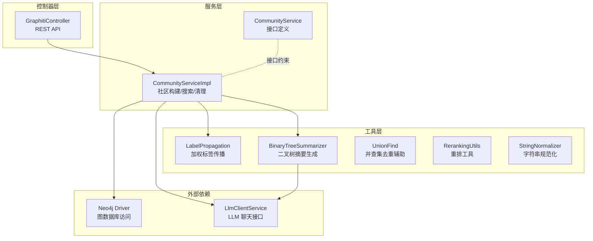
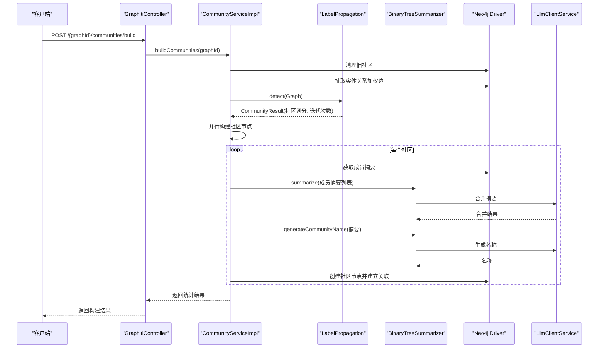
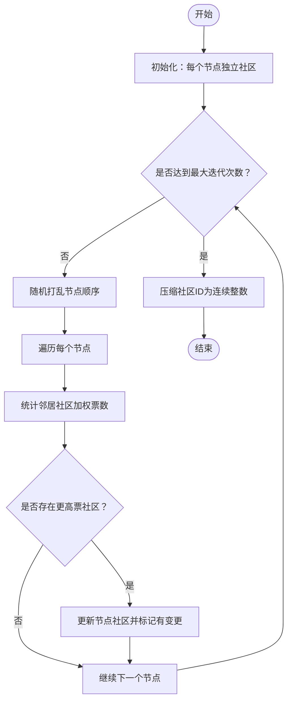
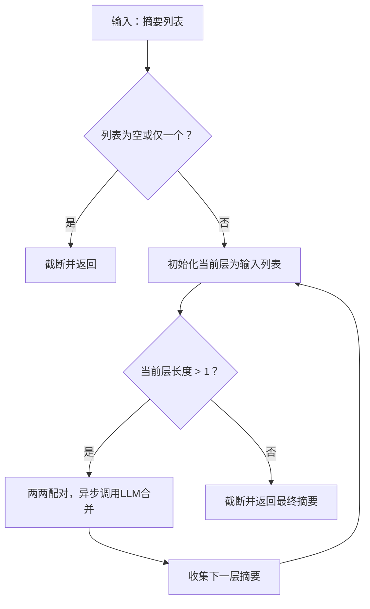
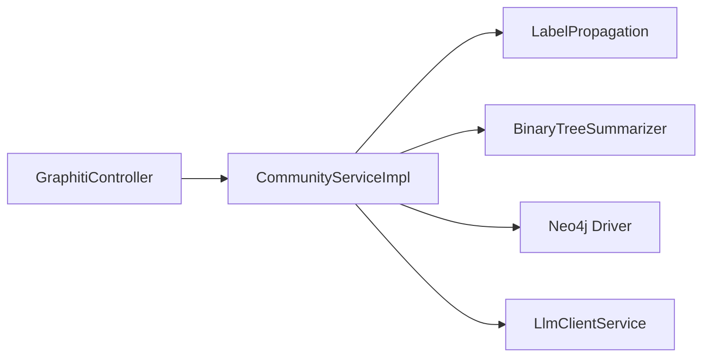

# 社区发现

<!--<cite>
**本文引用的文件**
- [CommunityServiceImpl.java](file://graphiti-module-core/src/main/java/com/graphiti/module/graphiti/service/impl/CommunityServiceImpl.java)
- [CommunityService.java](file://graphiti-module-core/src/main/java/com/graphiti/module/graphiti/service/CommunityService.java)
- [LabelPropagation.java](file://graphiti-module-core/src/main/java/com/graphiti/module/graphiti/util/LabelPropagation.java)
- [BinaryTreeSummarizer.java](file://graphiti-module-core/src/main/java/com/graphiti/module/graphiti/util/BinaryTreeSummarizer.java)
- [GraphitiController.java](file://graphiti-module-core/src/main/java/com/graphiti/module/graphiti/controller/admin/GraphitiController.java)
- [summarize_community.txt](file://graphiti-module-core/src/main/resources/prompts/summarize_community.txt)
- [UnionFind.java](file://graphiti-module-core/src/main/java/com/graphiti/module/graphiti/util/UnionFind.java)
- [RerankingUtils.java](file://graphiti-module-core/src/main/java/com/graphiti/module/graphiti/util/RerankingUtils.java)
- [StringNormalizer.java](file://graphiti-module-core/src/main/java/com/graphiti/module/graphiti/util/StringNormalizer.java)
</cite>-->

## 目录
1. [简介](#简介)
2. [项目结构](#项目结构)
3. [核心组件](#核心组件)
4. [架构总览](#架构总览)
5. [详细组件分析](#详细组件分析)
6. [依赖分析](#依赖分析)
7. [性能考虑](#性能考虑)
8. [故障排查指南](#故障排查指南)
9. [结论](#结论)
10. [附录](#附录)

## 简介
本技术文档围绕社区发现功能展开，系统性阐述基于加权标签传播算法（Weighted Label Propagation）的社区检测实现，以及二叉树聚合器（BinaryTreeSummarizer）在社区摘要生成、层次化社区结构与可视化支持方面的机制。文档还覆盖社区构建流程（图预处理、算法执行、结果后处理与质量评估）、社区搜索（基于名称与摘要检索、相似社区推荐、社区间关系分析），并提供参数配置指南与性能优化策略，帮助读者在大规模图上稳定高效地运行社区发现任务。

## 项目结构
社区发现功能主要位于核心模块 graphiti-module-core 中，采用“服务层 + 工具层 + 控制器层”的分层设计：
- 控制器层：对外暴露 REST API，负责接收请求与返回响应。
- 服务层：封装业务逻辑，协调图数据库与 LLM 客户端。
- 工具层：提供图算法与摘要生成等通用能力。

图表来源
- [GraphitiController.java:165-190](file://graphiti-module-core/src/main/java/com/graphiti/module/graphiti/controller/admin/GraphitiController.java#L165-L190)
- [CommunityServiceImpl.java:30-61](file://graphiti-module-core/src/main/java/com/graphiti/module/graphiti/service/impl/CommunityServiceImpl.java#L30-L61)
- [LabelPropagation.java:130-189](file://graphiti-module-core/src/main/java/com/graphiti/module/graphiti/util/LabelPropagation.java#L130-L189)
- [BinaryTreeSummarizer.java:30-44](file://graphiti-module-core/src/main/java/com/graphiti/module/graphiti/util/BinaryTreeSummarizer.java#L30-L44)

章节来源
- [GraphitiController.java:165-190](file://graphiti-module-core/src/main/java/com/graphiti/module/graphiti/controller/admin/GraphitiController.java#L165-L190)
- [CommunityServiceImpl.java:30-61](file://graphiti-module-core/src/main/java/com/graphiti/module/graphiti/service/impl/CommunityServiceImpl.java#L30-L61)

## 核心组件
- 社区服务接口与实现：定义社区构建、列表查询、搜索与清理等能力，并通过 Neo4j 与 LLM 客户端协作完成。
- 加权标签传播算法：对实体图进行社区检测，输出社区划分与迭代次数。
- 二叉树摘要生成器：对社区成员摘要进行两两合并，形成层次化摘要与社区名称。
- 控制器：提供 REST API，统一入口调用社区服务。

章节来源
- [CommunityService.java:9-38](file://graphiti-module-core/src/main/java/com/graphiti/module/graphiti/service/CommunityService.java#L9-L38)
- [CommunityServiceImpl.java:30-61](file://graphiti-module-core/src/main/java/com/graphiti/module/graphiti/service/impl/CommunityServiceImpl.java#L30-L61)
- [LabelPropagation.java:130-189](file://graphiti-module-core/src/main/java/com/graphiti/module/graphiti/util/LabelPropagation.java#L130-L189)
- [BinaryTreeSummarizer.java:30-44](file://graphiti-module-core/src/main/java/com/graphiti/module/graphiti/util/BinaryTreeSummarizer.java#L30-L44)

## 架构总览
社区发现的端到端流程如下：
1. 清理旧社区（可选）。
2. 从 Neo4j 抽取实体与关系，构建加权图。
3. 执行加权标签传播算法，得到社区划分。
4. 对每个社区并行生成摘要与名称，创建社区节点并建立成员关联。
5. 提供社区列表与搜索接口。

图表来源
- [GraphitiController.java:167-173](file://graphiti-module-core/src/main/java/com/graphiti/module/graphiti/controller/admin/GraphitiController.java#L167-L173)
- [CommunityServiceImpl.java:41-61](file://graphiti-module-core/src/main/java/com/graphiti/module/graphiti/service/impl/CommunityServiceImpl.java#L41-L61)
- [LabelPropagation.java:130-189](file://graphiti-module-core/src/main/java/com/graphiti/module/graphiti/util/LabelPropagation.java#L130-L189)
- [BinaryTreeSummarizer.java:52-94](file://graphiti-module-core/src/main/java/com/graphiti/module/graphiti/util/BinaryTreeSummarizer.java#L52-L94)

## 详细组件分析

### 社区服务实现（CommunityServiceImpl）
- 职责
  - 清理旧社区。
  - 从 Neo4j 抽取实体关系，构建加权图并执行标签传播。
  - 并行构建社区节点，生成摘要与名称，写回图数据库。
  - 提供社区列表与搜索接口。
- 关键参数
  - 最大并发构建社区数：用于控制并行度，避免资源争用。
  - 社区最小成员数：过滤过小社区，减少噪声。
- 错误处理
  - 单个社区构建失败不影响整体流程；记录错误日志并继续。
  - LLM 合并失败时进行降级（简单拼接），保证可用性。
- 性能要点
  - 并行构建社区节点，提升吞吐。
  - 使用固定大小线程池管理 LLM 调用，避免过度并发。

章节来源
- [CommunityServiceImpl.java:35-39](file://graphiti-module-core/src/main/java/com/graphiti/module/graphiti/service/impl/CommunityServiceImpl.java#L35-L39)
- [CommunityServiceImpl.java:93-132](file://graphiti-module-core/src/main/java/com/graphiti/module/graphiti/service/impl/CommunityServiceImpl.java#L93-L132)
- [CommunityServiceImpl.java:137-180](file://graphiti-module-core/src/main/java/com/graphiti/module/graphiti/service/impl/CommunityServiceImpl.java#L137-L180)

### 加权标签传播算法（LabelPropagation）
- 算法原理
  - 初始化：每个节点自成一社区。
  - 迭代：随机遍历节点，统计邻居社区的加权“票数”（边权重之和）。
  - 选择：得票最多者获胜；若平票，选择社区 ID 更大的。
  - 收敛：当一轮内无节点变更时停止；设置最大迭代次数防止无限循环。
  - 压缩：将社区 ID 映射为连续整数，便于存储与展示。
- 数据结构
  - Graph：邻接表，存储邻居节点与其边权重。
  - CommunityResult：保存节点到社区映射、社区成员集合与迭代次数。
- 复杂度
  - 时间复杂度近似 O(|E|·I)，I 为迭代次数；空间复杂度 O(|V|+|E|)。
- 参数与阈值
  - 最大迭代次数：防止长时间运行。
  - 收敛阈值：当前实现未显式使用，但可通过“无变更即收敛”判定。
- 可扩展性
  - 可引入更复杂的权重策略（如边方向、属性权重）。
  - 可增加多阶段初始化或先验社区信息。

图表来源
- [LabelPropagation.java:130-189](file://graphiti-module-core/src/main/java/com/graphiti/module/graphiti/util/LabelPropagation.java#L130-L189)
- [LabelPropagation.java:194-211](file://graphiti-module-core/src/main/java/com/graphiti/module/graphiti/util/LabelPropagation.java#L194-L211)
- [LabelPropagation.java:216-233](file://graphiti-module-core/src/main/java/com/graphiti/module/graphiti/util/LabelPropagation.java#L216-L233)

章节来源
- [LabelPropagation.java:130-189](file://graphiti-module-core/src/main/java/com/graphiti/module/graphiti/util/LabelPropagation.java#L130-L189)
- [LabelPropagation.java:216-233](file://graphiti-module-core/src/main/java/com/graphiti/module/graphiti/util/LabelPropagation.java#L216-L233)

### 二叉树摘要生成器（BinaryTreeSummarizer）
- 算法思想
  - 将摘要列表两两配对，使用 LLM 合并为更高级别的摘要，重复直到只剩一个。
  - 支持带上下文的合并，增强主题一致性。
- 关键能力
  - summarize：标准二叉树合并。
  - summarizeWithContext：带额外上下文的合并。
  - generateCommunityName：基于摘要生成简洁描述。
  - 截断策略：在句/词边界安全截断，避免破坏语义。
- 并发模型
  - 固定大小线程池，两两配对异步合并，显著降低 LLM 调用次数（约 O(log n) 层）。
- 错误处理
  - LLM 调用异常时降级为简单拼接，保证稳定性。
- 复杂度
  - LLM 调用次数约为 O(n log n)，优于逐个拼接的 O(n^2)。

图表来源
- [BinaryTreeSummarizer.java:52-94](file://graphiti-module-core/src/main/java/com/graphiti/module/graphiti/util/BinaryTreeSummarizer.java#L52-L94)
- [BinaryTreeSummarizer.java:103-141](file://graphiti-module-core/src/main/java/com/graphiti/module/graphiti/util/BinaryTreeSummarizer.java#L103-L141)

章节来源
- [BinaryTreeSummarizer.java:30-44](file://graphiti-module-core/src/main/java/com/graphiti/module/graphiti/util/BinaryTreeSummarizer.java#L30-L44)
- [BinaryTreeSummarizer.java:52-94](file://graphiti-module-core/src/main/java/com/graphiti/module/graphiti/util/BinaryTreeSummarizer.java#L52-L94)
- [BinaryTreeSummarizer.java:103-141](file://graphiti-module-core/src/main/java/com/graphiti/module/graphiti/util/BinaryTreeSummarizer.java#L103-L141)

### 社区构建流程（图预处理、算法执行、后处理与质量评估）
- 图预处理
  - 从 Neo4j 抽取实体与关系，过滤无效边，统计边权重（如关系计数），构建无向加权图。
- 算法执行
  - 执行加权标签传播，得到社区划分与迭代次数。
- 结果后处理
  - 过滤过小社区（默认阈值），并行构建社区节点。
  - 获取成员摘要，使用二叉树合并生成社区摘要与名称，写入图数据库。
- 质量评估
  - 社区规模分布、平均成员数、迭代收敛情况可用于评估算法稳定性与社区粒度。
  - 可结合外部指标（如模块度）进行进一步评估（当前实现未内置）。

章节来源
- [CommunityServiceImpl.java:66-88](file://graphiti-module-core/src/main/java/com/graphiti/module/graphiti/service/impl/CommunityServiceImpl.java#L66-L88)
- [CommunityServiceImpl.java:93-132](file://graphiti-module-core/src/main/java/com/graphiti/module/graphiti/service/impl/CommunityServiceImpl.java#L93-L132)
- [CommunityServiceImpl.java:137-180](file://graphiti-module-core/src/main/java/com/graphiti/module/graphiti/service/impl/CommunityServiceImpl.java#L137-L180)

### 社区搜索功能
- 基于名称与摘要的检索
  - 支持名称与摘要的模糊匹配，返回前若干条社区记录。
- 相似社区推荐
  - 可结合重排工具（如 MMR、RRF）对候选社区进行重排，提升相关性与多样性。
- 社区间关系分析
  - 可通过分析社区成员间的边密度、跨社区边数量等指标，评估社区内部紧密度与边界清晰度。

章节来源
- [CommunityServiceImpl.java:235-262](file://graphiti-module-core/src/main/java/com/graphiti/module/graphiti/service/impl/CommunityServiceImpl.java#L235-L262)
- [RerankingUtils.java:106-174](file://graphiti-module-core/src/main/java/com/graphiti/module/graphiti/util/RerankingUtils.java#L106-L174)
- [RerankingUtils.java:47-86](file://graphiti-module-core/src/main/java/com/graphiti/module/graphiti/util/RerankingUtils.java#L47-L86)

### 参数配置指南
- 社区构建参数
  - 最大并发构建社区数：控制并行度，建议与 CPU 核心数匹配。
  - 社区最小成员数：过滤噪声社区，默认值可按领域调整。
- 算法收敛参数
  - 最大迭代次数：防止长时间运行，默认值可按图规模调整。
  - 平票策略：当前实现选择较大社区 ID，确保确定性。
- 摘要生成参数
  - 最大摘要长度：避免 LLM 输出过长。
  - LLM 并发上限：控制线程池大小，避免资源耗尽。
- 搜索与重排参数
  - RRF 默认参数 k：影响不同来源排序的融合强度。
  - MMR 平衡参数 λ：相关性与多样性的权衡。
  - 最小相似度阈值：过滤低质量匹配。

章节来源
- [CommunityServiceImpl.java:35-39](file://graphiti-module-core/src/main/java/com/graphiti/module/graphiti/service/impl/CommunityServiceImpl.java#L35-L39)
- [LabelPropagation.java:22-26](file://graphiti-module-core/src/main/java/com/graphiti/module/graphiti/util/LabelPropagation.java#L22-L26)
- [BinaryTreeSummarizer.java:32-36](file://graphiti-module-core/src/main/java/com/graphiti/module/graphiti/util/BinaryTreeSummarizer.java#L32-L36)
- [RerankingUtils.java:21-28](file://graphiti-module-core/src/main/java/com/graphiti/module/graphiti/util/RerankingUtils.java#L21-L28)

### 性能基准测试与优化策略
- 基准测试建议
  - 测试不同规模图（节点数、边数、密度）下的构建时间、内存占用与 LLM 调用次数。
  - 对比不同并发度、迭代次数与最小社区规模对结果的影响。
- 优化策略
  - 图预处理阶段：批量抽取与缓存，减少往返开销。
  - 算法阶段：随机遍历顺序有助于更快收敛；可尝试多轮初始化。
  - 摘要阶段：二叉树合并显著降低 LLM 调用次数；合理设置线程池大小。
  - 存储阶段：批量写入（UNWIND）提升写入效率；索引优化（如 group_id、uuid）提升查询性能。
  - 动态更新：支持增量更新（新增节点/关系）与增量摘要合并，避免全量重建。

章节来源
- [CommunityServiceImpl.java:93-132](file://graphiti-module-core/src/main/java/com/graphiti/module/graphiti/service/impl/CommunityServiceImpl.java#L93-L132)
- [BinaryTreeSummarizer.java:63-91](file://graphiti-module-core/src/main/java/com/graphiti/module/graphiti/util/BinaryTreeSummarizer.java#L63-L91)

## 依赖分析
- 组件耦合
  - CommunityServiceImpl 依赖 LabelPropagation 与 BinaryTreeSummarizer，同时依赖 Neo4j Driver 与 LlmClientService。
  - 控制器仅依赖服务接口，保持良好的分层与解耦。
- 外部依赖
  - Neo4j Driver：提供图数据库读写能力。
  - LlmClientService：提供摘要合并与名称生成的 LLM 能力。
- 循环依赖
  - 当前实现未见循环依赖，职责清晰。

图表来源
- [GraphitiController.java:167-173](file://graphiti-module-core/src/main/java/com/graphiti/module/graphiti/controller/admin/GraphitiController.java#L167-L173)
- [CommunityServiceImpl.java:32-33](file://graphiti-module-core/src/main/java/com/graphiti/module/graphiti/service/impl/CommunityServiceImpl.java#L32-L33)

章节来源
- [GraphitiController.java:167-173](file://graphiti-module-core/src/main/java/com/graphiti/module/graphiti/controller/admin/GraphitiController.java#L167-L173)
- [CommunityServiceImpl.java:32-33](file://graphiti-module-core/src/main/java/com/graphiti/module/graphiti/service/impl/CommunityServiceImpl.java#L32-L33)

## 性能考虑
- 算法层面
  - 标签传播的迭代次数与收敛速度受图拓扑影响；随机遍历有助于更快收敛。
  - 压缩社区 ID 为连续整数，减少存储与显示成本。
- 并发与资源
  - 社区构建与摘要合并均采用固定大小线程池，避免资源争用。
  - LLM 调用采用异步合并，显著降低调用次数。
- I/O 优化
  - 批量读取与写入，减少网络往返与事务开销。
  - 合理的索引与查询条件（如 group_id）提升查询效率。

章节来源
- [LabelPropagation.java:130-189](file://graphiti-module-core/src/main/java/com/graphiti/module/graphiti/util/LabelPropagation.java#L130-L189)
- [BinaryTreeSummarizer.java:32-44](file://graphiti-module-core/src/main/java/com/graphiti/module/graphiti/util/BinaryTreeSummarizer.java#L32-L44)
- [CommunityServiceImpl.java:93-132](file://graphiti-module-core/src/main/java/com/graphiti/module/graphiti/service/impl/CommunityServiceImpl.java#L93-L132)

## 故障排查指南
- 社区构建失败
  - 检查 Neo4j 连接与权限；确认图中存在有效实体与关系。
  - 查看日志中“社区构建失败”错误，定位具体异常原因。
- LLM 合并失败
  - 检查 LLM 客户端配置与可用性；观察降级行为（简单拼接）是否满足需求。
- 摘要过长或不一致
  - 调整最大摘要长度与提示词模板；必要时增加上下文信息。
- 搜索结果不理想
  - 调整 RRF/ MMR 参数；检查检索关键词规范化与相似度阈值。

章节来源
- [CommunityServiceImpl.java:117-126](file://graphiti-module-core/src/main/java/com/graphiti/module/graphiti/service/impl/CommunityServiceImpl.java#L117-L126)
- [BinaryTreeSummarizer.java:82-88](file://graphiti-module-core/src/main/java/com/graphiti/module/graphiti/util/BinaryTreeSummarizer.java#L82-L88)
- [BinaryTreeSummarizer.java:148-154](file://graphiti-module-core/src/main/java/com/graphiti/module/graphiti/util/BinaryTreeSummarizer.java#L148-L154)

## 结论
本实现以加权标签传播为核心，结合二叉树摘要生成与 LLM 能力，提供了可扩展、可并行化的社区发现方案。通过合理的参数配置与性能优化策略，可在大规模图上稳定运行。未来可进一步引入模块度评估、增量更新与更丰富的社区间关系分析，以提升社区质量与可解释性。

## 附录
- 提示词模板：社区摘要生成的提示词模板位于资源目录，可按需定制以适配不同领域。
- 相关工具：并查集（UnionFind）与字符串规范化（StringNormalizer）等工具可辅助实体去重与预处理；重排工具（RerankingUtils）可用于搜索结果优化。

章节来源
- [summarize_community.txt:1-19](file://graphiti-module-core/src/main/resources/prompts/summarize_community.txt#L1-L19)
- [UnionFind.java:15-28](file://graphiti-module-core/src/main/java/com/graphiti/module/graphiti/util/UnionFind.java#L15-L28)
- [StringNormalizer.java:18-23](file://graphiti-module-core/src/main/java/com/graphiti/module/graphiti/util/StringNormalizer.java#L18-L23)
- [RerankingUtils.java:106-174](file://graphiti-module-core/src/main/java/com/graphiti/module/graphiti/util/RerankingUtils.java#L106-L174)