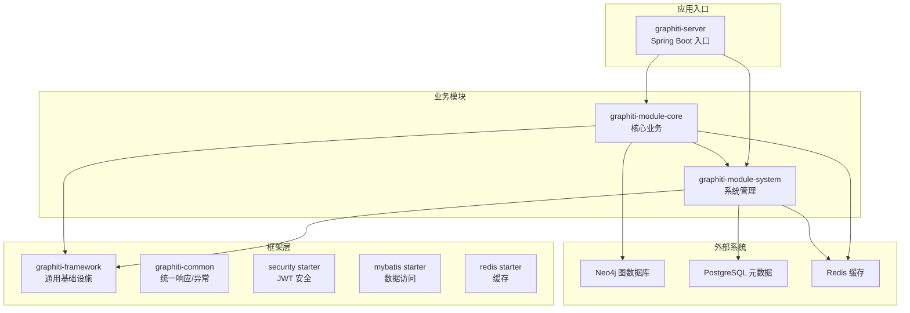
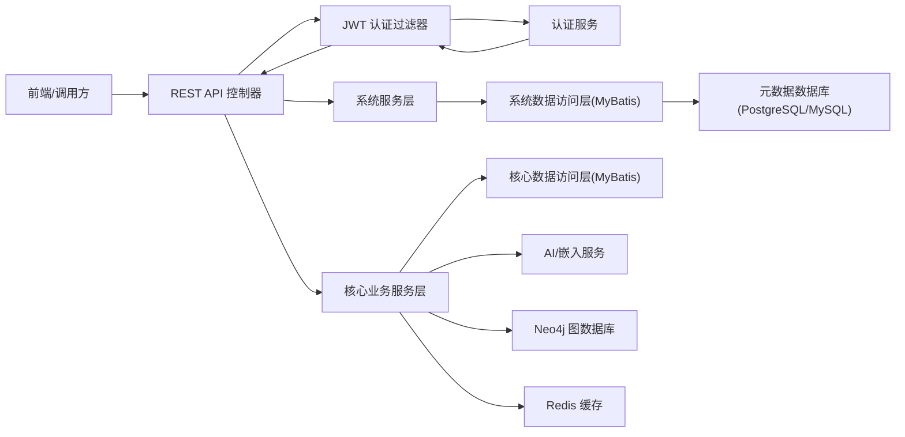
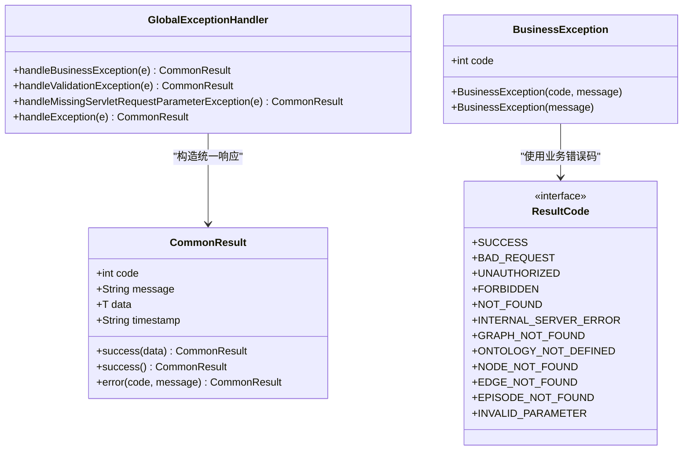
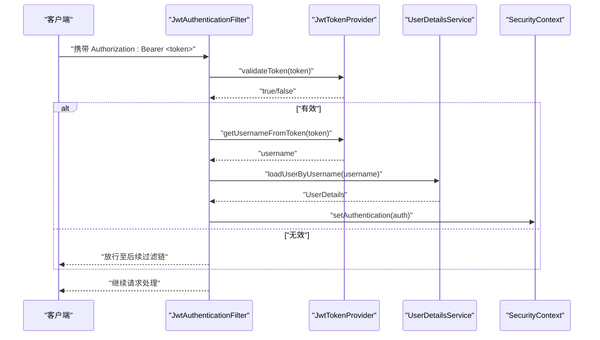
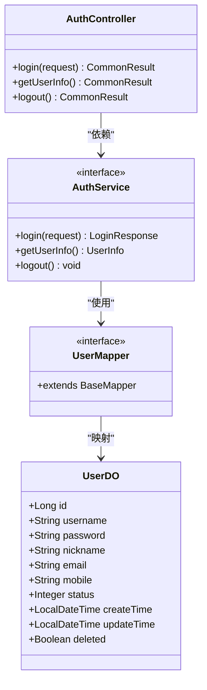
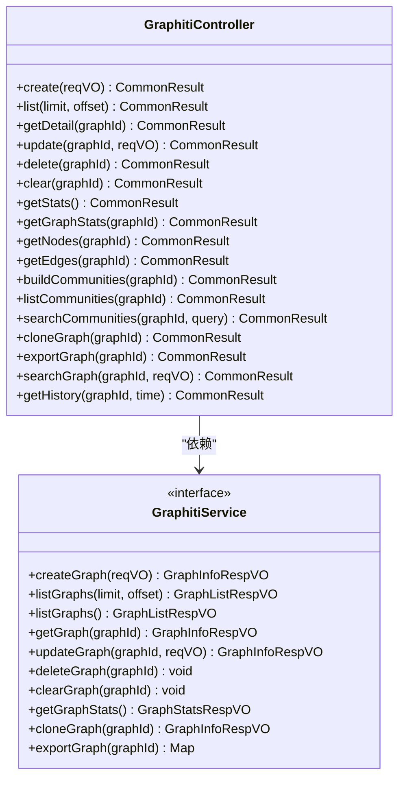
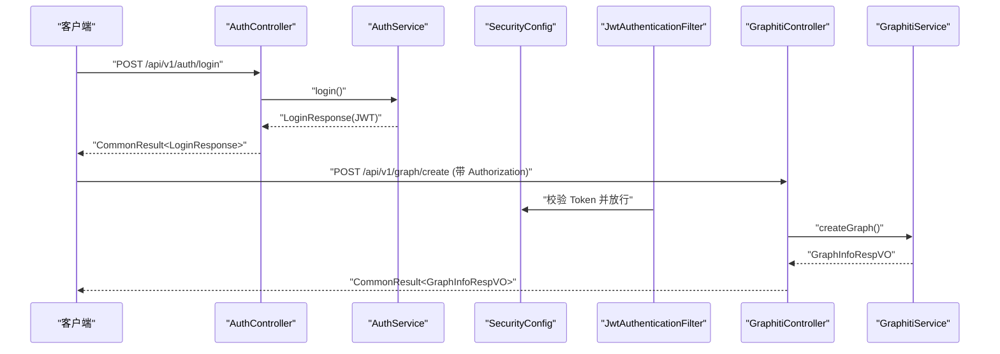
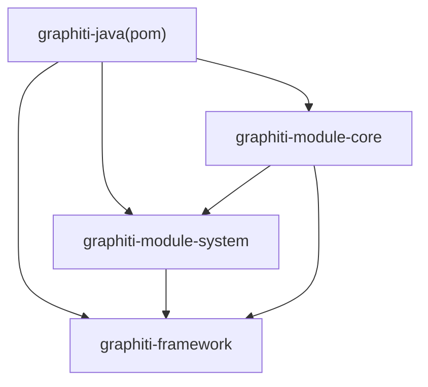

# 核心模块

<!--<cite>
**本文引用的文件**   
- [README.md](file://README.md)
- [DESIGN.md](file://DESIGN.md)
- [pom.xml](file://pom.xml)
- [graphiti-framework/pom.xml](file://graphiti-framework/pom.xml)
- [graphiti-module-system/pom.xml](file://graphiti-module-system/pom.xml)
- [graphiti-module-core/pom.xml](file://graphiti-module-core/pom.xml)
- [graphiti-framework/graphiti-common/src/main/java/com/Graphiti/common/response/CommonResult.java](file://graphiti-framework/graphiti-common/src/main/java/com/Graphiti/common/response/CommonResult.java)
- [graphiti-framework/graphiti-common/src/main/java/com/Graphiti/common/constants/ResultCode.java](file://graphiti-framework/graphiti-common/src/main/java/com/Graphiti/common/constants/ResultCode.java)
- [graphiti-framework/graphiti-common/src/main/java/com/Graphiti/common/exception/GlobalExceptionHandler.java](file://graphiti-framework/graphiti-common/src/main/java/com/Graphiti/common/exception/GlobalExceptionHandler.java)
- [graphiti-framework/graphiti-common/src/main/java/com/Graphiti/common/exception/BusinessException.java](file://graphiti-framework/graphiti-common/src/main/java/com/Graphiti/common/exception/BusinessException.java)
- [graphiti-framework/graphiti-spring-boot-starter-security/src/main/java/com/Graphiti/framework/security/config/SecurityConfig.java](file://graphiti-framework/graphiti-spring-boot-starter-security/src/main/java/com/Graphiti/framework/security/config/SecurityConfig.java)
- [graphiti-framework/graphiti-spring-boot-starter-security/src/main/java/com/Graphiti/framework/security/jwt/JwtAuthenticationFilter.java](file://graphiti-framework/graphiti-spring-boot-starter-security/src/main/java/com/Graphiti/framework/security/jwt/JwtAuthenticationFilter.java)
- [graphiti-module-system/src/main/java/com/Graphiti/system/controller/AuthController.java](file://graphiti-module-system/src/main/java/com/Graphiti/system/controller/AuthController.java)
- [graphiti-module-system/src/main/java/com/Graphiti/system/service/AuthService.java](file://graphiti-module-system/src/main/java/com/Graphiti/system/service/AuthService.java)
- [graphiti-module-system/src/main/java/com/Graphiti/system/dal/mysql/UserMapper.java](file://graphiti-module-system/src/main/java/com/Graphiti/system/dal/mysql/UserMapper.java)
- [graphiti-module-system/src/main/java/com/Graphiti/system/dal/dataobject/UserDO.java](file://graphiti-module-system/src/main/java/com/Graphiti/system/dal/dataobject/UserDO.java)
- [graphiti-module-core/src/main/java/com/Graphiti/module/graphiti/controller/admin/GraphitiController.java](file://graphiti-module-core/src/main/java/com/Graphiti/module/graphiti/controller/admin/GraphitiController.java)
- [graphiti-module-core/src/main/java/com/Graphiti/module/graphiti/service/GraphitiService.java](file://graphiti-module-core/src/main/java/com/Graphiti/module/graphiti/service/GraphitiService.java)
</cite>-->

## 目录
1. [简介](#简介)
2. [项目结构](#项目结构)
3. [核心组件](#核心组件)
4. [架构总览](#架构总览)
5. [详细组件分析](#详细组件分析)
6. [依赖关系分析](#依赖关系分析)
7. [性能考虑](#性能考虑)
8. [故障排查指南](#故障排查指南)
9. [结论](#结论)
10. [附录](#附录)

## 简介
本文件为 Graphiti-Java 核心模块的综合技术文档，聚焦三大模块：框架层（graphiti-framework）、系统管理模块（graphiti-module-system）、核心业务模块（graphiti-module-core）。文档从架构设计、模块职责、内部结构、组件协作、数据流、关键接口与配置、扩展点等方面进行系统化梳理，并提供面向开发者的定制与扩展指导。

## 项目结构
Graphiti-Java 采用多模块聚合结构，父 POM 负责版本与依赖管理，三大业务模块分别承担不同职责：
- graphiti-framework：提供通用基础设施（统一响应、异常处理、安全认证、MyBatis/Redis 启动器）
- graphiti-module-system：系统管理能力（用户、角色、菜单、日志、通知等），基于统一安全与数据访问层
- graphiti-module-core：核心业务能力（知识图谱管理、实体关系、AI 集成、搜索、数据质量等），依赖系统模块与框架层

图表来源
- [pom.xml:15-20](file://pom.xml#L15-L20)
- [graphiti-framework/pom.xml:22-27](file://graphiti-framework/pom.xml#L22-L27)
- [graphiti-module-system/pom.xml:16-31](file://graphiti-module-system/pom.xml#L16-L31)
- [graphiti-module-core/pom.xml:17-40](file://graphiti-module-core/pom.xml#L17-L40)

章节来源
- [pom.xml:15-20](file://pom.xml#L15-L20)
- [graphiti-framework/pom.xml:22-27](file://graphiti-framework/pom.xml#L22-L27)
- [graphiti-module-system/pom.xml:16-31](file://graphiti-module-system/pom.xml#L16-L31)
- [graphiti-module-core/pom.xml:17-40](file://graphiti-module-core/pom.xml#L17-L40)

## 核心组件
- 统一响应层：提供统一的响应包装与错误码体系，确保前后端交互一致性
- 安全认证：基于 JWT 的无状态认证，结合 Spring Security 过滤链与全局异常处理
- 数据访问框架：基于 MyBatis-Plus 的数据访问层，支持动态数据源与多表映射
- 缓存支持：基于 Redisson 的缓存能力，支撑高频查询与会话存储
- 系统管理：用户、角色、菜单、日志、通知等 RBAC 能力
- 核心业务：知识图谱生命周期、实体关系、AI 提取与嵌入、混合搜索、数据质量与本体校验

章节来源
- [graphiti-framework/graphiti-common/src/main/java/com/Graphiti/common/response/CommonResult.java:14-67](file://graphiti-framework/graphiti-common/src/main/java/com/Graphiti/common/response/CommonResult.java#L14-L67)
- [graphiti-framework/graphiti-common/src/main/java/com/Graphiti/common/constants/ResultCode.java:7-22](file://graphiti-framework/graphiti-common/src/main/java/com/Graphiti/common/constants/ResultCode.java#L7-L22)
- [graphiti-framework/graphiti-common/src/main/java/com/Graphiti/common/exception/GlobalExceptionHandler.java:17-73](file://graphiti-framework/graphiti-common/src/main/java/com/Graphiti/common/exception/GlobalExceptionHandler.java#L17-L73)
- [graphiti-framework/graphiti-spring-boot-starter-security/src/main/java/com/Graphiti/framework/security/config/SecurityConfig.java:32-137](file://graphiti-framework/graphiti-spring-boot-starter-security/src/main/java/com/Graphiti/framework/security/config/SecurityConfig.java#L32-L137)
- [graphiti-module-system/src/main/java/com/Graphiti/system/controller/AuthController.java:16-54](file://graphiti-module-system/src/main/java/com/Graphiti/system/controller/AuthController.java#L16-L54)

## 架构总览
下图展示模块间依赖与数据流向：系统模块依赖框架层的安全与数据访问能力；核心业务模块依赖系统模块与框架层；数据层由 Neo4j（图谱）与 PostgreSQL/MySQL（元数据）构成，Redis 作为缓存与会话存储。

图表来源
- [graphiti-module-system/src/main/java/com/Graphiti/system/controller/AuthController.java:16-54](file://graphiti-module-system/src/main/java/com/Graphiti/system/controller/AuthController.java#L16-L54)
- [graphiti-framework/graphiti-spring-boot-starter-security/src/main/java/com/Graphiti/framework/security/jwt/JwtAuthenticationFilter.java:26-60](file://graphiti-framework/graphiti-spring-boot-starter-security/src/main/java/com/Graphiti/framework/security/jwt/JwtAuthenticationFilter.java#L26-L60)
- [graphiti-module-core/src/main/java/com/Graphiti/module/graphiti/controller/admin/GraphitiController.java:37-234](file://graphiti-module-core/src/main/java/com/Graphiti/module/graphiti/controller/admin/GraphitiController.java#L37-L234)

章节来源
- [README.md:71-108](file://README.md#L71-L108)
- [graphiti-module-core/pom.xml:17-40](file://graphiti-module-core/pom.xml#L17-L40)

## 详细组件分析

### 统一响应与异常处理（graphiti-framework/graphiti-common）
- 统一响应封装：提供 success/error 两类静态工厂方法，自动注入时间戳与标准错误码
- 异常处理：全局捕获业务异常、参数校验异常与通用异常，统一输出 JSON 响应
- 错误码体系：定义通用 HTTP 语义错误码与业务错误码区间，便于前端统一处理

图表来源
- [graphiti-framework/graphiti-common/src/main/java/com/Graphiti/common/response/CommonResult.java:14-67](file://graphiti-framework/graphiti-common/src/main/java/com/Graphiti/common/response/CommonResult.java#L14-L67)
- [graphiti-framework/graphiti-common/src/main/java/com/Graphiti/common/exception/GlobalExceptionHandler.java:17-73](file://graphiti-framework/graphiti-common/src/main/java/com/Graphiti/common/exception/GlobalExceptionHandler.java#L17-L73)
- [graphiti-framework/graphiti-common/src/main/java/com/Graphiti/common/exception/BusinessException.java:10-32](file://graphiti-framework/graphiti-common/src/main/java/com/Graphiti/common/exception/BusinessException.java#L10-L32)
- [graphiti-framework/graphiti-common/src/main/java/com/Graphiti/common/constants/ResultCode.java:7-22](file://graphiti-framework/graphiti-common/src/main/java/com/Graphiti/common/constants/ResultCode.java#L7-L22)

章节来源
- [graphiti-framework/graphiti-common/src/main/java/com/Graphiti/common/response/CommonResult.java:14-67](file://graphiti-framework/graphiti-common/src/main/java/com/Graphiti/common/response/CommonResult.java#L14-L67)
- [graphiti-framework/graphiti-common/src/main/java/com/Graphiti/common/exception/GlobalExceptionHandler.java:17-73](file://graphiti-framework/graphiti-common/src/main/java/com/Graphiti/common/exception/GlobalExceptionHandler.java#L17-L73)
- [graphiti-framework/graphiti-common/src/main/java/com/Graphiti/common/constants/ResultCode.java:7-22](file://graphiti-framework/graphiti-common/src/main/java/com/Graphiti/common/constants/ResultCode.java#L7-L22)

### 安全认证与会话控制（graphiti-framework/graphiti-spring-boot-starter-security）
- JWT 认证过滤器：从 Authorization 请求头解析 Bearer Token，验证后写入 SecurityContext
- 安全配置：禁用 CSRF、无状态会话、CORS 放通、开放 Swagger/Actuator 端点
- 异常处理：未认证返回 401 JSON，权限不足返回 403 JSON

图表来源
- [graphiti-framework/graphiti-spring-boot-starter-security/src/main/java/com/Graphiti/framework/security/jwt/JwtAuthenticationFilter.java:26-60](file://graphiti-framework/graphiti-spring-boot-starter-security/src/main/java/com/Graphiti/framework/security/jwt/JwtAuthenticationFilter.java#L26-L60)
- [graphiti-framework/graphiti-spring-boot-starter-security/src/main/java/com/Graphiti/framework/security/config/SecurityConfig.java:84-136](file://graphiti-framework/graphiti-spring-boot-starter-security/src/main/java/com/Graphiti/framework/security/config/SecurityConfig.java#L84-L136)

章节来源
- [graphiti-framework/graphiti-spring-boot-starter-security/src/main/java/com/Graphiti/framework/security/config/SecurityConfig.java:32-137](file://graphiti-framework/graphiti-spring-boot-starter-security/src/main/java/com/Graphiti/framework/security/config/SecurityConfig.java#L32-L137)
- [graphiti-framework/graphiti-spring-boot-starter-security/src/main/java/com/Graphiti/framework/security/jwt/JwtAuthenticationFilter.java:19-60](file://graphiti-framework/graphiti-spring-boot-starter-security/src/main/java/com/Graphiti/framework/security/jwt/JwtAuthenticationFilter.java#L19-L60)

### 系统管理模块（graphiti-module-system）
- 认证控制器：提供登录、获取用户信息、退出登录接口
- 用户数据模型：UserDO 映射 sys_user 表，包含基础字段与软删标记
- 数据访问：UserMapper 基于 MyBatis-Plus，支持通用 CRUD
- 服务接口：AuthService 定义登录、获取用户信息、退出等契约

图表来源
- [graphiti-module-system/src/main/java/com/Graphiti/system/controller/AuthController.java:16-54](file://graphiti-module-system/src/main/java/com/Graphiti/system/controller/AuthController.java#L16-L54)
- [graphiti-module-system/src/main/java/com/Graphiti/system/service/AuthService.java:9-25](file://graphiti-module-system/src/main/java/com/Graphiti/system/service/AuthService.java#L9-L25)
- [graphiti-module-system/src/main/java/com/Graphiti/system/dal/dataobject/UserDO.java:12-37](file://graphiti-module-system/src/main/java/com/Graphiti/system/dal/dataobject/UserDO.java#L12-L37)
- [graphiti-module-system/src/main/java/com/Graphiti/system/dal/mysql/UserMapper.java:10-12](file://graphiti-module-system/src/main/java/com/Graphiti/system/dal/mysql/UserMapper.java#L10-L12)

章节来源
- [graphiti-module-system/src/main/java/com/Graphiti/system/controller/AuthController.java:16-54](file://graphiti-module-system/src/main/java/com/Graphiti/system/controller/AuthController.java#L16-L54)
- [graphiti-module-system/src/main/java/com/Graphiti/system/dal/dataobject/UserDO.java:12-37](file://graphiti-module-system/src/main/java/com/Graphiti/system/dal/dataobject/UserDO.java#L12-L37)
- [graphiti-module-system/src/main/java/com/Graphiti/system/dal/mysql/UserMapper.java:10-12](file://graphiti-module-system/src/main/java/com/Graphiti/system/dal/mysql/UserMapper.java#L10-L12)
- [graphiti-module-system/pom.xml:16-31](file://graphiti-module-system/pom.xml#L16-L31)

### 核心业务模块（graphiti-module-core）
- 图谱管理控制器：提供图谱 CRUD、统计、节点/边列表、社区构建与搜索、克隆与导出、历史状态查询等接口
- 服务接口：GraphitiService 定义图谱生命周期与统计相关能力
- 依赖关系：依赖系统模块（用户上下文）、框架层（统一响应、安全、数据访问、缓存）

图表来源
- [graphiti-module-core/src/main/java/com/Graphiti/module/graphiti/controller/admin/GraphitiController.java:37-234](file://graphiti-module-core/src/main/java/com/Graphiti/module/graphiti/controller/admin/GraphitiController.java#L37-L234)
- [graphiti-module-core/src/main/java/com/Graphiti/module/graphiti/service/GraphitiService.java:14-76](file://graphiti-module-core/src/main/java/com/Graphiti/module/graphiti/service/GraphitiService.java#L14-L76)

章节来源
- [graphiti-module-core/src/main/java/com/Graphiti/module/graphiti/controller/admin/GraphitiController.java:37-234](file://graphiti-module-core/src/main/java/com/Graphiti/module/graphiti/controller/admin/GraphitiController.java#L37-L234)
- [graphiti-module-core/src/main/java/com/Graphiti/module/graphiti/service/GraphitiService.java:14-76](file://graphiti-module-core/src/main/java/com/Graphiti/module/graphiti/service/GraphitiService.java#L14-L76)

### 关键流程：认证到业务调用

图表来源
- [graphiti-module-system/src/main/java/com/Graphiti/system/controller/AuthController.java:27-32](file://graphiti-module-system/src/main/java/com/Graphiti/system/controller/AuthController.java#L27-L32)
- [graphiti-framework/graphiti-spring-boot-starter-security/src/main/java/com/Graphiti/framework/security/config/SecurityConfig.java:115-136](file://graphiti-framework/graphiti-spring-boot-starter-security/src/main/java/com/Graphiti/framework/security/config/SecurityConfig.java#L115-L136)
- [graphiti-framework/graphiti-spring-boot-starter-security/src/main/java/com/Graphiti/framework/security/jwt/JwtAuthenticationFilter.java:44-59](file://graphiti-framework/graphiti-spring-boot-starter-security/src/main/java/com/Graphiti/framework/security/jwt/JwtAuthenticationFilter.java#L44-L59)
- [graphiti-module-core/src/main/java/com/Graphiti/module/graphiti/controller/admin/GraphitiController.java:54-58](file://graphiti-module-core/src/main/java/com/Graphiti/module/graphiti/controller/admin/GraphitiController.java#L54-L58)
- [graphiti-module-core/src/main/java/com/Graphiti/module/graphiti/service/GraphitiService.java](file://graphiti-module-core/src/main/java/com/Graphiti/module/graphiti/service/GraphitiService.java#L20)

章节来源
- [graphiti-module-system/src/main/java/com/Graphiti/system/controller/AuthController.java:27-32](file://graphiti-module-system/src/main/java/com/Graphiti/system/controller/AuthController.java#L27-L32)
- [graphiti-framework/graphiti-spring-boot-starter-security/src/main/java/com/Graphiti/framework/security/config/SecurityConfig.java:115-136](file://graphiti-framework/graphiti-spring-boot-starter-security/src/main/java/com/Graphiti/framework/security/config/SecurityConfig.java#L115-L136)
- [graphiti-framework/graphiti-spring-boot-starter-security/src/main/java/com/Graphiti/framework/security/jwt/JwtAuthenticationFilter.java:44-59](file://graphiti-framework/graphiti-spring-boot-starter-security/src/main/java/com/Graphiti/framework/security/jwt/JwtAuthenticationFilter.java#L44-L59)
- [graphiti-module-core/src/main/java/com/Graphiti/module/graphiti/controller/admin/GraphitiController.java:54-58](file://graphiti-module-core/src/main/java/com/Graphiti/module/graphiti/controller/admin/GraphitiController.java#L54-L58)

## 依赖关系分析
- 模块依赖：核心模块依赖系统模块与框架层；系统模块依赖框架层安全与数据访问；父 POM 统一管理版本与依赖范围
- 外部依赖：Neo4j Java Driver、MyBatis-Plus、Spring AI、Redisson、Jena/RDF4J 等

图表来源
- [pom.xml:15-20](file://pom.xml#L15-L20)
- [graphiti-framework/pom.xml:22-27](file://graphiti-framework/pom.xml#L22-L27)
- [graphiti-module-system/pom.xml:16-31](file://graphiti-module-system/pom.xml#L16-L31)
- [graphiti-module-core/pom.xml:17-40](file://graphiti-module-core/pom.xml#L17-L40)

章节来源
- [pom.xml:15-20](file://pom.xml#L15-L20)
- [graphiti-framework/pom.xml:22-27](file://graphiti-framework/pom.xml#L22-L27)
- [graphiti-module-system/pom.xml:16-31](file://graphiti-module-system/pom.xml#L16-L31)
- [graphiti-module-core/pom.xml:17-40](file://graphiti-module-core/pom.xml#L17-L40)

## 性能考虑
- 无状态认证：JWT 无状态设计降低会话存储压力，适合水平扩展
- 缓存策略：Redis 缓存热点数据与会话，减少数据库与图库压力
- 搜索融合：混合搜索结合 BM25、向量相似与 BFS，建议合理配置权重与重排策略
- 批量导入：利用批量写入与事务合并，降低网络往返与锁竞争
- 索引优化：Neo4j 向量索引与属性索引需与查询模式匹配

## 故障排查指南
- 统一错误响应：确认返回体包含 code/message/timestamp，便于前端与监控系统识别
- 参数校验异常：检查 DTO 字段注解与绑定结果，定位缺失参数或格式问题
- 权限异常：确认请求头是否携带有效 Bearer Token，路径是否在放行白名单
- 业务异常：捕获 BusinessException 并核对业务错误码，定位具体业务分支

章节来源
- [graphiti-framework/graphiti-common/src/main/java/com/Graphiti/common/exception/GlobalExceptionHandler.java:26-72](file://graphiti-framework/graphiti-common/src/main/java/com/Graphiti/common/exception/GlobalExceptionHandler.java#L26-L72)
- [graphiti-framework/graphiti-common/src/main/java/com/Graphiti/common/exception/BusinessException.java:10-32](file://graphiti-framework/graphiti-common/src/main/java/com/Graphiti/common/exception/BusinessException.java#L10-L32)
- [graphiti-framework/graphiti-common/src/main/java/com/Graphiti/common/constants/ResultCode.java:7-22](file://graphiti-framework/graphiti-common/src/main/java/com/Graphiti/common/constants/ResultCode.java#L7-L22)

## 结论
Graphiti-Java 以清晰的模块划分与统一的基础设施，实现了从认证授权、数据访问到核心业务的完整闭环。系统模块提供稳定的 RBAC 能力，核心模块聚焦知识图谱与 AI 驱动的数据治理，框架层保障了可维护性与可扩展性。建议在生产环境中结合缓存与索引策略，持续优化搜索与导入性能，并通过统一响应与异常处理提升可观测性与用户体验。

## 附录
- 快速开始与配置参考见项目根 README
- 设计风格与组件规范参考 DESIGN 文档

章节来源
- [README.md:221-312](file://README.md#L221-L312)
- [DESIGN.md:258-549](file://DESIGN.md#L258-L549)