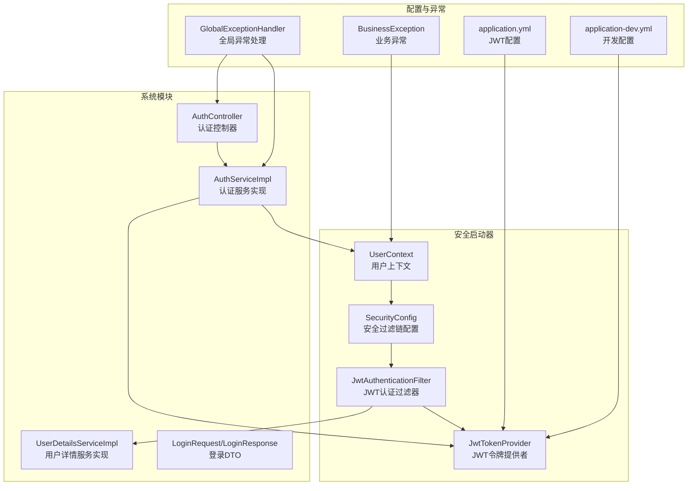
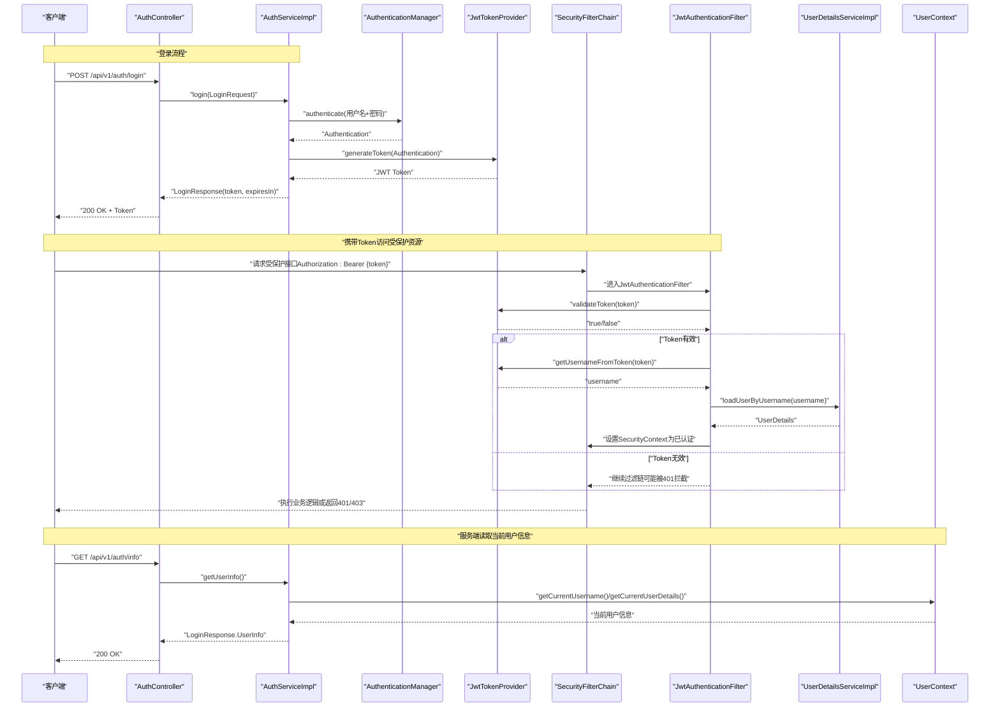
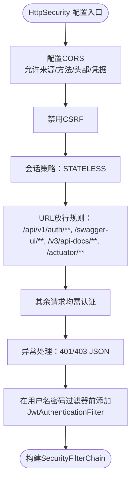
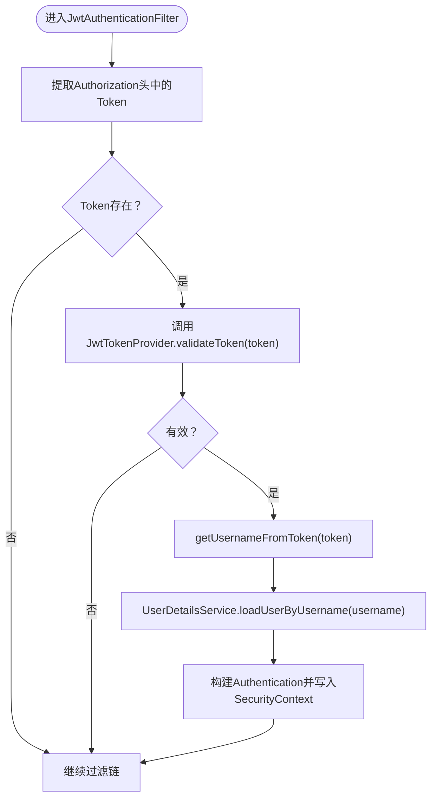
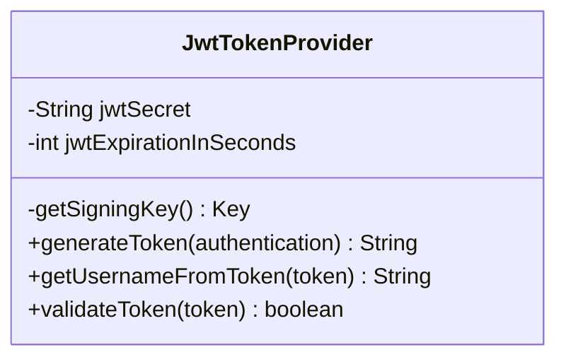
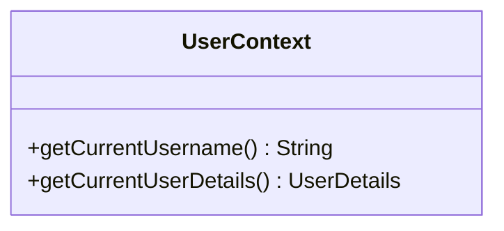
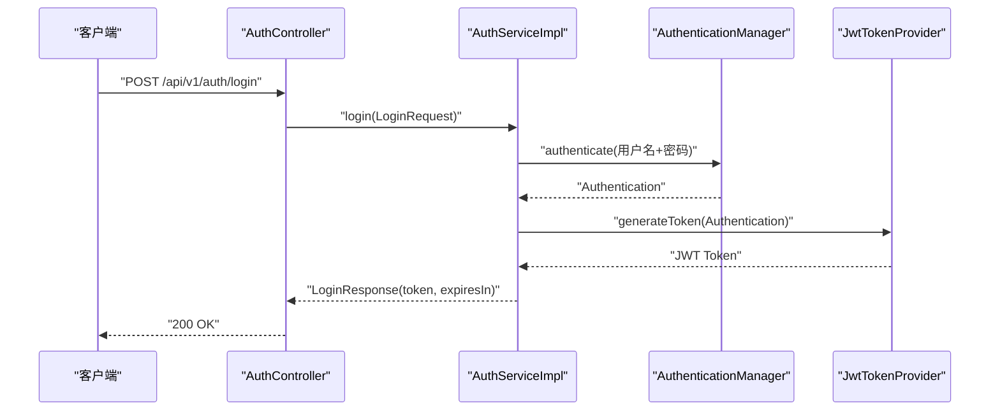
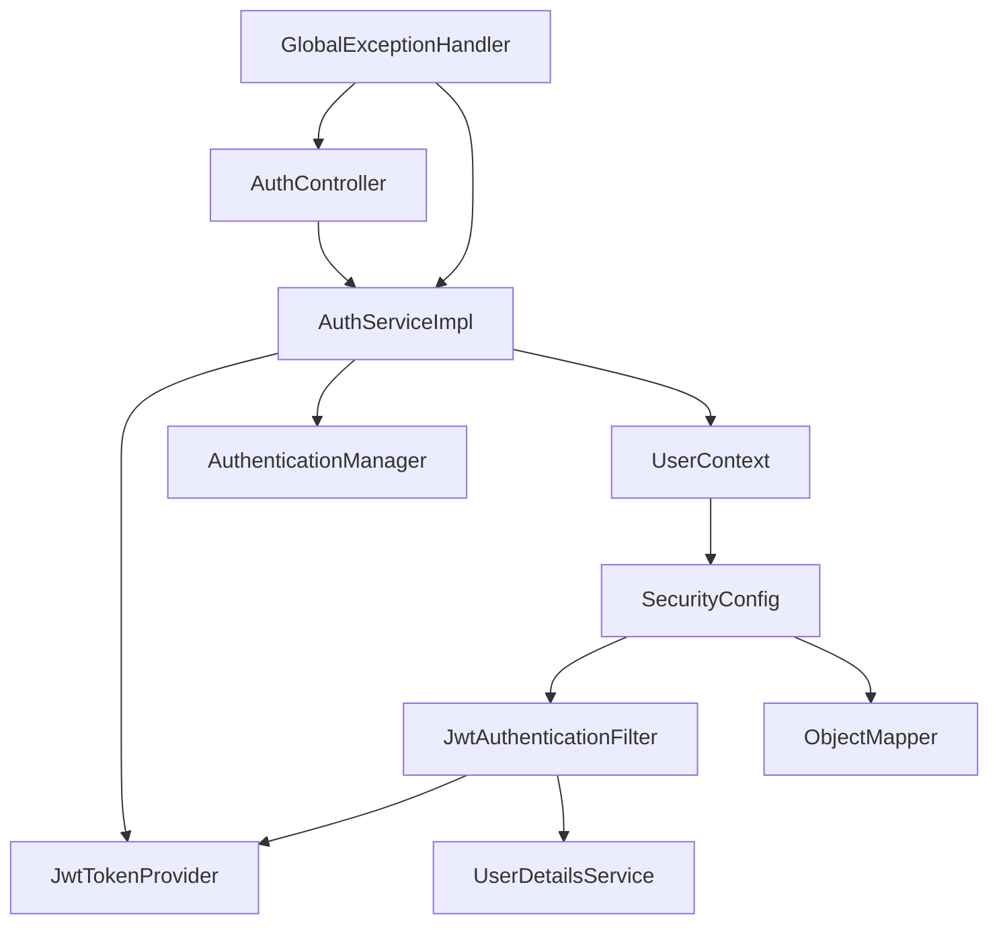
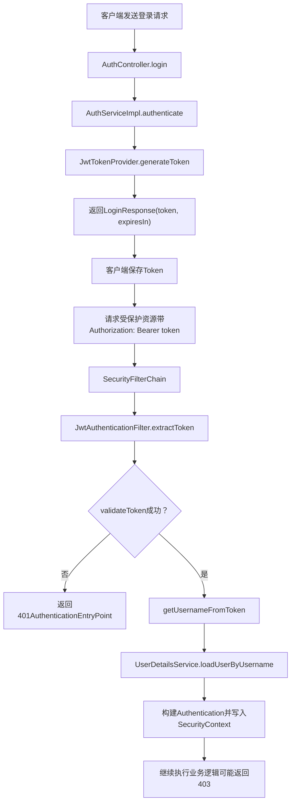

# 安全认证框架

<!--<cite>
**本文引用的文件列表**
- [SecurityConfig.java](file://ontograph-framework/graphiti-spring-boot-starter-security/src/main/java/com/graphiti/framework/security/config/SecurityConfig.java)
- [JwtAuthenticationFilter.java](file://ontograph-framework/graphiti-spring-boot-starter-security/src/main/java/com/graphiti/framework/security/jwt/JwtAuthenticationFilter.java)
- [JwtTokenProvider.java](file://ontograph-framework/graphiti-spring-boot-starter-security/src/main/java/com/graphiti/framework/security/jwt/JwtTokenProvider.java)
- [UserContext.java](file://ontograph-framework/graphiti-spring-boot-starter-security/src/main/java/com/graphiti/framework/security/util/UserContext.java)
- [AuthController.java](file://ontograph-module-system/src/main/java/com/graphiti/system/controller/AuthController.java)
- [AuthServiceImpl.java](file://ontograph-module-system/src/main/java/com/graphiti/system/service/impl/AuthServiceImpl.java)
- [UserDetailsServiceImpl.java](file://ontograph-module-system/src/main/java/com/graphiti/system/service/UserDetailsServiceImpl.java)
- [LoginRequest.java](file://ontograph-module-system/src/main/java/com/graphiti/system/dto/LoginRequest.java)
- [LoginResponse.java](file://ontograph-module-system/src/main/java/com/graphiti/system/dto/LoginResponse.java)
- [application.yml](file://ontograph-server/src/main/resources/application.yml)
- [application-dev.yml](file://ontograph-server/src/main/resources/application-dev.yml)
- [GlobalExceptionHandler.java](file://ontograph-framework/graphiti-common/src/main/java/com/graphiti/common/exception/GlobalExceptionHandler.java)
- [BusinessException.java](file://ontograph-framework/graphiti-common/src/main/java/com/graphiti/common/exception/BusinessException.java)
</cite>-->

## 目录
1. [简介](#简介)
2. [项目结构](#项目结构)
3. [核心组件](#核心组件)
4. [架构总览](#架构总览)
5. [详细组件分析](#详细组件分析)
6. [依赖关系分析](#依赖关系分析)
7. [性能考量](#性能考量)
8. [故障排查指南](#故障排查指南)
9. [结论](#结论)
10. [附录](#附录)

## 简介
本文件面向安全认证框架的使用者与维护者，系统性梳理并深入解读以下关键模块：
- SecurityConfig 安全配置类：如何配置 CORS、CSRF、会话策略、URL 权限放行与异常处理。
- JwtAuthenticationFilter JWT 认证过滤器：如何从请求头提取 Token、验证有效性、构建认证上下文。
- JwtTokenProvider 令牌提供者：如何生成、解析与验证 JWT；以及配置项对令牌生命周期的影响。
- UserContext 用户上下文：如何在无状态的 JWT 场景下安全地获取当前用户信息。
- 完整认证流程：登录、携带 Token 访问受保护资源、权限控制与异常处理。
- 最佳实践与常见漏洞防护：基于现有实现的安全建议与加固方向。

## 项目结构
安全相关代码集中在“graphiti-spring-boot-starter-security”模块，认证控制器与服务位于“ontograph-module-system”模块，全局异常处理位于“graphiti-common”。

图表来源
- [SecurityConfig.java:115-136](file://ontograph-framework/graphiti-spring-boot-starter-security/src/main/java/com/graphiti/framework/security/config/SecurityConfig.java#L115-L136)
- [JwtAuthenticationFilter.java:26-59](file://ontograph-framework/graphiti-spring-boot-starter-security/src/main/java/com/graphiti/framework/security/jwt/JwtAuthenticationFilter.java#L26-L59)
- [JwtTokenProvider.java:19-86](file://ontograph-framework/graphiti-spring-boot-starter-security/src/main/java/com/graphiti/framework/security/jwt/JwtTokenProvider.java#L19-L86)
- [UserContext.java:13-49](file://ontograph-framework/graphiti-spring-boot-starter-security/src/main/java/com/graphiti/framework/security/util/UserContext.java#L13-L49)
- [AuthController.java:20-54](file://ontograph-module-system/src/main/java/com/graphiti/system/controller/AuthController.java#L20-L54)
- [AuthServiceImpl.java:21-66](file://ontograph-module-system/src/main/java/com/graphiti/system/service/impl/AuthServiceImpl.java#L21-L66)
- [UserDetailsServiceImpl.java:21-42](file://ontograph-module-system/src/main/java/com/graphiti/system/service/UserDetailsServiceImpl.java#L21-L42)
- [application.yml:25-30](file://ontograph-server/src/main/resources/application.yml#L25-L30)
- [application-dev.yml:488-502](file://ontograph-server/src/main/resources/application-dev.yml#L488-L502)
- [GlobalExceptionHandler.java:17-73](file://ontograph-framework/graphiti-common/src/main/java/com/graphiti/common/exception/GlobalExceptionHandler.java#L17-L73)
- [BusinessException.java:10-32](file://ontograph-framework/graphiti-common/src/main/java/com/graphiti/common/exception/BusinessException.java#L10-L32)

章节来源
- [SecurityConfig.java:115-136](file://ontograph-framework/graphiti-spring-boot-starter-security/src/main/java/com/graphiti/framework/security/config/SecurityConfig.java#L115-L136)
- [application.yml:25-30](file://ontograph-server/src/main/resources/application.yml#L25-L30)
- [application-dev.yml:488-502](file://ontograph-server/src/main/resources/application-dev.yml#L488-L502)

## 核心组件
本节聚焦四个核心组件的职责、配置项与交互关系。

- SecurityConfig：负责注册密码编码器、认证管理器、CORS、CSRF 关闭、无状态会话策略、URL 放行规则、异常处理器，并将 JwtAuthenticationFilter 注入到过滤链中。
- JwtAuthenticationFilter：从 Authorization 请求头提取 Bearer Token，调用 JwtTokenProvider 验证并解析用户名，再通过 UserDetailsService 加载用户详情，构建 Authentication 并写入 SecurityContext。
- JwtTokenProvider：基于配置的密钥与过期时间，生成、解析与验证 JWT；提供从 Token 获取用户名的能力。
- UserContext：从 SecurityContextHolder 获取当前认证对象，封装获取用户名与 UserDetails 的便捷方法，并在未认证时抛出业务异常。

章节来源
- [SecurityConfig.java:37-136](file://ontograph-framework/graphiti-spring-boot-starter-security/src/main/java/com/graphiti/framework/security/config/SecurityConfig.java#L37-L136)
- [JwtAuthenticationFilter.java:26-59](file://ontograph-framework/graphiti-spring-boot-starter-security/src/main/java/com/graphiti/framework/security/jwt/JwtAuthenticationFilter.java#L26-L59)
- [JwtTokenProvider.java:19-86](file://ontograph-framework/graphiti-spring-boot-starter-security/src/main/java/com/graphiti/framework/security/jwt/JwtTokenProvider.java#L19-L86)
- [UserContext.java:13-49](file://ontograph-framework/graphiti-spring-boot-starter-security/src/main/java/com/graphiti/framework/security/util/UserContext.java#L13-L49)

## 架构总览
下图展示从客户端发起请求到完成认证与授权的整体流程，涵盖登录、携带 Token 访问受保护资源、权限控制与异常处理。

图表来源
- [AuthController.java:27-42](file://ontograph-module-system/src/main/java/com/graphiti/system/controller/AuthController.java#L27-L42)
- [AuthServiceImpl.java:27-65](file://ontograph-module-system/src/main/java/com/graphiti/system/service/impl/AuthServiceImpl.java#L27-L65)
- [JwtAuthenticationFilter.java:44-59](file://ontograph-framework/graphiti-spring-boot-starter-security/src/main/java/com/graphiti/framework/security/jwt/JwtAuthenticationFilter.java#L44-L59)
- [JwtTokenProvider.java:40-85](file://ontograph-framework/graphiti-spring-boot-starter-security/src/main/java/com/graphiti/framework/security/jwt/JwtTokenProvider.java#L40-L85)
- [UserDetailsServiceImpl.java:24-41](file://ontograph-module-system/src/main/java/com/graphiti/system/service/UserDetailsServiceImpl.java#L24-L41)
- [UserContext.java:19-48](file://ontograph-framework/graphiti-spring-boot-starter-security/src/main/java/com/graphiti/framework/security/util/UserContext.java#L19-L48)

## 详细组件分析

### SecurityConfig 安全配置类
- 密码编码器：使用 BCryptPasswordEncoder，确保密码安全存储。
- 认证管理器：通过 AuthenticationConfiguration 注入，用于用户名密码认证。
- CORS：允许任意来源、方法与头部，允许凭据，缓存 1 小时。
- CSRF：禁用（无状态 JWT 场景通常无需 CSRF 保护）。
- Session：无状态（STATELESS），避免服务器端会话开销。
- URL 放行：/api/v1/auth/**、Swagger 文档路径、/actuator/** 公开访问。
- 异常处理：未认证返回 401 JSON，权限不足返回 403 JSON。
- 过滤链：在 UsernamePasswordAuthenticationFilter 前插入 JwtAuthenticationFilter。

图表来源
- [SecurityConfig.java:115-136](file://ontograph-framework/graphiti-spring-boot-starter-security/src/main/java/com/graphiti/framework/security/config/SecurityConfig.java#L115-L136)

章节来源
- [SecurityConfig.java:37-136](file://ontograph-framework/graphiti-spring-boot-starter-security/src/main/java/com/graphiti/framework/security/config/SecurityConfig.java#L37-L136)

### JwtAuthenticationFilter JWT 认证过滤器
- 请求头解析：从 Authorization 头提取 Bearer Token。
- 验证与解析：调用 JwtTokenProvider.validateToken(token) 与 getUsernameFromToken(token)。
- 用户加载：通过 UserDetailsService.loadUserByUsername(username) 获取 UserDetails。
- 认证上下文：构造 UsernamePasswordAuthenticationToken，设置 Details 与 Authorities，写入 SecurityContextHolder。
- 过滤链继续：无论是否认证成功，都继续执行后续过滤链。

图表来源
- [JwtAuthenticationFilter.java:36-59](file://ontograph-framework/graphiti-spring-boot-starter-security/src/main/java/com/graphiti/framework/security/jwt/JwtAuthenticationFilter.java#L36-L59)
- [JwtTokenProvider.java:74-85](file://ontograph-framework/graphiti-spring-boot-starter-security/src/main/java/com/graphiti/framework/security/jwt/JwtTokenProvider.java#L74-L85)
- [UserDetailsServiceImpl.java:24-41](file://ontograph-module-system/src/main/java/com/graphiti/system/service/UserDetailsServiceImpl.java#L24-L41)

章节来源
- [JwtAuthenticationFilter.java:26-59](file://ontograph-framework/graphiti-spring-boot-starter-security/src/main/java/com/graphiti/framework/security/jwt/JwtAuthenticationFilter.java#L26-L59)

### JwtTokenProvider 令牌提供者
- 配置项：
  - graphiti.security.jwt.secret：JWT 签名密钥（需至少 512 位）。
  - graphiti.security.jwt.expiration：过期时间（秒，默认 86400，即 24 小时）。
- 生成：基于 Authentication 的 Principal（UserDetails）提取用户名，结合当前时间与过期时间生成 JWT。
- 解析：从 Token 中提取 Subject（用户名）。
- 验证：使用相同密钥验证签名，捕获 JwtException/IllegalArgumentException 并记录错误。

图表来源
- [JwtTokenProvider.java:19-86](file://ontograph-framework/graphiti-spring-boot-starter-security/src/main/java/com/graphiti/framework/security/jwt/JwtTokenProvider.java#L19-L86)
- [application.yml:25-30](file://ontograph-server/src/main/resources/application.yml#L25-L30)
- [application-dev.yml:488-502](file://ontograph-server/src/main/resources/application-dev.yml#L488-L502)

章节来源
- [JwtTokenProvider.java:19-86](file://ontograph-framework/graphiti-spring-boot-starter-security/src/main/java/com/graphiti/framework/security/jwt/JwtTokenProvider.java#L19-L86)
- [application.yml:25-30](file://ontograph-server/src/main/resources/application.yml#L25-L30)
- [application-dev.yml:488-502](file://ontograph-server/src/main/resources/application-dev.yml#L488-L502)

### UserContext 用户上下文
- getCurrentUsername：从 SecurityContextHolder 获取 Authentication，若未认证则抛出业务异常；否则返回用户名。
- getCurrentUserDetails：同上，返回 UserDetails。
- 设计要点：在无状态 JWT 场景下，通过线程绑定的 SecurityContext 读取当前用户，避免跨线程丢失。

图表来源
- [UserContext.java:13-49](file://ontograph-framework/graphiti-spring-boot-starter-security/src/main/java/com/graphiti/framework/security/util/UserContext.java#L13-L49)

章节来源
- [UserContext.java:13-49](file://ontograph-framework/graphiti-spring-boot-starter-security/src/main/java/com/graphiti/framework/security/util/UserContext.java#L13-L49)

### 认证控制器与服务
- AuthController：提供 /api/v1/auth/login、/api/v1/auth/info、/api/v1/auth/logout 接口。
- AuthServiceImpl：
  - login：调用 AuthenticationManager 进行用户名密码认证，随后使用 JwtTokenProvider 生成 Token。
  - getUserInfo：从 SecurityContextHolder 获取当前认证信息并封装为响应。
  - logout：清空 SecurityContextHolder（JWT 无状态，客户端需删除 Token）。
- UserDetailsServiceImpl：演示从数据库查询用户信息（当前示例为硬编码用户）。

图表来源
- [AuthController.java:27-32](file://ontograph-module-system/src/main/java/com/graphiti/system/controller/AuthController.java#L27-L32)
- [AuthServiceImpl.java:27-44](file://ontograph-module-system/src/main/java/com/graphiti/system/service/impl/AuthServiceImpl.java#L27-L44)
- [JwtTokenProvider.java:40-53](file://ontograph-framework/graphiti-spring-boot-starter-security/src/main/java/com/graphiti/framework/security/jwt/JwtTokenProvider.java#L40-L53)

章节来源
- [AuthController.java:20-54](file://ontograph-module-system/src/main/java/com/graphiti/system/controller/AuthController.java#L20-L54)
- [AuthServiceImpl.java:21-66](file://ontograph-module-system/src/main/java/com/graphiti/system/service/impl/AuthServiceImpl.java#L21-L66)
- [UserDetailsServiceImpl.java:21-42](file://ontograph-module-system/src/main/java/com/graphiti/system/service/UserDetailsServiceImpl.java#L21-L42)

## 依赖关系分析
- SecurityConfig 依赖 JwtAuthenticationFilter、ObjectMapper。
- JwtAuthenticationFilter 依赖 JwtTokenProvider、UserDetailsService。
- JwtTokenProvider 依赖 Spring 配置（@Value）、JWT 库。
- UserContext 依赖 SecurityContextHolder、BusinessException。
- AuthController 依赖 AuthService、CommonResult。
- AuthServiceImpl 依赖 AuthenticationManager、JwtTokenProvider、SecurityContextHolder。
- UserDetailsServiceImpl 实现 UserDetailsService，返回 UserDetails。
- GlobalExceptionHandler 统一处理 BusinessException、参数校验异常与通用异常。

图表来源
- [SecurityConfig.java:37-38](file://ontograph-framework/graphiti-spring-boot-starter-security/src/main/java/com/graphiti/framework/security/config/SecurityConfig.java#L37-L38)
- [JwtAuthenticationFilter.java:28-29](file://ontograph-framework/graphiti-spring-boot-starter-security/src/main/java/com/graphiti/framework/security/jwt/JwtAuthenticationFilter.java#L28-L29)
- [AuthServiceImpl.java:23-24](file://ontograph-module-system/src/main/java/com/graphiti/system/service/impl/AuthServiceImpl.java#L23-L24)
- [UserContext.java:20-22](file://ontograph-framework/graphiti-spring-boot-starter-security/src/main/java/com/graphiti/framework/security/util/UserContext.java#L20-L22)
- [GlobalExceptionHandler.java:26-30](file://ontograph-framework/graphiti-common/src/main/java/com/graphiti/common/exception/GlobalExceptionHandler.java#L26-L30)

章节来源
- [SecurityConfig.java:37-136](file://ontograph-framework/graphiti-spring-boot-starter-security/src/main/java/com/graphiti/framework/security/config/SecurityConfig.java#L37-L136)
- [JwtAuthenticationFilter.java:26-59](file://ontograph-framework/graphiti-spring-boot-starter-security/src/main/java/com/graphiti/framework/security/jwt/JwtAuthenticationFilter.java#L26-L59)
- [AuthServiceImpl.java:21-66](file://ontograph-module-system/src/main/java/com/graphiti/system/service/impl/AuthServiceImpl.java#L21-L66)
- [GlobalExceptionHandler.java:17-73](file://ontograph-framework/graphiti-common/src/main/java/com/graphiti/common/exception/GlobalExceptionHandler.java#L17-L73)

## 性能考量
- 无状态会话：STATELESS 减少服务器端会话存储与序列化开销，适合水平扩展。
- 过滤链顺序：将 JwtAuthenticationFilter 放在用户名密码过滤器之前，避免重复认证。
- Token 验证：validateToken 使用签名验证，复杂度低；建议在高并发场景下确保密钥长度足够（配置项要求至少 512 位）。
- 用户详情加载：UserDetailsService 应尽量快速返回，必要时引入缓存或异步加载。
- CORS 缓存：MaxAge 设置为 1 小时，减少浏览器预检请求次数。

[本节为通用指导，不直接分析具体文件]

## 故障排查指南
- 401 未认证：
  - 检查请求头 Authorization 是否为 Bearer Token。
  - 确认 graphiti.security.jwt.secret 与生成时一致。
  - 核对 graphiti.security.jwt.expiration 是否过短导致频繁失效。
- 403 权限不足：
  - 检查用户权限（UserDetails 的 Authorities）是否正确。
  - 确认 URL 放行规则与业务接口权限配置。
- 业务异常（401）：
  - UserContext 在未认证时抛出 BusinessException，检查 SecurityContext 是否被正确设置。
- 全局异常处理：
  - BusinessException 由 GlobalExceptionHandler 统一转为 CommonResult.error(code, message)。
  - 参数校验异常与缺失参数异常也会被统一处理。

章节来源
- [SecurityConfig.java:84-113](file://ontograph-framework/graphiti-spring-boot-starter-security/src/main/java/com/graphiti/framework/security/config/SecurityConfig.java#L84-L113)
- [UserContext.java:19-32](file://ontograph-framework/graphiti-spring-boot-starter-security/src/main/java/com/graphiti/framework/security/util/UserContext.java#L19-L32)
- [GlobalExceptionHandler.java:26-60](file://ontograph-framework/graphiti-common/src/main/java/com/graphiti/common/exception/GlobalExceptionHandler.java#L26-L60)
- [BusinessException.java:10-32](file://ontograph-framework/graphiti-common/src/main/java/com/graphiti/common/exception/BusinessException.java#L10-L32)

## 结论
该安全认证框架采用无状态 JWT 与 Spring Security 过滤链相结合的方式，实现了登录认证、Token 验证、用户上下文读取与权限控制。通过合理的配置项与异常处理机制，既保证了易用性，也兼顾了安全性与可维护性。建议在生产环境中进一步强化密钥管理、引入 Token 刷新策略与黑名单机制，并完善审计与监控。

[本节为总结性内容，不直接分析具体文件]

## 附录

### JWT 认证工作流程图（代码级映射）

图表来源
- [AuthController.java:27-32](file://ontograph-module-system/src/main/java/com/graphiti/system/controller/AuthController.java#L27-L32)
- [AuthServiceImpl.java:27-44](file://ontograph-module-system/src/main/java/com/graphiti/system/service/impl/AuthServiceImpl.java#L27-L44)
- [JwtTokenProvider.java:40-85](file://ontograph-framework/graphiti-spring-boot-starter-security/src/main/java/com/graphiti/framework/security/jwt/JwtTokenProvider.java#L40-L85)
- [JwtAuthenticationFilter.java:36-59](file://ontograph-framework/graphiti-spring-boot-starter-security/src/main/java/com/graphiti/framework/security/jwt/JwtAuthenticationFilter.java#L36-L59)
- [SecurityConfig.java:84-113](file://ontograph-framework/graphiti-spring-boot-starter-security/src/main/java/com/graphiti/framework/security/config/SecurityConfig.java#L84-L113)

### 配置项清单与建议
- graphiti.security.jwt.secret：必须至少 512 位，定期轮换，严格保密。
- graphiti.security.jwt.expiration：建议根据业务场景调整，注意与前端刷新策略匹配。
- CORS：生产环境建议限制来源与方法，避免通配符。
- CSRF：无状态 JWT 场景通常禁用，如启用需配合 CSRF Token 策略。
- 会话策略：保持 STATELESS，避免服务器端会话。

章节来源
- [application.yml:25-30](file://ontograph-server/src/main/resources/application.yml#L25-L30)
- [application-dev.yml:488-502](file://ontograph-server/src/main/resources/application-dev.yml#L488-L502)
- [SecurityConfig.java:117-120](file://ontograph-framework/graphiti-spring-boot-starter-security/src/main/java/com/graphiti/framework/security/config/SecurityConfig.java#L117-L120)