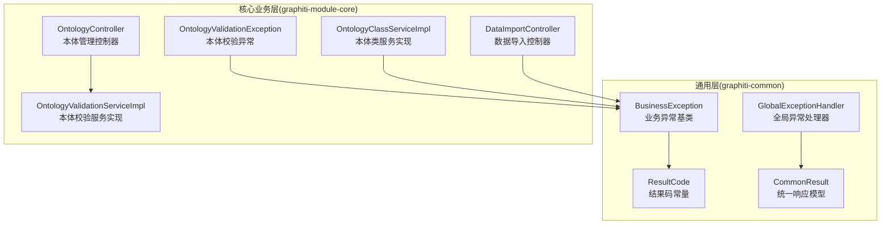
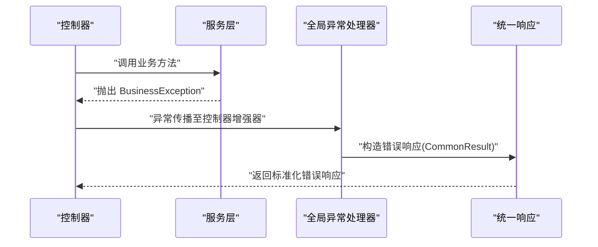
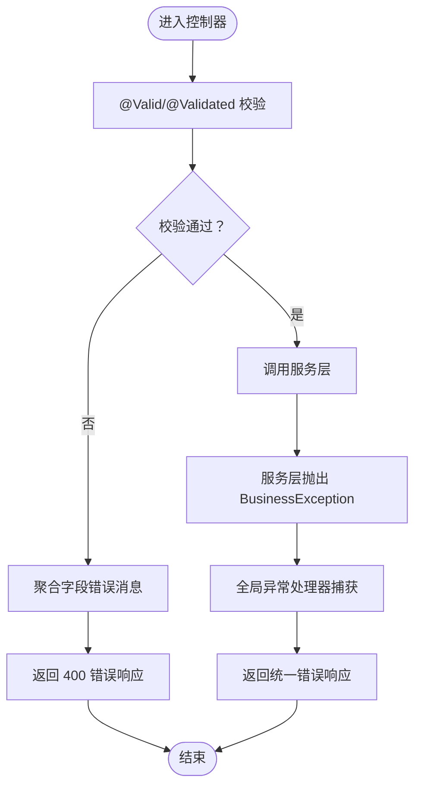
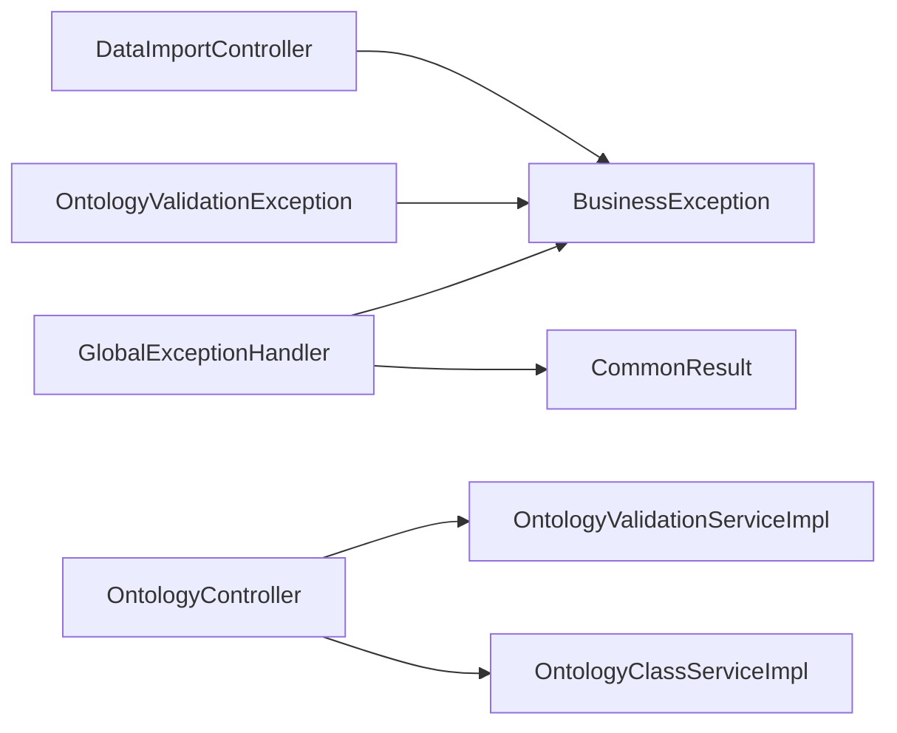

# 异常处理机制

<cite>
**本文引用的文件**
- [GlobalExceptionHandler.java](file://graphiti-framework/graphiti-common/src/main/java/com/graphiti/common/exception/GlobalExceptionHandler.java)
- [BusinessException.java](file://graphiti-framework/graphiti-common/src/main/java/com/graphiti/common/exception/BusinessException.java)
- [ResultCode.java](file://graphiti-framework/graphiti-common/src/main/java/com/graphiti/common/constants/ResultCode.java)
- [CommonResult.java](file://graphiti-framework/graphiti-common/src/main/java/com/graphiti/common/response/CommonResult.java)
- [OntologyValidationException.java](file://graphiti-module-core/src/main/java/com/graphiti/module/graphiti/exception/OntologyValidationException.java)
- [DataImportController.java](file://graphiti-module-core/src/main/java/com/graphiti/module/graphiti/controller/admin/DataImportController.java)
- [OntologyController.java](file://graphiti-module-core/src/main/java/com/graphiti/module/graphiti/controller/admin/OntologyController.java)
- [OntologyClassServiceImpl.java](file://graphiti-module-core/src/main/java/com/graphiti/module/graphiti/service/impl/OntologyClassServiceImpl.java)
- [OntologyValidationServiceImpl.java](file://graphiti-module-core/src/main/java/com/graphiti/module/graphiti/service/impl/OntologyValidationServiceImpl.java)
- [AuthController.java](file://graphiti-module-system/src/main/java/com/graphiti/system/controller/AuthController.java)
</cite>

## 目录
1. [简介](#简介)
2. [项目结构](#项目结构)
3. [核心组件](#核心组件)
4. [架构总览](#架构总览)
5. [详细组件分析](#详细组件分析)
6. [依赖分析](#依赖分析)
7. [性能考量](#性能考量)
8. [故障排查指南](#故障排查指南)
9. [结论](#结论)
10. [附录](#附录)

## 简介
本文件系统化梳理 Graphiti Java 后端的异常处理机制，重点覆盖以下方面：
- 全局异常处理器的工作原理与捕获策略
- 业务异常 BusinessException 的设计模式与使用场景
- 参数验证异常、业务规则异常、系统内部异常的分类与处理流程
- 异常处理最佳实践：安全性、日志策略、用户友好提示
- 实际代码示例路径：服务层抛出异常、控制器层统一捕获与返回

## 项目结构
异常处理相关代码主要分布在两个模块：
- graphiti-common：通用异常与响应模型
- graphiti-module-core：业务异常扩展与具体业务使用

图表来源
- [GlobalExceptionHandler.java:17-72](file://graphiti-framework/graphiti-common/src/main/java/com/graphiti/common/exception/GlobalExceptionHandler.java#L17-L72)
- [BusinessException.java:10-31](file://graphiti-framework/graphiti-common/src/main/java/com/graphiti/common/exception/BusinessException.java#L10-L31)
- [ResultCode.java:7-22](file://graphiti-framework/graphiti-common/src/main/java/com/graphiti/common/constants/ResultCode.java#L7-L22)
- [CommonResult.java:14-66](file://graphiti-framework/graphiti-common/src/main/java/com/graphiti/common/response/CommonResult.java#L14-L66)
- [OntologyValidationException.java:8-29](file://graphiti-module-core/src/main/java/com/graphiti/module/graphiti/exception/OntologyValidationException.java#L8-L29)
- [OntologyController.java:24-231](file://graphiti-module-core/src/main/java/com/graphiti/module/graphiti/controller/admin/OntologyController.java#L24-L231)
- [OntologyClassServiceImpl.java:34-169](file://graphiti-module-core/src/main/java/com/graphiti/module/graphiti/service/impl/OntologyClassServiceImpl.java#L34-L169)
- [OntologyValidationServiceImpl.java:26-158](file://graphiti-module-core/src/main/java/com/graphiti/module/graphiti/service/impl/OntologyValidationServiceImpl.java#L26-L158)
- [DataImportController.java:27-111](file://graphiti-module-core/src/main/java/com/graphiti/module/graphiti/controller/admin/DataImportController.java#L27-L111)

章节来源
- [GlobalExceptionHandler.java:17-72](file://graphiti-framework/graphiti-common/src/main/java/com/graphiti/common/exception/GlobalExceptionHandler.java#L17-L72)
- [BusinessException.java:10-31](file://graphiti-framework/graphiti-common/src/main/java/com/graphiti/common/exception/BusinessException.java#L10-L31)
- [ResultCode.java:7-22](file://graphiti-framework/graphiti-common/src/main/java/com/graphiti/common/constants/ResultCode.java#L7-L22)
- [CommonResult.java:14-66](file://graphiti-framework/graphiti-common/src/main/java/com/graphiti/common/response/CommonResult.java#L14-L66)
- [OntologyValidationException.java:8-29](file://graphiti-module-core/src/main/java/com/graphiti/module/graphiti/exception/OntologyValidationException.java#L8-L29)
- [OntologyController.java:24-231](file://graphiti-module-core/src/main/java/com/graphiti/module/graphiti/controller/admin/OntologyController.java#L24-L231)
- [OntologyClassServiceImpl.java:34-169](file://graphiti-module-core/src/main/java/com/graphiti/module/graphiti/service/impl/OntologyClassServiceImpl.java#L34-L169)
- [OntologyValidationServiceImpl.java:26-158](file://graphiti-module-core/src/main/java/com/graphiti/module/graphiti/service/impl/OntologyValidationServiceImpl.java#L26-L158)
- [DataImportController.java:27-111](file://graphiti-module-core/src/main/java/com/graphiti/module/graphiti/controller/admin/DataImportController.java#L27-L111)

## 核心组件
- 全局异常处理器：统一拦截控制器抛出的各类异常，封装为统一响应模型
- 业务异常基类：提供可携带业务错误码的运行时异常
- 结果码常量：定义标准错误码区间与业务错误码
- 统一响应模型：标准化返回结构，包含 code、message、data、timestamp
- 业务异常扩展：针对特定领域（如本体校验）的异常类型

章节来源
- [GlobalExceptionHandler.java:26-72](file://graphiti-framework/graphiti-common/src/main/java/com/graphiti/common/exception/GlobalExceptionHandler.java#L26-L72)
- [BusinessException.java:10-31](file://graphiti-framework/graphiti-common/src/main/java/com/graphiti/common/exception/BusinessException.java#L10-L31)
- [ResultCode.java:7-22](file://graphiti-framework/graphiti-common/src/main/java/com/graphiti/common/constants/ResultCode.java#L7-L22)
- [CommonResult.java:14-66](file://graphiti-framework/graphiti-common/src/main/java/com/graphiti/common/response/CommonResult.java#L14-L66)
- [OntologyValidationException.java:8-29](file://graphiti-module-core/src/main/java/com/graphiti/module/graphiti/exception/OntologyValidationException.java#L8-L29)

## 架构总览
全局异常处理器通过 Spring MVC 的 @ExceptionHandler 机制，拦截来自控制器的异常并统一转换为 CommonResult 响应。业务异常通过错误码与消息驱动前端提示与国际化。

图表来源
- [GlobalExceptionHandler.java:26-30](file://graphiti-framework/graphiti-common/src/main/java/com/graphiti/common/exception/GlobalExceptionHandler.java#L26-L30)
- [BusinessException.java:10-31](file://graphiti-framework/graphiti-common/src/main/java/com/graphiti/common/exception/BusinessException.java#L10-L31)
- [CommonResult.java:61-66](file://graphiti-framework/graphiti-common/src/main/java/com/graphiti/common/response/CommonResult.java#L61-L66)

## 详细组件分析

### 全局异常处理器（GlobalExceptionHandler）
- 捕获范围
  - 业务异常：BusinessException 及其子类
  - 参数校验异常：@Valid 触发的字段校验失败
  - 缺少请求参数：缺失必需参数
  - 其他未知异常：兜底处理系统内部错误
- 处理策略
  - 业务异常：记录错误码与消息，返回统一错误响应
  - 参数校验异常：聚合字段级错误，返回 400
  - 缺少请求参数：记录参数名，返回 400
  - 未知异常：记录堆栈，返回 500
- 日志策略
  - 业务异常：记录 code 与 message
  - 缺少请求参数：记录参数名
  - 未知异常：记录异常堆栈

章节来源
- [GlobalExceptionHandler.java:26-72](file://graphiti-framework/graphiti-common/src/main/java/com/graphiti/common/exception/GlobalExceptionHandler.java#L26-L72)

### 业务异常基类（BusinessException）
- 设计要点
  - 继承 RuntimeException，便于在业务层自由抛出
  - 携带业务错误码与消息，便于前端识别与提示
  - 提供默认构造器，兼容系统内部错误场景
- 使用场景
  - 业务规则不满足
  - 资源不存在
  - 参数非法
  - 权限不足等

章节来源
- [BusinessException.java:10-31](file://graphiti-framework/graphiti-common/src/main/java/com/graphiti/common/exception/BusinessException.java#L10-L31)
- [ResultCode.java:7-22](file://graphiti-framework/graphiti-common/src/main/java/com/graphiti/common/constants/ResultCode.java#L7-L22)

### 业务异常扩展（OntologyValidationException）
- 场景定位
  - 本体校验失败，携带详细的校验结果对象
  - 将多条错误摘要为有限长度的消息，避免过长提示
- 与全局异常处理器协作
  - 作为 BusinessException 子类，被统一捕获并返回

章节来源
- [OntologyValidationException.java:8-29](file://graphiti-module-core/src/main/java/com/graphiti/module/graphiti/exception/OntologyValidationException.java#L8-L29)
- [GlobalExceptionHandler.java:26-30](file://graphiti-framework/graphiti-common/src/main/java/com/graphiti/common/exception/GlobalExceptionHandler.java#L26-L30)

### 统一响应模型（CommonResult）
- 字段
  - code：错误码
  - message：错误信息
  - data：泛型数据
  - timestamp：ISO 时间戳
- 方法
  - success(data)/success()：成功响应
  - error(code, message)：错误响应

章节来源
- [CommonResult.java:14-66](file://graphiti-framework/graphiti-common/src/main/java/com/graphiti/common/response/CommonResult.java#L14-L66)

### 参数校验与缺失参数处理
- 参数校验异常
  - 触发条件：@Valid/@Validated 验证失败
  - 处理方式：聚合字段错误，返回 400
- 缺少请求参数
  - 触发条件：@RequestParam 缺失必需参数
  - 处理方式：记录参数名，返回 400

章节来源
- [GlobalExceptionHandler.java:37-60](file://graphiti-framework/graphiti-common/src/main/java/com/graphiti/common/exception/GlobalExceptionHandler.java#L37-L60)

### 控制器与服务层协作示例

#### 示例一：服务层抛出业务异常（本体类管理）
- 位置
  - 服务实现：抛出 BusinessException
  - 控制器：接收并返回统一响应
- 关键点
  - 服务层根据业务规则判断并抛出带语义化错误码的异常
  - 控制器无需感知异常细节，直接返回统一响应

章节来源
- [OntologyClassServiceImpl.java:74-76](file://graphiti-module-core/src/main/java/com/graphiti/module/graphiti/service/impl/OntologyClassServiceImpl.java#L74-L76)
- [OntologyClassServiceImpl.java:106-108](file://graphiti-module-core/src/main/java/com/graphiti/module/graphiti/service/impl/OntologyClassServiceImpl.java#L106-L108)
- [OntologyClassServiceImpl.java:135-136](file://graphiti-module-core/src/main/java/com/graphiti/module/graphiti/service/impl/OntologyClassServiceImpl.java#L135-L136)
- [OntologyClassServiceImpl.java:155-163](file://graphiti-module-core/src/main/java/com/graphiti/module/graphiti/service/impl/OntologyClassServiceImpl.java#L155-L163)
- [GlobalExceptionHandler.java:26-30](file://graphiti-framework/graphiti-common/src/main/java/com/graphiti/common/exception/GlobalExceptionHandler.java#L26-L30)

#### 示例二：服务层抛出业务异常（数据导入）
- 位置
  - 控制器：直接抛出 BusinessException
  - 全局异常处理器：捕获并返回统一响应
- 关键点
  - 控制器层也可直接抛出业务异常，实现“就近处理”

章节来源
- [DataImportController.java:108-110](file://graphiti-module-core/src/main/java/com/graphiti/module/graphiti/controller/admin/DataImportController.java#L108-L110)
- [GlobalExceptionHandler.java:26-30](file://graphiti-framework/graphiti-common/src/main/java/com/graphiti/common/exception/GlobalExceptionHandler.java#L26-L30)

#### 示例三：服务层抛出业务异常（本体校验异常）
- 位置
  - 服务实现：在本体校验失败时抛出 OntologyValidationException
  - 控制器：接收并返回统一响应
- 关键点
  - 本体校验异常携带详细校验结果，便于前端展示

章节来源
- [OntologyValidationServiceImpl.java:132-158](file://graphiti-module-core/src/main/java/com/graphiti/module/graphiti/service/impl/OntologyValidationServiceImpl.java#L132-L158)
- [OntologyValidationException.java:8-29](file://graphiti-module-core/src/main/java/com/graphiti/module/graphiti/exception/OntologyValidationException.java#L8-L29)
- [GlobalExceptionHandler.java:26-30](file://graphiti-framework/graphiti-common/src/main/java/com/graphiti/common/exception/GlobalExceptionHandler.java#L26-L30)

#### 示例四：参数校验异常（控制器）
- 位置
  - 控制器：使用 @Valid/@Validated 对请求体进行校验
  - 全局异常处理器：捕获 MethodArgumentNotValidException 并聚合字段错误
- 关键点
  - 字段级错误会被收集并返回给前端

章节来源
- [DataImportController.java:35-37](file://graphiti-module-core/src/main/java/com/graphiti/module/graphiti/controller/admin/DataImportController.java#L35-L37)
- [GlobalExceptionHandler.java:37-45](file://graphiti-framework/graphiti-common/src/main/java/com/graphiti/common/exception/GlobalExceptionHandler.java#L37-L45)

#### 示例五：缺少请求参数（控制器）
- 位置
  - 控制器：使用 @RequestParam 标注必需参数
  - 全局异常处理器：捕获 MissingServletRequestParameterException 并返回 400
- 关键点
  - 记录缺失参数名，便于前端定位问题

章节来源
- [DataImportController.java:68-71](file://graphiti-module-core/src/main/java/com/graphiti/module/graphiti/controller/admin/DataImportController.java#L68-L71)
- [GlobalExceptionHandler.java:52-60](file://graphiti-framework/graphiti-common/src/main/java/com/graphiti/common/exception/GlobalExceptionHandler.java#L52-L60)

### 异常处理流程图（参数校验）

图表来源
- [GlobalExceptionHandler.java:37-60](file://graphiti-framework/graphiti-common/src/main/java/com/graphiti/common/exception/GlobalExceptionHandler.java#L37-L60)
- [BusinessException.java:10-31](file://graphiti-framework/graphiti-common/src/main/java/com/graphiti/common/exception/BusinessException.java#L10-L31)

## 依赖分析
- 全局异常处理器依赖
  - BusinessException：用于捕获业务异常
  - CommonResult：用于构造统一响应
  - Spring Web：用于处理参数校验与请求参数异常
- 业务异常扩展
  - 继承 BusinessException，复用错误码与消息传递机制
- 控制器与服务层
  - 控制器负责触发异常；服务层负责抛出异常；全局异常处理器负责捕获与统一返回

图表来源
- [GlobalExceptionHandler.java:26-72](file://graphiti-framework/graphiti-common/src/main/java/com/graphiti/common/exception/GlobalExceptionHandler.java#L26-L72)
- [BusinessException.java:10-31](file://graphiti-framework/graphiti-common/src/main/java/com/graphiti/common/exception/BusinessException.java#L10-L31)
- [CommonResult.java:61-66](file://graphiti-framework/graphiti-common/src/main/java/com/graphiti/common/response/CommonResult.java#L61-L66)
- [OntologyValidationException.java:8-29](file://graphiti-module-core/src/main/java/com/graphiti/module/graphiti/exception/OntologyValidationException.java#L8-L29)
- [OntologyController.java:24-231](file://graphiti-module-core/src/main/java/com/graphiti/module/graphiti/controller/admin/OntologyController.java#L24-L231)
- [OntologyClassServiceImpl.java:34-169](file://graphiti-module-core/src/main/java/com/graphiti/module/graphiti/service/impl/OntologyClassServiceImpl.java#L34-L169)
- [OntologyValidationServiceImpl.java:26-158](file://graphiti-module-core/src/main/java/com/graphiti/module/graphiti/service/impl/OntologyValidationServiceImpl.java#L26-L158)
- [DataImportController.java:27-111](file://graphiti-module-core/src/main/java/com/graphiti/module/graphiti/controller/admin/DataImportController.java#L27-L111)

## 性能考量
- 异常捕获与序列化开销：全局异常处理器仅在异常发生时触发，正常路径不产生额外开销
- 日志记录：建议在生产环境控制日志级别，避免敏感信息泄露
- 响应大小：统一响应模型包含时间戳，通常影响较小；避免在错误消息中携带大对象

## 故障排查指南
- 业务异常未被捕获
  - 检查是否为 RuntimeException 或其子类
  - 确认控制器或服务层是否正确抛出
- 参数校验异常未返回字段级错误
  - 确认控制器方法上是否使用了 @Valid/@Validated
  - 确认请求体/参数是否符合 JSR-303 校验注解
- 缺少请求参数导致 500
  - 确认是否使用 @RequestParam(required=true) 标注必需参数
  - 确认客户端是否传入了必需参数
- 统一响应未返回
  - 检查全局异常处理器是否生效（@RestControllerAdvice）
  - 检查是否存在更具体的异常处理器覆盖

章节来源
- [GlobalExceptionHandler.java:26-72](file://graphiti-framework/graphiti-common/src/main/java/com/graphiti/common/exception/GlobalExceptionHandler.java#L26-L72)
- [DataImportController.java:35-37](file://graphiti-module-core/src/main/java/com/graphiti/module/graphiti/controller/admin/DataImportController.java#L35-L37)
- [DataImportController.java:68-71](file://graphiti-module-core/src/main/java/com/graphiti/module/graphiti/controller/admin/DataImportController.java#L68-L71)

## 结论
本项目的异常处理机制通过“业务异常 + 全局异常处理器 + 统一响应模型”的组合，实现了：
- 明确的异常分类与处理策略
- 标准化的错误返回格式
- 与 Spring MVC 参数校验的无缝集成
- 可扩展的业务异常类型（如本体校验异常）

建议在后续迭代中持续完善：
- 在日志中增加 traceId，便于链路追踪
- 对敏感信息进行脱敏处理
- 为常见业务错误提供国际化文案映射

## 附录

### 异常分类与处理一览
- 业务异常（BusinessException）
  - 触发：服务层/控制器层抛出
  - 处理：记录 code/message，返回统一错误响应
- 参数校验异常（MethodArgumentNotValidException）
  - 触发：@Valid/@Validated 校验失败
  - 处理：聚合字段错误，返回 400
- 缺少请求参数（MissingServletRequestParameterException）
  - 触发：@RequestParam 缺失必需参数
  - 处理：记录参数名，返回 400
- 其他未知异常（Exception）
  - 触发：未捕获的系统异常
  - 处理：记录堆栈，返回 500

章节来源
- [GlobalExceptionHandler.java:26-72](file://graphiti-framework/graphiti-common/src/main/java/com/graphiti/common/exception/GlobalExceptionHandler.java#L26-L72)
- [BusinessException.java:10-31](file://graphiti-framework/graphiti-common/src/main/java/com/graphiti/common/exception/BusinessException.java#L10-L31)
- [ResultCode.java:7-22](file://graphiti-framework/graphiti-common/src/main/java/com/graphiti/common/constants/ResultCode.java#L7-L22)
- [CommonResult.java:61-66](file://graphiti-framework/graphiti-common/src/main/java/com/graphiti/common/response/CommonResult.java#L61-L66)