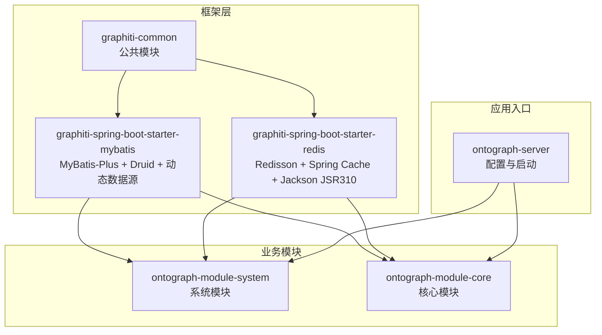
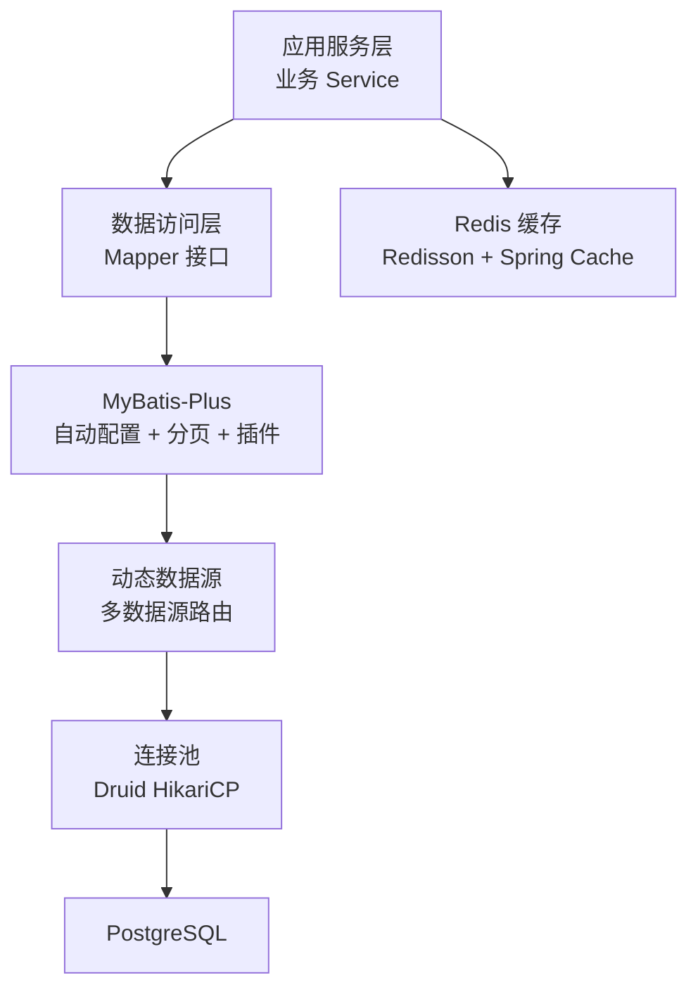
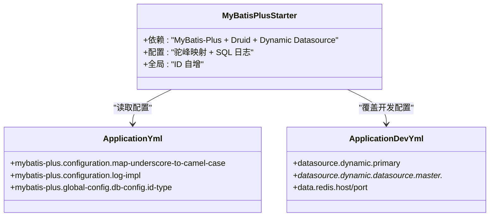
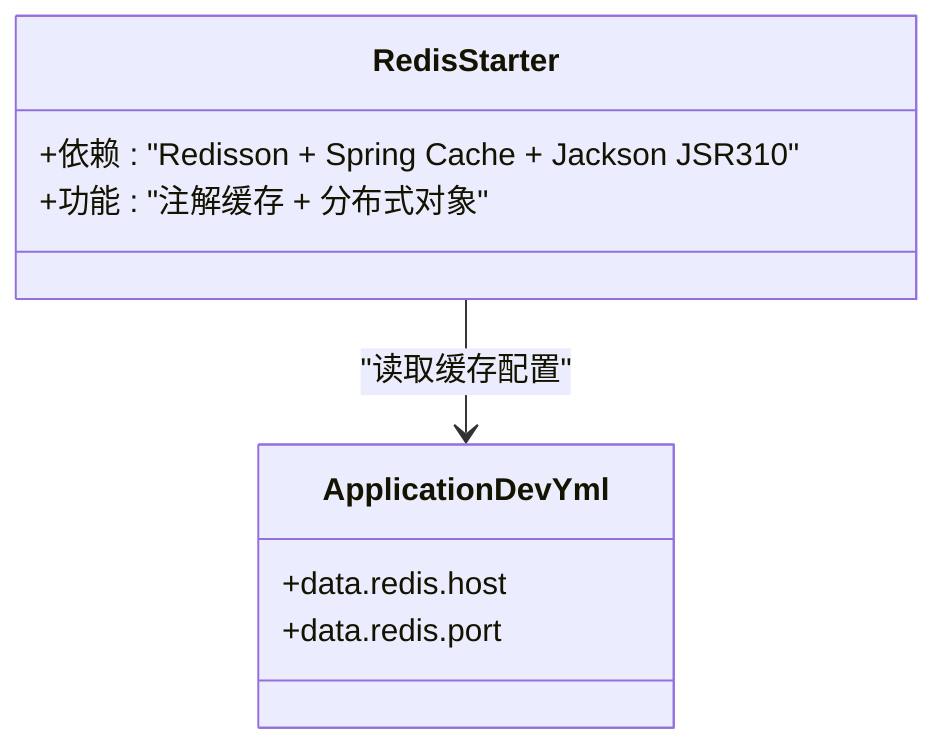
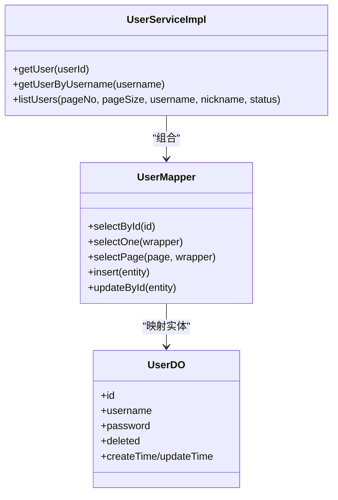
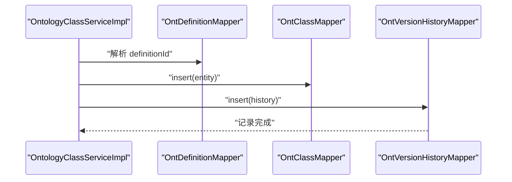
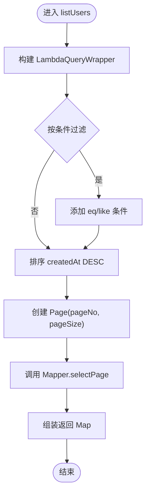
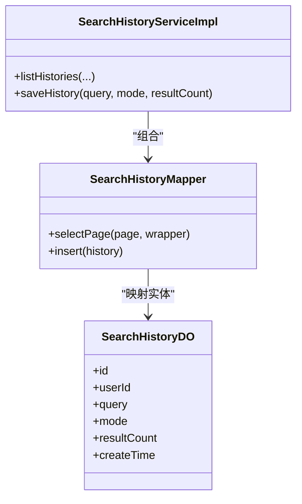
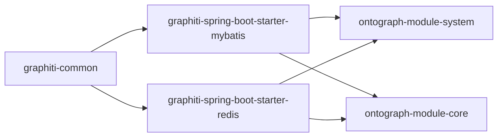

# 数据访问框架

<!--<cite>
**本文档引用的文件**
- [graphiti-spring-boot-starter-mybatis/pom.xml](file://ontograph-framework/graphiti-spring-boot-starter-mybatis/pom.xml)
- [graphiti-spring-boot-starter-redis/pom.xml](file://ontograph-framework/graphiti-spring-boot-starter-redis/pom.xml)
- [graphiti-common/pom.xml](file://ontograph-framework/graphiti-common/pom.xml)
- [application.yml](file://ontograph-server/src/main/resources/application.yml)
- [application-dev.yml](file://ontograph-server/src/main/resources/application-dev.yml)
- [UserMapper.java](file://ontograph-module-system/src/main/java/com/raphiti/system/dal/mysql/UserMapper.java)
- [SystemConfigMapper.java](file://ontograph-module-system/src/main/java/com/raphiti/system/dal/mysql/SystemConfigMapper.java)
- [GraphMetadataMapper.java](file://ontograph-module-core/src/main/java/com/raphiti/module/graphiti/dal/mysql/GraphMetadataMapper.java)
- [UserDO.java](file://ontograph-module-system/src/main/java/com/raphiti/system/dal/dataobject/UserDO.java)
- [OntClassDO.java](file://ontograph-module-core/src/main/java/com/raphiti/module/graphiti/dal/dataobject/ont/OntClassDO.java)
- [OntClassMapper.java](file://docs/superpowers/plans/2026-05-10-ontology-phase1-schema-enforcement.md)
- [OntPropertyMapper.java](file://docs/superpowers/plans/2026-05-10-ontology-phase1-schema-enforcement.md)
- [OntConstraintMapper.java](file://docs/superpowers/plans/2026-05-10-ontology-phase1-schema-enforcement.md)
- [OntVersionHistoryMapper.java](file://docs/superpowers/plans/2026-05-10-ontology-phase1-schema-enforcement.md)
- [UserServiceImpl.java](file://ontograph-module-system/src/main/java/com/raphiti/system/service/impl/UserServiceImpl.java)
- [OntologyClassServiceImpl.java](file://docs/superpowers/plans/2026-05-10-ontology-phase2-4-remaining.md)
- [OntologyPropertyServiceImpl.java](file://docs/superpowers/plans/2026-05-10-ontology-phase2-4-remaining.md)
- [SearchHistoryMapper.java](file://ontograph-module-system/src/main/java/com/raphiti/system/dal/mysql/SearchHistoryMapper.java)
- [SearchHistoryDO.java](file://ontograph-module-system/src/main/java/com/raphiti/system/dal/dataobject/SearchHistoryDO.java)
</cite>-->

## 目录
1. [简介](#简介)
2. [项目结构](#项目结构)
3. [核心组件](#核心组件)
4. [架构总览](#架构总览)
5. [详细组件分析](#详细组件分析)
6. [依赖分析](#依赖分析)
7. [性能考虑](#性能考虑)
8. [故障排查指南](#故障排查指南)
9. [结论](#结论)
10. [附录](#附录)

## 简介
本文件系统性梳理 OntoGraph 项目的“数据访问框架”，重点覆盖以下方面：
- MyBatis 启动器的配置与使用：MyBatis-Plus 集成、自动配置、分页插件、性能分析器等
- Redis 启动器的配置与使用：连接池配置、序列化策略、缓存注解使用
- 数据访问层设计模式与最佳实践：Mapper 接口定义、XML 映射文件编写、动态 SQL 构建
- 性能优化策略：批量操作、懒加载、缓存策略
- 实战示例：在业务层中如何结合 MyBatis 与 Redis 进行数据操作

## 项目结构
该项目采用多模块结构，数据访问相关的关键模块如下：
- ontograph-framework：框架层，包含通用模块与各启动器
  - graphiti-common：公共模块（响应、异常、校验等）
  - graphiti-spring-boot-starter-mybatis：MyBatis-Plus 与 Druid、动态数据源集成
  - graphiti-spring-boot-starter-redis：Redisson、Spring Cache、Jackson JSR310
- ontograph-module-system：系统模块（用户、菜单、日志、配置、搜索历史等）
- ontograph-module-core：核心业务模块（图谱、本体、提示词等）
- ontograph-server：应用入口与配置（application.yml、application-dev.yml）

**图表来源**
- [graphiti-common/pom.xml:16-38](file://ontograph-framework/graphiti-common/pom.xml#L16-L38)
- [graphiti-spring-boot-starter-mybatis/pom.xml:19-48](file://ontograph-framework/graphiti-spring-boot-starter-mybatis/pom.xml#L19-L48)
- [graphiti-spring-boot-starter-redis/pom.xml:19-36](file://ontograph-framework/graphiti-spring-boot-starter-redis/pom.xml#L19-L36)

**章节来源**
- [graphiti-common/pom.xml:16-38](file://ontograph-framework/graphiti-common/pom.xml#L16-L38)
- [graphiti-spring-boot-starter-mybatis/pom.xml:19-48](file://ontograph-framework/graphiti-spring-boot-starter-mybatis/pom.xml#L19-L48)
- [graphiti-spring-boot-starter-redis/pom.xml:19-36](file://ontograph-framework/graphiti-spring-boot-starter-redis/pom.xml#L19-L36)

## 核心组件
- MyBatis-Plus 启动器
  - 依赖：MyBatis-Plus Spring Boot 3 Starter、Druid Spring Boot 3 Starter、Dynamic Datasource Spring Boot 3 Starter、PostgreSQL 驱动
  - 自动配置：基于 Starter 的约定优于配置，无需额外 XML 配置即可启用
  - 分页插件：通过 Page 对象自动注入分页参数
  - 性能分析：StdOutImpl 输出 SQL 日志，便于开发调试
- Redis 启动器
  - 依赖：Redisson Spring Boot Starter、Spring Boot Cache、Jackson JSR310
  - 缓存注解：可直接使用 @Cacheable/@CacheEvict/@CachePut 等
  - 序列化：Jackson JSR310 适配时间类型序列化
- 数据访问层
  - Mapper 接口：继承 BaseMapper<T>，自动获得 CRUD 能力
  - 数据对象：使用 MyBatis-Plus 注解映射表字段
  - 业务服务：组合 Mapper，封装查询条件、分页、事务与缓存

**章节来源**
- [graphiti-spring-boot-starter-mybatis/pom.xml:19-48](file://ontograph-framework/graphiti-spring-boot-starter-mybatis/pom.xml#L19-L48)
- [graphiti-spring-boot-starter-redis/pom.xml:19-36](file://ontograph-framework/graphiti-spring-boot-starter-redis/pom.xml#L19-L36)
- [application.yml:11-19](file://ontograph-server/src/main/resources/application.yml#L11-L19)
- [UserMapper.java:1-12](file://ontograph-module-system/src/main/java/com/raphiti/system/dal/mysql/UserMapper.java#L1-L12)
- [UserDO.java:1-38](file://ontograph-module-system/src/main/java/com/raphiti/system/dal/dataobject/UserDO.java#L1-L38)

## 架构总览
整体数据访问架构由“配置驱动 + 自动装配 + 业务服务 + 数据访问层”构成，MyBatis-Plus 与 Redis 启动器分别提供 ORM 与缓存能力。

**图表来源**
- [graphiti-spring-boot-starter-mybatis/pom.xml:19-48](file://ontograph-framework/graphiti-spring-boot-starter-mybatis/pom.xml#L19-L48)
- [graphiti-spring-boot-starter-redis/pom.xml:19-36](file://ontograph-framework/graphiti-spring-boot-starter-redis/pom.xml#L19-L36)
- [application.yml:11-19](file://ontograph-server/src/main/resources/application.yml#L11-L19)
- [application-dev.yml:487-507](file://ontograph-server/src/main/resources/application-dev.yml#L487-L507)

## 详细组件分析

### MyBatis-Plus 启动器与自动配置
- 依赖与功能
  - MyBatis-Plus：提供通用 Mapper、自动分页、条件构造器等
  - Druid：高性能连接池，提供监控与 SQL 防御
  - Dynamic Datasource：多数据源切换与路由
  - PostgreSQL 驱动：数据库访问
- 自动配置要点
  - application.yml 中开启驼峰映射与 SQL 日志输出
  - 全局配置 ID 类型为自动增长
  - 开发环境 application-dev.yml 中配置动态数据源与 Hikari 连接池参数

**图表来源**
- [graphiti-spring-boot-starter-mybatis/pom.xml:19-48](file://ontograph-framework/graphiti-spring-boot-starter-mybatis/pom.xml#L19-L48)
- [application.yml:11-19](file://ontograph-server/src/main/resources/application.yml#L11-L19)
- [application-dev.yml:487-507](file://ontograph-server/src/main/resources/application-dev.yml#L487-L507)

**章节来源**
- [graphiti-spring-boot-starter-mybatis/pom.xml:19-48](file://ontograph-framework/graphiti-spring-boot-starter-mybatis/pom.xml#L19-L48)
- [application.yml:11-19](file://ontograph-server/src/main/resources/application.yml#L11-L19)
- [application-dev.yml:487-507](file://ontograph-server/src/main/resources/application-dev.yml#L487-L507)

### Redis 启动器与缓存配置
- 依赖与功能
  - Redisson：分布式对象与原生客户端，提供高级缓存能力
  - Spring Cache：统一缓存抽象，支持注解式缓存
  - Jackson JSR310：时间类型序列化支持
- 配置要点
  - application-dev.yml 中配置 Redis 主机与端口
  - 可直接使用 @Cacheable/@CacheEvict/@CachePut 等注解

**图表来源**
- [graphiti-spring-boot-starter-redis/pom.xml:19-36](file://ontograph-framework/graphiti-spring-boot-starter-redis/pom.xml#L19-L36)
- [application-dev.yml:503-507](file://ontograph-server/src/main/resources/application-dev.yml#L503-L507)

**章节来源**
- [graphiti-spring-boot-starter-redis/pom.xml:19-36](file://ontograph-framework/graphiti-spring-boot-starter-redis/pom.xml#L19-L36)
- [application-dev.yml:503-507](file://ontograph-server/src/main/resources/application-dev.yml#L503-L507)

### 数据访问层设计模式与最佳实践
- Mapper 接口定义
  - 统一继承 BaseMapper<T>，自动获得 CRUD 与分页能力
  - 使用 @Mapper 注解标识接口
- XML 映射文件编写
  - 优先使用注解方式（如 @Select），减少 XML 文件数量
  - 复杂 SQL 可在 XML 中维护，保持接口简洁
- 动态 SQL 构建
  - 使用 LambdaQueryWrapper 构造条件，避免硬编码字符串
  - 结合 Page 对象实现分页查询

**图表来源**
- [UserMapper.java:1-12](file://ontograph-module-system/src/main/java/com/raphiti/system/dal/mysql/UserMapper.java#L1-L12)
- [UserDO.java:1-38](file://ontograph-module-system/src/main/java/com/raphiti/system/dal/dataobject/UserDO.java#L1-L38)
- [UserServiceImpl.java:1-113](file://ontograph-module-system/src/main/java/com/raphiti/system/service/impl/UserServiceImpl.java#L1-L113)

**章节来源**
- [UserMapper.java:1-12](file://ontograph-module-system/src/main/java/com/raphiti/system/dal/mysql/UserMapper.java#L1-L12)
- [UserDO.java:1-38](file://ontograph-module-system/src/main/java/com/raphiti/system/dal/dataobject/UserDO.java#L1-L38)
- [UserServiceImpl.java:1-113](file://ontograph-module-system/src/main/java/com/raphiti/system/service/impl/UserServiceImpl.java#L1-L113)

### 本体模块的 Mapper 与服务
- 本体相关 Mapper：OntClassMapper、OntPropertyMapper、OntConstraintMapper、OntVersionHistoryMapper
- 服务层：OntologyClassServiceImpl、OntologyPropertyServiceImpl
- 特点
  - 使用注解 SQL 快速声明查询
  - 服务层使用事务注解保证一致性
  - 使用 ObjectMapper 进行状态序列化，记录版本历史

**图表来源**
- [OntologyClassServiceImpl.java:214-441](file://docs/superpowers/plans/2026-05-10-ontology-phase2-4-remaining.md#L214-L441)
- [OntClassMapper.java:548-570](file://docs/superpowers/plans/2026-05-10-ontology-phase1-schema-enforcement.md#L548-L570)
- [OntClassDO.java:1-49](file://ontograph-module-core/src/main/java/com/raphiti/module/graphiti/dal/dataobject/ont/OntClassDO.java#L1-L49)

**章节来源**
- [OntologyClassServiceImpl.java:214-441](file://docs/superpowers/plans/2026-05-10-ontology-phase2-4-remaining.md#L214-L441)
- [OntologyPropertyServiceImpl.java:594-858](file://docs/superpowers/plans/2026-05-10-ontology-phase2-4-remaining.md#L594-L858)
- [OntClassMapper.java:548-570](file://docs/superpowers/plans/2026-05-10-ontology-phase1-schema-enforcement.md#L548-L570)
- [OntClassDO.java:1-49](file://ontograph-module-core/src/main/java/com/raphiti/module/graphiti/dal/dataobject/ont/OntClassDO.java#L1-L49)

### 分页与查询流程
- 分页插件：通过 Page 对象传入 Mapper，自动注入分页参数
- 查询条件：使用 LambdaQueryWrapper 动态拼接 where 条件
- 返回格式：服务层组装分页结果 Map，包含列表、总数、页码、页大小

**图表来源**
- [UserServiceImpl.java:90-111](file://ontograph-module-system/src/main/java/com/raphiti/system/service/impl/UserServiceImpl.java#L90-L111)

**章节来源**
- [UserServiceImpl.java:90-111](file://ontograph-module-system/src/main/java/com/raphiti/system/service/impl/UserServiceImpl.java#L90-L111)

### 缓存与搜索历史
- 搜索历史 Mapper 与 DO：SearchHistoryMapper、SearchHistoryDO
- 服务层：分页查询搜索历史，限制最大条数，插入新记录
- 缓存策略：可在服务层使用 @Cacheable/@CacheEvict 等注解缓存热点数据（建议在具体业务中按需引入）

**图表来源**
- [SearchHistoryMapper.java:1-12](file://ontograph-module-system/src/main/java/com/raphiti/system/dal/mysql/SearchHistoryMapper.java#L1-L12)
- [SearchHistoryDO.java:1-29](file://ontograph-module-system/src/main/java/com/raphiti/system/dal/dataobject/SearchHistoryDO.java#L1-L29)

**章节来源**
- [SearchHistoryMapper.java:1-12](file://ontograph-module-system/src/main/java/com/raphiti/system/dal/mysql/SearchHistoryMapper.java#L1-L12)
- [SearchHistoryDO.java:1-29](file://ontograph-module-system/src/main/java/com/raphiti/system/dal/dataobject/SearchHistoryDO.java#L1-L29)

## 依赖分析
- 模块间依赖
  - graphiti-common 为所有模块提供公共能力
  - 启动器模块依赖 graphiti-common
  - 业务模块依赖启动器模块提供的 ORM 与缓存能力
- 外部依赖
  - MyBatis-Plus + Druid + Dynamic Datasource：ORM 与连接池
  - Redisson + Spring Cache + Jackson JSR310：缓存与序列化
  - PostgreSQL 驱动：数据库访问

**图表来源**
- [graphiti-common/pom.xml:16-38](file://ontograph-framework/graphiti-common/pom.xml#L16-L38)
- [graphiti-spring-boot-starter-mybatis/pom.xml:19-48](file://ontograph-framework/graphiti-spring-boot-starter-mybatis/pom.xml#L19-L48)
- [graphiti-spring-boot-starter-redis/pom.xml:19-36](file://ontograph-framework/graphiti-spring-boot-starter-redis/pom.xml#L19-L36)

**章节来源**
- [graphiti-common/pom.xml:16-38](file://ontograph-framework/graphiti-common/pom.xml#L16-L38)
- [graphiti-spring-boot-starter-mybatis/pom.xml:19-48](file://ontograph-framework/graphiti-spring-boot-starter-mybatis/pom.xml#L19-L48)
- [graphiti-spring-boot-starter-redis/pom.xml:19-36](file://ontograph-framework/graphiti-spring-boot-starter-redis/pom.xml#L19-L36)

## 性能考虑
- 连接池与数据源
  - 使用 HikariCP（由 Druid Starter 引入）作为默认连接池，合理设置最大池大小、最小空闲、连接超时
  - 多数据源场景下，严格主从路由，避免跨库事务
- 分页与查询
  - 使用 Page 对象进行分页，避免一次性加载全量数据
  - 使用 LambdaQueryWrapper 动态拼接条件，避免 N+1 查询
- 缓存策略
  - 对热点查询使用 @Cacheable 缓存结果，结合 @CacheEvict 在写操作后清理
  - 对复杂计算或外部调用结果进行短期缓存
- 批量操作
  - 批量插入/更新使用 MyBatis-Plus 的批量方法，减少往返次数
- 懒加载
  - 关系查询谨慎使用懒加载，避免 N+1；必要时使用 join 或批量预加载

## 故障排查指南
- SQL 日志
  - application.yml 中开启 StdOutImpl 输出 SQL，便于定位问题
- 连接池问题
  - 检查 Hikari 配置项：maximum-pool-size、minimum-idle、connection-timeout
  - 观察 Druid 监控页面（如开启）了解连接池状态
- 多数据源
  - 确认 primary 数据源与 datasource 列表配置正确
  - 严格控制跨库事务，避免分布式事务复杂度
- 缓存问题
  - 确认 Redis 连接配置正确
  - 检查 Jackson JSR310 序列化是否导致缓存键不一致

**章节来源**
- [application.yml:11-19](file://ontograph-server/src/main/resources/application.yml#L11-L19)
- [application-dev.yml:487-507](file://ontograph-server/src/main/resources/application-dev.yml#L487-L507)

## 结论
本项目通过 MyBatis-Plus 与 Redis 启动器实现了开箱即用的数据访问能力，结合注解与条件构造器简化了 SQL 编写，配合分页与缓存提升了性能与可维护性。建议在生产环境中进一步完善连接池参数、引入缓存失效策略与监控告警，并持续优化复杂查询与批量操作。

## 附录
- 实战示例路径
  - 用户分页查询：[UserServiceImpl.java:90-111](file://ontograph-module-system/src/main/java/com/raphiti/system/service/impl/UserServiceImpl.java#L90-L111)
  - 本体类创建与版本记录：[OntologyClassServiceImpl.java:244-277](file://docs/superpowers/plans/2026-05-10-ontology-phase2-4-remaining.md#L244-L277)
  - 本体属性更新与历史记录：[OntologyPropertyServiceImpl.java:653-674](file://docs/superpowers/plans/2026-05-10-ontology-phase2-4-remaining.md#L653-L674)
  - 搜索历史分页与保存：[SearchHistoryServiceImpl.java:34-67](file://ontograph-module-system/src/main/java/com/raphiti/system/service/impl/SearchHistoryServiceImpl.java#L34-L67)