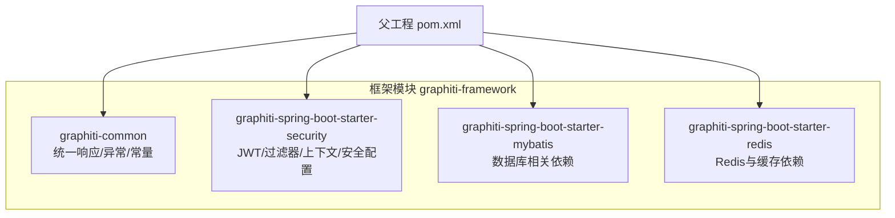
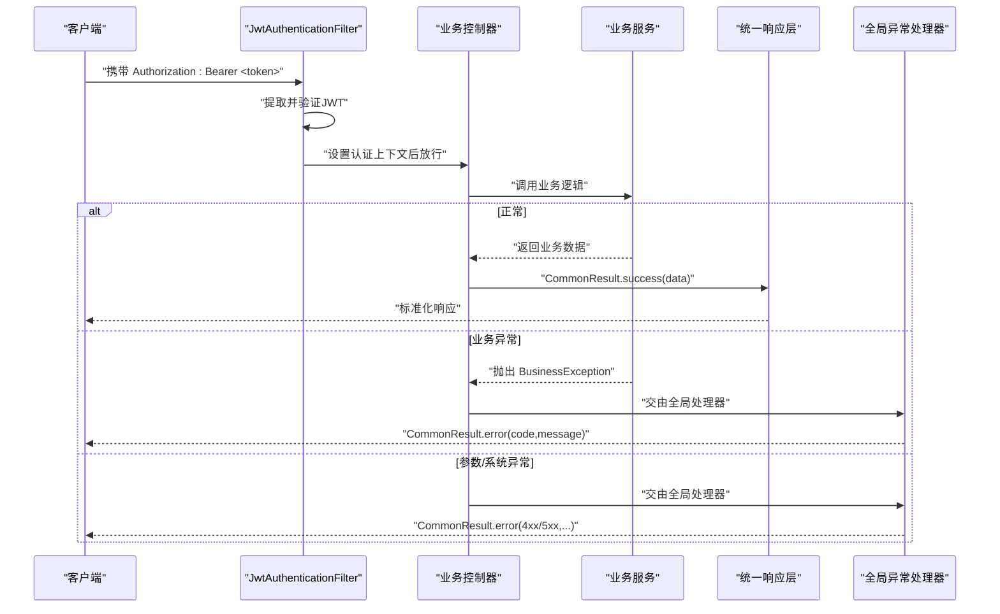
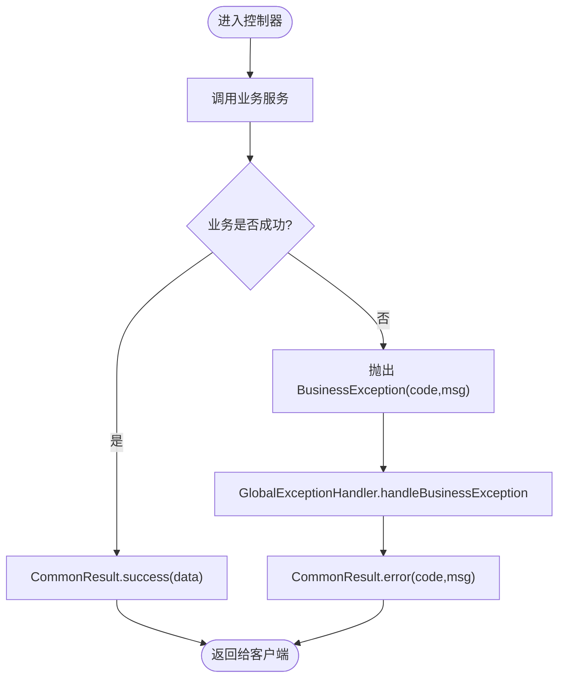
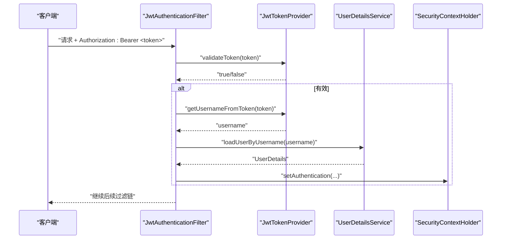
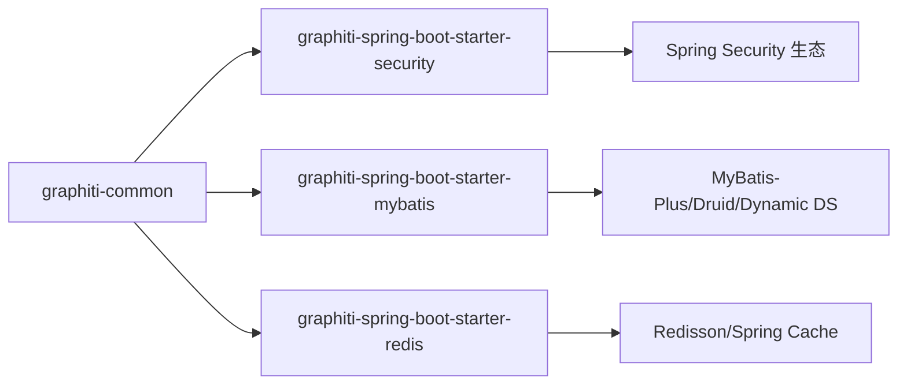

# 框架模块 (graphiti-framework)

<cite>
**本文引用的文件**
- [graphiti-framework/pom.xml](file://graphiti-framework/pom.xml)
- [graphiti-common/CommonResult.java](file://graphiti-framework/graphiti-common/src/main/java/com/raphiti/common/response/CommonResult.java)
- [graphiti-common/ResultCode.java](file://graphiti-framework/graphiti-common/src/main/java/com/raphiti/common/constants/ResultCode.java)
- [graphiti-common/BusinessException.java](file://graphiti-framework/graphiti-common/src/main/java/com/raphiti/common/exception/BusinessException.java)
- [graphiti-common/GlobalExceptionHandler.java](file://graphiti-framework/graphiti-common/src/main/java/com/raphiti/common/exception/GlobalExceptionHandler.java)
- [graphiti-security/JwtAuthenticationFilter.java](file://graphiti-framework/graphiti-spring-boot-starter-security/src/main/java/com/raphiti/framework/security/jwt/JwtAuthenticationFilter.java)
- [graphiti-security/JwtTokenProvider.java](file://graphiti-framework/graphiti-spring-boot-starter-security/src/main/java/com/raphiti/framework/security/jwt/JwtTokenProvider.java)
- [graphiti-security/UserContext.java](file://graphiti-framework/graphiti-spring-boot-starter-security/src/main/java/com/raphiti/framework/security/util/UserContext.java)
- [graphiti-security/SecurityConfig.java](file://graphiti-framework/graphiti-spring-boot-starter-security/src/main/java/com/raphiti/framework/security/config/SecurityConfig.java)
- [graphiti-mybatis/pom.xml](file://graphiti-framework/graphiti-spring-boot-starter-mybatis/pom.xml)
- [graphiti-redis/pom.xml](file://graphiti-framework/graphiti-spring-boot-starter-redis/pom.xml)
- [system/AuthController.java](file://graphiti-module-system/src/main/java/com/raphiti/system/controller/AuthController.java)
</cite>

## 目录
1. [简介](#简介)
2. [项目结构](#项目结构)
3. [核心组件](#核心组件)
4. [架构总览](#架构总览)
5. [详细组件分析](#详细组件分析)
6. [依赖分析](#依赖分析)
7. [性能考虑](#性能考虑)
8. [故障排查指南](#故障排查指南)
9. [结论](#结论)
10. [附录](#附录)

## 简介
本文件面向Graphiti-Java框架模块（graphiti-framework），聚焦以下目标：
- 统一响应层设计：CommonResult与ResultCode如何提供标准化API响应格式
- 异常处理机制：GlobalExceptionHandler如何集中处理业务异常与系统异常
- 安全认证框架：JWT认证过滤器、令牌生成与验证流程、用户上下文管理
- MyBatis与Redis启动器：配置与使用方式
- 扩展点与自定义配置
- 在业务模块中的使用示例路径

## 项目结构
graphiti-framework为聚合模块，采用“starter”命名规范，按功能拆分为多个子模块：
- graphiti-common：通用响应、异常与常量
- graphiti-spring-boot-starter-security：安全认证（JWT、过滤器、上下文）
- graphiti-spring-boot-starter-mybatis：数据库相关（Druid、MyBatis-Plus、动态数据源）
- graphiti-spring-boot-starter-redis：缓存与Redis封装（Redisson、Spring Cache）

图表来源
- [graphiti-framework/pom.xml:1-29](file://graphiti-framework/pom.xml#L1-L29)

章节来源
- [graphiti-framework/pom.xml:1-29](file://graphiti-framework/pom.xml#L1-L29)

## 核心组件
本节聚焦统一响应层与异常处理机制，它们是所有HTTP接口输出的一致性保障。

- 统一响应模型：CommonResult
  - 字段：code、message、data、timestamp
  - 成功构造：success(data)/success()
  - 错误构造：error(code, message)
- 结果码常量：ResultCode
  - 成功/客户端错误/服务端错误/业务错误分层
  - 业务错误码区间：1001-1099
- 业务异常：BusinessException
  - 携带code与message，便于上层统一处理
- 全局异常处理器：GlobalExceptionHandler
  - 捕获业务异常、参数校验异常、缺失参数异常、未知异常
  - 统一返回CommonResult格式

章节来源
- [graphiti-common/CommonResult.java:1-68](file://graphiti-framework/graphiti-common/src/main/java/com/raphiti/common/response/CommonResult.java#L1-L68)
- [graphiti-common/ResultCode.java:1-23](file://graphiti-framework/graphiti-common/src/main/java/com/raphiti/common/constants/ResultCode.java#L1-L23)
- [graphiti-common/BusinessException.java:1-33](file://graphiti-framework/graphiti-common/src/main/java/com/raphiti/common/exception/BusinessException.java#L1-L33)
- [graphiti-common/GlobalExceptionHandler.java:1-74](file://graphiti-framework/graphiti-common/src/main/java/com/raphiti/common/exception/GlobalExceptionHandler.java#L1-L74)

## 架构总览
下图展示了请求在安全层、控制器与统一响应层之间的交互，以及异常在全局处理器中的归口处理。

图表来源
- [graphiti-security/JwtAuthenticationFilter.java:1-61](file://graphiti-framework/graphiti-spring-boot-starter-security/src/main/java/com/raphiti/framework/security/jwt/JwtAuthenticationFilter.java#L1-L61)
- [graphiti-common/GlobalExceptionHandler.java:1-74](file://graphiti-framework/graphiti-common/src/main/java/com/raphiti/common/exception/GlobalExceptionHandler.java#L1-L74)
- [graphiti-common/CommonResult.java:1-68](file://graphiti-framework/graphiti-common/src/main/java/com/raphiti/common/response/CommonResult.java#L1-L68)

## 详细组件分析

### 统一响应层与异常处理
- 设计要点
  - 统一字段：code、message、data、timestamp，便于前端与监控系统一致解析
  - 成功/错误两类静态工厂方法，降低样板代码
  - 结果码分层：2xx成功、4xx客户端错误、5xx服务端错误、1xxx业务错误
  - 全局异常捕获：业务异常、参数校验失败、缺失参数、未知异常
- 使用建议
  - 控制器层统一以CommonResult.success()/error()返回
  - 业务层抛BusinessException并指定业务码
  - 参数校验使用JSR-303注解，配合全局处理器返回可读错误

图表来源
- [graphiti-common/CommonResult.java:1-68](file://graphiti-framework/graphiti-common/src/main/java/com/raphiti/common/response/CommonResult.java#L1-L68)
- [graphiti-common/BusinessException.java:1-33](file://graphiti-framework/graphiti-common/src/main/java/com/raphiti/common/exception/BusinessException.java#L1-L33)
- [graphiti-common/GlobalExceptionHandler.java:1-74](file://graphiti-framework/graphiti-common/src/main/java/com/raphiti/common/exception/GlobalExceptionHandler.java#L1-L74)

章节来源
- [graphiti-common/CommonResult.java:1-68](file://graphiti-framework/graphiti-common/src/main/java/com/raphiti/common/response/CommonResult.java#L1-L68)
- [graphiti-common/ResultCode.java:1-23](file://graphiti-framework/graphiti-common/src/main/java/com/raphiti/common/constants/ResultCode.java#L1-L23)
- [graphiti-common/BusinessException.java:1-33](file://graphiti-framework/graphiti-common/src/main/java/com/raphiti/common/exception/BusinessException.java#L1-L33)
- [graphiti-common/GlobalExceptionHandler.java:1-74](file://graphiti-framework/graphiti-common/src/main/java/com/raphiti/common/exception/GlobalExceptionHandler.java#L1-L74)

### 安全认证框架
- JWT认证过滤器（JwtAuthenticationFilter）
  - 从请求头Authorization中提取Bearer Token
  - 调用JwtTokenProvider验证并解析用户名
  - 通过UserDetailsService加载用户详情，构建Authentication并写入SecurityContext
- 令牌提供器（JwtTokenProvider）
  - 支持生成、解析、验证JWT
  - 从配置注入密钥与过期时间
- 用户上下文（UserContext）
  - 从SecurityContext获取当前用户名或UserDetails
  - 未认证时抛出业务异常（401）
- 安全配置（SecurityConfig）
  - 启用无状态会话
  - 配置CORS、禁用CSRF
  - 预留公开路径（如认证、Swagger、Actuator）
  - 注册JWT过滤器于Spring Security过滤链之前
  - 自定义未认证/权限不足的JSON响应

图表来源
- [graphiti-security/JwtAuthenticationFilter.java:1-61](file://graphiti-framework/graphiti-spring-boot-starter-security/src/main/java/com/raphiti/framework/security/jwt/JwtAuthenticationFilter.java#L1-L61)
- [graphiti-security/JwtTokenProvider.java:1-87](file://graphiti-framework/graphiti-spring-boot-starter-security/src/main/java/com/raphiti/framework/security/jwt/JwtTokenProvider.java#L1-L87)
- [graphiti-security/SecurityConfig.java:1-138](file://graphiti-framework/graphiti-spring-boot-starter-security/src/main/java/com/raphiti/framework/security/config/SecurityConfig.java#L1-L138)

章节来源
- [graphiti-security/JwtAuthenticationFilter.java:1-61](file://graphiti-framework/graphiti-spring-boot-starter-security/src/main/java/com/raphiti/framework/security/jwt/JwtAuthenticationFilter.java#L1-L61)
- [graphiti-security/JwtTokenProvider.java:1-87](file://graphiti-framework/graphiti-spring-boot-starter-security/src/main/java/com/raphiti/framework/security/jwt/JwtTokenProvider.java#L1-L87)
- [graphiti-security/UserContext.java:1-50](file://graphiti-framework/graphiti-spring-boot-starter-security/src/main/java/com/raphiti/framework/security/util/UserContext.java#L1-L50)
- [graphiti-security/SecurityConfig.java:1-138](file://graphiti-framework/graphiti-spring-boot-starter-security/src/main/java/com/raphiti/framework/security/config/SecurityConfig.java#L1-L138)

### MyBatis启动器与Redis启动器
- MyBatis启动器（graphiti-spring-boot-starter-mybatis）
  - 依赖：Druid（连接池）、MyBatis-Plus、动态数据源、PostgreSQL驱动
  - 作用：提供数据库连接、多数据源切换、MyBatis-Plus增强能力
- Redis启动器（graphiti-spring-boot-starter-redis）
  - 依赖：Redisson、Spring Cache、Java 8时间包（JSR310）
  - 作用：提供Redis客户端、分布式锁/限流等能力与缓存抽象

章节来源
- [graphiti-mybatis/pom.xml:1-51](file://graphiti-framework/graphiti-spring-boot-starter-mybatis/pom.xml#L1-L51)
- [graphiti-redis/pom.xml:1-39](file://graphiti-framework/graphiti-spring-boot-starter-redis/pom.xml#L1-L39)

### 在业务模块中的使用示例（示例路径）
- 控制器返回统一响应
  - 参考：[system/AuthController.java:27-32](file://graphiti-module-system/src/main/java/com/raphiti/system/controller/AuthController.java#L27-L32)
- 抛出业务异常
  - 参考：[graphiti-common/BusinessException.java:20-23](file://graphiti-framework/graphiti-common/src/main/java/com/raphiti/common/exception/BusinessException.java#L20-L23)
- 全局异常处理
  - 参考：[graphiti-common/GlobalExceptionHandler.java:26-30](file://graphiti-framework/graphiti-common/src/main/java/com/raphiti/common/exception/GlobalExceptionHandler.java#L26-L30)
- 获取当前用户上下文
  - 参考：[graphiti-security/UserContext.java:19-32](file://graphiti-framework/graphiti-spring-boot-starter-security/src/main/java/com/raphiti/framework/security/util/UserContext.java#L19-L32)

## 依赖分析
- 模块内聚与耦合
  - graphiti-common被多个starter依赖，形成基础层
  - security模块依赖common与Spring Security生态
  - mybatis/redis模块依赖common与第三方库
- 外部依赖
  - Spring Security、Spring Boot Starter Web
  - MyBatis-Plus、Druid、动态数据源
  - Redisson、Spring Cache、Jackson JSR310

图表来源
- [graphiti-framework/pom.xml:1-29](file://graphiti-framework/pom.xml#L1-L29)
- [graphiti-mybatis/pom.xml:1-51](file://graphiti-framework/graphiti-spring-boot-starter-mybatis/pom.xml#L1-L51)
- [graphiti-redis/pom.xml:1-39](file://graphiti-framework/graphiti-spring-boot-starter-redis/pom.xml#L1-L39)

章节来源
- [graphiti-framework/pom.xml:1-29](file://graphiti-framework/pom.xml#L1-L29)
- [graphiti-mybatis/pom.xml:1-51](file://graphiti-framework/graphiti-spring-boot-starter-mybatis/pom.xml#L1-L51)
- [graphiti-redis/pom.xml:1-39](file://graphiti-framework/graphiti-spring-boot-starter-redis/pom.xml#L1-L39)

## 性能考虑
- 统一响应层
  - 保持响应体简洁，避免冗余字段；timestamp为字符串，便于日志与前端解析
- JWT认证
  - 合理设置过期时间；避免在Token中存放过多用户信息
  - 过滤器每次请求都会进行校验，建议结合网关或反向代理做限流
- MyBatis
  - 使用动态数据源时注意连接池配置；合理分页与索引
- Redis
  - 使用Redisson时注意序列化策略与键空间设计；结合Spring Cache提升命中率

## 故障排查指南
- 401 未认证
  - 检查请求头是否包含正确的Authorization: Bearer <token>
  - 确认JwtTokenProvider密钥与过期时间配置正确
  - 参考：[graphiti-security/SecurityConfig.java:84-96](file://graphiti-framework/graphiti-spring-boot-starter-security/src/main/java/com/raphiti/framework/security/config/SecurityConfig.java#L84-L96)
- 403 权限不足
  - 检查用户角色与资源权限映射
  - 参考：[graphiti-security/SecurityConfig.java:102-113](file://graphiti-framework/graphiti-spring-boot-starter-security/src/main/java/com/raphiti/framework/security/config/SecurityConfig.java#L102-L113)
- 参数校验失败
  - 全局处理器会将字段错误拼接为消息返回
  - 参考：[graphiti-common/GlobalExceptionHandler.java:37-45](file://graphiti-framework/graphiti-common/src/main/java/com/raphiti/common/exception/GlobalExceptionHandler.java#L37-L45)
- 业务异常
  - 业务层抛出BusinessException，确保code与message准确
  - 参考：[graphiti-common/BusinessException.java:20-23](file://graphiti-framework/graphiti-common/src/main/java/com/raphiti/common/exception/BusinessException.java#L20-L23)

章节来源
- [graphiti-security/SecurityConfig.java:84-113](file://graphiti-framework/graphiti-spring-boot-starter-security/src/main/java/com/raphiti/framework/security/config/SecurityConfig.java#L84-L113)
- [graphiti-common/GlobalExceptionHandler.java:37-45](file://graphiti-framework/graphiti-common/src/main/java/com/raphiti/common/exception/GlobalExceptionHandler.java#L37-L45)
- [graphiti-common/BusinessException.java:20-23](file://graphiti-framework/graphiti-common/src/main/java/com/raphiti/common/exception/BusinessException.java#L20-L23)

## 结论
graphiti-framework通过统一响应层与全局异常处理，实现了API输出的一致性与可观测性；通过JWT认证过滤器与安全配置，提供了无状态认证与细粒度权限控制；MyBatis与Redis启动器则分别覆盖了持久层与缓存层的常见需求。上述组件共同构成可扩展、易维护的后端基础设施。

## 附录
- 扩展点与自定义配置
  - 统一响应：可在CommonResult中增加审计字段（如traceId）
  - 异常处理：可新增特定异常类型的处理器，丰富错误码体系
  - 安全：可替换UserDetailsService实现、扩展JWT负载、接入外部认证中心
  - MyBatis：通过动态数据源配置多库路由；结合MyBatis-Plus插件实现审计字段自动填充
  - Redis：基于Redisson扩展分布式锁/限流策略；结合Spring Cache注解简化缓存操作