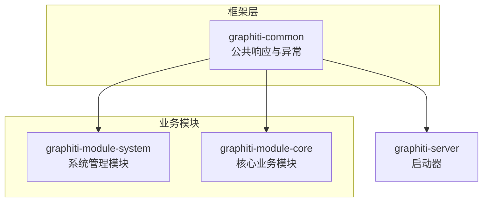
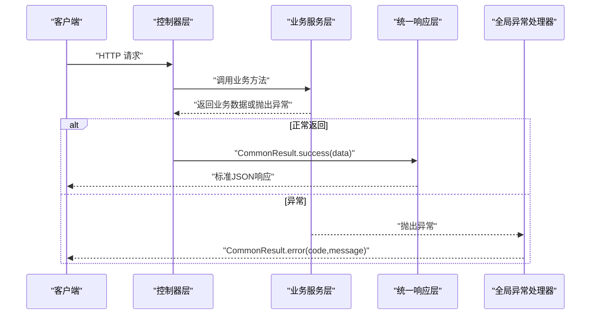
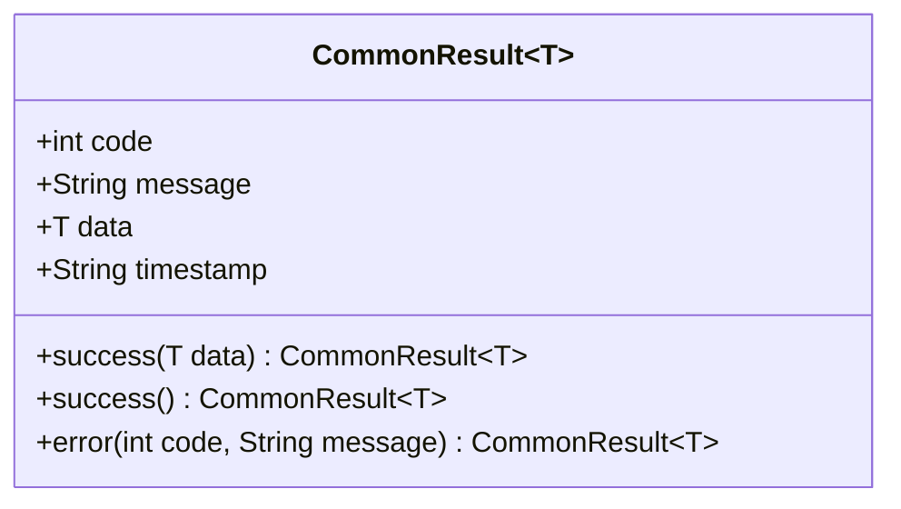
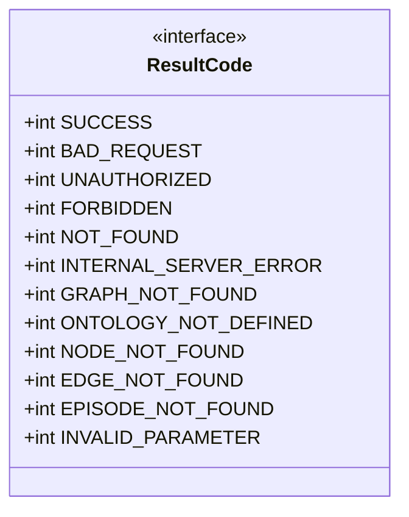
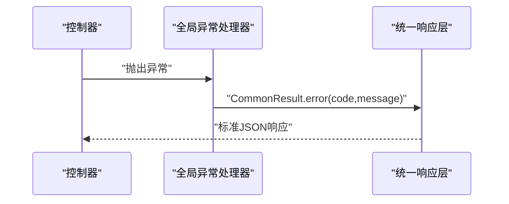
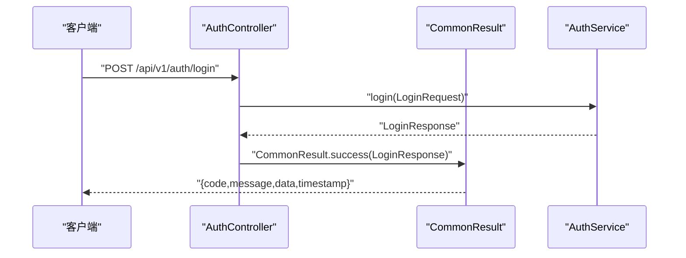
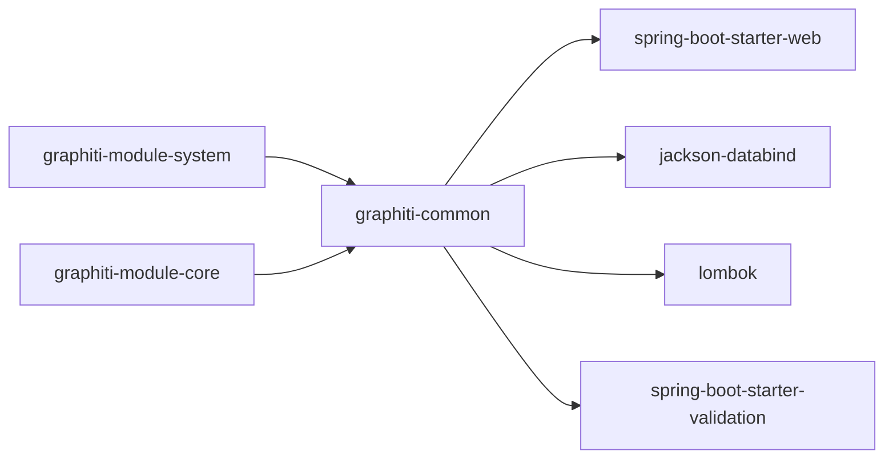

# 统一响应层

<!--<cite>
**本文引用的文件**
- [CommonResult.java](file://graphiti-framework/graphiti-common/src/main/java/com/graphiti/common/response/CommonResult.java)
- [ResultCode.java](file://graphiti-framework/graphiti-common/src/main/java/com/graphiti/common/constants/ResultCode.java)
- [GlobalExceptionHandler.java](file://graphiti-framework/graphiti-common/src/main/java/com/graphiti/common/exception/GlobalExceptionHandler.java)
- [BusinessException.java](file://graphiti-framework/graphiti-common/src/main/java/com/graphiti/common/exception/BusinessException.java)
- [AuthController.java](file://graphiti-module-system/src/main/java/com/graphiti/system/controller/AuthController.java)
- [UserController.java](file://graphiti-module-system/src/main/java/com/graphiti/system/controller/UserController.java)
- [GraphitiController.java](file://graphiti-module-core/src/main/java/com/graphiti/module/graphiti/controller/admin/GraphitiController.java)
- [LoginResponse.java](file://graphiti-module-system/src/main/java/com/graphiti/system/dto/LoginResponse.java)
- [LoginRequest.java](file://graphiti-module-system/src/main/java/com/graphiti/system/dto/LoginRequest.java)
- [GraphInfoRespVO.java](file://graphiti-module-core/src/main/java/com/graphiti/module/graphiti/vo/graph/GraphInfoRespVO.java)
- [pom.xml](file://pom.xml)
- [graphiti-common/pom.xml](file://graphiti-framework/graphiti-common/pom.xml)
</cite>-->

## 目录
1. [简介](#简介)
2. [项目结构](#项目结构)
3. [核心组件](#核心组件)
4. [架构总览](#架构总览)
5. [详细组件分析](#详细组件分析)
6. [依赖分析](#依赖分析)
7. [性能考量](#性能考量)
8. [故障排查指南](#故障排查指南)
9. [结论](#结论)
10. [附录](#附录)

## 简介
本文件聚焦于Graphiti Java项目中的统一响应层，系统性阐述CommonResult类的设计理念与实现细节，包括：
- 泛型设计与序列化支持
- 时间戳格式化策略
- ResultCode枚举的错误码定义与业务含义
- success()与error()静态方法的使用模式与最佳实践
- 控制器层中统一响应格式的实际应用示例
- 响应格式的版本兼容性与扩展建议

## 项目结构
统一响应层位于graphiti-framework/graphiti-common模块中，作为跨模块共享的基础设施，为系统各业务模块提供一致的HTTP响应结构。该模块通过Spring Boot Starter Web、Jackson、Lombok等依赖支撑序列化与Web功能。

图表来源
- [pom.xml:15-20](file://pom.xml#L15-L20)
- [graphiti-common/pom.xml:16-38](file://graphiti-framework/graphiti-common/pom.xml#L16-L38)

章节来源
- [pom.xml:15-20](file://pom.xml#L15-L20)
- [graphiti-common/pom.xml:16-38](file://graphiti-framework/graphiti-common/pom.xml#L16-L38)

## 核心组件
- CommonResult<T>：统一响应载体，封装code、message、data、timestamp四个字段，提供泛型支持与序列化能力。
- ResultCode：错误码常量接口，定义通用HTTP语义错误码与Graphiti业务错误码。
- GlobalExceptionHandler：全局异常处理器，将各类异常转换为统一响应格式。
- BusinessException：业务异常类，携带业务错误码，便于统一处理。

章节来源
- [CommonResult.java:13-67](file://graphiti-framework/graphiti-common/src/main/java/com/graphiti/common/response/CommonResult.java#L13-L67)
- [ResultCode.java:7-22](file://graphiti-framework/graphiti-common/src/main/java/com/graphiti/common/constants/ResultCode.java#L7-L22)
- [GlobalExceptionHandler.java:17-73](file://graphiti-framework/graphiti-common/src/main/java/com/graphiti/common/exception/GlobalExceptionHandler.java#L17-L73)
- [BusinessException.java:10-32](file://graphiti-framework/graphiti-common/src/main/java/com/graphiti/common/exception/BusinessException.java#L10-L32)

## 架构总览
统一响应层在系统中的位置与交互如下：

图表来源
- [AuthController.java:29-32](file://graphiti-module-system/src/main/java/com/graphiti/system/controller/AuthController.java#L29-L32)
- [UserController.java:32-34](file://graphiti-module-system/src/main/java/com/graphiti/system/controller/UserController.java#L32-L34)
- [GraphitiController.java:56-59](file://graphiti-module-core/src/main/java/com/graphiti/module/graphiti/controller/admin/GraphitiController.java#L56-L59)
- [GlobalExceptionHandler.java:26-30](file://graphiti-framework/graphiti-common/src/main/java/com/graphiti/common/exception/GlobalExceptionHandler.java#L26-L30)

## 详细组件分析

### CommonResult<T> 设计与实现
- 泛型设计：通过<T>承载任意业务数据类型，确保响应体的强类型表达，便于前端与SDK消费。
- 序列化支持：实现Serializable接口，结合Jackson在Spring Boot中自动序列化为JSON；Lombok注解减少样板代码。
- 时间戳格式化：构造时使用ISO_LOCAL_DATE_TIME格式字符串记录响应生成时间，便于日志追踪与调试。
- 静态工厂方法：
  - success(T data)：快速封装成功响应，设置code为SUCCESS，message为“success”，并填充data。
  - success()：无数据的成功响应，等价于success(null)。
  - error(int code, String message)：快速封装错误响应，允许自定义错误码与消息。

图表来源
- [CommonResult.java:14-67](file://graphiti-framework/graphiti-common/src/main/java/com/graphiti/common/response/CommonResult.java#L14-L67)

章节来源
- [CommonResult.java:13-67](file://graphiti-framework/graphiti-common/src/main/java/com/graphiti/common/response/CommonResult.java#L13-L67)

### ResultCode 错误码定义与业务含义
- 通用HTTP语义：
  - SUCCESS：200，表示操作成功。
  - BAD_REQUEST：400，表示客户端请求参数无效或缺失。
  - UNAUTHORIZED：401，表示未认证或令牌无效。
  - FORBIDDEN：403，表示权限不足。
  - NOT_FOUND：404，表示资源不存在。
  - INTERNAL_SERVER_ERROR：500，表示服务器内部错误。
- Graphiti业务错误码（1001-1099）：
  - GRAPH_NOT_FOUND：1001，图谱不存在。
  - ONTOLOGY_NOT_DEFINED：1002，本体未定义。
  - NODE_NOT_FOUND：1003，节点不存在。
  - EDGE_NOT_FOUND：1004，边不存在。
  - EPISODE_NOT_FOUND：1005，剧集不存在。
  - INVALID_PARAMETER：1006，参数非法。

图表来源
- [ResultCode.java:7-22](file://graphiti-framework/graphiti-common/src/main/java/com/graphiti/common/constants/ResultCode.java#L7-L22)

章节来源
- [ResultCode.java:7-22](file://graphiti-framework/graphiti-common/src/main/java/com/graphiti/common/constants/ResultCode.java#L7-L22)

### 全局异常处理与统一响应
- 全局异常处理器：
  - 捕获BusinessException并返回对应错误码与消息。
  - 参数校验异常：收集字段级错误，拼接为统一消息。
  - 缺少请求参数：返回明确提示。
  - 其他未知异常：统一返回500与通用错误消息。
- 与统一响应的集成：所有异常均通过CommonResult.error(...)转换为标准响应。

图表来源
- [GlobalExceptionHandler.java:26-72](file://graphiti-framework/graphiti-common/src/main/java/com/graphiti/common/exception/GlobalExceptionHandler.java#L26-L72)
- [BusinessException.java:10-32](file://graphiti-framework/graphiti-common/src/main/java/com/graphiti/common/exception/BusinessException.java#L10-L32)

章节来源
- [GlobalExceptionHandler.java:17-73](file://graphiti-framework/graphiti-common/src/main/java/com/graphiti/common/exception/GlobalExceptionHandler.java#L17-L73)
- [BusinessException.java:10-32](file://graphiti-framework/graphiti-common/src/main/java/com/graphiti/common/exception/BusinessException.java#L10-L32)

### 控制器层使用模式与最佳实践
- 使用CommonResult.success(data)返回业务数据，保持响应结构一致性。
- 对于无数据场景，使用CommonResult.success()返回空数据体。
- 对于业务异常，抛出BusinessException，由全局异常处理器统一捕获并返回错误响应。
- 对于参数校验失败，依赖Spring Validation自动触发全局异常处理器，返回标准化错误消息。

图表来源
- [AuthController.java:29-32](file://graphiti-module-system/src/main/java/com/graphiti/system/controller/AuthController.java#L29-L32)
- [LoginResponse.java:10-38](file://graphiti-module-system/src/main/java/com/graphiti/system/dto/LoginResponse.java#L10-L38)

章节来源
- [AuthController.java:29-32](file://graphiti-module-system/src/main/java/com/graphiti/system/controller/AuthController.java#L29-L32)
- [UserController.java:32-34](file://graphiti-module-system/src/main/java/com/graphiti/system/controller/UserController.java#L32-L34)
- [GraphitiController.java:56-59](file://graphiti-module-core/src/main/java/com/graphiti/module/graphiti/controller/admin/GraphitiController.java#L56-L59)

### 响应格式与版本兼容性
- 当前响应结构包含code、message、data、timestamp四个字段，满足前后端约定的统一契约。
- 版本兼容性建议：
  - 在新增字段时，采用向后兼容策略（如新增可选字段），避免破坏现有客户端解析。
  - 对于时间戳格式，若需国际化或更严格的时区控制，可考虑改为RFC3339字符串或毫秒时间戳，同时在文档中明确格式。
  - 对于错误码扩展，遵循ResultCode命名规范，避免与通用HTTP语义冲突。

章节来源
- [CommonResult.java:17-27](file://graphiti-framework/graphiti-common/src/main/java/com/graphiti/common/response/CommonResult.java#L17-L27)
- [ResultCode.java:7-22](file://graphiti-framework/graphiti-common/src/main/java/com/graphiti/common/constants/ResultCode.java#L7-L22)

## 依赖分析
- 统一响应层依赖：
  - Spring Boot Starter Web：提供@RestController、@RestControllerAdvice等注解与Web栈。
  - Jackson：负责Java对象到JSON的序列化与反序列化。
  - Lombok：简化POJO与注解样板代码。
  - Validation：参数校验支持，配合全局异常处理器。
- 业务模块依赖：
  - 各业务模块通过引入graphiti-common即可获得统一响应能力，无需重复实现。

图表来源
- [graphiti-common/pom.xml:16-38](file://graphiti-framework/graphiti-common/pom.xml#L16-L38)
- [pom.xml:163-195](file://pom.xml#L163-L195)

章节来源
- [graphiti-common/pom.xml:16-38](file://graphiti-framework/graphiti-common/pom.xml#L16-L38)
- [pom.xml:163-195](file://pom.xml#L163-L195)

## 性能考量
- 序列化开销：CommonResult与业务VO均为简单对象，Jackson序列化成本较低；建议避免在data中传递超大对象，必要时采用分页或流式输出。
- 时间戳生成：构造函数中生成ISO_LOCAL_DATE_TIME字符串，开销极小；若对性能敏感，可考虑复用格式化器或延迟生成。
- 异常处理链路：全局异常处理器仅做轻量转换，不涉及复杂计算，性能影响可忽略。

## 故障排查指南
- 常见问题与定位：
  - 参数校验失败：检查GlobalExceptionHandler对MethodArgumentNotValidException的处理，确认字段级错误是否正确拼接。
  - 缺少请求参数：确认MissingServletRequestParameterException是否被正确捕获并返回400。
  - 业务异常：确认BusinessException的code与message是否符合预期，避免直接抛出RuntimeException导致500。
- 日志与追踪：
  - 全局异常处理器记录错误日志，便于定位问题根因。
  - 响应中的timestamp可用于请求链路追踪与问题复现。

章节来源
- [GlobalExceptionHandler.java:26-72](file://graphiti-framework/graphiti-common/src/main/java/com/graphiti/common/exception/GlobalExceptionHandler.java#L26-L72)
- [BusinessException.java:10-32](file://graphiti-framework/graphiti-common/src/main/java/com/graphiti/common/exception/BusinessException.java#L10-L32)

## 结论
统一响应层通过CommonResult<T>、ResultCode与GlobalExceptionHandler形成闭环，实现了：
- 响应格式的标准化与一致性
- 异常处理的集中化与规范化
- 业务开发的低耦合与高内聚

在实际工程中，建议严格遵循success()/error()的使用模式，配合BusinessException与参数校验，确保前后端交互稳定可靠。

## 附录

### 实际控制器使用示例（路径）
- 登录接口：[AuthController.java:29-32](file://graphiti-module-system/src/main/java/com/graphiti/system/controller/AuthController.java#L29-L32)
- 创建用户接口：[UserController.java:32-34](file://graphiti-module-system/src/main/java/com/graphiti/system/controller/UserController.java#L32-L34)
- 图谱创建接口：[GraphitiController.java:56-59](file://graphiti-module-core/src/main/java/com/graphiti/module/graphiti/controller/admin/GraphitiController.java#L56-L59)

### 响应数据模型示例（路径）
- 登录响应DTO：[LoginResponse.java:10-38](file://graphiti-module-system/src/main/java/com/graphiti/system/dto/LoginResponse.java#L10-L38)
- 登录请求DTO：[LoginRequest.java:11-25](file://graphiti-module-system/src/main/java/com/graphiti/system/dto/LoginRequest.java#L11-L25)
- 图谱信息VO：[GraphInfoRespVO.java:11-41](file://graphiti-module-core/src/main/java/com/graphiti/module/graphiti/vo/graph/GraphInfoRespVO.java#L11-L41)