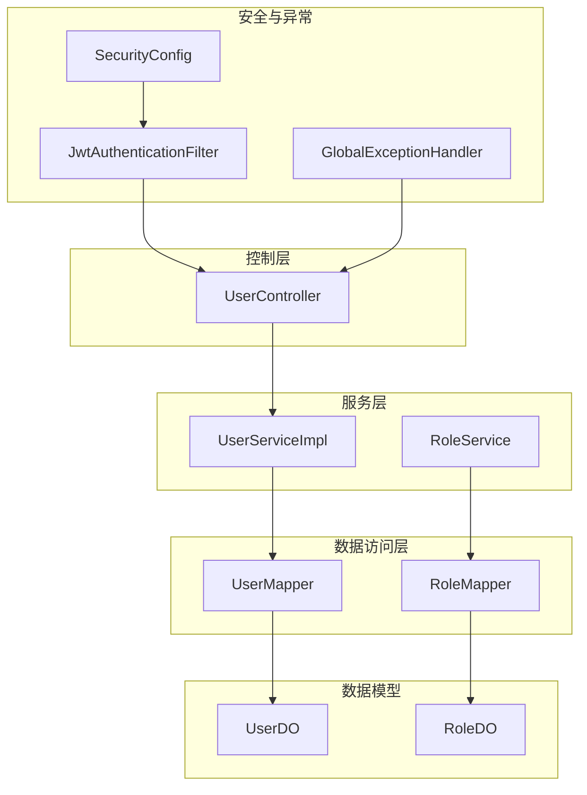
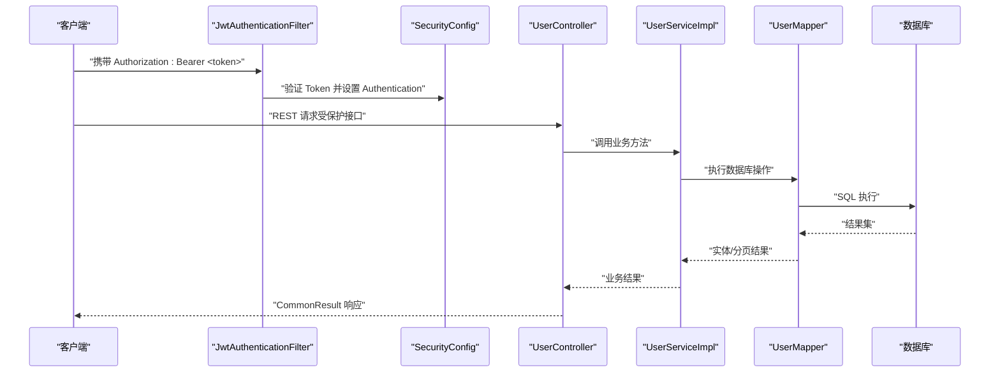
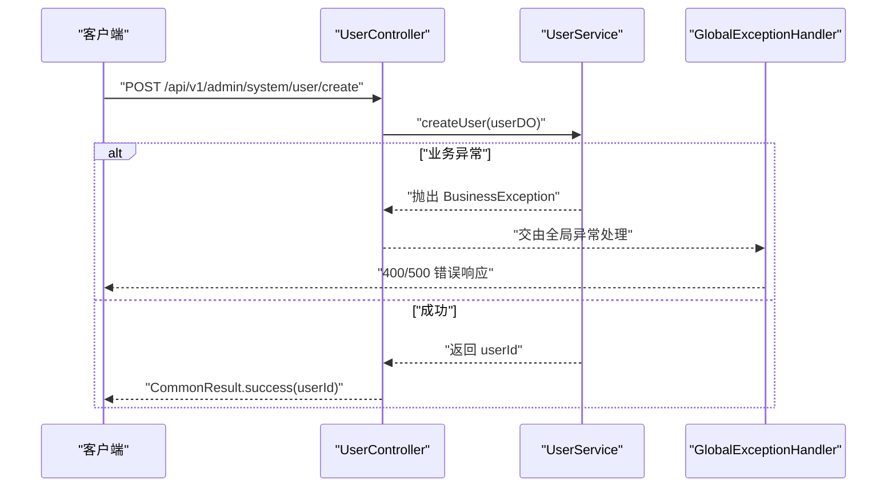
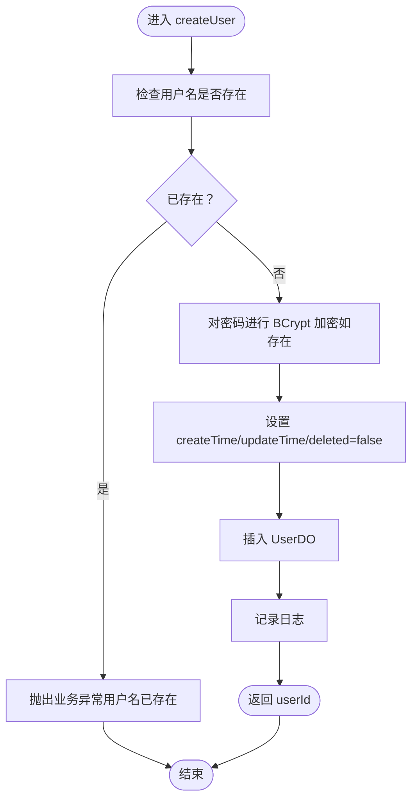
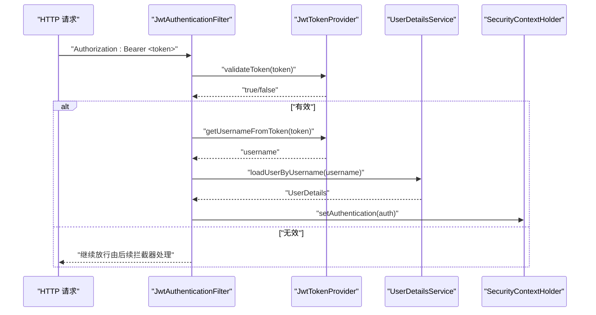
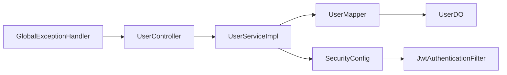

# 用户管理

<cite>
**本文引用的文件**
- [UserController.java](file://graphiti-module-system/src/main/java/com/graphiti/system/controller/UserController.java)
- [UserService.java](file://graphiti-module-system/src/main/java/com/graphiti/system/service/UserService.java)
- [UserServiceImpl.java](file://graphiti-module-system/src/main/java/com/graphiti/system/service/impl/UserServiceImpl.java)
- [UserDO.java](file://graphiti-module-system/src/main/java/com/graphiti/system/dal/dataobject/UserDO.java)
- [UserMapper.java](file://graphiti-module-system/src/main/java/com/graphiti/system/dal/mysql/UserMapper.java)
- [RoleService.java](file://graphiti-module-system/src/main/java/com/graphiti/system/service/RoleService.java)
- [RoleDO.java](file://graphiti-module-system/src/main/java/com/graphiti/system/dal/dataobject/RoleDO.java)
- [RoleMapper.java](file://graphiti-module-system/src/main/java/com/graphiti/system/dal/mysql/RoleMapper.java)
- [AuthService.java](file://graphiti-module-system/src/main/java/com/graphiti/system/service/AuthService.java)
- [LoginRequest.java](file://graphiti-module-system/src/main/java/com/graphiti/system/dto/LoginRequest.java)
- [LoginResponse.java](file://graphiti-module-system/src/main/java/com/graphiti/system/dto/LoginResponse.java)
- [GlobalExceptionHandler.java](file://graphiti-framework/graphiti-common/src/main/java/com/raphiti/common/exception/GlobalExceptionHandler.java)
- [SecurityConfig.java](file://graphiti-framework/graphiti-spring-boot-starter-security/src/main/java/com/graphiti/framework/security/config/SecurityConfig.java)
- [JwtAuthenticationFilter.java](file://graphiti-framework/graphiti-spring-boot-starter-security/src/main/java/com/graphiti/framework/security/jwt/JwtAuthenticationFilter.java)
- [schema.sql](file://sql/mysql/schema.sql)
- [init-data.sql](file://sql/mysql/init-data.sql)
</cite>

## 目录
1. [简介](#简介)
2. [项目结构](#项目结构)
3. [核心组件](#核心组件)
4. [架构总览](#架构总览)
5. [详细组件分析](#详细组件分析)
6. [依赖分析](#依赖分析)
7. [性能考虑](#性能考虑)
8. [故障排查指南](#故障排查指南)
9. [结论](#结论)
10. [附录](#附录)

## 简介
本文件面向“用户管理”模块，围绕 UserController 的用户 CRUD 接口与 UserService 的业务实现展开，覆盖用户创建、查询、更新、删除、分页查询、密码管理、状态控制、角色分配、权限验证、数据校验与异常处理等主题，并提供完整 API 文档与使用示例路径，帮助开发者快速理解与集成。

## 项目结构
用户管理模块位于 graphiti-module-system 中，采用典型的分层架构：
- 控制层：UserController 提供 REST API
- 服务层：UserService 接口与 UserServiceImpl 实现
- 数据访问层：UserMapper 基于 MyBatis-Plus
- 数据模型：UserDO 映射 sys_user 表
- 安全与认证：基于 Spring Security + JWT
- 异常统一处理：GlobalExceptionHandler

图表来源
- [UserController.java:1-75](file://graphiti-module-system/src/main/java/com/graphiti/system/controller/UserController.java#L1-L75)
- [UserServiceImpl.java:1-113](file://graphiti-module-system/src/main/java/com/graphiti/system/service/impl/UserServiceImpl.java#L1-L113)
- [UserMapper.java:1-13](file://graphiti-module-system/src/main/java/com/graphiti/system/dal/mysql/UserMapper.java#L1-L13)
- [UserDO.java:1-38](file://graphiti-module-system/src/main/java/com/graphiti/system/dal/dataobject/UserDO.java#L1-L38)
- [RoleService.java:1-49](file://graphiti-module-system/src/main/java/com/graphiti/system/service/RoleService.java#L1-L49)
- [RoleMapper.java:1-13](file://graphiti-module-system/src/main/java/com/graphiti/system/dal/mysql/RoleMapper.java#L1-L13)
- [RoleDO.java:1-32](file://graphiti-module-system/src/main/java/com/graphiti/system/dal/dataobject/RoleDO.java#L1-L32)
- [SecurityConfig.java:1-138](file://graphiti-framework/graphiti-spring-boot-starter-security/src/main/java/com/graphiti/framework/security/config/SecurityConfig.java#L1-L138)
- [JwtAuthenticationFilter.java:1-61](file://graphiti-framework/graphiti-spring-boot-starter-security/src/main/java/com/graphiti/framework/security/jwt/JwtAuthenticationFilter.java#L1-L61)
- [GlobalExceptionHandler.java:1-74](file://graphiti-framework/graphiti-common/src/main/java/com/raphiti/common/exception/GlobalExceptionHandler.java#L1-L74)

章节来源
- [UserController.java:1-75](file://graphiti-module-system/src/main/java/com/graphiti/system/controller/UserController.java#L1-L75)
- [UserServiceImpl.java:1-113](file://graphiti-module-system/src/main/java/com/graphiti/system/service/impl/UserServiceImpl.java#L1-L113)
- [UserDO.java:1-38](file://graphiti-module-system/src/main/java/com/graphiti/system/dal/dataobject/UserDO.java#L1-L38)
- [UserMapper.java:1-13](file://graphiti-module-system/src/main/java/com/graphiti/system/dal/mysql/UserMapper.java#L1-L13)
- [RoleService.java:1-49](file://graphiti-module-system/src/main/java/com/graphiti/system/service/RoleService.java#L1-L49)
- [RoleDO.java:1-32](file://graphiti-module-system/src/main/java/com/graphiti/system/dal/dataobject/RoleDO.java#L1-L32)
- [RoleMapper.java:1-13](file://graphiti-module-system/src/main/java/com/graphiti/system/dal/mysql/RoleMapper.java#L1-L13)
- [SecurityConfig.java:1-138](file://graphiti-framework/graphiti-spring-boot-starter-security/src/main/java/com/graphiti/framework/security/config/SecurityConfig.java#L1-L138)
- [JwtAuthenticationFilter.java:1-61](file://graphiti-framework/graphiti-spring-boot-starter-security/src/main/java/com/graphiti/framework/security/jwt/JwtAuthenticationFilter.java#L1-L61)
- [GlobalExceptionHandler.java:1-74](file://graphiti-framework/graphiti-common/src/main/java/com/raphiti/common/exception/GlobalExceptionHandler.java#L1-L74)

## 核心组件
- UserController：提供用户管理的 REST API，包含创建、更新、删除、按 ID 查询、分页查询等接口；所有接口均需 Bearer Token 权限。
- UserService：定义用户管理的业务契约，包括创建、更新、删除、按 ID/用户名查询、分页查询等。
- UserServiceImpl：实现业务逻辑，负责密码加密、软删除、时间戳维护、分页查询条件拼装。
- UserDO：用户数据对象，映射 sys_user 表，包含基础字段与软删除标记。
- UserMapper：MyBatis-Plus Mapper，继承 BaseMapper，提供通用 CRUD 能力。
- RoleService/RoleDO/RoleMapper：角色管理相关能力，用于用户角色分配与权限控制。
- SecurityConfig/JwtAuthenticationFilter：全局安全配置与 JWT 认证过滤器，确保受保护接口的安全访问。
- GlobalExceptionHandler：统一异常处理，标准化错误响应。

章节来源
- [UserController.java:29-73](file://graphiti-module-system/src/main/java/com/graphiti/system/controller/UserController.java#L29-L73)
- [UserService.java:8-60](file://graphiti-module-system/src/main/java/com/graphiti/system/service/UserService.java#L8-L60)
- [UserServiceImpl.java:30-111](file://graphiti-module-system/src/main/java/com/graphiti/system/service/impl/UserServiceImpl.java#L30-L111)
- [UserDO.java:14-37](file://graphiti-module-system/src/main/java/com/graphiti/system/dal/dataobject/UserDO.java#L14-L37)
- [UserMapper.java:10-12](file://graphiti-module-system/src/main/java/com/graphiti/system/dal/mysql/UserMapper.java#L10-L12)
- [RoleService.java:8-48](file://graphiti-module-system/src/main/java/com/graphiti/system/service/RoleService.java#L8-L48)
- [RoleDO.java:14-31](file://graphiti-module-system/src/main/java/com/graphiti/system/dal/dataobject/RoleDO.java#L14-L31)
- [RoleMapper.java:10-12](file://graphiti-module-system/src/main/java/com/graphiti/system/dal/mysql/RoleMapper.java#L10-L12)
- [SecurityConfig.java:115-136](file://graphiti-framework/graphiti-spring-boot-starter-security/src/main/java/com/graphiti/framework/security/config/SecurityConfig.java#L115-L136)
- [JwtAuthenticationFilter.java:26-59](file://graphiti-framework/graphiti-spring-boot-starter-security/src/main/java/com/graphiti/framework/security/jwt/JwtAuthenticationFilter.java#L26-L59)
- [GlobalExceptionHandler.java:26-72](file://graphiti-framework/graphiti-common/src/main/java/com/raphiti/common/exception/GlobalExceptionHandler.java#L26-L72)

## 架构总览
用户管理模块遵循“控制层-服务层-数据访问层”的分层设计，配合 Spring Security + JWT 实现鉴权与授权，通过 MyBatis-Plus 实现数据库访问。

图表来源
- [JwtAuthenticationFilter.java:44-59](file://graphiti-framework/graphiti-spring-boot-starter-security/src/main/java/com/graphiti/framework/security/jwt/JwtAuthenticationFilter.java#L44-L59)
- [SecurityConfig.java:115-136](file://graphiti-framework/graphiti-spring-boot-starter-security/src/main/java/com/graphiti/framework/security/config/SecurityConfig.java#L115-L136)
- [UserController.java:29-73](file://graphiti-module-system/src/main/java/com/graphiti/system/controller/UserController.java#L29-L73)
- [UserServiceImpl.java:30-111](file://graphiti-module-system/src/main/java/com/graphiti/system/service/impl/UserServiceImpl.java#L30-L111)
- [UserMapper.java:10-12](file://graphiti-module-system/src/main/java/com/graphiti/system/dal/mysql/UserMapper.java#L10-L12)

## 详细组件分析

### 控制器：UserController
- 接口范围：创建、更新、删除、按 ID 查询、分页查询。
- 权限要求：所有接口标注 Bearer Authentication。
- 参数校验：使用 @Valid 与 Swagger 注解描述参数含义与示例。
- 返回规范：统一返回 CommonResult 包裹的结果。

图表来源
- [UserController.java:29-35](file://graphiti-module-system/src/main/java/com/graphiti/system/controller/UserController.java#L29-L35)
- [UserServiceImpl.java:30-50](file://graphiti-module-system/src/main/java/com/graphiti/system/service/impl/UserServiceImpl.java#L30-L50)
- [GlobalExceptionHandler.java:26-30](file://graphiti-framework/graphiti-common/src/main/java/com/raphiti/common/exception/GlobalExceptionHandler.java#L26-L30)

章节来源
- [UserController.java:29-73](file://graphiti-module-system/src/main/java/com/graphiti/system/controller/UserController.java#L29-L73)

### 服务接口与实现：UserService 与 UserServiceImpl
- 业务职责：
  - 创建用户：检查用户名唯一性、密码加密、设置创建/更新时间与软删除标记。
  - 更新用户：仅更新传入字段，维护更新时间。
  - 删除用户：软删除（deleted=true），同时更新时间。
  - 查询用户：按 ID 或用户名查询，支持获取用户 ID。
  - 分页查询：支持按用户名/昵称模糊匹配与状态过滤，按创建时间倒序。
- 关键点：
  - 使用 BCryptPasswordEncoder 进行密码加密。
  - 使用 LambdaQueryWrapper 动态拼装查询条件。
  - 使用 MyBatis-Plus Page 实现分页。

图表来源
- [UserServiceImpl.java:30-50](file://graphiti-module-system/src/main/java/com/graphiti/system/service/impl/UserServiceImpl.java#L30-L50)

章节来源
- [UserService.java:8-60](file://graphiti-module-system/src/main/java/com/graphiti/system/service/UserService.java#L8-L60)
- [UserServiceImpl.java:30-111](file://graphiti-module-system/src/main/java/com/graphiti/system/service/impl/UserServiceImpl.java#L30-L111)

### 数据模型：UserDO
- 字段说明（与 sys_user 对应）：
  - id：主键
  - username/password/nickname/email/mobile/status：用户基本信息
  - createTime/updateTime：创建与更新时间
  - deleted：软删除标记
- 用途：作为 MyBatis-Plus 实体，参与数据库映射与查询构造。

章节来源
- [UserDO.java:14-37](file://graphiti-module-system/src/main/java/com/graphiti/system/dal/dataobject/UserDO.java#L14-L37)

### 数据访问：UserMapper
- 继承 BaseMapper<UserDO>，获得通用 CRUD 能力。
- 与 UserServiceImpl 协作完成插入、更新、删除、查询与分页。

章节来源
- [UserMapper.java:10-12](file://graphiti-module-system/src/main/java/com/graphiti/system/dal/mysql/UserMapper.java#L10-L12)

### 角色与权限：RoleService/RoleDO/RoleMapper
- 角色管理接口：创建、更新、删除、查询、按编码查询、列出所有角色。
- 与用户权限控制结合：可通过角色为用户授予不同权限集合。
- 与用户管理模块协作：在用户创建/更新时可关联角色。

章节来源
- [RoleService.java:8-48](file://graphiti-module-system/src/main/java/com/graphiti/system/service/RoleService.java#L8-L48)
- [RoleDO.java:14-31](file://graphiti-module-system/src/main/java/com/graphiti/system/dal/dataobject/RoleDO.java#L14-L31)
- [RoleMapper.java:10-12](file://graphiti-module-system/src/main/java/com/graphiti/system/dal/mysql/RoleMapper.java#L10-L12)

### 安全与认证：SecurityConfig 与 JwtAuthenticationFilter
- SecurityConfig：
  - 启用无状态会话（STATELESS）
  - 放行 /api/v1/auth/**、Swagger、Actuator 等路径
  - 未认证返回 401 JSON，权限不足返回 403 JSON
  - 注册 JWT 过滤器
- JwtAuthenticationFilter：
  - 从 Authorization 头解析 Bearer Token
  - 验证 Token 并加载用户详情，设置 Authentication 到 SecurityContext

图表来源
- [JwtAuthenticationFilter.java:44-59](file://graphiti-framework/graphiti-spring-boot-starter-security/src/main/java/com/graphiti/framework/security/jwt/JwtAuthenticationFilter.java#L44-L59)
- [SecurityConfig.java:115-136](file://graphiti-framework/graphiti-spring-boot-starter-security/src/main/java/com/graphiti/framework/security/config/SecurityConfig.java#L115-L136)

章节来源
- [SecurityConfig.java:115-136](file://graphiti-framework/graphiti-spring-boot-starter-security/src/main/java/com/graphiti/framework/security/config/SecurityConfig.java#L115-L136)
- [JwtAuthenticationFilter.java:26-59](file://graphiti-framework/graphiti-spring-boot-starter-security/src/main/java/com/graphiti/framework/security/jwt/JwtAuthenticationFilter.java#L26-L59)

### 异常处理：GlobalExceptionHandler
- 统一处理：
  - BusinessException：返回 code/message
  - 参数校验异常：收集字段错误信息，返回 400
  - 缺少请求参数：返回 400
  - 其他异常：返回 500
- 与控制器返回值一致，便于前端统一处理。

章节来源
- [GlobalExceptionHandler.java:26-72](file://graphiti-framework/graphiti-common/src/main/java/com/raphiti/common/exception/GlobalExceptionHandler.java#L26-L72)

## 依赖分析
- 控制器依赖服务接口，服务实现依赖 Mapper 与密码编码器。
- 安全配置依赖 JWT 过滤器与用户详情服务。
- 异常处理对控制器开放，保证错误响应一致性。

图表来源
- [UserController.java:26-27](file://graphiti-module-system/src/main/java/com/graphiti/system/controller/UserController.java#L26-L27)
- [UserServiceImpl.java:26-28](file://graphiti-module-system/src/main/java/com/graphiti/system/service/impl/UserServiceImpl.java#L26-L28)
- [UserMapper.java:10-12](file://graphiti-module-system/src/main/java/com/graphiti/system/dal/mysql/UserMapper.java#L10-L12)
- [SecurityConfig.java:115-136](file://graphiti-framework/graphiti-spring-boot-starter-security/src/main/java/com/graphiti/framework/security/config/SecurityConfig.java#L115-L136)
- [JwtAuthenticationFilter.java:26-29](file://graphiti-framework/graphiti-spring-boot-starter-security/src/main/java/com/graphiti/framework/security/jwt/JwtAuthenticationFilter.java#L26-L29)
- [GlobalExceptionHandler.java:26-30](file://graphiti-framework/graphiti-common/src/main/java/com/raphiti/common/exception/GlobalExceptionHandler.java#L26-L30)

章节来源
- [UserController.java:26-27](file://graphiti-module-system/src/main/java/com/graphiti/system/controller/UserController.java#L26-L27)
- [UserServiceImpl.java:26-28](file://graphiti-module-system/src/main/java/com/graphiti/system/service/impl/UserServiceImpl.java#L26-L28)
- [UserMapper.java:10-12](file://graphiti-module-system/src/main/java/com/graphiti/system/dal/mysql/UserMapper.java#L10-L12)
- [SecurityConfig.java:115-136](file://graphiti-framework/graphiti-spring-boot-starter-security/src/main/java/com/graphiti/framework/security/config/SecurityConfig.java#L115-L136)
- [JwtAuthenticationFilter.java:26-29](file://graphiti-framework/graphiti-spring-boot-starter-security/src/main/java/com/graphiti/framework/security/jwt/JwtAuthenticationFilter.java#L26-L29)
- [GlobalExceptionHandler.java:26-30](file://graphiti-framework/graphiti-common/src/main/java/com/raphiti/common/exception/GlobalExceptionHandler.java#L26-L30)

## 性能考虑
- 分页查询：使用 MyBatis-Plus Page，建议在高频查询场景下为常用过滤字段建立索引（如 username、nickname、status、deleted）。
- 密码加密：BCrypt 开销较高，建议在批量导入或后台任务中异步处理，避免阻塞主线程。
- 软删除：deleted 字段需配合查询条件使用，避免全表扫描。
- 缓存策略：对用户详情与角色信息可引入 Redis 缓存，降低数据库压力。

## 故障排查指南
- 401 未认证：确认请求头 Authorization 是否为 Bearer Token，Token 是否有效。
- 403 权限不足：确认用户角色与权限配置是否正确。
- 400 参数校验失败：检查请求体字段是否符合约束（如用户名/密码非空）。
- 业务异常（如用户名已存在）：检查重复用户名或业务规则。
- 数据库连接问题：检查 UserMapper 对应表是否存在，字段类型是否匹配。

章节来源
- [SecurityConfig.java:84-113](file://graphiti-framework/graphiti-spring-boot-starter-security/src/main/java/com/graphiti/framework/security/config/SecurityConfig.java#L84-L113)
- [GlobalExceptionHandler.java:37-60](file://graphiti-framework/graphiti-common/src/main/java/com/raphiti/common/exception/GlobalExceptionHandler.java#L37-L60)
- [UserServiceImpl.java:34-36](file://graphiti-module-system/src/main/java/com/graphiti/system/service/impl/UserServiceImpl.java#L34-L36)

## 结论
用户管理模块以清晰的分层设计实现了完整的用户生命周期管理，结合 Spring Security + JWT 提供了可靠的鉴权保障，配合统一异常处理与分页查询能力，满足生产环境的可用性与可维护性需求。后续可在缓存、索引与批量处理方面进一步优化性能。

## 附录

### API 接口文档
- 创建用户
  - 方法：POST
  - 路径：/api/v1/admin/system/user/create
  - 权限：Bearer Token
  - 请求体：UserDO（不包含 id、createTime、updateTime、deleted）
  - 返回：CommonResult<Long>（用户ID）

- 更新用户
  - 方法：PUT
  - 路径：/api/v1/admin/system/user/update
  - 权限：Bearer Token
  - 请求体：UserDO（包含 id，其余字段可选）
  - 返回：CommonResult<Boolean>（true）

- 删除用户
  - 方法：DELETE
  - 路径：/api/v1/admin/system/user/delete/{userId}
  - 权限：Bearer Token
  - 路径参数：userId（Long）
  - 返回：CommonResult<Boolean>（true）

- 获取用户详情
  - 方法：GET
  - 路径：/api/v1/admin/system/user/get/{userId}
  - 权限：Bearer Token
  - 路径参数：userId（Long）
  - 返回：CommonResult<UserDO>

- 分页查询用户列表
  - 方法：GET
  - 路径：/api/v1/admin/system/user/list
  - 权限：Bearer Token
  - 查询参数：
    - pageNo（默认 1）
    - pageSize（默认 10）
    - username（可选，模糊匹配）
    - nickname（可选，模糊匹配）
    - status（可选）
  - 返回：CommonResult<{list,total,pageNum,pageSize}>（分页结果）

章节来源
- [UserController.java:29-73](file://graphiti-module-system/src/main/java/com/graphiti/system/controller/UserController.java#L29-L73)

### 数据模型与表结构
- UserDO 字段与 sys_user 表对应关系见 UserDO 定义。
- 参考初始化脚本了解表结构与初始数据。

章节来源
- [UserDO.java:14-37](file://graphiti-module-system/src/main/java/com/graphiti/system/dal/dataobject/UserDO.java#L14-L37)
- [schema.sql](file://sql/mysql/schema.sql)
- [init-data.sql](file://sql/mysql/init-data.sql)

### 使用示例（步骤说明）
- 创建用户
  - 准备请求体：包含 username、password、nickname、email、mobile、status 等必要字段。
  - 发送 POST 请求到 /api/v1/admin/system/user/create。
  - 成功后返回新用户的 id。
- 更新用户
  - 准备请求体：包含 id 与需要更新的字段。
  - 发送 PUT 请求到 /api/v1/admin/system/user/update。
  - 成功后返回 true。
- 删除用户
  - 发送 DELETE 请求到 /api/v1/admin/system/user/delete/{userId}。
  - 成功后返回 true。
- 获取用户详情
  - 发送 GET 请求到 /api/v1/admin/system/user/get/{userId}。
  - 返回用户信息。
- 分页查询
  - 发送 GET 请求到 /api/v1/admin/system/user/list，带上分页与筛选参数。
  - 返回分页结果对象。

章节来源
- [UserController.java:29-73](file://graphiti-module-system/src/main/java/com/graphiti/system/controller/UserController.java#L29-L73)