# 系统管理模块 (ontograph-module-system)

<!--<cite>
**本文档引用的文件**
- [UserController.java](file://ontograph-module-system/src/main/java/com/graphiti/system/controller/UserController.java)
- [RoleController.java](file://ontograph-module-system/src/main/java/com/graphiti/system/controller/RoleController.java)
- [MenuController.java](file://ontograph-module-system/src/main/java/com/graphiti/system/controller/MenuController.java)
- [AuthController.java](file://ontograph-module-system/src/main/java/com/graphiti/system/controller/AuthController.java)
- [UserDO.java](file://ontograph-module-system/src/main/java/com/graphiti/system/dal/dataobject/UserDO.java)
- [RoleDO.java](file://ontograph-module-system/src/main/java/com/graphiti/system/dal/dataobject/RoleDO.java)
- [MenuDO.java](file://ontograph-module-system/src/main/java/com/graphiti/system/dal/dataobject/MenuDO.java)
- [UserService.java](file://ontograph-module-system/src/main/java/com/graphiti/system/service/UserService.java)
- [RoleService.java](file://ontograph-module-system/src/main/java/com/graphiti/system/service/RoleService.java)
- [MenuService.java](file://ontograph-module-system/src/main/java/com/graphiti/system/service/MenuService.java)
- [AuthService.java](file://ontograph-module-system/src/main/java/com/graphiti/system/service/AuthService.java)
- [UserServiceImpl.java](file://ontograph-module-system/src/main/java/com/graphiti/system/service/impl/UserServiceImpl.java)
- [RoleServiceImpl.java](file://ontograph-module-system/src/main/java/com/graphiti/system/service/impl/RoleServiceImpl.java)
- [MenuServiceImpl.java](file://ontograph-module-system/src/main/java/com/graphiti/system/service/impl/MenuServiceImpl.java)
- [AuthServiceImpl.java](file://ontograph-module-system/src/main/java/com/graphiti/system/service/impl/AuthServiceImpl.java)
- [UserMapper.java](file://ontograph-module-system/src/main/java/com/graphiti/system/dal/mysql/UserMapper.java)
- [RoleMapper.java](file://ontograph-module-system/src/main/java/com/graphiti/system/dal/mysql/RoleMapper.java)
- [MenuMapper.java](file://ontograph-module-system/src/main/java/com/graphiti/system/dal/mysql/MenuMapper.java)
- [JwtTokenProvider.java](file://ontograph-framework/graphiti-spring-boot-starter-security/src/main/java/com/graphiti/framework/security/jwt/JwtTokenProvider.java)
- [SecurityConfig.java](file://ontograph-framework/graphiti-spring-boot-starter-security/src/main/java/com/graphiti/framework/security/config/SecurityConfig.java)
- [CommonResult.java](file://ontograph-framework/graphiti-common/src/main/java/com/graphiti/common/response/CommonResult.java)
- [BusinessException.java](file://ontograph-framework/graphiti-common/src/main/java/com/graphiti/common/exception/BusinessException.java)
- [GlobalExceptionHandler.java](file://ontograph-framework/graphiti-common/src/main/java/com/graphiti/common/exception/GlobalExceptionHandler.java)
- [schema.sql](file://sql/mysql/schema.sql)
- [init-data.sql](file://sql/mysql/init-data.sql)
</cite>-->

## 目录
1. [简介](#简介)
2. [项目结构](#项目结构)
3. [核心组件](#核心组件)
4. [架构总览](#架构总览)
5. [详细组件分析](#详细组件分析)
6. [依赖关系分析](#依赖关系分析)
7. [性能考虑](#性能考虑)
8. [故障排除指南](#故障排除指南)
9. [结论](#结论)
10. [附录](#附录)

## 简介
本文件面向OntoGraph系统的"系统管理模块(ontograph-module-system)"，提供全面的技术文档与实践指南。重点覆盖以下方面：
- 用户管理：用户CRUD、密码加密、用户状态控制
- 角色权限管理：角色定义、权限分配、RBAC模型实现
- 菜单管理：菜单树结构、权限控制、动态菜单生成
- 认证管理：登录认证、令牌签发、会话管理
- 数据访问对象(DO)设计模式与数据库表结构
- 系统配置、通知管理、操作日志等辅助功能
- 完整的API接口文档与使用示例

该模块采用标准的分层架构：Controller → Service → Mapper → DO，配合Spring Security与JWT实现安全控制，并通过MyBatis-Plus进行数据库访问。

## 项目结构
系统管理模块位于ontograph-module-system目录，主要由以下层次构成：
- controller：对外HTTP接口，负责参数校验、鉴权声明与统一响应包装
- service：业务逻辑接口与实现，包含事务边界与业务规则
- dal：数据访问层，包含数据对象DO与MyBatis Mapper
- dto：传输对象，如登录请求/响应封装
- resources/sql：数据库初始化脚本与种子数据

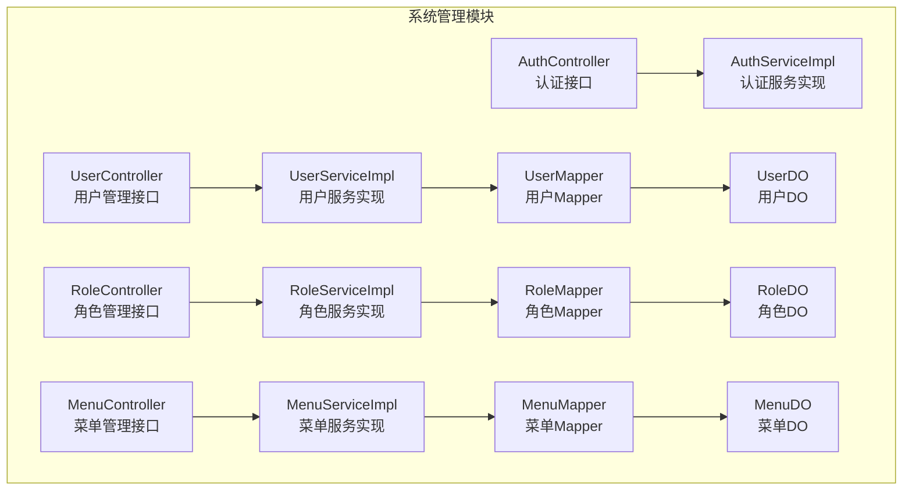

**图表来源**
- [UserController.java:1-75](file://ontograph-module-system/src/main/java/com/graphiti/system/controller/UserController.java#L1-L75)
- [RoleController.java:1-71](file://ontograph-module-system/src/main/java/com/graphiti/system/controller/RoleController.java#L1-L71)
- [MenuController.java:1-79](file://ontograph-module-system/src/main/java/com/graphiti/system/controller/MenuController.java#L1-L79)
- [AuthController.java:1-55](file://ontograph-module-system/src/main/java/com/graphiti/system/controller/AuthController.java#L1-L55)
- [UserServiceImpl.java:1-113](file://ontograph-module-system/src/main/java/com/graphiti/system/service/impl/UserServiceImpl.java#L1-L113)
- [RoleServiceImpl.java:1-81](file://ontograph-module-system/src/main/java/com/graphiti/system/service/impl/RoleServiceImpl.java#L1-L81)
- [MenuServiceImpl.java:1-81](file://ontograph-module-system/src/main/java/com/graphiti/system/service/impl/MenuServiceImpl.java#L1-L81)
- [AuthServiceImpl.java:1-67](file://ontograph-module-system/src/main/java/com/graphiti/system/service/impl/AuthServiceImpl.java#L1-L67)
- [UserMapper.java](file://ontograph-module-system/src/main/java/com/graphiti/system/dal/mysql/UserMapper.java)
- [RoleMapper.java](file://ontograph-module-system/src/main/java/com/graphiti/system/dal/mysql/RoleMapper.java)
- [MenuMapper.java](file://ontograph-module-system/src/main/java/com/graphiti/system/dal/mysql/MenuMapper.java)
- [UserDO.java:1-38](file://ontograph-module-system/src/main/java/com/graphiti/system/dal/dataobject/UserDO.java#L1-L38)
- [RoleDO.java:1-32](file://ontograph-module-system/src/main/java/com/graphiti/system/dal/dataobject/RoleDO.java#L1-L32)
- [MenuDO.java:1-45](file://ontograph-module-system/src/main/java/com/graphiti/system/dal/dataobject/MenuDO.java#L1-L45)

**章节来源**
- [UserController.java:1-75](file://ontograph-module-system/src/main/java/com/graphiti/system/controller/UserController.java#L1-L75)
- [RoleController.java:1-71](file://ontograph-module-system/src/main/java/com/graphiti/system/controller/RoleController.java#L1-L71)
- [MenuController.java:1-79](file://ontograph-module-system/src/main/java/com/graphiti/system/controller/MenuController.java#L1-L79)
- [AuthController.java:1-55](file://ontograph-module-system/src/main/java/com/graphiti/system/controller/AuthController.java#L1-L55)

## 核心组件
本模块的核心组件包括四个控制器与对应的业务服务实现，以及数据访问层。各组件职责清晰，遵循单一职责原则与分层架构。

- 用户管理控制器(UserController)：提供用户创建、更新、删除、详情查询、列表查询等REST接口
- 角色管理控制器(RoleController)：提供角色创建、更新、删除、详情查询、列表查询等REST接口
- 菜单管理控制器(MenuController)：提供菜单创建、更新、删除、详情查询、树形列表查询等REST接口
- 认证控制器(AuthController)：提供登录、获取用户信息、退出登录等REST接口

服务层实现包含业务规则、数据校验、密码加密、软删除、分页查询等逻辑；数据访问层基于MyBatis-Plus，提供基础的增删改查能力。

**章节来源**
- [UserController.java:1-75](file://ontograph-module-system/src/main/java/com/graphiti/system/controller/UserController.java#L1-L75)
- [RoleController.java:1-71](file://ontograph-module-system/src/main/java/com/graphiti/system/controller/RoleController.java#L1-L71)
- [MenuController.java:1-79](file://ontograph-module-system/src/main/java/com/graphiti/system/controller/MenuController.java#L1-L79)
- [AuthController.java:1-55](file://ontograph-module-system/src/main/java/com/graphiti/system/controller/AuthController.java#L1-L55)
- [UserServiceImpl.java:1-113](file://ontograph-module-system/src/main/java/com/graphiti/system/service/impl/UserServiceImpl.java#L1-L113)
- [RoleServiceImpl.java:1-81](file://ontograph-module-system/src/main/java/com/graphiti/system/service/impl/RoleServiceImpl.java#L1-L81)
- [MenuServiceImpl.java:1-81](file://ontograph-module-system/src/main/java/com/graphiti/system/service/impl/MenuServiceImpl.java#L1-L81)
- [AuthServiceImpl.java:1-67](file://ontograph-module-system/src/main/java/com/graphiti/system/service/impl/AuthServiceImpl.java#L1-L67)

## 架构总览
系统管理模块采用经典的三层架构：表现层(Controller)、业务层(Service)、数据访问层(DAL)，并通过Spring Security与JWT实现认证授权。

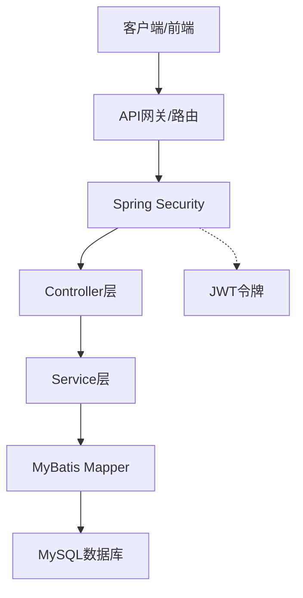

**图表来源**
- [AuthController.java:1-55](file://ontograph-module-system/src/main/java/com/graphiti/system/controller/AuthController.java#L1-L55)
- [AuthServiceImpl.java:1-67](file://ontograph-module-system/src/main/java/com/graphiti/system/service/impl/AuthServiceImpl.java#L1-L67)
- [JwtTokenProvider.java](file://ontograph-framework/graphiti-spring-boot-starter-security/src/main/java/com/graphiti/framework/security/jwt/JwtTokenProvider.java)
- [SecurityConfig.java](file://ontograph-framework/graphiti-spring-boot-starter-security/src/main/java/com/graphiti/framework/security/config/SecurityConfig.java)

## 详细组件分析

### 用户管理组件分析
用户管理模块提供完整的CRUD能力，并内置密码加密、软删除与分页查询等特性。

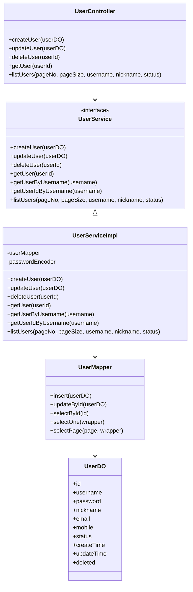

**图表来源**
- [UserController.java:1-75](file://ontograph-module-system/src/main/java/com/graphiti/system/controller/UserController.java#L1-L75)
- [UserService.java:1-61](file://ontograph-module-system/src/main/java/com/graphiti/system/service/UserService.java#L1-L61)
- [UserServiceImpl.java:1-113](file://ontograph-module-system/src/main/java/com/graphiti/system/service/impl/UserServiceImpl.java#L1-L113)
- [UserDO.java:1-38](file://ontograph-module-system/src/main/java/com/graphiti/system/dal/dataobject/UserDO.java#L1-L38)
- [UserMapper.java](file://ontograph-module-system/src/main/java/com/graphiti/system/dal/mysql/UserMapper.java)

**章节来源**
- [UserController.java:1-75](file://ontograph-module-system/src/main/java/com/graphiti/system/controller/UserController.java#L1-L75)
- [UserService.java:1-61](file://ontograph-module-system/src/main/java/com/graphiti/system/service/UserService.java#L1-L61)
- [UserServiceImpl.java:1-113](file://ontograph-module-system/src/main/java/com/graphiti/system/service/impl/UserServiceImpl.java#L1-L113)
- [UserDO.java:1-38](file://ontograph-module-system/src/main/java/com/graphiti/system/dal/dataobject/UserDO.java#L1-L38)

#### 密码管理流程
用户创建时对明文密码进行BCrypt加密存储，确保安全性。

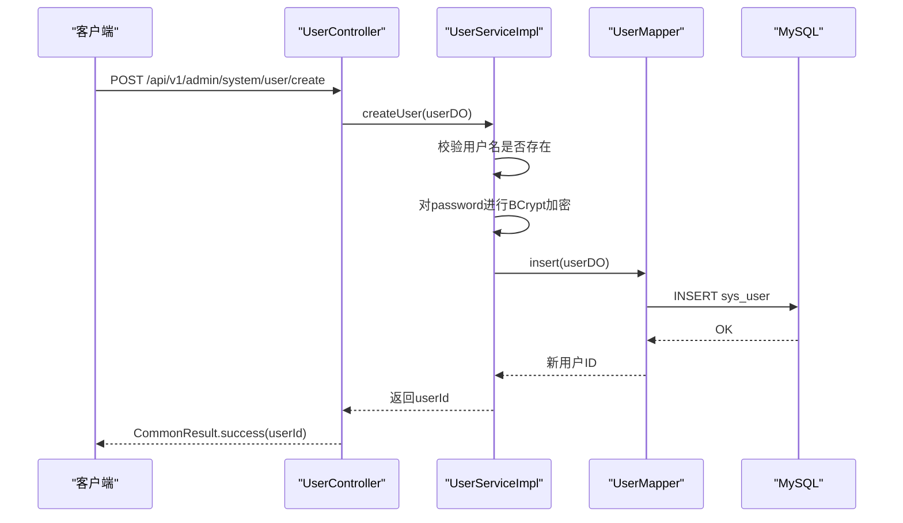

**图表来源**
- [UserController.java:29-35](file://ontograph-module-system/src/main/java/com/graphiti/system/controller/UserController.java#L29-L35)
- [UserServiceImpl.java:30-50](file://ontograph-module-system/src/main/java/com/graphiti/system/service/impl/UserServiceImpl.java#L30-L50)
- [UserMapper.java](file://ontograph-module-system/src/main/java/com/graphiti/system/dal/mysql/UserMapper.java)

**章节来源**
- [UserServiceImpl.java:28-41](file://ontograph-module-system/src/main/java/com/graphiti/system/service/impl/UserServiceImpl.java#L28-L41)

#### 用户状态控制与软删除
用户删除采用软删除策略，通过设置deleted=true标记逻辑删除，避免物理删除造成的数据丢失风险。

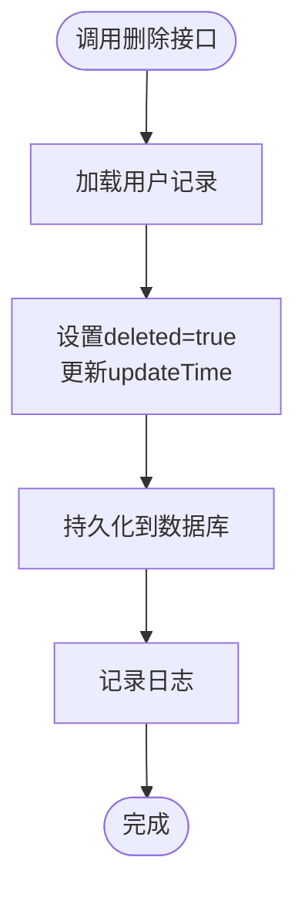

**图表来源**
- [UserServiceImpl.java:59-67](file://ontograph-module-system/src/main/java/com/graphiti/system/service/impl/UserServiceImpl.java#L59-L67)

**章节来源**
- [UserServiceImpl.java:59-67](file://ontograph-module-system/src/main/java/com/graphiti/system/service/impl/UserServiceImpl.java#L59-L67)

### 角色权限管理组件分析
角色管理模块提供角色的创建、更新、删除、查询与列表展示能力，支持按角色编码唯一性约束。

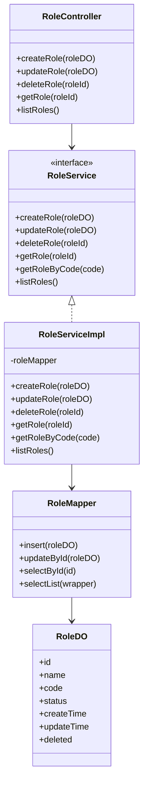

**图表来源**
- [RoleController.java:1-71](file://ontograph-module-system/src/main/java/com/graphiti/system/controller/RoleController.java#L1-L71)
- [RoleService.java:1-49](file://ontograph-module-system/src/main/java/com/graphiti/system/service/RoleService.java#L1-L49)
- [RoleServiceImpl.java:1-81](file://ontograph-module-system/src/main/java/com/graphiti/system/service/impl/RoleServiceImpl.java#L1-L81)
- [RoleDO.java:1-32](file://ontograph-module-system/src/main/java/com/graphiti/system/dal/dataobject/RoleDO.java#L1-L32)
- [RoleMapper.java](file://ontograph-module-system/src/main/java/com/graphiti/system/dal/mysql/RoleMapper.java)

**章节来源**
- [RoleController.java:1-71](file://ontograph-module-system/src/main/java/com/graphiti/system/controller/RoleController.java#L1-L71)
- [RoleService.java:1-49](file://ontograph-module-system/src/main/java/com/graphiti/system/service/RoleService.java#L1-L49)
- [RoleServiceImpl.java:1-81](file://ontograph-module-system/src/main/java/com/graphiti/system/service/impl/RoleServiceImpl.java#L1-L81)
- [RoleDO.java:1-32](file://ontograph-module-system/src/main/java/com/graphiti/system/dal/dataobject/RoleDO.java#L1-L32)

#### RBAC模型实现要点
- 用户与角色：通过用户关联角色实现多对多关系（在本模块中未直接暴露用户-角色关联接口）
- 角色与权限：菜单permission字段作为权限标识，用于前端按钮级权限控制
- 前端路由权限：菜单树结构结合permission字段，实现动态菜单与按钮权限控制

**章节来源**
- [MenuDO.java:25-25](file://ontograph-module-system/src/main/java/com/graphiti/system/dal/dataobject/MenuDO.java#L25-L25)
- [MenuServiceImpl.java:64-70](file://ontograph-module-system/src/main/java/com/graphiti/system/service/impl/MenuServiceImpl.java#L64-L70)

### 菜单管理组件分析
菜单管理模块提供树形结构的菜单列表，支持按权限标识唯一性约束与排序。

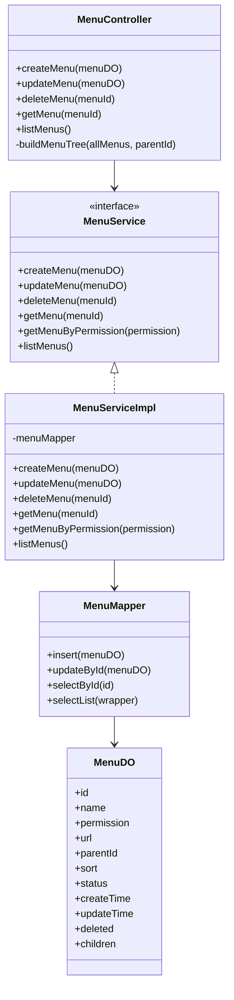

**图表来源**
- [MenuController.java:1-79](file://ontograph-module-system/src/main/java/com/graphiti/system/controller/MenuController.java#L1-L79)
- [MenuService.java:1-49](file://ontograph-module-system/src/main/java/com/graphiti/system/service/MenuService.java#L1-L49)
- [MenuServiceImpl.java:1-81](file://ontograph-module-system/src/main/java/com/graphiti/system/service/impl/MenuServiceImpl.java#L1-L81)
- [MenuDO.java:1-45](file://ontograph-module-system/src/main/java/com/graphiti/system/dal/dataobject/MenuDO.java#L1-L45)
- [MenuMapper.java](file://ontograph-module-system/src/main/java/com/graphiti/system/dal/mysql/MenuMapper.java)

**章节来源**
- [MenuController.java:1-79](file://ontograph-module-system/src/main/java/com/graphiti/system/controller/MenuController.java#L1-L79)
- [MenuService.java:1-49](file://ontograph-module-system/src/main/java/com/graphiti/system/service/MenuService.java#L1-L49)
- [MenuServiceImpl.java:1-81](file://ontograph-module-system/src/main/java/com/graphiti/system/service/impl/MenuServiceImpl.java#L1-L81)
- [MenuDO.java:1-45](file://ontograph-module-system/src/main/java/com/graphiti/system/dal/dataobject/MenuDO.java#L1-L45)

#### 动态菜单生成流程
后端提供树形菜单列表，前端根据permission字段与用户权限集合进行渲染与按钮级权限控制。

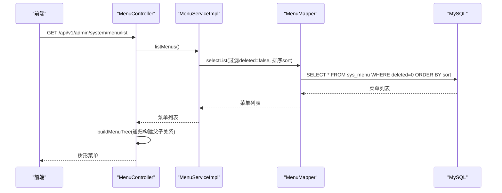

**图表来源**
- [MenuController.java:64-77](file://ontograph-module-system/src/main/java/com/graphiti/system/controller/MenuController.java#L64-L77)
- [MenuServiceImpl.java:73-79](file://ontograph-module-system/src/main/java/com/graphiti/system/service/impl/MenuServiceImpl.java#L73-L79)
- [MenuMapper.java](file://ontograph-module-system/src/main/java/com/graphiti/system/dal/mysql/MenuMapper.java)

**章节来源**
- [MenuController.java:72-77](file://ontograph-module-system/src/main/java/com/graphiti/system/controller/MenuController.java#L72-L77)
- [MenuServiceImpl.java:73-79](file://ontograph-module-system/src/main/java/com/graphiti/system/service/impl/MenuServiceImpl.java#L73-L79)

### 认证组件分析
认证模块提供登录、获取用户信息、退出登录等接口，基于Spring Security与JWT实现。

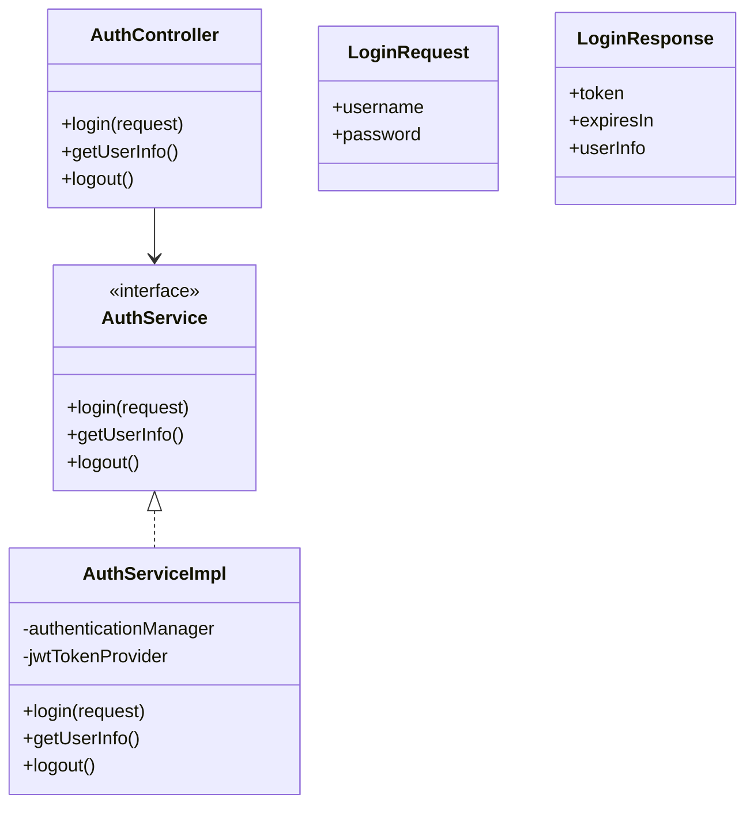

**图表来源**
- [AuthController.java:1-55](file://ontograph-module-system/src/main/java/com/graphiti/system/controller/AuthController.java#L1-L55)
- [AuthService.java:1-26](file://ontograph-module-system/src/main/java/com/graphiti/system/service/AuthService.java#L1-L26)
- [AuthServiceImpl.java:1-67](file://ontograph-module-system/src/main/java/com/graphiti/system/service/impl/AuthServiceImpl.java#L1-L67)
- [JwtTokenProvider.java](file://ontograph-framework/graphiti-spring-boot-starter-security/src/main/java/com/graphiti/framework/security/jwt/JwtTokenProvider.java)

**章节来源**
- [AuthController.java:1-55](file://ontograph-module-system/src/main/java/com/graphiti/system/controller/AuthController.java#L1-L55)
- [AuthService.java:1-26](file://ontograph-module-system/src/main/java/com/graphiti/system/service/AuthService.java#L1-L26)
- [AuthServiceImpl.java:1-67](file://ontograph-module-system/src/main/java/com/graphiti/system/service/impl/AuthServiceImpl.java#L1-L67)

#### 登录认证序列
用户提交用户名与密码，后端通过AuthenticationManager验证，成功后使用JwtTokenProvider生成JWT令牌。

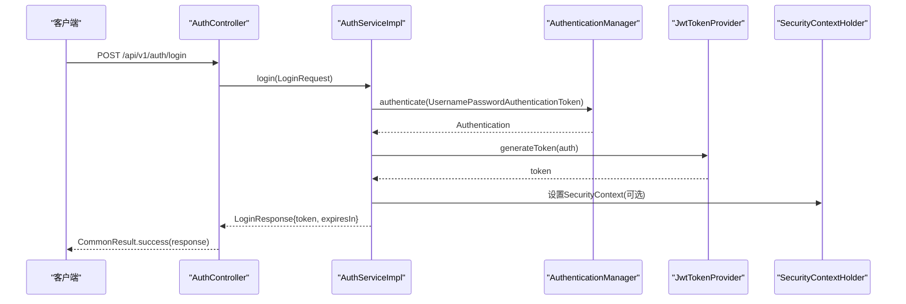

**图表来源**
- [AuthController.java:27-32](file://ontograph-module-system/src/main/java/com/graphiti/system/controller/AuthController.java#L27-L32)
- [AuthServiceImpl.java:26-44](file://ontograph-module-system/src/main/java/com/graphiti/system/service/impl/AuthServiceImpl.java#L26-L44)
- [JwtTokenProvider.java](file://ontograph-framework/graphiti-spring-boot-starter-security/src/main/java/com/graphiti/framework/security/jwt/JwtTokenProvider.java)

**章节来源**
- [AuthServiceImpl.java:26-44](file://ontograph-module-system/src/main/java/com/graphiti/system/service/impl/AuthServiceImpl.java#L26-L44)

## 依赖关系分析
系统管理模块与框架层、通用层存在明确的依赖关系，确保安全、异常处理与统一响应的一致性。

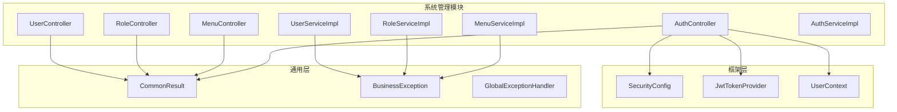

**图表来源**
- [UserController.java:1-75](file://ontograph-module-system/src/main/java/com/graphiti/system/controller/UserController.java#L1-L75)
- [RoleController.java:1-71](file://ontograph-module-system/src/main/java/com/graphiti/system/controller/RoleController.java#L1-L71)
- [MenuController.java:1-79](file://ontograph-module-system/src/main/java/com/graphiti/system/controller/MenuController.java#L1-L79)
- [AuthController.java:1-55](file://ontograph-module-system/src/main/java/com/graphiti/system/controller/AuthController.java#L1-L55)
- [CommonResult.java](file://ontograph-framework/graphiti-common/src/main/java/com/graphiti/common/response/CommonResult.java)
- [BusinessException.java](file://ontograph-framework/graphiti-common/src/main/java/com/graphiti/common/exception/BusinessException.java)
- [GlobalExceptionHandler.java](file://ontograph-framework/graphiti-common/src/main/java/com/graphiti/common/exception/GlobalExceptionHandler.java)
- [SecurityConfig.java](file://ontograph-framework/graphiti-spring-boot-starter-security/src/main/java/com/graphiti/framework/security/config/SecurityConfig.java)
- [JwtTokenProvider.java](file://ontograph-framework/graphiti-spring-boot-starter-security/src/main/java/com/graphiti/framework/security/jwt/JwtTokenProvider.java)

**章节来源**
- [CommonResult.java](file://ontograph-framework/graphiti-common/src/main/java/com/graphiti/common/response/CommonResult.java)
- [BusinessException.java](file://ontograph-framework/graphiti-common/src/main/java/com/graphiti/common/exception/BusinessException.java)
- [GlobalExceptionHandler.java](file://ontograph-framework/graphiti-common/src/main/java/com/graphiti/common/exception/GlobalExceptionHandler.java)
- [SecurityConfig.java](file://ontograph-framework/graphiti-spring-boot-starter-security/src/main/java/com/graphiti/framework/security/config/SecurityConfig.java)
- [JwtTokenProvider.java](file://ontograph-framework/graphiti-spring-boot-starter-security/src/main/java/com/graphiti/framework/security/jwt/JwtTokenProvider.java)

## 性能考虑
- 分页查询：用户列表查询使用MyBatis-Plus Page分页，避免一次性加载大量数据
- 查询条件：支持模糊匹配与精确筛选，建议在高频查询字段建立索引
- 缓存策略：对于菜单树与字典类数据，可在应用层引入Redis缓存以减少数据库压力
- 密码加密：BCrypt成本因子可根据硬件性能调整，平衡安全与性能
- 并发控制：软删除与乐观锁可结合使用，避免并发修改冲突

## 故障排除指南
- 业务异常：模块内通过BusinessException抛出业务错误码与消息，便于前端统一处理
- 全局异常：GlobalExceptionHandler提供全局异常捕获与标准化响应
- 安全异常：SecurityConfig配置了路径匹配与JWT过滤器，确保接口受保护

常见问题与处理：
- 用户名重复：创建用户时若用户名已存在，将抛出业务异常
- 角色编码重复：创建角色时若编码已存在，将抛出业务异常
- 权限标识重复：创建菜单时若权限标识已存在，将抛出业务异常
- 未认证访问：访问需要认证的接口时，需携带有效JWT令牌

**章节来源**
- [UserServiceImpl.java:34-36](file://ontograph-module-system/src/main/java/com/graphiti/system/service/impl/UserServiceImpl.java#L34-L36)
- [RoleServiceImpl.java:27-30](file://ontograph-module-system/src/main/java/com/graphiti/system/service/impl/RoleServiceImpl.java#L27-L30)
- [MenuServiceImpl.java:27-30](file://ontograph-module-system/src/main/java/com/graphiti/system/service/impl/MenuServiceImpl.java#L27-L30)
- [BusinessException.java](file://ontograph-framework/graphiti-common/src/main/java/com/graphiti/common/exception/BusinessException.java)
- [GlobalExceptionHandler.java](file://ontograph-framework/graphiti-common/src/main/java/com/graphiti/common/exception/GlobalExceptionHandler.java)

## 结论
ontograph-module-system模块实现了完善的系统管理能力，涵盖用户、角色、菜单与认证四大核心领域。通过清晰的分层架构、统一的响应格式与安全框架集成，模块具备良好的可维护性与扩展性。建议后续在菜单权限与用户-角色关联方面进一步完善，以支撑更复杂的RBAC场景。

## 附录

### 数据库表结构与初始化
系统管理模块涉及的主要表包括sys_user、sys_role、sys_menu等，初始化脚本位于sql/mysql目录。

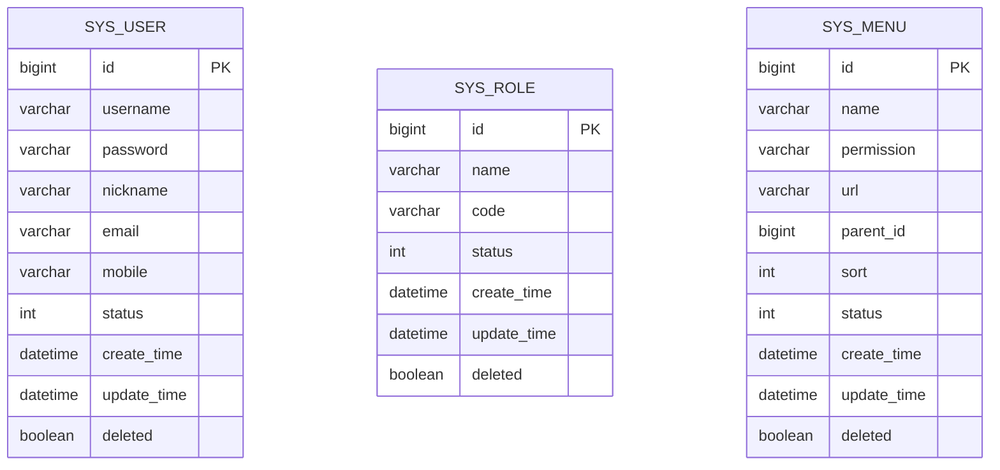

**图表来源**
- [UserDO.java:14-37](file://ontograph-module-system/src/main/java/com/graphiti/system/dal/dataobject/UserDO.java#L14-L37)
- [RoleDO.java:14-31](file://ontograph-module-system/src/main/java/com/graphiti/system/dal/dataobject/RoleDO.java#L14-L31)
- [MenuDO.java:17-44](file://ontograph-module-system/src/main/java/com/graphiti/system/dal/dataobject/MenuDO.java#L17-L44)
- [schema.sql](file://sql/mysql/schema.sql)

**章节来源**
- [schema.sql](file://sql/mysql/schema.sql)
- [init-data.sql](file://sql/mysql/init-data.sql)

### API接口文档

- 用户管理
  - POST /api/v1/admin/system/user/create：创建用户
  - PUT /api/v1/admin/system/user/update：更新用户
  - DELETE /api/v1/admin/system/user/delete/{userId}：删除用户
  - GET /api/v1/admin/system/user/get/{userId}：获取用户详情
  - GET /api/v1/admin/system/user/list?pageNo=1&pageSize=10：获取用户列表（支持username、nickname、status筛选）

- 角色管理
  - POST /api/v1/admin/system/role/create：创建角色
  - PUT /api/v1/admin/system/role/update：更新角色
  - DELETE /api/v1/admin/system/role/delete/{roleId}：删除角色
  - GET /api/v1/admin/system/role/get/{roleId}：获取角色详情
  - GET /api/v1/admin/system/role/list：获取角色列表

- 菜单管理
  - POST /api/v1/admin/system/menu/create：创建菜单
  - PUT /api/v1/admin/system/menu/update：更新菜单
  - DELETE /api/v1/admin/system/menu/delete/{menuId}：删除菜单
  - GET /api/v1/admin/system/menu/get/{menuId}：获取菜单详情
  - GET /api/v1/admin/system/menu/list：获取菜单树形列表

- 认证管理
  - POST /api/v1/auth/login：用户登录
  - GET /api/v1/auth/info：获取当前用户信息
  - POST /api/v1/auth/logout：用户退出登录

使用示例（以curl为例）：
- 登录获取令牌
  - curl -X POST http://localhost:8080/api/v1/auth/login -H "Content-Type: application/json" -d '{"username":"admin","password":"password"}'
- 获取用户信息（需携带Authorization: Bearer <token>）
  - curl -X GET http://localhost:8080/api/v1/auth/info -H "Authorization: Bearer <token>"
- 创建用户
  - curl -X POST http://localhost:8080/api/v1/admin/system/user/create -H "Authorization: Bearer <token>" -H "Content-Type: application/json" -d '{"username":"test","password":"password","nickname":"测试用户"}'

**章节来源**
- [UserController.java:29-73](file://ontograph-module-system/src/main/java/com/graphiti/system/controller/UserController.java#L29-L73)
- [RoleController.java:30-69](file://ontograph-module-system/src/main/java/com/graphiti/system/controller/RoleController.java#L30-L69)
- [MenuController.java:30-70](file://ontograph-module-system/src/main/java/com/graphiti/system/controller/MenuController.java#L30-L70)
- [AuthController.java:27-53](file://ontograph-module-system/src/main/java/com/graphiti/system/controller/AuthController.java#L27-L53)