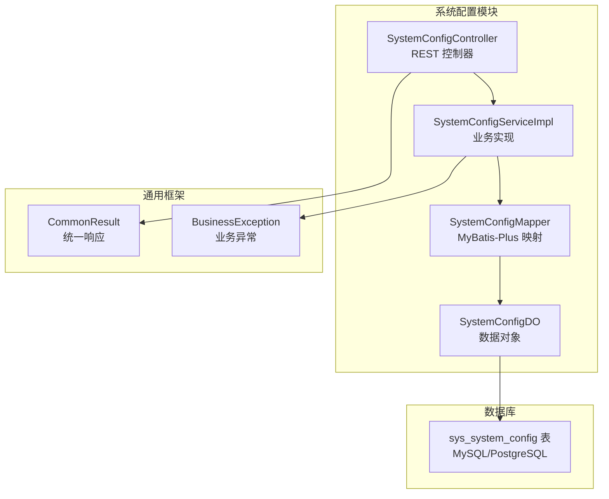
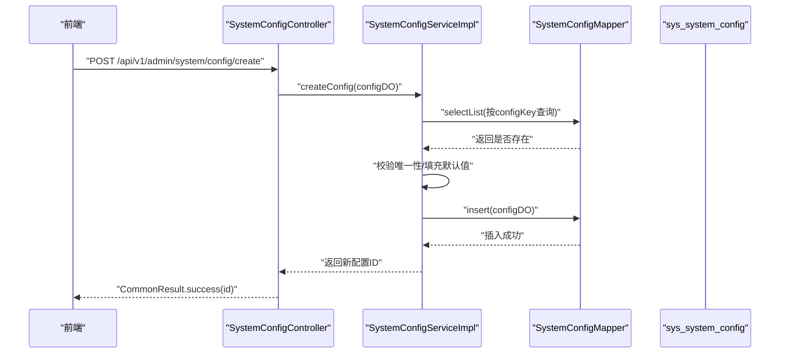
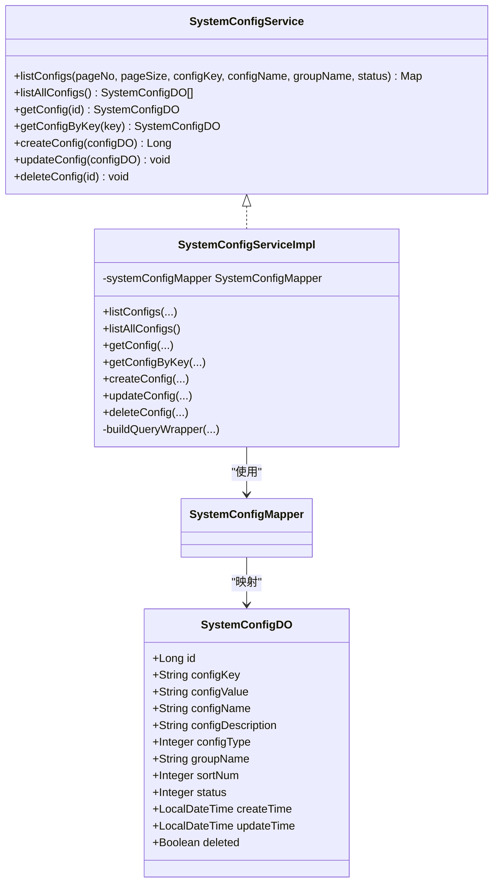
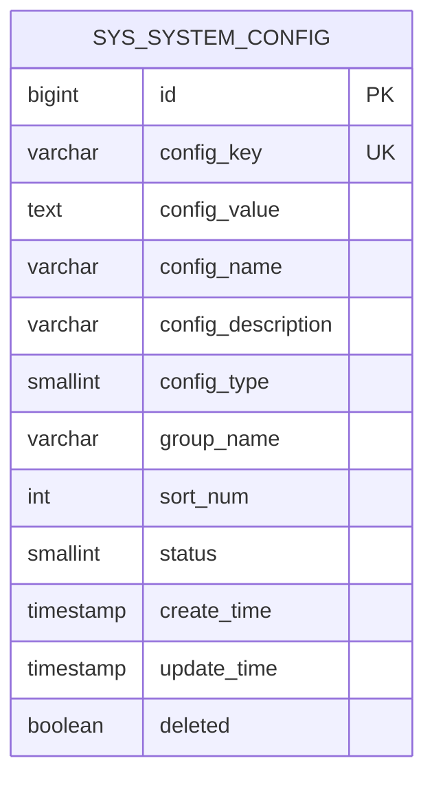
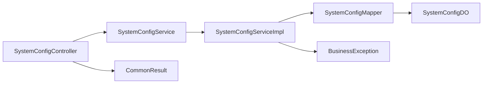

# 系统配置管理

<!--<cite>
**本文档引用的文件**
- [SystemConfigController.java](file://graphiti-module-system/src/main/java/com/graphiti/system/controller/SystemConfigController.java)
- [SystemConfigService.java](file://graphiti-module-system/src/main/java/com/graphiti/system/service/SystemConfigService.java)
- [SystemConfigServiceImpl.java](file://graphiti-module-system/src/main/java/com/graphiti/system/service/impl/SystemConfigServiceImpl.java)
- [SystemConfigDO.java](file://graphiti-module-system/src/main/java/com/graphiti/system/dal/dataobject/SystemConfigDO.java)
- [SystemConfigMapper.java](file://graphiti-module-system/src/main/java/com/graphiti/system/dal/mysql/SystemConfigMapper.java)
- [BusinessException.java](file://graphiti-framework/graphiti-common/src/main/java/com/graphiti/common/exception/BusinessException.java)
- [CommonResult.java](file://graphiti-framework/graphiti-common/src/main/java/com/graphiti/common/response/CommonResult.java)
- [schema.sql(MySQL)](file://sql/mysql/schema.sql)
- [schema.sql(PostgreSQL)](file://sql/postgresql/schema.sql)
- [index.vue](file://graphiti-web/src/views/system/config/index.vue)
- [system.ts](file://graphiti-web/src/api/system.ts)
</cite>-->

## 目录
1. [简介](#简介)
2. [项目结构](#项目结构)
3. [核心组件](#核心组件)
4. [架构总览](#架构总览)
5. [详细组件分析](#详细组件分析)
6. [依赖关系分析](#依赖关系分析)
7. [性能考虑](#性能考虑)
8. [故障排查指南](#故障排查指南)
9. [结论](#结论)
10. [附录](#附录)

## 简介
本文件系统性梳理系统配置管理模块，围绕以下目标展开：
- 全面解析 SystemConfigController 的系统配置管理接口，覆盖配置项的增删改查、分组与状态管理、查询过滤等能力
- 深入分析 SystemConfigService 接口与 SystemConfigServiceImpl 实现类，阐明配置存储、查询构建、软删除与日志记录等实现细节
- 详解 SystemConfigDO 数据对象设计，明确配置项的分类、类型、排序与状态字段
- 说明配置的持久化存储、运行时更新与版本控制现状，并给出可扩展建议
- 提供完整的 API 接口清单与配置模板示例，便于前后端对接与集成

## 项目结构
系统配置管理模块位于 graphiti-module-system 子模块中，采用典型的分层架构：
- 控制层：SystemConfigController 提供 RESTful 接口
- 服务层：SystemConfigService 定义接口，SystemConfigServiceImpl 实现业务逻辑
- 数据访问层：SystemConfigMapper 继承 MyBatis-Plus 基础映射接口
- 数据对象：SystemConfigDO 映射 sys_system_config 表
- 统一响应与异常：CommonResult、BusinessException 提供统一返回与异常处理



图表来源
- [SystemConfigController.java:1-83](file://graphiti-module-system/src/main/java/com/graphiti/system/controller/SystemConfigController.java#L1-L83)
- [SystemConfigServiceImpl.java:1-123](file://graphiti-module-system/src/main/java/com/graphiti/system/service/impl/SystemConfigServiceImpl.java#L1-L123)
- [SystemConfigMapper.java:1-13](file://graphiti-module-system/src/main/java/com/graphiti/system/dal/mysql/SystemConfigMapper.java#L1-L13)
- [SystemConfigDO.java:1-42](file://graphiti-module-system/src/main/java/com/graphiti/system/dal/dataobject/SystemConfigDO.java#L1-L42)
- [CommonResult.java:1-68](file://graphiti-framework/graphiti-common/src/main/java/com/graphiti/common/response/CommonResult.java#L1-L68)
- [BusinessException.java:1-33](file://graphiti-framework/graphiti-common/src/main/java/com/graphiti/common/exception/BusinessException.java#L1-L33)
- [schema.sql(MySQL):164-180](file://sql/mysql/schema.sql#L164-L180)
- [schema.sql(PostgreSQL):273-291](file://sql/postgresql/schema.sql#L273-L291)

章节来源
- [SystemConfigController.java:1-83](file://graphiti-module-system/src/main/java/com/graphiti/system/controller/SystemConfigController.java#L1-L83)
- [SystemConfigService.java:1-48](file://graphiti-module-system/src/main/java/com/graphiti/system/service/SystemConfigService.java#L1-L48)
- [SystemConfigServiceImpl.java:1-123](file://graphiti-module-system/src/main/java/com/graphiti/system/service/impl/SystemConfigServiceImpl.java#L1-L123)
- [SystemConfigDO.java:1-42](file://graphiti-module-system/src/main/java/com/graphiti/system/dal/dataobject/SystemConfigDO.java#L1-L42)
- [SystemConfigMapper.java:1-13](file://graphiti-module-system/src/main/java/com/graphiti/system/dal/mysql/SystemConfigMapper.java#L1-L13)
- [CommonResult.java:1-68](file://graphiti-framework/graphiti-common/src/main/java/com/graphiti/common/response/CommonResult.java#L1-L68)
- [BusinessException.java:1-33](file://graphiti-framework/graphiti-common/src/main/java/com/graphiti/common/exception/BusinessException.java#L1-L33)
- [schema.sql(MySQL):164-180](file://sql/mysql/schema.sql#L164-L180)
- [schema.sql(PostgreSQL):273-291](file://sql/postgresql/schema.sql#L273-L291)

## 核心组件
- SystemConfigController：提供配置的分页查询、全量查询、详情查询、按 key 查询、创建、更新、删除等接口，均通过 CommonResult 包装统一响应
- SystemConfigService：定义配置管理的业务契约，包括分页查询、全量查询、详情查询、按 key 查询、创建、更新、删除
- SystemConfigServiceImpl：实现业务逻辑，包含查询条件构建、唯一性校验、默认值填充、软删除、日志记录等
- SystemConfigDO：映射 sys_system_config 表，包含配置键、值、名称、描述、类型、分组、排序、状态、时间戳与软删除标记
- SystemConfigMapper：基于 MyBatis-Plus 的基础映射接口，提供 CRUD 能力
- 统一响应与异常：CommonResult 统一返回格式；BusinessException 提供业务异常与错误码

章节来源
- [SystemConfigController.java:28-81](file://graphiti-module-system/src/main/java/com/graphiti/system/controller/SystemConfigController.java#L28-L81)
- [SystemConfigService.java:10-47](file://graphiti-module-system/src/main/java/com/graphiti/system/service/SystemConfigService.java#L10-L47)
- [SystemConfigServiceImpl.java:27-121](file://graphiti-module-system/src/main/java/com/graphiti/system/service/impl/SystemConfigServiceImpl.java#L27-L121)
- [SystemConfigDO.java:17-41](file://graphiti-module-system/src/main/java/com/graphiti/system/dal/dataobject/SystemConfigDO.java#L17-L41)
- [SystemConfigMapper.java:10-12](file://graphiti-module-system/src/main/java/com/graphiti/system/dal/mysql/SystemConfigMapper.java#L10-L12)
- [CommonResult.java:39-53](file://graphiti-framework/graphiti-common/src/main/java/com/graphiti/common/response/CommonResult.java#L39-L53)
- [BusinessException.java:20-31](file://graphiti-framework/graphiti-common/src/main/java/com/graphiti/common/exception/BusinessException.java#L20-L31)

## 架构总览
系统配置管理采用经典的 MVC + 分层架构，控制层负责请求接入与参数校验，服务层封装业务规则，数据访问层负责持久化，数据对象承载模型。



图表来源
- [SystemConfigController.java:60-64](file://graphiti-module-system/src/main/java/com/graphiti/system/controller/SystemConfigController.java#L60-L64)
- [SystemConfigServiceImpl.java:69-85](file://graphiti-module-system/src/main/java/com/graphiti/system/service/impl/SystemConfigServiceImpl.java#L69-L85)
- [SystemConfigMapper.java:10-12](file://graphiti-module-system/src/main/java/com/graphiti/system/dal/mysql/SystemConfigMapper.java#L10-L12)

## 详细组件分析

### SystemConfigController 接口设计
- 分页查询：支持按配置键、配置名、分组、状态过滤，返回分页结果
- 全量查询：返回所有未删除配置，按分组与排序字段排序
- 详情查询：按 ID 查询配置详情，不存在时抛出业务异常
- 按 key 查询：按配置键查询，返回第一条匹配记录
- 创建配置：校验配置键唯一性，填充默认值后入库
- 更新配置：按 ID 更新，仅更新传入字段
- 删除配置：软删除，设置 deleted=true 并更新时间

```mermaid
flowchart TD
Start(["请求进入"]) --> Route{"路由匹配"}
Route --> |GET /list| List["分页查询<br/>listConfigs(...)"]
Route --> |GET /all| All["全量查询<br/>listAllConfigs()"]
Route --> |GET /{id}| Detail["详情查询<br/>getConfig(id)"]
Route --> |GET /key/{key}| ByKey["按key查询<br/>getConfigByKey(key)"]
Route --> |POST /create| Create["创建配置<br/>createConfig(...)"]
Route --> |PUT /{id}| Update["更新配置<br/>updateConfig(...)"]
Route --> |DELETE /{id}| Delete["删除配置<br/>deleteConfig(id)"]
List --> Resp["CommonResult.success(Map)"]
All --> Resp
Detail --> Resp
ByKey --> Resp
Create --> Resp
Update --> Resp
Delete --> Resp
```

图表来源
- [SystemConfigController.java:28-81](file://graphiti-module-system/src/main/java/com/graphiti/system/controller/SystemConfigController.java#L28-L81)
- [CommonResult.java:39-53](file://graphiti-framework/graphiti-common/src/main/java/com/graphiti/common/response/CommonResult.java#L39-L53)

章节来源
- [SystemConfigController.java:28-81](file://graphiti-module-system/src/main/java/com/graphiti/system/controller/SystemConfigController.java#L28-L81)

### SystemConfigService 接口与 SystemConfigServiceImpl 实现
- 查询构建：buildQueryWrapper 支持按 configKey、configName、groupName、status 构建查询条件，且始终过滤 deleted=false
- 分页与排序：listConfigs 使用 MyBatis-Plus 分页，按分组与排序字段升序排列
- 默认值填充：创建时自动填充时间戳、状态、类型、排序等字段
- 唯一性校验：创建前检查 configKey 是否已存在，避免重复
- 软删除：删除时仅更新 deleted 与时间戳，不物理移除记录
- 日志记录：关键操作记录 INFO 级日志，便于审计与排障



图表来源
- [SystemConfigService.java:10-47](file://graphiti-module-system/src/main/java/com/graphiti/system/service/SystemConfigService.java#L10-L47)
- [SystemConfigServiceImpl.java:23-121](file://graphiti-module-system/src/main/java/com/graphiti/system/service/impl/SystemConfigServiceImpl.java#L23-L121)
- [SystemConfigMapper.java:10-12](file://graphiti-module-system/src/main/java/com/graphiti/system/dal/mysql/SystemConfigMapper.java#L10-L12)
- [SystemConfigDO.java:17-41](file://graphiti-module-system/src/main/java/com/graphiti/system/dal/dataobject/SystemConfigDO.java#L17-L41)

章节来源
- [SystemConfigService.java:10-47](file://graphiti-module-system/src/main/java/com/graphiti/system/service/SystemConfigService.java#L10-L47)
- [SystemConfigServiceImpl.java:27-121](file://graphiti-module-system/src/main/java/com/graphiti/system/service/impl/SystemConfigServiceImpl.java#L27-L121)
- [SystemConfigMapper.java:10-12](file://graphiti-module-system/src/main/java/com/graphiti/system/dal/mysql/SystemConfigMapper.java#L10-L12)
- [SystemConfigDO.java:17-41](file://graphiti-module-system/src/main/java/com/graphiti/system/dal/dataobject/SystemConfigDO.java#L17-L41)

### SystemConfigDO 数据对象设计
- 主键与唯一约束：configKey 唯一，防止重复配置
- 类型枚举：configType 支持 文本、数字、布尔、JSON 四种类型，便于前端渲染与校验
- 分组与排序：groupName 与 sortNum 支持配置分类与展示顺序
- 状态与软删除：status 启用/禁用，deleted 逻辑删除
- 时间戳：createTime、updateTime 记录创建与更新时间



图表来源
- [schema.sql(MySQL):164-180](file://sql/mysql/schema.sql#L164-L180)
- [schema.sql(PostgreSQL):273-291](file://sql/postgresql/schema.sql#L273-L291)

章节来源
- [SystemConfigDO.java:17-41](file://graphiti-module-system/src/main/java/com/graphiti/system/dal/dataobject/SystemConfigDO.java#L17-L41)
- [schema.sql(MySQL):164-180](file://sql/mysql/schema.sql#L164-L180)
- [schema.sql(PostgreSQL):273-291](file://sql/postgresql/schema.sql#L273-L291)

### 配置持久化、运行时更新与版本控制
- 持久化存储：基于 sys_system_config 表，支持 MySQL 与 PostgreSQL 两种方言
- 运行时更新：当前实现为直接写入数据库，未引入缓存与热更新机制
- 版本控制：未实现配置版本表或变更历史记录，如需版本回滚可在后续扩展

章节来源
- [schema.sql(MySQL):164-180](file://sql/mysql/schema.sql#L164-L180)
- [schema.sql(PostgreSQL):273-291](file://sql/postgresql/schema.sql#L273-L291)
- [SystemConfigServiceImpl.java:69-102](file://graphiti-module-system/src/main/java/com/graphiti/system/service/impl/SystemConfigServiceImpl.java#L69-L102)

### 前端对接与配置模板示例
- 前端页面：提供配置列表、分组、表单校验与提交流程
- API 对接：前端通过 system.ts 调用后端接口，包括分页查询、创建、更新、删除与分组获取
- 配置模板示例（概念性说明）：
  - 文本型：configType=1，groupName=“业务参数”，status=1
  - 数字型：configType=2，groupName=“性能阈值”，默认值为整数
  - 布尔型：configType=3，groupName=“开关控制”，值为 true/false
  - JSON型：configType=4，groupName=“策略配置”，值为合法 JSON 字符串

章节来源
- [index.vue:140-496](file://graphiti-web/src/views/system/config/index.vue#L140-L496)
- [system.ts:137-175](file://graphiti-web/src/api/system.ts#L137-L175)

## 依赖关系分析
- 控制层依赖服务层接口，确保业务解耦
- 服务层依赖数据访问层与异常处理工具
- 数据访问层依赖 MyBatis-Plus 基础能力与数据库驱动
- 统一响应与异常贯穿各层，保证错误处理一致性



图表来源
- [SystemConfigController.java:26-26](file://graphiti-module-system/src/main/java/com/graphiti/system/controller/SystemConfigController.java#L26-L26)
- [SystemConfigService.java:10-47](file://graphiti-module-system/src/main/java/com/graphiti/system/service/SystemConfigService.java#L10-L47)
- [SystemConfigServiceImpl.java:25-25](file://graphiti-module-system/src/main/java/com/graphiti/system/service/impl/SystemConfigServiceImpl.java#L25-L25)
- [SystemConfigMapper.java:10-12](file://graphiti-module-system/src/main/java/com/graphiti/system/dal/mysql/SystemConfigMapper.java#L10-L12)
- [SystemConfigDO.java:17-41](file://graphiti-module-system/src/main/java/com/graphiti/system/dal/dataobject/SystemConfigDO.java#L17-L41)
- [CommonResult.java:39-53](file://graphiti-framework/graphiti-common/src/main/java/com/graphiti/common/response/CommonResult.java#L39-L53)
- [BusinessException.java:20-31](file://graphiti-framework/graphiti-common/src/main/java/com/graphiti/common/exception/BusinessException.java#L20-L31)

章节来源
- [SystemConfigController.java:26-26](file://graphiti-module-system/src/main/java/com/graphiti/system/controller/SystemConfigController.java#L26-L26)
- [SystemConfigService.java:10-47](file://graphiti-module-system/src/main/java/com/graphiti/system/service/SystemConfigService.java#L10-L47)
- [SystemConfigServiceImpl.java:25-25](file://graphiti-module-system/src/main/java/com/graphiti/system/service/impl/SystemConfigServiceImpl.java#L25-L25)
- [SystemConfigMapper.java:10-12](file://graphiti-module-system/src/main/java/com/graphiti/system/dal/mysql/SystemConfigMapper.java#L10-L12)
- [SystemConfigDO.java:17-41](file://graphiti-module-system/src/main/java/com/graphiti/system/dal/dataobject/SystemConfigDO.java#L17-L41)
- [CommonResult.java:39-53](file://graphiti-framework/graphiti-common/src/main/java/com/graphiti/common/response/CommonResult.java#L39-L53)
- [BusinessException.java:20-31](file://graphiti-framework/graphiti-common/src/main/java/com/graphiti/common/exception/BusinessException.java#L20-L31)

## 性能考虑
- 查询性能：建议在 group_name 与 deleted 字段上建立索引（数据库脚本已包含），并结合分页避免一次性加载过多数据
- 写入性能：批量创建/更新可通过 MyBatis-Plus 批处理优化（当前实现逐条写入）
- 缓存与热更新：当前未引入缓存层，建议在应用启动时加载全量配置到内存，并通过事件或轮询实现热更新
- 日志开销：INFO 级日志记录频繁，生产环境可根据需要调整日志级别

## 故障排查指南
- 配置键冲突：创建时若 configKey 已存在，将抛出业务异常，检查唯一性约束与输入值
- 配置不存在：按 ID 查询不存在时抛出业务异常，确认 ID 正确与未被软删除
- 参数校验：前端表单对必填字段进行校验，后端同样进行参数校验，确保数据完整性
- 统一响应：所有接口返回 CommonResult，错误码与消息由框架统一处理

章节来源
- [SystemConfigServiceImpl.java:55-58](file://graphiti-module-system/src/main/java/com/graphiti/system/service/impl/SystemConfigServiceImpl.java#L55-L58)
- [SystemConfigServiceImpl.java:73-75](file://graphiti-module-system/src/main/java/com/graphiti/system/service/impl/SystemConfigServiceImpl.java#L73-L75)
- [BusinessException.java:20-31](file://graphiti-framework/graphiti-common/src/main/java/com/graphiti/common/exception/BusinessException.java#L20-L31)
- [CommonResult.java:61-66](file://graphiti-framework/graphiti-common/src/main/java/com/graphiti/common/response/CommonResult.java#L61-L66)

## 结论
系统配置管理模块实现了配置的全生命周期管理，具备良好的可扩展性与可维护性。当前实现以数据库为中心，未引入缓存与版本控制，适合中小规模场景。建议后续引入缓存与热更新机制，并增加配置版本与变更审计能力，以满足更高可用与合规要求。

## 附录

### API 接口清单
- GET /api/v1/admin/system/config/list：分页查询系统配置
- GET /api/v1/admin/system/config/all：获取所有配置（全量）
- GET /api/v1/admin/system/config/{id}：获取配置详情
- GET /api/v1/admin/system/config/key/{key}：根据 key 获取配置
- POST /api/v1/admin/system/config/create：创建系统配置
- PUT /api/v1/admin/system/config/{id}：更新系统配置
- DELETE /api/v1/admin/system/config/{id}：删除系统配置

章节来源
- [SystemConfigController.java:28-81](file://graphiti-module-system/src/main/java/com/graphiti/system/controller/SystemConfigController.java#L28-L81)
- [system.ts:137-175](file://graphiti-web/src/api/system.ts#L137-L175)

### 配置模板示例（概念性说明）
- 文本型：configType=1，groupName=“业务参数”，status=1
- 数字型：configType=2，groupName=“性能阈值”，默认值为整数
- 布尔型：configType=3，groupName=“开关控制”，值为 true/false
- JSON型：configType=4，groupName=“策略配置”，值为合法 JSON 字符串

章节来源
- [index.vue:151-158](file://graphiti-web/src/views/system/config/index.vue#L151-L158)
- [SystemConfigDO.java:28-28](file://graphiti-module-system/src/main/java/com/graphiti/system/dal/dataobject/SystemConfigDO.java#L28-L28)