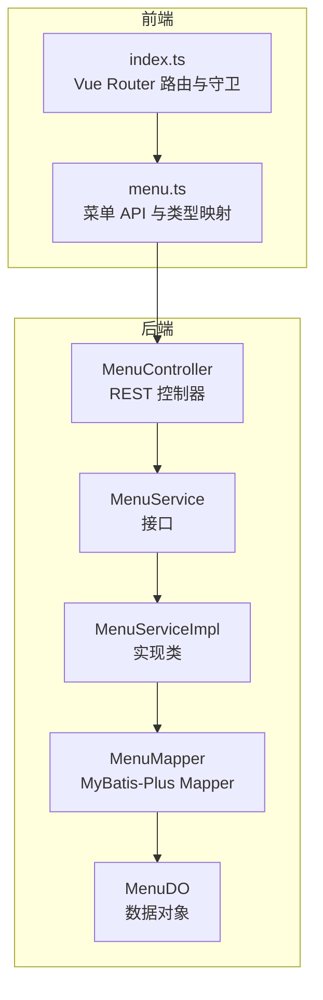
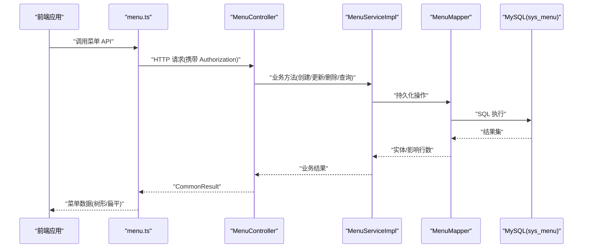
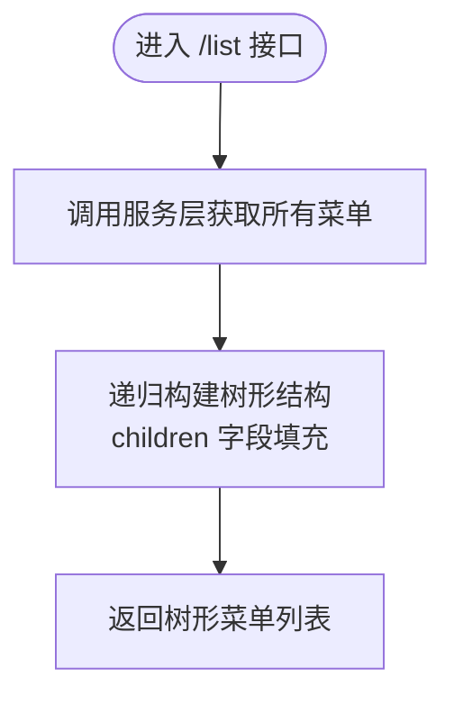
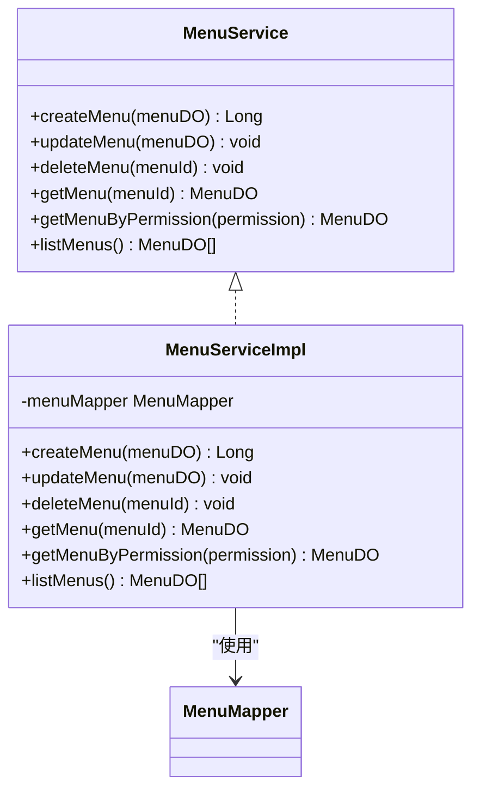
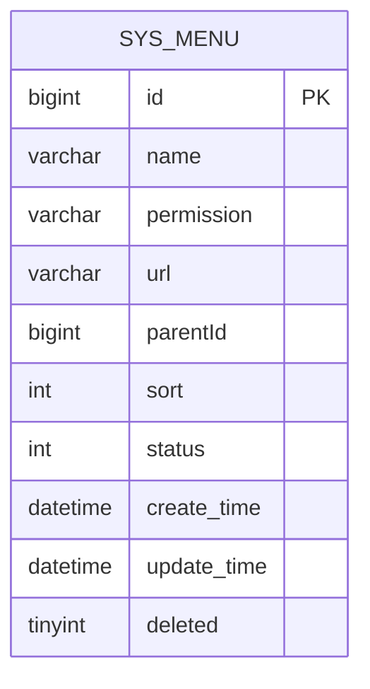
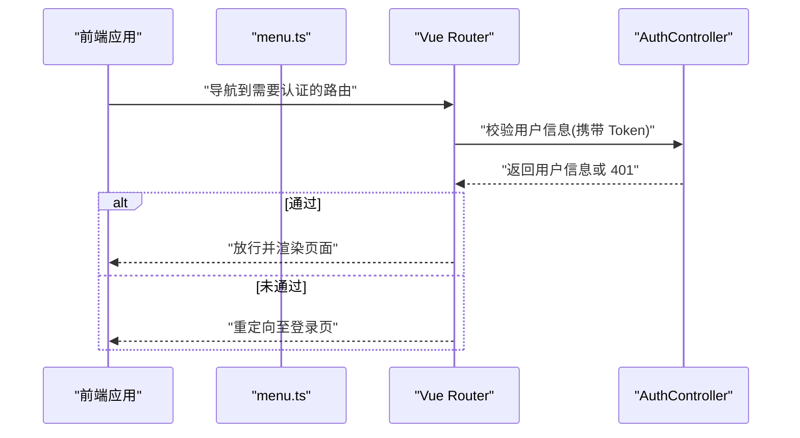
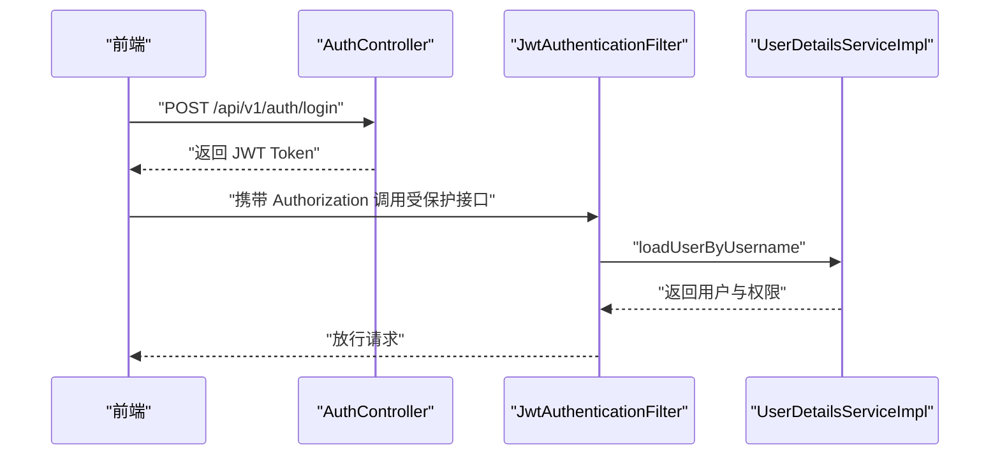

# 菜单管理

<!--<cite>
**本文引用的文件**
- [MenuController.java](file://graphiti-module-system/src/main/java/com/raphiti/system/controller/MenuController.java)
- [MenuService.java](file://graphiti-module-system/src/main/java/com/raphiti/system/service/MenuService.java)
- [MenuServiceImpl.java](file://graphiti-module-system/src/main/java/com/raphiti/system/service/impl/MenuServiceImpl.java)
- [MenuDO.java](file://graphiti-module-system/src/main/java/com/raphiti/system/dal/dataobject/MenuDO.java)
- [MenuMapper.java](file://graphiti-module-system/src/main/java/com/raphiti/system/dal/mysql/MenuMapper.java)
- [menu.ts](file://graphiti-web/src/api/menu.ts)
- [index.ts](file://graphiti-web/src/router/index.ts)
- [AuthController.java](file://graphiti-module-system/src/main/java/com/raphiti/system/controller/AuthController.java)
- [AuthService.java](file://graphiti-module-system/src/main/java/com/raphiti/system/service/AuthService.java)
- [AuthServiceImpl.java](file://graphiti-module-system/src/main/java/com/raphiti/system/service/impl/AuthServiceImpl.java)
- [JwtAuthenticationFilter.java](file://graphiti-framework/graphiti-spring-boot-starter-security/src/main/java/com/raphiti/framework/security/jwt/JwtAuthenticationFilter.java)
- [UserDetailsServiceImpl.java](file://graphiti-module-system/src/main/java/com/raphiti/system/service/UserDetailsServiceImpl.java)
- [init-data.sql](file://sql/mysql/init-data.sql)
</cite>-->

## 目录
1. [简介](#简介)
2. [项目结构](#项目结构)
3. [核心组件](#核心组件)
4. [架构总览](#架构总览)
5. [详细组件分析](#详细组件分析)
6. [依赖分析](#依赖分析)
7. [性能考虑](#性能考虑)
8. [故障排查指南](#故障排查指南)
9. [结论](#结论)
10. [附录](#附录)

## 简介
本文件面向“菜单管理”模块，系统性梳理后端控制器、服务层、数据对象与持久层，以及前端 API 映射与路由集成。重点覆盖以下能力：
- 菜单 CRUD：创建、查询、更新、删除
- 菜单树形结构：父子关系与层级渲染
- 权限标识校验：防止重复注册
- 动态菜单生成：基于权限标识与树形结构的前端路由映射
- 安全控制：基于 JWT 的认证与授权
- 前端路由与菜单联动：菜单到路由的映射与守卫

## 项目结构
菜单管理模块位于系统模块 graphiti-module-system 中，采用典型的分层架构：
- 控制器层：MenuController 提供 REST 接口
- 服务层：MenuService 接口与 MenuServiceImpl 实现
- 数据访问层：MenuMapper 继承 MyBatis-Plus 基类
- 数据对象：MenuDO 映射 sys_menu 表，并包含 children 字段用于树形组装
- 前端：menu.ts 将后端 MenuDO 映射为前端 MenuItem 类型；index.ts 负责路由守卫与页面元信息

图表来源
- [MenuController.java:1-79](file://graphiti-module-system/src/main/java/com/raphiti/system/controller/MenuController.java#L1-79)
- [MenuService.java:1-49](file://graphiti-module-system/src/main/java/com/raphiti/system/service/MenuService.java#L1-49)
- [MenuServiceImpl.java:1-81](file://graphiti-module-system/src/main/java/com/raphiti/system/service/impl/MenuServiceImpl.java#L1-81)
- [MenuMapper.java:1-13](file://graphiti-module-system/src/main/java/com/raphiti/system/dal/mysql/MenuMapper.java#L1-13)
- [MenuDO.java:1-45](file://graphiti-module-system/src/main/java/com/raphiti/system/dal/dataobject/MenuDO.java#L1-45)
- [menu.ts:1-148](file://graphiti-web/src/api/menu.ts#L1-148)
- [index.ts:1-233](file://graphiti-web/src/router/index.ts#L1-233)

章节来源
- [MenuController.java:1-79](file://graphiti-module-system/src/main/java/com/raphiti/system/controller/MenuController.java#L1-79)
- [MenuService.java:1-49](file://graphiti-module-system/src/main/java/com/raphiti/system/service/MenuService.java#L1-49)
- [MenuServiceImpl.java:1-81](file://graphiti-module-system/src/main/java/com/raphiti/system/service/impl/MenuServiceImpl.java#L1-81)
- [MenuMapper.java:1-13](file://graphiti-module-system/src/main/java/com/raphiti/system/dal/mysql/MenuMapper.java#L1-13)
- [MenuDO.java:1-45](file://graphiti-module-system/src/main/java/com/raphiti/system/dal/dataobject/MenuDO.java#L1-45)
- [menu.ts:1-148](file://graphiti-web/src/api/menu.ts#L1-148)
- [index.ts:1-233](file://graphiti-web/src/router/index.ts#L1-233)

## 核心组件
- 控制器：提供菜单的创建、更新、删除、详情查询、树形列表等接口，并在列表接口中将扁平菜单转换为树形结构
- 服务层：负责业务规则（如权限标识唯一性）、时间戳更新、软删除、排序查询
- 数据对象：包含菜单基础字段、父级关联、排序、状态、创建/更新时间、软删除标记，以及用于树形渲染的 children 字段
- 前端 API：将后端 MenuDO 映射为前端 MenuItem，支持树形与扁平两种形态

章节来源
- [MenuController.java:30-77](file://graphiti-module-system/src/main/java/com/raphiti/system/controller/MenuController.java#L30-L77)
- [MenuServiceImpl.java:24-79](file://graphiti-module-system/src/main/java/com/raphiti/system/service/impl/MenuServiceImpl.java#L24-L79)
- [MenuDO.java:20-43](file://graphiti-module-system/src/main/java/com/raphiti/system/dal/dataobject/MenuDO.java#L20-L43)
- [menu.ts:39-54](file://graphiti-web/src/api/menu.ts#L39-L54)

## 架构总览
后端采用 Spring MVC + MyBatis-Plus，前端使用 Vue Router。JWT 认证贯穿前后端，菜单管理接口受 Bearer Token 保护。

图表来源
- [menu.ts:56-144](file://graphiti-web/src/api/menu.ts#L56-L144)
- [MenuController.java:30-77](file://graphiti-module-system/src/main/java/com/raphiti/system/controller/MenuController.java#L30-L77)
- [MenuServiceImpl.java:24-79](file://graphiti-module-system/src/main/java/com/raphiti/system/service/impl/MenuServiceImpl.java#L24-L79)
- [MenuMapper.java:10-12](file://graphiti-module-system/src/main/java/com/raphiti/system/dal/mysql/MenuMapper.java#L10-L12)

## 详细组件分析

### 控制器：MenuController
- 职责
  - 提供菜单管理的 REST 接口
  - 在“获取菜单列表”接口中，将数据库返回的扁平菜单转换为树形结构
- 关键点
  - 使用注解声明接口标签、安全要求（Bearer）
  - 列表接口通过递归构建树形结构，便于前端展示
- 典型流程
  - 创建/更新/删除/查询均委托给服务层
  - 列表接口在返回前进行树形组装

图表来源
- [MenuController.java:64-77](file://graphiti-module-system/src/main/java/com/raphiti/system/controller/MenuController.java#L64-L77)
- [MenuServiceImpl.java:72-79](file://graphiti-module-system/src/main/java/com/raphiti/system/service/impl/MenuServiceImpl.java#L72-L79)

章节来源
- [MenuController.java:30-77](file://graphiti-module-system/src/main/java/com/raphiti/system/controller/MenuController.java#L30-L77)

### 服务层：MenuService 与 MenuServiceImpl
- 接口职责
  - createMenu：创建菜单
  - updateMenu：更新菜单
  - deleteMenu：软删除菜单
  - getMenu/getMenuByPermission：按 ID 或权限标识查询
  - listMenus：查询未删除菜单并按 sort 升序排列
- 实现要点
  - 权限标识唯一性校验（防止重复）
  - 统一设置创建/更新时间与软删除标记
  - 查询时排除已删除记录并按 sort 排序
- 错误处理
  - 当权限标识重复时抛出业务异常

图表来源
- [MenuService.java:8-48](file://graphiti-module-system/src/main/java/com/raphiti/system/service/MenuService.java#L8-L48)
- [MenuServiceImpl.java:20-80](file://graphiti-module-system/src/main/java/com/raphiti/system/service/impl/MenuServiceImpl.java#L20-L80)
- [MenuMapper.java:10-12](file://graphiti-module-system/src/main/java/com/raphiti/system/dal/mysql/MenuMapper.java#L10-L12)

章节来源
- [MenuService.java:8-48](file://graphiti-module-system/src/main/java/com/raphiti/system/service/MenuService.java#L8-L48)
- [MenuServiceImpl.java:24-79](file://graphiti-module-system/src/main/java/com/raphiti/system/service/impl/MenuServiceImpl.java#L24-L79)

### 数据模型：MenuDO
- 字段设计
  - 主键 id、名称 name、权限标识 permission、URL url、父级 parentId、排序 sort、状态 status、时间字段、软删除 deleted、children（树形渲染）
- 层级关系
  - 通过 parentId 与 children 建立父子关系，支持多级树形
- 复杂度
  - 树形构建为 O(n) 遍历 + 递归拼接，适合中等规模菜单

图表来源
- [MenuDO.java:20-43](file://graphiti-module-system/src/main/java/com/raphiti/system/dal/dataobject/MenuDO.java#L20-L43)

章节来源
- [MenuDO.java:15-44](file://graphiti-module-system/src/main/java/com/raphiti/system/dal/dataobject/MenuDO.java#L15-L44)

### 前端映射与路由
- 类型映射
  - 后端 MenuDO 映射为前端 MenuItem，permission 对应前端 code，url 对应 path
- API 行为
  - 树形列表：GET /admin/system/menu/list
  - 扁平列表：GET /admin/system/menu/list（前端扁平化）
  - 详情：GET /admin/system/menu/get/{menuId}
  - 创建：POST /admin/system/menu/create
  - 更新：PUT /admin/system/menu/update
  - 删除：DELETE /admin/system/menu/delete/{menuId}
- 路由集成
  - 路由守卫检查 requiresAuth 并结合后端认证接口进行鉴权
  - 登录成功后前端存储 Token，后续请求携带 Authorization

图表来源
- [menu.ts:56-144](file://graphiti-web/src/api/menu.ts#L56-L144)
- [index.ts:185-230](file://graphiti-web/src/router/index.ts#L185-L230)
- [AuthController.java:27-52](file://graphiti-module-system/src/main/java/com/raphiti/system/controller/AuthController.java#L27-L52)

章节来源
- [menu.ts:39-144](file://graphiti-web/src/api/menu.ts#L39-L144)
- [index.ts:176-230](file://graphiti-web/src/router/index.ts#L176-L230)
- [AuthController.java:27-52](file://graphiti-module-system/src/main/java/com/raphiti/system/controller/AuthController.java#L27-L52)

### 权限控制与安全
- 认证链路
  - 前端登录成功后获得 JWT Token
  - 请求头携带 Authorization: Bearer <token>
  - JwtAuthenticationFilter 解析并验证 Token，加载用户详情，设置 Security 上下文
- 用户详情
  - UserDetailsServiceImpl 用于加载用户与权限（示例中为硬编码，实际应从数据库查询）

图表来源
- [AuthController.java:27-32](file://graphiti-module-system/src/main/java/com/raphiti/system/controller/AuthController.java#L27-L32)
- [JwtAuthenticationFilter.java:36-58](file://graphiti-framework/graphiti-spring-boot-starter-security/src/main/java/com/raphiti/framework/security/jwt/JwtAuthenticationFilter.java#L36-L58)
- [UserDetailsServiceImpl.java:24-41](file://graphiti-module-system/src/main/java/com/raphiti/system/service/UserDetailsServiceImpl.java#L24-L41)

章节来源
- [AuthController.java:27-52](file://graphiti-module-system/src/main/java/com/raphiti/system/controller/AuthController.java#L27-L52)
- [JwtAuthenticationFilter.java:36-58](file://graphiti-framework/graphiti-spring-boot-starter-security/src/main/java/com/raphiti/framework/security/jwt/JwtAuthenticationFilter.java#L36-L58)
- [UserDetailsServiceImpl.java:24-41](file://graphiti-module-system/src/main/java/com/raphiti/system/service/UserDetailsServiceImpl.java#L24-L41)

## 依赖分析
- 控制器依赖服务层接口
- 服务层依赖 Mapper
- Mapper 继承 MyBatis-Plus 基类，自动提供通用 CRUD
- 前端 API 依赖后端接口路径与返回结构
- 路由守卫依赖后端认证接口与 Token 管理

图表来源
- [MenuController.java:27-28](file://graphiti-module-system/src/main/java/com/raphiti/system/controller/MenuController.java#L27-L28)
- [MenuServiceImpl.java:22-22](file://graphiti-module-system/src/main/java/com/raphiti/system/service/impl/MenuServiceImpl.java#L22-L22)
- [MenuMapper.java:10-12](file://graphiti-module-system/src/main/java/com/raphiti/system/dal/mysql/MenuMapper.java#L10-L12)
- [MenuDO.java:16-16](file://graphiti-module-system/src/main/java/com/raphiti/system/dal/dataobject/MenuDO.java#L16-L16)
- [menu.ts:56-144](file://graphiti-web/src/api/menu.ts#L56-L144)
- [index.ts:176-179](file://graphiti-web/src/router/index.ts#L176-L179)

章节来源
- [MenuController.java:27-28](file://graphiti-module-system/src/main/java/com/raphiti/system/controller/MenuController.java#L27-L28)
- [MenuServiceImpl.java:22-22](file://graphiti-module-system/src/main/java/com/raphiti/system/service/impl/MenuServiceImpl.java#L22-L22)
- [MenuMapper.java:10-12](file://graphiti-module-system/src/main/java/com/raphiti/system/dal/mysql/MenuMapper.java#L10-L12)
- [MenuDO.java:16-16](file://graphiti-module-system/src/main/java/com/raphiti/system/dal/dataobject/MenuDO.java#L16-L16)
- [menu.ts:56-144](file://graphiti-web/src/api/menu.ts#L56-L144)
- [index.ts:176-179](file://graphiti-web/src/router/index.ts#L176-L179)

## 性能考虑
- 查询优化
  - listMenus 默认按 sort 升序，有利于前端稳定展示
  - 查询时排除 deleted=true，减少无效数据扫描
- 树形构建
  - 控制器侧一次性遍历并递归组装，复杂度 O(n)，适合中等规模菜单
- 缓存建议
  - 可引入 Redis 缓存菜单树，结合权限变更事件失效
  - 对高频读取的菜单树进行本地缓存（注意并发与一致性）
- 分页与懒加载
  - 若菜单规模扩大，建议提供分页查询与前端懒加载树节点

## 故障排查指南
- 权限标识冲突
  - 现象：创建菜单时报错“权限标识已存在”
  - 处理：修改权限标识或清理重复数据
- 软删除与可见性
  - 现象：删除后仍出现在列表
  - 处理：确认 deleted 字段逻辑与查询条件一致
- 前端菜单不显示
  - 现象：菜单树为空或部分节点缺失
  - 处理：检查后端 listMenus 是否正确排除 deleted，以及前端 mapMenuDO 的字段映射
- 认证失败
  - 现象：401 未认证
  - 处理：确认 Authorization 头是否携带 Bearer Token，Token 是否有效

章节来源
- [MenuServiceImpl.java:26-30](file://graphiti-module-system/src/main/java/com/raphiti/system/service/impl/MenuServiceImpl.java#L26-L30)
- [MenuServiceImpl.java:74-78](file://graphiti-module-system/src/main/java/com/raphiti/system/service/impl/MenuServiceImpl.java#L74-L78)
- [menu.ts:39-54](file://graphiti-web/src/api/menu.ts#L39-L54)
- [JwtAuthenticationFilter.java:36-58](file://graphiti-framework/graphiti-spring-boot-starter-security/src/main/java/com/raphiti/framework/security/jwt/JwtAuthenticationFilter.java#L36-L58)

## 结论
菜单管理模块以清晰的分层架构实现了菜单的增删改查、树形结构与权限控制。后端通过服务层统一处理业务规则与数据一致性，前端通过 API 与路由完成菜单到页面的映射。建议在生产环境中引入菜单缓存与权限变更事件，进一步提升性能与一致性。

## 附录

### API 文档（后端）
- 创建菜单
  - 方法：POST
  - 路径：/api/v1/admin/system/menu/create
  - 请求体：MenuDO（除 id、children、createTime、updateTime、deleted 外）
  - 返回：CommonResult<Long>（菜单 ID）
- 更新菜单
  - 方法：PUT
  - 路径：/api/v1/admin/system/menu/update
  - 请求体：MenuDO（包含 id）
  - 返回：CommonResult<Boolean>
- 删除菜单
  - 方法：DELETE
  - 路径：/api/v1/admin/system/menu/delete/{menuId}
  - 路径参数：menuId（Long）
  - 返回：CommonResult<Boolean>
- 获取菜单详情
  - 方法：GET
  - 路径：/api/v1/admin/system/menu/get/{menuId}
  - 路径参数：menuId（Long）
  - 返回：CommonResult<MenuDO>
- 获取菜单列表（树形）
  - 方法：GET
  - 路径：/api/v1/admin/system/menu/list
  - 返回：CommonResult<List<MenuDO>>（children 递归组装）

章节来源
- [MenuController.java:30-70](file://graphiti-module-system/src/main/java/com/raphiti/system/controller/MenuController.java#L30-L70)

### 前端 API 使用示例（menu.ts）
- 获取树形菜单：调用 menuApi.getMenus()
- 获取扁平菜单：调用 menuApi.getAllMenus()
- 获取菜单详情：调用 menuApi.getMenu(id)
- 创建菜单：调用 menuApi.createMenu(form)
- 更新菜单：调用 menuApi.updateMenu(id, partialForm)
- 删除菜单：调用 menuApi.deleteMenu(id)
- 更新状态：调用 menuApi.updateStatus(id, status)

章节来源
- [menu.ts:56-144](file://graphiti-web/src/api/menu.ts#L56-L144)

### 初始化数据参考
- 初始用户与角色数据可参考初始化脚本，用于测试登录与权限演示

章节来源
- [init-data.sql:4-12](file://sql/mysql/init-data.sql#L4-L12)