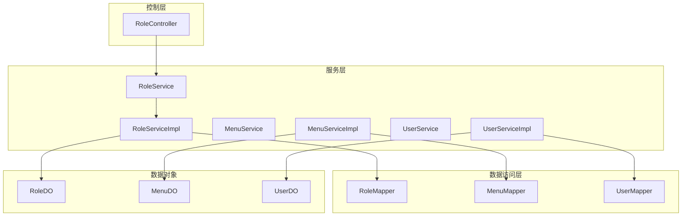
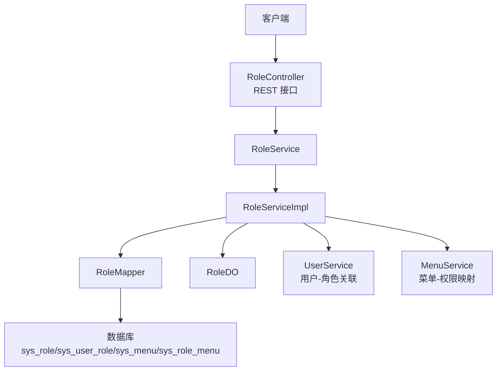
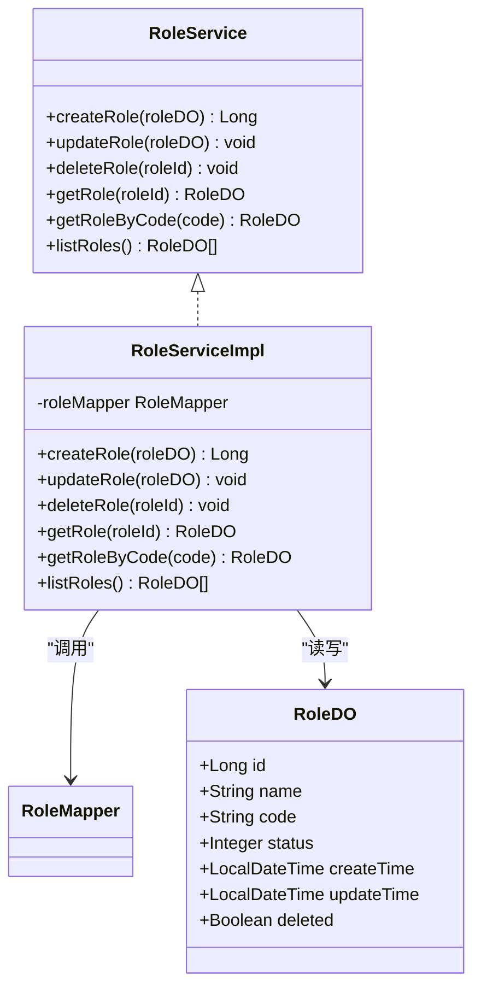
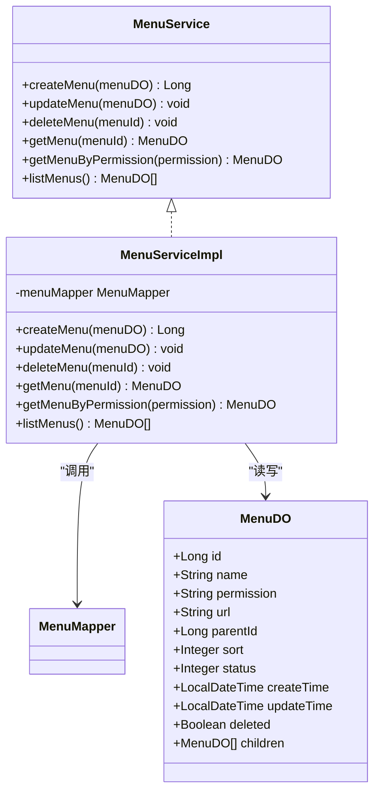
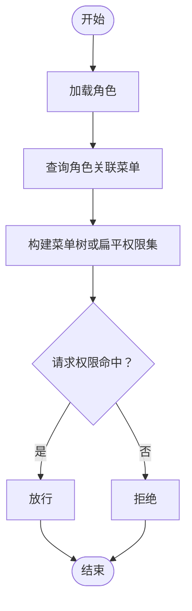
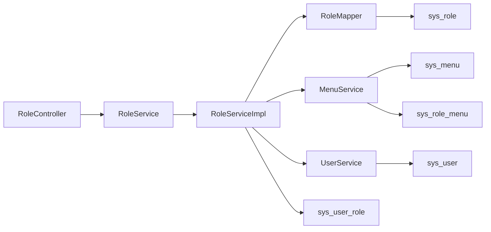
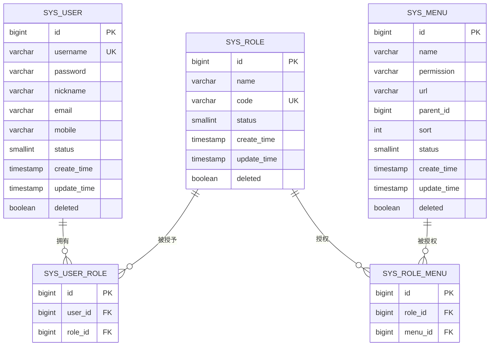

# 角色权限管理

<!--<cite>
**本文引用的文件**
- [RoleController.java](file://graphiti-module-system/src/main/java/com/graphiti/system/controller/RoleController.java)
- [RoleService.java](file://graphiti-module-system/src/main/java/com/graphiti/system/service/RoleService.java)
- [RoleServiceImpl.java](file://graphiti-module-system/src/main/java/com/graphiti/system/service/impl/RoleServiceImpl.java)
- [RoleDO.java](file://graphiti-module-system/src/main/java/com/graphiti/system/dal/dataobject/RoleDO.java)
- [RoleMapper.java](file://graphiti-module-system/src/main/java/com/graphiti/system/dal/mysql/RoleMapper.java)
- [MenuDO.java](file://graphiti-module-system/src/main/java/com/graphiti/system/dal/dataobject/MenuDO.java)
- [MenuService.java](file://graphiti-module-system/src/main/java/com/graphiti/system/service/MenuService.java)
- [MenuServiceImpl.java](file://graphiti-module-system/src/main/java/com/graphiti/system/service/impl/MenuServiceImpl.java)
- [MenuMapper.java](file://graphiti-module-system/src/main/java/com/graphiti/system/dal/mysql/MenuMapper.java)
- [UserDO.java](file://graphiti-module-system/src/main/java/com/graphiti/system/dal/dataobject/UserDO.java)
- [UserService.java](file://graphiti-module-system/src/main/java/com/graphiti/system/service/UserService.java)
- [UserServiceImpl.java](file://graphiti-module-system/src/main/java/com/graphiti/system/service/impl/UserServiceImpl.java)
- [UserMapper.java](file://graphiti-module-system/src/main/java/com/graphiti/system/dal/mysql/UserMapper.java)
- [AuthService.java](file://graphiti-module-system/src/main/java/com/graphiti/system/service/AuthService.java)
- [schema.sql(MySQL)](file://sql/mysql/schema.sql)
- [schema.sql(PostgreSQL)](file://sql/postgresql/schema.sql)
</cite>-->

## 目录
1. [简介](#简介)
2. [项目结构](#项目结构)
3. [核心组件](#核心组件)
4. [架构总览](#架构总览)
5. [组件详解](#组件详解)
6. [依赖关系分析](#依赖关系分析)
7. [性能与扩展性](#性能与扩展性)
8. [故障排查指南](#故障排查指南)
9. [结论](#结论)
10. [附录](#附录)

## 简介
本文件聚焦于系统模块中的“角色权限管理”能力，围绕以下目标展开：
- 全面梳理 RoleController 的角色管理接口（创建、查询、更新、删除、按角色编码查询）
- 深入解析 RoleService 接口与 RoleServiceImpl 实现，阐述 RBAC（基于角色的访问控制）模型在代码层面的落地方式
- 说明 RoleDO 数据对象设计、权限映射机制与 RoleMapper 的数据库交互
- 结合菜单与用户模型，解释角色层级结构、权限继承关系与动态权限验证的实现思路
- 提供最佳实践与安全建议，帮助团队在生产环境中稳定、安全地使用角色权限体系

## 项目结构
角色权限管理位于系统模块（graphiti-module-system），采用典型的分层架构：
- 控制层：RoleController 提供 REST 接口
- 服务层：RoleService 定义角色管理契约；RoleServiceImpl 实现业务逻辑
- 数据访问层：RoleMapper 基于 MyBatis-Plus 对 sys_role 表进行 CRUD
- 数据对象：RoleDO 映射 sys_role 表结构
- 关联模型：MenuDO、UserDO 及其服务/映射用于构建 RBAC 权限矩阵

图表来源
- [RoleController.java:25-70](file://graphiti-module-system/src/main/java/com/graphiti/system/controller/RoleController.java#L25-L70)
- [RoleServiceImpl.java:20-80](file://graphiti-module-system/src/main/java/com/graphiti/system/service/impl/RoleServiceImpl.java#L20-L80)
- [RoleMapper.java:10-12](file://graphiti-module-system/src/main/java/com/graphiti/system/dal/mysql/RoleMapper.java#L10-L12)
- [RoleDO.java:14-31](file://graphiti-module-system/src/main/java/com/graphiti/system/dal/dataobject/RoleDO.java#L14-L31)
- [MenuServiceImpl.java:20-80](file://graphiti-module-system/src/main/java/com/graphiti/system/service/impl/MenuServiceImpl.java#L20-L80)
- [MenuMapper.java](file://graphiti-module-system/src/main/java/com/graphiti/system/dal/mysql/MenuMapper.java)
- [MenuDO.java:17-44](file://graphiti-module-system/src/main/java/com/graphiti/system/dal/dataobject/MenuDO.java#L17-L44)
- [UserServiceImpl.java:24-112](file://graphiti-module-system/src/main/java/com/graphiti/system/service/impl/UserServiceImpl.java#L24-L112)
- [UserMapper.java](file://graphiti-module-system/src/main/java/com/graphiti/system/dal/mysql/UserMapper.java)
- [UserDO.java:14-37](file://graphiti-module-system/src/main/java/com/graphiti/system/dal/dataobject/UserDO.java#L14-L37)

章节来源
- [RoleController.java:25-70](file://graphiti-module-system/src/main/java/com/graphiti/system/controller/RoleController.java#L25-L70)
- [RoleService.java:8-48](file://graphiti-module-system/src/main/java/com/graphiti/system/service/RoleService.java#L8-L48)
- [RoleServiceImpl.java:20-80](file://graphiti-module-system/src/main/java/com/graphiti/system/service/impl/RoleServiceImpl.java#L20-L80)
- [RoleDO.java:14-31](file://graphiti-module-system/src/main/java/com/graphiti/system/dal/dataobject/RoleDO.java#L14-L31)
- [RoleMapper.java:10-12](file://graphiti-module-system/src/main/java/com/graphiti/system/dal/mysql/RoleMapper.java#L10-L12)
- [MenuDO.java:17-44](file://graphiti-module-system/src/main/java/com/graphiti/system/dal/dataobject/MenuDO.java#L17-L44)
- [MenuService.java:8-48](file://graphiti-module-system/src/main/java/com/graphiti/system/service/MenuService.java#L8-L48)
- [MenuServiceImpl.java:20-80](file://graphiti-module-system/src/main/java/com/graphiti/system/service/impl/MenuServiceImpl.java#L20-L80)
- [UserDO.java:14-37](file://graphiti-module-system/src/main/java/com/graphiti/system/dal/dataobject/UserDO.java#L14-L37)
- [UserService.java:8-60](file://graphiti-module-system/src/main/java/com/graphiti/system/service/UserService.java#L8-L60)

## 核心组件
- RoleController：提供角色管理的 REST 接口，包括创建、更新、删除、按 ID 查询、按角色编码查询、获取角色列表等
- RoleService：定义角色管理的领域契约
- RoleServiceImpl：实现角色生命周期管理，包含幂等校验（角色编码唯一）、软删除、时间戳维护等
- RoleDO：角色数据对象，映射 sys_role 表字段
- RoleMapper：MyBatis-Plus Mapper，负责对 sys_role 的持久化操作
- MenuDO/MenuService/MenuMapper：菜单数据对象与服务，提供权限标识（permission）与菜单树结构，支撑 RBAC 权限矩阵
- UserDO/UserService/UserMapper：用户数据对象与服务，支撑用户-角色关联（sys_user_role）

章节来源
- [RoleController.java:30-70](file://graphiti-module-system/src/main/java/com/graphiti/system/controller/RoleController.java#L30-L70)
- [RoleService.java:8-48](file://graphiti-module-system/src/main/java/com/graphiti/system/service/RoleService.java#L8-L48)
- [RoleServiceImpl.java:24-80](file://graphiti-module-system/src/main/java/com/graphiti/system/service/impl/RoleServiceImpl.java#L24-L80)
- [RoleDO.java:17-31](file://graphiti-module-system/src/main/java/com/graphiti/system/dal/dataobject/RoleDO.java#L17-L31)
- [RoleMapper.java:10-12](file://graphiti-module-system/src/main/java/com/graphiti/system/dal/mysql/RoleMapper.java#L10-L12)
- [MenuDO.java:20-43](file://graphiti-module-system/src/main/java/com/graphiti/system/dal/dataobject/MenuDO.java#L20-L43)
- [MenuService.java:8-48](file://graphiti-module-system/src/main/java/com/graphiti/system/service/MenuService.java#L8-L48)
- [MenuServiceImpl.java:24-80](file://graphiti-module-system/src/main/java/com/graphiti/system/service/impl/MenuServiceImpl.java#L24-L80)
- [UserDO.java:17-37](file://graphiti-module-system/src/main/java/com/graphiti/system/dal/dataobject/UserDO.java#L17-L37)
- [UserService.java:8-60](file://graphiti-module-system/src/main/java/com/graphiti/system/service/UserService.java#L8-L60)

## 架构总览
下图展示了角色权限管理在系统中的位置与关键交互：

图表来源
- [RoleController.java:25-70](file://graphiti-module-system/src/main/java/com/graphiti/system/controller/RoleController.java#L25-L70)
- [RoleServiceImpl.java:20-80](file://graphiti-module-system/src/main/java/com/graphiti/system/service/impl/RoleServiceImpl.java#L20-L80)
- [RoleMapper.java:10-12](file://graphiti-module-system/src/main/java/com/graphiti/system/dal/mysql/RoleMapper.java#L10-L12)
- [RoleDO.java:14-31](file://graphiti-module-system/src/main/java/com/graphiti/system/dal/dataobject/RoleDO.java#L14-L31)
- [MenuServiceImpl.java:20-80](file://graphiti-module-system/src/main/java/com/graphiti/system/service/impl/MenuServiceImpl.java#L20-L80)
- [UserServiceImpl.java:24-112](file://graphiti-module-system/src/main/java/com/graphiti/system/service/impl/UserServiceImpl.java#L24-L112)

## 组件详解

### RoleController：角色管理接口
- 接口概览
  - POST /api/v1/admin/system/role/create：创建角色
  - PUT /api/v1/admin/system/role/update：更新角色
  - DELETE /api/v1/admin/system/role/delete/{roleId}：删除角色（软删除）
  - GET /api/v1/admin/system/role/get/{roleId}：按 ID 获取角色详情
  - GET /api/v1/admin/system/role/list：获取角色列表（未分页）
- 安全要求：所有接口均需携带 Bearer Token（基于 Spring Security 的 JWT）
- 返回统一格式：CommonResult 包裹业务结果

章节来源
- [RoleController.java:30-70](file://graphiti-module-system/src/main/java/com/graphiti/system/controller/RoleController.java#L30-L70)

### RoleService 与 RoleServiceImpl：RBAC 模型实现
- 角色生命周期
  - 创建：校验角色编码唯一性，设置创建/更新时间与状态，插入数据库
  - 更新：仅更新传入字段，维护更新时间
  - 删除：软删除（deleted=true），同时更新时间
  - 查询：按 ID、按编码查询；列出未删除角色并按创建时间倒序
- RBAC 支撑
  - 角色与用户：通过 sys_user_role 关联（见 schema）
  - 角色与菜单：通过 sys_role_menu 关联（见 schema）
  - 权限标识：MenuDO 中的 permission 字段作为最小权限单元
- 动态权限验证思路
  - 当前代码未直接暴露“角色-权限”校验方法，但可通过组合 RoleServiceImpl.getRole(roleId) 与 MenuServiceImpl.listMenus()/getMenuByPermission(...) 构建权限集合，再进行动态校验

图表来源
- [RoleService.java:8-48](file://graphiti-module-system/src/main/java/com/graphiti/system/service/RoleService.java#L8-L48)
- [RoleServiceImpl.java:20-80](file://graphiti-module-system/src/main/java/com/graphiti/system/service/impl/RoleServiceImpl.java#L20-L80)
- [RoleMapper.java:10-12](file://graphiti-module-system/src/main/java/com/graphiti/system/dal/mysql/RoleMapper.java#L10-L12)
- [RoleDO.java:17-31](file://graphiti-module-system/src/main/java/com/graphiti/system/dal/dataobject/RoleDO.java#L17-L31)

章节来源
- [RoleService.java:8-48](file://graphiti-module-system/src/main/java/com/graphiti/system/service/RoleService.java#L8-L48)
- [RoleServiceImpl.java:24-80](file://graphiti-module-system/src/main/java/com/graphiti/system/service/impl/RoleServiceImpl.java#L24-L80)
- [RoleDO.java:17-31](file://graphiti-module-system/src/main/java/com/graphiti/system/dal/dataobject/RoleDO.java#L17-L31)

### RoleDO 与 RoleMapper：数据模型与持久化
- RoleDO 字段映射
  - 主键：id
  - 角色名：name
  - 角色编码：code（唯一约束）
  - 状态：status
  - 时间戳：createTime、updateTime
  - 逻辑删除：deleted
- RoleMapper 继承 BaseMapper，天然具备 CRUD 能力
- 业务侧通过 RoleServiceImpl 统一处理软删除、时间戳与唯一性校验

章节来源
- [RoleDO.java:17-31](file://graphiti-module-system/src/main/java/com/graphiti/system/dal/dataobject/RoleDO.java#L17-L31)
- [RoleMapper.java:10-12](file://graphiti-module-system/src/main/java/com/graphiti/system/dal/mysql/RoleMapper.java#L10-L12)
- [RoleServiceImpl.java:24-80](file://graphiti-module-system/src/main/java/com/graphiti/system/service/impl/RoleServiceImpl.java#L24-L80)

### 菜单与权限映射：MenuDO、MenuService、MenuMapper
- MenuDO 关键字段
  - 权限标识：permission（用于动态权限匹配）
  - 菜单名称：name
  - URL：url
  - 父级：parentId
  - 排序：sort
  - 状态：status
  - 时间戳与逻辑删除：同上
- MenuService 能力
  - 创建/更新/删除（软删除）
  - 按 ID 查询、按权限标识查询、列出未删除菜单并按 sort 升序
- MenuMapper 继承 BaseMapper，提供对 sys_menu 的持久化

图表来源
- [MenuService.java:8-48](file://graphiti-module-system/src/main/java/com/graphiti/system/service/MenuService.java#L8-L48)
- [MenuServiceImpl.java:20-80](file://graphiti-module-system/src/main/java/com/graphiti/system/service/impl/MenuServiceImpl.java#L20-L80)
- [MenuMapper.java](file://graphiti-module-system/src/main/java/com/graphiti/system/dal/mysql/MenuMapper.java)
- [MenuDO.java:17-44](file://graphiti-module-system/src/main/java/com/graphiti/system/dal/dataobject/MenuDO.java#L17-L44)

章节来源
- [MenuDO.java:17-44](file://graphiti-module-system/src/main/java/com/graphiti/system/dal/dataobject/MenuDO.java#L17-L44)
- [MenuService.java:8-48](file://graphiti-module-system/src/main/java/com/graphiti/system/service/MenuService.java#L8-L48)
- [MenuServiceImpl.java:24-80](file://graphiti-module-system/src/main/java/com/graphiti/system/service/impl/MenuServiceImpl.java#L24-L80)

### 用户与角色关联：UserDO、UserService、UserMapper
- 用户模型：UserDO 包含基础身份信息与状态、时间戳、逻辑删除
- 用户服务：提供创建（含密码加密）、更新、软删除、按用户名查询、分页查询等
- 用户-角色关联：通过 sys_user_role 将用户与角色建立多对多关系

章节来源
- [UserDO.java:17-37](file://graphiti-module-system/src/main/java/com/graphiti/system/dal/dataobject/UserDO.java#L17-L37)
- [UserService.java:8-60](file://graphiti-module-system/src/main/java/com/graphiti/system/service/UserService.java#L8-L60)
- [UserServiceImpl.java:24-112](file://graphiti-module-system/src/main/java/com/graphiti/system/service/impl/UserServiceImpl.java#L24-L112)

### RBAC 数据模型与权限继承
- 角色-用户：sys_user_role
- 角色-菜单：sys_role_menu
- 权限标识：sys_menu.permission
- 权限继承与层级
  - 通过菜单父子关系（parentId）构建菜单树，角色可继承父菜单权限
  - 在服务层可按角色查询其关联菜单，再汇总 permission 集合，实现动态权限校验
- 动态权限验证流程（概念示意）

（该图为概念流程，不直接映射具体源码文件）

## 依赖关系分析
- 控制层依赖服务层接口，服务层依赖 Mapper 与 DO
- 角色权限依赖菜单与用户模型，形成“角色-用户/菜单”的双向关联
- 数据库层面通过外键约束保证一致性（Cascade 删除）

图表来源
- [RoleController.java:25-70](file://graphiti-module-system/src/main/java/com/graphiti/system/controller/RoleController.java#L25-L70)
- [RoleServiceImpl.java:20-80](file://graphiti-module-system/src/main/java/com/graphiti/system/service/impl/RoleServiceImpl.java#L20-L80)
- [MenuServiceImpl.java:20-80](file://graphiti-module-system/src/main/java/com/graphiti/system/service/impl/MenuServiceImpl.java#L20-L80)
- [UserServiceImpl.java:24-112](file://graphiti-module-system/src/main/java/com/graphiti/system/service/impl/UserServiceImpl.java#L24-L112)
- [schema.sql(MySQL):47-86](file://sql/mysql/schema.sql#L47-L86)
- [schema.sql(PostgreSQL):68-103](file://sql/postgresql/schema.sql#L68-L103)

章节来源
- [schema.sql(MySQL):28-86](file://sql/mysql/schema.sql#L28-L86)
- [schema.sql(PostgreSQL):21-103](file://sql/postgresql/schema.sql#L21-L103)

## 性能与扩展性
- 查询优化
  - 角色列表按创建时间倒序，适合“最近创建优先”场景
  - 菜单列表按 sort 升序，便于前端渲染
- 索引建议
  - sys_role.code、sys_user.username、sys_menu.permission 等常用过滤字段建议建立索引（MySQL/PG 已有相应索引）
- 扩展点
  - 权限继承：可在服务层递归展开菜单树，生成完整权限集
  - 动态权限：结合 JWT 中的角色信息与菜单权限集合，实现细粒度校验
  - 多租户：可在角色与菜单表增加租户维度字段，配合查询条件隔离数据

（本节为通用建议，不直接分析具体源码文件）

## 故障排查指南
- 角色创建失败（编码重复）
  - 现象：抛出业务异常，提示角色编码已存在
  - 排查：确认角色编码是否唯一；检查 deleted=false 的记录
  - 相关实现参考：[RoleServiceImpl.java:26-30](file://graphiti-module-system/src/main/java/com/graphiti/system/service/impl/RoleServiceImpl.java#L26-L30)
- 菜单创建失败（权限标识重复）
  - 现象：抛出业务异常，提示权限标识已存在
  - 排查：确认 permission 是否唯一；检查 deleted=false 的记录
  - 相关实现参考：[MenuServiceImpl.java:26-30](file://graphiti-module-system/src/main/java/com/graphiti/system/service/impl/MenuServiceImpl.java#L26-L30)
- 删除后仍可见
  - 现象：删除接口返回成功，但查询仍可见
  - 排查：确认服务层执行的是软删除；查询时需排除 deleted=true 的记录
  - 相关实现参考：[RoleServiceImpl.java:48-56](file://graphiti-module-system/src/main/java/com/graphiti/system/service/impl/RoleServiceImpl.java#L48-L56)，[MenuServiceImpl.java:48-56](file://graphiti-module-system/src/main/java/com/graphiti/system/service/impl/MenuServiceImpl.java#L48-L56)
- 密码安全
  - 现象：用户密码明文存储
  - 排查：用户创建时应进行密码加密；确认已使用 BCrypt
  - 相关实现参考：[UserServiceImpl.java:38-41](file://graphiti-module-system/src/main/java/com/graphiti/system/service/impl/UserServiceImpl.java#L38-L41)

章节来源
- [RoleServiceImpl.java:26-30](file://graphiti-module-system/src/main/java/com/graphiti/system/service/impl/RoleServiceImpl.java#L26-L30)
- [MenuServiceImpl.java:26-30](file://graphiti-module-system/src/main/java/com/graphiti/system/service/impl/MenuServiceImpl.java#L26-L30)
- [RoleServiceImpl.java:48-56](file://graphiti-module-system/src/main/java/com/graphiti/system/service/impl/RoleServiceImpl.java#L48-L56)
- [MenuServiceImpl.java:48-56](file://graphiti-module-system/src/main/java/com/graphiti/system/service/impl/MenuServiceImpl.java#L48-L56)
- [UserServiceImpl.java:38-41](file://graphiti-module-system/src/main/java/com/graphiti/system/service/impl/UserServiceImpl.java#L38-L41)

## 结论
- 本模块以清晰的分层架构实现了角色管理的完整闭环：控制层提供 REST 接口，服务层封装业务规则（唯一性、软删除、时间戳），数据层通过 MyBatis-Plus 简化 CRUD
- RBAC 权限模型通过“角色-用户”和“角色-菜单”两张关联表实现，配合菜单的权限标识（permission）与层级（parentId），可灵活构建权限继承与动态校验
- 建议在现有基础上补充“角色-权限”直接映射表与动态权限校验工具方法，进一步提升权限体系的表达力与可维护性

（本节为总结性内容，不直接分析具体源码文件）

## 附录

### API 定义（摘要）
- 创建角色
  - 方法：POST
  - 路径：/api/v1/admin/system/role/create
  - 请求体：RoleDO
  - 返回：CommonResult<Long>
- 更新角色
  - 方法：PUT
  - 路径：/api/v1/admin/system/role/update
  - 请求体：RoleDO
  - 返回：CommonResult<Boolean>
- 删除角色
  - 方法：DELETE
  - 路径：/api/v1/admin/system/role/delete/{roleId}
  - 路径参数：roleId
  - 返回：CommonResult<Boolean>
- 获取角色详情
  - 方法：GET
  - 路径：/api/v1/admin/system/role/get/{roleId}
  - 路径参数：roleId
  - 返回：CommonResult<RoleDO>
- 获取角色列表
  - 方法：GET
  - 路径：/api/v1/admin/system/role/list
  - 返回：CommonResult<List<RoleDO>>

章节来源
- [RoleController.java:30-70](file://graphiti-module-system/src/main/java/com/graphiti/system/controller/RoleController.java#L30-L70)

### 数据模型（ER）

图表来源
- [schema.sql(MySQL):12-86](file://sql/mysql/schema.sql#L12-L86)
- [schema.sql(PostgreSQL):21-103](file://sql/postgresql/schema.sql#L21-L103)