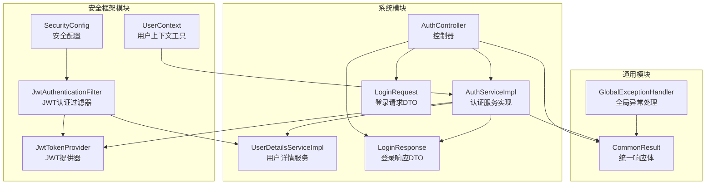
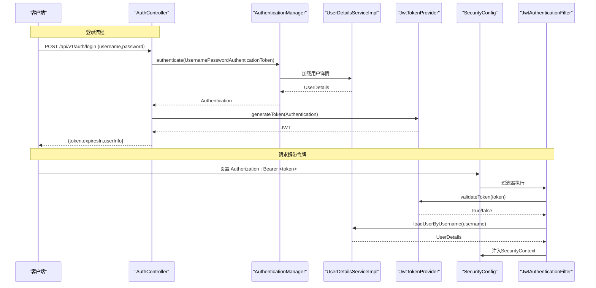
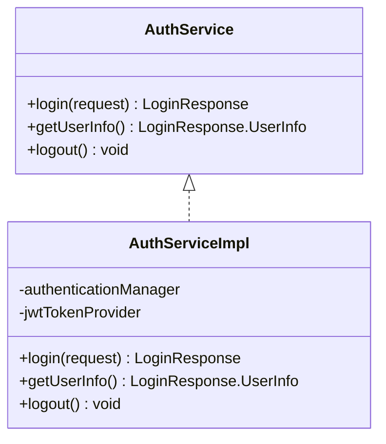
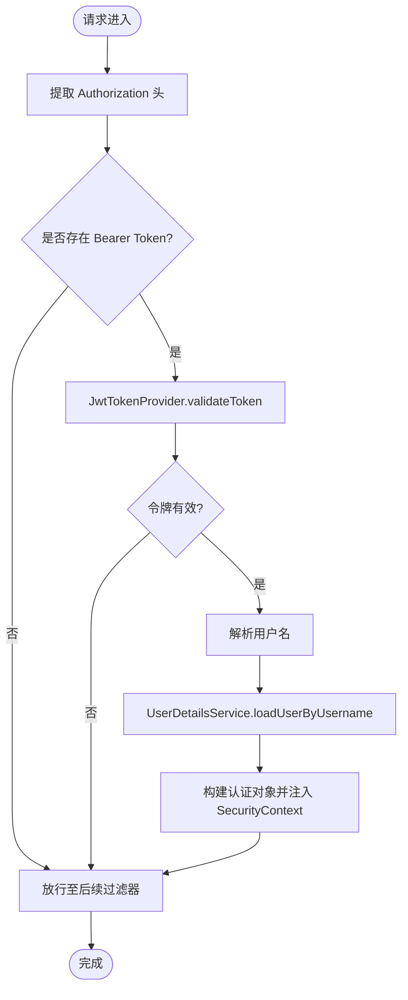
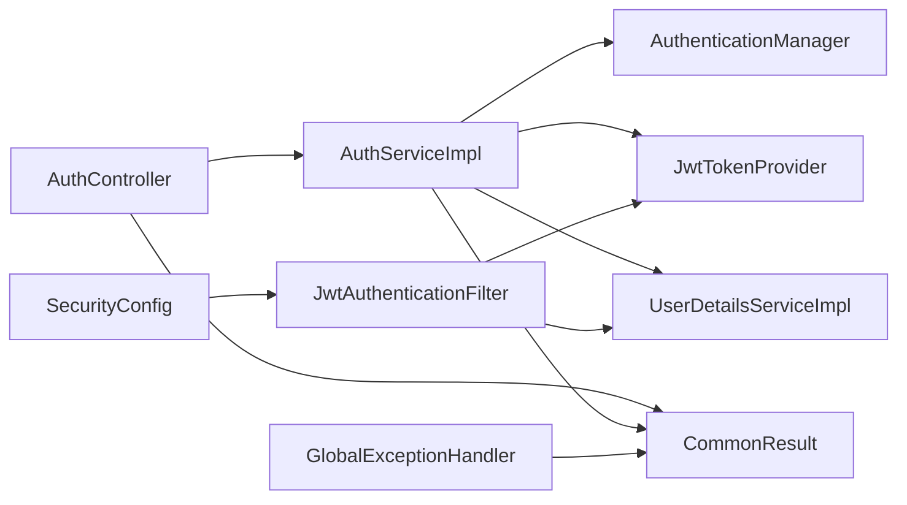

# 认证管理

<cite>
**本文引用的文件**
- [AuthController.java](file://graphiti-module-system/src/main/java/com/raphiti/system/controller/AuthController.java)
- [AuthService.java](file://graphiti-module-system/src/main/java/com/raphiti/system/service/AuthService.java)
- [AuthServiceImpl.java](file://graphiti-module-system/src/main/java/com/raphiti/system/service/impl/AuthServiceImpl.java)
- [LoginRequest.java](file://graphiti-module-system/src/main/java/com/raphiti/system/dto/LoginRequest.java)
- [LoginResponse.java](file://graphiti-module-system/src/main/java/com/raphiti/system/dto/LoginResponse.java)
- [UserDetailsServiceImpl.java](file://graphiti-module-system/src/main/java/com/raphiti/system/service/UserDetailsServiceImpl.java)
- [SecurityConfig.java](file://graphiti-framework/graphiti-spring-boot-starter-security/src/main/java/com/raphiti/framework/security/config/SecurityConfig.java)
- [JwtTokenProvider.java](file://graphiti-framework/graphiti-spring-boot-starter-security/src/main/java/com/raphiti/framework/security/jwt/JwtTokenProvider.java)
- [JwtAuthenticationFilter.java](file://graphiti-framework/graphiti-spring-boot-starter-security/src/main/java/com/raphiti/framework/security/jwt/JwtAuthenticationFilter.java)
- [UserContext.java](file://graphiti-framework/graphiti-spring-boot-starter-security/src/main/java/com/raphiti/framework/security/util/UserContext.java)
- [GlobalExceptionHandler.java](file://graphiti-framework/graphiti-common/src/main/java/com/raphiti/common/exception/GlobalExceptionHandler.java)
- [CommonResult.java](file://graphiti-framework/graphiti-common/src/main/java/com/raphiti/common/response/CommonResult.java)
</cite>

## 目录
1. [简介](#简介)
2. [项目结构](#项目结构)
3. [核心组件](#核心组件)
4. [架构总览](#架构总览)
5. [详细组件分析](#详细组件分析)
6. [依赖分析](#依赖分析)
7. [性能考虑](#性能考虑)
8. [故障排查指南](#故障排查指南)
9. [结论](#结论)
10. [附录](#附录)

## 简介
本文件聚焦于认证管理模块，系统性梳理以下内容：
- AuthController 的三个核心接口：登录（POST /api/v1/auth/login）、获取用户信息（GET /api/v1/auth/info）、退出登录（POST /api/v1/auth/logout）。
- AuthService 接口及其实现类的认证流程、JWT 令牌生成与验证机制。
- LoginRequest 与 LoginResponse 数据传输对象的设计与使用。
- 密码加密存储、会话管理策略、安全令牌过期处理等安全机制。
- 提供完整的 API 调用示例与错误处理方案。

## 项目结构
认证相关代码主要分布在两个模块：
- 系统模块（graphiti-module-system）：控制器、服务接口与实现、DTO、用户详情服务。
- 安全框架模块（graphiti-framework/graphiti-spring-boot-starter-security）：Spring Security 配置、JWT 提供器、JWT 认证过滤器、用户上下文工具。
- 通用模块（graphiti-framework/graphiti-common）：统一响应体与全局异常处理。

图表来源
- [AuthController.java:16-54](file://graphiti-module-system/src/main/java/com/raphiti/system/controller/AuthController.java#L16-L54)
- [AuthServiceImpl.java:21-66](file://graphiti-module-system/src/main/java/com/raphiti/system/service/impl/AuthServiceImpl.java#L21-L66)
- [UserDetailsServiceImpl.java:21-42](file://graphiti-module-system/src/main/java/com/raphiti/system/service/UserDetailsServiceImpl.java#L21-L42)
- [SecurityConfig.java:32-137](file://graphiti-framework/graphiti-spring-boot-starter-security/src/main/java/com/raphiti/framework/security/config/SecurityConfig.java#L32-L137)
- [JwtTokenProvider.java:17-86](file://graphiti-framework/graphiti-spring-boot-starter-security/src/main/java/com/raphiti/framework/security/jwt/JwtTokenProvider.java#L17-L86)
- [JwtAuthenticationFilter.java:23-60](file://graphiti-framework/graphiti-spring-boot-starter-security/src/main/java/com/raphiti/framework/security/jwt/JwtAuthenticationFilter.java#L23-L60)
- [UserContext.java:12-49](file://graphiti-framework/graphiti-spring-boot-starter-security/src/main/java/com/raphiti/framework/security/util/UserContext.java#L12-L49)
- [CommonResult.java:13-67](file://graphiti-framework/graphiti-common/src/main/java/com/raphiti/common/response/CommonResult.java#L13-L67)
- [GlobalExceptionHandler.java:17-73](file://graphiti-framework/graphiti-common/src/main/java/com/raphiti/common/exception/GlobalExceptionHandler.java#L17-L73)

章节来源
- [AuthController.java:16-54](file://graphiti-module-system/src/main/java/com/raphiti/system/controller/AuthController.java#L16-L54)
- [SecurityConfig.java:32-137](file://graphiti-framework/graphiti-spring-boot-starter-security/src/main/java/com/raphiti/framework/security/config/SecurityConfig.java#L32-L137)

## 核心组件
- AuthController：暴露认证相关接口，负责接收请求、调用服务层并返回统一响应体。
- AuthService 接口与 AuthServiceImpl：定义并实现登录、获取用户信息、退出登录的具体逻辑。
- DTO：LoginRequest（登录请求参数）、LoginResponse（登录响应，含令牌与用户信息）。
- 安全框架：SecurityConfig（无状态会话、CORS、异常处理、JWT过滤器注册）、JwtTokenProvider（JWT 生成/解析/校验）、JwtAuthenticationFilter（从请求头提取并验证 JWT，注入认证上下文）。
- 用户详情服务：UserDetailsServiceImpl（加载用户详情，用于认证与授权）。
- 统一响应与异常：CommonResult（统一响应结构）、GlobalExceptionHandler（全局异常拦截）。

章节来源
- [AuthService.java:9-25](file://graphiti-module-system/src/main/java/com/raphiti/system/service/AuthService.java#L9-L25)
- [AuthServiceImpl.java:21-66](file://graphiti-module-system/src/main/java/com/raphiti/system/service/impl/AuthServiceImpl.java#L21-L66)
- [LoginRequest.java:10-25](file://graphiti-module-system/src/main/java/com/raphiti/system/dto/LoginRequest.java#L10-L25)
- [LoginResponse.java:9-38](file://graphiti-module-system/src/main/java/com/raphiti/system/dto/LoginResponse.java#L9-L38)
- [SecurityConfig.java:115-136](file://graphiti-framework/graphiti-spring-boot-starter-security/src/main/java/com/raphiti/framework/security/config/SecurityConfig.java#L115-L136)
- [JwtTokenProvider.java:17-86](file://graphiti-framework/graphiti-spring-boot-starter-security/src/main/java/com/raphiti/framework/security/jwt/JwtTokenProvider.java#L17-L86)
- [JwtAuthenticationFilter.java:23-60](file://graphiti-framework/graphiti-spring-boot-starter-security/src/main/java/com/raphiti/framework/security/jwt/JwtAuthenticationFilter.java#L23-L60)
- [UserDetailsServiceImpl.java:21-42](file://graphiti-module-system/src/main/java/com/raphiti/system/service/UserDetailsServiceImpl.java#L21-L42)
- [CommonResult.java:13-67](file://graphiti-framework/graphiti-common/src/main/java/com/raphiti/common/response/CommonResult.java#L13-L67)
- [GlobalExceptionHandler.java:17-73](file://graphiti-framework/graphiti-common/src/main/java/com/raphiti/common/exception/GlobalExceptionHandler.java#L17-L73)

## 架构总览
认证采用基于 JWT 的无状态认证模式：
- 客户端通过登录接口提交用户名与密码，服务端使用 AuthenticationManager 执行认证，成功后由 JwtTokenProvider 生成 JWT 并返回。
- 请求携带 Authorization: Bearer <token>，JwtAuthenticationFilter 从请求头提取并验证 JWT，解析出用户名后加载 UserDetails，注入到 SecurityContext。
- 业务接口通过 SecurityContextHolder 获取当前认证信息，实现鉴权与用户信息读取。
- 退出登录仅清理 SecurityContext，JWT 仍可使用，需由客户端主动丢弃令牌。

图表来源
- [AuthController.java:27-32](file://graphiti-module-system/src/main/java/com/raphiti/system/controller/AuthController.java#L27-L32)
- [AuthServiceImpl.java:26-44](file://graphiti-module-system/src/main/java/com/raphiti/system/service/impl/AuthServiceImpl.java#L26-L44)
- [UserDetailsServiceImpl.java:24-41](file://graphiti-module-system/src/main/java/com/raphiti/system/service/UserDetailsServiceImpl.java#L24-L41)
- [JwtTokenProvider.java:40-53](file://graphiti-framework/graphiti-spring-boot-starter-security/src/main/java/com/raphiti/framework/security/jwt/JwtTokenProvider.java#L40-L53)
- [SecurityConfig.java:115-136](file://graphiti-framework/graphiti-spring-boot-starter-security/src/main/java/com/raphiti/framework/security/config/SecurityConfig.java#L115-L136)
- [JwtAuthenticationFilter.java:44-59](file://graphiti-framework/graphiti-spring-boot-starter-security/src/main/java/com/raphiti/framework/security/jwt/JwtAuthenticationFilter.java#L44-L59)

## 详细组件分析

### AuthController 控制器
- 登录接口（POST /api/v1/auth/login）
  - 参数：LoginRequest（用户名、密码）
  - 返回：CommonResult<LoginResponse>
  - 流程：调用 AuthService.login，返回统一响应
- 获取用户信息接口（GET /api/v1/auth/info）
  - 返回：CommonResult<LoginResponse.UserInfo>
  - 流程：调用 AuthService.getUserInfo，返回当前认证用户基本信息
- 退出登录接口（POST /api/v1/auth/logout）
  - 返回：CommonResult<Void>
  - 流程：调用 AuthService.logout，清理 SecurityContext

章节来源
- [AuthController.java:27-53](file://graphiti-module-system/src/main/java/com/raphiti/system/controller/AuthController.java#L27-L53)

### AuthService 接口与实现
- 接口职责
  - login：接收 LoginRequest，返回 LoginResponse（包含 token、expiresIn、userInfo）
  - getUserInfo：返回当前登录用户信息
  - logout：清理认证上下文
- 实现要点
  - 使用 AuthenticationManager 执行用户名/密码认证
  - 使用 JwtTokenProvider 生成 JWT
  - 响应中的 expiresIn 当前固定为 24 小时（秒）

图表来源
- [AuthService.java:9-25](file://graphiti-module-system/src/main/java/com/raphiti/system/service/AuthService.java#L9-L25)
- [AuthServiceImpl.java:21-66](file://graphiti-module-system/src/main/java/com/raphiti/system/service/impl/AuthServiceImpl.java#L21-L66)

章节来源
- [AuthService.java:9-25](file://graphiti-module-system/src/main/java/com/raphiti/system/service/AuthService.java#L9-L25)
- [AuthServiceImpl.java:26-66](file://graphiti-module-system/src/main/java/com/raphiti/system/service/impl/AuthServiceImpl.java#L26-L66)

### DTO 设计与使用
- LoginRequest
  - 字段：username、password（均非空校验）
  - 用途：登录接口请求体
- LoginResponse
  - 字段：token、expiresIn、userInfo
  - 内部类：UserInfo（username、nickname、email）
  - 用途：登录接口响应体；getUserInfo 可复用 UserInfo 结构

章节来源
- [LoginRequest.java:10-25](file://graphiti-module-system/src/main/java/com/raphiti/system/dto/LoginRequest.java#L10-L25)
- [LoginResponse.java:9-38](file://graphiti-module-system/src/main/java/com/raphiti/system/dto/LoginResponse.java#L9-L38)

### 安全配置与 JWT 机制
- SecurityConfig
  - 无状态会话（STATELESS）
  - 放行 /api/v1/auth/** 与文档相关路径
  - 注册 JwtAuthenticationFilter 在默认表单过滤器之前
  - 自定义 401/403 异常返回 JSON
- JwtTokenProvider
  - 从配置读取密钥与过期时间
  - 生成 JWT（sub、iat、exp、签名）
  - 解析用户名与校验令牌有效性
- JwtAuthenticationFilter
  - 从 Authorization 头提取 Bearer Token
  - 校验令牌，解析用户名，加载 UserDetails，注入 SecurityContext

图表来源
- [JwtAuthenticationFilter.java:36-59](file://graphiti-framework/graphiti-spring-boot-starter-security/src/main/java/com/raphiti/framework/security/jwt/JwtAuthenticationFilter.java#L36-L59)
- [JwtTokenProvider.java:74-85](file://graphiti-framework/graphiti-spring-boot-starter-security/src/main/java/com/raphiti/framework/security/jwt/JwtTokenProvider.java#L74-L85)
- [UserDetailsServiceImpl.java:24-41](file://graphiti-module-system/src/main/java/com/raphiti/system/service/UserDetailsServiceImpl.java#L24-L41)

章节来源
- [SecurityConfig.java:115-136](file://graphiti-framework/graphiti-spring-boot-starter-security/src/main/java/com/raphiti/framework/security/config/SecurityConfig.java#L115-L136)
- [JwtTokenProvider.java:21-53](file://graphiti-framework/graphiti-spring-boot-starter-security/src/main/java/com/raphiti/framework/security/jwt/JwtTokenProvider.java#L21-L53)
- [JwtAuthenticationFilter.java:44-59](file://graphiti-framework/graphiti-spring-boot-starter-security/src/main/java/com/raphiti/framework/security/jwt/JwtAuthenticationFilter.java#L44-L59)

### 用户详情服务
- 作用：实现 UserDetailsService，根据用户名返回 UserDetails（包含密码与权限）
- 当前实现：演示用途，硬编码用户与权限，实际项目应从数据库查询

章节来源
- [UserDetailsServiceImpl.java:21-42](file://graphiti-module-system/src/main/java/com/raphiti/system/service/UserDetailsServiceImpl.java#L21-L42)

### 统一响应与异常处理
- CommonResult：统一响应结构（code/message/data/timestamp），提供 success/error 工厂方法
- GlobalExceptionHandler：拦截业务异常、参数校验异常、缺失参数异常与其他异常，统一返回 CommonResult

章节来源
- [CommonResult.java:13-67](file://graphiti-framework/graphiti-common/src/main/java/com/raphiti/common/response/CommonResult.java#L13-L67)
- [GlobalExceptionHandler.java:17-73](file://graphiti-framework/graphiti-common/src/main/java/com/raphiti/common/exception/GlobalExceptionHandler.java#L17-L73)

## 依赖分析
- 控制器依赖服务接口，服务实现依赖 AuthenticationManager、JwtTokenProvider、UserDetailsServiceImpl
- 安全配置依赖 JwtAuthenticationFilter、ObjectMapper
- 过滤器依赖 JwtTokenProvider、UserDetailsService
- 统一响应与异常处理独立于业务，被控制器与服务共享

图表来源
- [AuthController.java:21-21](file://graphiti-module-system/src/main/java/com/raphiti/system/controller/AuthController.java#L21-L21)
- [AuthServiceImpl.java:23-24](file://graphiti-module-system/src/main/java/com/raphiti/system/service/impl/AuthServiceImpl.java#L23-L24)
- [SecurityConfig.java:37-39](file://graphiti-framework/graphiti-spring-boot-starter-security/src/main/java/com/raphiti/framework/security/config/SecurityConfig.java#L37-L39)
- [JwtAuthenticationFilter.java:28-29](file://graphiti-framework/graphiti-spring-boot-starter-security/src/main/java/com/raphiti/framework/security/jwt/JwtAuthenticationFilter.java#L28-L29)
- [JwtTokenProvider.java:17-19](file://graphiti-framework/graphiti-spring-boot-starter-security/src/main/java/com/raphiti/framework/security/jwt/JwtTokenProvider.java#L17-L19)
- [UserDetailsServiceImpl.java:21-21](file://graphiti-module-system/src/main/java/com/raphiti/system/service/UserDetailsServiceImpl.java#L21-L21)
- [CommonResult.java:13-14](file://graphiti-framework/graphiti-common/src/main/java/com/raphiti/common/response/CommonResult.java#L13-L14)
- [GlobalExceptionHandler.java:17-19](file://graphiti-framework/graphiti-common/src/main/java/com/raphiti/common/exception/GlobalExceptionHandler.java#L17-L19)

章节来源
- [AuthController.java:21-21](file://graphiti-module-system/src/main/java/com/raphiti/system/controller/AuthController.java#L21-L21)
- [AuthServiceImpl.java:23-24](file://graphiti-module-system/src/main/java/com/raphiti/system/service/impl/AuthServiceImpl.java#L23-L24)
- [SecurityConfig.java:37-39](file://graphiti-framework/graphiti-spring-boot-starter-security/src/main/java/com/raphiti/framework/security/config/SecurityConfig.java#L37-L39)

## 性能考虑
- JWT 无状态特性降低服务器存储开销，适合水平扩展。
- 密钥与过期时间建议通过配置中心集中管理，避免硬编码。
- 建议对频繁的令牌校验增加本地缓存（如短时缓存用户名到令牌映射），以减少重复解析。
- 对登录失败与异常场景记录审计日志，便于追踪与风控。

## 故障排查指南
- 401 未认证
  - 可能原因：未携带 Authorization 或令牌无效/过期
  - 处理：确保请求头为 Authorization: Bearer <token>，检查令牌是否在有效期内
- 403 权限不足
  - 可能原因：已认证但无相应权限
  - 处理：确认用户角色与资源权限匹配
- 参数校验失败（400）
  - 可能原因：用户名或密码为空
  - 处理：检查 LoginRequest 字段是否满足非空约束
- 业务异常（500）
  - 可能原因：认证流程内部异常
  - 处理：查看服务端日志定位具体异常

章节来源
- [SecurityConfig.java:84-113](file://graphiti-framework/graphiti-spring-boot-starter-security/src/main/java/com/raphiti/framework/security/config/SecurityConfig.java#L84-L113)
- [GlobalExceptionHandler.java:26-72](file://graphiti-framework/graphiti-common/src/main/java/com/raphiti/common/exception/GlobalExceptionHandler.java#L26-L72)

## 结论
该认证模块采用 Spring Security + JWT 的标准无状态认证方案，结合统一响应与全局异常处理，具备清晰的职责划分与良好的扩展性。登录、用户信息、退出登录三大接口覆盖了典型认证场景；JWT 提供器与过滤器保证了令牌的生成、验证与注入；UserDetailsServiceImpl 作为认证入口，建议在生产环境替换为数据库驱动的实现。

## 附录

### API 调用示例
- 登录
  - 方法与路径：POST /api/v1/auth/login
  - 请求体：{
      "username": "admin",
      "password": "admin123"
    }
  - 响应体：{
      "code": 200,
      "message": "success",
      "data": {
        "token": "eyJhb...（JWT）",
        "expiresIn": 86400,
        "userInfo": {
          "username": "admin",
          "nickname": "管理员",
          "email": "admin@example.com"
        }
      },
      "timestamp": "2025-04-05T12:34:56.789"
    }
- 获取用户信息
  - 方法与路径：GET /api/v1/auth/info
  - 请求头：Authorization: Bearer eyJhb...
  - 响应体：{
      "code": 200,
      "message": "success",
      "data": {
        "username": "admin",
        "nickname": "管理员",
        "email": "admin@example.com"
      },
      "timestamp": "2025-04-05T12:34:56.789"
    }
- 退出登录
  - 方法与路径：POST /api/v1/auth/logout
  - 请求头：Authorization: Bearer eyJhb...
  - 响应体：{
      "code": 200,
      "message": "success",
      "data": null,
      "timestamp": "2025-04-05T12:34:56.789"
    }

章节来源
- [AuthController.java:27-53](file://graphiti-module-system/src/main/java/com/raphiti/system/controller/AuthController.java#L27-L53)
- [CommonResult.java:39-53](file://graphiti-framework/graphiti-common/src/main/java/com/raphiti/common/response/CommonResult.java#L39-L53)

### 安全机制说明
- 密码加密存储
  - 使用 BCryptPasswordEncoder 对密码进行加密存储，建议在用户注册/修改密码时使用
- 会话管理
  - 采用无状态会话（STATELESS），JWT 作为会话凭证
- 令牌过期处理
  - JwtTokenProvider 依据配置设置过期时间；客户端应在过期后重新登录或刷新令牌
- 令牌撤销
  - JWT 为无状态设计，服务端不维护黑名单；建议通过缩短过期时间与强制刷新策略降低风险

章节来源
- [SecurityConfig.java:119-120](file://graphiti-framework/graphiti-spring-boot-starter-security/src/main/java/com/raphiti/framework/security/config/SecurityConfig.java#L119-L120)
- [JwtTokenProvider.java:21-25](file://graphiti-framework/graphiti-spring-boot-starter-security/src/main/java/com/raphiti/framework/security/jwt/JwtTokenProvider.java#L21-L25)
- [AuthServiceImpl.java:42-42](file://graphiti-module-system/src/main/java/com/raphiti/system/service/impl/AuthServiceImpl.java#L42-L42)