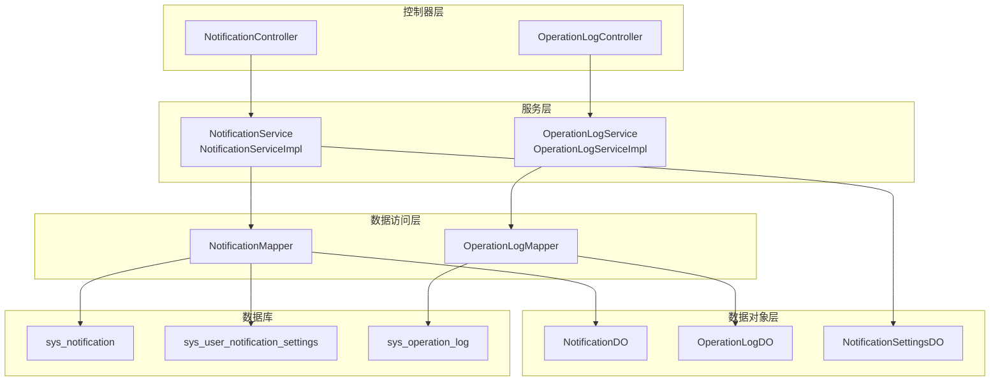
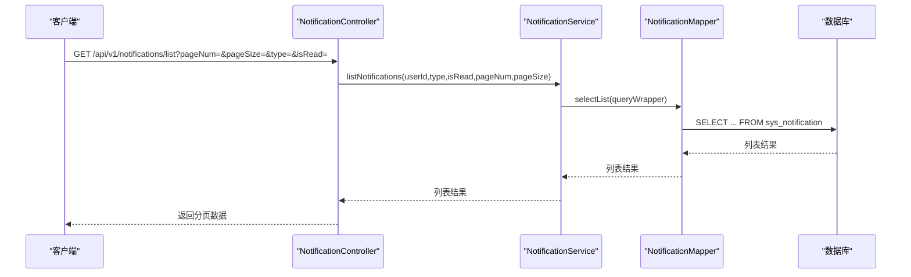
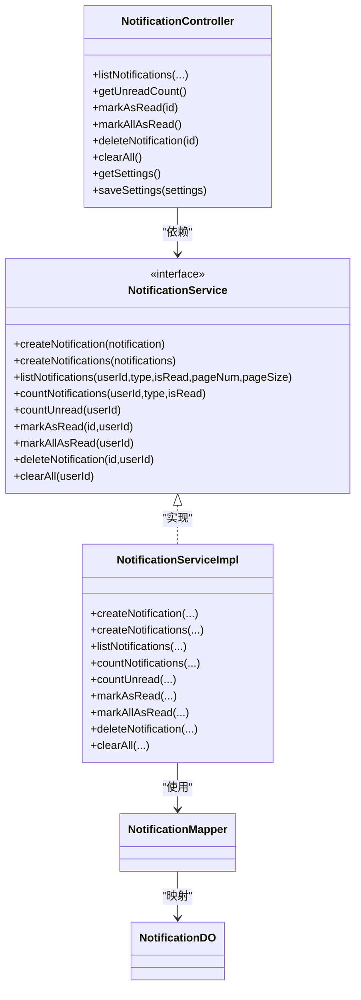
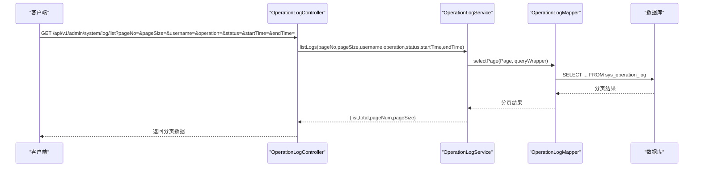
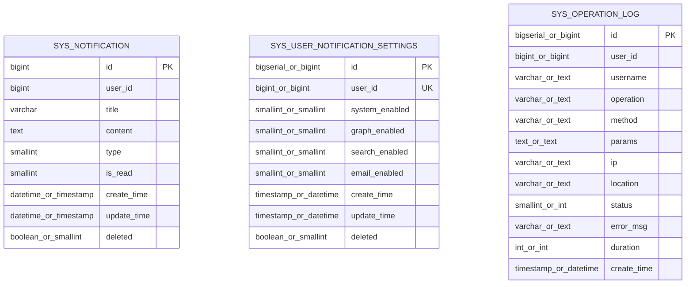
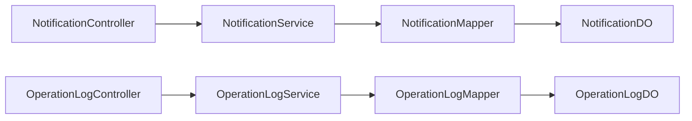

# 通知与日志管理

<cite>
**本文引用的文件**
- [NotificationController.java](file://graphiti-module-system/src/main/java/com/graphiti/system/controller/NotificationController.java)
- [OperationLogController.java](file://graphiti-module-system/src/main/java/com/graphiti/system/controller/OperationLogController.java)
- [NotificationService.java](file://graphiti-module-system/src/main/java/com/graphiti/system/service/NotificationService.java)
- [OperationLogService.java](file://graphiti-module-system/src/main/java/com/graphiti/system/service/OperationLogService.java)
- [NotificationServiceImpl.java](file://graphiti-module-system/src/main/java/com/graphiti/system/service/impl/NotificationServiceImpl.java)
- [OperationLogServiceImpl.java](file://graphiti-module-system/src/main/java/com/graphiti/system/service/impl/OperationLogServiceImpl.java)
- [NotificationDO.java](file://graphiti-module-system/src/main/java/com/graphiti/system/dal/dataobject/NotificationDO.java)
- [OperationLogDO.java](file://graphiti-module-system/src/main/java/com/graphiti/system/dal/dataobject/OperationLogDO.java)
- [NotificationSettingsDO.java](file://graphiti-module-system/src/main/java/com/graphiti/system/dal/dataobject/NotificationSettingsDO.java)
- [NotificationMapper.java](file://graphiti-module-system/src/main/java/com/graphiti/system/dal/mysql/NotificationMapper.java)
- [OperationLogMapper.java](file://graphiti-module-system/src/main/java/com/graphiti/system/dal/mysql/OperationLogMapper.java)
- [V2__create_notification_tables.sql(MySQL)](file://sql/mysql/V2__create_notification_tables.sql)
- [V2__create_notification_tables.sql(PostgreSQL)](file://sql/postgresql/V2__create_notification_tables.sql)
</cite>

## 目录
1. [简介](#简介)
2. [项目结构](#项目结构)
3. [核心组件](#核心组件)
4. [架构总览](#架构总览)
5. [详细组件分析](#详细组件分析)
6. [依赖分析](#依赖分析)
7. [性能考虑](#性能考虑)
8. [故障排查指南](#故障排查指南)
9. [结论](#结论)
10. [附录：API 文档与使用示例](#附录api-文档与使用示例)

## 简介
本文件面向“通知与日志管理”模块，系统性梳理通知管理与操作日志管理的接口、服务实现、数据模型与数据库设计，覆盖通知的创建、查询、标记已读、批量处理、清理与设置；以及操作日志的分页查询、详情获取、删除、清空与导出等能力。文档同时提供架构图、序列图、流程图与API参考，帮助开发者快速理解与集成。

## 项目结构
该模块位于 graphiti-module-system 中，采用典型的分层架构：
- 控制器层：对外暴露 REST 接口，负责参数解析与响应封装
- 服务层：定义业务接口与实现类，封装事务与业务规则
- 数据访问层：MyBatis-Plus Mapper 接口，映射到数据库表
- 数据对象层：DO 对象承载表结构与字段语义
- 数据库脚本：提供 MySQL 与 PostgreSQL 的初始化表结构

图表来源
- [NotificationController.java:24-138](file://graphiti-module-system/src/main/java/com/graphiti/system/controller/NotificationController.java#L24-L138)
- [OperationLogController.java:18-72](file://graphiti-module-system/src/main/java/com/graphiti/system/controller/OperationLogController.java#L18-L72)
- [NotificationServiceImpl.java:22-140](file://graphiti-module-system/src/main/java/com/graphiti/system/service/impl/NotificationServiceImpl.java#L22-L140)
- [OperationLogServiceImpl.java:23-105](file://graphiti-module-system/src/main/java/com/graphiti/system/service/impl/OperationLogServiceImpl.java#L23-L105)
- [NotificationMapper.java:10-12](file://graphiti-module-system/src/main/java/com/graphiti/system/dal/mysql/NotificationMapper.java#L10-L12)
- [OperationLogMapper.java:10-12](file://graphiti-module-system/src/main/java/com/graphiti/system/dal/mysql/OperationLogMapper.java#L10-L12)
- [NotificationDO.java:14-35](file://graphiti-module-system/src/main/java/com/graphiti/system/dal/dataobject/NotificationDO.java#L14-L35)
- [OperationLogDO.java:14-41](file://graphiti-module-system/src/main/java/com/graphiti/system/dal/dataobject/OperationLogDO.java#L14-L41)
- [NotificationSettingsDO.java:14-35](file://graphiti-module-system/src/main/java/com/graphiti/system/dal/dataobject/NotificationSettingsDO.java#L14-L35)

章节来源
- [NotificationController.java:24-138](file://graphiti-module-system/src/main/java/com/graphiti/system/controller/NotificationController.java#L24-L138)
- [OperationLogController.java:18-72](file://graphiti-module-system/src/main/java/com/graphiti/system/controller/OperationLogController.java#L18-L72)

## 核心组件
- 通知管理控制器：提供通知列表、未读计数、标记已读、批量标记、删除与清空、通知设置读取与保存等接口
- 操作日志控制器：提供分页查询、详情获取、删除单条、清空、导出等接口
- 通知服务接口与实现：封装通知的增删改查、批量创建、统计与清理
- 操作日志服务接口与实现：封装日志分页、查询、导出与持久化
- 数据对象：NotificationDO、OperationLogDO、NotificationSettingsDO
- Mapper：NotificationMapper、OperationLogMapper

章节来源
- [NotificationController.java:51-137](file://graphiti-module-system/src/main/java/com/graphiti/system/controller/NotificationController.java#L51-L137)
- [OperationLogController.java:27-71](file://graphiti-module-system/src/main/java/com/graphiti/system/controller/OperationLogController.java#L27-L71)
- [NotificationService.java:9-76](file://graphiti-module-system/src/main/java/com/graphiti/system/service/NotificationService.java#L9-L76)
- [OperationLogService.java:10-44](file://graphiti-module-system/src/main/java/com/graphiti/system/service/OperationLogService.java#L10-L44)
- [NotificationServiceImpl.java:22-140](file://graphiti-module-system/src/main/java/com/graphiti/system/service/impl/NotificationServiceImpl.java#L22-L140)
- [OperationLogServiceImpl.java:23-105](file://graphiti-module-system/src/main/java/com/graphiti/system/service/impl/OperationLogServiceImpl.java#L23-L105)
- [NotificationDO.java:14-35](file://graphiti-module-system/src/main/java/com/graphiti/system/dal/dataobject/NotificationDO.java#L14-L35)
- [OperationLogDO.java:14-41](file://graphiti-module-system/src/main/java/com/graphiti/system/dal/dataobject/OperationLogDO.java#L14-L41)
- [NotificationSettingsDO.java:14-35](file://graphiti-module-system/src/main/java/com/graphiti/system/dal/dataobject/NotificationSettingsDO.java#L14-L35)
- [NotificationMapper.java:10-12](file://graphiti-module-system/src/main/java/com/graphiti/system/dal/mysql/NotificationMapper.java#L10-L12)
- [OperationLogMapper.java:10-12](file://graphiti-module-system/src/main/java/com/graphiti/system/dal/mysql/OperationLogMapper.java#L10-L12)

## 架构总览
通知与日志管理遵循经典的分层架构，控制器负责鉴权与参数校验，服务层封装业务与事务，Mapper 负责数据持久化，DO 映射数据库表结构。

图表来源
- [NotificationController.java:51-69](file://graphiti-module-system/src/main/java/com/graphiti/system/controller/NotificationController.java#L51-L69)
- [NotificationServiceImpl.java:48-68](file://graphiti-module-system/src/main/java/com/graphiti/system/service/impl/NotificationServiceImpl.java#L48-L68)
- [NotificationMapper.java:10-12](file://graphiti-module-system/src/main/java/com/graphiti/system/dal/mysql/NotificationMapper.java#L10-L12)

## 详细组件分析

### 通知管理组件
- 控制器接口职责
  - 列表查询：支持按类型与已读状态筛选，分页返回
  - 未读计数：返回当前用户未读通知数量
  - 标记已读：单条与全部标记
  - 删除与清空：单条删除与清理用户全部通知
  - 通知设置：读取与保存用户偏好（系统/图谱/检索/邮件）
- 服务实现要点
  - 创建通知：自动填充时间戳与默认值，批量创建逐条处理
  - 查询与统计：基于 MyBatis-Plus 条件构造器，支持多条件组合与排序
  - 标记已读/清空：使用更新包装器，确保仅对未删除记录生效
  - 事务控制：批量创建与更新均在事务中执行，保证一致性

图表来源
- [NotificationController.java:24-138](file://graphiti-module-system/src/main/java/com/graphiti/system/controller/NotificationController.java#L24-L138)
- [NotificationService.java:9-76](file://graphiti-module-system/src/main/java/com/graphiti/system/service/NotificationService.java#L9-L76)
- [NotificationServiceImpl.java:22-140](file://graphiti-module-system/src/main/java/com/graphiti/system/service/impl/NotificationServiceImpl.java#L22-L140)
- [NotificationMapper.java:10-12](file://graphiti-module-system/src/main/java/com/graphiti/system/dal/mysql/NotificationMapper.java#L10-L12)
- [NotificationDO.java:14-35](file://graphiti-module-system/src/main/java/com/graphiti/system/dal/dataobject/NotificationDO.java#L14-L35)

章节来源
- [NotificationController.java:51-137](file://graphiti-module-system/src/main/java/com/graphiti/system/controller/NotificationController.java#L51-L137)
- [NotificationServiceImpl.java:26-139](file://graphiti-module-system/src/main/java/com/graphiti/system/service/impl/NotificationServiceImpl.java#L26-L139)

### 操作日志组件
- 控制器接口职责
  - 分页查询：支持用户名、操作名、状态、时间范围过滤
  - 日志详情：按 ID 获取
  - 删除与清空：单条删除与全量清空
  - 导出：按条件导出日志列表
- 服务实现要点
  - 分页查询：使用 MyBatis-Plus Page 进行分页，支持多条件动态拼装
  - 导出：与查询逻辑一致，但不进行分页
  - 持久化：统一设置创建时间后入库

图表来源
- [OperationLogController.java:27-39](file://graphiti-module-system/src/main/java/com/graphiti/system/controller/OperationLogController.java#L27-L39)
- [OperationLogServiceImpl.java:27-56](file://graphiti-module-system/src/main/java/com/graphiti/system/service/impl/OperationLogServiceImpl.java#L27-L56)
- [OperationLogMapper.java:10-12](file://graphiti-module-system/src/main/java/com/graphiti/system/dal/mysql/OperationLogMapper.java#L10-L12)

章节来源
- [OperationLogController.java:27-71](file://graphiti-module-system/src/main/java/com/graphiti/system/controller/OperationLogController.java#L27-L71)
- [OperationLogServiceImpl.java:27-104](file://graphiti-module-system/src/main/java/com/graphiti/system/service/impl/OperationLogServiceImpl.java#L27-L104)

### 数据模型与字段说明
- 通知数据对象（NotificationDO）
  - 字段概览：主键、用户ID、标题、内容、类型、已读状态、创建/更新时间、删除标记
  - 类型枚举：type=1 系统通知、2 图谱通知、3 检索通知；isRead=0 未读、1 已读；deleted=false 有效
- 操作日志数据对象（OperationLogDO）
  - 字段概览：主键、用户ID、用户名、操作描述、方法、请求参数、IP、位置、状态、错误信息、耗时、创建时间
  - 状态：status=0 失败、1 成功
- 通知设置数据对象（NotificationSettingsDO）
  - 字段概览：主键、用户ID、系统/图谱/检索/邮件通知开关、创建/更新时间、删除标记
  - 开关：0 关闭、1 开启

图表来源
- [V2__create_notification_tables.sql(MySQL):7-36](file://sql/mysql/V2__create_notification_tables.sql#L7-L36)
- [V2__create_notification_tables.sql(PostgreSQL):7-79](file://sql/postgresql/V2__create_notification_tables.sql#L7-L79)
- [NotificationDO.java:14-35](file://graphiti-module-system/src/main/java/com/graphiti/system/dal/dataobject/NotificationDO.java#L14-L35)
- [OperationLogDO.java:14-41](file://graphiti-module-system/src/main/java/com/graphiti/system/dal/dataobject/OperationLogDO.java#L14-L41)
- [NotificationSettingsDO.java:14-35](file://graphiti-module-system/src/main/java/com/graphiti/system/dal/dataobject/NotificationSettingsDO.java#L14-L35)

章节来源
- [NotificationDO.java:14-35](file://graphiti-module-system/src/main/java/com/graphiti/system/dal/dataobject/NotificationDO.java#L14-L35)
- [OperationLogDO.java:14-41](file://graphiti-module-system/src/main/java/com/graphiti/system/dal/dataobject/OperationLogDO.java#L14-L41)
- [NotificationSettingsDO.java:14-35](file://graphiti-module-system/src/main/java/com/graphiti/system/dal/dataobject/NotificationSettingsDO.java#L14-L35)

### 通知发送机制与模板（概念说明）
- 发送机制（概念）
  - 通知创建：通过服务层 createNotification 或 createNotifications 写入数据库
  - 前端拉取：前端轮询或 WebSocket 推送（由前端或网关层实现），后端提供列表与未读计数接口
  - 设置联动：根据 NotificationSettingsDO 的开关决定是否允许发送对应类型通知
- 模板与内容
  - 标题与内容由业务侧生成，存储于 NotificationDO 的 title 与 content 字段
  - 可扩展：建议在服务层增加模板解析与变量替换逻辑，以支持动态内容生成
- 审计与追踪
  - 通知记录包含创建/更新时间与删除标记，便于审计与追踪

章节来源
- [NotificationServiceImpl.java:26-46](file://graphiti-module-system/src/main/java/com/graphiti/system/service/impl/NotificationServiceImpl.java#L26-L46)
- [NotificationController.java:120-137](file://graphiti-module-system/src/main/java/com/graphiti/system/controller/NotificationController.java#L120-L137)
- [NotificationSettingsDO.java:22-28](file://graphiti-module-system/src/main/java/com/graphiti/system/dal/dataobject/NotificationSettingsDO.java#L22-L28)

### 日志分类管理与导出
- 分类与维度
  - 按用户名、操作名称、状态（成功/失败）、时间范围进行过滤
  - 支持导出满足条件的日志列表，便于离线分析
- 敏感信息过滤（建议）
  - 参数过滤：可在服务层对 params 字段进行脱敏处理后再入库
  - 错误信息：可对 error_msg 进行脱敏与截断，避免敏感信息泄露
- 统计与报表
  - 可基于导出数据进行统计分析，如失败率、平均耗时、热点操作等

章节来源
- [OperationLogController.java:27-71](file://graphiti-module-system/src/main/java/com/graphiti/system/controller/OperationLogController.java#L27-L71)
- [OperationLogServiceImpl.java:27-96](file://graphiti-module-system/src/main/java/com/graphiti/system/service/impl/OperationLogServiceImpl.java#L27-L96)
- [OperationLogDO.java:20-40](file://graphiti-module-system/src/main/java/com/graphiti/system/dal/dataobject/OperationLogDO.java#L20-L40)

## 依赖分析
- 控制器依赖服务接口，服务实现依赖 Mapper，Mapper 依赖 DO
- 通知与日志分别独立，互不耦合
- 数据库层面，通知与设置表、日志表分离，索引覆盖常用查询条件

图表来源
- [NotificationController.java:24-138](file://graphiti-module-system/src/main/java/com/graphiti/system/controller/NotificationController.java#L24-L138)
- [OperationLogController.java:18-72](file://graphiti-module-system/src/main/java/com/graphiti/system/controller/OperationLogController.java#L18-L72)
- [NotificationServiceImpl.java:22-140](file://graphiti-module-system/src/main/java/com/graphiti/system/service/impl/NotificationServiceImpl.java#L22-L140)
- [OperationLogServiceImpl.java:23-105](file://graphiti-module-system/src/main/java/com/graphiti/system/service/impl/OperationLogServiceImpl.java#L23-L105)

章节来源
- [NotificationMapper.java:10-12](file://graphiti-module-system/src/main/java/com/graphiti/system/dal/mysql/NotificationMapper.java#L10-L12)
- [OperationLogMapper.java:10-12](file://graphiti-module-system/src/main/java/com/graphiti/system/dal/mysql/OperationLogMapper.java#L10-L12)

## 性能考虑
- 查询优化
  - 通知表：user_id、type、is_read、deleted、create_time 均建立索引，适合按用户与状态分页查询
  - 日志表：username、operation、status、create_time 建立索引，适合多维过滤分页
- 分页策略
  - 使用 MyBatis-Plus Page 实现物理分页，避免一次性加载大量数据
- 写入优化
  - 批量创建通知时逐条插入，若需更高吞吐可考虑批量写入或异步队列
- 缓存建议
  - 未读计数可缓存，结合 Redis 在用户侧做短期缓存，降低数据库压力

## 故障排查指南
- 通知无法标记已读
  - 检查用户上下文是否正确解析，确认 userId 与通知所属用户匹配
  - 确认通知未被逻辑删除（deleted=false）
- 通知列表为空
  - 检查筛选条件（type、isRead）是否过于严格
  - 确认分页参数（pageNum、pageSize）合理
- 日志查询无结果
  - 检查时间范围格式是否正确（期望为字符串时间）
  - 确认过滤字段（username、operation、status）是否为空导致未拼装条件
- 清空日志后仍可见
  - 确认数据库中日志是否真正删除或存在其他副本
- 异常处理
  - 服务层使用事务注解，异常会回滚；可在日志中查看具体错误堆栈

章节来源
- [NotificationServiceImpl.java:91-115](file://graphiti-module-system/src/main/java/com/graphiti/system/service/impl/NotificationServiceImpl.java#L91-L115)
- [OperationLogServiceImpl.java:27-56](file://graphiti-module-system/src/main/java/com/graphiti/system/service/impl/OperationLogServiceImpl.java#L27-L56)

## 结论
通知与日志管理模块提供了完善的用户通知生命周期管理与后台操作审计能力。通过清晰的分层设计与规范的数据模型，模块具备良好的可扩展性与可维护性。建议后续增强通知模板引擎、敏感信息脱敏与日志统计分析能力，进一步提升用户体验与合规水平。

## 附录：API 文档与使用示例

### 通知管理 API
- 获取通知列表
  - 方法：GET
  - 路径：/api/v1/notifications/list
  - 查询参数：type（通知类型）、isRead（已读状态）、pageNum、pageSize
  - 返回：分页数据（list、total、pageNum、pageSize）
- 获取未读通知数量
  - 方法：GET
  - 路径：/api/v1/notifications/unread-count
  - 返回：{ count }
- 标记通知为已读
  - 方法：PUT
  - 路径：/api/v1/notifications/{id}/read
- 全部标记为已读
  - 方法：PUT
  - 路径：/api/v1/notifications/read-all
- 删除通知
  - 方法：DELETE
  - 路径：/api/v1/notifications/{id}
- 清空所有通知
  - 方法：DELETE
  - 路径：/api/v1/notifications/clear
- 获取通知设置
  - 方法：GET
  - 路径：/api/v1/notifications/settings
- 保存通知设置
  - 方法：PUT
  - 路径：/api/v1/notifications/settings
  - 请求体：NotificationSettingsDO

章节来源
- [NotificationController.java:51-137](file://graphiti-module-system/src/main/java/com/graphiti/system/controller/NotificationController.java#L51-L137)

### 操作日志管理 API
- 分页查询日志
  - 方法：GET
  - 路径：/api/v1/admin/system/log/list
  - 查询参数：pageNo、pageSize、username、operation、status、startTime、endTime
  - 返回：分页数据（list、total、pageNum、pageSize）
- 获取日志详情
  - 方法：GET
  - 路径：/api/v1/admin/system/log/{id}
- 删除单条日志
  - 方法：DELETE
  - 路径：/api/v1/admin/system/log/{id}
- 清空所有日志
  - 方法：DELETE
  - 路径：/api/v1/admin/system/log/clear
- 导出日志
  - 方法：GET
  - 路径：/api/v1/admin/system/log/export
  - 查询参数：username、operation、status、startTime、endTime
  - 返回：日志列表

章节来源
- [OperationLogController.java:27-71](file://graphiti-module-system/src/main/java/com/graphiti/system/controller/OperationLogController.java#L27-L71)

### 数据模型字段说明（摘要）
- 通知（NotificationDO）
  - id、userId、title、content、type、isRead、createTime、updateTime、deleted
- 操作日志（OperationLogDO）
  - id、userId、username、operation、method、params、ip、location、status、errorMsg、duration、createTime
- 通知设置（NotificationSettingsDO）
  - id、userId、systemEnabled、graphEnabled、searchEnabled、emailEnabled、createTime、updateTime、deleted

章节来源
- [NotificationDO.java:14-35](file://graphiti-module-system/src/main/java/com/graphiti/system/dal/dataobject/NotificationDO.java#L14-L35)
- [OperationLogDO.java:14-41](file://graphiti-module-system/src/main/java/com/graphiti/system/dal/dataobject/OperationLogDO.java#L14-L41)
- [NotificationSettingsDO.java:14-35](file://graphiti-module-system/src/main/java/com/graphiti/system/dal/dataobject/NotificationSettingsDO.java#L14-L35)