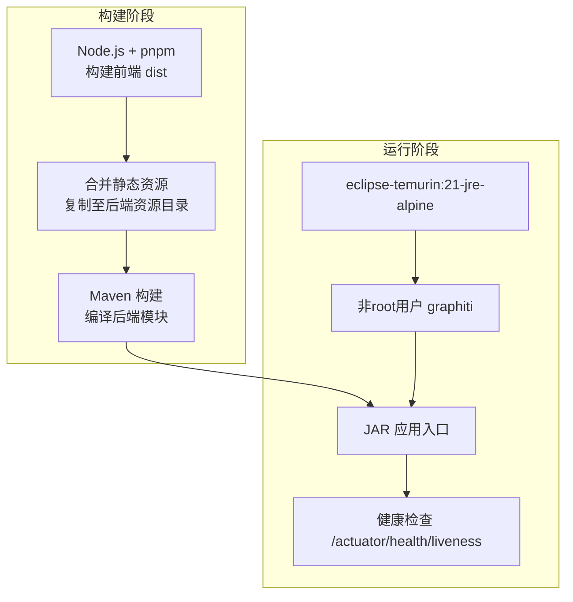
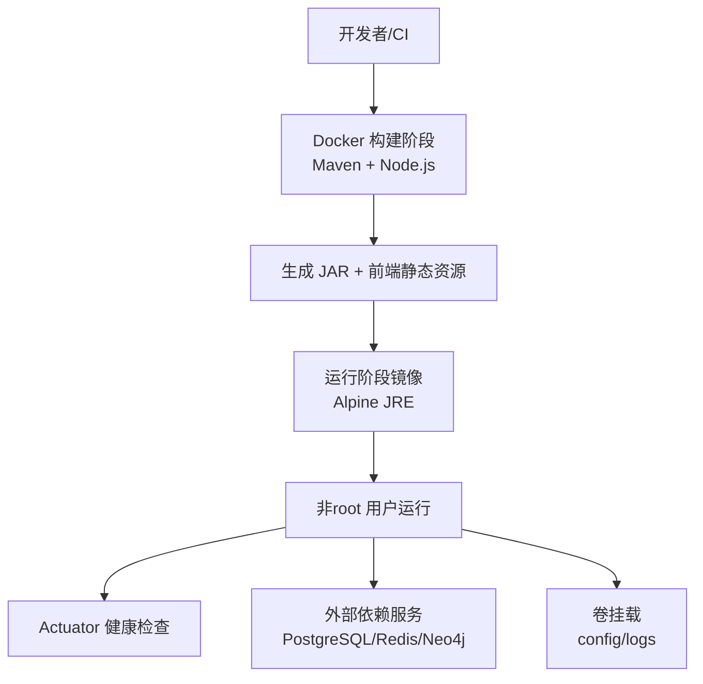
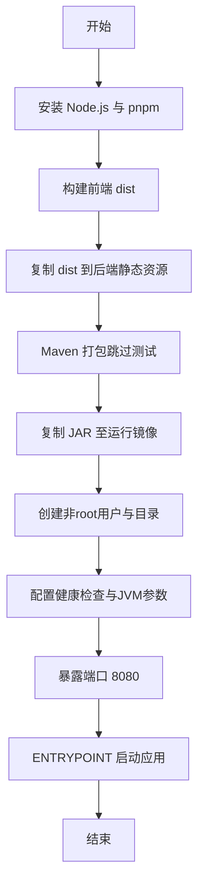
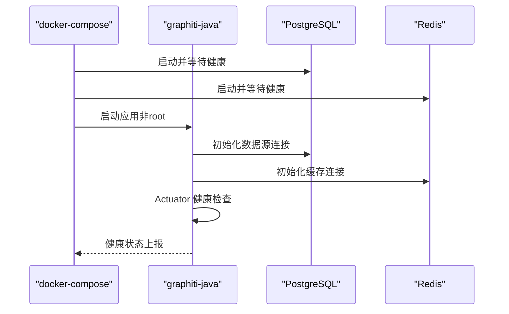
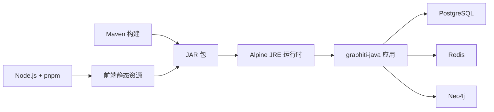

# 容器化部署

<!--<cite>
**本文引用的文件**
- [Dockerfile](file://docker/Dockerfile)
- [docker-compose.yml](file://docker-compose.yml)
- [docker-compose.prod.yml](file://docker-compose.prod.yml)
- [application.yml](file://graphiti-server/src/main/resources/application.yml)
- [application-dev.yml](file://graphiti-server/src/main/resources/application-dev.yml)
- [GraphitiApplication.java](file://graphiti-server/src/main/java/com/graphiti/GraphitiApplication.java)
- [pom.xml](file://pom.xml)
- [README.md](file://README.md)
</cite>-->

## 目录
1. [简介](#简介)
2. [项目结构](#项目结构)
3. [核心组件](#核心组件)
4. [架构总览](#架构总览)
5. [详细组件分析](#详细组件分析)
6. [依赖分析](#依赖分析)
7. [性能考虑](#性能考虑)
8. [故障排除指南](#故障排除指南)
9. [结论](#结论)
10. [附录](#附录)

## 简介
本文件面向Graphiti-Java的容器化部署，系统性阐述多阶段Docker构建流程（前端构建阶段与后端编译阶段）、运行时JRE环境与非root安全配置、健康检查机制以及JVM内存调优参数。同时提供docker-compose开发与生产环境配置的对比说明，涵盖容器网络、卷挂载策略与环境变量设置；解释容器启动流程、依赖服务连接顺序与常见故障排查方法，并给出容器镜像构建、推送与拉取的最佳实践。

## 项目结构
Graphiti-Java采用前后端分离的多模块Maven工程，后端为Spring Boot应用，前端为Vue 3 + Vite项目。容器化采用多阶段Dockerfile：第一阶段使用Maven与Node.js工具链完成前端打包与后端编译，第二阶段基于轻量Alpine JRE运行时镜像，复制JAR并以非root用户运行，内置健康检查与JVM参数。

图表来源
- [Dockerfile:4-36](file://docker/Dockerfile#L4-L36)
- [Dockerfile:38-75](file://docker/Dockerfile#L38-L75)

章节来源
- [Dockerfile:1-75](file://docker/Dockerfile#L1-L75)
- [pom.xml:15-20](file://pom.xml#L15-L20)

## 核心组件
- 多阶段Dockerfile
  - 构建阶段：安装Node.js与pnpm，构建前端；拷贝后端源码，使用Maven跳过测试进行打包。
  - 运行阶段：基于Alpine JRE，安装运行时依赖，创建非root用户，复制JAR，配置目录与权限，设置健康检查与JVM参数，以非root用户运行。
- docker-compose开发与生产配置
  - 开发：本地端口映射、依赖服务健康检查条件、环境变量覆盖、网络隔离。
  - 生产：资源限制、重启策略、外部配置与日志卷挂载、更严格的健康检查与日志级别。
- 应用配置与启动
  - Spring Boot基础配置与开发配置文件，Actuator健康端点开放策略，应用入口类负责排除不必要的自动配置。

章节来源
- [Dockerfile:4-36](file://docker/Dockerfile#L4-L36)
- [Dockerfile:38-75](file://docker/Dockerfile#L38-L75)
- [docker-compose.yml:12-112](file://docker-compose.yml#L12-L112)
- [docker-compose.prod.yml:11-122](file://docker-compose.prod.yml#L11-L122)
- [application.yml:1-67](file://graphiti-server/src/main/resources/application.yml#L1-L67)
- [application-dev.yml:615-635](file://graphiti-server/src/main/resources/application-dev.yml#L615-L635)
- [GraphitiApplication.java:15-34](file://graphiti-server/src/main/java/com/graphiti/GraphitiApplication.java#L15-L34)

## 架构总览
容器化部署围绕“构建-运行”两条主线展开：构建阶段产出可执行JAR并内嵌前端静态资源；运行阶段在轻量JRE环境中以非root身份运行，通过健康检查保障可用性，并通过环境变量与卷挂载实现灵活配置与可观测性。

图表来源
- [Dockerfile:4-36](file://docker/Dockerfile#L4-L36)
- [Dockerfile:38-75](file://docker/Dockerfile#L38-L75)
- [docker-compose.yml:12-112](file://docker-compose.yml#L12-L112)
- [docker-compose.prod.yml:11-122](file://docker-compose.prod.yml#L11-L122)

## 详细组件分析

### 多阶段Docker构建流程
- 构建阶段要点
  - 使用Maven镜像作为构建环境，预装Node.js与pnpm，确保前端构建工具链可用。
  - 在graphiti-web目录执行pnpm安装与构建，生成dist静态资源。
  - 将dist复制到后端resources/static目录，使JAR内嵌静态资源。
  - 在graphiti-server目录执行Maven打包，跳过测试以加速构建。
- 运行阶段要点
  - 基于eclipse-temurin:21-jre-alpine，体积小且满足JDK 21运行需求。
  - 安装curl、bash、tzdata等运行时依赖，设置时区为Asia/Shanghai。
  - 创建非root用户graphiti并切换，提升安全性。
  - 复制JAR至/app路径，创建/config与/logs目录并赋予graphiti权限。
  - 配置健康检查，访问/actuator/health/liveness；暴露8080端口。
  - 设置JVM参数：启用容器内存感知与百分比堆上限，可通过环境变量覆盖。

图表来源
- [Dockerfile:4-36](file://docker/Dockerfile#L4-L36)
- [Dockerfile:38-75](file://docker/Dockerfile#L38-L75)

章节来源
- [Dockerfile:4-36](file://docker/Dockerfile#L4-L36)
- [Dockerfile:38-75](file://docker/Dockerfile#L38-L75)

### 运行时JRE、非root用户与健康检查
- JRE运行时环境
  - 使用eclipse-temurin:21-jre-alpine，满足Java 21运行与容器内存感知。
- 非root用户安全配置
  - 创建graphiti用户与组，设置UID/GID，工作目录/app，权限归属/logs与/config。
- 健康检查机制
  - 通过curl探测/actuator/health/liveness，设置轮询间隔、超时与重试次数，生产环境增加启动期。
- JVM内存调优参数
  - 默认通过环境变量JAVA_OPTS设置容器内存感知与堆上限百分比；生产环境可直接指定-Xms/-Xmx覆盖默认值。

章节来源
- [Dockerfile:40-48](file://docker/Dockerfile#L40-L48)
- [Dockerfile:56-63](file://docker/Dockerfile#L56-L63)
- [Dockerfile:68-74](file://docker/Dockerfile#L68-L74)
- [docker-compose.prod.yml:24-28](file://docker-compose.prod.yml#L24-L28)

### docker-compose开发与生产环境对比
- 网络
  - 开发与生产均使用bridge网络graphiti-network，便于服务间通信。
- 服务与端口映射
  - graphiti-java：开发映射8080:8080；生产未映射端口，通过反向代理或负载均衡暴露。
- 依赖服务
  - PostgreSQL：开发与生产均提供健康检查与数据持久化卷。
  - Redis：开发与生产均提供健康检查与AOF持久化。
  - Neo4j：开发通过环境变量配置URI/凭据；生产建议外部独立部署或使用服务网格。
- 环境变量
  - 开发：激活dev配置，数据库、Redis、Neo4j、LLM Provider、JWT密钥、日志级别等。
  - 生产：激活prod配置，JVM堆大小、日志级别、连接池参数、禁用敏感端点等。
- 卷挂载
  - 开发：无外部卷挂载，依赖容器内目录。
  - 生产：挂载/config（只读）与/logs目录，便于外部运维与日志采集。
- 健康检查与重启策略
  - 开发：graphiti-java无重启策略，依赖compose管理；PostgreSQL/Redis健康检查。
  - 生产：各服务设置unless-stopped重启策略与更长启动期健康检查。

章节来源
- [docker-compose.yml:12-112](file://docker-compose.yml#L12-L112)
- [docker-compose.prod.yml:11-122](file://docker-compose.prod.yml#L11-L122)

### 容器启动流程与依赖连接
- 启动顺序
  - compose按服务定义启动，graphiti-java通过depends_on等待PostgreSQL健康，再启动Redis。
- 依赖连接
  - 数据库：通过PostgreSQL服务名连接，使用环境变量注入URL、用户名与密码。
  - 缓存：通过Redis服务名连接，使用环境变量注入主机与端口。
  - 图数据库：通过Neo4j服务名连接，使用环境变量注入URI、用户名与密码。
  - LLM：通过Spring AI配置，使用环境变量注入Provider API Key与Base URL。
- Actuator与健康检查
  - 应用内部暴露/actuator/health，compose外部通过curl探测，确保服务可用。

图表来源
- [docker-compose.yml:55-61](file://docker-compose.yml#L55-L61)
- [docker-compose.yml:66-104](file://docker-compose.yml#L66-L104)
- [Dockerfile:60-63](file://docker/Dockerfile#L60-L63)
- [application.yml:43-55](file://graphiti-server/src/main/resources/application.yml#L43-L55)

章节来源
- [docker-compose.yml:12-112](file://docker-compose.yml#L12-L112)
- [Dockerfile:60-63](file://docker/Dockerfile#L60-L63)
- [application.yml:43-55](file://graphiti-server/src/main/resources/application.yml#L43-L55)

### 关键配置项与最佳实践
- 端口与网络
  - 8080对外暴露（开发），生产建议通过反向代理或Kubernetes Service暴露。
  - 使用自定义bridge网络隔离服务，避免端口冲突。
- 卷挂载策略
  - config：外部只读挂载，便于热更新配置（如日志级别、连接池参数）。
  - logs：外部可写挂载，便于集中采集与归档。
- 环境变量设置
  - SPRING_PROFILES_ACTIVE：切换dev/prod。
  - 数据库/缓存/图数据库/LLM Provider：通过环境变量注入，避免硬编码。
  - JWT密钥与过期时间：生产环境务必随机化与轮换。
- 健康检查与监控
  - 应用层：/actuator/health/liveness。
  - Compose层：服务级健康检查与重启策略。
- 安全加固
  - 非root运行、最小权限、只读根文件系统（可选）、seccomp/ulimit约束（可选）。

章节来源
- [docker-compose.yml:23-54](file://docker-compose.yml#L23-L54)
- [docker-compose.prod.yml:24-42](file://docker-compose.prod.yml#L24-L42)
- [Dockerfile:47-58](file://docker/Dockerfile#L47-L58)

## 依赖分析
- 构建依赖
  - Maven：后端模块打包。
  - Node.js/pnpm：前端构建。
- 运行时依赖
  - JRE 21、curl、bash、tzdata。
- 应用依赖
  - Spring Boot、Spring AI、MyBatis-Plus、Neo4j驱动、Redisson、PostgreSQL驱动等。
- Compose依赖
  - PostgreSQL、Redis镜像，graphiti-java镜像由Dockerfile构建。

图表来源
- [Dockerfile:4-36](file://docker/Dockerfile#L4-L36)
- [Dockerfile:38-75](file://docker/Dockerfile#L38-L75)
- [docker-compose.yml:66-104](file://docker-compose.yml#L66-L104)

章节来源
- [pom.xml:45-196](file://pom.xml#L45-L196)
- [docker-compose.yml:66-104](file://docker-compose.yml#L66-L104)

## 性能考虑
- JVM内存调优
  - 默认使用容器内存感知与百分比堆上限；生产环境建议显式设置-Xms与-Xmx，结合容器内存限制（如2G）设定堆上限为1.5G左右，预留空间给GC与操作系统。
  - 可通过JAVA_OPTS覆盖默认参数，确保与容器资源限制一致。
- 连接池与数据库
  - 生产环境调整Hikari连接池最大池大小与空闲数，避免过度连接导致上下文切换开销。
- 缓存与Redis
  - 合理设置maxmemory与淘汰策略，开启AOF持久化，平衡性能与可靠性。
- 健康检查与探针
  - 生产环境延长start_period，降低误杀概率；缩短interval与timeout以快速发现故障。

章节来源
- [Dockerfile:68-74](file://docker/Dockerfile#L68-L74)
- [docker-compose.prod.yml:24-37](file://docker-compose.prod.yml#L24-L37)
- [docker-compose.prod.yml:95-111](file://docker-compose.prod.yml#L95-L111)

## 故障排除指南
- 应用无法启动或频繁重启
  - 检查健康检查是否失败：确认/actuator/health/liveness可达，依赖服务是否健康。
  - 查看容器日志：docker-compose logs -f，定位初始化异常。
- 依赖服务连接失败
  - 确认服务名与端口正确（postgres:5432、redis:6379、neo4j:7687）。
  - 检查环境变量是否正确注入（SPRING_DATASOURCE_*、SPRING_DATA_REDIS_*、NEO4J_*）。
- 权限问题（非root）
  - 确认/app/config与/logs目录已赋予graphiti用户权限，必要时使用卷挂载并设置只读。
- LLM Provider不可用
  - 检查SPRING_AI_*与GRAPHTI_AI_*环境变量，确认API Key与Base URL正确。
- Actuator端点不可见
  - 开发环境默认暴露所有端点；生产环境需按需开启/关闭敏感端点。

章节来源
- [docker-compose.yml:55-61](file://docker-compose.yml#L55-L61)
- [docker-compose.prod.yml:43-48](file://docker-compose.prod.yml#L43-L48)
- [application-dev.yml:615-635](file://graphiti-server/src/main/resources/application-dev.yml#L615-L635)
- [application.yml:43-55](file://graphiti-server/src/main/resources/application.yml#L43-L55)

## 结论
Graphiti-Java的容器化方案通过多阶段构建将前端与后端整合为单一可执行JAR，并在Alpine JRE上以非root用户安全运行。配合docker-compose的开发与生产配置，实现了灵活的环境切换、依赖服务编排、可观测性与安全加固。遵循本文的配置与最佳实践，可在不同环境中稳定交付Graphiti-Java服务。

## 附录

### 容器镜像构建、推送与拉取最佳实践
- 构建
  - 使用多阶段Dockerfile，减少最终镜像体积；在CI中缓存Maven与pnpm依赖以加速构建。
- 标签与版本
  - 采用语义化版本标签（如v1.0.0）与短commit哈希组合命名，便于追踪。
- 推送
  - 推送到私有仓库或公共仓库前，先在本地验证健康检查与基本功能；使用镜像签名与漏洞扫描。
- 拉取与运行
  - 在生产环境使用固定镜像标签；通过compose覆盖环境变量与卷挂载，避免硬编码。

### 关键配置清单（对照参考）
- 开发环境
  - 端口映射：8080:8080
  - 依赖：PostgreSQL、Redis、Neo4j
  - 环境变量：SPRING_PROFILES_ACTIVE=dev、数据库/Redis/Neo4j/LLM Provider、JWT、日志级别
- 生产环境
  - 资源限制：CPU与内存配额
  - 重启策略：unless-stopped
  - 卷挂载：./config:/app/config:ro、./logs:/app/logs
  - 环境变量：SPRING_PROFILES_ACTIVE=prod、JVM堆大小、日志级别、连接池参数

章节来源
- [docker-compose.yml:12-112](file://docker-compose.yml#L12-L112)
- [docker-compose.prod.yml:11-122](file://docker-compose.prod.yml#L11-L122)
- [Dockerfile:68-74](file://docker/Dockerfile#L68-L74)