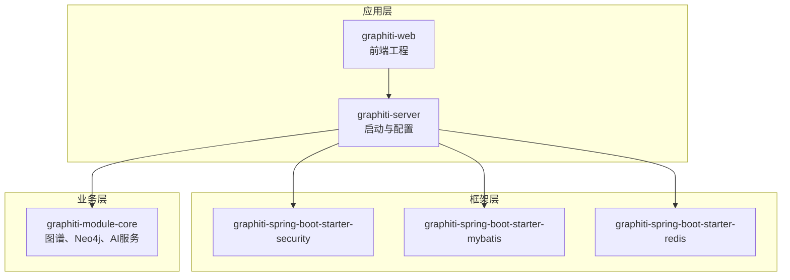
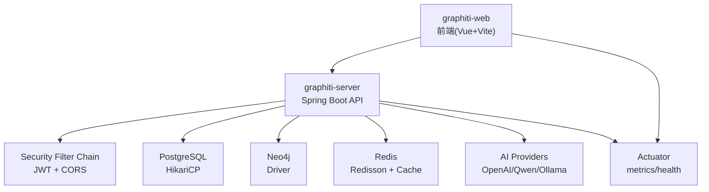
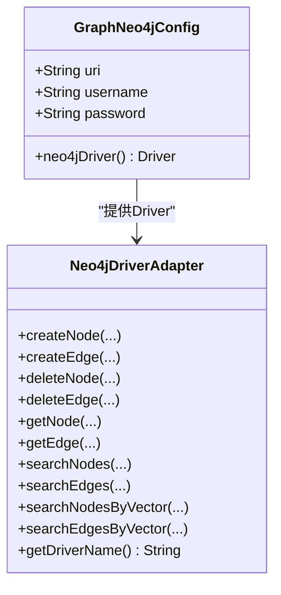
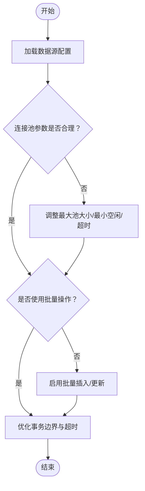
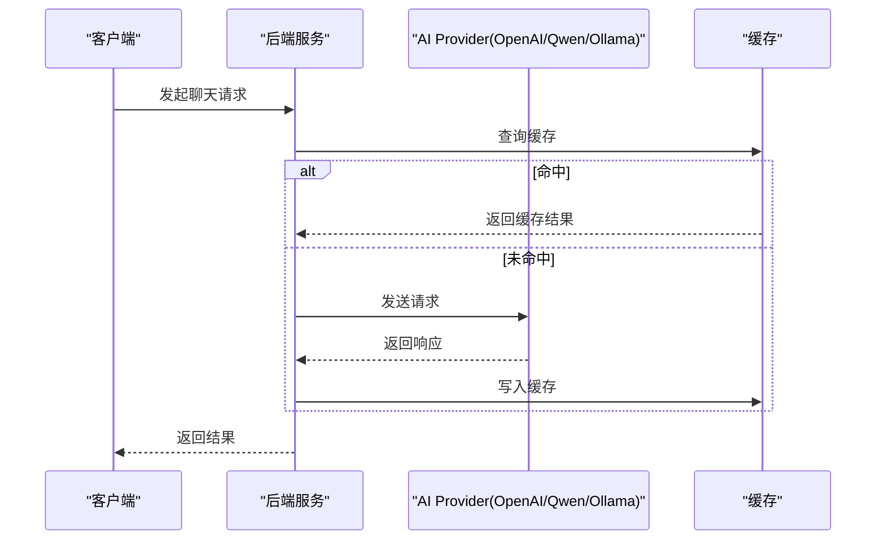
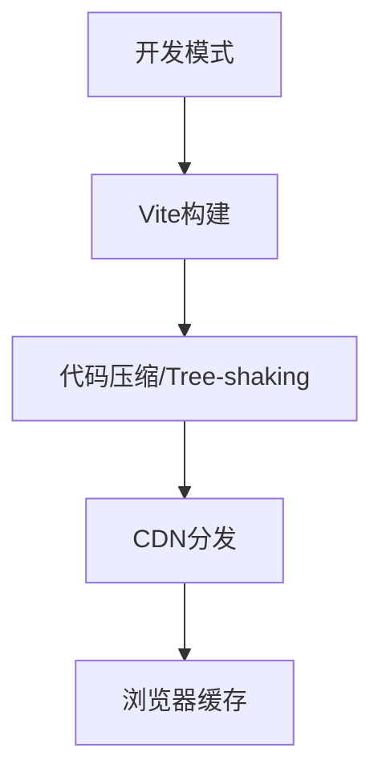
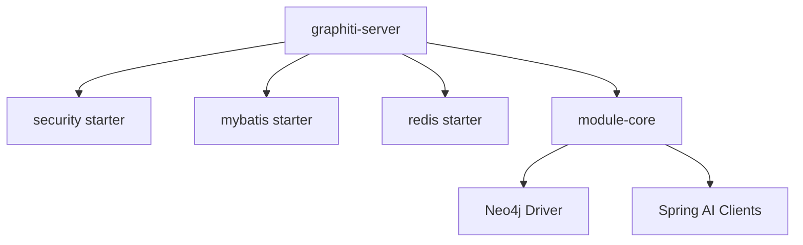

# 性能调优

<cite>
**本文引用的文件**
- [application.yml](file://graphiti-server/src/main/resources/application.yml)
- [application-dev.yml](file://graphiti-server/src/main/resources/application-dev.yml)
- [GraphNeo4jConfig.java](file://graphiti-module-core/src/main/java/com/neo4j/module/graphiti/config/GraphNeo4jConfig.java)
- [GraphitiAiProperties.java](file://graphiti-module-core/src/main/java/com/neo4j/module/graphiti/config/GraphitiAiProperties.java)
- [SecurityConfig.java](file://graphiti-framework/graphiti-spring-boot-starter-security/src/main/java/com/neo4j/framework/security/config/SecurityConfig.java)
- [OpenAiLlmClientServiceImpl.java](file://graphiti-module-core/src/main/java/com/neo4j/module/graphiti/service/impl/ai/OpenAiLlmClientServiceImpl.java)
- [QwenLlmClientServiceImpl.java](file://graphiti-module-core/src/main/java/com/neo4j/module/graphiti/service/impl/ai/QwenLlmClientServiceImpl.java)
- [OllamaLlmClientServiceImpl.java](file://graphiti-module-core/src/main/java/com/neo4j/module/graphiti/service/impl/ai/OllamaLlmClientServiceImpl.java)
- [GraphitiServiceImpl.java](file://graphiti-module-core/src/main/java/com/neo4j/module/graphiti/service/impl/GraphitiServiceImpl.java)
- [Neo4jDriverAdapter.java](file://graphiti-module-core/src/main/java/com/neo4j/module/graphiti/service/impl/Neo4jDriverAdapter.java)
- [pom.xml (graphiti-spring-boot-starter-redis)](file://graphiti-framework/graphiti-spring-boot-starter-redis/pom.xml)
- [pom.xml (graphiti-spring-boot-starter-mybatis)](file://graphiti-framework/graphiti-spring-boot-starter-mybatis/pom.xml)
- [package.json (graphiti-web)](file://graphiti-web/package.json)
- [vite.config.ts (graphiti-web)](file://graphiti-web/vite.config.ts)
- [monitor.ts (graphiti-web)](file://graphiti-web/src/api/monitor.ts)
</cite>

## 目录
1. [简介](#简介)
2. [项目结构](#项目结构)
3. [核心组件](#核心组件)
4. [架构总览](#架构总览)
5. [详细组件分析](#详细组件分析)
6. [依赖分析](#依赖分析)
7. [性能考虑](#性能考虑)
8. [故障排查指南](#故障排查指南)
9. [结论](#结论)
10. [附录](#附录)

## 简介
本指南面向Graphiti-Java项目的性能调优实践，围绕以下方面展开：
- JVM性能调优：堆内存设置、垃圾回收器选择、GC调优与容器内存感知配置
- 数据库连接池优化：连接数配置、查询超时与批量操作优化
- Redis缓存性能：命中率优化、过期策略与内存使用控制
- Neo4j图数据库优化：索引策略、查询计划优化与事务管理
- AI服务调用优化：并发控制、请求限流与响应缓存
- 前端性能优化：静态资源压缩、CDN与浏览器缓存策略
- 性能测试方法、基准测试与瓶颈分析工具使用

## 项目结构
Graphiti-Java采用多模块分层组织，核心模块包括：
- graphiti-server：应用启动与配置入口
- graphiti-framework：通用框架与starter封装（安全、MyBatis、Redis等）
- graphiti-module-core：业务核心（图谱管理、Neo4j驱动、AI服务等）
- graphiti-web：Vue前端工程（Vite构建、代理与样式）

**图表来源**
- [application.yml:1-67](file://graphiti-server/src/main/resources/application.yml#L1-L67)
- [application-dev.yml:1-676](file://graphiti-server/src/main/resources/application-dev.yml#L1-L676)
- [pom.xml (graphiti-spring-boot-starter-mybatis):1-51](file://graphiti-framework/graphiti-spring-boot-starter-mybatis/pom.xml#L1-L51)
- [pom.xml (graphiti-spring-boot-starter-redis):1-39](file://graphiti-framework/graphiti-spring-boot-starter-redis/pom.xml#L1-L39)

**章节来源**
- [application.yml:1-67](file://graphiti-server/src/main/resources/application.yml#L1-L67)
- [application-dev.yml:1-676](file://graphiti-server/src/main/resources/application-dev.yml#L1-L676)

## 核心组件
- Neo4j配置与驱动：通过配置类读取URI/用户名/密码，创建Driver Bean，供图谱服务使用
- AI服务配置：统一的GraphitiAiProperties读取各Provider配置，结合条件化服务实现
- 安全与会话：基于JWT的无状态安全过滤链，CORS跨域配置
- 数据源与连接池：HikariCP连接池参数（最大池大小、最小空闲、连接超时）
- Redis集成：Redisson与Spring Cache起步依赖，支持分布式锁与缓存
- 前端构建：Vite配置代理、ES目标与CSS目标，便于本地开发与生产构建

**章节来源**
- [GraphNeo4jConfig.java:1-47](file://graphiti-module-core/src/main/java/com/neo4j/module/graphiti/config/GraphNeo4jConfig.java#L1-L47)
- [GraphitiAiProperties.java:1-135](file://graphiti-module-core/src/main/java/com/neo4j/module/graphiti/config/GraphitiAiProperties.java#L1-L135)
- [SecurityConfig.java:1-138](file://graphiti-framework/graphiti-spring-boot-starter-security/src/main/java/com/neo4j/framework/security/config/SecurityConfig.java#L1-L138)
- [application-dev.yml:488-502](file://graphiti-server/src/main/resources/application-dev.yml#L488-L502)
- [pom.xml (graphiti-spring-boot-starter-redis):1-39](file://graphiti-framework/graphiti-spring-boot-starter-redis/pom.xml#L1-L39)
- [vite.config.ts (graphiti-web):1-41](file://graphiti-web/vite.config.ts#L1-L41)

## 架构总览
系统采用“前端-后端-数据库/图数据库/缓存/AI服务”的分层架构。后端通过Actuator暴露指标，前端通过代理访问后端API，并可拉取系统健康与性能指标。

**图表来源**
- [SecurityConfig.java:116-136](file://graphiti-framework/graphiti-spring-boot-starter-security/src/main/java/com/neo4j/framework/security/config/SecurityConfig.java#L116-L136)
- [application-dev.yml:488-502](file://graphiti-server/src/main/resources/application-dev.yml#L488-L502)
- [application-dev.yml:594-599](file://graphiti-server/src/main/resources/application-dev.yml#L594-L599)
- [application-dev.yml:504-507](file://graphiti-server/src/main/resources/application-dev.yml#L504-L507)
- [monitor.ts (graphiti-web):1-122](file://graphiti-web/src/api/monitor.ts#L1-L122)

## 详细组件分析

### Neo4j图数据库性能优化
- 连接与驱动
  - 通过配置类读取URI/用户名/密码，创建Driver Bean，确保连接复用与生命周期受Spring管理
  - 适配器将图谱服务方法映射到Driver API，便于统一调用
- 索引与查询
  - 初始化脚本包含向量索引初始化，建议结合全文检索与向量检索策略
  - 查询计划优化建议：避免全量扫描，优先使用索引；对高频查询建立复合索引
- 事务管理
  - 批量写入建议使用事务块减少往返开销；读多写少场景启用只读事务
  - 控制单事务大小，避免长时间持有锁导致阻塞

**图表来源**
- [GraphNeo4jConfig.java:21-45](file://graphiti-module-core/src/main/java/com/neo4j/module/graphiti/config/GraphNeo4jConfig.java#L21-L45)
- [Neo4jDriverAdapter.java:19-83](file://graphiti-module-core/src/main/java/com/neo4j/module/graphiti/service/impl/Neo4jDriverAdapter.java#L19-L83)

**章节来源**
- [GraphNeo4jConfig.java:1-47](file://graphiti-module-core/src/main/java/com/neo4j/module/graphiti/config/GraphNeo4jConfig.java#L1-L47)
- [Neo4jDriverAdapter.java:1-84](file://graphiti-module-core/src/main/java/com/neo4j/module/graphiti/service/impl/Neo4jDriverAdapter.java#L1-L84)

### 数据库连接池优化（MySQL/PostgreSQL）
- 连接池参数
  - 最大池大小、最小空闲、连接超时等参数在开发配置中已给出参考值
  - 生产环境应结合QPS、并发连接峰值与慢查询情况调整
- 查询超时
  - 建议为不同场景设置合理超时时间，避免长事务占用连接
- 批量操作
  - 使用批处理插入/更新，减少网络往返；注意分批大小与事务边界

**图表来源**
- [application-dev.yml:488-502](file://graphiti-server/src/main/resources/application-dev.yml#L488-L502)

**章节来源**
- [application-dev.yml:488-502](file://graphiti-server/src/main/resources/application-dev.yml#L488-L502)
- [pom.xml (graphiti-spring-boot-starter-mybatis):1-51](file://graphiti-framework/graphiti-spring-boot-starter-mybatis/pom.xml#L1-L51)

### Redis缓存性能调优
- 命中率优化
  - 热点数据预热与淘汰策略结合；合理设置TTL与过期清理
- 内存使用控制
  - 使用Redisson进行分布式对象存储与限流；结合Spring Cache注解统一管理
- 过期策略
  - LRU/LFU策略按业务特征选择；对临时数据设置短TTL，对热点数据设置较长TTL

**图表来源**
- [pom.xml (graphiti-spring-boot-starter-redis):25-36](file://graphiti-framework/graphiti-spring-boot-starter-redis/pom.xml#L25-L36)

**章节来源**
- [pom.xml (graphiti-spring-boot-starter-redis):1-39](file://graphiti-framework/graphiti-spring-boot-starter-redis/pom.xml#L1-L39)

### AI服务调用优化
- 并发控制
  - 基于Provider的条件化实现，按需启用不同LLM客户端；限制并发请求数
- 请求限流
  - 在网关或服务端实现令牌桶/漏桶限流，防止上游Provider限流触发
- 响应缓存
  - 对重复输入的结构化输出进行缓存，降低调用成本

**图表来源**
- [OpenAiLlmClientServiceImpl.java:36-110](file://graphiti-module-core/src/main/java/com/neo4j/module/graphiti/service/impl/ai/OpenAiLlmClientServiceImpl.java#L36-L110)
- [QwenLlmClientServiceImpl.java:23-97](file://graphiti-module-core/src/main/java/com/neo4j/module/graphiti/service/impl/ai/QwenLlmClientServiceImpl.java#L23-L97)
- [OllamaLlmClientServiceImpl.java:22-97](file://graphiti-module-core/src/main/java/com/neo4j/module/graphiti/service/impl/ai/OllamaLlmClientServiceImpl.java#L22-L97)

**章节来源**
- [GraphitiAiProperties.java:1-135](file://graphiti-module-core/src/main/java/com/neo4j/module/graphiti/config/GraphitiAiProperties.java#L1-L135)
- [OpenAiLlmClientServiceImpl.java:1-111](file://graphiti-module-core/src/main/java/com/neo4j/module/graphiti/service/impl/ai/OpenAiLlmClientServiceImpl.java#L1-L111)
- [QwenLlmClientServiceImpl.java:1-98](file://graphiti-module-core/src/main/java/com/neo4j/module/graphiti/service/impl/ai/QwenLlmClientServiceImpl.java#L1-L98)
- [OllamaLlmClientServiceImpl.java:1-98](file://graphiti-module-core/src/main/java/com/neo4j/module/graphiti/service/impl/ai/OllamaLlmClientServiceImpl.java#L1-L98)

### 前端性能优化
- 静态资源压缩
  - Vite默认开启代码分割与Tree-shaking；生产构建时启用压缩
- CDN配置
  - 将第三方依赖交由CDN加载，减少主站带宽压力
- 浏览器缓存策略
  - 对静态资源设置强缓存与版本号策略；对HTML设置协商缓存

**图表来源**
- [vite.config.ts (graphiti-web):14-17](file://graphiti-web/vite.config.ts#L14-L17)
- [package.json (graphiti-web):1-32](file://graphiti-web/package.json#L1-L32)

**章节来源**
- [vite.config.ts (graphiti-web):1-41](file://graphiti-web/vite.config.ts#L1-L41)
- [package.json (graphiti-web):1-32](file://graphiti-web/package.json#L1-L32)

## 依赖分析
- 框架依赖
  - 安全：Spring Security + JWT
  - 数据库：MyBatis-Plus + Dynamic Datasource + Druid/HikariCP
  - 缓存：Redisson + Spring Cache
- 业务依赖
  - Neo4j Driver
  - AI服务：Spring AI OpenAI/Ollama等

**图表来源**
- [pom.xml (graphiti-spring-boot-starter-mybatis):19-48](file://graphiti-framework/graphiti-spring-boot-starter-mybatis/pom.xml#L19-L48)
- [pom.xml (graphiti-spring-boot-starter-redis):19-36](file://graphiti-framework/graphiti-spring-boot-starter-redis/pom.xml#L19-L36)

**章节来源**
- [pom.xml (graphiti-spring-boot-starter-mybatis):1-51](file://graphiti-framework/graphiti-spring-boot-starter-mybatis/pom.xml#L1-L51)
- [pom.xml (graphiti-spring-boot-starter-redis):1-39](file://graphiti-framework/graphiti-spring-boot-starter-redis/pom.xml#L1-L39)

## 性能考虑
- JVM性能调优
  - 堆内存设置：根据业务峰值QPS与对象分配速率设定初始与最大堆；观察晋升失败与Full GC频率
  - 垃圾回收器选择：吞吐优先选G1/Parallel，延迟敏感选ZGC/Shenandoah；结合容器内存限制设置-Xmx与容器资源
  - GC调优：缩短STW停顿、控制晋升年龄、合理设置新生代比例；启用GC日志与可视化分析
  - 容器内存感知：使用容器资源限制与JVM内存参数联动，避免OOM Killer
- 数据库与缓存
  - 连接池参数与批量操作结合；缓存预热与淘汰策略匹配业务热点
- Neo4j
  - 索引与查询计划优化、事务边界控制、向量索引与全文检索协同
- AI服务
  - 并发与限流、缓存策略、错误重试与降级
- 前端
  - 构建优化、CDN与缓存策略

[本节为通用指导，无需具体文件引用]

## 故障排查指南
- Actuator监控
  - 前端通过Axios封装调用Actuator端点，获取CPU、内存、线程等指标
  - 健康检查组件状态可用于快速定位数据库/Redis/Neo4j可用性
- 错误处理
  - 安全配置提供统一401/403异常处理，便于前端展示与日志追踪
- 日志级别
  - 开发环境建议开启DEBUG，生产环境建议INFO以上，避免过多I/O

**章节来源**
- [monitor.ts (graphiti-web):1-122](file://graphiti-web/src/api/monitor.ts#L1-L122)
- [SecurityConfig.java:84-113](file://graphiti-framework/graphiti-spring-boot-starter-security/src/main/java/com/neo4j/framework/security/config/SecurityConfig.java#L84-L113)
- [application.yml:36-41](file://graphiti-server/src/main/resources/application.yml#L36-L41)

## 结论
通过合理的JVM与容器配置、数据库连接池优化、缓存策略、图数据库索引与查询优化、AI服务并发与限流以及前端构建与缓存策略，Graphiti-Java可在高并发与大规模数据场景下保持稳定与高性能。建议在生产环境中持续利用Actuator与日志体系进行监控与分析，结合压测与A/B对比验证调优效果。

## 附录
- 性能测试与基准测试
  - 使用JMH/JMeter进行接口与AI调用压测；记录TP99、吞吐与资源占用
- 瓶颈分析工具
  - JVM：JProfiler/Async Profiler/Arthas；Neo4j：Explain/Profile；数据库：慢查询日志与执行计划
- 配置清单
  - JVM参数、连接池参数、缓存TTL、AI并发与限流阈值、前端构建目标与CDN策略

[本节为通用指导，无需具体文件引用]