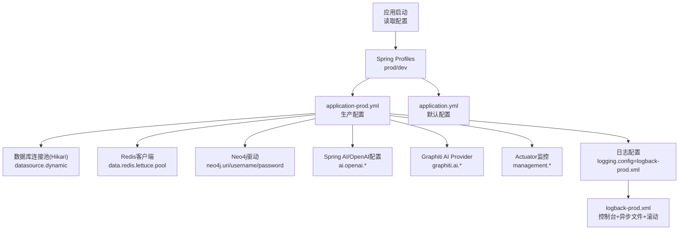
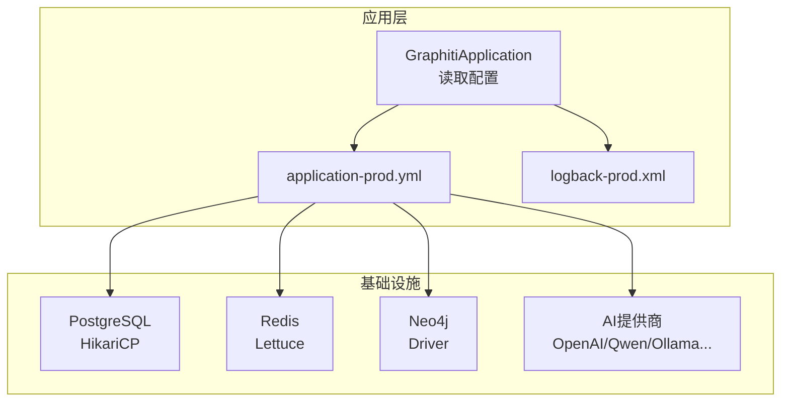
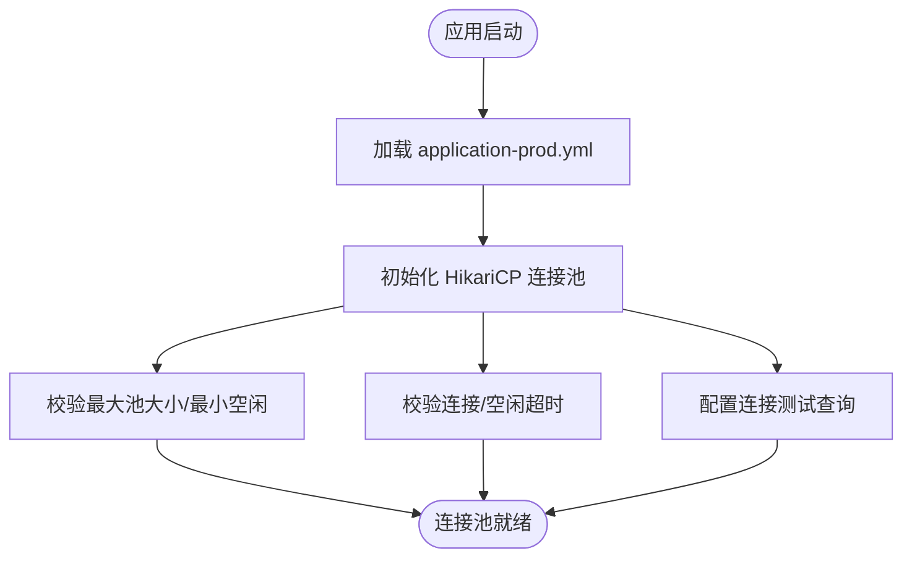
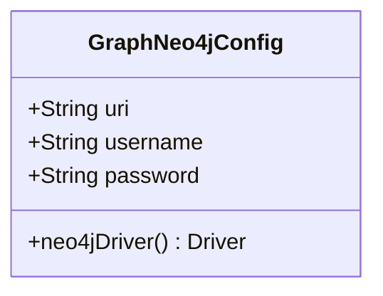
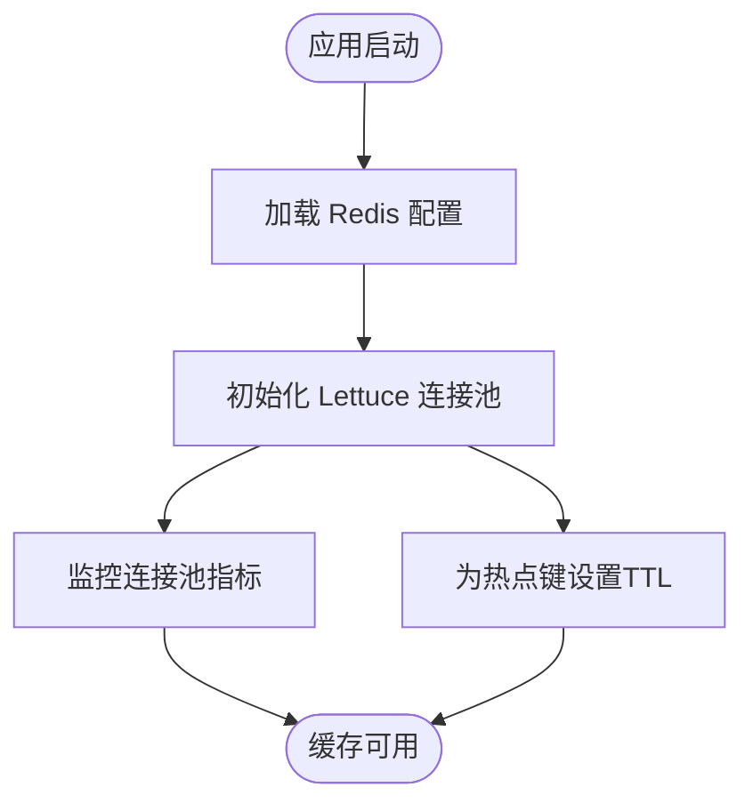
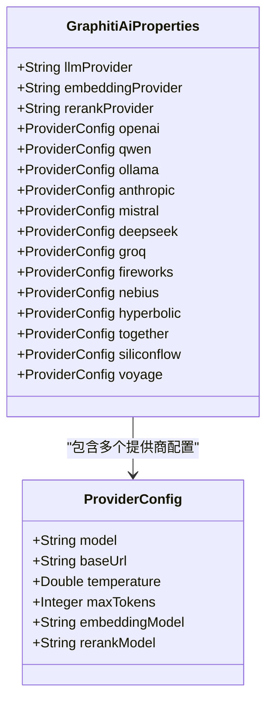
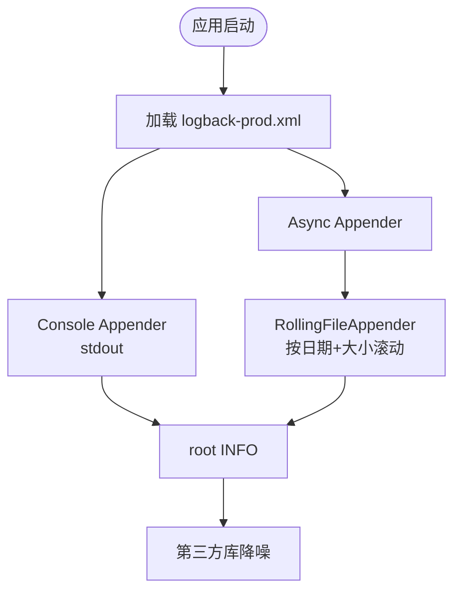
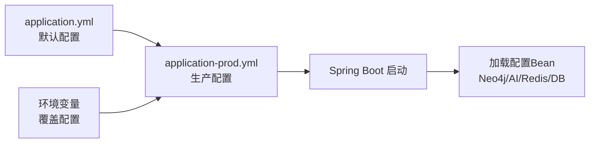

# 生产环境配置

<!--<cite>
**本文引用的文件**
- [application-prod.yml](file://config/application-prod.yml)
- [logback-prod.xml](file://config/logback-prod.xml)
- [application.yml](file://graphiti-server/src/main/resources/application.yml)
- [application-dev.yml](file://graphiti-server/src/main/resources/application-dev.yml)
- [GraphNeo4jConfig.java](file://graphiti-module-core/src/main/java/com/graphiti/module/graphiti/config/GraphNeo4jConfig.java)
- [GraphitiAiProperties.java](file://graphiti-module-core/src/main/java/com/graphiti/module/graphiti/config/GraphitiAiProperties.java)
- [docker-compose.yml](file://docker-compose.yml)
- [docker-compose.prod.yml](file://docker-compose.prod.yml)
</cite>-->

## 目录
1. [简介](#简介)
2. [项目结构](#项目结构)
3. [核心组件](#核心组件)
4. [架构总览](#架构总览)
5. [详细组件分析](#详细组件分析)
6. [依赖分析](#依赖分析)
7. [性能考虑](#性能考虑)
8. [故障排查指南](#故障排查指南)
9. [结论](#结论)
10. [附录](#附录)

## 简介
本指南面向Graphiti-Java生产环境部署，聚焦以下目标：
- 解析并解释生产配置文件application-prod.yml中的关键项：数据库连接池、Neo4j图数据库、Redis缓存、AI服务提供商密钥与模型参数。
- 解析日志配置logback-prod.xml的级别、输出格式与滚动策略。
- 提供环境变量配置模板与敏感信息保护建议。
- 给出JVM参数、线程池与连接超时的调优要点。
- 说明配置文件的优先级与覆盖规则，并提供配置验证与热更新机制说明。

## 项目结构
生产相关配置主要分布在如下位置：
- 生产配置文件：config/application-prod.yml
- 生产日志配置：config/logback-prod.xml
- 应用默认配置：graphiti-server/src/main/resources/application.yml
- 开发配置模板：graphiti-server/src/main/resources/application-dev.yml
- Neo4j配置类：graphiti-module-core/config/GraphNeo4jConfig.java
- AI配置类：graphiti-module-core/config/GraphitiAiProperties.java
- 容器编排与环境变量：docker-compose.yml、docker-compose.prod.yml

图表来源
- [application-prod.yml:10-205](file://config/application-prod.yml#L10-L205)
- [application.yml:3-67](file://graphiti-server/src/main/resources/application.yml#L3-L67)
- [logback-prod.xml:8-83](file://config/logback-prod.xml#L8-L83)

章节来源
- [application-prod.yml:10-205](file://config/application-prod.yml#L10-L205)
- [application.yml:3-67](file://graphiti-server/src/main/resources/application.yml#L3-L67)
- [application-dev.yml:1-676](file://graphiti-server/src/main/resources/application-dev.yml#L1-L676)

## 核心组件
本节对生产环境的关键配置项进行逐项解读与最佳实践建议。

- 数据库连接池（HikariCP）
  - 关键参数：最大池大小、最小空闲、连接超时、空闲超时、最大生命周期、测试查询。
  - 生产建议：根据QPS与慢查询情况调整最大池大小；确保连接超时与业务请求超时匹配，避免长事务占用连接。
  - 参考路径：[application-prod.yml:25-31](file://config/application-prod.yml#L25-L31)

- Redis缓存
  - 主机与端口、连接超时、Lettuce连接池参数（最大活跃、最大空闲、最小空闲、最大等待）。
  - 生产建议：最大活跃数与业务并发峰值匹配；为热点键设置合理TTL；开启读写分离（如适用）。
  - 参考路径：[application-prod.yml:34-44](file://config/application-prod.yml#L34-L44)

- Neo4j图数据库
  - 驱动创建基于配置前缀neo4j，读取uri、用户名与密码。
  - 生产建议：使用独立网络与只读副本；开启驱动级别的重试与超时；监控慢查询。
  - 参考路径：[application-prod.yml:168-172](file://config/application-prod.yml#L168-L172)、[GraphNeo4jConfig.java:20-45](file://graphiti-module-core/src/main/java/com/graphiti/module/graphiti/config/GraphNeo4jConfig.java#L20-L45)

- AI服务提供商密钥与模型参数
  - Spring AI OpenAI基础配置与模型选项。
  - Graphiti AI Provider选择与各厂商详细配置（模型、温度、最大token、嵌入模型等）。
  - 生产建议：将密钥置于安全的环境变量或配置中心；按SLA选择模型与温度；为嵌入与rerank分别配置。
  - 参考路径：[application-prod.yml:76-161](file://config/application-prod.yml#L76-L161)、[GraphitiAiProperties.java:15-96](file://graphiti-module-core/src/main/java/com/graphiti/module/graphiti/config/GraphitiAiProperties.java#L15-L96)

- Actuator监控
  - 暴露端点、健康检查探针、数据库与Redis健康指示器。
  - 生产建议：仅暴露必要端点；限制访问；结合Prometheus/Grafana监控。
  - 参考路径：[application-prod.yml:174-195](file://config/application-prod.yml#L174-L195)

- 日志配置
  - 生产使用logback-prod.xml，控制台输出与异步文件滚动日志。
  - 生产建议：统一JSON格式；按日期+大小滚动；异步写入降低IO阻塞。
  - 参考路径：[application-prod.yml:196-205](file://config/application-prod.yml#L196-L205)、[logback-prod.xml:8-83](file://config/logback-prod.xml#L8-L83)

章节来源
- [application-prod.yml:14-205](file://config/application-prod.yml#L14-L205)
- [GraphNeo4jConfig.java:17-45](file://graphiti-module-core/src/main/java/com/graphiti/module/graphiti/config/GraphNeo4jConfig.java#L17-L45)
- [GraphitiAiProperties.java:13-96](file://graphiti-module-core/src/main/java/com/graphiti/module/graphiti/config/GraphitiAiProperties.java#L13-L96)
- [logback-prod.xml:8-83](file://config/logback-prod.xml#L8-L83)

## 架构总览
下图展示生产环境配置在系统中的作用与交互：

图表来源
- [application-prod.yml:10-205](file://config/application-prod.yml#L10-L205)
- [logback-prod.xml:8-83](file://config/logback-prod.xml#L8-L83)

## 详细组件分析

### 数据库连接池（HikariCP）配置
- 参数说明
  - 最大池大小：决定并发连接上限。
  - 最小空闲：维持的空闲连接数。
  - 连接超时：获取连接的最大等待时间。
  - 空闲超时：连接在池中空闲的最大时间。
  - 最大生命周期：连接的最长存活时间。
  - 测试查询：验证连接有效性。
- 性能与稳定性建议
  - 结合压测结果与慢查询分析，动态调整最大池大小与空闲策略。
  - 将连接超时与业务超时保持一致，避免“幽灵连接”。
  - 定期巡检连接泄漏与长时间事务。
- 参考路径
  - [application-prod.yml:25-31](file://config/application-prod.yml#L25-L31)

图表来源
- [application-prod.yml:25-31](file://config/application-prod.yml#L25-L31)

章节来源
- [application-prod.yml:25-31](file://config/application-prod.yml#L25-L31)

### Neo4j图数据库配置
- 配置读取与驱动创建
  - 通过@ConfigurationProperties(prefix = "neo4j")绑定配置。
  - 使用GraphDatabase.driver(uri, AuthTokens.basic(username, password))创建Driver Bean。
- 生产建议
  - 使用独立网络隔离；为只读查询使用只读副本。
  - 配置驱动超时与重试策略；监控慢查询与锁等待。
- 参考路径
  - [application-prod.yml:168-172](file://config/application-prod.yml#L168-L172)
  - [GraphNeo4jConfig.java:20-45](file://graphiti-module-core/src/main/java/com/graphiti/module/graphiti/config/GraphNeo4jConfig.java#L20-L45)

图表来源
- [GraphNeo4jConfig.java:17-45](file://graphiti-module-core/src/main/java/com/graphiti/module/graphiti/config/GraphNeo4jConfig.java#L17-L45)

章节来源
- [application-prod.yml:168-172](file://config/application-prod.yml#L168-L172)
- [GraphNeo4jConfig.java:17-45](file://graphiti-module-core/src/main/java/com/graphiti/module/graphiti/config/GraphNeo4jConfig.java#L17-L45)

### Redis缓存配置
- 关键参数
  - 主机与端口、连接超时。
  - Lettuce连接池：最大活跃、最大空闲、最小空闲、最大等待。
- 生产建议
  - 最大活跃数与业务峰值匹配；为热点键设置TTL与过期策略。
  - 监控连接池耗尽与命令超时；必要时启用多级缓存。
- 参考路径
  - [application-prod.yml:34-44](file://config/application-prod.yml#L34-L44)

图表来源
- [application-prod.yml:34-44](file://config/application-prod.yml#L34-L44)

章节来源
- [application-prod.yml:34-44](file://config/application-prod.yml#L34-L44)

### AI服务提供商密钥与模型参数
- Spring AI OpenAI配置
  - API密钥、基础URL、聊天与嵌入模型、温度与维度等。
- Graphiti AI Provider选择
  - LLM/Embedding/Rerank提供商选择与各厂商详细配置（模型、温度、最大token、嵌入模型等）。
- 生产建议
  - 将密钥置于安全的环境变量或配置中心；按SLA选择模型与温度；为嵌入与rerank分别配置。
- 参考路径
  - [application-prod.yml:76-161](file://config/application-prod.yml#L76-L161)
  - [GraphitiAiProperties.java:15-96](file://graphiti-module-core/src/main/java/com/graphiti/module/graphiti/config/GraphitiAiProperties.java#L15-L96)

图表来源
- [GraphitiAiProperties.java:13-96](file://graphiti-module-core/src/main/java/com/graphiti/module/graphiti/config/GraphitiAiProperties.java#L13-L96)

章节来源
- [application-prod.yml:76-161](file://config/application-prod.yml#L76-L161)
- [GraphitiAiProperties.java:13-96](file://graphiti-module-core/src/main/java/com/graphiti/module/graphiti/config/GraphitiAiProperties.java#L13-L96)

### 日志配置（logback-prod.xml）
- 输出与格式
  - 控制台输出至stdout（由Docker log driver收集）。
  - 文件输出采用滚动策略（按日期+大小），保留30天。
  - 异步Appender提升写入性能。
- 日志级别
  - root/INFO，第三方库按需降噪（如Spring、Security、Neo4j驱动、HTTP客户端、Lettuce、Hikari）。
- 生产建议
  - 统一使用JSON格式（可选logstash-logback-encoder）；严格控制敏感字段脱敏。
- 参考路径
  - [application-prod.yml:196-205](file://config/application-prod.yml#L196-L205)
  - [logback-prod.xml:8-83](file://config/logback-prod.xml#L8-L83)

图表来源
- [logback-prod.xml:26-56](file://config/logback-prod.xml#L26-L56)
- [logback-prod.xml:73-82](file://config/logback-prod.xml#L73-L82)

章节来源
- [application-prod.yml:196-205](file://config/application-prod.yml#L196-L205)
- [logback-prod.xml:8-83](file://config/logback-prod.xml#L8-L83)

## 依赖分析
- 配置文件优先级与覆盖规则
  - application.yml为默认配置，application-prod.yml为生产配置。
  - Spring Boot通过profiles激活不同配置；生产环境通过SPRING_PROFILES_ACTIVE=prod加载。
  - 环境变量可覆盖配置文件中的值（如数据库URL、Redis连接、Neo4j凭据、AI密钥等）。
- 参考路径
  - [application.yml:6-7](file://graphiti-server/src/main/resources/application.yml#L6-L7)
  - [application-prod.yml:10-205](file://config/application-prod.yml#L10-L205)
  - [docker-compose.prod.yml:26](file://docker-compose.prod.yml#L26)

图表来源
- [application.yml:6-7](file://graphiti-server/src/main/resources/application.yml#L6-L7)
- [application-prod.yml:10-205](file://config/application-prod.yml#L10-L205)
- [docker-compose.prod.yml:26](file://docker-compose.prod.yml#L26)

章节来源
- [application.yml:6-7](file://graphiti-server/src/main/resources/application.yml#L6-L7)
- [application-prod.yml:10-205](file://config/application-prod.yml#L10-L205)
- [docker-compose.prod.yml:26](file://docker-compose.prod.yml#L26)

## 性能考虑
- JVM参数调优（容器内）
  - 示例：堆初始与最大、容器支持、最大RAM百分比。
  - 参考路径：[docker-compose.prod.yml:28](file://docker-compose.prod.yml#L28)
- 连接池与线程池
  - HikariCP：最大池大小、最小空闲、连接超时。
  - Redis：Lettuce连接池参数。
  - 参考路径：[application-prod.yml:25-31](file://config/application-prod.yml#L25-L31)、[application-prod.yml:39-44](file://config/application-prod.yml#L39-L44)
- 连接超时设置
  - 数据库与Redis均提供超时配置；应与业务请求超时保持一致。
  - 参考路径：[application-prod.yml:28](file://config/application-prod.yml#L28)、[application-prod.yml:38](file://config/application-prod.yml#L38)

章节来源
- [docker-compose.prod.yml:28](file://docker-compose.prod.yml#L28)
- [application-prod.yml:25-44](file://config/application-prod.yml#L25-L44)

## 故障排查指南
- 配置验证
  - 启动时Spring会尝试绑定配置；若缺失必填项（如Neo4j用户名/密码、AI密钥），启动失败。
  - 建议在CI中加入配置校验步骤（如使用Spring Boot Test加载配置）。
- 健康检查与监控
  - Actuator暴露health、metrics、prometheus端点；生产建议仅暴露必要端点并限权访问。
  - 参考路径：[application-prod.yml:175-195](file://config/application-prod.yml#L175-L195)
- 日志定位
  - 生产日志级别为INFO；第三方库按需降噪；异常与错误应具备上下文与追踪ID。
  - 参考路径：[logback-prod.xml:73-82](file://config/logback-prod.xml#L73-L82)
- 热更新机制
  - Spring Cloud Config或外部配置中心可实现配置热更新；本仓库未内置该能力，需自行集成。
  - 对于非敏感配置（如日志级别、部分业务开关），可通过Actuator的env端点或配置中心推送实现。

章节来源
- [application-prod.yml:175-195](file://config/application-prod.yml#L175-L195)
- [logback-prod.xml:73-82](file://config/logback-prod.xml#L73-L82)

## 结论
本指南梳理了Graphiti-Java生产环境的关键配置项与最佳实践，涵盖数据库连接池、Redis缓存、Neo4j图数据库、AI服务提供商密钥与模型参数、日志配置、JVM与连接超时调优、配置优先级与覆盖规则，以及配置验证与热更新机制。建议在上线前完成压测与巡检，并建立完善的配置变更流程与审计机制。

## 附录

### 环境变量配置模板（生产）
- 数据库
  - SPRING_DATASOURCE_URL
  - SPRING_DATASOURCE_USERNAME
  - SPRING_DATASOURCE_PASSWORD
- Redis
  - SPRING_DATA_REDIS_HOST
  - SPRING_DATA_REDIS_PORT
- Neo4j
  - NEO4J_URI
  - NEO4J_USERNAME
  - NEO4J_PASSWORD
- AI提供商（以OpenAI为例）
  - SPRING_AI_OPENAI_API_KEY
  - SPRING_AI_OPENAI_BASE_URL
  - SPRING_AI_OPENAI_CHAT_MODEL
  - SPRING_AI_OPENAI_EMBEDDING_MODEL
  - SPRING_AI_OPENAI_TEMPERATURE
- Graphiti AI Provider
  - GRAPHTI_AI_LLM_PROVIDER
  - GRAPHTI_AI_EMBEDDING_PROVIDER
  - GRAPHTI_AI_RERANK_PROVIDER
  - GRAPHTI_AI_OPENAI_MODEL
  - GRAPHTI_AI_OPENAI_BASE_URL
  - GRAPHTI_AI_OPENAI_TEMPERATURE
  - GRAPHTI_AI_OPENAI_MAX_TOKENS
  - GRAPHTI_AI_OPENAI_EMBEDDING_MODEL
- JWT
  - GRAPHTI_SECURITY_JWT_SECRET
  - GRAPHTI_SECURITY_JWT_EXPIRATION
- Spring Boot
  - SPRING_PROFILES_ACTIVE=prod
  - LOGGING_LEVEL_ROOT
  - LOGGING_LEVEL_COM_GRAPHTI
  - LOGGING_LEVEL_ORG_SPRINGFRAMEWORK

参考路径
- [docker-compose.yml:30-54](file://docker-compose.yml#L30-L54)
- [docker-compose.prod.yml:24-32](file://docker-compose.prod.yml#L24-L32)
- [application-prod.yml:14-166](file://config/application-prod.yml#L14-L166)

### 敏感信息保护方案
- 将密钥与密码放入环境变量或配置中心（如Vault/KMS），不在代码仓库中存储明文。
- 在日志中对敏感字段进行脱敏（如掩码、替换）。
- 限制配置文件与日志文件的访问权限，仅授予运维必要人员。
- 定期轮换密钥与JWT密钥，建立审计与告警机制。

参考路径
- [application-prod.yml:80](file://config/application-prod.yml#L80)
- [application-prod.yml:165](file://config/application-prod.yml#L165)
- [logback-prod.xml:16-24](file://config/logback-prod.xml#L16-L24)