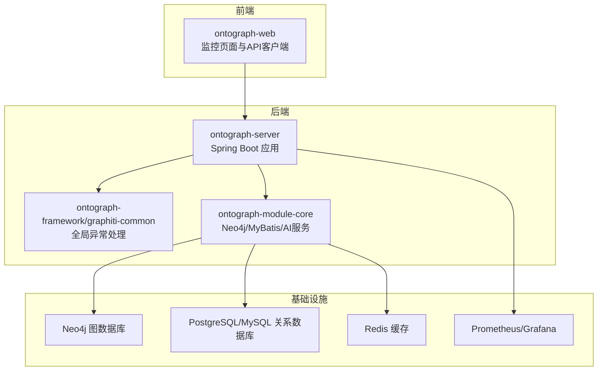
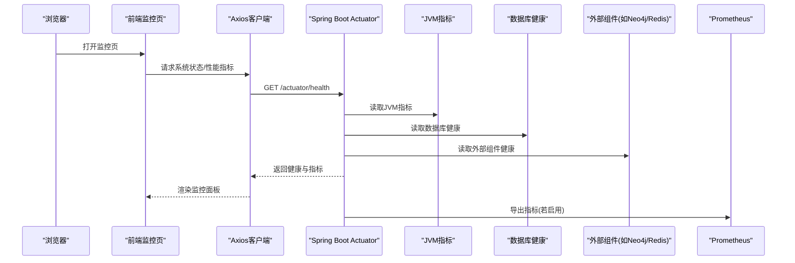
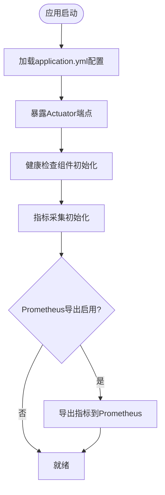
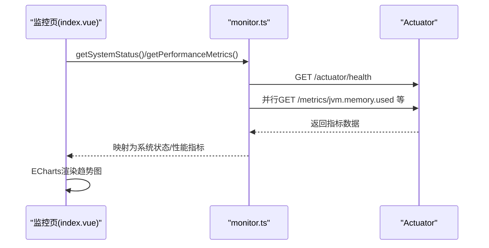
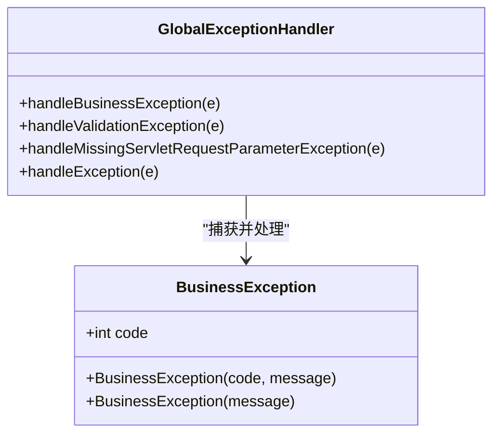
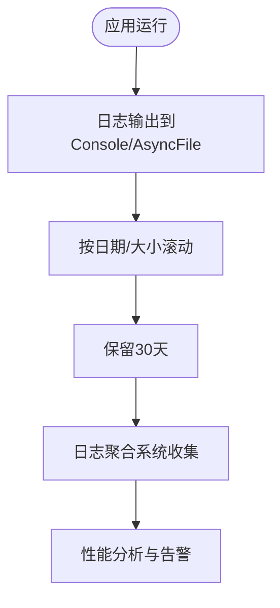
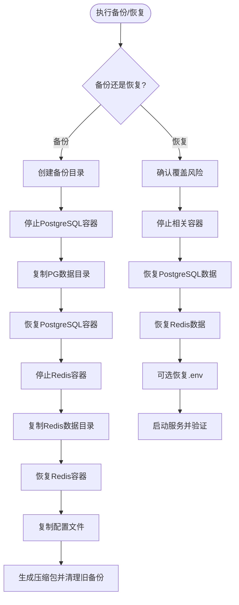
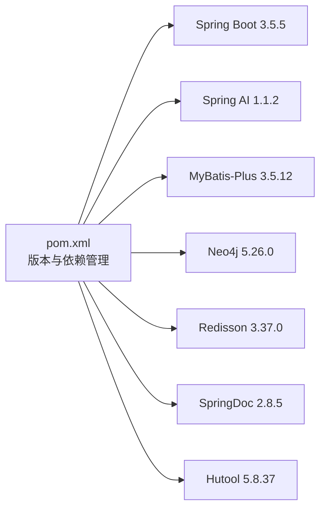

# 监控运维

<!--<cite>
**本文引用的文件**
- [README.md](file://README.md)
- [application.yml](file://ontograph-server/src/main/resources/application.yml)
- [application-dev.yml](file://ontograph-server/src/main/resources/application-dev.yml)
- [monitor.ts](file://ontograph-web/src/api/monitor.ts)
- [monitor/index.vue](file://ontograph-web/src/views/monitor/index.vue)
- [GlobalExceptionHandler.java](file://ontograph-framework/graphiti-common/src/main/java/com/graphiti/common/exception/GlobalExceptionHandler.java)
- [BusinessException.java](file://ontograph-framework/graphiti-common/src/main/java/com/graphiti/common/exception/BusinessException.java)
- [logback-prod.xml](file://config/logback-prod.xml)
- [OpenAiLlmClientServiceImpl.java](file://ontograph-module-core/src/main/java/com/Graphiti/module/graphiti/service/impl/ai/OpenAiLlmClientServiceImpl.java)
- [backup.sh](file://scripts/backup.sh)
- [restore.sh](file://scripts/restore.sh)
- [pom.xml](file://pom.xml)
</cite>-->

## 目录
1. [简介](#简介)
2. [项目结构](#项目结构)
3. [核心组件](#核心组件)
4. [架构总览](#架构总览)
5. [详细组件分析](#详细组件分析)
6. [依赖分析](#依赖分析)
7. [性能考虑](#性能考虑)
8. [故障排查指南](#故障排查指南)
9. [结论](#结论)
10. [附录](#附录)

## 简介
本文件面向OntoGraph项目的监控运维实践，围绕Spring Boot Actuator监控指标、健康检查、指标采集与应用状态监控展开；提供Prometheus/Grafana集成建议与自定义指标定义思路；解释日志聚合、错误追踪与性能分析工具配置；给出备份脚本backup.sh与恢复脚本restore.sh的使用方法与恢复流程；并规划告警规则、通知渠道与故障响应流程，以及资源使用、数据库性能与AI服务调用监控的运维仪表板与KPI指标。

## 项目结构
- 后端入口位于ontograph-server模块，配置文件位于resources目录，包含基础配置与开发配置。
- 前端ontograph-web提供监控页面与Actuator数据对接。
- 框架层ontograph-framework提供通用异常处理与安全等基础设施。
- 核心模块ontograph-module-core包含Neo4j、MyBatis、AI服务等业务能力。
- 运维脚本位于scripts目录，日志配置位于config目录。

**章节来源**
- [README.md: 第71-166行:71-166](file://README.md#L71-L166)

## 核心组件
- Spring Boot Actuator：提供健康检查、指标导出与信息接口，支持Prometheus导出开关与端点暴露控制。
- 前端监控页：基于Axios访问Actuator端点，展示系统状态、性能趋势与服务健康。
- 全局异常处理：统一捕获业务异常、参数校验异常与未知异常，输出标准化响应。
- 日志配置：生产环境采用JSON格式日志输出，便于日志聚合系统收集与解析。
- 备份与恢复脚本：自动化备份PostgreSQL与Redis数据，生成压缩包并支持恢复流程。

**章节来源**
- [application.yml: 第43-67行:43-67](file://ontograph-server/src/main/resources/application.yml#L43-L67)
- [application-dev.yml: 第615-635行:615-635](file://ontograph-server/src/main/resources/application-dev.yml#L615-L635)
- [monitor.ts: 第74-196行:74-196](file://ontograph-web/src/api/monitor.ts#L74-L196)
- [monitor/index.vue: 第1-607行:1-607](file://ontograph-web/src/views/monitor/index.vue#L1-L607)
- [GlobalExceptionHandler.java: 第17-74行:17-74](file://ontograph-framework/graphiti-common/src/main/java/com/graphiti/common/exception/GlobalExceptionHandler.java#L17-L74)
- [logback-prod.xml: 第59-70行:59-70](file://config/logback-prod.xml#L59-L70)
- [backup.sh: 第1-149行:1-149](file://scripts/backup.sh#L1-L149)
- [restore.sh: 第1-172行:1-172](file://scripts/restore.sh#L1-L172)

## 架构总览
下图展示了监控运维的关键交互：前端监控页通过Axios调用后端Actuator端点，后端Actuator汇总JVM、数据库与外部组件健康状态，并可导出至Prometheus；日志系统输出到stdout与文件，便于集中收集与分析。

**图表来源**
- [monitor.ts: 第74-196行:74-196](file://ontograph-web/src/api/monitor.ts#L74-L196)
- [application.yml: 第43-67行:43-67](file://ontograph-server/src/main/resources/application.yml#L43-L67)

**章节来源**
- [monitor.ts: 第74-196行:74-196](file://ontograph-web/src/api/monitor.ts#L74-L196)
- [application.yml: 第43-67行:43-67](file://ontograph-server/src/main/resources/application.yml#L43-L67)

## 详细组件分析

### Spring Boot Actuator监控指标与健康检查
- 端点暴露：生产配置默认暴露health、metrics、info端点；开发配置可暴露全部端点以便调试。
- 健康检查：包含数据库、Redis与探针(liveness/readiness)，可扩展自定义健康指示器。
- 指标导出：Prometheus导出开关默认关闭，需按需开启以接入Prometheus。
- 日志级别：开发配置中对com.graphiti、security、web、boot等包开启DEBUG，便于问题定位。

**图表来源**
- [application.yml: 第43-67行:43-67](file://ontograph-server/src/main/resources/application.yml#L43-L67)
- [application-dev.yml: 第615-635行:615-635](file://ontograph-server/src/main/resources/application-dev.yml#L615-L635)

**章节来源**
- [application.yml: 第43-67行:43-67](file://ontograph-server/src/main/resources/application.yml#L43-L67)
- [application-dev.yml: 第615-635行:615-635](file://ontograph-server/src/main/resources/application-dev.yml#L615-L635)

### 前端监控面板与Actuator对接
- 系统状态：通过GET /actuator/health获取组件健康状态，映射为Neo4j、MySQL、Redis健康状态。
- 性能指标：并发获取jvm.memory.used、jvm.memory.committed、process.cpu.usage、jvm.threads.live等指标，计算CPU使用率、内存使用率与线程数。
- API日志：预留接口，当前返回空数据，后续可接入审计或访问日志。
- 图表渲染：ECharts展示CPU、内存、磁盘使用率趋势，支持1小时、6小时、24小时、7天时间粒度切换。

**图表来源**
- [monitor.ts: 第74-196行:74-196](file://ontograph-web/src/api/monitor.ts#L74-L196)
- [monitor/index.vue: 第256-492行:256-492](file://ontograph-web/src/views/monitor/index.vue#L256-L492)

**章节来源**
- [monitor.ts: 第74-196行:74-196](file://ontograph-web/src/api/monitor.ts#L74-L196)
- [monitor/index.vue: 第1-607行:1-607](file://ontograph-web/src/views/monitor/index.vue#L1-L607)

### 全局异常处理与错误追踪
- 全局异常处理器统一捕获业务异常、参数校验异常与未知异常，输出标准化错误响应。
- BusinessException携带业务错误码，便于前端与监控系统识别与分类统计。
- 建议结合日志系统与告警平台，对高频异常进行告警与根因分析。

**图表来源**
- [GlobalExceptionHandler.java: 第17-74行:17-74](file://ontograph-framework/graphiti-common/src/main/java/com/graphiti/common/exception/GlobalExceptionHandler.java#L17-L74)
- [BusinessException.java: 第1-32行:1-32](file://ontograph-framework/graphiti-common/src/main/java/com/graphiti/common/exception/BusinessException.java#L1-L32)

**章节来源**
- [GlobalExceptionHandler.java: 第17-74行:17-74](file://ontograph-framework/graphiti-common/src/main/java/com/graphiti/common/exception/GlobalExceptionHandler.java#L17-L74)
- [BusinessException.java: 第1-32行:1-32](file://ontograph-framework/graphiti-common/src/main/java/com/graphiti/common/exception/BusinessException.java#L1-L32)

### 日志聚合与性能分析
- 生产日志：采用Console与异步文件输出，支持按日期与大小滚动，保留30天。
- JSON格式：可通过引入logstash-logback-encoder实现JSON输出，便于日志聚合系统解析。
- 性能分析：结合Actuator指标与ECharts趋势图，定位CPU、内存、线程数峰值与异常波动。

**图表来源**
- [logback-prod.xml: 第59-70行:59-70](file://config/logback-prod.xml#L59-L70)

**章节来源**
- [logback-prod.xml: 第59-70行:59-70](file://config/logback-prod.xml#L59-L70)

### 备份与恢复脚本
- backup.sh：备份PostgreSQL与Redis数据目录，复制.env与docker-compose配置，生成压缩包并清理30天前旧备份。
- restore.sh：确认覆盖风险后，停止相关容器，恢复PostgreSQL与Redis数据，可选择恢复.env配置，最后启动服务并验证健康状态。

**图表来源**
- [backup.sh: 第1-149行:1-149](file://scripts/backup.sh#L1-L149)
- [restore.sh: 第1-172行:1-172](file://scripts/restore.sh#L1-L172)

**章节来源**
- [backup.sh: 第1-149行:1-149](file://scripts/backup.sh#L1-L149)
- [restore.sh: 第1-172行:1-172](file://scripts/restore.sh#L1-L172)

### Prometheus/Grafana集成与自定义指标
- 集成建议：在application.yml中启用Prometheus导出开关，确保Actuator端点可被Prometheus抓取。
- 自定义指标：可在业务层通过MeterRegistry注册计数器、直方图等指标，结合业务场景（如API调用次数、AI调用耗时）进行观测。
- Grafana仪表板：基于Prometheus数据源构建仪表板，展示CPU、内存、请求量、错误率、AI调用成功率与耗时分布。

**章节来源**
- [application.yml: 第52-55行:52-55](file://ontograph-server/src/main/resources/application.yml#L52-L55)

### AI服务调用监控
- OpenAI客户端实现：封装ChatClient调用，记录异常日志，便于问题定位与重试策略制定。
- 建议：对AI调用增加超时、重试与熔断机制，记录调用耗时、成功率与错误码，纳入Prometheus/Grafana监控。

**章节来源**
- [OpenAiLlmClientServiceImpl.java: 第15-111行:15-111](file://ontograph-module-core/src/main/java/com/graphiti/module/graphiti/service/impl/ai/OpenAiLlmClientServiceImpl.java#L15-L111)

## 依赖分析
- Spring Boot版本：3.5.5，提供Actuator、Web、OpenAPI等能力。
- Spring AI版本：1.1.2，支持多提供商LLM与嵌入模型。
- MyBatis-Plus版本：3.5.12，提供数据访问与动态数据源。
- Neo4j驱动版本：5.26.0，支持向量索引与图查询。
- Redisson版本：3.37.0，提供Redis缓存与分布式能力。
- Hutool版本：5.8.37，提供常用工具类。
- SpringDoc版本：2.8.5，提供OpenAPI文档。

**图表来源**
- [pom.xml: 第22-43行:22-43](file://pom.xml#L22-L43)

**章节来源**
- [pom.xml: 第22-43行:22-43](file://pom.xml#L22-L43)

## 性能考虑
- Actuator指标采集：避免在高并发场景下频繁拉取大量指标，建议分组并发请求与缓存短期结果。
- 日志输出：生产环境采用异步文件输出，降低I/O阻塞；合理设置滚动策略与保留周期。
- AI调用：对第三方LLM接口增加超时与重试，必要时引入熔断与降级策略，避免雪崩效应。
- 前端图表：ECharts渲染大时间窗口数据时注意内存占用，建议限制最大数据点数量或采用分页加载。

## 故障排查指南
- 健康检查失败：检查数据库连接、Redis连通性与外部组件可用性；查看Actuator健康详情与日志。
- 指标缺失：确认Prometheus导出开关与端点暴露配置；检查网络连通与认证。
- 异常处理：关注全局异常处理器输出的错误码与消息，结合日志定位具体异常类型。
- 备份恢复：执行前做好数据备份，恢复时确认覆盖风险；恢复后验证服务状态与关键接口健康。

**章节来源**
- [application.yml: 第43-67行:43-67](file://ontograph-server/src/main/resources/application.yml#L43-L67)
- [GlobalExceptionHandler.java: 第17-74行:17-74](file://ontograph-framework/graphiti-common/src/main/java/com/graphiti/common/exception/GlobalExceptionHandler.java#L17-L74)
- [backup.sh: 第1-149行:1-149](file://scripts/backup.sh#L1-L149)
- [restore.sh: 第1-172行:1-172](file://scripts/restore.sh#L1-L172)

## 结论
通过Actuator健康检查与指标导出、前端监控面板、全局异常处理与日志配置、备份恢复脚本以及AI服务监控，OntoGraph具备完善的监控运维能力。建议在生产环境中启用Prometheus导出与日志聚合，建立告警与故障响应流程，并持续优化指标体系与仪表板，以保障系统的稳定性与可观测性。

## 附录

### Prometheus/Grafana集成步骤
- 在application.yml中启用Prometheus导出开关。
- 配置Prometheus抓取后端Actuator端点。
- 在Grafana中添加Prometheus数据源并创建仪表板，展示关键KPI。

**章节来源**
- [application.yml: 第52-55行:52-55](file://ontograph-server/src/main/resources/application.yml#L52-L55)

### 自定义指标定义思路
- 计数器：记录API调用次数、错误次数。
- 直方图：记录AI调用耗时、数据库查询耗时。
- Gauge：记录当前活跃会话数、队列长度。

**章节来源**
- [monitor.ts: 第103-139行:103-139](file://ontograph-web/src/api/monitor.ts#L103-L139)

### 告警规则与通知渠道
- 告警规则：CPU使用率>80%持续5分钟、内存使用率>80%持续5分钟、服务不可用、AI调用错误率>5%。
- 通知渠道：邮件、企业微信、钉钉机器人。
- 故障响应流程：值班人员收到告警后，查看日志与监控面板，执行回滚或扩容，发布故障公告并复盘。

[本节为概念性内容，无需“章节来源”]

### 运维仪表板与KPI指标
- 仪表板：系统状态卡片、性能趋势图、服务健康状态、数据库信息、API请求日志。
- KPI指标：CPU使用率、内存使用率、磁盘使用率、请求量、错误率、AI调用成功率、平均响应时间。

**章节来源**
- [monitor/index.vue: 第1-607行:1-607](file://ontograph-web/src/views/monitor/index.vue#L1-L607)